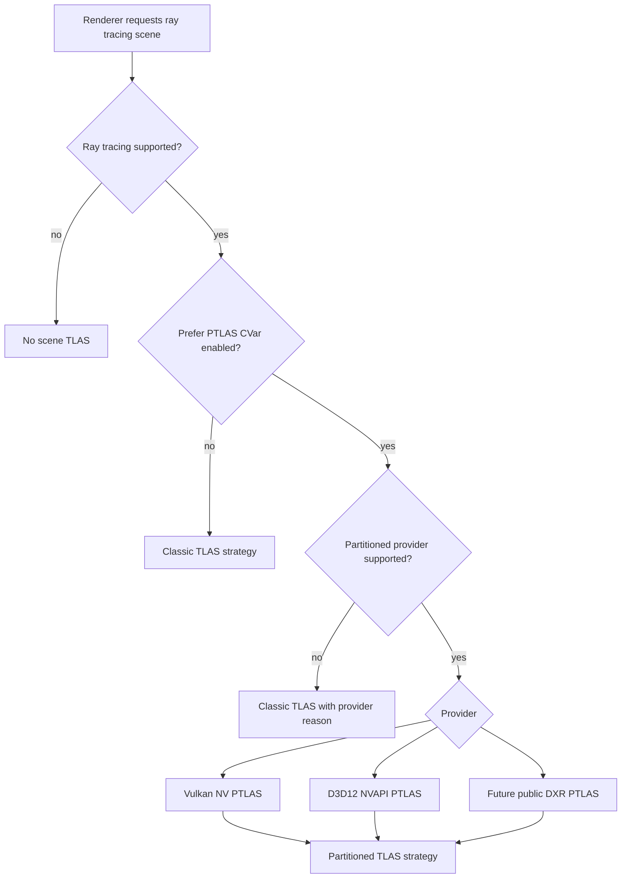
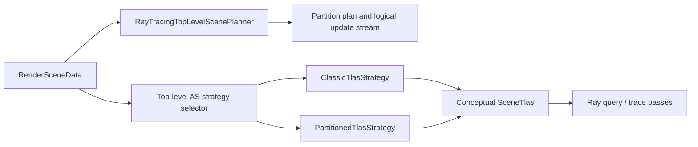
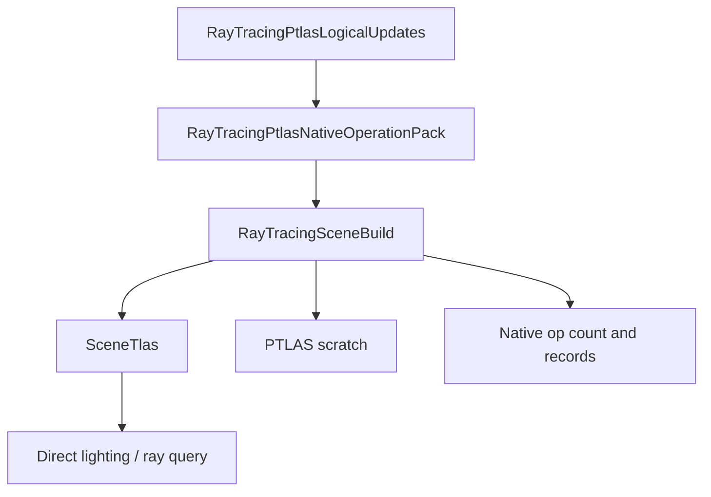
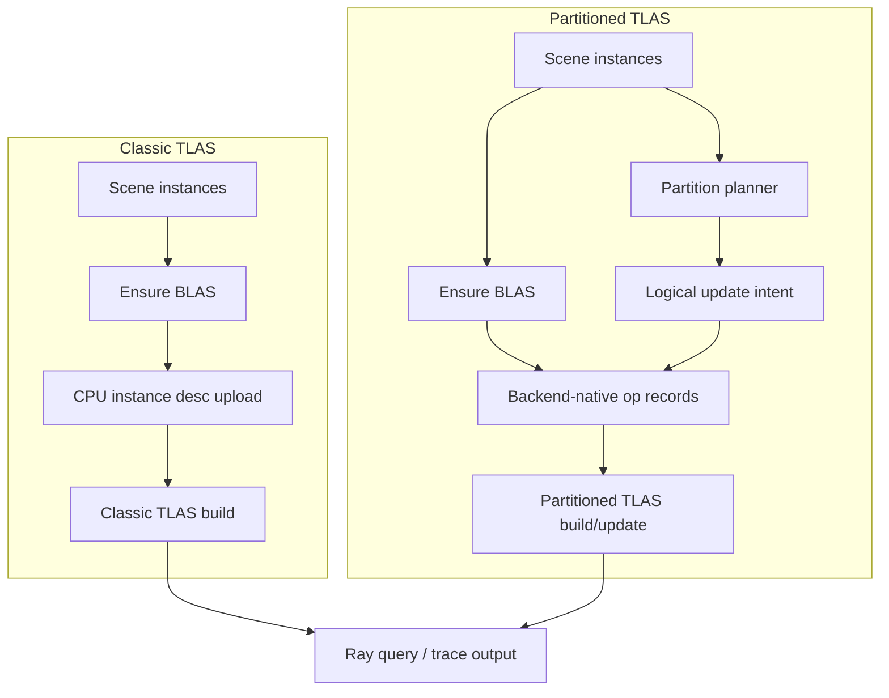
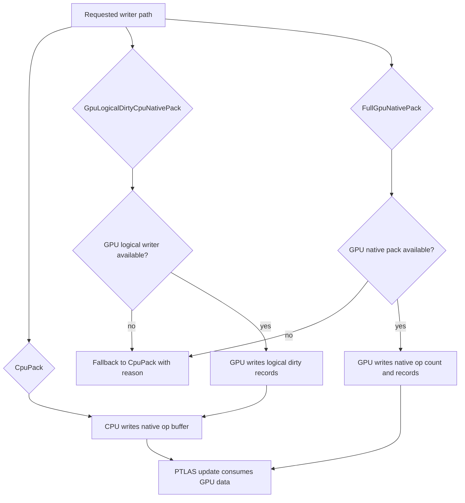
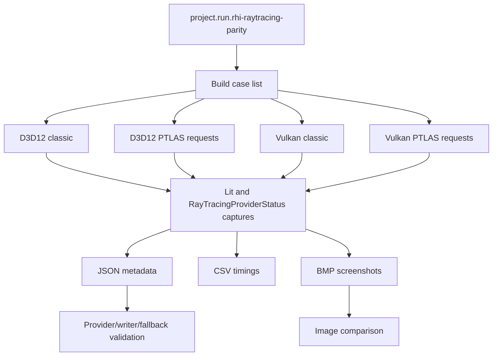

# Partitioned TLAS Reference Demo Package

Status: reference/demo documentation package.

Related plan: [Partitioned TLAS Implementation Plan](../plans/partitioned-tlas-implementation-plan.md)

Baseline evidence: [Partitioned TLAS Baseline Evidence](partitioned-tlas-baseline.md)

## Purpose

This document turns the PTLAS implementation into a reviewable demo package. It should let a colleague run one launcher workflow, inspect captures, understand the architecture, and distinguish proven behavior from documented limitations before reading backend code.

The model follows the shape used by strong NVIDIA-style sample repositories:

- A runnable workflow is part of the feature.
- Visual debug output explains the algorithm.
- Provider capability and fallback reasons are explicit.
- Performance/correctness claims point to screenshots, metadata, timing CSV, or a known unsupported configuration.

## Quick Start

Build the editor and launcher:

```powershell
cmake --build build-vs2026 --config DevelopmentEditor --target ShowcaseEditor -- /nologo /v:minimal /m:1
cmake --build build-vs2026 --config DevelopmentEditor --target SparkleLauncher -- /nologo /v:minimal /m:1
```

Dry-run the launcher workflow:

```powershell
artifacts/dev/launcher/DevelopmentEditor/SparkleLauncher.exe --project Showcase --dry-run project.run.rhi-raytracing-parity
```

Run the capture/parity workflow:

```powershell
artifacts/dev/launcher/DevelopmentEditor/SparkleLauncher.exe --project Showcase --run project.run.rhi-raytracing-parity
```

Primary artifact directory:

```text
artifacts/dev/launcher-state/Logs/project.run.rhi-raytracing-parity/ParityArtifacts
```

Each case/viewmode should produce:

- `.bmp` screenshot.
- `.json` metadata.
- `.timing.csv` timing row.
- `.log` process log.

## Provider Selection



Reference code:

- `Engine/RHI/Public/RayTracing/RhiPartitionedTlasDesc.h`
- `Engine/Renderer/Private/RayTracing/RayTracingCapabilityReport.cpp`
- `Engine/Renderer/Private/RayTracing/RayTracingTopLevelAccelerationStructureStrategy.cpp`
- `Engine/Renderer/Private/RayTracing/RayTracingPartitionedTlasStrategy.cpp`

Review rule:

- Capability fields describe what the backend/API can do.
- Writer-selection fields describe what Sparkle actually selected this frame.
- Fallbacks are acceptable only when metadata records the reason.

## Strategy Selection



Reference code:

- `Engine/Renderer/Private/RayTracing/RayTracingClassicTlasStrategy.cpp`
- `Engine/Renderer/Private/RayTracing/RayTracingPartitionedTlasStrategy.cpp`
- `Engine/Renderer/Private/RayTracing/RayTracingTopLevelScenePlanner.cpp`
- `Engine/Renderer/Private/RayTracing/RenderRayTracingScene.cpp`

Design intent:

- Higher-level renderer code sees one conceptual `SceneTlas`.
- BLAS cache stays shared.
- Classic TLAS remains the fallback and comparison baseline.
- PTLAS provider details remain below the strategy and RHI service boundary.

## Frame Graph Resources



Reference code:

- `Engine/Renderer/Private/Frame/RayTracingScene.cpp`
- `Engine/Renderer/Private/Frame/RayTracingSceneFrameData.h`
- `Engine/Renderer/Private/Frame/RayTracingSceneFrameGraphResources.h`

Current contract:

- Classic TLAS and PTLAS both publish one conceptual `SceneTlas`.
- PTLAS operation resources are only bound through the frame graph when they are valid for the selected path.
- Barrier warning count must stay zero in classic and PTLAS captures.

Known limitation:

- Full GPU-native operation packing is not accepted until backend-private pack shaders write provider-native operation count/records and the frame graph shows those dependencies as active resources.

## Classic TLAS Vs PTLAS Build



Correctness claim:

- PTLAS changes top-level acceleration structure maintenance, not shading semantics.
- Final lit output should match the classic TLAS baseline for deterministic scenes unless a PTLAS diagnostic viewmode is active.

Evidence to inspect:

- `d3d12-classic/Lit.bmp`
- `d3d12-ptlas/Lit.bmp`
- `vulkan-classic/Lit.bmp`
- `vulkan-ptlas/Lit.bmp`
- Matching `.json` files for provider and fallback state.

## CPU Pack Vs GPU Pack



Writer paths:

| CVar value | Requested path | Accepted meaning |
|---:|---|---|
| `1` | `CpuPack` | CPU packs backend-native operation records. This is the bring-up, fallback, and validation oracle. |
| `2` | `GpuLogicalDirtyCpuNativePack` | GPU writes logical dirty records, then CPU packs native provider records. If the GPU logical writer is unavailable, metadata must report fallback to `CpuPack`. |
| `3` | `FullGpuNativePack` | GPU writes provider-native op count and op records consumed by PTLAS update without CPU readback. If unavailable, metadata must report fallback to `CpuPack`. |

Evidence fields:

- `requestedOperationWriterPath`
- `operationWriterPath`
- `operationWriterReason`
- `gpuDrivenOperationApiSupported`
- `gpuLogicalUpdateWriterAvailable`
- `gpuNativePackAvailable`
- `gpuNativePackSubmitted`
- `logicalUpdates`
- `nativeOperations`

Review rule:

- Do not claim the GPU pack path is accepted unless `operationWriterPath=FullGpuNativePack`, `gpuNativePackSubmitted=true`, and parity captures match the classic baseline.

## Launcher Parity Flow



Reference code:

- `Tools/Launcher/SparkleLauncher/Private/Launch/Smoke/RhiSmokeTestCatalog.cpp`
- `Tools/Launcher/SparkleLauncher/Private/Launch/Smoke/RhiSmokeParityTestPlan.cpp`
- `Tools/Launcher/SparkleLauncher/Private/Launch/Smoke/RhiSmokeParityArtifactValidation.cpp`
- `Engine/Application/Private/Validation/RhiSmokeCaptureArtifacts.cpp`

Current cases:

| Case | Backend | Prefer PTLAS | Requested writer |
|---|---|---:|---|
| `d3d12-classic` | D3D12 | no | `CpuPack` |
| `d3d12-ptlas` | D3D12 | yes | `CpuPack` |
| `d3d12-ptlas-gpu-logical` | D3D12 | yes | `GpuLogicalDirtyCpuNativePack` |
| `d3d12-ptlas-gpu-native` | D3D12 | yes | `FullGpuNativePack` |
| `vulkan-classic` | Vulkan | no | `CpuPack` |
| `vulkan-ptlas` | Vulkan | yes | `CpuPack` |
| `vulkan-ptlas-gpu-logical` | Vulkan | yes | `GpuLogicalDirtyCpuNativePack` |
| `vulkan-ptlas-gpu-native` | Vulkan | yes | `FullGpuNativePack` |

Current viewmodes captured by the launcher parity workflow:

- `Lit`
- `RayTracingProviderStatus`

## PTLAS Viewmode Capture Index

These viewmodes are the full reference-demo capture set. The parity workflow may capture a smaller subset; the article/demo workflow should eventually capture all rows.

| Viewmode | Purpose | Required artifact | Evidence field to correlate |
|---|---|---|---|
| `Lit` | Final shaded correctness image | `Lit.bmp`, `Lit.json`, `Lit.timing.csv` | `topLevelProvider`, `operationWriterPath` |
| `RayTracingPartitions` | Shows stable partition IDs per instance | screenshot and metadata | `partitions` |
| `RayTracingPartitionUpdates` | Shows dirty transforms and moved partitions | screenshot and metadata | `dirtyTransforms`, `movedPartitions` |
| `RayTracingInstanceMovement` | Explains instance-level movement/dirty state | screenshot and metadata | `logicalUpdates` |
| `RayTracingTopLevelMode` | Shows classic vs PTLAS selected mode | screenshot and metadata | `topLevelProvider`, `ptlasProvider` |
| `RayTracingNativeOperations` | Shows native op pressure and capacity | screenshot and metadata | `nativeOperations` |
| `RayTracingGpuDrivenUpdates` | Shows CPU pack vs GPU logical vs full GPU native path | screenshot and metadata | `requestedOperationWriterPath`, `operationWriterPath`, `gpuNativePackSubmitted` |
| `RayTracingProviderStatus` | Shows provider capability/fallback state | screenshot and metadata | `ptlasSupported`, `operationWriterReason` |

Minimum acceptance package:

- Final lit image for each backend/provider case.
- At least one provider-status diagnostic capture for each backend/provider case.
- Timing CSV for every case.
- JSON metadata for every case.
- Explicit skipped/fallback reason when a provider or writer path is unavailable.

## Known Unsupported Configurations

| Configuration | Expected behavior | Metadata evidence |
|---|---|---|
| Non-ray-tracing backend/device | No scene TLAS path | `supported=false` |
| Non-NVIDIA GPU requesting NVIDIA PTLAS | Classic TLAS fallback | `ptlasSupported=false`, provider reason mentions NVIDIA requirement |
| Vulkan without `VK_NV_partitioned_acceleration_structure` | Classic TLAS fallback | `ptlasProvider=VulkanNvPartitionedAccelerationStructure`, `ptlasSupported=false` |
| D3D12 without NVAPI PTLAS headers | Classic TLAS fallback | provider reason such as `d3d12-nvapi-headers-not-compiled` |
| D3D12 with NVAPI runtime unavailable | Classic TLAS fallback | provider reason such as `d3d12-nvapi-runtime-unavailable` |
| D3D12 public DXR PTLAS | Inactive future provider | documented limitation; do not fake SDK support |
| `GpuLogicalDirtyCpuNativePack` without GPU logical writer | `CpuPack` fallback | `requestedOperationWriterPath=GpuLogicalDirtyCpuNativePack`, `operationWriterPath=CpuPack`, reason `ptlas-gpu-logical-dirty-writer-not-implemented` |
| `FullGpuNativePack` without backend-native pack shader | `CpuPack` fallback | `requestedOperationWriterPath=FullGpuNativePack`, `operationWriterPath=CpuPack`, reason `ptlas-full-gpu-native-pack-backend-pack-shader-not-implemented` |
| Duplicate stable instance indices | Validation failure | duplicate count in metadata/logs |
| Partition overflow | Validation failure | overflow field in metadata/logs |

## Evidence And Claim Rules

Use this table before adding claims to docs, articles, or portfolio text.

| Claim type | Required evidence |
|---|---|
| Correctness parity | Same-backend classic-vs-PTLAS `Lit.bmp` comparison and matching metadata. |
| Provider support | JSON metadata showing active provider and capability reason. |
| Fallback behavior | JSON metadata showing requested path, selected path, and explicit reason. |
| CPU pack cost | Timing CSV row with `cpuPackMs`. |
| GPU logical dirty cost | Timing CSV row with `gpuDirtyMs` and metadata proving the GPU logical writer was selected. |
| Full GPU native pack cost | Timing CSV row with `gpuNativePackMs`, `ptlasUpdateGpuMs`, and `gpuNativePackSubmitted=true`. |
| Performance win | Baseline and candidate timing CSV rows from the same scene, camera path, backend, hardware, and driver. |
| Cross-backend parity | D3D12 classic vs Vulkan classic comparison within documented backend tolerance. |

Do not publish:

- "PTLAS is faster" without scene size, dirty ratio, partition count, backend, hardware, driver, and timing source.
- "GPU-driven PTLAS is implemented" unless the metadata reports GPU writer selection and submission.
- "D3D12 public PTLAS is supported" until public SDK/runtime symbols are actually compiled and queried.

## Presentation Walkthrough

1. Start with `d3d12-classic/Lit.bmp` or `vulkan-classic/Lit.bmp` as the baseline.
2. Show `vulkan-ptlas/Lit.bmp` or `d3d12-ptlas/Lit.bmp` and the metadata proving the selected provider.
3. Show `RayTracingProviderStatus` metadata to explain why the provider was selected or why it fell back.
4. Show partition/update viewmodes when available to explain sparse scene policy.
5. Open the timing CSV and point to BLAS, classic TLAS, CPU pack, PTLAS update, and ray tracing pass timings.
6. If GPU-native pack is unavailable, show the fallback metadata as an intentional design property, not a failure.

## Reviewer Checklist

- [ ] One launcher workflow can produce the required artifact folder.
- [ ] Every screenshot has matching JSON metadata.
- [ ] Every timing claim points to a CSV row.
- [ ] Classic TLAS remains selectable.
- [ ] PTLAS provider selection is visible.
- [ ] Unsupported providers and writer paths fall back with explicit reasons.
- [ ] Renderer files contain no Vulkan/D3D12/NVAPI PTLAS structs.
- [ ] Backend-private files own native operation packing and descriptor details.
- [ ] Frame graph/resource diagnostics report no unresolved barrier warnings.
- [ ] GPU-native operation packing is only called accepted when metadata proves it was selected and submitted.
