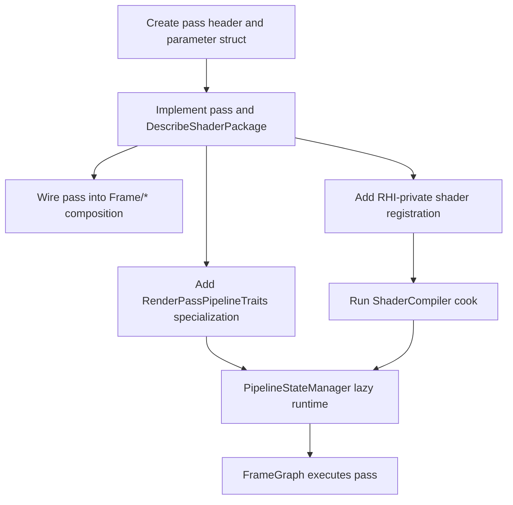
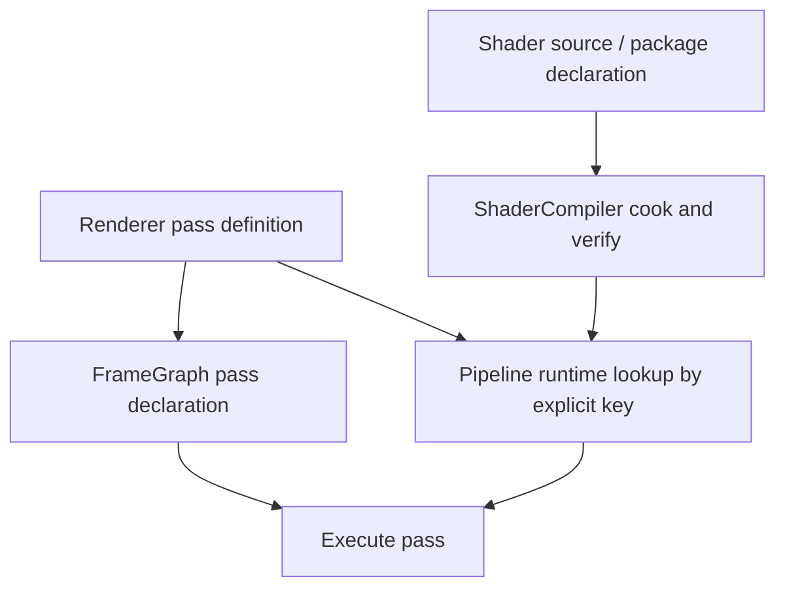

# Pass Authoring Contract

Status: Stage 2 reviewer contract
Date: 2026-06-12

## Purpose

This document explains how renderer passes are authored today, why the current path is too ceremonial, and what the target rule is for the review-ready refactor.

Hard gate from the execution plan: adding an ordinary renderer shader pass must not require editing `Engine/RHI`.

Primary code references:

- [Passes](../../Engine/Renderer/Private/Passes)
- [ShaderPass.h](../../Engine/Renderer/Private/Passes/ShaderPass.h)
- [PassUtilities.h](../../Engine/Renderer/Private/Passes/PassUtilities.h)
- [FrameGraph.h](../../Engine/Renderer/Private/FrameGraph/FrameGraph.h)
- [RenderPassPipelineTraits.h](../../Engine/Renderer/Private/Pipeline/RenderPassPipelineTraits.h)
- [Engine/RHI/Private/Shaders](../../Engine/RHI/Private/Shaders)
- [ShaderCompiler](../../Tools/Shaders/ShaderCompiler)

Reference basis:

- Falcor documents render passes and render graphs as the normal way to prototype rendering techniques: https://github.com/NVIDIAGameWorks/Falcor/blob/master/docs/getting-started.md
- Donut describes reusable rendering passes in its render module and separates shader building from the main framework: https://github.com/NVIDIA-RTX/Donut

## Contract Summary

A renderer pass owns:

- Pass name.
- Pass parameter struct.
- Shader package declaration.
- Graph resource declaration.
- Execute function.
- Pass-specific binding overrides.
- Pass-specific diagnostics.

A renderer pass must not own:

- RHI public interface changes for ordinary resources/pipelines.
- D3D12/Vulkan backend code.
- Global shader package infrastructure.
- Backend-native descriptor or PSO construction.

## Current Authoring Flow

This flow works, but it violates the target authoring bar because a regular renderer pass can require edits in:

- [Engine/Renderer/Private/Passes](../../Engine/Renderer/Private/Passes)
- [Engine/Renderer/Private/Frame](../../Engine/Renderer/Private/Frame)
- [Engine/Renderer/Private/Pipeline/RenderPassPipelineTraits.h](../../Engine/Renderer/Private/Pipeline/RenderPassPipelineTraits.h)
- [Engine/RHI/Private/Shaders](../../Engine/RHI/Private/Shaders)

The RHI edit is the key boundary violation. The central traits edit is maintainability debt.

## Target Authoring Flow

Target rule:

- A normal pass addition touches Renderer pass/frame code and shader/tooling package definitions only.
- No D3D12/Vulkan files.
- No `Engine/RHI/Private/Shaders` renderer-specific registration.
- No broad RHI public interface changes unless the pass needs a genuinely new GPU/API concept.

## Current Pass Pieces

| Piece | Current owner | Current examples | Target direction |
| --- | --- | --- | --- |
| Pass parameter struct | Renderer pass | `GBufferPass::Parameters`, `VisualizeBuffersPassParameters` | Keep in Renderer or neutral shader-authoring layer if shared. |
| Parameter metadata | Renderer public shader parameter helpers | [ShaderParameters](../../Engine/Renderer/Public/ShaderParameters) | Decide final owner in Stage 4/17. |
| Shader package declaration | Renderer pass plus RHI-private shader registration | `DescribeShaderPackage`, `IMPLEMENT_GLOBAL_SHADER` files | Move renderer-specific registration above RHI. |
| Graph setup | Renderer frame graph/pass helpers | `AddRasterPass`, `AddComputePass`, `ShaderPass::Setup` | Keep Renderer-owned. |
| Execute callback | Renderer pass | `GBufferPass::Execute`, `SkyPass::Execute`, etc. | Keep Renderer-owned. |
| Runtime traits | Renderer pipeline | `RenderPassPipelineTraits<TPass>` | Replace or reduce central trait edits in Stage 16/17. |
| Binding | Renderer pipeline plus RHI binding commands | [PassBinder.cpp](../../Engine/Renderer/Private/Pipeline/PassBinder.cpp) | Keep renderer parameter binding above RHI; RHI binds generic handles/addresses/tables. |
| Backend PSO creation | RHI backend | D3D12/Vulkan pipeline files | Keep backend-owned. |

## Minimal Current Checklist

Until Stage 4/16/17 replace the path, a current pass usually needs:

1. Add or update pass class in [Passes](../../Engine/Renderer/Private/Passes).
2. Define `PassName`.
3. Define `Parameters` and metadata through shader parameter helpers.
4. Implement package description with expected stages.
5. Add frame graph setup/execute wiring in [Frame](../../Engine/Renderer/Private/Frame).
6. Add runtime creation in [RenderPassPipelineTraits.h](../../Engine/Renderer/Private/Pipeline/RenderPassPipelineTraits.h).
7. Add shader registration in [Engine/RHI/Private/Shaders](../../Engine/RHI/Private/Shaders). This is current debt.
8. Cook/inspect shader package through [ShaderCompiler](../../Tools/Shaders/ShaderCompiler).
9. Validate pass in D3D12 and Vulkan smoke if shader-visible layout or resource states changed.

## Target Checklist

After Stage 17, a normal pass should need:

1. Add pass definition in Renderer.
2. Add shader package/source declaration in renderer-owned shader authoring location.
3. Add frame graph wiring where the pass belongs.
4. Cook/inspect package.
5. Run targeted validation.

It should not require:

- RHI public interface edits.
- RHI private shader registration edits.
- D3D12/Vulkan backend edits.
- A central per-pass traits specialization for ordinary compute/raster passes.

## Ownership Rules

| Question | Owner |
| --- | --- |
| What resources does this pass read/write? | Renderer pass setup through frame graph. |
| What shader package does this pass use? | Renderer pass definition/package declaration. |
| What bindings must be present? | Renderer pass parameter metadata plus shader reflection validation. |
| How are descriptors/CBVs/UAVs bound to the API? | RHI command list and backend binding layout. |
| What fixed-function pipeline state is needed? | Renderer pass definition normalized into RHI pipeline desc. |
| How does D3D12/Vulkan create the native PSO? | RHI backend pipeline service. |
| How is the pass debugged? | Renderer diagnostics, frame graph diagnostics, RHI markers, shader package inspection. |

## Current Gaps

| Gap | Evidence | Owning stage |
| --- | --- | --- |
| Pass-specific shader registrations live in RHI private files. | [Engine/RHI/Private/Shaders](../../Engine/RHI/Private/Shaders) contains `GBufferShaders.cpp`, `DirectLightingShaders.cpp`, etc. | Stage 4 |
| RHI private shader registration includes Renderer-private data. | `DirectLightingShaders.cpp` includes `RayTracedShadowUniformData.h`. | Stage 4 |
| Central traits file grows with pass count. | [RenderPassPipelineTraits.h](../../Engine/Renderer/Private/Pipeline/RenderPassPipelineTraits.h) specializes each pass. | Stage 16, Stage 17 |
| Adding a pass requires knowing too much about cook/runtime/PSO details. | Pass code, traits, shader registration, cook tooling, and binding validation are separate. | Stage 16, Stage 17 |

## Acceptance Evidence

The pass authoring contract is accepted when:

- A proof pass can be added without touching `Engine/RHI`.
- Pass definition includes graph resource usage, shader package identity, pipeline state intent, diagnostics name, and validation expectations.
- ShaderCompiler can cook and inspect the pass package.
- Runtime errors mention pass name, package id, binding layout id, backend, and missing binding/resource.
- Old renderer-specific RHI private shader registrations are removed or moved.
