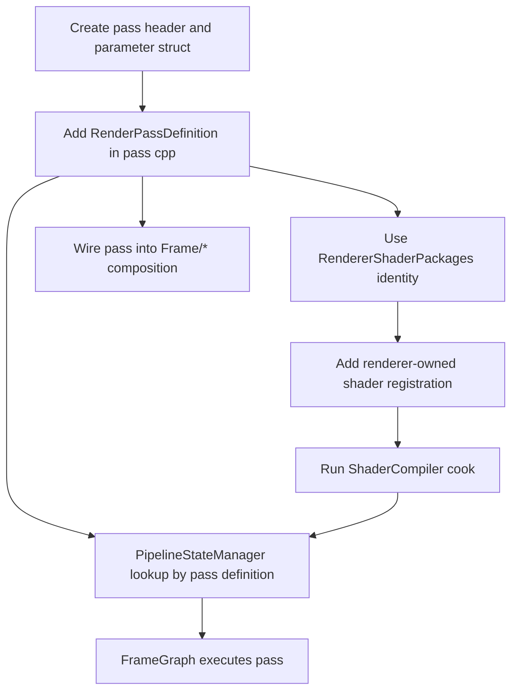
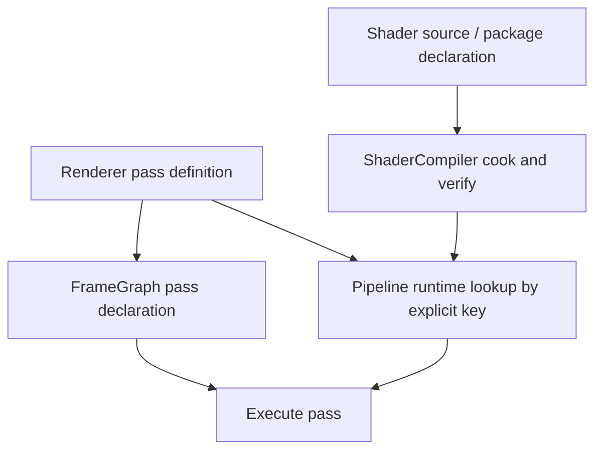

# Pass Authoring Contract

Status: Stage 17 implementation contract, Stage 17A boilerplate-reduction target
Date: 2026-06-12
Last synchronized: 2026-06-13

## Purpose

This document explains how renderer passes are authored today, why the current path is too ceremonial, and what the target rule is for the review-ready refactor.

Hard gate from the execution plan: adding an ordinary renderer shader pass must not require editing `Engine/RHI`.

Primary code references:

- [Passes](../../Engine/Renderer/Private/Passes)
- [ShaderPass.h](../../Engine/Renderer/Private/Passes/ShaderPass.h)
- [PassUtilities.h](../../Engine/Renderer/Private/Passes/PassUtilities.h)
- [FrameGraph.h](../../Engine/Renderer/Private/FrameGraph/FrameGraph.h)
- [RenderPassDefinition.h](../../Engine/Renderer/Private/Passes/RenderPassDefinition.h)
- [RenderPassDefinitionRuntime.h](../../Engine/Renderer/Private/Pipeline/RenderPassDefinitionRuntime.h)
- [RendererShaderPackages.h](../../Engine/Renderer/ShaderRegistrations/RendererShaderPackages.h)
- [Renderer shader registrations](../../Engine/Renderer/ShaderRegistrations)
- [ShaderCompiler](../../Tools/Shaders/ShaderCompiler)
- [Target folder architecture](after/repository-target-folder-architecture.md)

Reference basis:

- Falcor documents render passes and render graphs as the normal way to prototype rendering techniques: https://github.com/NVIDIAGameWorks/Falcor/blob/master/docs/getting-started.md
- Donut describes reusable rendering passes in its render module and separates shader building from the main framework: https://github.com/NVIDIA-RTX/Donut
- AMD Render Pipeline Shaders treats render-graph structure as authored data instead of hand-written backend plumbing: https://github.com/GPUOpen-LibrariesAndSDKs/RenderPipelineShaders
- Diligent Samples include render-state packager workflows that make pipeline state an authored/packaged artifact: https://github.com/DiligentGraphics/DiligentSamples
- NVIDIA Donut-Samples threaded rendering shows independent command-list recording by view/face: https://github.com/NVIDIA-RTX/Donut-Samples/tree/main/examples/threaded_rendering
- Repository threading readiness: [after/repository-threading-readiness.md](after/repository-threading-readiness.md)

## Contract Summary

A renderer pass owns:

- Pass name.
- Pass parameter struct.
- Shader package declaration.
- Graph resource declaration.
- Execute function.
- Pass-specific binding overrides.
- Pass-specific diagnostics.

A renderer pass must not own:

- RHI public interface changes for ordinary resources/pipelines.
- D3D12/Vulkan backend code.
- Global shader package infrastructure.
- Backend-native descriptor or PSO construction.

## Current Authoring Flow After Stage 17

This flow removes the Stage 16/17 central traits edit. A regular renderer pass can still require edits in:

- [Engine/Renderer/Private/Passes](../../Engine/Renderer/Private/Passes)
- [Engine/Renderer/Private/Frame](../../Engine/Renderer/Private/Frame)
- [Engine/Renderer/ShaderRegistrations](../../Engine/Renderer/ShaderRegistrations)

The renderer-owned shader registration location keeps pass package identity above RHI. Package and binding layout names are shared through [RendererShaderPackages.h](../../Engine/Renderer/ShaderRegistrations/RendererShaderPackages.h) instead of duplicated per pass. Stage 17A targets the remaining shader registration boilerplate where shader name, package id, binding layout id, shader path, entry point, and stage are still hand-written around `IMPLEMENT_GLOBAL_SHADER`.

## Target Authoring Flow

Target rule:

- A normal pass addition touches Renderer pass/frame code and shader/tooling package definitions only.
- No D3D12/Vulkan files.
- No `Engine/RHI/Private/Shaders` renderer-specific registration.
- No broad RHI public interface changes unless the pass needs a genuinely new GPU/API concept.
- Target folders are `Engine/Renderer/Private/Passes`, `Engine/Renderer/Private/PassCatalog`, `Engine/Renderer/Shaders`, `Engine/Contracts/Shader`, and ShaderCompiler inspection/cook folders.

## Current Pass Pieces

| Piece | Current owner | Current examples | Target direction |
| --- | --- | --- | --- |
| Pass parameter struct | Renderer pass | `GBufferPass::Parameters`, `VisualizeBuffersPassParameters` | Keep in Renderer or neutral shader-authoring layer if shared. |
| Parameter metadata | Renderer public shader parameter helpers | [ShaderParameters](../../Engine/Renderer/Public/ShaderParameters) | Decide final consolidation in Stage 17. |
| Shader package declaration | Renderer pass definition plus renderer-owned shader registration constants | `RenderPassDefinition`, [RendererShaderPackages.h](../../Engine/Renderer/ShaderRegistrations/RendererShaderPackages.h) | Keep renderer pass package identity above RHI with one shared package/layout id source. |
| Graph setup | Renderer frame graph/pass helpers | `AddRasterPass`, `AddComputePass`, `ShaderPass::Setup` | Keep Renderer-owned. |
| Execute callback | Renderer pass | `GBufferPass::Execute`, `SkyPass::Execute`, etc. | Keep Renderer-owned. |
| Runtime definition adapter | Renderer pipeline | [RenderPassDefinitionRuntime.h](../../Engine/Renderer/Private/Pipeline/RenderPassDefinitionRuntime.h) | Generic conversion from pass definition to runtime storage. |
| Binding | Renderer pipeline plus RHI binding commands | [PassBinder.cpp](../../Engine/Renderer/Private/Pipeline/PassBinder.cpp) | Keep renderer parameter binding above RHI; RHI binds generic handles/addresses/tables. |
| Backend PSO creation | RHI backend | D3D12/Vulkan pipeline files | Keep backend-owned. |

## Disposition Decisions

| Current piece | Disposition | Target decision |
| --- | --- | --- |
| Pass classes and parameter structs | Keep and refine | Preserve renderer ownership and improve diagnostics/package identity. |
| Renderer shader parameter helpers | Improve and extract | Keep if they remain renderer/pass-facing; move shared metadata to `ShaderContracts` only when tools need it. |
| Separate pass code plus registration files | Improve and extract | Stage 17 shares package/layout identity through `RendererShaderPackages`; later ShaderContracts work can turn this into manifest/catalog data. |
| `RenderPassPipelineTraits<TPass>` | Removed | Stage 17 deleted the central per-pass construction registry. |
| `ShaderCompiler` package discovery through renderer runtime | Replace or redesign | Compiler reads `ShaderContracts`, not runtime renderer implementation. |
| Backend-specific pass setup | Replace or redesign | Ordinary passes must not add D3D12/Vulkan code; use RHI descriptors/capabilities. |

## Folder Target

| Folder | Target role | Rejected use |
| --- | --- | --- |
| `Engine/Renderer/Private/Passes` | Pass execution code, resource declarations, parameter structs, diagnostics, and current pass definitions. | Backend-native code or unrelated global registries. |
| `Engine/Renderer/Private/PassCatalog` | Future shared manifest/catalog source for pass package identity, entry points, shader paths, expected stages, binding layout IDs, and pass capabilities. | A second registry next to `Engine/Renderer/ShaderRegistrations`. |
| `Engine/Renderer/Shaders` | Renderer pass shader source grouped by pass or feature. | Generic RHI fixtures or project/sample shader overrides. |
| `Engine/Contracts/Shader` | Schema shared with ShaderCompiler: package manifest, reflection records, binding layout identity, pass catalog records. | Renderer runtime execution or backend compiler implementation. |
| `Tools/Shaders/ShaderCompiler` | Compile, cook, verify, inspect pass packages from `ShaderContracts`. | Full renderer runtime dependency. |
| `Engine/RHI/Private/Shaders` | Generic shader package infrastructure only. | Renderer pass declarations or pass-specific uniform structs. |

## Pass Complexity Budget

| Pass authoring complexity | Earns its right when | Remove or redesign when |
| --- | --- | --- |
| Pass definition object | It names resources, shader package, pipeline kind, render state, feature requirements, diagnostics, and validation expectations. | It only wraps another function without reducing pass setup cost. |
| Pass-specific parameters | They are shader-visible or pass-owned data with reflection/diagnostic value. | They duplicate frame/global data or hide ownership. |
| Shared package identity entry | It is the single source for package and binding layout names consumed by ShaderCompiler registration and runtime pass definitions. | Package identity is duplicated in pass code and registration files. |
| Shader registration manifest/generator | It removes repeated class-local constants while preserving typed parameter metadata, paths, entry points, stages, feature flags, and diagnostics. | It is only a macro disguise that makes navigation or error reporting worse. |
| Runtime specialization | It is required for a genuinely unusual pass. | It exists only because central traits require every ordinary pass to add ceremony. |

## Current Checklist

A current ordinary pass usually needs:

1. Add or update pass class in [Passes](../../Engine/Renderer/Private/Passes).
2. Define `PassName`.
3. Define `Parameters` and metadata through shader parameter helpers.
4. Add `GetDefinition()` with package identity, pipeline kind, render state, feature requirements, and diagnostics names.
5. Add frame graph setup/execute wiring in [Frame](../../Engine/Renderer/Private/Frame).
6. Add shader registration in [Engine/Renderer/ShaderRegistrations](../../Engine/Renderer/ShaderRegistrations), using [RendererShaderPackages.h](../../Engine/Renderer/ShaderRegistrations/RendererShaderPackages.h). Stage 17A should replace this with manifest/generated registration records for ordinary shaders.
7. Cook/inspect shader package through [ShaderCompiler](../../Tools/Shaders/ShaderCompiler).
8. Validate pass in D3D12 and Vulkan smoke if shader-visible layout or resource states changed.

## Target Checklist

After Stage 17, a normal pass should need:

1. Add pass definition in Renderer.
2. Add shader package/source declaration in `ShaderContracts` pass catalog or renderer-owned shader authoring location that exports that catalog.
3. Add frame graph wiring where the pass belongs.
4. Cook/inspect package.
5. Run targeted validation.

It should not require:

- RHI public interface edits.
- RHI private shader registration edits.
- D3D12/Vulkan backend edits.
- A central per-pass traits specialization for ordinary compute/raster passes.

## Ownership Rules

| Question | Owner |
| --- | --- |
| What resources does this pass read/write? | Renderer pass setup through frame graph. |
| What shader package does this pass use? | Renderer pass definition/package declaration. |
| What bindings must be present? | Renderer pass parameter metadata plus shader reflection validation. |
| How are descriptors/CBVs/UAVs bound to the API? | RHI command list and backend binding layout. |
| What fixed-function pipeline state is needed? | Renderer pass definition normalized into RHI pipeline desc. |
| How does D3D12/Vulkan create the native PSO? | RHI backend pipeline service. |
| How is the pass debugged? | Renderer diagnostics, frame graph diagnostics, RHI markers, shader package inspection. |

## Threading Readiness Contract

Passes should be authorable as future command-recording jobs without changing their ownership model.

| Pass part | Threading-ready rule |
| --- | --- |
| Pass definition | Immutable pass metadata: name, package id, resource access, pipeline intent, feature requirements, diagnostics label. |
| Setup | Declares all graph resource reads/writes and does not record commands or mutate global pass state. |
| Execute | Consumes `PassExecutionContext`, frame data, pipeline runtime, and graph resources; any mutation is local to the recording batch or explicitly owned runtime cache. |
| Parameters | Shader-visible data is copied into pass/frame parameter blocks, not read from live GameFramework objects. |
| Diagnostics | Errors include pass name, package id, frame/batch label when available, binding/resource name, and backend. |

Forbidden shortcuts:

- Do not use static mutable pass state for per-frame data.
- Do not let execute discover hidden resources that setup did not declare.
- Do not make pass execution depend on current UI/GameFramework mutable objects.
- Do not make ordinary passes submit command lists or wait on queues directly.

## Current Gaps

| Gap | Evidence | Owning stage |
| --- | --- | --- |
| Shader registration and pass definition remain in separate files. | [RendererShaderPackages.h](../../Engine/Renderer/ShaderRegistrations/RendererShaderPackages.h) is now the shared identity source; a future ShaderContracts manifest can remove the remaining split. | Stage 20, Stage 22 |
| Renderer shader registrations still repeat class/package/layout/path/entry/stage metadata. | `SkyCS` and the other renderer registration classes still carry local `kShaderName`, `kShaderPackageName`, `kBindingLayoutId`, source path, entry point, and stage values. | Stage 17A |
| Adding a pass still requires understanding cook/runtime/PSO evidence. | Pass definition, shader registration, cook tooling, and binding validation are intentionally separate but documented. | Stage 20, Stage 22 |

## Stage 4 Completion Packet

| Field | Evidence |
| --- | --- |
| Stage / checkpoint | Stage 4 - Move Renderer Shader Registration Out Of RHI. Full build and executable package enumeration remain Stage 5 validation work. |
| Status | Fully completed for ownership movement. Reopen only if `Engine/RHI` regains renderer pass registrations, `Renderer/Private` includes, or ordinary renderer pass additions require RHI edits. |
| Target docs opened | `docs/architecture/pass-authoring-contract.md`, `docs/architecture/pipeline-runtime-contract.md`, `docs/architecture/tooling-pipeline-contract.md`, `docs/architecture/rhi-contract-map.md`, `docs/architecture/after/repository-target-folder-architecture.md`, `docs/architecture/after/repository-threading-readiness.md`, `docs/plans/rhi-renderer-review-ready-implementation-plan.md`. |
| Contract surfaces touched | Renderer-owned shader registration target, RHI generic shader authoring primitives, ShaderCompiler registration bootstrap, pass package metadata, and boundary-check evidence. |
| Ownership proof | `Engine/RHI/Private/Shaders/BuiltinGlobalShaders.cpp` registers only RHI generic hello/test shaders. Renderer pass registrations live under `Engine/Renderer/ShaderRegistrations` and are pulled through `RegisterRendererGlobalShaders()`. |
| DirectLighting proof | `Engine/Renderer/ShaderRegistrations/DirectLightingShaders.cpp` owns the DirectLighting shader package and can include renderer-private `RayTracedShadowUniformData.h`; `Engine/RHI` has no `Renderer/Private` include hits. |
| ShaderCompiler handoff | `Tools/Shaders/ShaderCompiler/Source/main.cpp` calls `RegisterRendererGlobalShaders()`, and `Tools/Shaders/ShaderCompiler/CMakeLists.txt` links `SparkleRendererShaderRegistrations` plus `SparkleRHI`, not the full renderer runtime. |
| Package identity preserved | Static registration still declares the expected renderer package ids: `GBuffer`, `DirectLighting`, `IndirectLighting`, `LightingComposite`, `Sky`, `VisualizeBuffers`, and `ComputeClear`. |
| Refactor disposition | Keep and refine `SparkleRendererShaderRegistrations` as a narrow Stage 4 migration target. Replace the duplicate registration/pass-runtime metadata with `PassCatalog`/`ShaderContracts` in Stage 17. |
| Complexity right to exist | The narrow registration target earns its complexity because it lets ShaderCompiler enumerate renderer packages without linking full renderer runtime behavior. It must not become a second permanent pass registry after Stage 17. |
| Data transfer contract | Renderer pass metadata transfers through renderer-owned registration APIs and the `SparkleRendererShaderRegistrations` target. RHI receives only generic cooked shader package, reflection, binding layout, and runtime primitives. |
| Threading readiness handoff | Package registration remains static metadata. Future parallel shader cook jobs should consume immutable pass catalog/package manifests rather than live renderer runtime objects. |
| Validation | Static checks on 2026-06-13: `rg "Renderer/Private" Engine/RHI` returned no matches; `ArchitectureBoundaryCheck.cmake` passed with no new violations; RHI `RegisterBuiltinGlobalShaders()` contains no renderer pass calls; ShaderCompiler CMake links the narrow registration target. |

## Stage 17 Completion Packet

| Field | Evidence |
| --- | --- |
| Stage / checkpoint | Stage 17 - Introduce Declarative Pass Definition And Migrate Passes. |
| Status | Fully completed for ordinary passes. |
| Definition model | [RenderPassDefinition.h](../../Engine/Renderer/Private/Passes/RenderPassDefinition.h) names pass, package declaration, shader package, pipeline kind, feature requirements, diagnostics debug names, and graphics render state. |
| Runtime adapter | [RenderPassDefinitionRuntime.h](../../Engine/Renderer/Private/Pipeline/RenderPassDefinitionRuntime.h) converts definitions to shader runtime storage and normalized RHI graphics/compute descriptors. |
| Migrated passes | `ComputeClear`, `GBuffer`, `DirectLighting`, `IndirectLighting`, `LightingComposite`, `Sky`, and `VisualizeBuffers` expose `GetDefinition()` and `PipelineRuntime`. |
| Removed path | `Engine/Renderer/Private/Pipeline/RenderPassPipelineTraits.h` was deleted. No source references to `RenderPassPipelineTraits` or `DescribeShaderPackage` remain under `Engine/Renderer`. |
| Package identity | [RendererShaderPackages.h](../../Engine/Renderer/ShaderRegistrations/RendererShaderPackages.h) is shared by pass definitions and renderer shader registrations. |
| Validation | `ShowcaseEditor`, `ShaderCompiler`, and `architecture_boundary_check` passed in `build/windows-vs2026-stage5`; `ShaderCompiler.exe list-shaders --validate` reported 17 valid typed registrations. |

## Acceptance Evidence

The pass authoring contract is accepted when:

- A proof pass can be added without touching `Engine/RHI`.
- Pass definition includes graph resource usage, shader package identity, pipeline state intent, diagnostics name, and validation expectations.
- ShaderCompiler can cook and inspect the pass package.
- Runtime errors mention pass name, package id, binding layout id, backend, and missing binding/resource.
- Old renderer-specific RHI private shader registrations are removed or moved.
