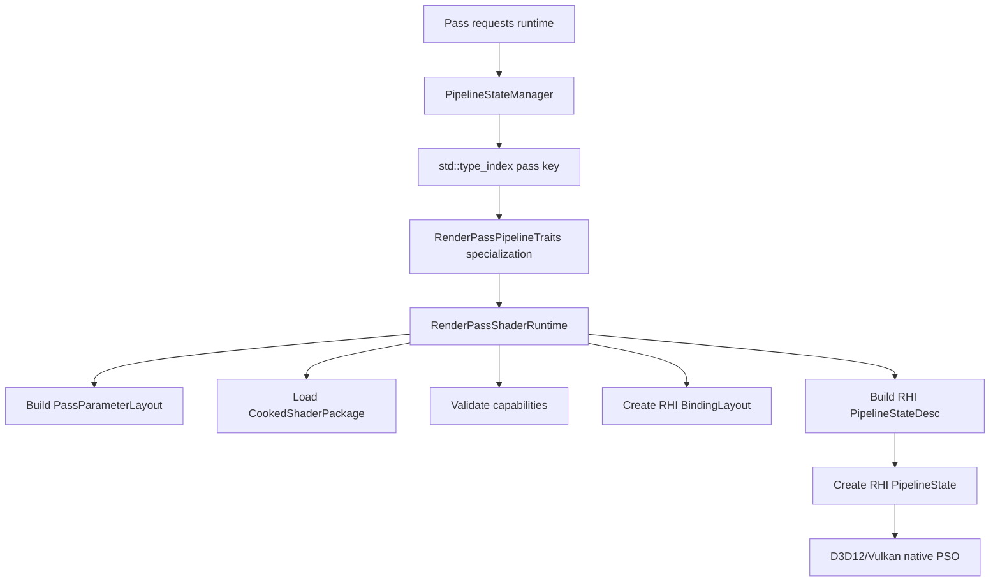
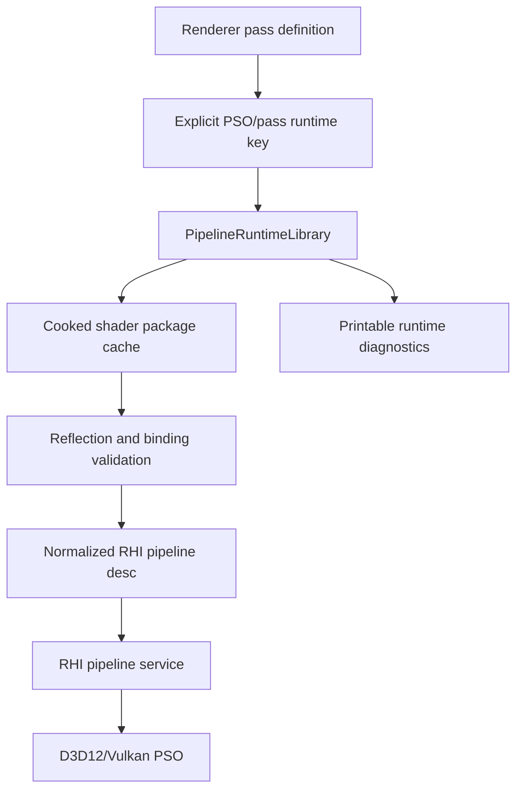
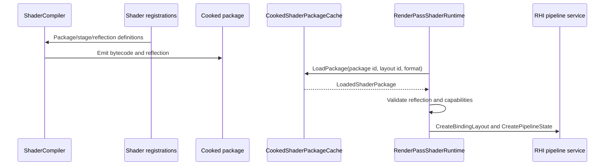

# Pipeline Runtime Contract

Status: Stage 2 reviewer contract
Date: 2026-06-12
Last synchronized: 2026-06-13

## Purpose

This document explains Sparkle's current renderer pipeline runtime and the target direction for explicit PSO handling. This is one of the main cleanup areas because pass authoring, cooked shader packages, binding layouts, and backend PSO creation currently require too much scattered knowledge.

Primary code references:

- [PipelineStateManager.h](../../Engine/Renderer/Private/Pipeline/PipelineStateManager.h)
- [RenderPassShaderRuntime.h](../../Engine/Renderer/Private/Pipeline/RenderPassShaderRuntime.h)
- [RenderPassPipelineTraits.h](../../Engine/Renderer/Private/Pipeline/RenderPassPipelineTraits.h)
- [PassBinder.cpp](../../Engine/Renderer/Private/Pipeline/PassBinder.cpp)
- [RhiPipelineStateDesc.h](../../Engine/RHI/Public/Pipeline/RhiPipelineStateDesc.h)
- [D3D12/Pipeline](../../Engine/RHI/Private/D3D12/Pipeline)
- [Vulkan/Pipeline](../../Engine/RHI/Private/Vulkan/Pipeline)
- [Target folder architecture](after/repository-target-folder-architecture.md)

Reference basis:

- Donut separates render passes, shaders, and NVRHI-backed rendering infrastructure visibly in the repo: https://github.com/NVIDIA-RTX/Donut
- Falcor makes render passes/render graphs first-class workflow concepts: https://github.com/NVIDIAGameWorks/Falcor/blob/master/docs/getting-started.md
- Diligent Engine render state cache/packager samples show PSO/package work as explicit artifacts: https://github.com/DiligentGraphics/DiligentSamples
- arc42 crosscutting concept and runtime-view guidance: https://arc42.org/overview
- Repository threading readiness: [after/repository-threading-readiness.md](after/repository-threading-readiness.md)

## Contract Summary

Renderer pipeline runtime owns:

- Mapping pass definitions to shader packages.
- Loading cooked shader packages.
- Building pass binding layout definitions.
- Validating package features against RHI capabilities.
- Creating RHI binding layouts.
- Creating normalized RHI graphics/compute pipeline descriptors.
- Requesting RHI pipeline state objects.
- Owning runtime cache invalidation when cooked shaders reload.

RHI owns:

- The normalized pipeline descriptor types.
- Backend-neutral binding layout and pipeline objects.
- D3D12/Vulkan native root signatures, pipeline layouts, shader modules, and PSO objects.

## Current Runtime Flow

This path is functional, but the identity is implicit and pass-specific runtime logic is centralized in a traits header.

## Current Objects

| Object | Current responsibility | Current issue |
| --- | --- | --- |
| `PipelineStateManager` | Lazy runtime cache keyed by pass C++ type; owns `CookedShaderPackageCache`; handles reload by clearing runtimes. | `std::type_index` is not a reviewer-friendly PSO key and cannot explain shader package, backend, formats, or state. |
| `RenderPassPipelineTraits<TPass>` | Per-pass runtime construction traits. | Every new pass adds central compile-time plumbing. |
| `RenderPassShaderRuntime` | Validates pipeline kind/stages, builds binding layout, loads package, checks capabilities, creates RHI pipeline state. | Strong utility, but it mixes many steps that should become observable pipeline runtime stages. |
| `PassBinder` | Binds compiled reflection/layout entries to pass parameter data and overrides. | Critical path for runtime errors; diagnostics should remain precise. |
| `RhiPipelineStateDesc` | Backend-neutral graphics/compute pipeline descriptors. | Needs to become part of an explicit key/diagnostic model. |
| D3D12/Vulkan pipeline services | Native root signature/layout/shader module/PSO creation. | Should consume normalized descs without renderer pass policy. |

## Disposition Decisions

| Current object/body | Disposition | Target decision |
| --- | --- | --- |
| `PipelineStateManager` | Improve and extract | Preserve cache/reload responsibility, but replace type-index identity with explicit package/layout/backend-aware keys. |
| `RenderPassPipelineTraits<TPass>` | Replace or redesign | Remove as a permanent central per-pass construction registry. |
| `RenderPassShaderRuntime` | Improve and extract | Preserve useful validation/package-loading work, but expose observable stages and diagnostics through `PipelineRuntimeLibrary`. |
| `PassBinder` | Keep and refine | Preserve as the binding error hotspot; improve diagnostics and reflection mismatch reporting. |
| `RhiPipelineStateDesc` | Keep and refine | Preserve normalized backend-neutral descriptors and make them part of printable PSO identity. |
| Shader package declaration duplication | Replace or redesign | Replace duplicate declarations with `ShaderContracts` pass catalog/package manifests. |

## Folder Target

| Folder | Target role | Rejected use |
| --- | --- | --- |
| `Engine/Renderer/Private/PipelineRuntime` | Explicit package/layout/backend/PSO identity, runtime cache, reload invalidation, printable diagnostics. | Opaque catch-all manager for pass-specific policy. |
| `Engine/Renderer/Private/PassCatalog` | Source of pass package metadata consumed by runtime and ShaderCompiler. | Duplicate declarations split from pass definitions. |
| `Engine/Contracts/Shader` | Shared manifest/reflection/binding schema. | Renderer execution or backend compiler internals. |
| `Engine/RHI/Public/Pipeline` | Normalized backend-neutral pipeline descriptor contracts. | Pass-specific render intent or material policy. |
| `Engine/RHI/Private/D3D12/Pipeline` and `Engine/RHI/Private/Vulkan/Pipeline` | Native PSO/root-signature/pipeline-layout implementation. | Renderer pass traits, shader package selection, or GameFramework data. |

## Pipeline Runtime Complexity Budget

| Runtime complexity | Earns its right when | Remove or redesign when |
| --- | --- | --- |
| `PipelineRuntimeLibrary` | It centralizes explicit package/layout/backend/PSO identity and reload invalidation. | It becomes another opaque manager hiding pass-specific policy. |
| `PsoKey` / pipeline key | It is printable, deterministic, and explains backend object creation. | It omits enough state that failures still require code spelunking. |
| Package cache | It avoids duplicate loads and reports package generation/hash. | It hides stale packages or reload behavior. |
| Binding validation | It names pass, binding, package, layout, backend, and source of mismatch. | It collapses failures into generic missing-resource messages. |

## Target Runtime Flow

`PipelineRuntimeLibrary` is a planned Stage 16 concept. It is not implemented today. It is the replacement target for the parts of the current runtime that only exist to preserve implicit C++ type identity.

## PSO Key Definition

A target PSO key should include enough identity to explain exactly what backend object is being requested.

Minimum fields:

- Pass name.
- Package id.
- Binding layout id.
- Pipeline kind: graphics or compute.
- Backend shader binary format: DXIL or SPIR-V.
- Shader package generation.
- Render target formats and count for graphics.
- Depth/stencil format and depth state for graphics.
- Vertex layout kind for graphics.
- Cull/fill/topology/raster state for graphics.
- Feature requirements such as inline ray query or acceleration structure usage.

Not required in the key:

- Native D3D12/Vulkan handles.
- Renderer scene data.
- Frame graph resource handles unless the resource changes pipeline shape.

## Threading Readiness Contract

Pipeline runtime must be safe to warm, inspect, invalidate, or rebuild in future background jobs without hidden renderer state.

| Runtime part | Threading-ready rule |
| --- | --- |
| PSO key | Immutable, printable, deterministic, and independent of C++ pointer/type identity. |
| Package cache | Keyed by package id, backend format, options, and generation; reload publishes a new generation instead of mutating readers in place. |
| Binding layout | Built from package reflection and pass catalog data; errors name package/layout/pass/backend. |
| Runtime cache | Mutated by one owner phase or protected by explicit generation swap; readers consume stable handles for the frame. |
| Warmup/validation | Future warmup jobs use package manifests and RHI capability reports, not live frame/pass objects. |

Forbidden shortcuts:

- Do not retain `std::type_index` as the final identity if it hides package/layout/backend state.
- Do not let background package validation reach into Renderer private pass instances.
- Do not mutate a cache entry while a frame may still consume it; publish by generation or frame-safe swap.

## Shader Package Flow

Current debt: package registration for renderer passes lives in RHI private files. This makes pass authoring feel lower-level than it should.

## Binding Contract

Binding has three layers:

| Layer | Owner | Current files | Rule |
| --- | --- | --- | --- |
| Pass parameter metadata | Renderer pass/shader-parameter authoring | [Renderer/Public/ShaderParameters](../../Engine/Renderer/Public/ShaderParameters) | Describes what the pass expects by name/type/visibility/usage. |
| Compiled binding layout | Renderer pipeline runtime plus RHI binding layout | [RenderPassShaderRuntime.h](../../Engine/Renderer/Private/Pipeline/RenderPassShaderRuntime.h), [PassParameterLayout.h](../../Engine/RHI/Public/ShaderParameters/PassParameterLayout.h) | Must be validated against cooked reflection. |
| Native binding layout | Backend pipeline/descriptor implementation | [D3D12/Pipeline](../../Engine/RHI/Private/D3D12/Pipeline), [Vulkan/Pipeline](../../Engine/RHI/Private/Vulkan/Pipeline) | Converts normalized layout to root signature/pipeline layout/descriptors. |

Runtime binding errors should include:

- Pass name.
- Binding name.
- Package id.
- Binding layout id.
- Expected binding type.
- Backend.
- Whether the source was parameter data or override.

## Reload And Invalidation

Current behavior:

- `PipelineStateManager::ReloadCookedShaders` reloads packages and clears lazy pipeline runtimes.
- Runtime is recreated on the next `GetPassRuntime<TPass>()`.

Target behavior:

- Reload result reports changed packages and generation.
- Pipeline runtime library invalidates by explicit key/package dependency.
- Logs show which pass runtime/PSO keys were invalidated.

## Backend PSO Contract

Backends must consume `GraphicsPipelineStateDesc` and `ComputePipelineStateDesc` without renderer feature policy.

D3D12 owns:

- Root signatures.
- D3D12 pipeline state objects.
- DXIL shader bytecode usage.
- D3D12 format/state conversion.

Vulkan owns:

- Pipeline layouts.
- Shader modules.
- Vulkan graphics/compute pipeline objects.
- SPIR-V usage.
- Vulkan format/state/cull/depth/viewport mapping.

Backend pipeline code may log debug names and native errors. It should not know that a PSO is for GBuffer, sky, DLSS, or shadows except through debug names.

## Current Gaps

| Gap | Evidence | Owning stage |
| --- | --- | --- |
| PSO identity is implicit. | [PipelineStateManager.h](../../Engine/Renderer/Private/Pipeline/PipelineStateManager.h) uses `std::type_index`. | Stage 16 |
| Central traits file grows with pass count. | [RenderPassPipelineTraits.h](../../Engine/Renderer/Private/Pipeline/RenderPassPipelineTraits.h) has one specialization per pass. | Stage 17 |
| Runtime creation mixes package loading, binding validation, capability validation, and PSO construction. | [RenderPassShaderRuntime.h](../../Engine/Renderer/Private/Pipeline/RenderPassShaderRuntime.h) performs all steps. | Stage 16 |
| Shader package declaration is still duplicated between pass runtime code and renderer registration files. | [RenderPassPipelineTraits.h](../../Engine/Renderer/Private/Pipeline/RenderPassPipelineTraits.h) consumes pass package descriptions while [ShaderRegistrations](../../Engine/Renderer/ShaderRegistrations) declares cook-time registrations. | Stage 17 |
| Pipeline diagnostics are not yet final acceptance artifacts. | Logs exist, but final smoke reports need package/key/backend evidence. | Stage 16, Stage 20 |

## Change Rules

Before changing pipeline runtime:

1. State whether the change affects package identity, binding layout, reflection validation, PSO descriptor, backend pipeline creation, cache invalidation, or diagnostics.
2. Print or record enough information to reconstruct the runtime/PSO key.
3. Keep renderer pass policy above RHI.
4. Keep native PSO creation inside D3D12/Vulkan backend pipeline services.
5. Validate both backends when descriptor semantics change.

## Acceptance Evidence

This contract is accepted when:

- Runtime logs print explicit pass/package/binding/backend/PSO key information.
- A proof pass does not require central RHI or backend edits.
- D3D12/Vulkan PSO creation consumes normalized descriptors and reports failures with enough context.
- Shader reload invalidates by explicit package/runtime identity.
- Final smoke evidence includes pipeline runtime diagnostics for lit and debug/normal view modes.
