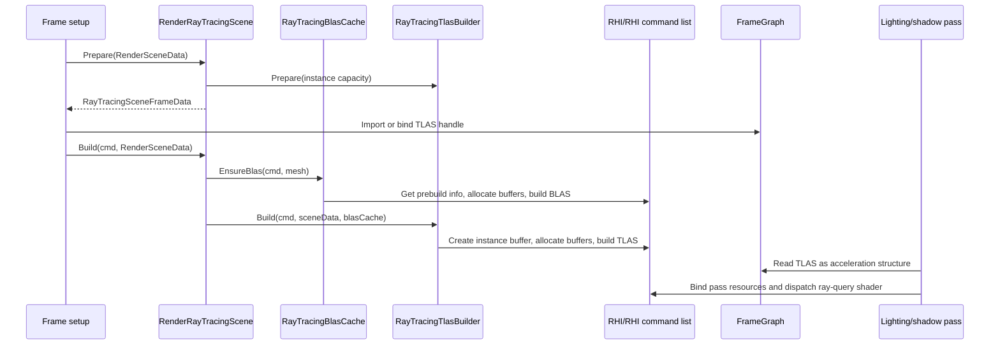

# Ray Tracing Contract

Status: Stage 18 ownership and diagnostics contract
Date: 2026-06-12
Last synchronized: 2026-06-13

## Purpose

This document defines ownership for Sparkle's ray tracing implementation across Renderer, FrameGraph, RHI, D3D12, and Vulkan.

Primary code references:

- [RenderRayTracingScene.h](../../Engine/Renderer/Private/RayTracing/RenderRayTracingScene.h)
- [RayTracingBlasCache.h](../../Engine/Renderer/Private/RayTracing/RayTracingBlasCache.h)
- [RayTracingTlasBuilder.h](../../Engine/Renderer/Private/RayTracing/RayTracingTlasBuilder.h)
- [RayTracingCapabilityReport.h](../../Engine/Renderer/Private/RayTracing/RayTracingCapabilityReport.h)
- [RhiRayTracingDesc.h](../../Engine/RHI/Public/RayTracing/RhiRayTracingDesc.h)
- [FrameGraphAccelerationStructureDesc.h](../../Engine/Renderer/Public/FrameGraph/FrameGraphAccelerationStructureDesc.h)
- [Target folder architecture](after/repository-target-folder-architecture.md)

Reference basis:

- arc42 runtime-view and crosscutting concept guidance: https://arc42.org/overview
- NVIDIA Donut uses reusable render passes and a graphics abstraction rather than putting renderer feature policy into the API layer: https://github.com/NVIDIA-RTX/Donut
- NVIDIA async compute guidance discusses AS build overlap candidates and the need for resource/fence measurement: https://developer.nvidia.com/blog/advanced-api-performance-async-compute-and-overlap/
- Diligent command-queue sample demonstrates explicit compute/transfer/graphics fences: https://github.com/DiligentGraphics/DiligentSamples/tree/master/Tutorials/Tutorial23_CommandQueues
- Microsoft DXR describes the two-level BLAS/TLAS acceleration-structure model and AS synchronization rules: https://microsoft.github.io/DirectX-Specs/d3d/Raytracing.html
- Khronos Vulkan ray tracing samples show the cross-vendor acceleration-structure setup expected by Vulkan backends: https://github.com/KhronosGroup/Vulkan-Samples/blob/main/samples/extensions/ray_tracing_basic/README.adoc
- NVIDIA Vulkan ray tracing tutorials separate acceleration structures, ray query, and sample phases: https://nvpro-samples.github.io/vk_raytracing_tutorial_KHR/
- Repository threading readiness: [after/repository-threading-readiness.md](after/repository-threading-readiness.md)

## Contract Summary

Renderer owns ray tracing scene meaning. RHI owns API-neutral ray tracing GPU operations. Backends own D3D12/Vulkan acceleration structure implementation details.

Hard rule: shadow quality, denoiser selection, scene membership, and render pass policy do not belong in RHI.

Folder rule: renderer ray tracing policy lives under `Engine/Renderer/Private/Features/RayTracing` or the current `Engine/Renderer/Private/RayTracing` migration folder. RHI owns public AS contracts and backend AS implementation only.

## Ownership Table

| Area | Owner | Current references | Does own | Does not own |
| --- | --- | --- | --- | --- |
| Capability report | Renderer, built from RHI capabilities | [RayTracingCapabilityReport.h](../../Engine/Renderer/Private/RayTracing/RayTracingCapabilityReport.h) | Renderer-readable feature readiness and logging. | Backend feature probing itself. |
| RHI ray tracing descs | RHI public | [RhiRayTracingDesc.h](../../Engine/RHI/Public/RayTracing/RhiRayTracingDesc.h) | Geometry descs, instance descs, prebuild sizes, AS type. | Renderer shadow/pass concepts. |
| BLAS cache | Renderer ray tracing | [RayTracingBlasCache.h](../../Engine/Renderer/Private/RayTracing/RayTracingBlasCache.h) | Mesh-to-BLAS cache policy, reuse, per-frame stats. | Native AS build implementation. |
| TLAS builder | Renderer ray tracing | [RayTracingTlasBuilder.h](../../Engine/Renderer/Private/RayTracing/RayTracingTlasBuilder.h) | Instance list from `RenderSceneData`, TLAS resource lifetime, per-frame stats. | API-specific instance descriptor packing beyond RHI desc. |
| Ray tracing scene | Renderer ray tracing | [RenderRayTracingScene.h](../../Engine/Renderer/Private/RayTracing/RenderRayTracingScene.h) | Prepare/build/clear flow for BLAS/TLAS and frame data. | Shader package compilation and backend API object creation. |
| Frame graph AS handles | Renderer frame graph | [FrameGraphAccelerationStructureHandle.h](../../Engine/Renderer/Public/FrameGraph/FrameGraphAccelerationStructureHandle.h) | Import/bind AS as graph resource and declare AS usage. | BLAS/TLAS construction policy. |
| AS build commands | RHI command list | [RenderCommandList.h](../../Engine/RHI/Public/Commands/RenderCommandList.h) | `BuildBottomLevelAccelerationStructure`, `BuildTopLevelAccelerationStructure`. | Deciding which meshes/lights need ray tracing. |
| D3D12/Vulkan AS implementation | Backend | [D3D12](../../Engine/RHI/Private/D3D12), [Vulkan](../../Engine/RHI/Private/Vulkan) | Native AS buffers, scratch alignment, API function calls, barriers. | Renderer feature settings. |
| Ray traced shadow settings | Renderer feature | [RayTracedShadowSettings.h](../../Engine/Renderer/Private/RayTracing/RayTracedShadowSettings.h) | Quality mode, denoiser mode, normal bias, max distance, diagnostics. | RHI public API. |

## Folder Target

| Folder | Target role | Rejected use |
| --- | --- | --- |
| `Engine/Renderer/Private/Features/RayTracing` | Renderer scene meaning, BLAS/TLAS cache policy, capability report, shadow settings, pass services. | Native D3D12/Vulkan AS implementation or RHI public API expansion for shadow policy. |
| `Engine/RHI/Public/RayTracing` | API-neutral acceleration structure descriptors, build sizes, instance/geometry records, public capability fields. | Renderer shadow settings, denoiser selection, or scene membership. |
| `Engine/RHI/Private/D3D12` and `Engine/RHI/Private/Vulkan` | Native AS buffers, scratch/result resources, barriers, backend build calls. | Renderer feature policy. |
| `Engine/Renderer/Private/Passes` and `PassCatalog` | Ray traced shadow pass code and shader/package metadata. | RHI-private shader registration or backend-native pass code. |

## Runtime Flow

## Data Flow

```mermaid
flowchart LR
    Scene[RenderSceneData mesh instances]
    Mesh[GPUMesh geometry]
    Geometry[RhiRayTracingGeometryDesc]
    BLAS[BLAS cache entry]
    Instance[RhiRayTracingInstanceDesc]
    TLAS[TLAS buffer]
    FrameData[RayTracingSceneFrameData]
    FG[FrameGraph AS handle]
    Shader[Ray query shader]

    Scene --> Mesh
    Mesh --> Geometry
    Geometry --> BLAS
    BLAS --> Instance
    Scene --> Instance
    Instance --> TLAS
    TLAS --> FrameData
    FrameData --> FG
    FG --> Shader
```

## Lifetime Contract

| Step | Producer | Consumer | Data shape | Failure/diagnostic owner |
| --- | --- | --- | --- | --- |
| Render scene snapshot to renderer scene data | GameFramework/Renderer scene handoff | Renderer RT scene | `RenderSceneData`, `MeshDraw`, `GPUMesh` references | Scene data builder logs missing runtime mesh/GPU upload causes. |
| Mesh geometry to BLAS request | `RayTracingBlasCache` | RHI prebuild/build commands | `RhiRayTracingGeometryDesc`, scratch/result buffers, BLAS GPU address | BLAS cache logs invalid prebuild info and allocation failures. |
| Scene instances to TLAS request | `RayTracingTlasBuilder` | RHI prebuild/build commands | `RhiRayTracingInstanceDesc`, instance buffer, scratch/result buffers, TLAS GPU address | TLAS builder counts candidate instances, accepted instances, missing GPU mesh data, and rejected BLAS handles. |
| TLAS to frame graph | `RenderRayTracingScene::Prepare` and `FrameGraphBuilder` | Frame graph compile/execution | `RayTracingSceneFrameData`, persistent AS handle, AS resource state | Frame graph AS registration validates import/bind/use contracts. |
| TLAS to direct lighting | Frame graph/pass services | `DirectLightingPass` | `ShaderAccelerationStructure` plus `RayTracedShadowUniformData` | Renderer pass diagnostics and shader runtime package validation. |

## Pass Integration

Current ray tracing pass-facing services:

- [RenderRayTracingPassServices.h](../../Engine/Renderer/Private/RayTracing/RenderRayTracingPassServices.h)
- [RayTracedShadowPassData.h](../../Engine/Renderer/Private/RayTracing/RayTracedShadowPassData.h)
- [RayTracedShadowUniformData.h](../../Engine/Renderer/Private/RayTracing/RayTracedShadowUniformData.h)

Rules:

- Passes may consume renderer-owned services to access TLAS state and shadow settings.
- Passes declare AS usage through frame graph parameters/handles.
- RHI sees only `RhiRayTracing*` descs, GPU addresses, resources, command methods, and capabilities.

Stage 4 boundary update:

- `DirectLighting` shader registration is Renderer-owned and may include renderer-private `RayTracedShadowUniformData`.
- RHI no longer includes renderer-private shadow uniform data.

## Capability And Fallback

Ray tracing feature use requires:

- Backend reports ray tracing support through `RhiCapabilities`.
- Renderer `RayTracingCapabilityReport` says inline ray query shadows are usable.
- Acceleration structure alignment, scratch alignment, and instance descriptor size are available.
- Pass shader package supports required features and runtime validation accepts the package.

Fallback must be deterministic:

- If backend lacks ray tracing, renderer logs unavailable capability and skips AS work.
- If AS prebuild info is invalid, BLAS/TLAS build skips with a diagnostic.
- If no mesh instances exist, TLAS is cleared or left invalid.
- If shader package uses inline ray query and backend lacks support, runtime creation must fail with a clear message.

## Threading Readiness Contract

Ray tracing is a high-value future parallelism area, but it needs explicit ownership before BLAS/TLAS work can move to jobs or async queues.

| Area | Threading-ready rule |
| --- | --- |
| BLAS cache | Cache entries have mesh id, geometry generation, build status, owning frame/job, and backend capability reason. |
| TLAS builder | TLAS instance data is built from immutable render snapshots and BLAS handles, not live scene mutation. |
| AS build requests | Requests name geometry/instance descs, scratch/result resources, queue type, barriers, and diagnostics labels. |
| Async candidates | AS build overlap is a measured option only after frame graph hazards and queue fences are explicit. |
| Fallback | Unsupported RT, invalid prebuild info, missing instances, and package feature mismatch produce deterministic reasons. |

Forbidden shortcuts:

- Do not let worker jobs mutate renderer ray tracing scene state without cache generation ownership.
- Do not move shadow settings or pass data into RHI to make AS workers easier.
- Do not overlap AS builds with graphics/compute work unless resource hazards, waits, signals, and measurement evidence exist.

## Diagnostics

Current diagnostics:

- [RayTracingSceneDiagnostics.h](../../Engine/Renderer/Private/RayTracing/RayTracingSceneDiagnostics.h)
- [RayTracingCapabilityReport.cpp](../../Engine/Renderer/Private/RayTracing/RayTracingCapabilityReport.cpp)

Expected smoke evidence:

- Backend API.
- Ray tracing support.
- Inline ray query support.
- Inline ray-query shadow unavailable reason when not active.
- Referenced mesh count.
- Built/reused BLAS count.
- Candidate TLAS instance count.
- Missing GPU mesh data count.
- Rejected BLAS count.
- TLAS instance count.
- Whether TLAS was built.
- Fallback reason when unavailable.

## Current Gaps

| Gap | Evidence | Owning stage |
| --- | --- | --- |
| Direct lighting shader registration still mirrors pass package identity. | [DirectLightingShaders.cpp](../../Engine/Renderer/ShaderRegistrations/DirectLightingShaders.cpp) declares the package while `DirectLightingPass` describes it for runtime. | Stage 17 |
| Ray tracing contract needed concrete diagnostics. | Stage 18 now reports candidate TLAS instances, accepted TLAS instances, missing GPU mesh data, rejected BLAS handles, and inline ray-query shadow unavailable reason. | Stage 18, Stage 20 |
| Backend parity evidence is final for the Stage 20 milestone. | D3D12/Vulkan lit/debug smoke and deterministic camera-motion RT smoke passed with valid TLAS evidence and zero unresolved frame graph warnings. | Stage 18, Stage 20 |
| Denoiser ownership is still a decision. | Stage 13 removed the empty private denoising placeholder; the public shadow denoise contract remains the current integration point. | Stage 18, Stage 36 |

## Change Rules

Before changing ray tracing:

1. State whether the change affects scene membership, BLAS cache, TLAS building, frame graph AS import, RHI descs, backend AS build, or shader pass data.
2. Keep feature policy in Renderer.
3. Keep API/native details in RHI/backend.
4. Update capability/fallback diagnostics.
5. Validate both D3D12 and Vulkan if command/build semantics change.

## Acceptance Evidence

This contract is accepted when:

- RHI no longer includes Renderer-private ray tracing feature headers.
- BLAS/TLAS ownership is documented in final reviewer docs.
- D3D12/Vulkan smoke logs show capability report and AS build diagnostics.
- Ray traced shadow pass data is owned by Renderer or a neutral shader contract, not RHI private pass registration.
