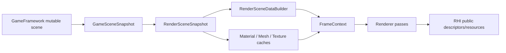

# Render Scene Data Contract

Status: Stage 13 scene/resource ownership contract
Date: 2026-06-13

## Purpose

This document defines the GameFramework-to-Renderer handoff used by the current renderer track. It keeps scene mutation, cooked runtime data, renderer frame staging, GPU resource caches, and temporal history as separate owners.

Reference basis:

- NVIDIA Donut keeps scene/component maintenance separate from reusable render passes and NVRHI-backed rendering: https://github.com/NVIDIA-RTX/Donut
- NVIDIA Falcor presents scene/rendering systems as distinct reviewer-facing concepts: https://github.com/NVIDIAGameWorks/Falcor
- Sparkle threading-readiness contract: [repository-threading-readiness.md](after/repository-threading-readiness.md)

Companion docs:

- [GameFramework contract](game-framework-contract.md)
- [Rendering system map](rendering-system-map.md)
- [Tooling pipeline contract](tooling-pipeline-contract.md)
- [Rendering coverage status](rendering-coverage-status.md)

## Runtime Handoff

`GameScene` owns mutation. `GameSceneSnapshot` is the GameFramework export. `RenderSceneSnapshot` is the renderer-owned frame copy. Renderer code may keep the same data values, but the ownership boundary is explicit: once captured, frame setup reads the renderer snapshot rather than live gameplay containers.

## DTO And Owner Map

| Data | Producer owner | Renderer owner | Current type/file | Consumer | Notes |
| --- | --- | --- | --- | --- | --- |
| Camera | GameFramework scene camera | Renderer frame builders / `RenderCamera` | [CameraSnapshot.h](../../Engine/GameFramework/Public/Scene/Camera/CameraSnapshot.h), [RenderSceneSnapshot.h](../../Engine/Renderer/Private/SceneData/Lifecycle/RenderSceneSnapshot.h) | `RenderCamera`, per-view builders, temporal data | Camera snapshot is copied once per frame before view constants and temporal data are built. |
| Lights | GameFramework lighting | Renderer scene data | [LightingSnapshot.h](../../Engine/GameFramework/Public/Scene/Lighting/LightingSnapshot.h) | `RenderLightingBuilder`, direct/indirect lighting passes | Renderer converts runtime light snapshots into render-domain light DTOs. |
| Materials | GameFramework material runtime/cooked records | Renderer material cache | [MaterialSnapshot.h](../../Engine/GameFramework/Public/Scene/Materials/MaterialSnapshot.h), [MaterialCacheManager.h](../../Engine/Renderer/Private/SceneData/Caching/MaterialCacheManager.h) | `RenderSceneData`, GBuffer pass | Material cache owns renderer binding data; source import/cook policy stays in tools. |
| Textures | GameFramework texture snapshot from cooked/runtime records | Renderer texture manager | [TextureSnapshot.h](../../Engine/GameFramework/Public/Scene/Textures/TextureSnapshot.h), [TextureManager.h](../../Engine/Renderer/Private/Textures/TextureManager.h) | Material cache and renderer passes | Texture manager loads cooked/runtime texture paths into RHI resources; it must not decode source images or run cooker policy. |
| Mesh instances | GameFramework scene meshes | Renderer scene data / mesh batches | [MeshSnapshot.h](../../Engine/GameFramework/Public/Scene/Meshes/MeshSnapshot.h), [RenderMeshSnapshotAdapter.h](../../Engine/Renderer/Private/SceneData/RenderMeshSnapshotAdapter.h) | `RenderSceneDataBuilder`, mesh diagnostics, GBuffer pass | Snapshot contains visible mesh instance records, transforms, material handles, mesh/skeleton ids, and current runtime mesh references. |
| Mesh GPU upload | GameFramework runtime mesh data | Renderer GPU mesh cache | [GPUMeshCache.h](../../Engine/Renderer/Private/Meshes/GPUMeshCache.h), [GPUMeshUploadDescBuilder.h](../../Engine/Renderer/Private/Meshes/GPUMeshUploadDescBuilder.h) | RHI resource creation, ray tracing geometry | Current cache uses runtime mesh identity to preserve morph/dirty behavior. Stage 24 should move this toward a render mesh payload/key contract if GameFramework schemas are extracted. |
| Skinning | GameFramework animation pose snapshot | Renderer scene/frame data | [SceneAnimation.h](../../Engine/GameFramework/Public/Scene/Animations/SceneAnimation.h), [RenderSceneData.h](../../Engine/Renderer/Private/SceneData/RenderSceneData.h) | skinning frame data, GBuffer pass, DLSS motion vectors | Joint matrices are copied into `RenderSceneData` with explicit offsets per skeletal mesh instance. |
| Temporal state | Renderer frame data | Renderer temporal builder | [TemporalDataBuilder.h](../../Engine/Renderer/Private/Frame/Builders/TemporalDataBuilder.h), [TemporalFrameState.h](../../Engine/Renderer/Private/Frame/TemporalFrameState.h) | GBuffer pass, upscaler input contract | Temporal history and jitter are renderer-owned because they depend on frame extent, render camera, history reset, and upscaler policy. |
| Viewport products | Renderer frame pipeline | Renderer host protocol | [ViewportContracts.h](../../Engine/Renderer/Public/Viewport/ViewportContracts.h) | Application/Editor hosts | Hosts receive presentation DTOs and never drive frame graph resource transitions directly. |

## Ownership Rules

GameFramework:

- Owns runtime scene mutation, components, cooked asset loading, scene material/mesh/texture records, animation pose evaluation, and `GameSceneSnapshot` production.
- Does not own renderer pass policy, frame graph resources, RHI descriptors, backend-native handles, or source import/cook algorithms.

Renderer:

- Owns `RenderSceneSnapshot`, renderer scene data, material cache, GPU mesh cache, texture manager, temporal jitter/history, render passes, frame graph resources, and RHI upload requests.
- Consumes public GameFramework snapshot/cooked runtime records only. It must not include GameFramework private folders or mutate GameFramework scene containers during frame setup/recording.

Tools:

- Own source import and cooked artifact production.
- Transfer texture/material/mesh/scene data through public cooked/runtime records and future `AssetContracts`, not through renderer or GameFramework private internals.

## Cache Lifetimes

| Cache/system | Mutable owner | Input contract | Lifetime rule | Diagnostics |
| --- | --- | --- | --- | --- |
| `GPUMeshCache` | Renderer | Runtime mesh data from mesh snapshot | Cache is renderer-owned and keyed by current runtime mesh identity while morph/dirty behavior remains in GameFramework mesh objects. | `MeshDiagnosticsSnapshot` reports CPU/GPU residency, instance counts, batching, bounds, and estimated byte sizes. |
| `MaterialCacheManager` | Renderer | `MaterialSnapshot` plus texture manager lookups | Cache rebuilds renderer material data from current snapshot material descriptions. | Material health is represented through mesh/material binding diagnostics and Stage 15 smoke/reporting. |
| `TextureManager` | Renderer | `TextureSnapshot` cooked/runtime paths and default texture contracts | Loads default and scene textures into RHI resources; unloads scene textures on scene state changes. | `TextureDiagnosticsSnapshot` reports default/scene texture residency and resource details. |
| `TemporalDataBuilder` | Renderer | Render camera, view constants, viewport extent, reset requests | Maintains previous pose/jitter inside renderer frame state; resets on resize, scene change, camera cut, or explicit request. | Temporal state is reported through upscaler input diagnostics and Stage 15 smoke/reporting plan. |

## Temporal Convention

Temporal jitter is renderer-owned and frame-scoped.

| Rule | Current value |
| --- | --- |
| Pattern | Halton sequence using bases 2 and 3. |
| Window | 16 jittered frames. |
| Coordinate space | Jitter is emitted in NDC offset form for constant buffers; DLSS converts to pixel jitter for Streamline constants. |
| Y convention | NDC Y jitter is negated when converted from pattern sample to render offset. |
| History reset owners | Renderer frame pipeline and scene render state coordinator. |
| Reset triggers | Window resize, scene extent change, level/scene state reset, explicit temporal reset request, first frame without history, and likely camera cut. |
| Camera cut heuristic | Position delta, view-direction dot threshold, and FOV delta inside `TemporalDataBuilder`. |

Stage 20 validation must include lit and debug/normal captures across D3D12 and Vulkan so temporal jitter, motion vectors, and upscaler input do not silently diverge.

## Diagnostics And Smoke Plan

| Evidence | Current source | Stage 15/20 expectation |
| --- | --- | --- |
| Mesh residency and batching | `Renderer::CaptureMeshDiagnostics` and editor diagnostics provider. | Smoke/reporting records mesh row count, resident count, renderable instance count, batch count, and rejected batch reasons. |
| Texture residency | `Renderer::CaptureTextureDiagnostics` and editor diagnostics provider. | Smoke/reporting records default/scene texture counts, unloaded rows, and fallback/default-path use. |
| Material binding health | `RenderSceneDataBuilder` and mesh batch diagnostics. | Smoke/reporting records invalid material rejection count and material binding failures. |
| Temporal/upscaler state | `TemporalDataBuilder`, `RenderTemporalFrameState`, `UpscalerInputContract`. | Smoke/reporting records history-valid state, reset reason when present, jitter availability, upscaler provider/status, and fallback domain. |

## Remaining Pressure

| Pressure | Owner | Resolution stage |
| --- | --- | --- |
| Mesh snapshots still carry runtime `Mesh*` references because morph/dirty geometry and GPU cache keys are tied to runtime mesh objects. | GameFramework/Renderer render handoff | Stage 24 should move toward a render mesh payload/key contract when `RenderContracts`/`AssetContracts` are extracted. |
| Mesh diagnostics can still inspect live `SceneMeshes` for full visible/invisible counts. | Renderer diagnostics | Stage 15 can decide whether smoke evidence needs snapshot-only diagnostics or a richer snapshot that includes invisible/runtime counts. |
| Material diagnostics are currently inferred through scene data and mesh binding diagnostics rather than a dedicated material report. | Renderer material cache | Stage 15 or Stage 21 should add/report material cache evidence if reviewer-facing diagnostics need it. |
| Denoising has a public shadow denoise contract but no private denoiser implementation folder. | Renderer ray tracing/frame graph | Keep the public contract as the integration point; Stage 18/22 decides whether to implement a denoiser feature system or keep raw visibility only. |

