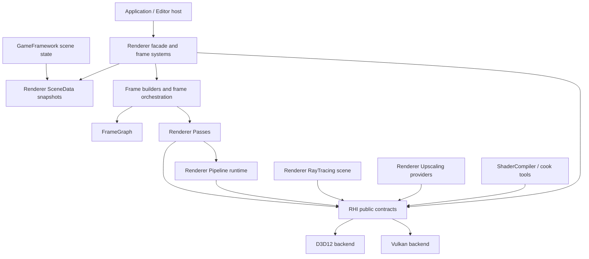
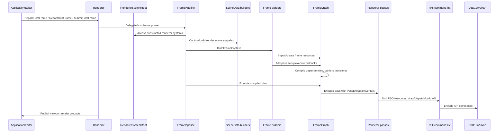
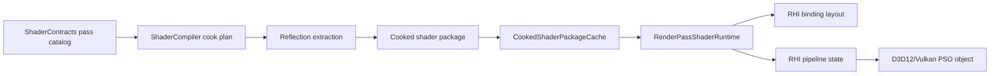
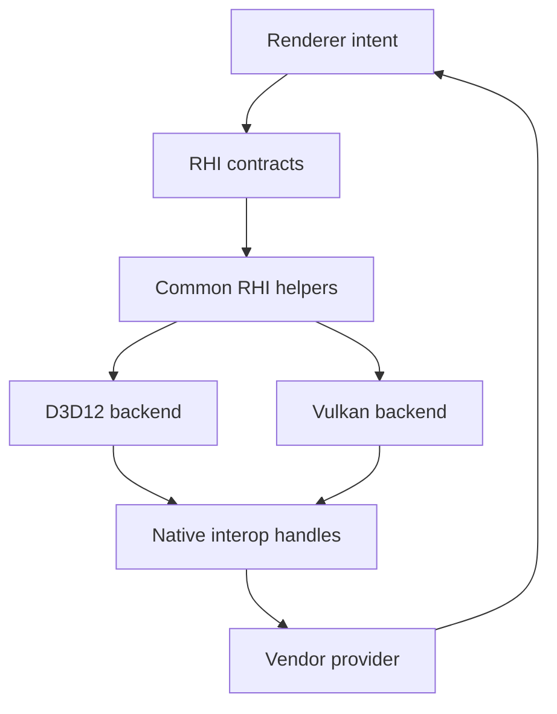

# Rendering System Map

Status: Stage 2 reviewer system map
Date: 2026-06-12
Last synchronized: 2026-06-13

## Purpose

This document is the reviewer entry point for Sparkle's rendering architecture. It explains the current module hierarchy, the intended ownership boundaries, and the runtime flow before a reviewer opens individual implementation files.

Source basis:

- arc42 building-block, runtime-view, and context/scope sections: https://arc42.org/overview
- NVIDIA Donut's visible split between core, engine, render, app, shaders, and NVRHI: https://github.com/NVIDIA-RTX/Donut
- NVIDIA Donut-Samples threaded rendering sample for independent command-list recording: https://github.com/NVIDIA-RTX/Donut-Samples/tree/main/examples/threaded_rendering
- NVIDIA Falcor's docs that make `RenderPasses`, render graphs, samples, and shader/data layout easy to find: https://github.com/NVIDIAGameWorks/Falcor/blob/master/docs/getting-started.md
- Diligent Engine multithreading and command-queue samples for deferred contexts, command lists, queues, and fences: https://github.com/DiligentGraphics/DiligentSamples/tree/master/Tutorials

Companion docs:

- [Whole-repository architecture review](../plans/sparkle-whole-repository-architecture-review.md)
- [Repository system map](repository-system-map.md)
- [Repository coverage status](repository-coverage-status.md)
- [Target folder architecture](after/repository-target-folder-architecture.md)
- [GameFramework contract](game-framework-contract.md)
- [Tooling and content pipeline contract](tooling-pipeline-contract.md)
- [Rendering glossary](rendering-glossary.md)
- [Render scene data contract](render-scene-data-contract.md)
- [RHI contract map](rhi-contract-map.md)
- [Frame graph contract](frame-graph-contract.md)
- [Ray tracing contract](ray-tracing-contract.md)
- [Pass authoring contract](pass-authoring-contract.md)
- [Pipeline runtime contract](pipeline-runtime-contract.md)
- [Threading readiness](after/repository-threading-readiness.md)
- [Upscaler provider contract](upscaler-provider-contract.md)
- [Rendering coverage status](rendering-coverage-status.md)

## Layer Hierarchy

Sparkle's renderer follows this intended direction:

```text
Core -> Platform -> RHI -> Renderer -> GameFramework -> Editor/Application
```

For rendering work, the practical dependency shape is:



Important rule: the arrow from `Tools` to `RHI` is current-state shorthand for shared shader package structs and reflection formats. The target route is `ShaderCompiler -> ShaderContracts -> Renderer/RHI shader primitives`; runtime engine modules must not depend on tool internals.

For whole-repository boundaries, use [repository-system-map.md](repository-system-map.md). This rendering map remains the detailed view for frame rendering and graphics contracts.

## Source Roots

| Root | Role | Reviewer should inspect |
| --- | --- | --- |
| [Engine/Renderer/Public](../../Engine/Renderer/Public) | Public renderer API, debug contracts, frame graph handles/descs, render-domain DTOs, shader parameter authoring, viewport products. | API width, stability, whether public types leak internals. |
| [Engine/Renderer/Private](../../Engine/Renderer/Private) | Renderer implementation: frame setup, graph, passes, pipeline runtime, ray tracing scene, scene data, textures, upscaling, diagnostics. | Ownership clarity and whether each subsystem has one reason to change. |
| Target `Engine/Renderer/Private/PassCatalog` and `Engine/Renderer/Shaders` ([folder plan](after/repository-target-folder-architecture.md)) | Renderer-owned pass metadata and renderer pass shader sources. | Whether adding a pass avoids RHI edits and duplicate registration paths. |
| [Engine/RHI/Public](../../Engine/RHI/Public) | API-neutral graphics contracts: device, commands, resources, pipeline descs, descriptors, shaders, memory, ray tracing, diagnostics, validation. | Whether concepts are GPU/API-level rather than renderer-level. |
| [Engine/RHI/Private](../../Engine/RHI/Private) | Common RHI helpers plus D3D12/Vulkan backend implementations. | Backend privacy, service symmetry, diagnostics, and type conversion completeness. |
| Target `Engine/RHI/Private/Services`, `D3D12`, and `Vulkan` | API-neutral RHI services plus sibling backend implementations. | Whether service folders clarify ownership without becoming new broad facades. |
| [Tools/Shaders/ShaderCompiler](../../Tools/Shaders/ShaderCompiler) | Shader compilation, reflection extraction, cook graph, package writing, CLI inspection. | Whether pass authoring and runtime packages can evolve without RHI-specific renderer edits. |
| [Engine/Application/Private/Validation](../../Engine/Application/Private/Validation) | Smoke validation orchestration. | Whether validation orchestrates systems without owning backend-native implementation details. |
| [Tools/Launcher/SparkleLauncher/Private/Launch/Smoke](../../Tools/Launcher/SparkleLauncher/Private/Launch/Smoke) | Launcher smoke workflow. | Whether reviewer-facing launch/validation paths are discoverable and repeatable. |
| [Engine/GameFramework](../../Engine/GameFramework) | Runtime scene, levels, cooked asset loading, gameplay-facing data contracts. | Whether renderer refactors preserve immutable scene/cooked-data contracts. |
| [Tools/Cooking](../../Tools/Cooking) and [Tools/Import](../../Tools/Import) | Source import and cooked artifact production. | Whether RHI/Renderer schema changes preserve cook/runtime compatibility. |

## Main Building Blocks

| Building block | Current owner | Current files | Does own | Does not own |
| --- | --- | --- | --- | --- |
| Renderer facade | Renderer | [Renderer.h](../../Engine/Renderer/Public/Renderer.h), [Renderer.cpp](../../Engine/Renderer/Private/Renderer.cpp) | Stable host-facing render lifecycle, diagnostics entry points, shader reload, RHI access, viewport presentation lifecycle, and viewport capture requests. | Subsystem construction, frame graph execution, backend implementation details, shader compiler internals, gameplay entity ownership, frame graph resource-state policy. |
| Renderer system root | Renderer | [RendererSystemRoot.h](../../Engine/Renderer/Private/Host/RendererSystemRoot.h), [RendererSystemRoot.cpp](../../Engine/Renderer/Private/Host/RendererSystemRoot.cpp) | Renderer subsystem construction/lifetime: backend services, pipeline manager, feature systems, scene builders, caches, memory monitor, and post-load flush. | Per-frame graph execution, host API policy, backend-native implementation. |
| Frame pipeline | Renderer | [FramePipeline.h](../../Engine/Renderer/Private/FramePipeline/FramePipeline.h), [FramePipeline.cpp](../../Engine/Renderer/Private/FramePipeline/FramePipeline.cpp) | Begin/setup/record/submit/end frame, resize, frame graph lifetime, viewport products, viewport presentation bridge, frame diagnostics, frame context build, RT/upscaler frame handoff. | Subsystem construction/lifetime, backend command implementation, Application/editor UI policy. |
| Scene bridge | Renderer | [SceneData](../../Engine/Renderer/Private/SceneData), [render-scene-data-contract.md](render-scene-data-contract.md) | Renderer-owned frame snapshot and render-domain scene data built from GameFramework snapshots. | Live gameplay mutation, source import/cook policy, GPU resource creation policy outside mesh/material/texture feature systems. |
| Frame builders | Renderer | [Frame](../../Engine/Renderer/Private/Frame) | Per-frame camera, lighting, temporal, mesh, skinning, presentation, and pass composition data. | Pass shader binding internals or backend command encoding. |
| Frame graph | Renderer | [FrameGraph](../../Engine/Renderer/Private/FrameGraph) | Pass/resource declaration, dependency compile, transient planning, barrier planning, execution order, and hard validation diagnostics for unresolved resources/barriers. | API-specific barriers beyond RHI `ResourceState` vocabulary, pass shader policy, or recoverable fallback paths for broken graph contracts. |
| Passes | Renderer | [Passes](../../Engine/Renderer/Private/Passes) | Feature render work, pass parameters, graph resource use, command recording. | Backend-specific pipeline creation or renderer-wide shader package registry policy. |
| Pipeline runtime | Renderer | [Pipeline](../../Engine/Renderer/Private/Pipeline) | Pass runtime lookup, package loading, binding layout creation, PSO request construction. | D3D12/Vulkan native PSO object creation. |
| RHI facade and first services | RHI | [RenderHardwareInterface.h](../../Engine/RHI/Public/Device/RenderHardwareInterface.h), [Interop](../../Engine/RHI/Public/Interop), [Capture](../../Engine/RHI/Public/Capture), [Diagnostics](../../Engine/RHI/Public/Diagnostics), [Presentation](../../Engine/RHI/Public/Presentation) | API-neutral device/resource/descriptor/pipeline/memory operations plus first service edges for interop, capture/readback, diagnostics, and presentation/UI. | Renderer feature concepts like shadows, GBuffer, lighting, or pass names except debug labels. |
| RHI command list | RHI | [RenderCommandList.h](../../Engine/RHI/Public/Commands/RenderCommandList.h) | GPU command operations and diagnostic scopes. | Frame graph scheduling or pass parameter validation. |
| Backends | RHI backend | [D3D12](../../Engine/RHI/Private/D3D12), [Vulkan](../../Engine/RHI/Private/Vulkan) | API object lifetime, native type conversion, command encoding, descriptors, memory, swap chain, debug layers. | Renderer policy and vendor feature selection. |
| Ray tracing scene | Renderer | [RayTracing](../../Engine/Renderer/Private/RayTracing) | BLAS cache policy, TLAS instance data, renderer-level capability report, shadow settings. | API-native AS build implementation. |
| Upscaling | Renderer providers plus RHI interop | [Upscaling](../../Engine/Renderer/Private/Upscaling), [NvidiaDlss](../../Engine/Renderer/Private/Upscaling/NvidiaDlss), [Interop](../../Engine/RHI/Public/Interop), [upscaler-provider-contract.md](upscaler-provider-contract.md) | Provider selection, provider-neutral input/evaluation contracts, provider diagnostics, DLSS/passthrough behavior, fallback reasons, and provider target isolation. | Backend handle fabrication, API feature enablement, or vendor SDK policy in common renderer/RHI code. |
| Shader compiler | Tooling | [ShaderCompiler](../../Tools/Shaders/ShaderCompiler) | Compile/cook/reflect/package/inspect shader artifacts. | Runtime rendering or backend command recording. |

## Disposition-Driven Rendering Decisions

| Current building block | Disposition | Target action |
| --- | --- | --- |
| Renderer facade | Improve and extract | Keep host-facing lifecycle, but split frame pipeline, scene staging, pass authoring, feature providers, and presentation products. |
| Scene bridge | Improve and extract | Consume `RenderContracts` snapshots instead of direct mutable GameFramework state. |
| Frame builders and frame graph | Keep and refine | Preserve renderer ownership and improve diagnostics/resource validation. |
| Renderer passes | Keep and refine | Preserve pass ownership above RHI; require pass definitions to name graph resources, shader package, PSO intent, and diagnostics. |
| `RenderPassPipelineTraits` | Replace or redesign | Remove central per-pass traits in favor of pass catalog/runtime registration. |
| `PipelineStateManager` type-index identity | Replace or redesign | Replace implicit C++ type identity with explicit `PsoKey` and `PipelineRuntimeLibrary`. |
| RHI broad facade | Improve and extract | Stage 7 introduced first public services for interop, capture/readback, diagnostics, and presentation/UI; Stage 19 removes root-facade bulk after caller migration. |
| Application D3D12 capture body | Replace or redesign | Move backend-native capture/readback to RHI/backend validation services. |
| Renderer-level Vulkan linkage for DLSS | Improve and extract | `SparkleRenderer` no longer links Vulkan directly; `SparkleRendererNvidiaDlssProvider` owns the narrow provider SDK/native linkage. |
| ShaderCompiler renderer edge | Improve and extract | Replace renderer target linkage with `ShaderContracts` pass catalog/package manifest consumption. |

## Rendering Complexity Budget

| Rendering area | Complexity that earns its right | Complexity to remove or redesign |
| --- | --- | --- |
| Renderer facade | Stable host protocol, lifecycle, diagnostics entry points. | Owning every subsystem directly because it is convenient. |
| Scene staging | Conversion from `RenderContracts` snapshots to render-domain data. | Direct mutation/read of GameFramework internals. |
| Frame graph | Resource lifetime, pass order, barriers, diagnostics. | Silent warnings, hidden resource aliases, pass-specific hacks. |
| Pass system | Feature-specific draw/dispatch intent and validation names. | Backend-specific pass code or central per-pass boilerplate. |
| Pipeline runtime | Explicit package/layout/PSO identity and reload diagnostics. | `std::type_index` identity and opaque lazy runtime state. |
| Providers | SDK-specific policy and fallback reasons. | Vendor SDK calls in ordinary passes or root RHI policy. |

## Frame Runtime View

Current frame execution after Stage 11, simplified:



The frame graph owns execution order and resource transitions. Passes own command intent. RHI owns command vocabulary and backend translation.

## Threading Readiness View

Rendering remains allowed to execute serially. The architecture must still preserve phases that can later become jobs.

```mermaid
flowchart LR
    Game[GameFramework mutation]
    Snapshot[Immutable RenderContracts snapshot]
    Stage[Renderer scene/resource staging]
    Setup[FrameGraph setup]
    Compile[FrameGraph compile]
    Record[Per-pass/view command batches]
    Submit[RHI central submission]
    Backend[D3D12/Vulkan queues]

    Game --> Snapshot
    Snapshot --> Stage
    Stage --> Setup
    Setup --> Compile
    Compile --> Record
    Record --> Submit
    Submit --> Backend
```



Threading-ready rules:

- Renderer does not read mutable GameFramework internals during pass execution.
- Frame graph compile output is a frozen `FrameGraphPlan`.
- Pass execution can be described as command batches with pass/view/resource/queue identity.
- RHI submission remains centralized, so future worker recording does not become arbitrary backend queue access.

## Shader Package Runtime View



Current renderer pass shader registrations live in [Engine/Renderer/ShaderRegistrations](../../Engine/Renderer/ShaderRegistrations). The target design improves this into `ShaderContracts` pass catalogs and package manifests so registration identity is not duplicated between pass code and cook metadata. RHI keeps only generic package layout, reflection, cache, and runtime primitives.

## Backend Boundary View



The backend boundary is correct only when Renderer talks through `RHI/Public` contracts and native SDKs receive explicit interop metadata instead of hidden backend casts.

## Current Known Architecture Gaps

| Gap | Evidence | Owning stage |
| --- | --- | --- |
| Renderer pass addition requires central runtime/traits edits. | [RenderPassPipelineTraits.h](../../Engine/Renderer/Private/Pipeline/RenderPassPipelineTraits.h) specializes each pass. | Stage 16, Stage 17 |
| RHI root interface is broad. | [RenderHardwareInterface.h](../../Engine/RHI/Public/Device/RenderHardwareInterface.h) contains device, capture, command list, descriptors, constants, resources, memory, ray tracing, views, UI, and presentation. | Stage 6, Stage 7, Stage 19 |
| PSO identity is implicit. | [PipelineStateManager.h](../../Engine/Renderer/Private/Pipeline/PipelineStateManager.h) keys pass runtimes by `std::type_index`. | Stage 16 |

## Reviewer Navigation

Read in this order:

1. [Rendering glossary](rendering-glossary.md)
2. [Rendering coverage status](rendering-coverage-status.md)
3. [Render scene data contract](render-scene-data-contract.md)
4. [RHI contract map](rhi-contract-map.md)
5. [Frame graph contract](frame-graph-contract.md)
6. [Pass authoring contract](pass-authoring-contract.md)
7. [Pipeline runtime contract](pipeline-runtime-contract.md)
8. [Ray tracing contract](ray-tracing-contract.md)

Then inspect implementation:

- [Renderer public API](../../Engine/Renderer/Public/Renderer.h)
- [RHI public facade](../../Engine/RHI/Public/Device/RenderHardwareInterface.h)
- [Frame graph root](../../Engine/Renderer/Private/FrameGraph/FrameGraph.h)
- [Pass runtime traits](../../Engine/Renderer/Private/Pipeline/RenderPassPipelineTraits.h)
- [D3D12 backend root](../../Engine/RHI/Private/D3D12/D3D12RenderHardwareInterface.h)
- [Vulkan backend root](../../Engine/RHI/Private/Vulkan/VulkanRenderHardwareInterface.h)

## Acceptance For Later Stages

- New renderer features must name their owner layer using this map.
- Any new dependency edge must be checked against the layer hierarchy.
- Any new pass must obey the [pass authoring contract](pass-authoring-contract.md).
- Any new RHI method must be categorized in the [RHI contract map](rhi-contract-map.md).
- Any new shader/runtime path must be represented in the [pipeline runtime contract](pipeline-runtime-contract.md).
