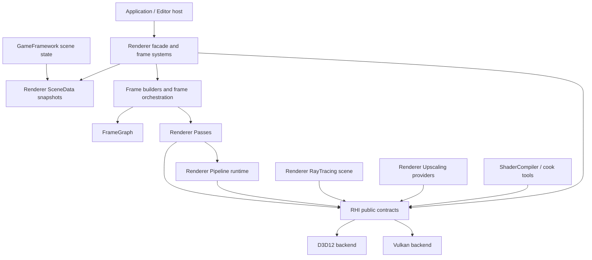
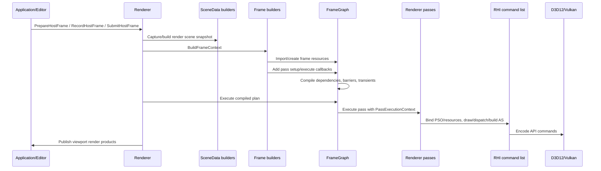
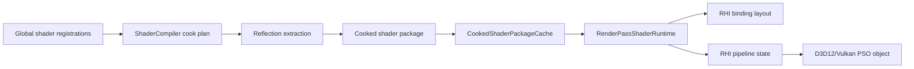
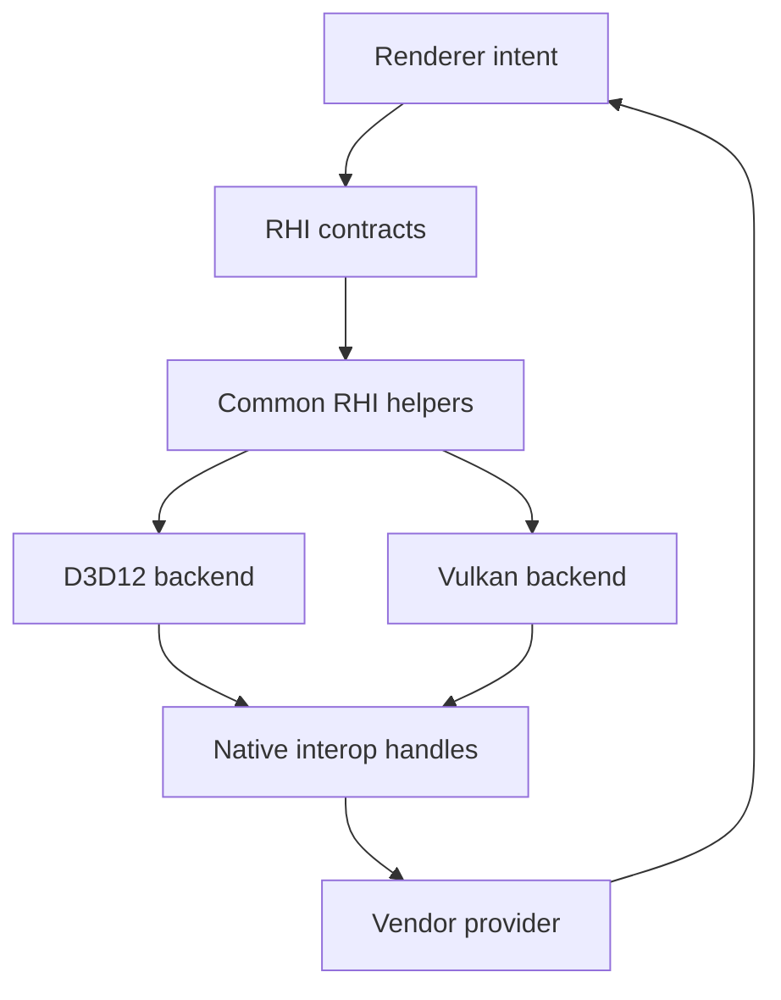

# Rendering System Map

Status: Stage 2 reviewer system map
Date: 2026-06-12

## Purpose

This document is the reviewer entry point for Sparkle's rendering architecture. It explains the current module hierarchy, the intended ownership boundaries, and the runtime flow before a reviewer opens individual implementation files.

Source basis:

- arc42 building-block, runtime-view, and context/scope sections: https://arc42.org/overview
- NVIDIA Donut's visible split between core, engine, render, app, shaders, and NVRHI: https://github.com/NVIDIA-RTX/Donut
- NVIDIA Falcor's docs that make `RenderPasses`, render graphs, samples, and shader/data layout easy to find: https://github.com/NVIDIAGameWorks/Falcor/blob/master/docs/getting-started.md

Companion docs:

- [Rendering glossary](rendering-glossary.md)
- [RHI contract map](rhi-contract-map.md)
- [Frame graph contract](frame-graph-contract.md)
- [Ray tracing contract](ray-tracing-contract.md)
- [Pass authoring contract](pass-authoring-contract.md)
- [Pipeline runtime contract](pipeline-runtime-contract.md)
- [Rendering coverage status](rendering-coverage-status.md)

## Layer Hierarchy

Sparkle's renderer follows this intended direction:

```text
Core -> Platform -> RHI -> Renderer -> GameFramework -> Editor/Application
```

For rendering work, the practical dependency shape is:



Important rule: the arrow from `Tools` to `RHI` is for shared shader package structs and reflection formats. Runtime engine modules must not depend on tool internals.

## Source Roots

| Root | Role | Reviewer should inspect |
| --- | --- | --- |
| [Engine/Renderer/Public](../../Engine/Renderer/Public) | Public renderer API, debug contracts, frame graph handles/descs, render-domain DTOs, shader parameter authoring, viewport products. | API width, stability, whether public types leak internals. |
| [Engine/Renderer/Private](../../Engine/Renderer/Private) | Renderer implementation: frame setup, graph, passes, pipeline runtime, ray tracing scene, scene data, textures, upscaling, diagnostics. | Ownership clarity and whether each subsystem has one reason to change. |
| [Engine/RHI/Public](../../Engine/RHI/Public) | API-neutral graphics contracts: device, commands, resources, pipeline descs, descriptors, shaders, memory, ray tracing, diagnostics, validation. | Whether concepts are GPU/API-level rather than renderer-level. |
| [Engine/RHI/Private](../../Engine/RHI/Private) | Common RHI helpers plus D3D12/Vulkan backend implementations. | Backend privacy, service symmetry, diagnostics, and type conversion completeness. |
| [Tools/Shaders/ShaderCompiler](../../Tools/Shaders/ShaderCompiler) | Shader compilation, reflection extraction, cook graph, package writing, CLI inspection. | Whether pass authoring and runtime packages can evolve without RHI-specific renderer edits. |
| [Engine/Application/Private/Validation](../../Engine/Application/Private/Validation) | Smoke validation orchestration. | Whether validation orchestrates systems without owning backend-native implementation details. |
| [Tools/Launcher/SparkleLauncher/Private/Launch/Smoke](../../Tools/Launcher/SparkleLauncher/Private/Launch/Smoke) | Launcher smoke workflow. | Whether reviewer-facing launch/validation paths are discoverable and repeatable. |

## Main Building Blocks

| Building block | Current owner | Current files | Does own | Does not own |
| --- | --- | --- | --- | --- |
| Renderer facade | Renderer | [Renderer.h](../../Engine/Renderer/Public/Renderer.h), [Renderer.cpp](../../Engine/Renderer/Private/Renderer.cpp) | Host-facing render lifecycle, subsystem construction, frame render products, diagnostics entry points. | Backend implementation details, shader compiler internals, gameplay entity ownership. |
| Scene bridge | Renderer | [SceneData](../../Engine/Renderer/Private/SceneData) | Immutable render-domain scene data built from game/editor state. | GPU resource creation policy outside mesh/material/texture feature systems. |
| Frame builders | Renderer | [Frame](../../Engine/Renderer/Private/Frame) | Per-frame camera, lighting, temporal, mesh, skinning, presentation, and pass composition data. | Pass shader binding internals or backend command encoding. |
| Frame graph | Renderer | [FrameGraph](../../Engine/Renderer/Private/FrameGraph) | Pass/resource declaration, dependency compile, transient planning, barrier planning, execution order, diagnostics. | API-specific barriers beyond RHI `ResourceState` vocabulary. |
| Passes | Renderer | [Passes](../../Engine/Renderer/Private/Passes) | Feature render work, pass parameters, graph resource use, command recording. | Backend-specific pipeline creation or renderer-wide shader package registry policy. |
| Pipeline runtime | Renderer | [Pipeline](../../Engine/Renderer/Private/Pipeline) | Pass runtime lookup, package loading, binding layout creation, PSO request construction. | D3D12/Vulkan native PSO object creation. |
| RHI facade | RHI | [RenderHardwareInterface.h](../../Engine/RHI/Public/Device/RenderHardwareInterface.h) | API-neutral device/resource/descriptor/pipeline/memory/interop/diagnostic operations. | Renderer feature concepts like shadows, GBuffer, lighting, or pass names except debug labels. |
| RHI command list | RHI | [RenderCommandList.h](../../Engine/RHI/Public/Commands/RenderCommandList.h) | GPU command operations and diagnostic scopes. | Frame graph scheduling or pass parameter validation. |
| Backends | RHI backend | [D3D12](../../Engine/RHI/Private/D3D12), [Vulkan](../../Engine/RHI/Private/Vulkan) | API object lifetime, native type conversion, command encoding, descriptors, memory, swap chain, debug layers. | Renderer policy and vendor feature selection. |
| Ray tracing scene | Renderer | [RayTracing](../../Engine/Renderer/Private/RayTracing) | BLAS cache policy, TLAS instance data, renderer-level capability report, shadow settings. | API-native AS build implementation. |
| Upscaling | Renderer plus RHI interop | [Upscaling](../../Engine/Renderer/Private/Upscaling), [Interop](../../Engine/RHI/Public/Interop) | Provider selection, DLSS/passthrough behavior, upscaler input contract, fallback reasons. | Backend handle fabrication or API feature enablement. |
| Shader compiler | Tooling | [ShaderCompiler](../../Tools/Shaders/ShaderCompiler) | Compile/cook/reflect/package/inspect shader artifacts. | Runtime rendering or backend command recording. |

## Frame Runtime View

Current frame execution, simplified:



The frame graph owns execution order and resource transitions. Passes own command intent. RHI owns command vocabulary and backend translation.

## Shader Package Runtime View



Current debt: several renderer pass shader registrations live in [Engine/RHI/Private/Shaders](../../Engine/RHI/Private/Shaders). Stage 4 moves renderer-specific registration ownership above RHI while preserving generic shader package primitives.

## Backend Boundary View



The backend boundary is correct only when Renderer talks through `RHI/Public` contracts and native SDKs receive explicit interop metadata instead of hidden backend casts.

## Current Known Architecture Gaps

| Gap | Evidence | Owning stage |
| --- | --- | --- |
| RHI includes renderer-private shader data. | `Engine/RHI/Private/Shaders/DirectLightingShaders.cpp` includes `Renderer/Private/RayTracing/RayTracedShadowUniformData.h`. | Stage 3, Stage 4 |
| Renderer pass addition requires central runtime/traits edits. | [RenderPassPipelineTraits.h](../../Engine/Renderer/Private/Pipeline/RenderPassPipelineTraits.h) specializes each pass. | Stage 16, Stage 17 |
| `Renderer` is still a broad facade/composition/frame host. | [Renderer.h](../../Engine/Renderer/Public/Renderer.h) owns many subsystem pointers and lifecycle methods. | Stage 11, Stage 12 |
| RHI root interface is broad. | [RenderHardwareInterface.h](../../Engine/RHI/Public/Device/RenderHardwareInterface.h) contains device, capture, command list, descriptors, constants, resources, memory, ray tracing, views, UI, and presentation. | Stage 6, Stage 7, Stage 19 |
| Application validation owns backend-native D3D12 capture. | [RhiSmokeEditorValidation.cpp](../../Engine/Application/Private/Validation/RhiSmokeEditorValidation.cpp) contains D3D12-native capture code. | Stage 8, Stage 10 |
| PSO identity is implicit. | [PipelineStateManager.h](../../Engine/Renderer/Private/Pipeline/PipelineStateManager.h) keys pass runtimes by `std::type_index`. | Stage 16 |

## Reviewer Navigation

Read in this order:

1. [Rendering glossary](rendering-glossary.md)
2. [Rendering coverage status](rendering-coverage-status.md)
3. [RHI contract map](rhi-contract-map.md)
4. [Frame graph contract](frame-graph-contract.md)
5. [Pass authoring contract](pass-authoring-contract.md)
6. [Pipeline runtime contract](pipeline-runtime-contract.md)
7. [Ray tracing contract](ray-tracing-contract.md)

Then inspect implementation:

- [Renderer public API](../../Engine/Renderer/Public/Renderer.h)
- [RHI public facade](../../Engine/RHI/Public/Device/RenderHardwareInterface.h)
- [Frame graph root](../../Engine/Renderer/Private/FrameGraph/FrameGraph.h)
- [Pass runtime traits](../../Engine/Renderer/Private/Pipeline/RenderPassPipelineTraits.h)
- [D3D12 backend root](../../Engine/RHI/Private/D3D12/D3D12RenderHardwareInterface.h)
- [Vulkan backend root](../../Engine/RHI/Private/Vulkan/VulkanRenderHardwareInterface.h)

## Acceptance For Later Stages

- New renderer features must name their owner layer using this map.
- Any new dependency edge must be checked against the layer hierarchy.
- Any new pass must obey the [pass authoring contract](pass-authoring-contract.md).
- Any new RHI method must be categorized in the [RHI contract map](rhi-contract-map.md).
- Any new shader/runtime path must be represented in the [pipeline runtime contract](pipeline-runtime-contract.md).

