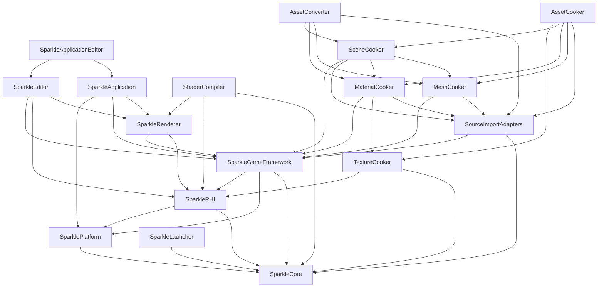

# Repository System Map

Status: whole-repository architecture map
Date: 2026-06-12
Last synchronized: 2026-06-13

## Purpose

This document extends the renderer/RHI review into a whole-repository architecture map. The goal is to keep future RHI and Renderer refactors from accidentally damaging GameFramework, editor/application hosts, launcher workflows, shader tooling, or the content pipeline.

Companion docs:

- [Whole-repository architecture review](../plans/sparkle-whole-repository-architecture-review.md)
- [Rendering system map](rendering-system-map.md)
- [Rendering coverage status](rendering-coverage-status.md)
- [Repository coverage status](repository-coverage-status.md)
- [GameFramework contract](game-framework-contract.md)
- [Tooling and content pipeline contract](tooling-pipeline-contract.md)
- [Architecture boundary guardrails](architecture-boundary-guardrails.md)
- [Target folder architecture](after/repository-target-folder-architecture.md)
- [Threading readiness](after/repository-threading-readiness.md)

Reference basis:

- NVIDIA NVRHI focused RHI and backend libraries: https://github.com/NVIDIA-RTX/NVRHI
- NVIDIA NRI modular D3D12/Vulkan render interface: https://github.com/NVIDIA-RTX/NRI
- NVIDIA Donut renderer/app/scene framework above NVRHI: https://github.com/NVIDIA-RTX/Donut
- NVIDIA Falcor render graph, scene, shader, and RTX integration framework: https://github.com/NVIDIAGameWorks/Falcor
- NVIDIA Streamline feature integration framework: https://github.com/NVIDIA-RTX/Streamline
- AMD Cauldron DX12/Vulkan framework separation: https://github.com/GPUOpen-LibrariesAndSDKs/Cauldron
- AMD FidelityFX SDK provider/sample ecosystem: https://github.com/GPUOpen-LibrariesAndSDKs/FidelityFX-SDK
- AMD Compressonator texture/model optimization tool suite: https://github.com/GPUOpen-Tools/compressonator
- NVIDIA Donut threaded rendering sample: https://github.com/NVIDIA-RTX/Donut-Samples/tree/main/examples/threaded_rendering
- AMD Cauldron thread pool and command-list rings: https://github.com/GPUOpen-LibrariesAndSDKs/Cauldron
- Diligent Engine multithreading and command-queue samples: https://github.com/DiligentGraphics/DiligentSamples/tree/master/Tutorials
- NVIDIA async compute and overlap guidance: https://developer.nvidia.com/blog/advanced-api-performance-async-compute-and-overlap/
- arc42 system/context and building-block views: https://arc42.org/overview
- CMake target usage requirements: https://cmake.org/cmake/help/latest/command/target_link_libraries.html
- Qt model/view separation for launcher UI structure: https://doc.qt.io/qt-6/model-view-programming.html
- Khronos glTF runtime asset delivery: https://registry.khronos.org/glTF/specs/2.0/glTF-2.0.html
- Khronos KTX texture tooling and container model: https://github.com/KhronosGroup/KTX-Software

## Repository Layers

Sparkle has two connected systems:

- Runtime/editor engine modules under `Engine/`.
- Host tools under `Tools/` that build, cook, launch, validate, and inspect runtime artifacts.

Intended dependency rule:

```text
Core is the foundation.
Platform owns OS/window/input.
RHI owns GPU/API contracts and backend implementations.
Renderer owns render intent, frame graph, passes, and renderer features.
GameFramework owns runtime scenes, levels, gameplay-facing assets, and cooked-data loading.
Editor/Application own host orchestration and editor UI.
Tools own source import, cooking, shader compilation, launcher workflows, and artifact production.
Runtime engine modules must not depend on tool internals.
Future multithreading depends on these same boundaries: runtime, renderer, RHI, tools, launcher, and CI must exchange immutable snapshots, DTOs, manifests, command batches, queue packets, requests, and reports instead of private mutable state.
```

Current practical dependency shape:



Notes:

- The `ShaderCompiler --> Renderer` edge is current-state only. The target replaces it with `ShaderCompiler --> ShaderContracts`, so the compiler consumes pass catalogs and package manifests without linking full renderer runtime behavior.
- `GameFramework --> RHI` exists today for shared render/cooked asset contracts. It must not grow into renderer pass, backend, descriptor, or command ownership.
- `Renderer --> GameFramework` exists today while renderer consumes scene and asset state. The target direction is immutable render-domain snapshots and DTOs so renderer refactors do not mutate gameplay ownership.
- `Tools --> GameFramework` exists for public imported/cooked data contracts. Tools must not depend on GameFramework private runtime loading policy.

## Stage 23 Dependency Intent

The detailed source-root freeze lives in [repository-coverage-status.md](repository-coverage-status.md). This table is the broad edge policy used before stages 24-33 move code.

| Edge family | Allowed contact | Forbidden contact | Data transfer shape |
| --- | --- | --- | --- |
| `Core -> all modules` | Core may provide foundation primitives, diagnostics, math, file/string/event/time/input value types. | Core must not include Platform, RHI, Renderer, GameFramework, Editor, Application, or Tools policy. | Plain value types, diagnostics records, file/path helpers, event primitives. |
| `Platform -> Core` | Platform may consume Core and OS/window/input APIs. | Platform must not own renderer frame graph, RHI backend details, editor workflow, or tool policy. | Window/input events and platform state packets. |
| `RHI -> Core/Platform` | RHI may consume Core, Platform, backend SDKs inside backend folders, and RHI-owned third-party allocators. | RHI must not include `Engine/Renderer/Private`, GameFramework gameplay objects, Application validation bodies, or `Tools/*`. | Public RHI descriptors, handles, service requests, capability reports, command lists, diagnostics. |
| `Renderer -> RHI` | Renderer may consume public RHI services and descriptors. | Renderer must not include D3D12/Vulkan private headers outside documented provider integration. | Frame graph plans, resource/view descriptors, pipeline keys, command-recording contexts. |
| `Renderer -> GameFramework` | Renderer may consume immutable render-domain snapshots/DTOs and cooked runtime records. | Renderer must not mutate live gameplay state or import/cook source structures. | Render scene snapshots, mesh/material/camera/light DTOs, temporal frame inputs. |
| `GameFramework -> Core/Platform/public schemas` | GameFramework may own runtime scenes, levels, cooked loading, and public asset contracts. | GameFramework must not depend on `Engine/Renderer/Private`, `Engine/RHI/Private`, or `Tools/*`. | Runtime scene state, cooked asset records, renderer-facing snapshots. |
| `Editor/Application -> public Engine APIs` | Hosts may orchestrate lifecycle, UI, validation, presentation, and public renderer/RHI services. | Hosts must not own backend-native capture, renderer-private transitions, cook/import algorithms, or vendor SDK policy. | Host requests, viewport/presentation DTOs, validation configs, smoke evidence. |
| `Tools -> public contracts` | Tools may consume public cooked/import/shader schemas and focused tool libraries. | Tools must not depend on runtime private implementation, renderer private systems, or RHI backend-private headers. | Source DTOs, cooked artifacts, shader packages, reports, process exit evidence. |
| `LauncherCore -> tools/processes` | LauncherCore may plan and execute build/cook/launch/process requests. | LauncherCore and Qt widgets must not implement cook/import/shader/render algorithms. | Process requests, environment packets, operation reports, history records. |
| `CMake/CI -> targets` | Build/CI may encode target usage requirements and local-equivalent validation commands. | Build/CI must not hide architecture by broad public include/link scopes or CI-only behavior. | `PUBLIC`/`PRIVATE`/`INTERFACE` target links, artifact paths, validation commands. |
| `Projects -> public Engine` | Projects may consume public engine modules and project-local source/content. | Projects must not include private engine/tool internals or store generated logs as source. | Project manifests, source assets, cooked outputs, smoke artifacts. |

## Source Roots

| Root | Owner | Does own | Must not own |
| --- | --- | --- | --- |
| [Engine/Core](../../Engine/Core) | Foundation | Diagnostics, logging, math, files, strings, events, input value types, time helpers. | Platform windows, GPU concepts, renderer/game/tool policy. |
| [Engine/Platform](../../Engine/Platform) | Platform abstraction | Window/input/system integration above Core. | Renderer frame graph, RHI backend details, source/cook tools. |
| [Engine/RHI](../../Engine/RHI) | Graphics contract and backend implementations | GPU/API concepts, resources, descriptors, commands, shader package primitives, diagnostics, D3D12/Vulkan backends. | Renderer pass concepts, gameplay scene ownership, tool execution policy. |
| [Engine/Renderer](../../Engine/Renderer) | Render system | Frame graph, passes, renderer-owned shader registrations, pipeline runtime, ray tracing scene, upscaling, render diagnostics. | D3D12/Vulkan private headers, source import/cooking internals, gameplay mutation. |
| [Engine/GameFramework](../../Engine/GameFramework) | Runtime world and cooked scene/assets | Levels, scene entities/components, cameras, lighting, cooked asset loading, runtime scene contracts. | Source import/cooking algorithms, renderer pass/runtime internals, backend-native RHI objects. |
| [Engine/Editor](../../Engine/Editor) | Editor UI surface | Editor panels, viewport UI, controls, editor-facing models. | Asset cooking implementation, source import internals, backend-native capture. |
| [Engine/Application](../../Engine/Application) | Runtime/editor host | App lifecycle, runtime/editor composition, validation orchestration, console commands. | Backend-native validation implementation, cook/import logic, renderer internals. |
| [Tools/Launcher/SparkleLauncher](../../Tools/Launcher/SparkleLauncher) | Developer workflow product | Build/cook/launch/maintenance workflows, process orchestration, Qt UI models/shell/widgets. | Actual cook/import/render implementation. |
| [Tools/Shaders/ShaderCompiler](../../Tools/Shaders/ShaderCompiler) | Shader toolchain | Shader compile, reflection, cook packages, verification, package inspection. | Runtime rendering, backend command recording, launcher UI. |
| [Tools/Import/SourceImportAdapters](../../Tools/Import/SourceImportAdapters) | Source asset adapters | glTF/FBX/source scene translation into imported DTOs and diagnostics. | Cooked runtime loading, renderer GPU resources. |
| [Tools/Cooking](../../Tools/Cooking) | Cook pipeline | Texture/mesh/material/scene cooking, cook orchestration, common tool console. | Runtime scene mutation, renderer frame graph, backend command encoding. |
| [Tools/Conversion/AssetConverter](../../Tools/Conversion/AssetConverter) | Direct conversion/debug CLI | Developer command surface over focused import/cook modules. | Owning import/cook algorithms long term. |
| [Projects](../../Projects) | Sample project content | Runnable project manifests, assets, showcase content. | Engine/tool architecture policy. |
| [CMake](../../CMake) | Build infrastructure | Profiles, dependency fetch, Qt discovery, artifacts, release assembly, validation targets. | Runtime logic or durable generated artifacts. |
| [.github](../../.github) | CI workflow | Repeatable validation wiring. | Local-only machine state. |
| [docs](../) | Architecture and execution records | Architecture contracts, coverage maps, target maps, stage prompts, tutor notes, and evidence routing. | Generated logs/artifacts, stale paths, or contradictory plans. |
| [External/NVIDIA](../../External/NVIDIA) | Vendor SDK holding root | Vendor SDK inputs consumed by narrow provider/build integration when present. | Engine policy edits inside vendor code or broad runtime linkage. |

## Disposition-Driven Target Map

This table applies the keep/improve/replace rule to the current source roots. It is intentionally stricter than the current dependency graph.

| Current root or body | Disposition | Target action | New or stable name |
| --- | --- | --- | --- |
| [Engine/Core](../../Engine/Core) | Keep and refine | Keep only foundation utilities; reject platform/render/tool policy. | `Core` |
| [Engine/Platform](../../Engine/Platform) | Improve and extract | Keep OS/window/input; move presentation and host policy upward. | `Platform` |
| [Engine/RHI](../../Engine/RHI) facade | Improve and extract | Split broad facade into explicit GPU/API services and public contracts. | `RhiContracts`, RHI services |
| [Engine/RHI/Private/D3D12](../../Engine/RHI/Private/D3D12), [Vulkan](../../Engine/RHI/Private/Vulkan) | Keep and refine | Preserve backend-private trees and tighten parity/service symmetry. | `D3D12Backend`, `VulkanBackend` |
| [Engine/Renderer](../../Engine/Renderer) facade | Improve and extract | Keep host-facing renderer entry point; split frame pipeline, scene staging, pass authoring, and providers. | `Renderer`, `FramePipeline`, `RenderFeatures` |
| Renderer pass traits and shader registration duplication | Replace or redesign | Remove central per-pass traits and duplicate package declarations. | `PassCatalog`, `PipelineRuntimeLibrary`, `ShaderContracts` |
| [Engine/GameFramework](../../Engine/GameFramework) | Improve and extract | Keep runtime scene/cooked loading; extract shared schemas and renderer handoff. | `AssetContracts`, `RenderContracts` |
| [Engine/Editor](../../Engine/Editor) | Improve and extract | Keep editor UI; prevent cook/import/backend logic from living in panels. | Editor UI models/panels |
| [Engine/Application](../../Engine/Application) | Improve and extract | Keep host orchestration; move backend-native capture/readback behind RHI/backend services. | Host validation orchestrator |
| [Engine/Assets](../../Engine/Assets) | Replace or redesign | Narrow to built-in engine assets with manifest/validation, or move shaders/data to owner-specific roots. | `Engine/Assets/BuiltIn` or owner-specific shader/data roots |
| [Tools/Shaders/ShaderCompiler](../../Tools/Shaders/ShaderCompiler) | Improve and extract | Consume shader/pass contracts, not renderer runtime. | `ShaderCompiler` + `ShaderContracts` |
| [Tools/Import/SourceImportAdapters](../../Tools/Import/SourceImportAdapters) | Improve and extract | Rename/extract from pattern-centered adapters to focused source importers. | `SourceImporters` |
| Focused cookers under [Tools/Cooking](../../Tools/Cooking) | Keep and refine | Keep focused transformations; tighten schemas, diagnostics, and inspectors. | `TextureCooker`, `MeshCooker`, `MaterialCooker`, `SceneCooker` |
| [Tools/Cooking/AssetCooker](../../Tools/Cooking/AssetCooker) | Improve and extract | Keep orchestration only; remove duplicated cook algorithms. | `AssetCooker` |
| [Tools/Conversion/AssetConverter](../../Tools/Conversion/AssetConverter) | Replace or redesign | Fold into AssetCooker or explicit inspect/debug commands. | No production `AssetConverter` path |
| [Tools/Cooking/CookCommon](../../Tools/Cooking/CookCommon) | Improve and extract | Rename/split vague common helpers into support and diagnostics surfaces. | `ToolConsoleSupport`, `CookDiagnostics` |
| [Tools/Launcher/SparkleLauncher](../../Tools/Launcher/SparkleLauncher) core | Improve and extract | Keep workflow orchestration; prevent UI/tool algorithm duplication. | `LauncherCore`, `ToolContracts` |
| Launcher Qt GUI | Keep and refine | Preserve presentation split; models observe LauncherCore state. | Qt models/widgets |
| [CMake](../../CMake) | Improve and extract | Make target scopes express ownership and validation. | Narrow target graph |
| [.github](../../.github) | Improve and extract | Mirror local checks and tool validation. | CI evidence workflows |
| [Projects](../../Projects) | Keep and refine | Keep representative content and smoke coverage. | `Showcase` evidence project |
| [docs](../) | Keep and refine | Keep before/after docs, contracts, stage maps, and evidence aligned with code. | Architecture evidence set |

## Module Right-To-Exist Budget

| Module/system | Complexity that earns its right to exist | Complexity that does not |
| --- | --- | --- |
| `Engine/Core` | Small shared primitives with many consumers and no domain policy. | Convenience wrappers for one subsystem or policy hidden in foundation. |
| `Engine/Platform` | OS/window/input behavior that cannot live in Core. | Renderer presentation policy or editor workflow. |
| `Engine/RHI` | API-neutral GPU contracts, explicit native interop, backend parity diagnostics. | Renderer convenience methods, pass names, broad service-locator behavior. |
| D3D12/Vulkan backends | Native API translation, validation, memory/resource/pipeline services. | Cross-backend dependencies or renderer/vendor feature policy. |
| `Engine/Renderer` | Frame graph, pass authoring, pipeline runtime, render features, diagnostics. | Duplicate pass/package registries, central traits churn, backend-native shortcuts. |
| `Engine/GameFramework` | Runtime scene/cooked loading and gameplay-facing state. | Source import, cook policy, shared schema ownership, renderer pass data. |
| `Engine/Editor` | UI panels and editor models that present public system state. | Tool algorithms, backend capture, renderer internals. |
| `Engine/Application` | Host lifecycle and validation orchestration. | Native backend capture/readback bodies or hidden service locator behavior. |
| `Engine/Assets` | Concrete built-in assets with documented source/cooked policy, or no root if ownership moves elsewhere. | Ambiguous asset roots mixing built-ins, renderer shaders, and project content. |
| `ShaderCompiler` | Compile/reflection/package/inspect logic through `ShaderContracts`. | Full renderer runtime linkage or duplicated pass catalog. |
| `SourceImporters` | Per-format importers and DTO diagnostics. | Runtime loader policy or renderer resource creation. |
| Focused cookers | Deterministic artifact transforms and schema diagnostics. | Project workflow, UI prompts, runtime mutation. |
| `AssetCooker` | Planning, dispatch, aggregation, reports. | Reimplemented cooker algorithms. |
| `AssetConverter` | Only explicit inspect/debug commands that do not mutate cook policy. | A parallel production cook pipeline. |
| `ToolConsoleSupport` / `CookDiagnostics` | Shared reporting/console behavior with no asset policy. | Broad `Common` helper ownership. |
| Launcher | Process orchestration, operation state, evidence, presentation. | Build/cook/shader algorithms in GUI code. |
| CMake/CI | Dependency ownership and repeatable validation. | Broad transitive links and hidden CI-only behavior. |
| `Projects` | Sample content that exercises cook/load/render paths. | Decorative samples that do not validate contracts. |
| `docs` | Navigation, contracts, evidence, current/target truth. | Unlinked docs or prose that duplicates without deciding. |

## Threading Readiness Overlay

Threading readiness is documented in [after/repository-threading-readiness.md](after/repository-threading-readiness.md). This map applies it to source-root ownership.

| Source area | Mutable owner before future threading | Allowed handoff shape | Forbidden shortcut |
| --- | --- | --- | --- |
| `Engine/GameFramework` | Runtime scene/update phase. | Immutable `RenderContracts` snapshots and versioned `AssetContracts` records. | Renderer or tools reading mutable gameplay/private loader state. |
| `Engine/Renderer` | Frame pipeline, scene staging, frame graph, pass execution phases. | Frame-scoped render data, `FrameGraphPlan`, command batches, diagnostics records. | Worker tasks mutating shared renderer globals or live GameFramework objects. |
| `Engine/RHI` | RHI services and selected backend queue/submission owner. | Per-frame/per-queue command lists, submission packets, fences, capability reports. | Workers borrowing native command objects from hidden global state. |
| `Tools/Import` and `Tools/Cooking` | Import/cook job owners. | Imported DTOs, cooked artifact temp outputs, final manifests, reports. | Tool jobs writing final artifacts before validation or mutating runtime state. |
| `Tools/Shaders/ShaderCompiler` | Shader package job owner. | Package manifests, reflection, backend-format outputs, inspection reports. | Reading full renderer runtime state to discover packages. |
| `Tools/Launcher/SparkleLauncher` | LauncherCore operation state, Qt UI presentation state. | Process requests, operation reports, history records. | Qt widgets starting worker threads or tools directly. |

## Refactor Blast-Radius Rules

Before changing RHI or Renderer contracts, check all affected consumers:

| Change area | Must check |
| --- | --- |
| RHI shader package/reflection/layout types | `ShaderCompiler`, renderer shader registrations, pass runtime, shader package cache, package inspection commands. |
| RHI texture/cooked texture contracts | `TextureCooker`, `MaterialCooker`, `SceneCooker`, `GameFramework` cooked asset loaders, renderer texture manager. |
| RHI resource states/native interop | Renderer frame graph, upscaling providers, Application validation, launcher smoke workflows. |
| Renderer scene DTOs or snapshots | `GameFramework` scene/camera/light/mesh/material data, `SceneCooker`, editor viewport behavior. |
| GameFramework cooked asset schemas | Import adapters, mesh/material/scene cookers, asset converter, runtime loaders, renderer scene data builders. |
| Tool target names or artifact paths | Launcher workflow catalog, AssetCooker dispatcher, CMake artifact contract, and build/validation docs. |
| Build profile or dependency changes | Launcher, cook tools, shader compiler, projects, CI workflows, generated artifact layout. |

## Whole-Repo Acceptance

Sparkle should not be called architecturally review-ready until:

- Runtime modules do not depend on tool internals.
- Tools use public engine data contracts or focused tool libraries instead of private runtime implementation details.
- Launcher workflows invoke tools/processes and report evidence instead of duplicating tool logic.
- GameFramework remains cooked-data/runtime-scene oriented and does not absorb renderer pass, backend, or source-import responsibilities.
- RHI/Renderer boundary checks still pass after tool and GameFramework refactors.
- ShaderCompiler, AssetCooker, TextureCooker, and SparkleLauncher remain buildable validation targets.
- Architecture docs and coverage status include every durable source root except generated/local-only folders.
