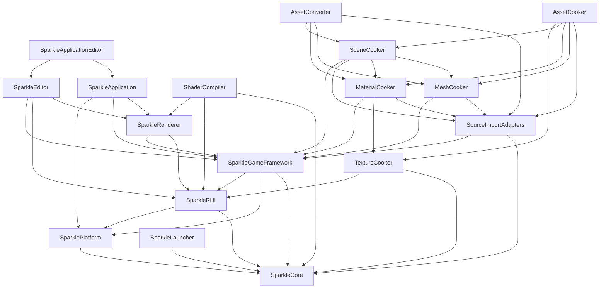

# Repository System Map

Status: whole-repository architecture map
Date: 2026-06-12

## Purpose

This document extends the renderer/RHI review into a whole-repository architecture map. The goal is to keep future RHI and Renderer refactors from accidentally damaging GameFramework, editor/application hosts, launcher workflows, shader tooling, or the content pipeline.

Companion docs:

- [Whole-repository architecture review](../plans/sparkle-whole-repository-architecture-review.md)
- [Rendering system map](rendering-system-map.md)
- [Rendering coverage status](rendering-coverage-status.md)
- [Repository coverage status](repository-coverage-status.md)
- [GameFramework contract](game-framework-contract.md)
- [Tooling and content pipeline contract](tooling-pipeline-contract.md)
- [Architecture boundary guardrails](architecture-boundary-guardrails.md)

Reference basis:

- NVIDIA NVRHI focused RHI and backend libraries: https://github.com/NVIDIA-RTX/NVRHI
- NVIDIA NRI modular D3D12/Vulkan render interface: https://github.com/NVIDIA-RTX/NRI
- NVIDIA Donut renderer/app/scene framework above NVRHI: https://github.com/NVIDIA-RTX/Donut
- NVIDIA Falcor render graph, scene, shader, and RTX integration framework: https://github.com/NVIDIAGameWorks/Falcor
- NVIDIA Streamline feature integration framework: https://github.com/NVIDIA-RTX/Streamline
- AMD Cauldron DX12/Vulkan framework separation: https://github.com/GPUOpen-LibrariesAndSDKs/Cauldron
- AMD FidelityFX SDK provider/sample ecosystem: https://github.com/GPUOpen-LibrariesAndSDKs/FidelityFX-SDK
- AMD Compressonator texture/model optimization tool suite: https://github.com/GPUOpen-Tools/compressonator
- arc42 system/context and building-block views: https://arc42.org/overview
- CMake target usage requirements: https://cmake.org/cmake/help/latest/command/target_link_libraries.html
- Qt model/view separation for launcher UI structure: https://doc.qt.io/qt-6/model-view-programming.html
- Khronos glTF runtime asset delivery: https://registry.khronos.org/glTF/specs/2.0/glTF-2.0.html
- Khronos KTX texture tooling and container model: https://github.com/KhronosGroup/KTX-Software

## Repository Layers

Sparkle has two connected systems:

- Runtime/editor engine modules under `Engine/`.
- Host tools under `Tools/` that build, cook, launch, validate, and inspect runtime artifacts.

Intended dependency rule:

```text
Core is the foundation.
Platform owns OS/window/input.
RHI owns GPU/API contracts and backend implementations.
Renderer owns render intent, frame graph, passes, and renderer features.
GameFramework owns runtime scenes, levels, gameplay-facing assets, and cooked-data loading.
Editor/Application own host orchestration and editor UI.
Tools own source import, cooking, shader compilation, launcher workflows, and artifact production.
Runtime engine modules must not depend on tool internals.
```

Current practical dependency shape:



Notes:

- The `ShaderCompiler --> Renderer` edge is intentionally narrow: it consumes the renderer-owned shader registration target, not full renderer runtime behavior.
- `GameFramework --> RHI` exists today for shared render/cooked asset contracts. It must not grow into renderer pass, backend, descriptor, or command ownership.
- `Renderer --> GameFramework` exists today while renderer consumes scene and asset state. The target direction is immutable render-domain snapshots and DTOs so renderer refactors do not mutate gameplay ownership.
- `Tools --> GameFramework` exists for public imported/cooked data contracts. Tools must not depend on GameFramework private runtime loading policy.

## Source Roots

| Root | Owner | Does own | Must not own |
| --- | --- | --- | --- |
| [Engine/Core](../../Engine/Core) | Foundation | Diagnostics, logging, math, files, strings, events, input value types, time helpers. | Platform windows, GPU concepts, renderer/game/tool policy. |
| [Engine/Platform](../../Engine/Platform) | Platform abstraction | Window/input/system integration above Core. | Renderer frame graph, RHI backend details, source/cook tools. |
| [Engine/RHI](../../Engine/RHI) | Graphics contract and backend implementations | GPU/API concepts, resources, descriptors, commands, shader package primitives, diagnostics, D3D12/Vulkan backends. | Renderer pass concepts, gameplay scene ownership, tool execution policy. |
| [Engine/Renderer](../../Engine/Renderer) | Render system | Frame graph, passes, renderer-owned shader registrations, pipeline runtime, ray tracing scene, upscaling, render diagnostics. | D3D12/Vulkan private headers, source import/cooking internals, gameplay mutation. |
| [Engine/GameFramework](../../Engine/GameFramework) | Runtime world and cooked scene/assets | Levels, scene entities/components, cameras, lighting, cooked asset loading, runtime scene contracts. | Source import/cooking algorithms, renderer pass/runtime internals, backend-native RHI objects. |
| [Engine/Editor](../../Engine/Editor) | Editor UI surface | Editor panels, viewport UI, controls, editor-facing models. | Asset cooking implementation, source import internals, backend-native capture. |
| [Engine/Application](../../Engine/Application) | Runtime/editor host | App lifecycle, runtime/editor composition, validation orchestration, console commands. | Backend-native validation implementation, cook/import logic, renderer internals. |
| [Tools/Launcher/SparkleLauncher](../../Tools/Launcher/SparkleLauncher) | Developer workflow product | Build/cook/launch/maintenance workflows, process orchestration, Qt UI models/shell/widgets. | Actual cook/import/render implementation. |
| [Tools/Shaders/ShaderCompiler](../../Tools/Shaders/ShaderCompiler) | Shader toolchain | Shader compile, reflection, cook packages, verification, package inspection. | Runtime rendering, backend command recording, launcher UI. |
| [Tools/Import/SourceImportAdapters](../../Tools/Import/SourceImportAdapters) | Source asset adapters | glTF/FBX/source scene translation into imported DTOs and diagnostics. | Cooked runtime loading, renderer GPU resources. |
| [Tools/Cooking](../../Tools/Cooking) | Cook pipeline | Texture/mesh/material/scene cooking, cook orchestration, common tool console. | Runtime scene mutation, renderer frame graph, backend command encoding. |
| [Tools/Conversion/AssetConverter](../../Tools/Conversion/AssetConverter) | Direct conversion/debug CLI | Developer command surface over focused import/cook modules. | Owning import/cook algorithms long term. |
| [Projects](../../Projects) | Sample project content | Runnable project manifests, assets, showcase content. | Engine/tool architecture policy. |
| [CMake](../../CMake) | Build infrastructure | Profiles, dependency fetch, Qt discovery, artifacts, release assembly, validation targets. | Runtime logic or durable generated artifacts. |
| [.github](../../.github) | CI workflow | Repeatable validation wiring. | Local-only machine state. |

## Refactor Blast-Radius Rules

Before changing RHI or Renderer contracts, check all affected consumers:

| Change area | Must check |
| --- | --- |
| RHI shader package/reflection/layout types | `ShaderCompiler`, renderer shader registrations, pass runtime, shader package cache, package inspection commands. |
| RHI texture/cooked texture contracts | `TextureCooker`, `MaterialCooker`, `SceneCooker`, `GameFramework` cooked asset loaders, renderer texture manager. |
| RHI resource states/native interop | Renderer frame graph, upscaling providers, Application validation, launcher smoke workflows. |
| Renderer scene DTOs or snapshots | `GameFramework` scene/camera/light/mesh/material data, `SceneCooker`, editor viewport behavior. |
| GameFramework cooked asset schemas | Import adapters, mesh/material/scene cookers, asset converter, runtime loaders, renderer scene data builders. |
| Tool target names or artifact paths | Launcher workflow catalog, AssetCooker dispatcher, CMake artifact contract, README/build docs. |
| Build profile or dependency changes | Launcher, cook tools, shader compiler, projects, CI workflows, generated artifact layout. |

## Whole-Repo Acceptance

Sparkle should not be called architecturally review-ready until:

- Runtime modules do not depend on tool internals.
- Tools use public engine data contracts or focused tool libraries instead of private runtime implementation details.
- Launcher workflows invoke tools/processes and report evidence instead of duplicating tool logic.
- GameFramework remains cooked-data/runtime-scene oriented and does not absorb renderer pass, backend, or source-import responsibilities.
- RHI/Renderer boundary checks still pass after tool and GameFramework refactors.
- ShaderCompiler, AssetCooker, TextureCooker, and SparkleLauncher remain buildable validation targets.
- Architecture docs and coverage status include every durable source root except generated/local-only folders.
