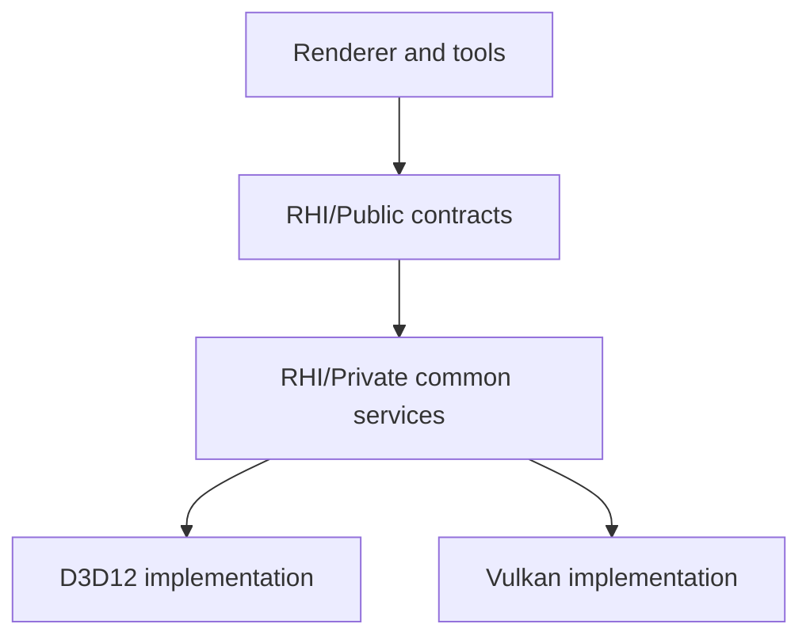

# RHI Contract Map

Status: Stage 2 reviewer contract
Date: 2026-06-12

## Purpose

This document explains what the Render Hardware Interface owns, what it must not own, and how its broad current facade maps to future service responsibilities.

Primary code references:

- [RenderHardwareInterface.h](../../Engine/RHI/Public/Device/RenderHardwareInterface.h)
- [RenderCommandList.h](../../Engine/RHI/Public/Commands/RenderCommandList.h)
- [RenderDeviceServices.h](../../Engine/RHI/Public/Device/RenderDeviceServices.h)
- [D3D12 backend](../../Engine/RHI/Private/D3D12)
- [Vulkan backend](../../Engine/RHI/Private/Vulkan)

Reference basis:

- NVIDIA Donut uses NVRHI as the graphics abstraction while application/device-manager code handles windows/devices: https://github.com/NVIDIA-RTX/Donut
- arc42 building-block and interface documentation guidance: https://arc42.org/overview

## Contract Summary

RHI owns API-neutral GPU contracts. It is allowed to expose graphics concepts that exist in D3D12/Vulkan: devices, queues, command lists, resources, descriptors, memory, pipeline state, shader bytecode/reflection primitives, ray tracing acceleration structure descriptors, diagnostics, validation, swap chain/presentation surfaces, and explicit native interop.

RHI must not own renderer feature concepts such as GBuffer layout, lighting composition, ray traced shadow quality, upscaler selection, frame graph pass names, gameplay scene data, or material policy.

## Backend Boundary

Only `RHI/Public` is visible to Renderer. `RHI/Private/D3D12` and `RHI/Private/Vulkan` are backend-private implementation roots.

## Public Facade Ownership

The current `RenderHardwareInterface` is intentionally mapped before Stage 6/7 service extraction.

| Responsibility | Current methods or types | Current owner | Target owner after refactor |
| --- | --- | --- | --- |
| Capabilities and backend identity | `GetCapabilities`, `GetBackendApi`, `GetRequiredShaderBinaryFormat`, `GetRayTracingCapabilities` | RHI facade | RHI capability service |
| Frame/device lifetime | `GetCurrentFrameIndex`, `WaitForIdle`, `GetDeviceHandle`, `GetGraphicsQueueHandle`, `UpgradePresentationInterface` | RHI facade | RHI device service plus interop service |
| Capture/readback | `CaptureTextureToBmp` | RHI facade | RHI/backend capture service, called by validation orchestration |
| Command lists | `GetGraphicsCommandList` | RHI facade | RHI command service |
| Diagnostics | `GetDiagnostics` | RHI facade | RHI diagnostics service |
| Binding layouts and binding sets | `CreateBindingSet`, `CreateBindingLayout`, `BindGlobalDescriptorState` | RHI facade | RHI descriptor/binding service |
| Pipeline state | `CreateGraphicsPipelineState`, `CreateComputePipelineState` | RHI facade | RHI pipeline service |
| Descriptor allocation | `AllocateDescriptor`, `ReleaseDescriptor`, `AllocateDescriptorTable`, `ReleaseDescriptorTable`, descriptor handle getters | RHI facade | RHI descriptor service |
| Constant buffers | `GetPerFrameConstantData`, `GetPerFrameConstantGpuAddress`, `AllocateUniformConstantBuffer`, per-view/object allocation methods | RHI facade | RHI upload/constant-buffer service |
| Samplers | `GetSharedSamplerBinding` | RHI facade | RHI sampler service |
| Presentation | `GetBackBufferViewport`, `GetBackBufferScissorRect`, `GetBackBufferRenderTargetView`, `GetBackBufferResource`, present pass methods, `GetPresentColorFormat` | RHI facade | RHI presentation service |
| Texture upload/runtime assets | `CreateTexture` | RHI facade | RHI texture upload service |
| Resource creation/lifetime | `CreateTextureResource`, `CreateBufferResource`, vertex/index/structured buffer creation, `ReleaseOwnedResource`, native/gpu-address getters | RHI facade | RHI resource service |
| Ray tracing resources | AS prebuild methods, scratch/result/instance buffer creation | RHI facade | RHI ray tracing service |
| Transient memory/aliasing | `GetTextureAllocationInfo`, `GetBufferAllocationInfo`, transient block and aliasing resource methods | RHI facade | RHI memory/resource service |
| Resource views/native interop | `CreateResourceView`, view release/handle getters, `GetNativeTextureViewInfo` | RHI facade | RHI view/interop service |
| UI bridge | `ResolveImGuiTextureId` | RHI facade | RHI UI service |
| Feature queries | `SupportsUnorderedAccess` | RHI facade | RHI resource/capability service |

Current debt: the facade is broad because it holds many service categories. The mapping above is the required baseline for Stage 6 and Stage 7.

## Command List Contract

`RenderCommandList` is the RHI command vocabulary. It should stay GPU/API-level.

| Category | Current methods | Allowed concepts | Forbidden concepts |
| --- | --- | --- | --- |
| Native and diagnostics | `GetBackendApi`, `GetNativeHandle`, diagnostic scope/marker methods | API identity, native handle, GPU marker labels. | Renderer pass scheduling or frame graph ownership. |
| Pipeline binding | `SetPipelineState`, graphics/compute binding layout methods | Runtime pipeline state and binding layout objects. | Pass type names as semantic logic. |
| Resource binding | Constant buffers, shader resources, UAVs, descriptor tables, push constants | Binding index, GPU address, descriptor handles, descriptor table binding. | Material slots or pass-specific fallback behavior. |
| Draw/dispatch | topology, vertex/index buffers, draw, dispatch | GPU draw/dispatch semantics. | Mesh cache policy or visibility decisions. |
| Render targets | RTV/DSV binding, clear, viewport, scissor | Render target descriptors and fixed-function viewport/scissor. | Frame graph resource lifetime. |
| Ray tracing | BLAS/TLAS build commands | API-neutral acceleration structure build inputs. | Shadow quality, denoiser, or scene membership policy. |
| Copy/barriers | copy, alias, transition, UAV barrier | Resource state and synchronization intent. | Suppressing frame graph barrier errors. |

## Backend Services

The D3D12 and Vulkan folders already have similar service groupings. Stage 19 should keep this symmetry visible.

| Service | D3D12 files | Vulkan files | Shared rule |
| --- | --- | --- | --- |
| Device/bootstrap | [D3D12/Device](../../Engine/RHI/Private/D3D12/Device), root D3D12 RHI files | [Vulkan/Device](../../Engine/RHI/Private/Vulkan/Device), root Vulkan RHI files | Select adapter/device/queue/capabilities and log feature reasons. |
| Commands | [D3D12/Commands](../../Engine/RHI/Private/D3D12/Commands) | [Vulkan/Commands](../../Engine/RHI/Private/Vulkan/Commands) | Encode the same RHI command semantics in API-specific form. |
| Descriptors | [D3D12/Descriptors](../../Engine/RHI/Private/D3D12/Descriptors) | [Vulkan/Descriptors](../../Engine/RHI/Private/Vulkan/Descriptors) | Own allocation, lifetime, shader-visible policy, and diagnostics. |
| Diagnostics | [D3D12/Diagnostics](../../Engine/RHI/Private/D3D12/Diagnostics) | [Vulkan/Diagnostics](../../Engine/RHI/Private/Vulkan/Diagnostics) | Own debug layers, markers, object names, and backend messages. |
| Memory | [D3D12/Memory](../../Engine/RHI/Private/D3D12/Memory) | [Vulkan/Memory](../../Engine/RHI/Private/Vulkan/Memory) | Own allocation strategy, alignment, budgets, and external-memory constraints. |
| Pipeline | [D3D12/Pipeline](../../Engine/RHI/Private/D3D12/Pipeline) | [Vulkan/Pipeline](../../Engine/RHI/Private/Vulkan/Pipeline) | Consume normalized descriptors and reflection; create native PSO/layout objects. |
| Resources/textures | [D3D12/Resources](../../Engine/RHI/Private/D3D12/Resources), [D3D12/Textures](../../Engine/RHI/Private/D3D12/Textures) | [Vulkan/Resources](../../Engine/RHI/Private/Vulkan/Resources), [Vulkan/Textures](../../Engine/RHI/Private/Vulkan/Textures) | Own native resource/image/buffer/view creation and upload paths. |
| Samplers | [D3D12/Samplers](../../Engine/RHI/Private/D3D12/Samplers) | [Vulkan/Samplers](../../Engine/RHI/Private/Vulkan/Samplers) | Map `RhiSamplerDesc` consistently. |
| Swap chain | [D3D12/SwapChain](../../Engine/RHI/Private/D3D12/SwapChain) | [Vulkan/SwapChain](../../Engine/RHI/Private/Vulkan/SwapChain) | Own back-buffer acquisition, resize, present formats, and presentable state. |
| UI | [D3D12/UI](../../Engine/RHI/Private/D3D12/UI) | [Vulkan/UI](../../Engine/RHI/Private/Vulkan/UI) | Own ImGui backend integration without leaking native objects upward. |

## Native Interop Contract

Native interop is allowed but must be explicit.

Allowed:

- `NativeGraphicsDeviceHandle`, `NativeGraphicsQueueHandle`, and `NativeGraphicsCommandListHandle` for APIs that need native device/queue/list handles.
- `NativeResourceHandle` and `NativeTextureViewInfo` for external SDK resource/view metadata.
- Backend capability flags that explain whether a native interop path is ready.

Not allowed:

- Renderer code including D3D12/Vulkan backend-private headers.
- Vendor provider code guessing Vulkan layouts or D3D12 states without RHI-provided metadata.
- Application validation implementing permanent backend-native capture paths.

## Shader Contract Boundary

Generic shader runtime primitives are allowed in RHI:

- [CookedShaderPackage.h](../../Engine/RHI/Public/Shaders/CookedShaderPackage.h)
- [ShaderReflection.h](../../Engine/RHI/Public/Shaders/ShaderReflection.h)
- [ShaderBytecode.h](../../Engine/RHI/Public/Shaders/ShaderBytecode.h)
- [ShaderPackageLayoutBuilder.h](../../Engine/RHI/Public/Shaders/ShaderPackageLayoutBuilder.h)

Renderer-specific pass registrations are not an RHI responsibility.

Current Stage 4 state:

- [Engine/Renderer/ShaderRegistrations](../../Engine/Renderer/ShaderRegistrations) owns pass-specific files like `GBufferShaders.cpp`, `DirectLightingShaders.cpp`, and `VisualizeBuffersShaders.cpp`.
- RHI no longer reaches into Renderer-private ray traced shadow uniform data.

Target:

- RHI keeps generic shader package/reflection/cache primitives.
- Renderer owns pass package declarations and pass-specific shader parameter structs.
- ShaderCompiler consumes RHI shader primitives plus the Renderer-owned shader registration target without linking the full renderer runtime.

## Change Rules

Before adding or changing an RHI method, answer:

1. Is this a GPU/API concept, backend implementation detail, or renderer convenience?
2. Which service category owns it?
3. Which Renderer/tool callers need it?
4. What are the D3D12 and Vulkan semantics?
5. Does it expose native interop? If yes, which consumer owns the metadata contract?
6. What validation artifact proves it works?

Hard gate: adding an ordinary renderer shader pass must not require editing `Engine/RHI` after Stage 4/17 cleanup.

## Open Decisions

| Decision | Why it matters | Owning stage |
| --- | --- | --- |
| RHI service extraction order | Prevents replacing one broad facade with many unclear facades. | Stage 6, Stage 7 |
| Shader parameter authoring owner | Prevents overlap between Renderer public shader parameters and RHI parameter layout. | Stage 4, Stage 17 |
| Native capture/readback service shape | Moves backend-native capture out of Application validation. | Stage 8, Stage 10 |
| Final public interop surface for DLSS/Vulkan | Keeps provider SDK code out of backend internals while preserving correct metadata. | Stage 9, Stage 10 |

## Acceptance Evidence

This contract is accepted when later stages provide:

- A method ownership table for every `RenderHardwareInterface` method.
- Boundary checks proving `RHI -> Renderer` dependency count is zero.
- D3D12/Vulkan backend service map with expected one-backend-only differences documented.
- Smoke logs showing backend API, capabilities, diagnostics, and feature fallback reasons.
- Pass authoring evidence showing a regular pass can be added without RHI edits.
