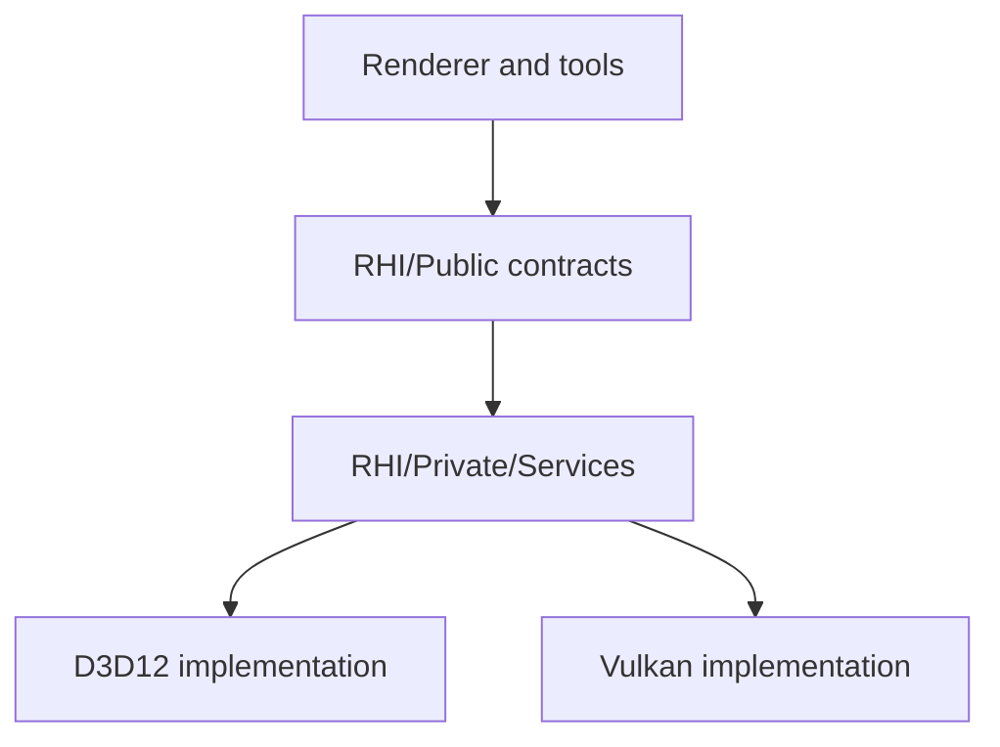

# RHI Contract Map

Status: Stage 7 first service extraction slice
Date: 2026-06-12
Last synchronized: 2026-06-13

## Purpose

This document explains what the Render Hardware Interface owns, what it must not own, and how its broad current facade maps to future service responsibilities.

Primary code references:

- [RenderHardwareInterface.h](../../Engine/RHI/Public/Device/RenderHardwareInterface.h)
- [RenderCommandList.h](../../Engine/RHI/Public/Commands/RenderCommandList.h)
- [RenderDeviceServices.h](../../Engine/RHI/Public/Device/RenderDeviceServices.h)
- [D3D12 backend](../../Engine/RHI/Private/D3D12)
- [Vulkan backend](../../Engine/RHI/Private/Vulkan)
- [Target folder architecture](after/repository-target-folder-architecture.md)

Reference basis:

- NVIDIA NVRHI focused RHI and backend libraries: https://github.com/NVIDIA-RTX/NVRHI
- NVIDIA NRI low-level D3D12/Vulkan render interface: https://github.com/NVIDIA-RTX/NRI
- NVIDIA Donut uses NVRHI as the graphics abstraction while application/device-manager code handles windows/devices: https://github.com/NVIDIA-RTX/Donut
- NVIDIA Donut-Samples threaded rendering records separate command lists and submits them together: https://github.com/NVIDIA-RTX/Donut-Samples/tree/main/examples/threaded_rendering
- AMD Cauldron D3D12/Vulkan command-list rings keep per-frame command allocation explicit: https://github.com/GPUOpen-LibrariesAndSDKs/Cauldron
- Diligent Engine Tutorial 23 demonstrates graphics/compute/transfer queues with fences: https://github.com/DiligentGraphics/DiligentSamples/tree/master/Tutorials/Tutorial23_CommandQueues
- arc42 building-block and interface documentation guidance: https://arc42.org/overview
- Repository threading readiness: [after/repository-threading-readiness.md](after/repository-threading-readiness.md)
- Upscaler provider contract: [upscaler-provider-contract.md](upscaler-provider-contract.md)

## Contract Summary

RHI owns API-neutral GPU contracts. It is allowed to expose graphics concepts that exist in D3D12/Vulkan: devices, queues, command lists, resources, descriptors, memory, pipeline state, shader bytecode/reflection primitives, ray tracing acceleration structure descriptors, diagnostics, validation, swap chain/presentation surfaces, and explicit native interop.

RHI must not own renderer feature concepts such as GBuffer layout, lighting composition, ray traced shadow quality, upscaler selection, frame graph pass names, gameplay scene data, or material policy.

## Backend Boundary

Only `RHI/Public` is visible to Renderer. Target API-neutral implementation lives under `RHI/Private/Services` or an equally focused service structure. `RHI/Private/D3D12` and `RHI/Private/Vulkan` are backend-private sibling implementation roots.

## Public Facade Ownership

The current `RenderHardwareInterface` is intentionally mapped before full facade removal. Stage 7 added first-class public service contracts and kept legacy root methods as migration shims.

| Responsibility | Current methods or types | Current owner | Target owner after refactor |
| --- | --- | --- | --- |
| Capabilities and backend identity | `GetCapabilities`, `GetBackendApi`, `GetRequiredShaderBinaryFormat`, `GetRayTracingCapabilities` | RHI facade | RHI capability service |
| Frame/device lifetime | `GetCurrentFrameIndex`, `WaitForIdle`, legacy `GetDeviceHandle`, legacy `GetGraphicsQueueHandle`, legacy `UpgradePresentationInterface`, `GetInteropService` | RHI facade plus `RhiInteropService` | RHI device service plus interop service |
| Capture/readback | Legacy `CaptureTextureToBmp`, `GetCaptureService` | RHI facade plus `RhiCaptureService` | RHI/backend capture service, called by validation orchestration |
| Command lists | `GetGraphicsCommandList` | RHI facade | RHI command service |
| Diagnostics | Legacy `GetDiagnostics`, `GetDiagnosticsService` | RHI facade plus `RhiDiagnosticsService` | RHI diagnostics service |
| Binding layouts and binding sets | `CreateBindingSet`, `CreateBindingLayout`, `BindGlobalDescriptorState` | RHI facade | RHI descriptor/binding service |
| Pipeline state | `CreateGraphicsPipelineState`, `CreateComputePipelineState` | RHI facade | RHI pipeline service |
| Descriptor allocation | `AllocateDescriptor`, `ReleaseDescriptor`, `AllocateDescriptorTable`, `ReleaseDescriptorTable`, descriptor handle getters | RHI facade | RHI descriptor service |
| Constant buffers | `GetPerFrameConstantData`, `GetPerFrameConstantGpuAddress`, `AllocateUniformConstantBuffer`, per-view/object allocation methods | RHI facade | RHI upload/constant-buffer service |
| Samplers | `GetSharedSamplerBinding` | RHI facade | RHI sampler service |
| Presentation | Legacy back-buffer/present methods, `ResolveImGuiTextureId`, `GetPresentationService` | RHI facade plus `RhiPresentationService` | RHI presentation service |
| Texture upload/runtime assets | `CreateTexture` | RHI facade | RHI texture upload service |
| Resource creation/lifetime | `CreateTextureResource`, `CreateBufferResource`, vertex/index/structured buffer creation, `ReleaseOwnedResource`, native/gpu-address getters | RHI facade | RHI resource service |
| Ray tracing resources | AS prebuild methods, scratch/result/instance buffer creation | RHI facade | RHI ray tracing service |
| Transient memory/aliasing | `GetTextureAllocationInfo`, `GetBufferAllocationInfo`, transient block and aliasing resource methods | RHI facade | RHI memory/resource service |
| Resource views/native interop | `CreateResourceView`, view release/handle getters, `GetNativeTextureViewInfo` | RHI facade | RHI view/interop service |
| UI bridge | `ResolveImGuiTextureId` through `RhiPresentationService` for this first slice | RHI facade plus presentation service | RHI UI service or presentation-adjacent UI service after Stage 12/19 |
| Feature queries | `SupportsUnorderedAccess` | RHI facade | RHI resource/capability service |

Current debt: the facade is still broad because Stage 7 intentionally preserved root compatibility methods. New call sites should use the explicit services unless a later stage has not migrated that area yet.

## Stage 7 Service Contracts

Stage 7 introduced these public service headers:

| Service contract | Header | Current backend shape | First migrated consumers | Remaining cleanup owner |
| --- | --- | --- | --- | --- |
| Interop | [RhiInteropService.h](../../Engine/RHI/Public/Interop/RhiInteropService.h) | D3D12/Vulkan root facades compose a single-interface interop adapter while legacy root methods remain. | DLSS/upscaler initialization, Streamline presentation bridge, FrameGraph native view lookup, transitional editor validation. | Stage 9 removes provider/native interop exceptions; Stage 19 moves implementation out of root facades where useful. |
| Capture/readback | [RhiCaptureService.h](../../Engine/RHI/Public/Capture/RhiCaptureService.h) | D3D12/Vulkan root facades compose a single-interface capture adapter returning `RhiCaptureResult` while legacy `CaptureTextureToBmp` remains. | Editor smoke capture request path. | Stage 8 moves the remaining Application-owned D3D12 capture body behind backend-owned capture/readback. |
| Diagnostics | [RhiDiagnosticsService.h](../../Engine/RHI/Public/Diagnostics/RhiDiagnosticsService.h) | D3D12/Vulkan root facades compose a single-interface diagnostics adapter over the existing diagnostics object. | Renderer diagnostics, runtime/editor smoke diagnostics. | Stage 10 and Stage 20 turn diagnostics into backend parity evidence. |
| Presentation/UI | [RhiPresentationService.h](../../Engine/RHI/Public/Presentation/RhiPresentationService.h) | D3D12/Vulkan root facades compose a single-interface presentation adapter over swap-chain, back-buffer, present-pass, and ImGui texture-id operations. | Application editor present, runtime console overlay, FrameGraph back-buffer resolution, Renderer ImGui texture resolution. | Stage 12 replaces host present internals with a presentation/viewport protocol; Stage 19 slims backend facades. |

The Stage 7 service shape follows the NVRHI/Diligent pattern of narrow graphics services with validation and backend parity, and the Streamline requirement that native interop be explicit for provider integration. It does not claim the root facade is finished.

Service access rule: backend root facades must not inherit from multiple service interfaces. Public services are exposed through composed adapters or extracted service objects. A small adapter may implement one service interface; a backend facade that derives from `RenderHardwareInterface` and several service interfaces is rejected.

## Stage 7 Data Transfer Contracts

| Data crossing | Stage 7 transfer shape | Owner | Rule |
| --- | --- | --- | --- |
| Native device/queue metadata | `RhiNativeDeviceQueueInterop` plus `RhiNativeInteropRequest` consumer/reason. | RHI interop service. | Providers and validation receive typed backend metadata; they do not invent backend handles. |
| Texture/native view metadata | `NativeTextureViewInfo` from `RhiInteropService::GetNativeTextureViewInfo`. | RHI interop service and backend descriptor managers. | Renderer FrameGraph supplies the RHI view handle and resource state; RHI fills native layout/view metadata. |
| External upscaler provider facts | `RhiExternalFeatureInteropCapabilities`, `RhiAdapterIdentity`, provider-owned `UpscalerProviderCapabilities` failure domains. | RHI backend capability builders produce backend facts; renderer provider owns provider interpretation. | RHI reports bridge/native metadata only. DLSS/FSR/NRD policy remains in provider targets and docs. |
| Capture/readback | `RhiTextureCaptureRequest` to `RhiCaptureResult`. | RHI capture service. | Callers receive backend, status, frame, view mode, artifact path, and failure reason. Application-native capture was removed in Stage 8. |
| Presentation/UI | `RhiPresentationService` methods. | RHI presentation service and backend swap-chain/UI integrations. | Application/Renderer use presentation operations, not backend-private swap-chain objects. |
| Diagnostics | `RhiDiagnosticsService::GetDiagnostics`. | RHI diagnostics service. | Diagnostics remain centralized and can become milestone evidence. |

## Complete Root Method Ownership Table

Stage 6 rule: every public `RenderHardwareInterface` method has exactly one primary service owner. Secondary users may exist, but primary ownership cannot be split. New public methods are forbidden unless this table is updated in the same change.

Backend implementation files for every row are the root backend facades unless the service column names a narrower folder:

- D3D12 root: [D3D12RenderHardwareInterface.h](../../Engine/RHI/Private/D3D12/D3D12RenderHardwareInterface.h), [D3D12RenderHardwareInterface.cpp](../../Engine/RHI/Private/D3D12/D3D12RenderHardwareInterface.cpp)
- Vulkan root: [VulkanRenderHardwareInterface.h](../../Engine/RHI/Private/Vulkan/VulkanRenderHardwareInterface.h), [VulkanRenderHardwareInterface.cpp](../../Engine/RHI/Private/Vulkan/VulkanRenderHardwareInterface.cpp)

| Method | Primary service owner | Caller modules / consumers | Backend implementation files | Extraction disposition |
| --- | --- | --- | --- | --- |
| `GetCapabilities` | Device/capability service | Renderer startup, pipeline runtime, ray tracing scene, upscaling diagnostics. | D3D12/Vulkan root and device service files. | Extract early; capability report is read-only and should be queryable without exposing root facade. |
| `GetBackendApi` | Device/capability service | Renderer diagnostics, command lists, validation tooling. | D3D12/Vulkan root. | Keep as capability identity; expose through device/capability service. |
| `GetRequiredShaderBinaryFormat` | Device/capability service | Shader package/runtime loading, ShaderCompiler validation expectations. | D3D12/Vulkan root. | Keep; move behind capability/shader-runtime query. |
| `GetCurrentFrameIndex` | Command queue/list service | Renderer frame orchestration, upload/descriptors, presentation. | D3D12/Vulkan root. | Move with frame/queue context; avoid arbitrary callers depending on global frame index. |
| `WaitForIdle` | Command queue/list service | Renderer shutdown, Application validation, recovery paths. | D3D12/Vulkan root and swap chain/queue files. | Extract to queue/device synchronization service. |
| `GetInteropService` const/non-const | Interop service | Renderer upscaling, FrameGraph native views, Application validation transitional interop. | D3D12/Vulkan root service adapters. | Added in Stage 7; new native interop callers should use this service instead of root native-handle methods. |
| `GetCaptureService` | Capture/readback service | Application/editor smoke capture and future validation capture jobs. | D3D12/Vulkan root service adapters. | Added in Stage 7; Stage 8 moves remaining native capture body behind this service. |
| `GetDiagnosticsService` const/non-const | Diagnostics service | Renderer diagnostics, Runtime/Application smoke validation, future validation milestones. | D3D12/Vulkan root service adapters and Diagnostics folders. | Added in Stage 7; new diagnostics callers should use this service instead of the root diagnostics shim. |
| `GetPresentationService` const/non-const | Presentation service | Application/editor present path, RuntimeConsole overlay, Renderer ImGui texture bridge, FrameGraph back-buffer resolution. | D3D12/Vulkan root service adapters, SwapChain, UI folders. | Added in Stage 7; Stage 12 owns the host presentation protocol and Stage 19 slims backend facades. |
| `GetDeviceHandle` | Interop service | Streamline/provider interop, validation, backend diagnostics. | D3D12/Vulkan root. | Keep only as explicit native interop query with capability/fallback report. |
| `GetGraphicsQueueHandle` | Interop service | Streamline/provider interop, validation. | D3D12/Vulkan root. | Keep only as explicit native interop query; future queue packets should not expose native queue ownership. |
| `UpgradePresentationInterface` | Presentation service | Renderer/host presentation setup. | D3D12/Vulkan root and swap chain files. | Move to presentation bridge; this is not a general device method. |
| `CaptureTextureToBmp` | Capture/readback service | Application smoke/editor validation. | D3D12/Vulkan root; target backend capture/readback service. | Extract in Stage 8; root method should become validation request/result API or disappear. |
| `GetGraphicsCommandList` | Command queue/list service | Frame graph execution, pass execution, renderer command context. | D3D12/Vulkan root and Commands folders. | Extract to command service; future worker recording must request command batches, not global lists. |
| `GetRayTracingCapabilities` | Ray tracing service | Renderer ray tracing capability report. | D3D12/Vulkan root and ray tracing feature query files. | Move with RT service/capability report; keep API-neutral. |
| `GetDiagnostics` | Diagnostics service | Renderer diagnostics, Application smoke validation. | D3D12/Vulkan root and Diagnostics folders. | Extract to diagnostics service; non-const/const overloads share one owner. |
| `CreateBindingSet` | Descriptors/views service | Renderer pass binder, material/texture binding. | D3D12/Vulkan root and Descriptors/Pipeline folders. | Extract to descriptor/binding service; not pipeline-owned even when used by pipeline runtime. |
| `CreateBindingLayout` | Pipelines/binding layouts service | Renderer pipeline runtime, ShaderCompiler/reflection validation consumers. | D3D12/Vulkan root and Pipeline folders. | Extract with pipeline layout service; keep descriptor allocation separate. |
| `CreateGraphicsPipelineState` | Pipelines/binding layouts service | Renderer pipeline runtime and pass traits. | D3D12/Vulkan root and Pipeline folders. | Extract with PSO service in Stage 16/19. |
| `CreateComputePipelineState` | Pipelines/binding layouts service | Renderer pipeline runtime and compute passes. | D3D12/Vulkan root and Pipeline folders. | Extract with PSO service in Stage 16/19. |
| `BindGlobalDescriptorState` | Descriptors/views service | Renderer pass execution before binding pass resources. | D3D12/Vulkan root and Descriptors folders. | Move to descriptor service; root facade should not own global descriptor heap state. |
| `AllocateDescriptor` | Descriptors/views service | Renderer texture/material/view allocation and backend UI helpers. | D3D12/Vulkan root and Descriptors folders. | Extract to descriptor allocator service. |
| `ReleaseDescriptor` | Descriptors/views service | Same as allocation consumers. | D3D12/Vulkan root and Descriptors folders. | Extract to descriptor allocator service with lifetime diagnostics. |
| `AllocateDescriptorTable` | Descriptors/views service | Renderer pass/material descriptor tables. | D3D12/Vulkan root and Descriptors folders. | Extract to descriptor table service. |
| `GetDescriptorTableCpuHandle` | Descriptors/views service | Renderer descriptor writes, UI/provider bridges. | D3D12/Vulkan root and Descriptors folders. | Extract; keep handle typed and table-scoped. |
| `ReleaseDescriptorTable` | Descriptors/views service | Renderer descriptor table lifetime. | D3D12/Vulkan root and Descriptors folders. | Extract with generation/lifetime validation. |
| `AllocateShaderResourceDescriptor` | Descriptors/views service | Texture manager, material cache, ImGui texture bridge. | D3D12/Vulkan root and Descriptors folders. | Replace with narrower SRV allocation/view creation path where possible. |
| `ReleaseShaderResourceDescriptor` | Descriptors/views service | Same as SRV allocation consumers. | D3D12/Vulkan root and Descriptors folders. | Extract; root should not expose allocator internals. |
| `GetPerFrameConstantData` | Constants/uploads service | Renderer frame builders and pass utilities. | D3D12/Vulkan root and Resources/constant-buffer files. | Renderer convenience smell: Stage 7/13 should decide whether frame constants are renderer-owned upload data. |
| `GetPerFrameConstantGpuAddress` | Constants/uploads service | Pass binding and frame execution. | D3D12/Vulkan root and Resources/constant-buffer files. | Extract to upload/constant service; avoid hidden per-frame global. |
| `AllocateUniformConstantBuffer` | Constants/uploads service | Pass binder, shader pass helpers, ray tracing/shadow constants. | D3D12/Vulkan root and Resources/constant-buffer files. | Extract to upload allocator with frame/batch ownership. |
| `AllocatePerViewConstantBuffer` | Constants/uploads service | Frame builders, pass binding. | D3D12/Vulkan root and Resources/constant-buffer files. | Renderer convenience smell; likely move per-view composition upward while keeping generic upload in RHI. |
| `AllocatePerObjectVertexConstants` | Constants/uploads service | Mesh pass/GBuffer draw setup. | D3D12/Vulkan root and Resources/constant-buffer files. | Renderer convenience smell; replace with generic upload + renderer-owned object constant packing. |
| `AllocatePerObjectPixelConstants` | Constants/uploads service | Mesh/material pass setup. | D3D12/Vulkan root and Resources/constant-buffer files. | Renderer convenience smell; replace with generic upload + renderer-owned material/object packing. |
| `GetSharedSamplerBinding` | Descriptors/views service | Pass binder, shader pass helpers. | D3D12/Vulkan root and Samplers folders. | Extract to sampler/descriptor service. |
| `GetBackBufferViewport` | Presentation service | Application/editor host and renderer presentation. | D3D12/Vulkan root and SwapChain folders. | Move behind presentation bridge. |
| `GetBackBufferScissorRect` | Presentation service | Application/editor host and renderer presentation. | D3D12/Vulkan root and SwapChain folders. | Move behind presentation bridge. |
| `GetBackBufferRenderTargetView` | Presentation service | Application/editor present pass. | D3D12/Vulkan root and SwapChain/Descriptors folders. | Move behind presentation bridge; host should not manage raw RTV details. |
| `GetBackBufferResource` | Presentation service | Renderer/Application presentation and validation. | D3D12/Vulkan root and SwapChain/Resources folders. | Move behind presentation/import contract. |
| `CreateTexture` | Resources service | TextureManager and cooked texture loading. | D3D12/Vulkan root and Textures folders. | Keep resource service; ensure cooked asset ownership remains above RHI. |
| `CreateTextureResource` | Resources service | Frame graph transient/persistent resources, render targets, texture manager. | D3D12/Vulkan root and Textures/Resources folders. | Extract to resource creation service. |
| `CreateBufferResource` | Resources service | Frame graph, mesh/ray tracing buffers, upload consumers. | D3D12/Vulkan root and Resources folders. | Extract to resource creation service. |
| `CreateVertexBuffer` | Resources service | GPUMesh upload and GBuffer drawing. | D3D12/Vulkan root and Resources folders. | Renderer convenience smell; consider generic buffer creation plus renderer-owned view construction. |
| `CreateStructuredBuffer` | Resources service | Mesh/skin/material/ray tracing data upload. | D3D12/Vulkan root and Resources folders. | Keep as helper only if descriptors/lifetime are explicit; otherwise split create buffer + view. |
| `CreateIndexBuffer` | Resources service | GPUMesh upload and draw setup. | D3D12/Vulkan root and Resources folders. | Renderer convenience smell; consider generic buffer creation plus renderer-owned view construction. |
| `ReleaseOwnedResource` | Resources service | Frame graph, mesh/texture/ray tracing resource lifetime. | D3D12/Vulkan root and Resources/Memory folders. | Extract to resource lifetime service with diagnostics. |
| `GetNativeResource` | Interop service | Frame graph, upscaler/provider interop, validation/capture. | D3D12/Vulkan root and Resources folders. | Keep as explicit interop query; require state/lifetime metadata at call sites. |
| `GetResourceGpuVirtualAddress` | Resources service | Ray tracing builders, pass binding, mesh/skin buffers. | D3D12/Vulkan root and Resources folders. | Keep in resource service; GPU address is typed RHI data, not native escape. |
| `GetBottomLevelAccelerationStructurePrebuildInfo` | Ray tracing service | RayTracingBlasCache. | D3D12/Vulkan root and ray tracing/resource files. | Extract to RT service. |
| `GetTopLevelAccelerationStructurePrebuildInfo` | Ray tracing service | RayTracingTlasBuilder. | D3D12/Vulkan root and ray tracing/resource files. | Extract to RT service. |
| `CreateRayTracingScratchBuffer` | Ray tracing service | RayTracingBlasCache, RayTracingTlasBuilder. | D3D12/Vulkan root and Resources/RayTracing files. | Extract to RT resource service. |
| `CreateRayTracingAccelerationStructureBuffer` | Ray tracing service | Renderer ray tracing scene. | D3D12/Vulkan root and Resources/RayTracing files. | Extract to RT resource service. |
| `CreateRayTracingInstanceBuffer` | Ray tracing service | RayTracingTlasBuilder. | D3D12/Vulkan root and Resources/RayTracing files. | Extract to RT resource/upload service. |
| `GetTextureAllocationInfo` | Memory/transient service | Frame graph transient allocator. | D3D12/Vulkan root and Memory/Textures folders. | Extract to memory/resource planning service. |
| `GetBufferAllocationInfo` | Memory/transient service | Frame graph transient allocator. | D3D12/Vulkan root and Memory/Resources folders. | Extract to memory/resource planning service. |
| `CreateTransientMemoryBlock` | Memory/transient service | Frame graph transient allocator. | D3D12/Vulkan root and Memory folders. | Extract to transient memory service with frame/fence owner. |
| `ReleaseTransientMemoryBlock` | Memory/transient service | Frame graph transient allocator. | D3D12/Vulkan root and Memory folders. | Extract to transient memory service. |
| `CreateAliasingTextureResource` | Memory/transient service | Frame graph transient allocator. | D3D12/Vulkan root, Memory and Textures folders. | Extract to transient aliasing service. |
| `CreateAliasingBufferResource` | Memory/transient service | Frame graph transient allocator. | D3D12/Vulkan root, Memory and Resources folders. | Extract to transient aliasing service. |
| `CreateResourceView` | Descriptors/views service | Frame graph resource resolver, texture/material systems, upscaling. | D3D12/Vulkan root and Descriptors/Resources folders. | Extract to view service. |
| `ReleaseResourceView` | Descriptors/views service | Frame graph/resource systems. | D3D12/Vulkan root and Descriptors folders. | Extract to view service with lifetime validation. |
| `GetResourceViewCpuHandle` | Descriptors/views service | Renderer binding and descriptor writes. | D3D12/Vulkan root and Descriptors folders. | Extract to view/descriptor service. |
| `GetResourceViewGpuHandle` | Descriptors/views service | Renderer binding, ImGui/upscaler provider paths. | D3D12/Vulkan root and Descriptors folders. | Extract to view/descriptor service. |
| `GetNativeTextureViewInfo` | Interop service | Frame graph/upscaler provider interop. | D3D12/Vulkan root and Descriptor managers. | Extract to native interop service; must report state/layout/source view. |
| `ResolveImGuiTextureId` | UI service | Renderer UI bridge. | D3D12/Vulkan root and UI folders. | Extract to RHI UI bridge; do not expose backend UI internals to Renderer/Application. |
| `SupportsUnorderedAccess` | Resources service | Frame graph/resource validation and upscaling/resource decisions. | D3D12/Vulkan root and Resources/Textures folders. | Move to resource capability query. |
| `BeginPresentRenderPass` | Presentation service | Application/editor host and renderer present path. | D3D12/Vulkan root and SwapChain/UI files. | Move to presentation bridge; long term host should consume presentation products. |
| `BeginPresentOverlayPass` | Presentation service | Application/editor overlay/UI present path. | D3D12/Vulkan root and SwapChain/UI files. | Move to presentation bridge. |
| `EndPresentRenderPass` | Presentation service | Application/editor present path. | D3D12/Vulkan root and SwapChain/UI files. | Move to presentation bridge. |
| `GetPresentColorFormat` | Presentation service | Renderer pipeline/presentation setup. | D3D12/Vulkan root and SwapChain files. | Move to presentation capability/product contract. |

## Service Extraction Proposal

Strict extraction order is based on caller pressure and risk, not line-count aesthetics.

| Order | Service | Root methods | Why this order |
| ---: | --- | ---: | --- |
| 1 | Device/capability service | 5 | Read-only, low-risk, and needed by pipeline, ray tracing, upscaling, and validation decisions. |
| 2 | Diagnostics service | 2 | Stage 7 first slice exists through `RhiDiagnosticsService`; Stage 10/20 own evidence maturity. |
| 3 | Command queue/list service | 3 | Centralizes `GetGraphicsCommandList`, `WaitForIdle`, and frame index before future threading/queue work. |
| 4 | Capture/readback service | 1 | Stage 7 request/result surface exists; Stage 8 removes remaining Application-owned backend-native capture pressure. |
| 5 | Interop service | 5 | Stage 7 native device/queue packet exists; Stage 9 finishes Streamline/provider interop cleanup. |
| 6 | Presentation service | 8 | Stage 7 presentation service surface exists; Stage 12 replaces host/editor present flow with a stable presentation protocol. |
| 7 | Descriptors/views/samplers service | 17 | Large category; extract after command/presentation seams are clearer because descriptor lifetime crosses passes, materials, UI, and providers. |
| 8 | Resources service | 12 | Large category; extract with resource lifetime diagnostics and resource-view ownership. |
| 9 | Memory/transient service | 6 | Depends on resource service shape and frame graph transient planning. |
| 10 | Pipelines/binding layouts service | 4 | Pair with Stage 16 PSO key/runtime work so extraction follows actual pipeline identity cleanup. |
| 11 | Constants/uploads service | 6 | Contains renderer-convenience smells; extract only after deciding which per-frame/per-object packing belongs in Renderer. |
| 12 | Ray tracing service | 6 | Extract with Stage 18 RT ownership so AS prebuild/build resources stay aligned with renderer RT scene policy. |
| 13 | UI service | 1 | Keep tiny, backend-owned, and presentation-adjacent; do not promote it into general renderer policy. |

Categories above 10 methods require special cleanup proposals:

- Descriptors/views/samplers: split allocator, table, view, sampler, and global descriptor state responsibilities; add lifetime/generation diagnostics before moving callers.
- Resources: separate generic resource creation from renderer convenience helpers (`CreateVertexBuffer`, `CreateIndexBuffer`, `CreateStructuredBuffer`, `CreateTexture`) and keep cooked asset policy out of RHI.
- Presentation is below 10 but still high-risk because Application currently calls present methods directly; Stage 12 must replace that with a host presentation bridge.

Renderer-convenience methods to challenge before preserving on the root facade:

- `GetPerFrameConstantData`, `AllocatePerViewConstantBuffer`, `AllocatePerObjectVertexConstants`, and `AllocatePerObjectPixelConstants` expose renderer data shapes through RHI.
- `CreateVertexBuffer`, `CreateIndexBuffer`, and `CreateStructuredBuffer` combine resource creation with renderer-friendly upload/view policy.
- `BeginPresentRenderPass`, `BeginPresentOverlayPass`, and `EndPresentRenderPass` let host/Application drive present internals directly.

## Disposition Decisions

| Current body | Disposition | Target decision |
| --- | --- | --- |
| `RenderHardwareInterface` broad root facade | Improve and extract | Keep as compatibility/front-door during migration, but extract service ownership into capability, device, command, resource, descriptor, pipeline, memory, presentation, capture, interop, and diagnostics services. |
| Generic shader package/reflection primitives | Keep and refine | Preserve in RHI because they are API-facing package/layout/runtime primitives, not renderer pass ownership. |
| Renderer pass registrations formerly in RHI | Replace or redesign | Do not preserve or reintroduce; renderer/pass metadata belongs to `ShaderContracts`. |
| Capture/readback method on root facade | Improve and extract | Move implementation to RHI/backend capture service and expose only public validation-facing requests/results. |
| Native interop handles | Improve and extract | Keep explicit interop contracts, but require capability reports and structured fallback reasons. |
| Backend service folders | Keep and refine | Preserve D3D12/Vulkan privacy and improve service symmetry. |
| UI bridge on root facade | Improve and extract | Keep only API-neutral texture/descriptor bridge; do not let UI policy move into RHI. |

## Folder Target

| Target folder | Owns | Must not own |
| --- | --- | --- |
| `Engine/RHI/Public` | Public RHI descriptors, handles, device/command/resource/pipeline contracts, capability reports, validation request/result types. | Renderer pass names, GameFramework scene data, tool process models. |
| `Engine/RHI/Private/Services` | API-neutral service implementations for capability, device, commands, descriptors, resources, pipeline, memory, presentation, capture, interop, diagnostics, and validation. | Backend-native policy hidden from the backend folders or renderer conveniences. |
| `Engine/RHI/Private/D3D12` | D3D12 native resource, descriptor, command, memory, pipeline, swapchain, diagnostics, and capture/readback implementation. | Vulkan includes, renderer feature policy, Application validation ownership. |
| `Engine/RHI/Private/Vulkan` | Vulkan native resource, descriptor, command, memory, pipeline, swapchain, diagnostics, and capture/readback implementation. | D3D12 includes, renderer feature policy, Application validation ownership. |
| `Engine/RHI/Shaders/BuiltIn` | Generic RHI validation shader fixtures only. | Renderer GBuffer, lighting, sky, debug visualization, or material pass shaders. |

## RHI Complexity Budget

RHI complexity earns its right to exist only when it represents a real GPU/API contract, backend parity requirement, explicit interop need, or validation/diagnostic surface.

| Keep or add | Remove or reject |
| --- | --- |
| Descriptor/resource/command/pipeline/memory/presentation services with D3D12 and Vulkan semantics. | Renderer convenience methods that simply save a caller from owning its feature logic. |
| Native interop metadata with capability and fallback diagnostics. | Native handles leaked upward without owner, state, or lifetime contract. |
| Backend-specific services hidden behind public contracts. | Backend-private headers in Renderer, GameFramework, Application validation, or tools. |
| Validation/capture services that expose structured requests/results. | Permanent backend-native validation bodies in Application. |

## Command List Contract

`RenderCommandList` is the RHI command vocabulary. It should stay GPU/API-level.

| Category | Current methods | Allowed concepts | Forbidden concepts |
| --- | --- | --- | --- |
| Native and diagnostics | `GetBackendApi`, `GetNativeHandle`, diagnostic scope/marker methods | API identity, native handle, GPU marker labels. | Renderer pass scheduling or frame graph ownership. |
| Pipeline binding | `SetPipelineState`, graphics/compute binding layout methods | Runtime pipeline state and binding layout objects. | Pass type names as semantic logic. |
| Resource binding | Constant buffers, shader resources, UAVs, descriptor tables, push constants | Binding index, GPU address, descriptor handles, descriptor table binding. | Material slots or pass-specific fallback behavior. |
| Draw/dispatch | topology, vertex/index buffers, draw, dispatch | GPU draw/dispatch semantics. | Mesh cache policy or visibility decisions. |
| Render targets | RTV/DSV binding, clear, viewport, scissor | Render target descriptors and fixed-function viewport/scissor. | Frame graph resource lifetime. |
| Ray tracing | BLAS/TLAS build commands | API-neutral acceleration structure build inputs. | Shadow quality, denoiser, or scene membership policy. |
| Copy/barriers | copy, alias, transition, UAV barrier | Resource state and synchronization intent. | Suppressing frame graph barrier errors. |

## Backend Services

The D3D12 and Vulkan folders already have similar service groupings. Stage 19 should keep this symmetry visible.

| Service | D3D12 files | Vulkan files | Shared rule |
| --- | --- | --- | --- |
| Device/bootstrap | [D3D12/Device](../../Engine/RHI/Private/D3D12/Device), root D3D12 RHI files | [Vulkan/Device](../../Engine/RHI/Private/Vulkan/Device), root Vulkan RHI files | Select adapter/device/queue/capabilities and log feature reasons. |
| Commands | [D3D12/Commands](../../Engine/RHI/Private/D3D12/Commands) | [Vulkan/Commands](../../Engine/RHI/Private/Vulkan/Commands) | Encode the same RHI command semantics in API-specific form. |
| Descriptors | [D3D12/Descriptors](../../Engine/RHI/Private/D3D12/Descriptors) | [Vulkan/Descriptors](../../Engine/RHI/Private/Vulkan/Descriptors) | Own allocation, lifetime, shader-visible policy, and diagnostics. |
| Diagnostics | [D3D12/Diagnostics](../../Engine/RHI/Private/D3D12/Diagnostics) | [Vulkan/Diagnostics](../../Engine/RHI/Private/Vulkan/Diagnostics) | Own debug layers, markers, object names, and backend messages. |
| Memory | [D3D12/Memory](../../Engine/RHI/Private/D3D12/Memory) | [Vulkan/Memory](../../Engine/RHI/Private/Vulkan/Memory) | Own allocation strategy, alignment, budgets, and external-memory constraints. |
| Pipeline | [D3D12/Pipeline](../../Engine/RHI/Private/D3D12/Pipeline) | [Vulkan/Pipeline](../../Engine/RHI/Private/Vulkan/Pipeline) | Consume normalized descriptors and reflection; create native PSO/layout objects. |
| Resources/textures | [D3D12/Resources](../../Engine/RHI/Private/D3D12/Resources), [D3D12/Textures](../../Engine/RHI/Private/D3D12/Textures) | [Vulkan/Resources](../../Engine/RHI/Private/Vulkan/Resources), [Vulkan/Textures](../../Engine/RHI/Private/Vulkan/Textures) | Own native resource/image/buffer/view creation and upload paths. |
| Samplers | [D3D12/Samplers](../../Engine/RHI/Private/D3D12/Samplers) | [Vulkan/Samplers](../../Engine/RHI/Private/Vulkan/Samplers) | Map `RhiSamplerDesc` consistently. |
| Swap chain | [D3D12/SwapChain](../../Engine/RHI/Private/D3D12/SwapChain) | [Vulkan/SwapChain](../../Engine/RHI/Private/Vulkan/SwapChain) | Own back-buffer acquisition, resize, present formats, and presentable state. |
| UI | [D3D12/UI](../../Engine/RHI/Private/D3D12/UI) | [Vulkan/UI](../../Engine/RHI/Private/Vulkan/UI) | Own ImGui backend integration without leaking native objects upward. |

## Threading Readiness Contract

RHI does not need to become multithreaded in the current stages, but its services must not block future parallel command recording or queue work.

| RHI area | Threading-ready owner | Required future-safe shape |
| --- | --- | --- |
| Command lists | RHI command service plus backend command allocator/ring. | Command list ownership is per frame, queue type, and recording batch; workers never borrow hidden global command lists. |
| Descriptor/upload scratch | RHI descriptor and upload services. | Scratch allocations are scoped by frame and recording owner, with generation/fence lifetime when reused. |
| Queues | RHI queue/submission service. | Submission is centralized through queue packets that name ordered command batches, waits, signals, and diagnostic labels. |
| Resource states | Frame graph/RHI resource services. | State transitions and UAV/AS barriers come from declared resource access, not worker-local guesses. |
| Capture/readback | RHI/backend capture services. | Capture jobs name source resource, frame, queue/fence dependency, output path, and backend reason on failure. |
| Native interop | RHI public interop service. | Native handles carry owner, queue/list state, backend, and lifetime/fallback diagnostics. |

Forbidden RHI threading shortcuts:

- Do not expose raw backend command allocators, command pools, queues, or fences to Renderer, GameFramework, Application, or tools.
- Do not make worker threads submit directly to backend queues.
- Do not hide descriptor heap/page ownership in a global singleton that command recording jobs share implicitly.
- Do not implement async compute/transfer without queue capability reports, resource hazard declarations, waits/signals, and measurement evidence.

## Native Interop Contract

Native interop is allowed but must be explicit.

Allowed:

- `NativeGraphicsDeviceHandle`, `NativeGraphicsQueueHandle`, and `NativeGraphicsCommandListHandle` for APIs that need native device/queue/list handles.
- `RhiNativeDeviceQueueInterop` when a consumer needs device/queue metadata and must name `RhiNativeInteropRequest::Consumer` plus a reason.
- `NativeResourceHandle` and `NativeTextureViewInfo` for external SDK resource/view metadata.
- Backend capability flags that explain whether a native interop path is ready.

Not allowed:

- Renderer code including D3D12/Vulkan backend-private headers.
- Vendor provider code guessing Vulkan layouts or D3D12 states without RHI-provided metadata.
- Application validation implementing permanent backend-native capture paths.

## Shader Contract Boundary

Generic shader runtime primitives are allowed in RHI:

- [CookedShaderPackage.h](../../Engine/RHI/Public/Shaders/CookedShaderPackage.h)
- [ShaderReflection.h](../../Engine/RHI/Public/Shaders/ShaderReflection.h)
- [ShaderBytecode.h](../../Engine/RHI/Public/Shaders/ShaderBytecode.h)
- [ShaderPackageLayoutBuilder.h](../../Engine/RHI/Public/Shaders/ShaderPackageLayoutBuilder.h)

Renderer-specific pass registrations are not an RHI responsibility.

Current Stage 4 state:

- [Engine/Renderer/ShaderRegistrations](../../Engine/Renderer/ShaderRegistrations) owns pass-specific files like `GBufferShaders.cpp`, `DirectLightingShaders.cpp`, and `VisualizeBuffersShaders.cpp`.
- RHI no longer reaches into Renderer-private ray traced shadow uniform data.

Target:

- RHI keeps generic shader package/reflection/cache primitives.
- Renderer owns pass package declarations and pass-specific shader parameter structs.
- ShaderCompiler consumes RHI shader primitives plus the Renderer-owned shader registration target without linking the full renderer runtime.

## Change Rules

Before adding or changing an RHI method, answer:

1. Is this a GPU/API concept, backend implementation detail, or renderer convenience?
2. Which service category owns it?
3. Which Renderer/tool callers need it?
4. What are the D3D12 and Vulkan semantics?
5. Does it expose native interop? If yes, which consumer owns the metadata contract?
6. What validation artifact proves it works?

Hard gate: adding an ordinary renderer shader pass must not require editing `Engine/RHI` after Stage 4/17 cleanup.

## Open Decisions

| Decision | Why it matters | Owning stage |
| --- | --- | --- |
| RHI service extraction order | Stage 7 confirmed the first service slice; Stage 19 owns root-facade slimming and implementation object symmetry. | Stage 19 |
| Shader parameter authoring owner | Prevents overlap between Renderer public shader parameters and RHI parameter layout. | Stage 4, Stage 17 |
| Native capture/readback service shape | Moves backend-native capture out of Application validation. | Stage 8, Stage 10 |
| Final public interop surface for DLSS/Vulkan | Keeps provider SDK code out of backend internals while preserving correct metadata. | Stage 9, Stage 10 |

## Stage 7 Completion Packet

| Field | Evidence |
| --- | --- |
| Stage / checkpoint | Stage 7 - Extract First RHI Services: Interop, Capture, Diagnostics, Presentation. |
| Status | Fully completed for the first public service slice. Root facade methods remain as compatibility shims; Stage 8, Stage 9, Stage 12, and Stage 19 own the remaining cleanup. |
| Target docs opened | `docs/architecture/rhi-contract-map.md`, `docs/architecture/rendering-system-map.md`, `docs/architecture/architecture-boundary-guardrails.md`, `docs/architecture/after/repository-target-folder-architecture.md`, `docs/architecture/after/repository-threading-readiness.md`, `docs/plans/rhi-renderer-architecture-review.md`, `docs/plans/architecture-review-acceptance-rubric.md`. |
| External reference check | NVRHI and Diligent support focused graphics abstractions, backend parity, resource/pipeline/descriptor services, and validation; Streamline requires explicit native interop for provider integration. |
| Contract surfaces touched | `RhiInteropService`, `RhiCaptureService`, `RhiDiagnosticsService`, `RhiPresentationService`, `RenderHardwareInterface` service getters, D3D12/Vulkan composed service adapters, Renderer upscaling, FrameGraph native view/back-buffer resolution, Application present/capture/diagnostics paths. |
| Refactor disposition | Improve and extract. Preserve working backend roots for now, but route new pressure through named services and typed request/result packets. |
| Complexity right to exist | Four services were added because each had existing caller pressure: DLSS/native interop, smoke capture/readback, backend diagnostics, and host/editor presentation. No service was added without an immediate caller. |
| Data transfer contract | Native device/queue metadata travels as `RhiNativeDeviceQueueInterop`; capture travels as `RhiTextureCaptureRequest` to `RhiCaptureResult`; presentation/UI travels through `RhiPresentationService`; diagnostics travel through `RhiDiagnosticsService`. |
| Threading readiness handoff | Interop and capture now carry request identity; capture can become a queued/fenced job in Stage 8/10; presentation is isolated for a future host protocol; diagnostics remain centralized for future worker/job evidence. |
| Acceptance proof | DLSS/upscaling initialization no longer receives a loose device handle from `RenderHardwareInterface`; Application present/capture/diagnostics use services; D3D12 and Vulkan expose symmetric service methods through composition; backend facades use single inheritance from `RenderHardwareInterface`; boundary check has no new violations. |
| Validation | `architecture_boundary_check` passed. `SparkleLauncher`, `SparkleApplication`, and `ShowcaseEditor` built with `DevelopmentEditor` in `build/windows-vs2026-stage5`. `SparkleRenderer` reached output before the 120s command timeout and then was rebuilt as a dependency of `SparkleApplication`/`ShowcaseEditor`. |

## Stage 8 Completion Packet

| Field | Evidence |
| --- | --- |
| Stage / checkpoint | Stage 8 - Move Smoke Capture And Backend-Native Validation Behind RHI. |
| Status | Fully completed for Application smoke capture ownership and launcher smoke evidence controls. Full runtime D3D12/Vulkan smoke remains a Stage 10 milestone. |
| Contract surfaces touched | `RhiCaptureService`, `RhiTextureCaptureRequest`, `RhiCaptureResult`, D3D12/Vulkan capture service adapters, `RendererSmokeDiagnosticsSnapshot`, editor/runtime smoke validation, launcher smoke request/environment plumbing, and `ArchitectureBoundaryCheck.cmake`. |
| Refactor disposition | Improve and extract. Application validation now orchestrates smoke; RHI/backend services own capture/readback behavior and failure reasons. |
| Complexity right to exist | The capture result grew only because smoke evidence now needs backend, frame, view mode, artifact path, status, and failure reason. The renderer smoke snapshot exists because Application should not inspect FrameGraph, DLSS, or ray tracing internals. |
| Data transfer contract | Application sends `RhiTextureCaptureRequest` with resource, extent, output path, frame index, view mode, and debug name. RHI returns `RhiCaptureResult` with backend, status, artifact path, and failure reason. Launcher sends backend/view/capture options through documented environment variables. |
| Threading readiness handoff | Capture is now a request/result packet that can become a queued readback job with a frame and artifact identity. Renderer diagnostics are read-only snapshots suitable for future worker/host reporting. |
| Acceptance proof | `RhiSmokeEditorValidation.cpp` has no D3D12/Vulkan native headers or native capture body. `APPLICATION_VALIDATION_NO_BACKEND_NATIVE` now fails any Application validation native API usage instead of counting a Stage 8 exception. Smoke logs include backend, frame graph unresolved-barrier warnings, upscaler status, ray tracing status, view mode, capture path, and backend failure reason. |
| Validation | `architecture_boundary_check` passed. `SparkleApplicationEditor` and `SparkleLauncher` built with `DevelopmentEditor` in `build/windows-vs2026-stage5`. Launcher deploy emitted an existing `VCINSTALLDIR` warning after the executable was produced. |

## Stage 6 Completion Packet

| Field | Evidence |
| --- | --- |
| Stage / checkpoint | Stage 6 - RHI Method Ownership And Service Extraction Design. No code split was performed. |
| Status | Fully completed for method classification. Reopen only if `RenderHardwareInterface.h` changes without an updated row in the method ownership table. |
| Target docs opened | `docs/architecture/rhi-contract-map.md`, `docs/architecture/after/repository-target-architecture.md`, `docs/architecture/after/repository-target-folder-architecture.md`, `docs/architecture/repository-system-map.md`, `docs/architecture/after/repository-threading-readiness.md`, `docs/plans/rhi-renderer-architecture-review.md`, `docs/plans/architecture-review-acceptance-rubric.md`. |
| External reference check | NVRHI supports graphics/compute/ray tracing pipelines, descriptors, validation, parallel command lists, queues, and backend libraries; NRI separates core, device creation, swap chain, ray tracing, ImGui, streamer, and upscaler interfaces; Diligent emphasizes modular backend components, command generation, resource creation, descriptors, validation, and render-state packaging. |
| Contract surfaces touched | Documentation only: root RHI method ownership, service extraction order, backend implementation mapping, caller modules, renderer-convenience challenges, and threading-ready service handoffs. |
| Refactor disposition | Improve and extract the broad root facade. Do not preserve broadness as a virtue, but do not split it until Stage 7 has caller-aware edits. |
| Complexity right to exist | Each future service must justify itself with current callers, public RHI data contracts, backend implementation files, validation value, and a narrower reason to change. Abstract interfaces without caller evidence are rejected. |
| Data transfer contract | Method ownership transfers through this document. Future service boundaries must move typed descriptors, capabilities, diagnostics, handles, queue packets, resource views, and validation requests through public RHI contracts, never through backend-private headers. |
| Threading readiness handoff | Command lists become frame/queue/batch-owned; descriptors/uploads become frame/batch-scoped; queues submit explicit packets; resources and transient memory expose deterministic ownership and lifetime; interop carries lifetime/state metadata. |
| Acceptance proof | The table originally named all 67 public `RenderHardwareInterface` declarations, including the const/non-const `GetDiagnostics` overloads. Stage 7 updated the table to include 74 public declarations after adding service getters. Categories over 10 methods have extraction proposals. New public RHI methods are forbidden unless the table is updated. |
| Validation | Docs-only. A header-to-doc method coverage check was run on 2026-06-13. No runtime build was required. |

## Acceptance Evidence

This Stage 6 contract is accepted when:

- Every `RenderHardwareInterface` public declaration has exactly one primary service owner in the table above. Current Stage 7 count: 74 public declarations, represented as 70 unique method names because const/non-const overloads share ownership rows.
- Categories with more than 10 methods have an extraction proposal.
- D3D12/Vulkan backend implementation files are named for every row.
- Current caller modules and runtime/tool consumers are named.
- Renderer-convenience methods are challenged explicitly rather than preserved by default.
- Future RHI methods are forbidden unless this map is updated with owner, callers, backend files, and validation expectation.
