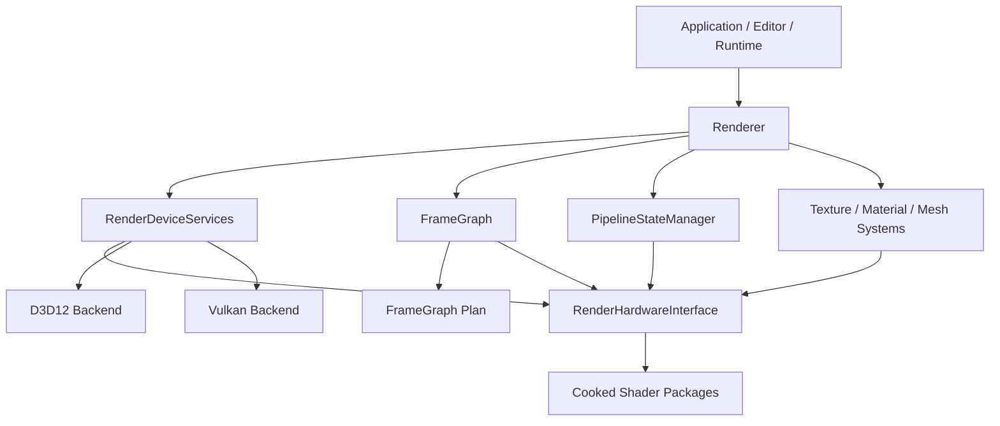
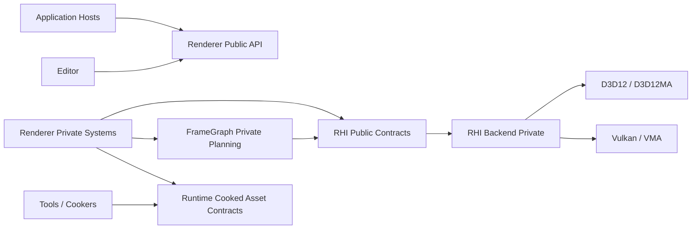
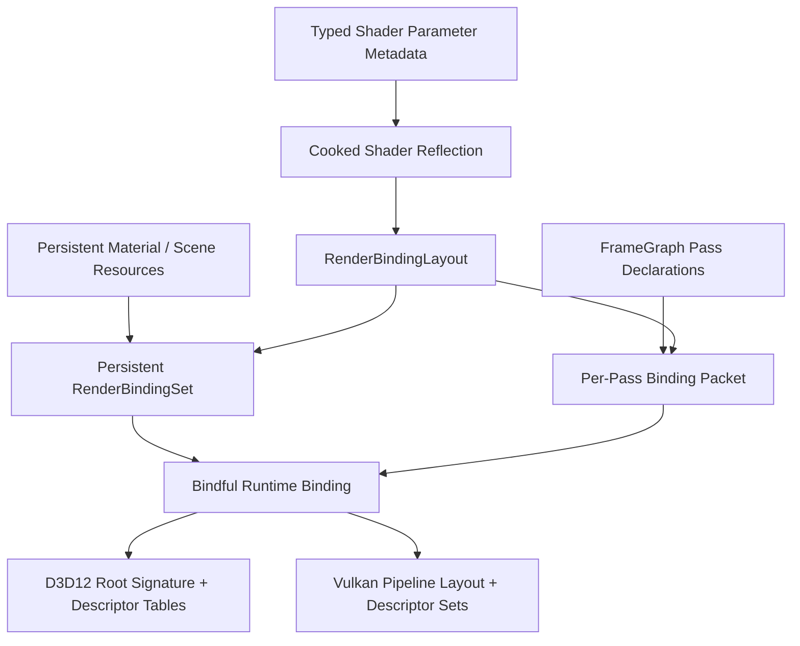
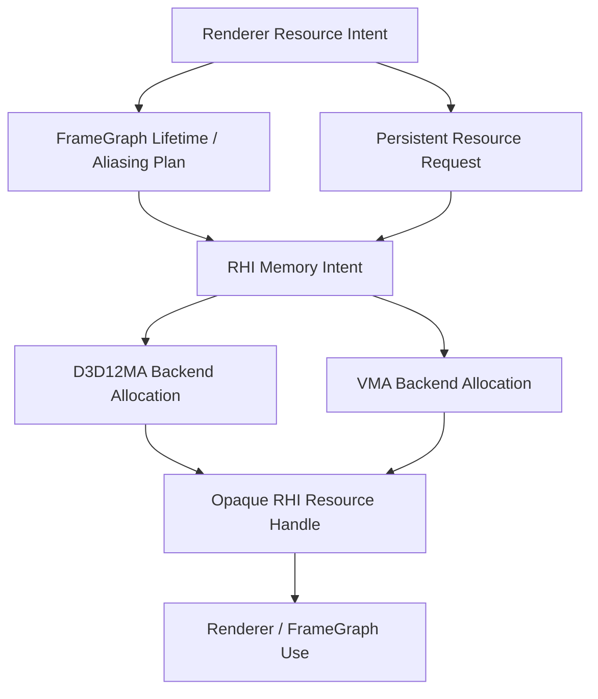
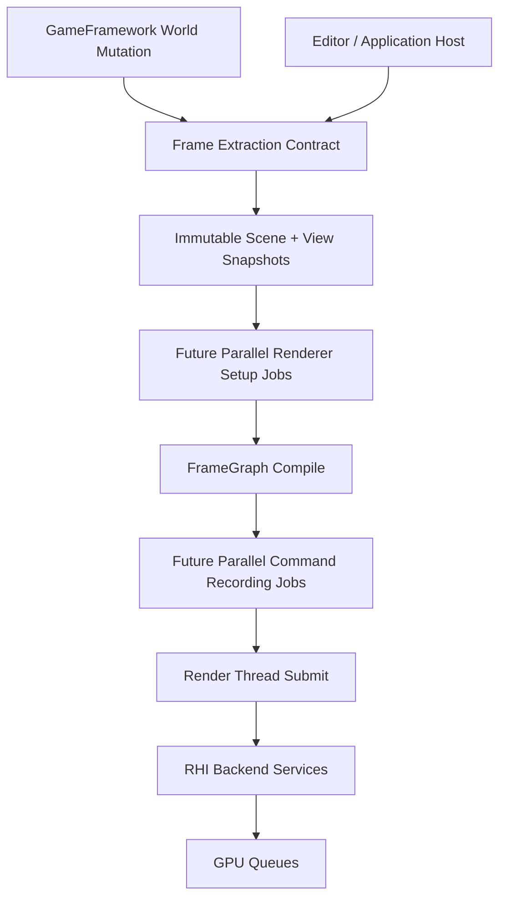
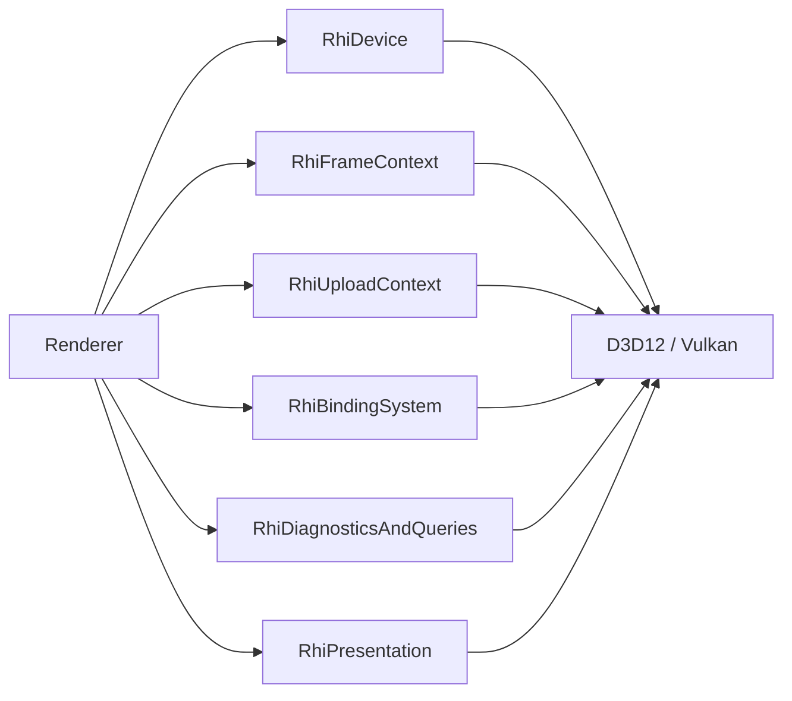
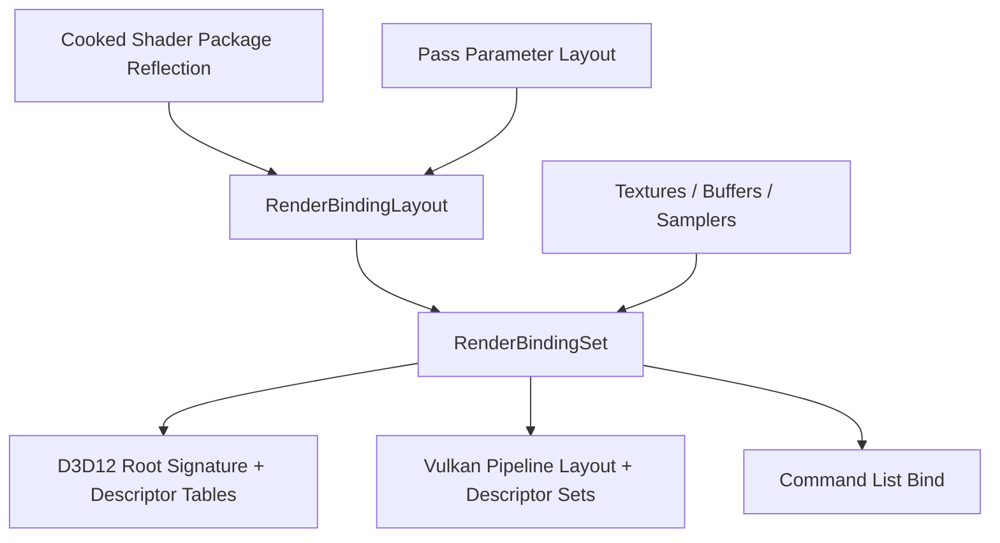
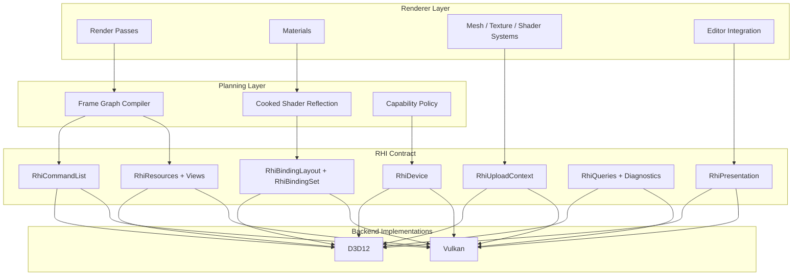

# Sparkle RHI Growth Architecture Review

Date: 2026-05-17

## Executive Summary

Sparkle is no longer a D3D12-only renderer with a thin future-Vulkan switch. The engine now has a real RHI abstraction, a D3D12 backend, a Vulkan backend that has progressed through device, swapchain, command context, dynamic rendering, and pipeline work, a cooked shader package path, and a frame graph that is beginning to own resource declarations and scheduling.

That is a good foundation, but it is not yet a growth-ready multi-backend architecture. The main risk is not that Vulkan is incomplete; that is expected. The main risk is that the public RHI contract currently exposes too much backend-shaped machinery directly to Renderer, while the engine does not yet have a precise backend capability matrix, backend parity gates for every user-visible feature, or a narrow set of renderer-facing abstractions for binding, resource lifetime, barriers, uploads, queues, readbacks, and feature fallback.

NVRHI is the strictest comparison point. It succeeds by making multi-backend behavior explicit: resource handles own lifetime, command lists own upload and barrier conveniences, binding layouts and binding sets are immutable objects, backends expose native handles only as escape hatches, validation is a first-class wrapper layer, and feature families such as graphics, compute, ray tracing, meshlets, bindless, staging, timer queries, and multi-queue are represented in the API model.

AMD's public FidelityFX/Cauldron lineage is a different lesson. The older FSR2 sample stack built separate DX12 and Vulkan variants and exposed backend-specific FidelityFX interfaces. The newer public FidelityFX SDK `Cauldron2` tree is more of a DX12-oriented sample framework: render modules, parameter sets, root signatures, pipeline objects, resource views, dynamic pools, and explicit barriers. It is useful as a feature integration and render-module organization reference, but it is not the same kind of reusable multi-backend RHI as NVRHI.

The recommended direction for Sparkle is engine-owned and conservative: keep the current RHI, but harden it into a smaller, stricter contract before adding larger renderer features. Do not chase bindless first. Make bindful descriptor sets/tables robust, make transient resources and barriers backend-correct, make shader package reflection the single source of binding truth, and make parity validation visible in CI-style targets.

## External Review Bar

This document should be reviewable by senior graphics engineers who are used to NVRHI/Donut, FidelityFX/Cauldron, Unreal RDG, D3D12MA, and VMA-style tradeoffs. The review standard is intentionally strict:

- Public Renderer-facing contracts must be backend-neutral unless they are explicitly named interop APIs.
- D3D12MA and VMA must remain backend-private allocator engines. Renderer and FrameGraph may express allocation intent, lifetime, residency class, aliasing eligibility, and usage, but they must not depend on allocator APIs.
- FrameGraph should own cross-pass resource state planning, transient resource lifetime, and aliasing intent. RHI backends execute the plan.
- Runtime code must consume cooked assets and cooked shader packages. Source authoring, recook, import, and editor-only workflows must not leak into the runtime RHI contract.
- Binding layout truth should come from cooked shader reflection and typed shader parameter metadata, not from duplicated hand-written backend layouts.
- Reviewer navigation should be obvious: each concept has one owning subsystem, one public API surface, backend-private implementation points, and clear forbidden dependencies.
- Any new advanced feature must state backend capability requirements, fallback behavior, validation evidence, and ownership of in-flight resources.

An NV/AMD-style reviewer should reject changes that add raw descriptor manipulation to ordinary Renderer code, duplicate binding layout definitions across backends, add pass-local cross-pass barriers, expose D3D12MA/VMA types outside backend code, add native-handle branching to render passes, or expand public RHI methods without assigning them to a capability category.

## Evidence Base

This review uses:

- Sparkle local sources, especially `Engine/RHI/Public/Device/RenderHardwareInterface.h`, `Engine/RHI/Private/Device/RenderDeviceServices.cpp`, `Engine/RHI/Public/Pipeline/RhiPipelineStateDesc.h`, `Engine/RHI/Public/Resources/RhiResourceDesc.h`, and `Engine/Renderer/Private/FrameGraph/FrameGraphDeclaration.cpp`.
- Sparkle repository memory for Vulkan bootstrap, swapchain/command bootstrap, dynamic-rendering pipeline work, shader package ownership, and frame graph boundaries.
- NVRHI README and programming guide from NVIDIA GameWorks/NVIDIA RTX public sources.
- NVIDIA Donut public code patterns, especially render passes that take an `nvrhi::ICommandList*`, use NVRHI resource/binding abstractions, and keep common rendering utilities in `CommonRenderPasses` rather than scattering backend handles through feature code.
- AMD/GPUOpen FidelityFX SDK `Cauldron2` public tree and older FidelityFX FSR2 public sample architecture where DX12 and Vulkan were built as separate variants.

## Current Sparkle Shape



Sparkle already has several important pieces in the right place:

- Backend selection is explicit through build configuration, `SPARKLE_RHI_BACKEND`, and command-line selectors such as `--rhi=Vulkan`.
- `RenderDeviceServices` routes backend creation through `ERhiBackendApi` and keeps D3D12/Vulkan implementation creation private.
- Backend-private implementations live under `Engine/RHI/Private/D3D12` and `Engine/RHI/Private/Vulkan`.
- Renderer consumes `RenderHardwareInterface`, not concrete D3D12 headers.
- Shader packages understand backend binary formats and runtime backend identity.
- Frame graph declarations are being separated from execution and resource planning.
- Vulkan uses dynamic rendering and backend-private pipeline layout work, which is the right direction for a modern Vulkan path.

The weak point is that the public RHI surface has grown as a direct list of operations instead of as a layered renderer contract. Today, `RenderHardwareInterface` includes device identity, native handles, command list access, ImGui, binding layouts, graphics and compute PSOs, descriptor allocation, descriptor table allocation, constant buffer upload helpers, texture loading, resource creation, BLAS/TLAS helpers, allocation queries, transient memory blocks, aliasing resources, resource views, present passes, and format queries. That breadth is manageable with one mature backend, but it becomes a parity and review problem as soon as Vulkan, compute-heavy systems, async work, ray tracing, editor tooling, or platform growth accelerate.

## External Comparison

### NVRHI: What It Does Better

NVRHI is a reusable RHI over D3D11, D3D12, and Vulkan 1.3. Its strongest architectural choices are:

- `IDevice` is a coherent central device/factory/submission object. NVRHI does not split the device into many inherited public service facets; it moves behavioral weight into the objects the device creates.
- `IDevice` owns resource, pipeline, query, binding, and command-list creation, but draw and dispatch live on `ICommandList`.
- The application creates the native graphics device; NVRHI wraps it. This keeps platform/bootstrap concerns outside the abstraction.
- Resource lifetime is handle-based and reference-counted. Resources can be captured by binding sets and command lists until the GPU is done.
- Garbage collection is explicit and expected once per frame.
- Command lists provide upload helpers, scratch-buffer helpers, optional automatic resource state tracking, and barrier committing.
- Binding is modeled as immutable binding layouts plus immutable binding sets, with bindless descriptor tables as a distinct capability.
- Native objects are accessible through escape hatches, but not the normal renderer contract.
- Validation is a wrapper device that intercepts API calls and command lists.
- Feature areas are modeled directly: graphics, compute, meshlet, ray tracing, staging/readback, timer queries, event queries, multi-queue, volatile constant buffers, push constants, and bindless resources.

The core lesson is not "copy NVRHI." The lesson is that a growth-ready RHI must encode ownership, lifetime, feature availability, and synchronization policy as first-class API concepts rather than leaving each renderer subsystem to remember backend rules. Sparkle should therefore narrow the RHI by strengthening real object ownership--device, command list, resources, binding layouts/sets, pipelines, queries, presentation, and validation--not by adding pass-through service interfaces around the same broad object.

### AMD FidelityFX / Cauldron: What It Does Differently

AMD's public material splits into two useful references:

- Older FidelityFX FSR2 sample/Cauldron lineage: build-time DX12 and Vulkan variants, separate backend implementations for the FidelityFX API, explicit descriptor/pipeline creation per backend, and sample-level render systems.
- Current FidelityFX SDK `Cauldron2`: a DX12-centered framework with render modules, parameter sets, root signatures, pipeline objects, resource views, dynamic resource pools, dynamic buffer pools, and explicit resource barriers.

Cauldron's strong point is not backend purity. Its strength is feature integration shape:

- Render modules are named, configurable units with `Init`, `Execute`, resize, UI, and enable/disable hooks.
- Resources are named in framework configuration and can be mapped or resized by the framework.
- Parameter sets front-load descriptor binding work and are bound before pipeline execution.
- Render modules tend to state resource entry/exit expectations, often returning resources to shader-read state.
- FidelityFX API backends isolate algorithm integration from the host engine by adapting host resources and command lists into FFX backend resources.

The caution is that Cauldron-like module code can become backend-biased quickly when root signatures, descriptor heaps, or command-list details leak into feature code. Sparkle should borrow the idea of feature/module lifecycle and resource naming, not the DX12-centric leakage.

## Capability Matrix

| Area | Sparkle Today | NVRHI | AMD Cauldron / FidelityFX Pattern | Strict Assessment |
| --- | --- | --- | --- | --- |
| Backend coverage | D3D12 mature path; Vulkan path underway and selectable | D3D11, D3D12, Vulkan 1.3 | Older FSR2 samples had DX12/VK variants; current Cauldron2 public framework is DX12-oriented | Sparkle has the right ownership direction but needs explicit parity gates |
| Device bootstrap | Engine creates backend through `RenderDeviceServices` | App creates native device; NVRHI wraps it | Framework owns device/sample bootstrap | Sparkle should keep engine-owned bootstrap for now, but split platform bootstrap from RHI feature contract |
| Public RHI surface | Broad virtual interface | Layered interfaces: device, command list, resource, binding, query | Framework objects plus backend internals | Sparkle's surface is too wide for long-term reviewability |
| Resource lifetime | Opaque handles plus release calls; backend delayed release exists | Ref-counted handles plus garbage collection | Framework-owned resources and manual deletes in places | Sparkle needs stronger ownership/liveness semantics at the RHI boundary |
| Barriers | Frame graph declarations exist; command list/backend barriers exist | Optional automatic barriers plus manual override | Mostly explicit barrier calls in modules | Sparkle should let frame graph own cross-pass barriers and command list own local barriers/uploads |
| Binding model | `RenderBindingLayout`, compiled bindings, descriptor allocations/tables, shader package reflection | Immutable binding layouts/sets; bindless descriptor tables separately | Root signatures plus parameter sets | Sparkle is converging, but needs a renderer-facing binding set object, not raw descriptor orchestration everywhere |
| Shader packages | Cooked packages with backend binary format selection | Backends consume shader blobs/libraries; reflection support | Permutation blobs and backend-specific pipelines | Sparkle's cooked shader system is a real advantage if made the binding source of truth |
| Uploads | Helpers exist through texture/buffer creation paths; not yet a clear upload command model | Command lists hide upload-buffer suballocation and texture/buffer writes | Upload heaps/dynamic pools | Sparkle needs a first-class upload path before asset scale grows |
| Queries/diagnostics | Render diagnostics, timing work, backend diagnostics | Timer/event queries and validation wrapper | Profiling and framework assertions | Sparkle needs backend capability reporting plus validation wrappers/gates |
| Multi-queue | Not a visible first-class public model | Graphics/compute/copy queues supported | Queue concepts in framework/backend | Defer broad async compute until resource states and queue ownership are explicit |
| Ray tracing | Public RHI has RT hooks; D3D12 likely ahead of Vulkan | DXR and Vulkan RT modeled directly | DX12 RT modules in Cauldron2 | Sparkle should avoid public RT expansion until backend capability tiers are formalized |
| ImGui/editor | ImGui methods live directly on RHI | Usually integration layer around device | UI render module | Sparkle should move editor/UI integration behind a renderer/editor integration layer eventually |

## Code Ownership Map

This section is the review map for maintainability and navigation. It defines the intended owner for each concept, what may cross module boundaries, and what must remain private.

| Concept | Owning Layer | Public Contract | Backend-Private Implementation | Forbidden / Review-Reject Dependency |
| --- | --- | --- | --- | --- |
| Backend selection | RHI services | `RhiBackendSelection`, startup diagnostics, capability report | D3D12/Vulkan factory functions | Renderer branching on concrete backend except through capability policy |
| Native device/bootstrap | RHI backend services + Platform window integration | Backend-neutral device creation request and selected backend report | `ID3D12Device`, `VkDevice`, queues, swapchain objects | Renderer or FrameGraph creating native devices directly |
| GPU resources | RHI resource system | `RhiTextureResourceDesc`, `RhiBufferResourceDesc`, opaque resource handles, view descriptors | D3D12 resources, Vulkan images/buffers, allocation records | Renderer owning `ID3D12Resource`, `VkImage`, D3D12MA/VMA allocation objects |
| Memory allocation | RHI memory backend, planned by FrameGraph for transients | Memory category, residency class, transient allocation intent, allocation info | D3D12MA and VMA allocator calls, heaps/blocks, delayed destruction | Public RHI or Renderer exposing D3D12MA/VMA headers/types |
| Persistent asset uploads | RHI upload context, driven by Renderer asset systems | Upload commands for cooked texture/mesh/buffer payloads | Upload heaps, staging buffers, layout transitions, copy queues later | Texture loading from source paths inside core RHI |
| Frame graph resources | FrameGraph compiler | Pass resource declarations, usage, clear/load/store intent, lifetime class | Backend barrier emission and transient physical allocation execution | Render passes directly coordinating cross-pass state transitions |
| Binding layouts | RHI binding system, derived from shader package metadata | `RenderBindingLayout`, compiled binding metadata, shader parameter layout hashes | D3D12 root signatures, Vulkan descriptor set layouts, pipeline layouts | Hand-written backend layout duplication in Renderer passes |
| Binding instances | RHI binding system, requested by Renderer/FrameGraph | Persistent material binding sets and pass-local binding packets | Descriptor writes, descriptor set allocation, descriptor table realization | Ordinary Renderer code allocating raw descriptors or tables |
| Pipelines | RHI pipeline system, requested by Renderer pass factories | Graphics/compute pipeline descriptors using backend-neutral formats and binding layouts | D3D12 PSOs/root signatures, Vulkan pipelines/pipeline layouts | Pass code building native PSOs directly |
| Command recording | RHI command list, orchestrated by Renderer/FrameGraph | Backend-neutral draw/dispatch/copy/barrier/debug commands | D3D12 command lists/allocators, Vulkan command buffers/pools | Renderer reaching into native command lists except explicit interop adapters |
| Diagnostics and validation | RHI diagnostics + validation targets | Capability report, validation layer, debug markers, timing/query interfaces | D3D12 debug layer/DRED, Vulkan validation/debug utils, backend query pools | Diagnostics that require editing feature code per backend |
| Presentation | RHI presentation service, invoked by host/Renderer | Present target, present format, resize, acquire/submit/present lifecycle | DXGI swapchain, Vulkan surface/swapchain/synchronization | Material/scene systems depending on presentation APIs |
| Editor integration | Editor/Renderer host integration | Editor render products, UI overlay hooks, viewport contracts | Backend-specific ImGui integration behind adapter | Core RHI requiring editor-only concepts |
| Runtime/cook boundary | Runtime asset/shader loading systems | Cooked package and cooked asset contracts | Tool-side source import/cook implementations | Runtime RHI loading source assets or compiling shaders |

## Current Public RHI Method Categories

This is the Phase 0 ledger for the current `RenderHardwareInterface` surface. It assigns every existing public method to a capability category so future refactors can split or facade the interface without guessing why each method exists.

| Capability Category | Current Methods | Target Direction |
| --- | --- | --- |
| Core device / backend identity | `GetBackendApi`, `GetRequiredShaderBinaryFormat`, `GetCurrentFrameIndex`, `WaitForIdle` | Move behind a small device/capability/frame-lifecycle contract. Renderer features should use capability policy, not backend branching. |
| Interop escape hatch | `GetDeviceHandle`, `GetGraphicsQueueHandle`, `GetNativeResource`, `GetResourceGpuVirtualAddress` | Keep available only through explicit interop/diagnostics paths. Ordinary Renderer and pass code must not branch on native handles. |
| Command recording | `GetGraphicsCommandList` | Replace direct global command-list access with frame/pass command contexts or command allocators that can later support multiple lists and parallel recording. |
| Diagnostics / query | `GetDiagnostics`, const `GetDiagnostics`, `SupportsUnorderedAccess` | Keep as diagnostics/capability-facing services. Feature code should query support through capability records where possible. |
| Ray tracing | `GetRayTracingCapabilities`, `GetBottomLevelAccelerationStructurePrebuildInfo`, `GetTopLevelAccelerationStructurePrebuildInfo`, `CreateRayTracingScratchBuffer`, `CreateRayTracingAccelerationStructureBuffer`, `CreateRayTracingInstanceBuffer` | Keep behind an explicit ray tracing capability surface. Do not expand until D3D12/Vulkan capability tiers, binding impact, and lifetime rules are formalized. |
| Editor integration | `InitializeImGuiBackend`, `BeginImGuiFrame`, `RenderImGuiDrawData`, `ShutdownImGuiBackend` | Move behind editor/presentation integration. Core runtime RHI contracts should not require editor-only UI concepts. |
| Binding layout / pipeline | `CreateBindingLayout`, `CreateGraphicsPipelineState`, `CreateComputePipelineState` | Keep backend-neutral, driven by cooked shader reflection and typed parameter metadata. Split pipeline creation from unrelated RHI responsibilities. |
| Binding / descriptor realization | `BindGlobalDescriptorState`, `AllocateDescriptor`, `ReleaseDescriptor`, `AllocateDescriptorTable`, `GetDescriptorTableCpuHandle`, `ReleaseDescriptorTable`, `AllocateShaderResourceDescriptor`, `ReleaseShaderResourceDescriptor`, `GetSharedSamplerBinding` | Move raw descriptor allocation behind binding-set/binding-packet realization. Renderer should request binding intent, not descriptor mechanics. |
| Upload / constant data | `GetPerFrameConstantData`, `GetPerFrameConstantGpuAddress`, `AllocateUniformConstantBuffer`, `AllocatePerViewConstantBuffer`, `AllocatePerObjectVertexConstants`, `AllocatePerObjectPixelConstants` | Replace renderer-facing GPU-address traffic with backend-neutral constant/upload binding records where possible. Raw GPU virtual addresses are backend capability details. |
| Presentation | `GetBackBufferViewport`, `GetBackBufferScissorRect`, `GetBackBufferRenderTargetView`, `GetBackBufferResource`, `BeginPresentRenderPass`, `BeginPresentOverlayPass`, `EndPresentRenderPass`, `GetPresentColorFormat` | Isolate behind presentation/host integration. Materials, scene systems, asset systems, and frame graph planning should not depend on presentation APIs. |
| Runtime asset loading boundary | `CreateTextureFromPath` | Move out of core RHI. Runtime RHI should create GPU resources from cooked/upload-ready payloads; tools/editor/source systems own source path import/loading. |
| Persistent GPU resources | `CreateTextureResource`, `CreateBufferResource`, `CreateVertexBuffer`, `CreateIndexBuffer`, `ReleaseOwnedResource` | Keep as backend-neutral resource/upload services, but align mesh/texture uploads with cooked payloads and explicit lifetime ownership. |
| Memory / allocation planning | `GetTextureAllocationInfo`, `GetBufferAllocationInfo`, `CreateTransientMemoryBlock`, `ReleaseTransientMemoryBlock`, `CreateAliasingTextureResource`, `CreateAliasingBufferResource` | Keep backend-neutral memory intent in public RHI. D3D12MA/VMA details stay backend-private; FrameGraph owns transient lifetime/aliasing intent. |
| Resource views | `CreateResourceView`, `ReleaseResourceView`, `GetResourceViewCpuHandle`, `GetResourceViewGpuHandle` | Treat as RHI binding/resource-view realization. Renderer should prefer resource views through binding sets/packets instead of CPU/GPU descriptor handle ownership. |

Phase 0 reject rule: any new public RHI method must be assigned to one of these categories, or a new category must be added with allowed dependency edges, owner, backend-private implementation expectations, and review-reject dependencies.

## Current Class Disposition Map

Sparkle should not solve architecture hardening by adding another layer of managers on top of existing managers. The hardening sessions must classify existing classes first, then choose whether each class stays, shrinks, moves, merges, or disappears.

| Current Class / Family | Current Role | Target Disposition | Rationale |
| --- | --- | --- | --- |
| `Renderer` | Top-level owner of backend, frame graph, scene caches, diagnostics, viewport products, and frame lifecycle | Adjust into frame orchestrator only | It should sequence frame phases and own high-level lifetime, but not become the place where every subsystem is reached directly forever. Use small services and immutable frame snapshots to reduce fan-out. |
| `RenderDeviceServices` | Backend service owner and lifecycle facade | Keep, but narrow to backend lifecycle/frame submission owner | This is a useful seam. It should expose backend lifecycle, frame begin/submit/advance, capabilities, and explicit handoff points, not become the permanent low-level RHI locator. |
| `RenderHardwareInterface` | Very broad public RHI facade | Keep temporarily as RHI device/factory facade, then shrink by moving behavior to real RHI objects | Current breadth hides ownership and forces backends to stub unrelated concepts. Do not replace it with service wrappers that only forward calls. Move command recording to command lists, binding lifetime to binding sets/packets, resource lifetime to handles/owners, presentation/editor work to host integration, and native access to explicit interop. |
| `D3D12RenderHardwareInterface` / `VulkanRenderHardwareInterface` | Backend implementations of broad facade | Keep as backend composition roots temporarily, then shrink | They are useful aggregation points during migration, but should delegate to backend-private services and stop accumulating descriptor/resource/presentation/ImGui logic directly. |
| `D3D12DescriptorHeapManager` / `VulkanDescriptorManager` | Backend descriptor allocation and view ownership | Keep backend-private, rename/split only if responsibilities blur | Descriptor managers are valid backend-private services. Renderer should never allocate raw descriptors directly; binding sets/packets should request descriptor realization. |
| `D3D12GpuMemoryAllocator` / `VulkanGpuMemoryAllocator` | D3D12MA/VMA-backed allocation and memory diagnostics | Keep backend-private and central | These are proper backend services. Public RHI should expose memory intent and diagnostics, not allocator handles or D3D12MA/VMA types. |
| `TextureManager` | Renderer-side default/scene texture cache, source path loading, diagnostics | Split responsibilities | Renderer may own default/fallback texture policy and texture residency cache. Source path loading should move to asset/editor/cook-facing loaders; RHI should receive cooked/upload-ready payloads. |
| `MaterialCacheManager` | Renderer-side material data cache plus raw descriptor table lifetime | Adjust toward material resource cache + binding-set owner | It should stop owning raw descriptor table mechanics. Persistent material textures should become stable binding sets or material binding records realized by RHI binding services. |
| `PipelineStateManager` | Lazy pass runtime and cooked shader package cache owner | Adjust into shader package + pipeline runtime cache | Useful, but should depend on a narrow RHI pipeline/binding interface. Consider separating shader package cache ownership from pipeline runtime cache if reload and PSO lifetime diverge. |
| `SceneRenderStateCoordinator` | Level lifecycle event handler that flushes backend and refreshes scene-scoped renderer state | Keep only if it remains lifecycle-specific | Good if it coordinates scene state invalidation only. If it grows into a general renderer orchestrator, split into scene resource lifetime, level event subscription, and cache refresh services. |
| `RenderSceneDataBuilder`, `PerViewDataBuilder`, `ViewLightingBuilder` | Build renderer snapshots/constant data from scene state | Keep as builders if pure and stateless | These are useful if they produce immutable frame data and do not own GPU resources. They are threading-friendly if they operate on snapshots. |
| `GPUMeshCache` | Renderer-owned GPU mesh resources | Keep, but align with upload/resource services | It should own mesh resource lifetime at renderer level, while uploads and GPU allocation are RHI services. Avoid direct backend handles. |
| `FrameGraph`, `FrameGraphCompiler`, `FrameGraphResourceRegistry`, `FrameGraphResourceStateTracker`, `FrameGraphTransientAllocator` | Frame graph declaration, planning, runtime resource state, transient allocation | Keep, consolidate around compiler/plan ownership | These are meaningful owners. The hardening goal is not fewer classes at any cost; it is one clear owner for declarations, compilation, resource state, transient planning, and execution. Merge only if a class is a pass-through wrapper. |
| `FrameGraphResourceCommands` | Applies frame graph resource operations through command context | Keep only as execution adapter | It should translate a compiled plan to command operations. It should not become an alternate planner. |
| `RenderCommandContext` | Renderer command context wrapper over RHI command list | Re-evaluate after RHI command interface split | Keep if it adds renderer-level diagnostics/frame graph conveniences. Delete or fold into pass execution context if it only forwards calls. |
| `PassBinder` / `PassBindingOverrides` / `PassParameterSet` | Renderer-side pass binding orchestration | Adjust into binding packet generation path | These are close to the desired bridge between shader parameters and RHI binding sets. Their target role should be explicit: create pass-local binding packets from frame graph resources and shader metadata, not allocate raw descriptors. |
| `RenderPassShaderRuntime` and pass pipeline traits | Shader package and pass-specific pipeline runtime | Keep, but tie to binding layout source of truth | Useful pattern. Ensure traits do not duplicate backend binding layout definitions and remain driven by cooked shader reflection + parameter metadata. |
| `RendererMemoryMonitor` / diagnostics classes | Capture memory and timing diagnostics | Keep if read-only and owner-aware | Diagnostics should aggregate from RHI/Renderer owners without mutating ownership or depending on backend internals. |

## Phase 1 Responsibility Ledger

This is the Phase 1 source-inspection ledger. It records current ownership, target module, allowed edges, mental-load judgment, mutation/thread assumption, disposition, and whether source work is immediate or deferred to a later phase. Phase 1 does not run builds; source moves that would require implementation validation are explicitly assigned to later phases.

| Class / Family | Target Module | Allowed Edges | Mutation / Thread Assumption | Disposition | Mental-Load Judgment and Phase Action |
| --- | --- | --- | --- | --- | --- |
| `Renderer` | Renderer public host facade + Renderer private frame orchestrator | Application/Editor host -> Renderer public; Renderer private -> RHI public, FrameGraph private, runtime cooked assets | Render-thread/frame-owner today; future consumes immutable GameFramework extraction data | Adjust | High mental load because it owns many systems and exposes full RHI. Keep as top-level frame sequencer, but defer fan-out reduction and service narrowing to Phases 3, 7, and 9. |
| `RenderDeviceServices` | RHI public backend lifecycle service | Renderer private -> RHI public; RHI public -> backend-private implementation | Render-thread-owned backend lifecycle and frame submission | Keep, narrow | Useful owner for backend creation and frame lifecycle. Mental load rises when it exposes full RHI and command-list shortcuts; defer narrowing to Phase 3. |
| `RenderHardwareInterface` | RHI public compatibility facade until object ownership split | Renderer/FrameGraph -> RHI public only; RHI public -> backend-private implementations | Render-thread-owned device/factory facade over backend objects | Adjust / shrink | Highest RHI mental load. Keep temporarily as the Sparkle equivalent of a central device/factory root, then move work to command lists, resources, bindings, queries, presentation/editor integration, and validation. No new responsibilities should be added without ledger category. |
| `RenderCommandList` | RHI public command recording contract | Renderer command context / FrameGraph execution -> RHI command contract; backend implementations private | Render-thread-owned command recording today; future per-pass/per-thread command ownership | Keep, evolve | Useful core abstraction. Needs future allocation/recording ownership contract for threading; defer to Phases 3, 6, and 9. |
| `RenderBindingLayout` / `RenderPipelineState` | RHI public binding and pipeline contracts | Renderer pipeline runtime -> RHI public; backend-private layout/PSO realizations | Mostly immutable after creation | Keep, tighten | Good mental-load reduction when driven by shader reflection. Tie harder to binding set/packet path in Phase 4. |
| `CookedShaderPackageCache` / `LoadedShaderPackage` / shader reflection records | RHI public/runtime shader package contract | Renderer pipeline manager -> RHI public shader package; tools produce cooked packages | Cache mutation during reload; otherwise read-mostly | Keep | Strong owner for backend shader binary and reflection data. Keep public runtime contract; source/cook production remains outside runtime. |
| `RenderDiagnostics` / `RenderMemoryDiagnostics` | RHI public diagnostics contract | Renderer diagnostics -> RHI public; backend-private diagnostics providers | Read-mostly snapshots; backend updates during frame | Keep | Useful for review and validation. Must remain aggregation/reporting, not backend leakage; Phase 8 adds stronger validation layer. |
| `RhiDescriptor*` handle structs | RHI public transitional descriptor handles | Renderer should not own raw descriptor allocation long-term; binding realization may use them internally | Handle values; lifetime controlled by RHI/backend services | Adjust / hide | Currently useful but mentally expensive in Renderer. Defer to Phase 4 to move raw descriptor traffic behind binding sets/packets. |
| `RhiGpuVirtualAddress` and address-based bindings | RHI public capability detail | Renderer should prefer buffer/view/binding records; address access through explicit capability paths | Backend capability value, not general ownership | Adjust | D3D12-shaped concept leaks mental load into Renderer. Defer replacement with backend-neutral binding records to Phases 3-5. |
| `D3D12RenderHardwareInterface` / `VulkanRenderHardwareInterface` | RHI backend-private composition roots | RHI public facade -> backend-private root; backend root -> backend services | Render-thread-owned backend root | Keep temporarily, shrink | Useful during migration but too much direct accumulation. Keep as composition root, delegate more to descriptor/memory/presentation/binding services in Phases 3-5. |
| `D3D12Rhi` / `VulkanRhi` | RHI backend-private native device owner | Backend root/services -> native API | Backend-owned, render-thread/device lifetime | Keep | Proper native-device owner. Must not leak native device ownership upward except explicit interop. |
| `D3D12DescriptorHeapManager` / `VulkanDescriptorManager` / descriptor allocators | RHI backend-private descriptor/view realization | RHI binding/resource-view services -> backend-private descriptor services | Render-thread-owned unless later synchronized | Keep backend-private | Clear backend responsibility. Renderer raw descriptor allocation should be removed in Phase 4, not by deleting these services. |
| `D3D12GpuMemoryAllocator` / `VulkanGpuMemoryAllocator` | RHI backend-private memory allocator | RHI memory intent -> backend allocator; D3D12MA/VMA private | Backend-owned, delayed-release state | Keep backend-private | Strong owner that reduces mental load by isolating D3D12MA/VMA. Keep and expose only backend-neutral diagnostics. |
| `D3D12SwapChain` / `VulkanSwapChain` | RHI backend-private presentation implementation | RHI presentation service -> backend-private swapchain | Render-thread-owned presentation lifecycle | Keep, isolate | Useful owner. Presentation should move out of core device/facade in Phase 3. |
| `D3D12ImGuiBackend` / `VulkanImGuiBackend` | RHI backend-private editor adapter, target Editor/Renderer integration | Editor/presentation integration -> backend adapter | Render-thread-owned editor overlay state | Move outward / isolate | Backend-specific adapter is useful, but core RHI should not require ImGui concepts. Defer to Phase 3/7 boundary cleanup. |
| `D3D12SamplerLibrary` / `VulkanSamplerLibrary` | RHI backend-private sampler realization | RHI binding system -> backend sampler library | Backend-owned cache | Keep backend-private | Useful focused cache if only sampler realization. Keep out of Renderer. |
| `VulkanTextureFactory` / `VulkanTextureLoader` and D3D12 texture loading equivalents | RHI backend-private GPU texture creation, source-load path transitional | Runtime should use cooked/upload-ready payloads; source loading belongs Tools/Editor | Backend creation on render thread; source loading should leave runtime | Split / move | GPU factory is useful; source-path loading in core runtime is wrong. Defer source-load removal to Phase 5/7. |
| `VulkanCommandContext` / backend command contexts and command lists | RHI backend-private command allocation/submission | RHI command contract -> backend command context | Render-thread-owned today; future command recording contract needed | Keep, evolve | Proper backend owner. Needs explicit future per-frame/per-thread ownership in Phase 9. |

### Renderer and FrameGraph Responsibility Ledger

| Class / Family | Target Module | Allowed Edges | Mutation / Thread Assumption | Disposition | Mental-Load Judgment and Phase Action |
| --- | --- | --- | --- | --- | --- |
| `TextureManager` | Renderer private runtime texture registry/cache | Renderer private -> RHI public resource/upload; Renderer private -> runtime cooked texture refs | Render-thread-owned cache; future explicit synchronization policy | Split | Useful for default/fallback policy and residency cache. Source path loading increases mental load and violates runtime boundary; defer move to Phase 5/7. |
| `MaterialCacheManager` | Renderer private material resource cache, future binding-set owner | Renderer private -> TextureManager + RHI binding/resource contracts | Render-thread-owned material cache today | Adjust | Useful material-data cache, but raw `RhiDescriptorTableHandle` ownership is wrong. Defer to Phase 4 binding-set migration. |
| `PipelineStateManager` | Renderer private shader package + pass pipeline runtime cache | Renderer passes -> PipelineStateManager -> RHI pipeline/binding contracts | Lazy mutable cache; render-thread-owned unless synchronized later | Adjust | Useful, but dependency on full RHI and combined shader/pipeline cache can add mental load. Defer narrow-interface dependency to Phase 3; split only if reload and PSO lifetime diverge. |
| `GPUMeshCache` / `GPUMesh` | Renderer private mesh GPU resource cache | Renderer private -> RHI resource/upload contracts; GameFramework mesh data -> Renderer extraction | Render-thread-owned cache | Keep, align | Useful owner for mesh GPU lifetime. Needs cooked/upload service alignment and future extraction boundary in Phases 5 and 9. |
| `RendererMemoryMonitor` | Renderer private diagnostics aggregator | Renderer diagnostics -> RHI diagnostics + renderer cache snapshots | Read-only snapshot capture during frame/diagnostics | Keep | Reduces mental load if it aggregates only. Must not mutate ownership or inspect backend-private state. |
| `SceneRenderStateCoordinator` | Renderer private level lifecycle coordinator only | Level events -> Renderer private caches/services | Event-driven render-thread/lifecycle mutation | Keep only if narrow | Useful if it remains lifecycle invalidation/refresh. If it becomes a second Renderer orchestrator, split or delete in Phase 1/7 follow-up. |
| `RenderSceneSnapshot` | Renderer private immutable-ish scene extraction state | GameFramework/GameScene -> Renderer snapshot; Renderer setup -> frame data | Mutated during extraction/refresh; should be immutable during frame setup/record | Keep, strengthen | Important for future threading. Phase 9 must make mutation phase and GameFramework handoff explicit. |
| `RenderSceneDataBuilder` | Renderer private scene draw-data builder | Snapshot/material/mesh caches -> frame-local scene data | Should be setup-phase only and stateless after build | Keep | Good mental-load reduction if pure builder. Keep out of GPU resource ownership. |
| `PerViewDataBuilder` / `ViewLightingBuilder` | Renderer private frame/view data builders | Snapshot/camera/lights -> frame-local constants | Setup-phase only; frame-local output | Keep | Good threading shape if they remain pure builders. Phase 9 documents ownership/mutation phase. |
| `RenderCamera` | Renderer private view state | GameFramework/Editor input -> Renderer view data | Main/render-thread mutation today | Keep, clarify | Useful, but future threading requires explicit extraction/update phase. Defer to Phase 9. |
| `FrameGraph` | Renderer private frame graph owner | Renderer setup -> FrameGraph; FrameGraph -> RHI public contracts | Setup/compile/execute phases; render-thread-owned today | Keep, consolidate | Strong owner. Needs sharper split between declaration, immutable plan, and execution in Phase 6. |
| `FrameGraphBuilder` / `FrameGraphFactory` | Renderer private graph construction API | Renderer pass setup -> FrameGraph declaration; dependencies -> RHI public/window | Setup-phase only | Keep | Good mental-load reduction for pass declaration. Ensure dependencies stay narrow; Phase 3 removes full-RHI reach where possible. |
| `FrameGraphPlan` / compiler types | Renderer private planning output | FrameGraph compile -> execution/backend-neutral RHI plan | Immutable after compile | Keep, strengthen | Correct owner for future barriers/lifetimes. Phase 6 expands authority. |
| `FrameGraphResourceRegistry` / `FrameGraphResourceResolver` / `FrameGraphResourceStateTracker` | Renderer private FrameGraph resource state services | FrameGraph internals -> RHI resource/view contracts | Mutated during setup/compile/execute according to phase | Keep, consolidate | Meaningful owners if responsibilities remain distinct. Merge only if one becomes pass-through during Phase 6. |
| `FrameGraphTransientAllocator` | Renderer private transient allocation planner/executor adapter | FrameGraph plan -> RHI memory intent | Compile/execute phase; render-thread-owned today | Keep, align | Correct concept. Must express intent only and keep D3D12MA/VMA private; Phase 5/6 alignment. |
| `FrameGraphResourceCommands` | Renderer private execution adapter | Pass execution -> FrameGraph resource resolution -> RenderCommandContext | Execute-phase only | Keep only as adapter | Useful if it translates compiled plan/resource handles. Delete or fold if it becomes an alternate planner. Re-evaluate in Phase 6. |
| `RenderCommandContext` | Renderer private command convenience wrapper | FrameGraph/pass execution -> RHI command list | Execute-phase, render-thread-owned | Adjust / re-evaluate | Adds diagnostics convenience but exposes GPU addresses, descriptors, and native handles. Keep only until RHI command/binding split; Phase 3/4 re-evaluate. |
| `PassBinder` / `PassBindingOverrides` | Renderer private pass binding bridge | Pass execution -> FrameGraph resources + RHI binding layout | Execute/setup binding phase | Adjust | Useful bridge but currently binds descriptors/addresses directly. Convert toward binding packet generation in Phase 4. |
| `PassParameterSet` / shader parameter field types | Renderer public/private pass parameter data | Pass declarations -> FrameGraph/binding metadata | Frame-local or immutable after setup | Keep | Strong source of pass binding intent. Should remain metadata/intent, not descriptor ownership. |
| `ShaderPass` / concrete pass classes | Renderer private feature passes | Pass setup -> FrameGraphBuilder; execute -> PassExecutionContext | Setup/execute phase split | Keep, constrain | Useful feature boundaries. Must not reach native/backend-private handles; Phase 6/8 validation should catch exceptions. |
| `RenderPassShaderRuntime` / pass pipeline traits | Renderer private pass runtime cache helper | PipelineStateManager -> RHI pipeline/binding contracts + cooked shader packages | Lazy render-thread cache | Keep, tie to source of truth | Good mental-load reduction if all pass PSO/binding runtime creation flows here. Phase 4 ties binding layout to shader reflection. |
| `FrameExecutionDiagnostics` / `PassExecutionDiagnostics` | Renderer private diagnostics | Pass/Frame execution -> RHI diagnostics | Frame-local diagnostics mutation | Keep | Useful instrumentation; must remain diagnostics-only and avoid backend-private coupling. |

### Phase 1 Source Action Register

Phase 1 source inspection found several responsibility moves, but most require implementation validation from later phases. No runtime behavior change is made in Phase 1. Required moves are explicitly deferred:

| Required Move | Reason | Deferred Phase |
| --- | --- | --- |
| Narrow `RenderHardwareInterface` through NVRHI-style object ownership | Current broad facade creates high mental load, but service-wrapper splits would only hide the same ownership problem | Phase 3 |
| Remove raw descriptor/table ownership from Renderer material and pass binding paths | Renderer should express binding intent, not descriptor mechanics | Phase 4 |
| Move `CreateTextureFromPath` and source-path texture loading out of core RHI/runtime path | Runtime RHI should consume cooked/upload-ready payloads | Phase 5 and Phase 7 |
| Replace general Renderer-facing GPU virtual address traffic with backend-neutral buffer/view/binding records where possible | Avoid D3D12-shaped semantics leaking into Vulkan and Renderer | Phase 3, Phase 4, Phase 5 |
| Isolate ImGui/editor backend integration outside core RHI device contract | Editor-only concepts should not be required by runtime RHI | Phase 3 and Phase 7 |
| Make GameFramework-to-Renderer extraction and snapshot mutation phases explicit | Future multithreading requires stable frame inputs | Phase 9 |
| Re-evaluate `RenderCommandContext` and `FrameGraphResourceCommands` after command/binding/framegraph planning split | Keep only if they reduce mental load; merge/delete if pass-through | Phase 3, Phase 4, Phase 6 |

### Phase 1 Source-Only Validation Notes

Reviewers should reject Phase 1 as incomplete if any of these are true:

- An audited class lacks a target module, allowed dependency edge, mutation/thread assumption, disposition, or mental-load reason.
- A class is marked keep without naming the concrete responsibility it owns.
- A class is marked adjust/split/move/merge/delete without either a source change or a named deferred phase in the action register.
- A retained wrapper hides the stronger owner instead of narrowing dependencies or reducing mental load.
- A temporary edge or compatibility path lacks an owner, reason, validation note, and removal phase.
- A disposition keeps Renderer as a service locator or keeps raw descriptor/source asset/backend-private ownership in ordinary Renderer paths without assigning the cleanup to a later phase.

Phase 1 is complete when the responsibility ledger and action register can guide later source changes without re-litigating where each audited responsibility belongs.

Class disposition rule: a class earns its existence when it owns one real concept: lifetime, cache identity, backend realization, compilation/planning, validation, or user-facing policy. A class should be merged or deleted when it only forwards calls, hides ownership, or exists because two modules do not have a clean dependency boundary. If the team is unsure whether an abstraction is carrying its weight and it looks like needless complexity, the default decision is to remove it, fold it into a stronger owner, or defer reintroducing it until a concrete need appears.

## Allowed Dependency Edges

The architecture should be reviewed as a graph. Edges are as important as nodes: a correct class in the wrong module, or a useful service reached through the wrong dependency, still creates long-term debt.

Dependency-edge discipline is a hard review gate. A change that improves one class while creating an unclear or forbidden dependency is not accepted. The new design graph is the authority, even when that requires large refactors of existing code. Existing call paths, convenience accessors, managers, and wrappers do not get to remain just because they already work; they must respect the new edges or be moved, merged, rewritten, or deleted. The goal is a clear visual and mental model: when reading any include, constructor dependency, service accessor, or ownership pointer, it should be obvious which layer is depending on which layer and why.



Allowed edges:

- Application and Editor may depend on Renderer public host contracts.
- Renderer private systems may depend on RHI public contracts, FrameGraph private planning types, and runtime cooked asset contracts.
- FrameGraph may depend on RHI public resource, memory-intent, and command contract types, but not backend-private types.
- RHI public contracts may expose backend-neutral resource, binding, command, diagnostics, memory, and interop types.
- RHI private backends may depend on D3D12, Vulkan, D3D12MA, VMA, backend-specific debug layers, and native handles.
- Tools/cookers may depend on source asset formats and compiler/importer details; runtime must consume cooked outputs only.

Forbidden edges:

- Renderer private code to `Engine/RHI/Private/D3D12` or `Engine/RHI/Private/Vulkan`.
- Renderer or FrameGraph public code to D3D12MA/VMA headers.
- Runtime RHI code to source asset importers or runtime shader compilers.
- Render passes to native command list/device/resource types, except through explicit interop adapters.
- Editor-only UI/inspection systems into core runtime RHI contracts.

Public/private boundary rule: if a type appears in `Engine/RHI/Public`, it must be backend-neutral, reviewable by both D3D12 and Vulkan implementers, and safe for Renderer to include. If a type cannot satisfy that rule, it belongs in backend private code or an explicit interop namespace with strict usage rules.

Dependency-edge review rule: every responsibility move must preserve or improve the graph. If a move requires a new edge, the implementation must name the edge, justify why the caller cannot depend on a narrower contract, and add a validation check or documented follow-up if the edge is temporary. Temporary edges must have an owner and removal phase; they are not allowed to become quiet architecture.

Refactor permission rule: honoring the new dependency graph is more important than minimizing code churn. Broad refactors are acceptable when they reduce mental load, remove unclear ownership, or make module boundaries easier to inspect. The plan should avoid churn for its own sake, but it should not preserve confusing code simply to keep the diff small.

## Class Overload Reduction Rules

During RHI hardening, every manager/orchestrator/wrapper should be reviewed with these questions:

- What does this class own that no other class owns?
- What mental load does this class add for someone trying to understand the render path?
- Does the class reduce mental load enough to justify its existence?
- Would deleting this class make ownership clearer without losing a required behavior?
- Is it policy, planning, resource lifetime, backend realization, diagnostics, or orchestration?
- Does it expose a smaller public contract than the object it wraps?
- Does it reduce backend coupling or merely hide it?
- Is this abstraction required now, or is it speculative structure for a future that has not arrived?
- Is it safe to construct/use from future worker threads, or is it explicitly render-thread-only?
- Can its mutable state be turned into immutable frame data, a cache with clear invalidation, or backend-private state?
- Does it belong in RHI, Renderer, FrameGraph, Editor, Tools, or Application?

Disposition outcomes:

- **Keep:** owns a distinct lifetime/cache/planning/backend concept and has a narrow public API.
- **Adjust:** useful owner, but currently depends on the wrong abstraction or exposes too much.
- **Move:** useful behavior, wrong module. Example: source texture loading belongs outside core RHI.
- **Merge:** two classes split one concept without reducing coupling or improving navigation.
- **Delete:** pass-through wrapper, duplicate orchestrator, or compatibility shim that obscures the real owner.

Default bias: when keep/delete is ambiguous, choose the simpler architecture. Keep an uncertain class only if it has a near-term caller, a distinct owner responsibility, a smaller API than the thing it wraps, and a measurable reduction in mental load. Otherwise delete it, merge it, or postpone it.

Usefulness rule: every piece of code must prove that it helps the architecture. The question is not whether the code count is high or low; the question is whether the code lowers the cost of understanding, changing, validating, and extending the render path. More code is acceptable when it creates a clearer owner or boundary. Less code is better when an abstraction only adds another place to look.

The target is not a tiny codebase. The target is a codebase where every class has a nameable job, a stable module home, and obvious connection edges.

## Phase 0 Source-Only Validation Notes

Phase 0 does not change runtime behavior and does not run builds between phases. Its validation is an architecture review pass over the document and current source shape.

Reviewers should reject Phase 0 as incomplete if any of these are true:

- A public RHI method exists without a capability category in the current public RHI method ledger.
- A category allows Renderer, FrameGraph, GameFramework, Editor, Tools, or Application code to reach a forbidden dependency edge.
- A class disposition says keep but does not name the responsibility, module home, dependency edges, and mental-load reason.
- A manager/orchestrator/wrapper is kept because it already exists rather than because it clarifies ownership or reduces mental load.
- A temporary edge, compatibility shim, or workaround is accepted without an owner and removal phase.
- A runtime-facing path depends on source asset import, runtime shader compilation, D3D12MA/VMA public exposure, backend-private headers, raw descriptor ownership, or editor-only UI contracts.
- The GameFramework-to-Renderer, Renderer-to-FrameGraph, FrameGraph-to-RHI, or RHI-to-backend boundary is described in a way that blocks future threading preparation.

Phase 0 is complete only when the document itself can be used as a review checklist for later source changes.

## External Pattern Alignment

Use external projects as design pressure, not as copy-paste targets:

- **NVRHI:** strong reference for backend-neutral device/command/resource/binding/query abstractions, immutable binding layouts/sets, validation wrapper, upload helpers, and resource lifetime tracking.
- **NVIDIA Donut:** useful reference for feature passes that take `nvrhi::ICommandList*`, use common pass utilities, keep pass state around shader/pipeline/binding objects, and avoid direct D3D12/Vulkan code in normal render features.
- **Unreal RDG:** useful reference for frame graph ownership of pass declarations, resource lifetimes, barriers, transient allocation intent, and execution planning.
- **AMD FidelityFX/Cauldron:** useful reference for feature module lifecycle, parameter sets, dynamic pools, and algorithm integration adapters. Less useful as a pure multi-backend RHI model in the current public `Cauldron2` tree.
- **D3D12MA/VMA:** implementation references for allocator-backed resource lifetime, budgets, placed/aliasing resources, and diagnostics, but they must stay behind the RHI backend boundary.

Sparkle's unified vision should therefore be: NVRHI-shaped RHI contracts, Donut-like feature pass simplicity, RDG-like frame graph authority, D3D12MA/VMA-backed memory realization, and Sparkle-specific cooked asset/shader package integration.

## Separation of Concerns Rules

The target architecture should be navigable because each layer has a narrow job:

- Renderer decides what to render, which passes exist, which materials and scene data are needed, and which cooked assets are referenced.
- FrameGraph decides when passes execute, which declared resources are live, what transitions are required between passes, which transient resources may alias, and which execution queue a pass may use once multi-queue is introduced.
- RHI decides how backend-neutral resource, binding, pipeline, upload, command, query, and presentation requests become D3D12 or Vulkan work.
- D3D12MA/VMA decide backend memory placement mechanics only after RHI or FrameGraph has expressed allocation intent.
- Tools and cook systems produce cooked shader packages, cooked textures, cooked meshes, materials, and registries. Runtime consumes those outputs and does not compile/import source data.
- Editor integration may adapt runtime render products and add UI/inspection layers, but editor-only concepts must not become required by game runtime RHI code.

These rules imply a few concrete cleanup targets:

- Move source-path texture creation out of the core RHI contract. RHI should create GPU resources from cooked/upload-ready payloads and descriptors.
- Treat `RhiGpuVirtualAddress` as a backend capability detail. Renderer-facing buffer bindings should prefer opaque buffer/resource handles plus view descriptors.
- Replace raw descriptor/table traffic in Renderer with binding-set or binding-packet objects.
- Keep native handles available for diagnostics and explicit interop adapters, not ordinary render pass code.
- Categorize every public RHI method before adding more methods.

## Binding Model Decision

The desired Sparkle direction is a hybrid of NVRHI/Donut and Epic-style shader parameter discipline:

- Use NVRHI/Donut as the RHI shape reference: binding layouts, binding sets, command lists, resource handles, validation, and backend-neutral command recording.
- Use Epic/RDG-style discipline for pass authoring: typed shader parameters and frame graph declarations should describe what a pass needs, and the engine should generate binding and barrier work from those declarations where possible.
- Keep persistent material/scene resources as stable bindful binding sets.
- Keep per-pass transient resources as frame-owned binding packets generated during frame graph compilation or setup.
- Keep bindless as future reserved metadata, not the near-term material model.



Review rule: if a pass needs a resource, the binding path should be traceable from shader metadata to layout to binding set/packet to backend realization. If a developer must update D3D12 and Vulkan binding layouts separately by hand, the architecture has failed.

## Memory Model Decision

Sparkle should use D3D12MA and VMA aggressively, but only behind the RHI backend boundary.



Responsibilities:

- Renderer declares persistent resource needs and semantic lifetime.
- FrameGraph declares transient resource lifetime, aliasing eligibility, clear values, and pass usage.
- RHI exposes allocation classes, memory categories, residency classes, and allocation diagnostics.
- D3D12 backend maps those requests to D3D12MA allocations, heaps, placed resources, committed resources, and delayed destruction.
- Vulkan backend maps those requests to VMA allocations, images, buffers, memory usage flags, and delayed destruction.
- Neither Renderer nor FrameGraph should include D3D12MA/VMA headers or reason about allocator-specific handles.

## Multithreading Readiness Contract

This plan should prepare Sparkle for multithreaded rendering without implementing multithreading immediately. The architecture should make the future safe by separating immutable frame data from mutable backend state across GameFramework, Renderer, FrameGraph, and RHI.

Preparation must target the real architecture, not a workaround layer. If GameFramework currently exposes mutable scene state in a way that blocks clean renderer snapshots, fix the GameFramework-to-Renderer handoff. If Renderer reaches through global managers in a way that blocks frame-local work, fix Renderer ownership. If RHI backend state cannot support future command recording or frame submission boundaries, fix the RHI contracts. Do not add adapter hacks that merely hide the problem while preserving the wrong dependency or mutation model.

Threading assumptions for now:

- GameFramework owns gameplay/world mutation and must hand Renderer stable frame inputs through explicit snapshot or extraction contracts.
- Renderer frame orchestration remains single-owner until a later threading phase explicitly changes it, but it should consume GameFramework data through immutable/frame-local inputs rather than mutable world access.
- Scene snapshots, view data, lighting data, material snapshots, transform data, and frame graph declarations should be designed as immutable or frame-local data after setup.
- RHI backend objects, descriptor allocators, memory allocators, command contexts, and swapchains are render-thread-owned unless their API explicitly says otherwise.
- Future parallelism should begin with CPU-side preparation: GameFramework-to-Renderer extraction, scene snapshot building, pass setup, shader/material lookup, frame graph compilation, and command list recording for independent passes.
- Shared caches must define their synchronization strategy before they are used from worker threads: render-thread-only, externally synchronized, lock-protected, or immutable after build.

Multithreading-ready shape:



Rules that should be enforced before real multithreading lands:

- GameFramework-to-Renderer handoff must be explicit, snapshot-based, and owned by a named boundary; Renderer should not read mutable gameplay state during pass setup or command recording.
- Transform, camera, lighting, material, mesh, and texture data crossing from GameFramework into Renderer must have a clear extraction/mutation phase and frame lifetime.
- Pass setup must not mutate global renderer caches except through explicit cache APIs.
- Render passes should receive frame-local inputs and narrow services, not reach back into `Renderer` as a service locator.
- Binding sets that are shared across passes should be immutable after creation or versioned.
- Per-pass binding packets should be frame-local and not reused across frames unless explicitly retained.
- Command list recording APIs should not depend on hidden global current state outside the command context.
- FrameGraph compile output should be immutable once execution begins.
- RHI resource handles should be generation-checked or otherwise validated so stale handles are caught before worker-thread use makes bugs nondeterministic.
- Backend descriptor and memory allocators should be considered non-thread-safe until documented and validated otherwise.
- If a threading-readiness issue crosses module boundaries, modify the owning module contract rather than adding a workaround in the caller.

## Current Architectural Risks

### 1. The RHI Interface Is Too Wide

`RenderHardwareInterface` is doing too many jobs. A wide virtual interface makes every backend look incomplete until it implements everything, and it encourages Renderer systems to reach for low-level operations directly.

Recommended split:



Do not necessarily create all these classes immediately. The important review rule is that a renderer subsystem should depend on the smallest capability it needs. A material cache should not see present passes. A frame graph compiler should not see ImGui. A texture uploader should not see ray tracing prebuild info.

### 2. Some Public Types Still Encode D3D12 Assumptions

The largest example is `RhiGpuVirtualAddress`. D3D12 makes GPU virtual addresses central; Vulkan can expose buffer device addresses, but not every resource-binding path should require them. Vertex/index buffer views and constant buffer helpers built around GPU addresses risk forcing Vulkan to emulate D3D12 semantics instead of presenting the renderer with stable RHI handles.

Action: introduce backend-neutral buffer/view binding records as the renderer-facing path, and keep raw GPU addresses as an optional capability for the paths that actually require them.

### 3. Binding Layout Exists, but Binding Set Ownership Is Not Yet Strong Enough

Sparkle has `RenderBindingLayout` and compiled binding metadata, which is good. The missing piece is a first-class immutable or versioned binding set/table object that owns resource references and descriptor writes in a backend-neutral way.

Without that, Renderer code tends to manage descriptor allocations, descriptor table handles, CPU/GPU descriptor handles, and resource views directly. That is exactly where multi-backend drift grows.

Recommended target:



Near-term policy: keep this bindful. Bindless metadata can remain reserved, but do not make bindless the unblocker for Vulkan parity.

### 4. Frame Graph Is the Right Owner, but It Needs to Own More of the Contract

Sparkle's frame graph setup currently validates pass declarations and builds pass nodes. That is the correct architectural direction. The next strict requirement is that the frame graph compiler, not individual render passes, should become the normal owner of:

- Cross-pass resource state transitions.
- Transient resource lifetime.
- Aliasing decisions.
- Pass input/output compatibility checks.
- Render-target/depth attachment format compatibility.
- Async/queue eligibility decisions later.

Pass code may still issue local UAV barriers or backend-specific escape operations, but those should be visible exceptions, not the default.

### 5. Feature Discovery Is Too Implicit

Sparkle currently has capability-style methods such as ray tracing capabilities and backend API queries, but a growth-ready RHI needs a fuller device capability object.

Minimum recommended capability groups:

- Backend identity and version.
- Required shader binary format.
- Descriptor model limits.
- Resource binding tier / descriptor indexing support.
- Push constants/root constants limits.
- Upload/readback support and alignment constraints.
- Format support by usage.
- Timestamp/query support.
- Ray tracing tier.
- Mesh shader/task shader support.
- Multi-queue support.
- Present/swapchain format support.

The rule should be: Renderer features query capabilities once during creation and either enable a supported path, choose a defined fallback, or fail with a targeted diagnostic.

### 6. Validation Needs to Become a Layer, Not Only Log Lines

NVRHI's validation wrapper is a major maturity advantage. Sparkle has validation targets and diagnostics, but the RHI API would benefit from a debug validation layer that wraps `RenderHardwareInterface`/command lists and checks contract violations before they become backend-specific failures.

Examples:

- Binding layout and shader package mismatch.
- Descriptor count overflow.
- Resource used after release.
- Resource state mismatch at frame graph boundary.
- Unsupported format/usage combination.
- Vulkan-selected run using a D3D12-only resource path.
- Missing backend implementation for a feature whose capability bit reports true.

### 7. Native Handles Are Useful, but They Must Be Treated as Escape Hatches

Sparkle exposes native device, queue, resource, and descriptor handles. This is useful for integration, diagnostics, and staged migration. It is also dangerous if normal Renderer code starts branching on backend details.

Policy recommendation:

- Native handles are allowed in backend implementations, diagnostics, and explicit external-integration adapters.
- Native handles are not allowed in ordinary render pass code.
- Any new native-handle use outside RHI should be justified in an architecture comment or validation rule.

## What Sparkle Does Better Than the References

Sparkle already has engine-specific advantages that should be preserved:

- Cooked shader packages and backend binary selection are integrated into the engine asset pipeline instead of being an afterthought.
- Frame graph direction is closer to a modern engine architecture than Cauldron-style module-local barrier ownership.
- Backend source boundaries are clean and private.
- Build-time Vulkan enablement is explicit and can configure without Vulkan SDK when disabled.
- The engine is still small enough to fix the RHI contract before content and feature count make changes expensive.

The strategic advantage is that Sparkle can choose a stricter engine-owned RHI now, while NVRHI and Cauldron carry historical compatibility and sample-framework constraints.

## Phase-by-Phase Execution Plan

Each phase is written as a learning step first and an implementation prompt second. The goal is that the implementer understands why the previous state was limiting, what architectural idea is being introduced, and what concrete code/doc changes should happen in that phase.

Validation policy: do not run builds between phases. Inside each phase, use source inspection, local diagnostics, and acceptance-criteria review only. Run the full validation block once, after Phase 10, so the work can move as one coherent architectural change set.

Non-negotiable rules for every phase:

- The new dependency graph is the authority. Existing structure may be refactored substantially when needed to honor the target edges.
- Code must prove usefulness by lowering mental load, clarifying ownership, narrowing dependencies, improving validation, or making extension safer. The plan does not optimize for fewer or more lines; it optimizes for a clearer render architecture.
- Uncertain, speculative, or pass-through abstractions default to deletion, merging, or deferral unless they own a concrete near-term responsibility.
- Responsibility moves must update real owners and module contracts. Do not solve architecture issues with hacks, hidden mutable globals, workaround adapters, or compatibility shims that preserve the wrong dependency or mutation model.
- Multithreading preparation spans GameFramework, Renderer, FrameGraph, and RHI. Even before worker threads exist, the architecture must define mutation phases, immutable/frame-local handoffs, cache policy, and backend ownership.
- Public/private boundaries are part of correctness. A phase is incomplete if it leaves unclear includes, service access paths, ownership pointers, or temporary edges without an owner and removal phase.

### Phase 0: Establish the Review Contract

Idea behind the phase:

Before changing code, Sparkle needs a shared review contract. RHI hardening will touch many modules, so every future change must be judged against the same ownership map, public/private boundary, class disposition policy, and backend parity rules.

Why the previous state was wrong:

The engine already has many useful pieces, but the review criteria lived partly in code, partly in memory, and partly in conversation. That makes it too easy to accept changes that look locally useful while making the overall RHI/Renderer boundary weaker.

What this phase changes:

This phase turns the desired architecture into a written gate. It classifies responsibilities, names forbidden dependencies, and records how managers/wrappers/orchestrators should be kept, adjusted, moved, merged, or deleted.

Ready-to-use prompt:


```text
Update Sparkle's RHI architecture documentation and validation notes so external NVIDIA/AMD-style reviewers can understand subsystem ownership, allowed dependencies, forbidden dependencies, runtime boundaries, backend parity expectations, current class disposition, and the phase-wide non-negotiable rules. Do not change runtime behavior yet. Produce a code ownership map, capability categories for public RHI APIs, a keep/adjust/move/merge/delete classification for current RHI/Renderer managers and wrappers, and review-reject rules for backend leakage, descriptor ownership, memory allocator exposure, class overload, dependency-edge violations, avoidable mental load, workaround adapters, and frame graph barriers.
```

Acceptance criteria:

- The architecture document contains a code ownership map for RHI, Renderer, FrameGraph, shader packages, memory, binding, uploads, diagnostics, presentation, editor integration, and runtime/cook boundaries.
- Every existing public `RenderHardwareInterface` method is assigned in the current public RHI method ledger to a category: core device, resource, memory, upload, binding, pipeline, command, diagnostics/query, presentation, editor integration, ray tracing, or interop escape hatch.
- Current RHI and Renderer managers/orchestrators/wrappers are classified as keep, adjust, move, merge, or delete candidates with a concrete rationale.
- The document states which dependencies are forbidden in ordinary Renderer code: native device objects, D3D12MA/VMA types, raw descriptor allocation, backend-specific command lists, source asset import, and runtime shader compilation.
- The document states the phase-wide rules for dependency-edge authority, usefulness by mental-load reduction, default removal of uncertain abstractions, no workaround architecture, GameFramework/Renderer/FrameGraph/RHI multithreading preparation, and final-only validation.
- The document includes source-only Phase 0 validation notes that reviewers can apply before any source behavior change.
- No source code behavior changes are required in this phase.

### Phase 1: Responsibility Audit and Class Disposition

Idea behind the phase:

Before reshaping APIs, Sparkle must inspect the existing RHI and Renderer classes as they are today. This phase is dedicated to deciding where responsibilities belong, which classes are still useful, which classes are misplaced, which wrappers should collapse, and which new owners are genuinely needed.

Why the previous state was wrong:

The engine has accumulated managers, orchestrators, caches, and wrappers around real rendering needs. Some of them are good owners, some are transitional, and some may now hide unclear boundaries. If hardening starts by adding new abstractions without first auditing existing classes, Sparkle risks building a cleaner-looking architecture on top of the same confused ownership.

What this phase changes:

This phase creates a responsibility ledger for existing RHI and Renderer classes. It classifies each important class as keep, adjust, move, merge, delete, or add-adjacent-owner. The outcome is allowed to modify code substantially: move responsibilities between modules, split overloaded classes, remove legacy paths, add missing focused owners, and update call sites so the code matches the target responsibility map. When the audit cannot prove an abstraction is useful or cannot prove that it reduces mental load, prefer deletion or merging over keeping optional complexity.

Ready-to-use prompt:


```text
Audit Sparkle's existing RHI and Renderer class responsibilities before adding new architecture. Inspect RenderHardwareInterface, RenderDeviceServices, D3D12RenderHardwareInterface, VulkanRenderHardwareInterface, backend descriptor/memory/command/swapchain services, Renderer, TextureManager, MaterialCacheManager, PipelineStateManager, SceneRenderStateCoordinator, GPUMeshCache, RenderSceneDataBuilder, PerViewDataBuilder, ViewLightingBuilder, FrameGraph classes, PassBinder, pass runtime/shader classes, and diagnostics/monitor classes. For each class, identify its current responsibility, target owner module, public/private status, allowed dependency edges, mental-load cost, mutation phase, threading assumption, and disposition: keep, adjust, move, merge, delete, or add a new focused owner. Then make the clearest code and documentation changes needed so responsibilities are placed correctly: move misplaced behavior, delete obsolete legacy wrappers, collapse pass-through orchestrators, split classes that own unrelated concepts, and introduce new classes only when they clarify ownership or remove real coupling. Prefer the refactor that best honors the new dependency graph and lowers mental load, even if it touches more files. Treat dependency-edge clarity as mandatory: no responsibility move is complete until includes, constructor dependencies, ownership pointers, and service access paths match the allowed graph or have a documented temporary exception with an owner and removal phase. Do not run builds during this phase; use source inspection and acceptance criteria review only.
```

Acceptance criteria:

- There is a responsibility ledger for all important RHI and Renderer managers, orchestrators, wrappers, caches, builders, frame graph services, backend services, and diagnostics classes touched by the audit.
- Each audited class has a target module: RHI public, RHI backend-private, Renderer public, Renderer private, FrameGraph, Editor, Tools/Cook, Runtime asset contract, or Application host.
- Each audited class records its allowed incoming and outgoing dependency edges, including whether those edges are public contracts, private implementation details, runtime asset contracts, or explicit interop escape hatches.
- Each audited class records its mental-load cost and the reason it makes the system easier to understand, modify, validate, or extend.
- Each audited class has a disposition: keep, adjust, move, merge, delete, or add-adjacent-owner, with a short reason.
- Responsibility moves are reflected in code or explicitly deferred with a named dependency on a later phase.
- Responsibility moves do not create new unclear edges; if a temporary edge is unavoidable, it has a named owner, reason, validation note, and removal phase.
- Existing code structure is not preserved when it conflicts with the new dependency graph or keeps avoidable mental load in the render path.
- Legacy paths and wrappers are deleted when the new owner fully replaces them; compatibility shims are not kept unless the phase records a short-lived migration reason.
- New classes are added only when they own a distinct concept such as lifetime, cache identity, backend realization, planning, validation, or user-facing policy.
- Ambiguous abstractions are removed, merged into a stronger owner, or explicitly deferred; they are not kept merely because they might become useful later.
- Renderer no longer grows as a service locator for unrelated systems; new dependencies flow through narrow owners or frame-local data.
- Public/private boundaries are updated when a responsibility moves, including headers, includes, and validation notes.

### Phase 2: Capability Matrix and Backend Parity Surface

Idea behind the phase:

Renderer features should ask what the selected backend can do through a backend-neutral capability model. The capability model becomes the source of truth for backend parity, feature fallback, and startup diagnostics.

Why the previous state was wrong:

Backend identity and feature support are currently too easy to infer through scattered checks, stubs, or backend-specific assumptions. That works while features are small, but it breaks down once Vulkan, ray tracing, memory features, binding models, and future queues diverge.

What this phase changes:

This phase adds one explicit capability surface populated by D3D12 and Vulkan. Renderer code stops guessing from `ERhiBackendApi` and starts using declared support.

Ready-to-use prompt:


```text
Create a first-class RHI capability model for Sparkle. Add a backend-neutral capability struct/report that covers backend identity, shader binary format, descriptor model, binding limits, push/root constants, upload/readback support, format support by usage, timestamp/query support, ray tracing tier, mesh/task shader support, multi-queue support, present support, and memory allocator backend. Wire D3D12 and Vulkan to populate it from their actual implementation state. Add startup logging and validation checks that prevent features from silently using unsupported backend paths.
```

Acceptance criteria:

- There is one backend-neutral capability type exposed by RHI and populated by both D3D12 and Vulkan.
- Runtime startup logs the selected backend, shader binary format, descriptor model, allocator backend, and major feature flags.
- Renderer feature initialization can query capabilities without inspecting `ERhiBackendApi` directly.
- Unsupported features fail early with targeted diagnostics instead of falling through to backend asserts or stub failures.
- Existing D3D12 launch still works.
- Vulkan launch either works for its declared capability set or fails with a capability diagnostic that explains the missing feature.

Phase 2 implementation notes:

- `RhiCapabilities` is the first-class backend-neutral capability report exposed through RHI. It records backend identity, required shader binary format, descriptor model, binding limits, upload/readback support, per-format usage support, timestamp/query support, ray tracing support, mesh/task shader support, queue support, present support, and memory allocator backend.
- D3D12 populates the report from its current implementation state: DXIL shader packages, descriptor heap/table binding, D3D12MA allocation, graphics queue only, present support when the swapchain exposes a back buffer format, timestamp query support through the graphics queue, ray tracing capabilities from `D3D12Rhi`, and format support through `CheckFeatureSupport(D3D12_FEATURE_FORMAT_SUPPORT)`.
- Vulkan populates the report from its current implementation state: SPIR-V shader packages, descriptor-set binding, VMA allocation, graphics queue only, present support when the swapchain exposes a back buffer format, no timestamp query path yet, ray tracing disabled, and format support from `vkGetPhysicalDeviceFormatProperties`.
- `RenderDeviceServices` logs the selected backend, shader binary format, descriptor model, allocator backend, major feature flags, queue support, and binding limits during backend creation.
- Renderer shader runtime now reads backend identity and required shader format from the capability report, and rejects shader packages that require acceleration-structure bindings or inline ray query when the selected backend reports those features unsupported.

Phase 2 source-only validation notes:

- Reviewers should reject Phase 2 if a Renderer feature initialization path still branches on `ERhiBackendApi` instead of capability policy.
- Reviewers should reject Phase 2 if D3D12 or Vulkan reports a feature as supported without an implemented backend path or a targeted validation diagnostic.
- Reviewers should reject Phase 2 if startup cannot print the selected backend, shader binary format, descriptor model, allocator backend, present support, queue support, timestamp query support, and ray tracing flags from one capability report.
- Builds and launch checks remain deferred to the final validation block unless the phase policy is explicitly changed.

### Phase 3: Narrow the RHI Surface by Real Object Ownership

Idea behind the phase:

The RHI should have a coherent central device/factory root plus focused objects that own real GPU concepts. NVRHI's model is the useful reference here: `IDevice` creates and queries, `ICommandList` records and tracks command work, resources own lifetime, binding layouts/sets own binding liveness, and native handles are explicit escape hatches. The fix is not service proliferation; the fix is to move responsibility to the object that actually owns it.

Why the previous state was wrong:

`RenderHardwareInterface` currently mixes device identity, command lists, descriptors, constant buffers, textures, presentation, ImGui, resource creation, memory, resource views, ray tracing, and native interop. That forces unrelated systems to depend on the full RHI and forces backend implementations to carry unrelated responsibilities together.

A tempting but wrong correction is to split the broad facade into public service interfaces that simply forward back into `RenderHardwareInterface`. That creates more names without changing ownership. It also makes callers compose the RHI from services instead of making the backend/device own real objects. Phase 3 should reject that direction.

What this phase changes:

This phase uses the Phase 1 responsibility ledger to identify which responsibilities should remain on the central RHI device/factory root and which should move to existing or new real objects. Command recording belongs on `RenderCommandList` or a future command allocator/context. Binding liveness belongs in binding layouts, binding sets, or frame-local binding packets. Resource lifetime belongs in resource handles/owners and backend-private delayed release. Presentation and editor/ImGui integration belong outside the core device contract. Pass-through wrappers and duplicate orchestrators are merged or removed.

Ready-to-use prompt:


```text
Refactor Sparkle's public RHI surface using NVRHI-style object ownership, not public service-wrapper proliferation. Keep RenderHardwareInterface temporarily as the central RHI device/factory/capability root, but stop adding unrelated responsibilities to it. Move behavior only when there is a real owning object: command recording to RenderCommandList or explicit command contexts, binding lifetime to RenderBindingLayout/RenderBindingSet or frame-local binding packets, resource lifetime to resource handles/owners, presentation to a presentation/host integration owner, editor ImGui integration to an editor integration owner, diagnostics/query validation to diagnostics/query objects, and native handles to explicit interop paths. Delete any public service or adapter that merely forwards to the broad RHI. Update touched Renderer subsystems only when their new dependency is a real owner with a smaller contract, not a renamed slice of the same facade. Preserve backend-private D3D12/Vulkan implementation boundaries and document any temporary edge with owner, reason, and removal phase.
```

Acceptance criteria:

- No public RHI service interface or legacy adapter exists only to forward calls back to `RenderHardwareInterface`.
- `RenderHardwareInterface` is documented and treated as a temporary central device/factory/capability facade, not as a forever service locator and not as a multiple-inheritance service bundle.
- At least one responsibility is narrowed to a real owning object or deliberately deferred to the phase where that object is introduced. Examples: command recording to command-list ownership, binding work to Phase 4 binding sets/packets, upload/resource lifetime to Phase 5 upload/resource ownership, or presentation/editor work to host/editor integration.
- Material, texture, mesh, frame graph, presentation, diagnostics, and editor integration code no longer receive a fake narrower type when the fake type does not own a real concept.
- At least one class disposition audit is captured in the architecture log for the touched area, including why each class is kept, adjusted, moved, merged, or deleted.
- ImGui/editor-specific hooks are no longer part of the core device contract, or are explicitly marked as a short-lived temporary edge owned by presentation/editor integration with a removal phase.
- Native handles remain available only through explicit interop APIs.
- Adding a new backend feature does not require stubbing unrelated presentation/editor/raytracing methods.
- Boundary validation prevents Renderer from including backend-private D3D12/Vulkan headers.

Phase 3 NVRHI relationship correction:

- NVRHI keeps a central `IDevice` that creates resources, binding layouts/sets, pipelines, queries, and command lists. Sparkle should mirror that by keeping a central RHI device/factory root during migration instead of making callers assemble the device from public service facets.
- NVRHI separates recording into `ICommandList`, where uploads, barriers, draw/dispatch, debug markers, timer queries, and state tracking live. Sparkle's command-list/context work should move in that direction before parallel command recording is attempted.
- NVRHI models binding lifetime through binding layouts, binding sets, and descriptor tables. Sparkle's raw descriptor table use should be corrected in Phase 4 by binding objects, not by a generic descriptor service wrapper.
- NVRHI uses explicit native-object accessors as escape hatches. Sparkle should keep native handle access named and reviewable, not expose backend branches to normal Renderer paths.
- Validation in NVRHI wraps the device and command lists. Sparkle's future validation layer should check the object contracts above rather than validating arbitrary service calls.

Phase 3 implementation notes:

- The rejected service-wrapper direction was removed: no public `RhiServices` or legacy service adapter remains, and `RenderHardwareInterface` is not a multiple-inheritance service bundle.
- `RhiImGuiRenderer` is the first real-object narrowing slice. It owns the editor/runtime ImGui GPU lifecycle: initialize, begin frame, render draw data, and shutdown.
- `D3D12ImGuiBackend` and `VulkanImGuiBackend` implement `RhiImGuiRenderer` directly. They are backend-private realizations of the UI rendering object, not caller-side wrappers around the full RHI facade.
- `RenderDeviceServices` and `Renderer` expose the `RhiImGuiRenderer` object through backend lifecycle ownership. Editor UI and the runtime console overlay now depend on `RhiImGuiRenderer` for ImGui work instead of the full `RenderHardwareInterface`.
- `RenderHardwareInterface` no longer exposes `InitializeImGuiBackend`, `BeginImGuiFrame`, `RenderImGuiDrawData`, or `ShutdownImGuiBackend`. This removes editor UI lifecycle from the central device/factory facade while keeping presentation methods temporarily on the facade until a dedicated presentation owner is introduced.
- Material, texture, mesh, pipeline, descriptor table, upload, and binding dependencies remain on `RenderHardwareInterface` for now because replacing them with fake narrow services would repeat the rejected design. Their real owner moves are deferred to Phase 4 binding sets/packets and Phase 5 resource/upload ownership.

Phase 3 class disposition audit:

| Class / Family | Phase 3 Disposition | Reason |
| --- | --- | --- |
| `RenderHardwareInterface` | Adjust / shrink | Kept as temporary central RHI device/factory/capability facade, but editor ImGui lifecycle is removed from the core contract. |
| `RhiImGuiRenderer` | Add real owner | Owns one concrete concept: backend-neutral ImGui GPU rendering lifecycle for editor/runtime overlays. |
| `D3D12ImGuiBackend` / `VulkanImGuiBackend` | Keep, implement real owner | Existing backend-private implementations now realize `RhiImGuiRenderer` directly instead of being hidden behind broad RHI methods. |
| `RenderDeviceServices` | Keep, expose object handoff | Backend lifecycle owner exposes the UI renderer object without making callers compose the RHI from service facets. |
| `UI` / `RuntimeConsoleOverlay` | Adjust dependency | They now depend on the ImGui renderer object for UI drawing, not the full RHI facade. |
| `MaterialCacheManager`, `TextureManager`, `GPUMeshCache`, `PipelineStateManager` | Defer real narrowing | They still need binding/resource/pipeline capabilities that do not yet have real owning objects; fake service wrappers were rejected. |

Phase 3 source-only validation notes:

- Source search should find no calls to `InitializeImGuiBackend`, `BeginImGuiFrame`, `RenderImGuiDrawData`, or `ShutdownImGuiBackend`.
- Source search should find no `RhiServices` or `RhiLegacyServiceAdapters` files or references.
- `UI` and `RuntimeConsoleOverlay` should include/use `RhiImGuiRenderer` for ImGui lifecycle operations.
- `RenderHardwareInterface` should not mention `ImDrawData`.
- Builds and launches remain deferred to the final validation block unless the phase policy changes.

### Phase 4: Binding Layouts, Binding Sets, and Runtime Binding Ownership

Idea behind the phase:

Bindings should describe render intent in a backend-neutral way. Renderer code should think in binding layouts, binding sets, material resources, pass parameters, and frame graph resources; D3D12 and Vulkan should realize that intent privately.

Why the previous state was wrong:

Raw descriptor table ownership leaks too far into Renderer, especially around material texture tables. That makes feature code care about descriptor mechanics instead of material/pass intent, and it makes D3D12/Vulkan parity harder to review.

What this phase changes:

This phase introduces the bindful model as the default path: persistent binding sets for stable material/scene data, frame-local binding packets for pass resources, and RHI-private descriptor realization.

Ready-to-use prompt:


```text
Introduce Sparkle's target bindful runtime binding model. Keep RenderBindingLayout as the backend-neutral layout object derived from cooked shader reflection and typed shader parameter metadata. Add persistent RenderBindingSet objects for material/scene resources and per-pass binding packets for transient frame graph resources. Move descriptor writes, descriptor table allocation, Vulkan descriptor set allocation, and resource liveness tracking behind RHI binding realization. Update Renderer passes to bind through binding sets or binding packets instead of raw descriptors whenever possible.
```

Acceptance criteria:

- Binding layout creation is traceable from cooked shader package reflection and pass parameter metadata.
- Persistent material or scene resources use stable bindful binding sets.
- Frame-local/pass-local resources use generated binding packets or equivalent frame-owned objects.
- Ordinary Renderer code does not allocate raw descriptors/tables for pass resources.
- D3D12 and Vulkan receive equivalent binding intent from the same backend-neutral object.
- The model documents how resources remain alive while GPU work using a binding set or packet is in flight.
- Bindless remains reserved metadata and is not required for material correctness.

Phase 4 implementation notes:

- `RenderBindingSet` is now a backend-neutral RHI object created by `RenderHardwareInterface`. It owns a descriptor table allocation for its lifetime and exposes descriptor-slot writes plus bindable table records without making ordinary Renderer code own raw table handles.
- D3D12 and Vulkan both create `RenderBindingSet` through the central RHI device/factory path. The object currently realizes the bindful model through the existing descriptor table allocators, which keeps backend parity while avoiding a service-wrapper abstraction.
- `MaterialCacheManager` now owns persistent material texture binding sets. `MaterialData` carries a stable pointer to the binding set owned by the cache, and `GBufferPass` binds material texture slots through `RenderBindingSet::GetTableBinding`.
- `SkyPass` now owns a persistent sky texture binding set instead of a static raw descriptor table. This removes the remaining ordinary Renderer-side descriptor table allocation path.
- The existing typed pass parameter metadata, `PassParameterSet`, `PassBinder`, and frame graph resource command path remain the transitional frame-local binding packet equivalent for pass resources. A later pass can make that packet object explicit once FrameGraph execution owns command-list packet assembly.
- Binding set resource liveness is currently tied to existing renderer ownership: material binding sets point at textures resolved by `TextureManager`, and sky binding sets point at the cached sky/default texture. The cache/pass owner must outlive GPU work that consumes the binding set; full delayed-destruction/fence integration belongs with Phase 5 memory and upload ownership.
- Bindless metadata remains reserved in binding layout compilation and is not used to make material correctness work.

Phase 4 class disposition audit:

| Class / Family | Phase 4 Disposition | Reason |
| --- | --- | --- |
| `RenderBindingSet` | Add real owner | Owns persistent bindful descriptor-table lifetime and exposes backend-neutral binding records. |
| `RenderHardwareInterface` | Adjust / keep central factory | Adds `CreateBindingSet` so binding sets are device-created real objects, not caller-assembled services. |
| `D3D12RenderHardwareInterface` / `VulkanRenderHardwareInterface` | Adjust backend parity | Both backends create the same binding object through existing descriptor table allocators. |
| `MaterialCacheManager` | Adjust ownership | Owns material texture binding sets instead of raw descriptor table handles. |
| `MaterialData` | Adjust payload | Carries a stable binding-set pointer for draw-time binding intent, not a descriptor table handle. |
| `GBufferPass` / `SkyPass` | Adjust binding use | Bind through persistent binding sets instead of allocating or reconstructing raw descriptor table ownership. |
| `PassBindingOverrides` | Shrink raw handle surface | Removed the unused raw `RhiDescriptorTableHandle` overload; overrides accept GPU descriptors or backend-neutral table bindings only. |

Phase 4 source-only validation notes:

- Source search should find no `RhiDescriptorTableHandle`, `AllocateDescriptorTable`, `ReleaseDescriptorTable`, or `GetDescriptorTableCpuHandle` references in ordinary Renderer code.
- Source search should find material and sky texture bindings flowing through `RenderBindingSet`.
- Source search should find `CreateBindingSet` implemented by both D3D12 and Vulkan backends.
- Source search should find no `RhiServices` or legacy adapter references reintroduced.
- Builds and launches remain deferred to the final validation block unless the phase policy changes.

### Phase 5: Memory, Uploads, and Allocator Responsibility Split

Idea behind the phase:

Memory ownership should be explicit at the RHI boundary while allocator mechanics remain backend-private. Renderer and FrameGraph declare what they need; D3D12MA and VMA decide how the backend realizes it.

Why the previous state was wrong:

The current architecture has the right backend allocator direction, but source-path texture creation and upload/resource responsibilities are still too entangled with the public RHI. That risks mixing source asset loading, runtime resource creation, staging, residency, allocator diagnostics, and backend allocation details.

What this phase changes:

This phase separates persistent resource creation, upload/readback contracts, transient memory intent, allocator diagnostics, and source asset import ownership. Runtime RHI consumes cooked/upload-ready payloads; tools/editor systems handle source formats.

Ready-to-use prompt:


```text
Formalize Sparkle's RHI memory and upload model. Keep D3D12MA and VMA backend-private, but expose backend-neutral memory categories, residency classes, transient allocation intent, allocation diagnostics, upload commands, and readback/staging resource contracts. Move source-path texture creation out of the core RHI. Ensure Renderer requests persistent resources from cooked/upload-ready data and FrameGraph expresses transient resource intent while backends realize allocation through D3D12MA or VMA.
```

Acceptance criteria:

- D3D12MA/VMA headers and allocator handles are not visible to Renderer or FrameGraph public code.
- RHI exposes memory diagnostics that identify allocator backend, committed/placed/transient usage, and delayed destruction pressure without exposing allocator-specific types.
- Persistent resource creation accepts backend-neutral descriptors and cooked/upload-ready payloads.
- Source asset import/loading is owned by tools/editor/asset systems, not core RHI.
- Upload and readback/staging resources have explicit contracts and backend implementations.
- FrameGraph can express transient allocation intent without knowing D3D12MA/VMA mechanics.

### Phase 6: FrameGraph Resource State and Transient Planning

Idea behind the phase:

FrameGraph should own cross-pass resource reasoning. Render passes should declare usage; the graph should compile lifetimes, transitions, aliasing, and diagnostics.

Why the previous state was wrong:

When passes or backend code own cross-pass transitions directly, the renderer becomes difficult to review. Each pass may be locally correct, but the full frame no longer has one obvious source of truth for state, lifetime, aliasing, and future queue ownership.

What this phase changes:

This phase upgrades FrameGraph from declaration validation toward a real planning contract. It produces backend-neutral plans that D3D12 and Vulkan execute according to their APIs.

Ready-to-use prompt:


```text
Extend Sparkle FrameGraph from pass declaration validation into a resource planning and execution contract. Pass declarations must include enough usage, format, clear/load/store, lifetime, and queue-eligibility metadata to compile cross-pass resource transitions and transient resource lifetimes. Generate backend-neutral barrier and aliasing plans, then let D3D12 and Vulkan backends realize those plans. Keep pass-local barriers only for documented local hazards such as UAV ordering inside a pass.
```

Acceptance criteria:

- FrameGraph produces a plan that includes pass order, resource lifetimes, state transitions, transient allocations, aliasing decisions, and diagnostics labels.
- Most render pass code no longer issues cross-pass transitions directly.
- D3D12 and Vulkan barrier execution is generated from one backend-neutral plan.
- Pass-local barriers are documented exceptions and can be found by validation or diagnostics.
- FrameGraph diagnostics can print resource lifetime and transition plans for review.
- Transient resource planning integrates with the backend-private D3D12MA/VMA allocation path through RHI memory intent.

### Phase 7: Runtime Boundary and Host Mode Cleanup

Idea behind the phase:

Runtime, editor, tools, and cook pipelines should stay connected by explicit contracts, not accidental includes. The runtime should consume cooked artifacts; editor/tools may know about source formats and authoring workflows.

Why the previous state was wrong:

As RHI/Renderer code grows, editor conveniences and source asset paths can quietly become runtime requirements. That makes game runtime harder to ship, makes backend parity harder to preserve, and blurs where asset transformation belongs.

What this phase changes:

This phase cleans the host-mode boundary: editor integrations stay outside core runtime RHI, cooked assets become the runtime contract, and backend selection/capabilities behave consistently across hosts.

Ready-to-use prompt:


```text
Audit Sparkle runtime boundaries around editor host, game runtime host, cooked runtime assets, source authoring tools, shader package loading, texture/material loading, and backend selection. Ensure game runtime code consumes cooked packages only, editor-only systems stay outside core runtime/RHI contracts, and backend selection/capability reporting behaves the same across host modes. Add boundary checks or documentation where ownership could regress.
```

Acceptance criteria:

- Runtime code paths consume cooked shader packages and cooked assets, not source shaders/textures/scenes.
- Editor-only integration points do not become required dependencies of game runtime RHI or Renderer core.
- `ShowcaseEditor` and `ShowcaseRuntime` have clear launch expectations and backend selection behavior.
- Backend capability diagnostics and validation behavior are consistent across editor and runtime host modes.
- Boundary validation catches runtime dependencies on tools/editor/source-import systems.

### Phase 8: Validation Layer and Review Gates

Idea behind the phase:

Validation should become an architectural layer, not just scattered log messages. It should catch contract violations at the boundary where they occur and explain which owner should fix them.

Why the previous state was wrong:

Without a validation layer, many mistakes are discovered as backend asserts, missing Vulkan implementations, broken descriptors, or confusing runtime behavior. That is too late and too backend-specific.

What this phase changes:

This phase adds debug validation services and source checks that enforce RHI usage, binding parity, resource lifetime, capability truthfulness, and forbidden dependencies.

Ready-to-use prompt:


```text
Add a debug RHI validation layer or validation services that check binding layout/package mismatches, descriptor overflow, resource lifetime misuse, unsupported format/usage combinations, frame graph state mismatches, native-handle misuse, and capability/report inconsistencies. Add CMake validation targets or source checks that enforce ownership boundaries and backend parity expectations. Make validation output actionable for external graphics engineers reviewing the architecture.
```

Acceptance criteria:

- Debug/editor builds can enable validation that checks RHI API usage before backend calls fail.
- Validation catches at least binding layout mismatch, unsupported feature use, resource state mismatch at frame graph boundaries, and descriptor capacity overflow.
- Boundary checks prevent accidental Renderer dependencies on backend-private D3D12/Vulkan allocator or descriptor internals.
- Backend parity checks identify when D3D12 and Vulkan capability declarations diverge from implementation.
- Validation diagnostics name the owning subsystem and recommended fix path.

### Phase 9: Multithreading Readiness Gate

Idea behind the phase:

Sparkle should prepare for multithreaded rendering by making ownership and mutation phases explicit before any worker-thread execution is introduced. This preparation spans GameFramework, Renderer, FrameGraph, and RHI because future parallel rendering depends on clean handoff boundaries all the way from gameplay/world mutation to backend command submission.

Why the previous state was wrong:

Managers, caches, command contexts, descriptor allocators, gameplay/world state, renderer snapshots, and frame data can work fine on one thread while hiding assumptions that make later parallel extraction, pass setup, or command recording unsafe. Adding threads before clarifying ownership would turn architectural ambiguity into nondeterministic bugs. Adding a workaround adapter would be just as harmful if the real issue is an incorrect GameFramework, Renderer, FrameGraph, or RHI contract.

What this phase changes:

This phase labels game-thread-owned, render-thread-owned, and backend-owned state; defines immutable/frame-local handoff data; documents cache synchronization policy; and shapes GameFramework extraction, Renderer setup, FrameGraph compile, and RHI command recording APIs so later multithreading has clean insertion points. If the target state requires changing the existing architecture, change the architecture rather than working around it.

Ready-to-use prompt:


```text
Audit Sparkle GameFramework, Renderer, FrameGraph, and RHI for multithreading readiness. Do not introduce worker-thread execution yet. Instead, define which objects are game-thread-owned, render-thread-owned, backend-owned, immutable, or frame-local; which caches require synchronization or versioning; and which APIs would be safe for future parallel GameFramework-to-Renderer extraction, Renderer pass setup, FrameGraph compilation, command list recording, and RHI submission. Update class contracts and documentation so future threading work has clear ownership and synchronization boundaries. If an issue exists in the owning module contract, modify that contract as much as necessary for the target state; do not add hacks, workaround adapters, hidden mutable globals, or caller-side patches that preserve the wrong architecture.
```

Acceptance criteria:

- GameFramework/world mutation, Renderer orchestration, FrameGraph planning, RHI backend services, descriptor allocators, memory allocators, swapchains, command contexts, and diagnostics state are explicitly marked game-thread-owned, render-thread-owned, backend-owned, immutable, or frame-local.
- GameFramework-to-Renderer handoff uses explicit snapshot/extraction contracts; Renderer does not depend on mutable gameplay/world state during pass setup or command recording.
- Scene snapshots, transform data, view data, lighting data, material data, frame graph compile output, and per-pass binding packets are documented as immutable/frame-local after setup.
- Shared caches such as texture, material, shader package, pipeline, and mesh caches define their future synchronization policy: render-thread-only, immutable after build, lock-protected, versioned, or externally synchronized.
- Pass setup code does not use `Renderer` as a service locator; it receives narrow services or frame-local data.
- Command recording APIs avoid hidden global mutable current state that would block future parallel command recording.
- RHI submission and backend allocator/descriptor services have clear ownership boundaries and do not rely on hidden caller-side synchronization assumptions.
- Threading-readiness changes modify the real owning module when needed; no hacks, workaround adapters, hidden mutable globals, or compatibility shims remain as the accepted solution.
- Validation or documentation identifies stale-handle/generation-check requirements before worker-thread use is allowed.

### Phase 10: Advanced Feature Readiness Gate

Idea behind the phase:

Advanced rendering features should land only after the foundation can explain their capability, binding, memory, frame graph, backend parity, fallback, and validation impact.

Why the previous state was wrong:

Features like bindless resources, ray tracing expansion, async compute, mesh shaders, and vendor SDK integrations can force architectural choices. If they arrive before the foundation is stable, they may lock Sparkle into accidental APIs and backend-specific shortcuts.

What this phase changes:

This phase creates a gate for future feature proposals. It does not implement advanced features; it defines the evidence each feature must provide before implementation begins.

Ready-to-use prompt:


```text
Create an advanced-feature readiness gate for Sparkle RHI and Renderer. Define what must be true before bindless resources, expanded ray tracing APIs, async compute, mesh/task shaders, vendor SDK integrations, or multi-adapter work can be added. Each feature proposal must include capability flags, binding model impact, memory/lifetime impact, frame graph impact, D3D12/Vulkan parity plan, fallback behavior, and validation evidence.
```

Acceptance criteria:

- The architecture document has a reusable advanced-feature proposal template.
- Feature work cannot bypass capability declarations, binding ownership rules, memory ownership rules, or frame graph state planning.
- Bindless remains a deliberate future path with descriptor indexing and lifetime requirements documented.
- Ray tracing expansion is tied to explicit D3D12/Vulkan capability tiers and binding/lifetime support.
- Async compute is blocked until frame graph queue ownership, inter-queue synchronization, and command recording ownership are modeled.

### Final Validation After Phase 10

Run validation only after the full phase sequence is implemented. This keeps the hardening work coherent and avoids stopping between sub-stages for builds that do not yet represent the final architecture.

Final validation checklist:

- Review the architecture document against the code ownership map, responsibility ledger, class disposition map, allowed dependency edges, and multithreading readiness contract.
- Confirm audited RHI/Renderer classes have either been kept with a clear owner, adjusted into the new context, moved to the proper module, merged with a stronger owner, deleted as legacy/pass-through code, or explicitly deferred with a later-phase dependency.
- Confirm no class or service remains only because it might be useful someday; uncertain abstractions must have been removed, merged, or backed by a concrete near-term responsibility.
- Confirm dependency edges match the allowed graph: public-to-public includes stay intentional, private backend types do not leak upward, Renderer does not depend on backend-private code, FrameGraph depends only on backend-neutral RHI contracts, and temporary edges have an owner plus removal phase.
- Confirm every retained abstraction proves its usefulness by reducing mental load, clarifying ownership, narrowing dependencies, improving validation, or making future extension safer.
- Confirm the implementation did not introduce runtime dependencies on source asset import, editor-only systems, backend-private D3D12/Vulkan headers, D3D12MA/VMA public exposure, or raw descriptor ownership in Renderer passes.
- Confirm D3D12 and Vulkan capability reports match implemented behavior and unsupported features fail with targeted diagnostics.
- Confirm bindful material/pass binding ownership works without requiring bindless resources.
- Confirm FrameGraph owns cross-pass transitions, transient lifetime intent, and aliasing decisions except for documented pass-local hazards.
- Confirm GameFramework-to-Renderer extraction, Renderer setup, FrameGraph planning, and RHI submission boundaries are prepared for future multithreading without hacks or caller-side workarounds.

Final validation commands:

```powershell
cmake --build build --config DevelopmentEditor --target SparkleRHI
cmake --build build --config DevelopmentEditor --target SparkleRenderer
cmake --build build --config DevelopmentEditor --target rhi_backend_boundary_check
cmake --build build --config DevelopmentEditor --target rhi_backend_parity_check
cmake --build build --config DevelopmentEditor --target rhi_memory_boundary_check
cmake --build build --config DevelopmentEditor --target shader_package_parity_check
cmake --build build --config DevelopmentEditor --target framegraph_boundary_check
cmake --build build --config DevelopmentEditor --target runtime_cooked_boundary_check
cmake --build build --config DevelopmentEditor --target texture_cooker_boundary_check
cmake --build build --config DevelopmentEditor --target tools_architecture_boundary_check
cmake --build build --config DevelopmentEditor --target sparkle_validation_check
Scripts\CookAllAssets.bat Showcase DevelopmentGame
```

Final launch checks from `Projects/Showcase`:

```powershell
..\..\build\bin\DevelopmentEditor\ShowcaseEditor.exe --rhi=D3D12
..\..\build\bin\DevelopmentEditor\ShowcaseEditor.exe --rhi=Vulkan
..\..\build\bin\DevelopmentGame\ShowcaseRuntime.exe --rhi=D3D12
..\..\build\bin\DevelopmentGame\ShowcaseRuntime.exe --rhi=Vulkan
```

## End-State Definition

The plan is complete when Sparkle has:

- A navigable RHI/Renderer/FrameGraph ownership map that matches the code.
- A responsibility ledger proving existing RHI and Renderer managers, orchestrators, wrappers, caches, builders, backend services, and diagnostics classes were inspected and either kept, adjusted, moved, merged, deleted, or intentionally expanded.
- A simpler class surface where uncertain or speculative abstractions were removed or merged unless they own a concrete near-term responsibility.
- A dependency graph whose edges are easy to inspect: public contracts point downward through allowed module boundaries, backend-private details stay private, temporary edges are named and owned, and forbidden edges are blocked by validation.
- A retained code surface where each abstraction justifies its mental-load cost through clearer ownership, safer dependency edges, stronger validation, or simpler future extension.
- A backend-neutral capability model populated by D3D12 and Vulkan.
- A narrower RHI surface organized by capability area.
- Bindful binding layouts and binding sets/packets derived from shader reflection and parameter metadata.
- Backend-private D3D12MA/VMA memory realization behind RHI memory intent.
- FrameGraph-owned cross-pass barriers, transient lifetimes, and aliasing intent.
- Runtime boundaries that keep editor/source/cook workflows out of game runtime RHI code.
- Validation gates that catch architecture drift, backend leakage, and parity regressions.
- A multithreading readiness contract that marks render-thread-owned state, frame-local immutable data, cache synchronization policy, and future command recording requirements.
- A feature readiness template for future bindless, RT, async compute, mesh shader, and vendor SDK work.

## Target Architecture



## Architectural Review Checklist

Use this checklist for any RHI or Renderer feature review:

- Which capability category does this feature require?
- Does it work on both D3D12 and Vulkan, or is it explicitly backend-limited?
- Where is the fallback path defined?
- Which object owns resource lifetime while GPU work is in flight?
- Does the feature require raw native handles? If yes, why is an interop adapter insufficient?
- Are barriers generated by the frame graph, command list, or pass code?
- Does shader package reflection define the binding layout, or is the layout duplicated manually?
- Does the feature need descriptor allocation, descriptor tables, or a binding set?
- Is the feature bindful, bindless, or mixed?
- How does the feature participate in resize, device loss, hot reload, and editor/runtime host modes?
- What validation target or smoke launch proves backend parity?

## Decision Recommendations

1. Keep Sparkle's engine-owned RHI rather than adopting NVRHI wholesale.
2. Use NVRHI as the maturity benchmark for binding, lifetime, validation, command-list upload helpers, and capability modeling.
3. Use AMD Cauldron as a render-module and feature-integration reference, not as a strict RHI model.
4. Prioritize bindful binding sets and shader-reflection-driven layouts before bindless.
5. Make frame graph resource state planning the default path before async compute or extensive Vulkan feature work.
6. Shrink the core RHI interface by capability area before adding more advanced renderer features.
7. Add explicit backend parity gates now, while the Vulkan implementation is still small enough to correct cheaply.

## Bottom Line

Sparkle is pointed in the right direction, but the next architectural milestone should be contract hardening, not feature expansion. The engine should make backend capability, binding ownership, resource lifetime, uploads, and frame graph transitions explicit before relying on Vulkan as a peer runtime path. If that work happens first, Sparkle can grow into a cleaner engine-specific RHI than either a sample framework or a general-purpose middleware abstraction. If it does not, every new renderer feature will multiply backend-specific assumptions and make future architectural review more expensive.