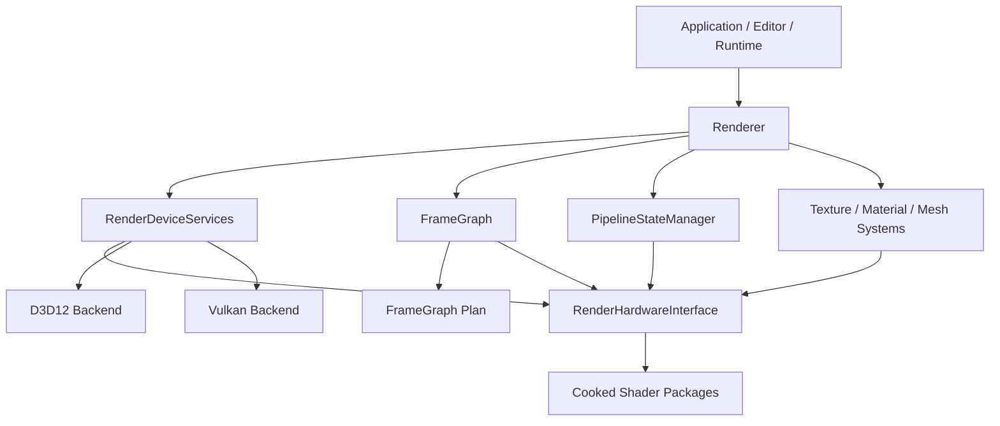
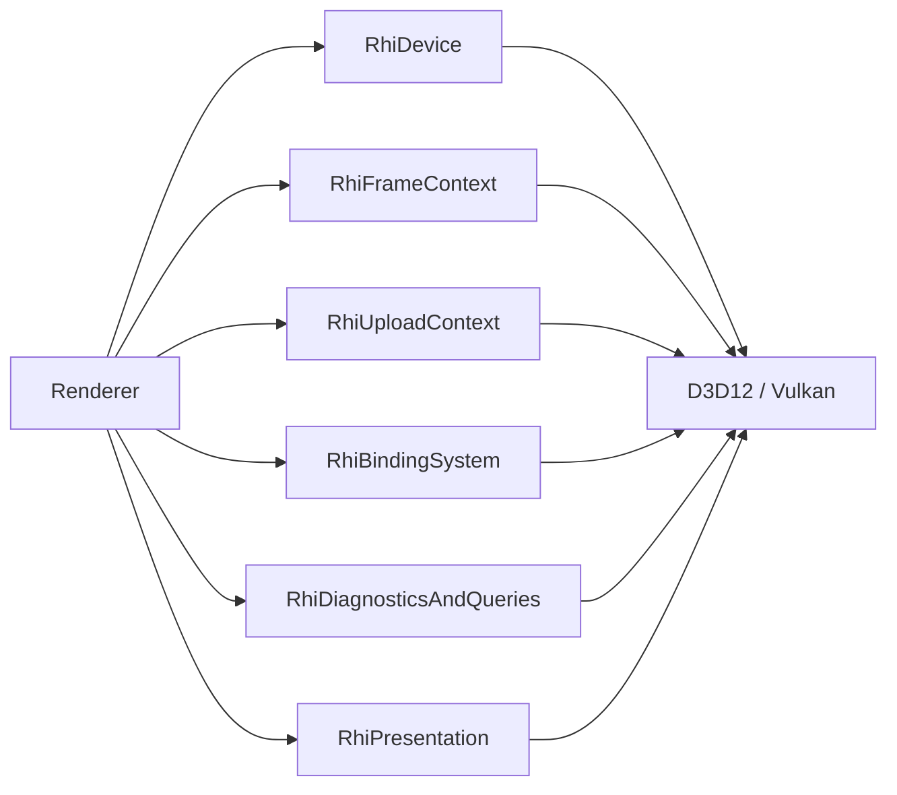
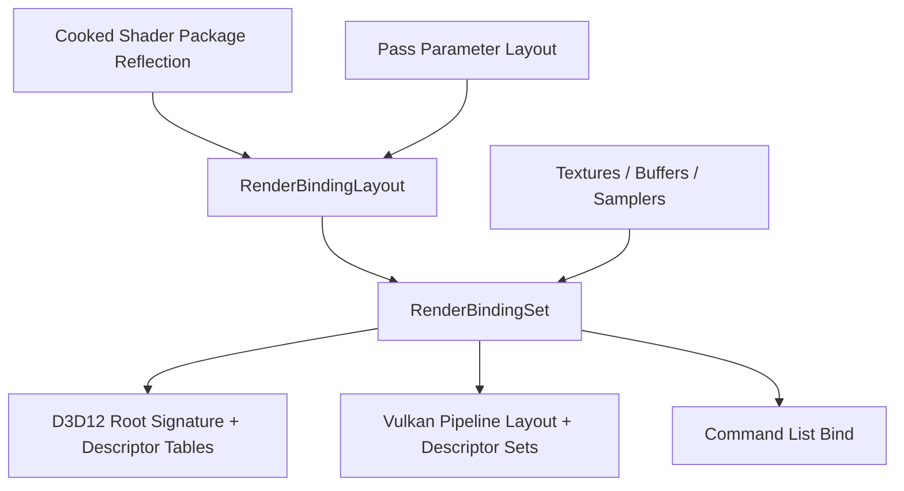
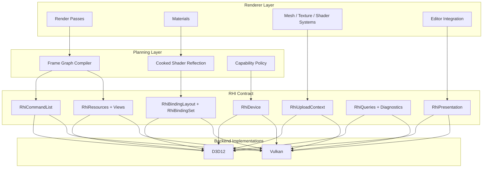

# Sparkle RHI Growth Architecture Review

Date: 2026-05-17

## Executive Summary

Sparkle is no longer a D3D12-only renderer with a thin future-Vulkan switch. The engine now has a real RHI abstraction, a D3D12 backend, a Vulkan backend that has progressed through device, swapchain, command context, dynamic rendering, and pipeline work, a cooked shader package path, and a frame graph that is beginning to own resource declarations and scheduling.

That is a good foundation, but it is not yet a growth-ready multi-backend architecture. The main risk is not that Vulkan is incomplete; that is expected. The main risk is that the public RHI contract currently exposes too much backend-shaped machinery directly to Renderer, while the engine does not yet have a precise backend capability matrix, backend parity gates for every user-visible feature, or a narrow set of renderer-facing abstractions for binding, resource lifetime, barriers, uploads, queues, readbacks, and feature fallback.

NVRHI is the strictest comparison point. It succeeds by making multi-backend behavior explicit: resource handles own lifetime, command lists own upload and barrier conveniences, binding layouts and binding sets are immutable objects, backends expose native handles only as escape hatches, validation is a first-class wrapper layer, and feature families such as graphics, compute, ray tracing, meshlets, bindless, staging, timer queries, and multi-queue are represented in the API model.

AMD's public FidelityFX/Cauldron lineage is a different lesson. The older FSR2 sample stack built separate DX12 and Vulkan variants and exposed backend-specific FidelityFX interfaces. The newer public FidelityFX SDK `Cauldron2` tree is more of a DX12-oriented sample framework: render modules, parameter sets, root signatures, pipeline objects, resource views, dynamic pools, and explicit barriers. It is useful as a feature integration and render-module organization reference, but it is not the same kind of reusable multi-backend RHI as NVRHI.

The recommended direction for Sparkle is engine-owned and conservative: keep the current RHI, but harden it into a smaller, stricter contract before adding larger renderer features. Do not chase bindless first. Make bindful descriptor sets/tables robust, make transient resources and barriers backend-correct, make shader package reflection the single source of binding truth, and make parity validation visible in CI-style targets.

## Evidence Base

This review uses:

- Sparkle local sources, especially `Engine/RHI/Public/Device/RenderHardwareInterface.h`, `Engine/RHI/Private/Device/RenderDeviceServices.cpp`, `Engine/RHI/Public/Pipeline/RhiPipelineStateDesc.h`, `Engine/RHI/Public/Resources/RhiResourceDesc.h`, and `Engine/Renderer/Private/FrameGraph/FrameGraphDeclaration.cpp`.
- Sparkle repository memory for Vulkan bootstrap, swapchain/command bootstrap, dynamic-rendering pipeline work, shader package ownership, and frame graph boundaries.
- NVRHI README and programming guide from NVIDIA GameWorks/NVIDIA RTX public sources.
- AMD/GPUOpen FidelityFX SDK `Cauldron2` public tree and older FidelityFX FSR2 public sample architecture where DX12 and Vulkan were built as separate variants.

## Current Sparkle Shape

Sparkle already has several important pieces in the right place:

- Backend selection is explicit through build configuration, `SPARKLE_RHI_BACKEND`, and command-line selectors such as `--rhi=Vulkan`.
- `RenderDeviceServices` routes backend creation through `ERhiBackendApi` and keeps D3D12/Vulkan implementation creation private.
- Backend-private implementations live under `Engine/RHI/Private/D3D12` and `Engine/RHI/Private/Vulkan`.
- Renderer consumes `RenderHardwareInterface`, not concrete D3D12 headers.
- Shader packages understand backend binary formats and runtime backend identity.
- Frame graph declarations are being separated from execution and resource planning.
- Vulkan uses dynamic rendering and backend-private pipeline layout work, which is the right direction for a modern Vulkan path.

The weak point is that the public RHI surface has grown as a direct list of operations instead of as a layered renderer contract. Today, `RenderHardwareInterface` includes device identity, native handles, command list access, ImGui, binding layouts, graphics and compute PSOs, descriptor allocation, descriptor table allocation, constant buffer upload helpers, texture loading, resource creation, BLAS/TLAS helpers, allocation queries, transient memory blocks, aliasing resources, resource views, present passes, and format queries. That breadth is manageable with one mature backend, but it becomes a parity and review problem as soon as Vulkan, compute-heavy systems, async work, ray tracing, editor tooling, or platform growth accelerate.

## External Comparison

### NVRHI: What It Does Better

NVRHI is a reusable RHI over D3D11, D3D12, and Vulkan 1.3. Its strongest architectural choices are:

- `IDevice` owns resource, pipeline, query, binding, and command-list creation, but draw and dispatch live on `ICommandList`.
- The application creates the native graphics device; NVRHI wraps it. This keeps platform/bootstrap concerns outside the abstraction.
- Resource lifetime is handle-based and reference-counted. Resources can be captured by binding sets and command lists until the GPU is done.
- Garbage collection is explicit and expected once per frame.
- Command lists provide upload helpers, scratch-buffer helpers, optional automatic resource state tracking, and barrier committing.
- Binding is modeled as immutable binding layouts plus immutable binding sets, with bindless descriptor tables as a distinct capability.
- Native objects are accessible through escape hatches, but not the normal renderer contract.
- Validation is a wrapper device that intercepts API calls and command lists.
- Feature areas are modeled directly: graphics, compute, meshlet, ray tracing, staging/readback, timer queries, event queries, multi-queue, volatile constant buffers, push constants, and bindless resources.

The core lesson is not "copy NVRHI." The lesson is that a growth-ready RHI must encode ownership, lifetime, feature availability, and synchronization policy as first-class API concepts rather than leaving each renderer subsystem to remember backend rules.

### AMD FidelityFX / Cauldron: What It Does Differently

AMD's public material splits into two useful references:

- Older FidelityFX FSR2 sample/Cauldron lineage: build-time DX12 and Vulkan variants, separate backend implementations for the FidelityFX API, explicit descriptor/pipeline creation per backend, and sample-level render systems.
- Current FidelityFX SDK `Cauldron2`: a DX12-centered framework with render modules, parameter sets, root signatures, pipeline objects, resource views, dynamic resource pools, dynamic buffer pools, and explicit resource barriers.

Cauldron's strong point is not backend purity. Its strength is feature integration shape:

- Render modules are named, configurable units with `Init`, `Execute`, resize, UI, and enable/disable hooks.
- Resources are named in framework configuration and can be mapped or resized by the framework.
- Parameter sets front-load descriptor binding work and are bound before pipeline execution.
- Render modules tend to state resource entry/exit expectations, often returning resources to shader-read state.
- FidelityFX API backends isolate algorithm integration from the host engine by adapting host resources and command lists into FFX backend resources.

The caution is that Cauldron-like module code can become backend-biased quickly when root signatures, descriptor heaps, or command-list details leak into feature code. Sparkle should borrow the idea of feature/module lifecycle and resource naming, not the DX12-centric leakage.

## Capability Matrix

| Area | Sparkle Today | NVRHI | AMD Cauldron / FidelityFX Pattern | Strict Assessment |
| --- | --- | --- | --- | --- |
| Backend coverage | D3D12 mature path; Vulkan path underway and selectable | D3D11, D3D12, Vulkan 1.3 | Older FSR2 samples had DX12/VK variants; current Cauldron2 public framework is DX12-oriented | Sparkle has the right ownership direction but needs explicit parity gates |
| Device bootstrap | Engine creates backend through `RenderDeviceServices` | App creates native device; NVRHI wraps it | Framework owns device/sample bootstrap | Sparkle should keep engine-owned bootstrap for now, but split platform bootstrap from RHI feature contract |
| Public RHI surface | Broad virtual interface | Layered interfaces: device, command list, resource, binding, query | Framework objects plus backend internals | Sparkle's surface is too wide for long-term reviewability |
| Resource lifetime | Opaque handles plus release calls; backend delayed release exists | Ref-counted handles plus garbage collection | Framework-owned resources and manual deletes in places | Sparkle needs stronger ownership/liveness semantics at the RHI boundary |
| Barriers | Frame graph declarations exist; command list/backend barriers exist | Optional automatic barriers plus manual override | Mostly explicit barrier calls in modules | Sparkle should let frame graph own cross-pass barriers and command list own local barriers/uploads |
| Binding model | `RenderBindingLayout`, compiled bindings, descriptor allocations/tables, shader package reflection | Immutable binding layouts/sets; bindless descriptor tables separately | Root signatures plus parameter sets | Sparkle is converging, but needs a renderer-facing binding set object, not raw descriptor orchestration everywhere |
| Shader packages | Cooked packages with backend binary format selection | Backends consume shader blobs/libraries; reflection support | Permutation blobs and backend-specific pipelines | Sparkle's cooked shader system is a real advantage if made the binding source of truth |
| Uploads | Helpers exist through texture/buffer creation paths; not yet a clear upload command model | Command lists hide upload-buffer suballocation and texture/buffer writes | Upload heaps/dynamic pools | Sparkle needs a first-class upload path before asset scale grows |
| Queries/diagnostics | Render diagnostics, timing work, backend diagnostics | Timer/event queries and validation wrapper | Profiling and framework assertions | Sparkle needs backend capability reporting plus validation wrappers/gates |
| Multi-queue | Not a visible first-class public model | Graphics/compute/copy queues supported | Queue concepts in framework/backend | Defer broad async compute until resource states and queue ownership are explicit |
| Ray tracing | Public RHI has RT hooks; D3D12 likely ahead of Vulkan | DXR and Vulkan RT modeled directly | DX12 RT modules in Cauldron2 | Sparkle should avoid public RT expansion until backend capability tiers are formalized |
| ImGui/editor | ImGui methods live directly on RHI | Usually integration layer around device | UI render module | Sparkle should move editor/UI integration behind a renderer/editor integration layer eventually |

## Current Architectural Risks

### 1. The RHI Interface Is Too Wide

`RenderHardwareInterface` is doing too many jobs. A wide virtual interface makes every backend look incomplete until it implements everything, and it encourages Renderer systems to reach for low-level operations directly.

Recommended split:

Do not necessarily create all these classes immediately. The important review rule is that a renderer subsystem should depend on the smallest capability it needs. A material cache should not see present passes. A frame graph compiler should not see ImGui. A texture uploader should not see ray tracing prebuild info.

### 2. Some Public Types Still Encode D3D12 Assumptions

The largest example is `RhiGpuVirtualAddress`. D3D12 makes GPU virtual addresses central; Vulkan can expose buffer device addresses, but not every resource-binding path should require them. Vertex/index buffer views and constant buffer helpers built around GPU addresses risk forcing Vulkan to emulate D3D12 semantics instead of presenting the renderer with stable RHI handles.

Action: introduce backend-neutral buffer/view binding records as the renderer-facing path, and keep raw GPU addresses as an optional capability for the paths that actually require them.

### 3. Binding Layout Exists, but Binding Set Ownership Is Not Yet Strong Enough

Sparkle has `RenderBindingLayout` and compiled binding metadata, which is good. The missing piece is a first-class immutable or versioned binding set/table object that owns resource references and descriptor writes in a backend-neutral way.

Without that, Renderer code tends to manage descriptor allocations, descriptor table handles, CPU/GPU descriptor handles, and resource views directly. That is exactly where multi-backend drift grows.

Recommended target:

Near-term policy: keep this bindful. Bindless metadata can remain reserved, but do not make bindless the unblocker for Vulkan parity.

### 4. Frame Graph Is the Right Owner, but It Needs to Own More of the Contract

Sparkle's frame graph setup currently validates pass declarations and builds pass nodes. That is the correct architectural direction. The next strict requirement is that the frame graph compiler, not individual render passes, should become the normal owner of:

- Cross-pass resource state transitions.
- Transient resource lifetime.
- Aliasing decisions.
- Pass input/output compatibility checks.
- Render-target/depth attachment format compatibility.
- Async/queue eligibility decisions later.

Pass code may still issue local UAV barriers or backend-specific escape operations, but those should be visible exceptions, not the default.

### 5. Feature Discovery Is Too Implicit

Sparkle currently has capability-style methods such as ray tracing capabilities and backend API queries, but a growth-ready RHI needs a fuller device capability object.

Minimum recommended capability groups:

- Backend identity and version.
- Required shader binary format.
- Descriptor model limits.
- Resource binding tier / descriptor indexing support.
- Push constants/root constants limits.
- Upload/readback support and alignment constraints.
- Format support by usage.
- Timestamp/query support.
- Ray tracing tier.
- Mesh shader/task shader support.
- Multi-queue support.
- Present/swapchain format support.

The rule should be: Renderer features query capabilities once during creation and either enable a supported path, choose a defined fallback, or fail with a targeted diagnostic.

### 6. Validation Needs to Become a Layer, Not Only Log Lines

NVRHI's validation wrapper is a major maturity advantage. Sparkle has validation targets and diagnostics, but the RHI API would benefit from a debug validation layer that wraps `RenderHardwareInterface`/command lists and checks contract violations before they become backend-specific failures.

Examples:

- Binding layout and shader package mismatch.
- Descriptor count overflow.
- Resource used after release.
- Resource state mismatch at frame graph boundary.
- Unsupported format/usage combination.
- Vulkan-selected run using a D3D12-only resource path.
- Missing backend implementation for a feature whose capability bit reports true.

### 7. Native Handles Are Useful, but They Must Be Treated as Escape Hatches

Sparkle exposes native device, queue, resource, and descriptor handles. This is useful for integration, diagnostics, and staged migration. It is also dangerous if normal Renderer code starts branching on backend details.

Policy recommendation:

- Native handles are allowed in backend implementations, diagnostics, and explicit external-integration adapters.
- Native handles are not allowed in ordinary render pass code.
- Any new native-handle use outside RHI should be justified in an architecture comment or validation rule.

## What Sparkle Does Better Than the References

Sparkle already has engine-specific advantages that should be preserved:

- Cooked shader packages and backend binary selection are integrated into the engine asset pipeline instead of being an afterthought.
- Frame graph direction is closer to a modern engine architecture than Cauldron-style module-local barrier ownership.
- Backend source boundaries are clean and private.
- Build-time Vulkan enablement is explicit and can configure without Vulkan SDK when disabled.
- The engine is still small enough to fix the RHI contract before content and feature count make changes expensive.

The strategic advantage is that Sparkle can choose a stricter engine-owned RHI now, while NVRHI and Cauldron carry historical compatibility and sample-framework constraints.

## Recommended Action Plan

### Stage 1: Make Backend Parity Visible

Priority: immediate.

- Add a living RHI capability table in code and docs.
- Add a backend parity validation target that checks D3D12 and Vulkan implement the declared capability surface consistently.
- Require every public RHI method to be categorized as core, optional capability, diagnostic, presentation, editor integration, or escape hatch.
- Log the active backend, shader binary format, descriptor model, ray tracing tier, timestamp support, and major feature flags at startup.

Exit criteria:

- A reviewer can answer "what is Vulkan expected to support today?" from one table.
- Unsupported features fail early with a clear capability diagnostic.

### Stage 2: Introduce Strong Binding Sets

Priority: high.

- Keep `RenderBindingLayout`, but add a renderer-facing `RenderBindingSet` or equivalent object.
- Build binding sets from shader package reflection plus pass/material parameters.
- Make descriptor writes backend-private.
- Make binding sets own or retain references to resources for the duration of GPU use, or explicitly document the alternative lifetime contract.
- Preserve bindful material tables as the near-term path.

Exit criteria:

- Renderer code binds resources through binding sets, not raw descriptor handles.
- D3D12 and Vulkan receive equivalent binding data from the same source object.

### Stage 3: Narrow the Public RHI Surface

Priority: high.

- Split presentation, diagnostics/queries, resource creation, uploads, binding, and command recording into smaller capability-facing interfaces or service accessors.
- Move ImGui-specific methods out of the core `RenderHardwareInterface` contract.
- Keep raw native handles behind explicit interop accessors.
- Replace general Renderer dependencies on full RHI with narrower interfaces where practical.

Exit criteria:

- Adding one backend feature does not require stubbing unrelated editor/present/raytracing APIs.
- Renderer subsystems depend only on the capability category they use.

### Stage 4: Make Frame Graph the Normal Barrier Owner

Priority: high after binding-set cleanup.

- Extend frame graph compilation from declaration validation into resource state planning.
- Make pass declarations include enough usage detail to generate D3D12 barriers and Vulkan image/buffer barriers.
- Keep pass-local barriers only for well-defined cases such as UAV ordering inside a pass.
- Add diagnostics that print pass resource transitions when validation is enabled.

Exit criteria:

- Most render pass code does not directly issue cross-pass state transitions.
- D3D12/Vulkan transition behavior is generated from one frame graph plan.

### Stage 5: Formalize Resource Lifetime and Uploads

Priority: medium-high.

- Add a first-class upload context for buffers and textures.
- Define staging/readback resources separately from shader/render resources.
- Make delayed destruction and in-flight resource retention explicit in the public contract.
- Decide whether Sparkle wants handle generation checks, ref-counted RHI resources, or frame-retire ownership for all RHI resources.

Exit criteria:

- Asset uploads do not depend on backend-specific helper paths.
- Releasing a resource used by the GPU has a documented and validated behavior.

### Stage 6: Defer Advanced Features Until the Foundation Holds

Priority: disciplined deferral.

- Do not make bindless the near-term solution for material growth.
- Do not expand public ray tracing APIs until capability tiers and binding/lifetime contracts are stable.
- Do not add async compute until frame graph state planning can model queue ownership.
- Do not let editor integrations become core RHI responsibilities.

Exit criteria:

- New feature proposals start with required capability flags, resource lifetime implications, and D3D12/Vulkan parity notes.

## Target Architecture

## Architectural Review Checklist

Use this checklist for any RHI or Renderer feature review:

- Which capability category does this feature require?
- Does it work on both D3D12 and Vulkan, or is it explicitly backend-limited?
- Where is the fallback path defined?
- Which object owns resource lifetime while GPU work is in flight?
- Does the feature require raw native handles? If yes, why is an interop adapter insufficient?
- Are barriers generated by the frame graph, command list, or pass code?
- Does shader package reflection define the binding layout, or is the layout duplicated manually?
- Does the feature need descriptor allocation, descriptor tables, or a binding set?
- Is the feature bindful, bindless, or mixed?
- How does the feature participate in resize, device loss, hot reload, and editor/runtime host modes?
- What validation target or smoke launch proves backend parity?

## Decision Recommendations

1. Keep Sparkle's engine-owned RHI rather than adopting NVRHI wholesale.
2. Use NVRHI as the maturity benchmark for binding, lifetime, validation, command-list upload helpers, and capability modeling.
3. Use AMD Cauldron as a render-module and feature-integration reference, not as a strict RHI model.
4. Prioritize bindful binding sets and shader-reflection-driven layouts before bindless.
5. Make frame graph resource state planning the default path before async compute or extensive Vulkan feature work.
6. Shrink the core RHI interface by capability area before adding more advanced renderer features.
7. Add explicit backend parity gates now, while the Vulkan implementation is still small enough to correct cheaply.

## Bottom Line

Sparkle is pointed in the right direction, but the next architectural milestone should be contract hardening, not feature expansion. The engine should make backend capability, binding ownership, resource lifetime, uploads, and frame graph transitions explicit before relying on Vulkan as a peer runtime path. If that work happens first, Sparkle can grow into a cleaner engine-specific RHI than either a sample framework or a general-purpose middleware abstraction. If it does not, every new renderer feature will multiply backend-specific assumptions and make future architectural review more expensive.