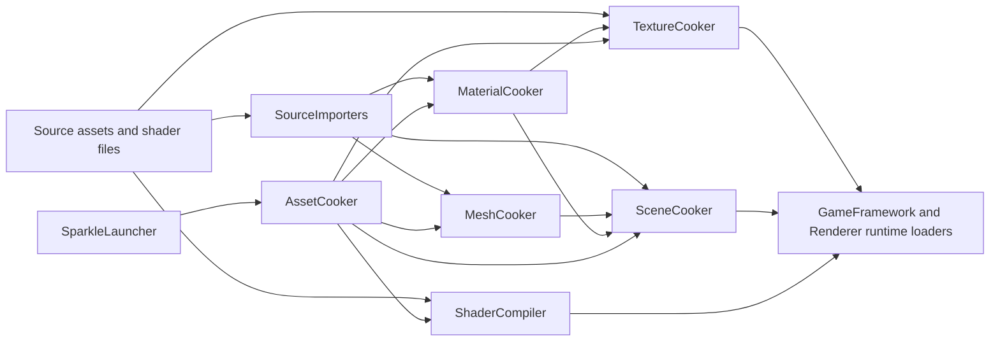

# Tooling And Content Pipeline Contract

Status: whole-repository tooling contract
Date: 2026-06-12
Last synchronized: 2026-06-13

## Purpose

This document defines the architecture contract for Sparkle's developer tools and content pipeline. It exists so RHI/Renderer refactors do not silently break shader cooking, texture cooking, asset cooking, launcher workflows, or source import.

Target folder structure for these tools is tracked in [after/repository-target-folder-architecture.md](after/repository-target-folder-architecture.md).
Validation workflow shape is tracked in [validation-workflow-contract.md](validation-workflow-contract.md).
Shader and cooked artifact compatibility evidence is tracked in [artifact-validation-matrix.md](artifact-validation-matrix.md).
Project and engine asset ownership is tracked in [project-asset-ownership-contract.md](project-asset-ownership-contract.md).

Reference basis:

- NVIDIA Donut reusable rendering framework and ShaderMake dependency: https://github.com/NVIDIA-RTX/Donut
- NVIDIA Falcor shader/rendering framework and tooling model: https://github.com/NVIDIAGameWorks/Falcor
- AMD Cauldron content/sample framework for DX12/Vulkan: https://github.com/GPUOpen-LibrariesAndSDKs/Cauldron
- AMD Cauldron thread pool and backend command-list rings as focused execution support: https://github.com/GPUOpen-LibrariesAndSDKs/Cauldron
- AMD Compressonator GUI/CLI/SDK split for texture and mesh optimization tools: https://github.com/GPUOpen-Tools/compressonator
- CMake target usage requirements: https://cmake.org/cmake/help/latest/command/target_link_libraries.html
- Qt model/view programming for launcher UI separation: https://doc.qt.io/qt-6/model-view-programming.html
- glTF as an API-neutral runtime asset delivery format: https://registry.khronos.org/glTF/specs/2.0/glTF-2.0.html
- KTX texture tooling/container model: https://github.com/KhronosGroup/KTX-Software
- Repository threading readiness: [after/repository-threading-readiness.md](after/repository-threading-readiness.md)

## Ownership Summary

| Tool area | Owns | Does not own |
| --- | --- | --- |
| [SparkleLauncherCore](../../Tools/Launcher/SparkleLauncher) | Build/cook/launch/maintenance operation planning, process requests, project discovery, artifact/tool resolution. | CMake internals beyond invoking commands, cooking algorithms, renderer/RHI behavior. |
| SparkleLauncher Qt GUI | Launcher UI shell, models, widgets, visual style, action history, user prompts. | Tool business logic that belongs in `SparkleLauncherCore`, cook/import/render code. |
| [ShaderCompiler](../../Tools/Shaders/ShaderCompiler) | Shader backend selection, source preprocessing, reflection extraction, package cooking, verification, CLI inspection. | Runtime rendering, backend command encoding, renderer frame graph execution. |
| [SourceImporters](../../Tools/Import/SourceImporters) | glTF/FBX/source scene reading into imported DTOs with diagnostics. | Cooked runtime loading, RHI resource creation, renderer scene data mutation. |
| [TextureCooker](../../Tools/Cooking/TextureCooker) | Source image loading, texture pipeline stages, compression policy, cooked texture asset emission. | Material/scene semantics, runtime texture manager policy, renderer resource residency. |
| [MeshCooker](../../Tools/Cooking/MeshCooker) | Imported mesh to cooked mesh asset conversion. | Source importer ownership, runtime mesh component behavior, renderer GPU mesh cache. |
| [MaterialCooker](../../Tools/Cooking/MaterialCooker) | Imported material to cooked material asset conversion and texture cook request generation. | Source texture decoding, runtime material cache behavior. |
| [SceneCooker](../../Tools/Cooking/SceneCooker) | Cooked scene manifest assembly for cameras, lights, instances, material variants, skeletons, metadata, animations. | Runtime level switching, renderer frame graph setup. |
| [AssetCooker](../../Tools/Cooking/AssetCooker) | Project discovery, cook planning, dispatching focused cook tools, diagnostics, process isolation. | Owning each cook algorithm directly. |
| AssetConverter retired path | Former direct conversion CLI behavior now lives only as explicit `AssetCooker` inspect/debug commands. | Returning as a production cook target or generic conversion owner. |
| [ToolConsoleSupport](../../Tools/Support/ToolConsoleSupport) | Shared console/report formatting for tools. | Asset policy, shader policy, launcher state, cook-domain policy, or broad "common" ownership. |

## Active Refactor Stages

Tooling is refactored through active implementation stages, not only final audits:

| Stage | Tooling scope | Required outcome |
| --- | --- | --- |
| Stage 17A | Renderer shader registration tooling | Renderer shader registrations become manifest-driven or generated so ShaderCompiler receives typed records without repeated class/package/layout constants. |
| Stage 17B | Pass authoring workflow tooling | A pass-add audit and scaffolder/generator workflow reduce ordinary compute/raster pass authoring to intentional shader, pass intent, and frame insertion inputs while preserving ShaderCompiler validation. |
| Stage 27 | Source import | `SourceImporters` is the production source import target; importers emit imported DTOs, import reports, and diagnostics. |
| Stage 28 | Focused cookers and support | Texture/Mesh/Material/Scene cookers own transformations; generic console support lives in `ToolConsoleSupport`; cook-domain diagnostics stay with focused cookers until a shared diagnostics target is justified. |
| Stage 29 | ShaderCompiler | ShaderCompiler consumes `ShaderContracts` and emits deterministic package/reflection reports without full renderer runtime linkage. Completed with deterministic catalog, job identity, validation, cook, and inspect evidence. |
| Stage 30 | AssetCooker, retired AssetConverter path, Launcher, hosts | AssetCooker owns orchestration/reports and source inspect/debug commands; AssetConverter source/CMake target is removed; LauncherCore/Qt GUI/Application/Editor boundaries are enforced. |
| Stage 31 | Artifact validation | Shader and cooked artifacts have producer/schema/consumer/inspector/smoke evidence in [artifact-validation-matrix.md](artifact-validation-matrix.md). |
| Stage 32 | Projects and engine assets | Sample content and built-in assets become owned validation inputs in [project-asset-ownership-contract.md](project-asset-ownership-contract.md), not ambiguous file roots. |

## Disposition Decisions

| Current area | Disposition | Target decision |
| --- | --- | --- |
| `SparkleLauncherCore` | Improve and extract | Keep as workflow/process orchestrator; route data through `ToolContracts` request/report/history types. |
| SparkleLauncher Qt GUI | Keep and refine | Preserve the model/view-style split; widgets do not own cook/build/shader algorithms. |
| `ShaderCompiler` | Keep and refine | Consume `ShaderContracts`, narrow renderer shader registrations, and generic package schemas, not full renderer runtime. |
| `SourceImporters` | Keep and refine | Per-format importers emit imported DTOs, import reports, and diagnostics through a role-centered target. |
| `TextureCooker`, `MeshCooker`, `MaterialCooker`, `SceneCooker` | Keep and refine | Preserve focused tools; improve schemas, inspectors, and failure reports. |
| `AssetCooker` | Keep and refine | Keep project discovery/planning/dispatch; source inspect/debug commands may live here when they use the same importer/focused cooker contracts and do not mutate production policy. |
| `AssetConverter` | Removed as production path | Folded into `AssetCooker` inspect/debug commands; never keep as a second production cook policy. |
| `ToolConsoleSupport` | Keep and refine | Generic console/report formatting lives outside cooking and has no asset, shader, project, launcher, or cook-domain policy. |

## Tool Folder Target

| Current folder | Target folder rule | Cleanup rule |
| --- | --- | --- |
| `Tools/Import/SourceImporters` | Keep role-centered per-format importer folders and DTO/report diagnostics. | Do not reintroduce adapter and importer folders as parallel production paths. |
| `Tools/Cooking/TextureCooker`, `MeshCooker`, `MaterialCooker`, `SceneCooker` | Keep focused cooker folders; each owns one artifact transformation family. | Do not fold focused algorithms into AssetCooker or Launcher. |
| `Tools/Cooking/AssetCooker` | Keep project discovery, plan construction, dispatch, aggregation, and reports. | Do not duplicate focused cooker algorithms. |
| `Tools/Support/ToolConsoleSupport` | Keep generic console/report plumbing here. | Do not add asset, shader, project, launcher, source import, or cook-domain policy. |
| `Tools/Conversion/AssetConverter` | Removed from source/CMake as a production path. Useful read-only behavior is represented by `AssetCooker inspect-source` and `AssetCooker collect-texture-requests`. | Do not replace it with another generic conversion folder. |
| `Tools/Shaders/ShaderCompiler` | Keep as shader compile/reflection/package/inspection tool; consume `Tools/Shaders/ShaderContracts` and public RHI shader package primitives. | Do not link full renderer runtime for package enumeration. |
| `Tools/Launcher/SparkleLauncher/Private/Core` | Keep workflow/process/evidence ownership here or in a clear `Private/Workflows` grouping. | Do not create cooker/compiler implementation folders under Launcher. |
| `Tools/Launcher/SparkleLauncher/Private/Gui` | Keep Qt models/widgets/presentation here. | Do not let GUI folders own tool algorithms. |
| `Tools/Contracts` | Target home for process requests, tool reports, artifact reports, and operation history records. | Do not put engine runtime asset schemas here. |

## Tooling Complexity Budget

| Tooling complexity | Earns its right when | Remove or redesign when |
| --- | --- | --- |
| Source importer | It owns one source-format family and emits DTOs/diagnostics through `AssetContracts`. | It leaks source-format assumptions into runtime loaders. |
| Focused cooker | It performs one artifact transformation and reports schema/version/feature diagnostics. | It owns project workflow, UI prompts, or another cooker's algorithm. |
| AssetCooker orchestration | It plans, dispatches, aggregates, isolates failures, and records reports. | It reimplements focused cooker transformations. |
| Tool support helpers | They provide shared console/report behavior with no asset policy. | They become vague `Common`/`Utils` policy sinks. |
| Inspect/debug command | It reads artifacts/reports and improves diagnosis. | It becomes a parallel production conversion/cook path. |
| Launcher workflow | It creates process requests and operation history. | It duplicates tool algorithms inside GUI or models. |

## Artifact Flow

Rules:

- Source import produces imported DTOs and diagnostics.
- Cookers produce cooked runtime artifacts.
- Runtime modules load cooked artifacts; they do not read source formats.
- Launcher and AssetCooker orchestrate tool execution; they do not duplicate focused tool algorithms.
- ShaderCompiler consumes `ShaderContracts` pass catalogs/manifests plus generic shader package primitives, but does not link full renderer runtime.

## Cooked Asset Producer/Consumer Pairing

Stage 26 treats every cooked runtime asset as a producer/schema/loader/consumer contract. Stage 31 keeps the executable artifact evidence in [artifact-validation-matrix.md](artifact-validation-matrix.md). Focused cookers may include public cooked schema headers; they must not include `Engine/GameFramework/Private/Assets/Loaders` or use loader code as schema documentation.

| Artifact | Producer | Public schema | Runtime loader/consumer | Inspection or validation evidence |
| --- | --- | --- | --- | --- |
| `.smsh` cooked mesh | `MeshCooker` writes mesh assets; `SceneCooker` writes mesh references. | `CookedMeshAsset.h`, `CookedSceneManifest.h` | `MeshAssetLoader`, `SceneAssetPayloadMeshAppender`, renderer mesh scene data. | Build `MeshCooker`, `AssetCooker`, `SparkleGameFramework`; sample Showcase cook/load. |
| `.smat` cooked material | `MaterialCooker` writes material assets and texture references. | `CookedMaterialAsset.h`, `CookedTextureReference.h` | `MaterialAssetLoader`, material payload appenders, renderer material/texture systems. | Build `MaterialCooker`, `TextureCooker`, `AssetCooker`, `SparkleGameFramework`; inspect generated texture requests. |
| `.sscn` cooked scene manifest | `SceneCooker` writes scene manifests. | `CookedSceneManifest.h` plus camera/light/metadata records. | `SceneManifestLoader`, `SceneManifestValidator`, `SceneAssetPayloadLoader`. | Build `SceneCooker`, `AssetCooker`, `SparkleGameFramework`; sample Showcase cook/load. |
| `.sanim` cooked animation | `SceneCooker` animation writer. | `CookedAnimationAsset.h` | `AnimationAssetLoader`, animation payload appender, runtime animation systems. | Build `SceneCooker`, `AssetCooker`, `SparkleGameFramework`; sample animated scene load. |
| `.sskel` cooked skeleton | `SceneCooker` skeleton writer. | `CookedSkeletonAsset.h` | `SkeletonAssetLoader`, skeleton payload appender, runtime skeleton systems. | Build `SceneCooker`, `AssetCooker`, `SparkleGameFramework`; sample skeletal scene load. |
| Cooked texture output | `TextureCooker` pipeline and compression stages. | Texture cooker output contract plus `CookedTextureReference.h` references from materials. | Renderer texture manager/runtime texture load path, reached from GameFramework material/texture references. | Build `TextureCooker`, `AssetCooker`, renderer/runtime target; run request inspect/cook for generated texture requests. |

Loader-facing failure evidence must remain asset-oriented: asset id, path, schema name, schema version, record kind, expected feature, and reason. Producer-facing failure evidence must name source path, artifact id, output path, schema/version, and reason.

## Threading Readiness Contract

Tooling should be designed as deterministic jobs even while the first implementation remains serial.

| Tool area | Threading-ready rule |
| --- | --- |
| SourceImporters | Each import job owns one source asset/source group and emits imported DTOs plus diagnostics. |
| Focused cookers | Each cook job owns its temp output, validates it, then publishes the final artifact/manifest. |
| ShaderCompiler | Shader jobs are keyed by package id, backend format, options, and generation; package output is immutable after publish. |
| Shader registration generation | Generated records are deterministic and sorted by package/shader identity so repeated runs produce stable list/cook evidence. |
| AssetCooker | Planning owns the dependency graph; execution owns job requests, dependencies, cancellation, retry, and report aggregation. |
| LauncherCore | UI intent becomes process/tool requests; long operations report progress/history without Qt widgets owning work. |
| Reports | Job reports include job id, source path, artifact/package id, profile/backend, output path, failure reason, and elapsed time when available. |

Forbidden threading shortcuts:

- Do not make cook jobs write final artifacts before validation succeeds.
- Do not let AssetCooker reimplement focused cooker work to make dispatch easier.
- Do not put mutable global caches behind generic `CookCommon`/`ToolCommon` names without owner and invalidation policy.
- Do not let Launcher Qt widgets start worker threads or tools directly.
- Do not rely on nondeterministic filesystem iteration order for artifact manifests or shader package lists.

## Boundary Rules

Positive guardrails:

- Keep source format handling in `SourceImporters` or source-loading stages inside focused cookers.
- Keep cooked artifact schemas stable and documented before changing runtime loaders.
- Keep tool targets runnable without building the editor when practical.
- Keep failure output actionable: file path, asset id/package id, target profile, backend/format, and reason.
- Keep launcher operation history and process output as validation evidence.

Negative guardrails:

- Do not add tool-private includes to runtime engine modules.
- Do not make Launcher own cook/import/shader algorithms.
- Do not make GameFramework read source glTF/FBX/images directly.
- Do not make renderer/RHI refactors change cooked schemas without updating cookers and runtime loaders together.
- Do not hide tool failures behind generic "cook failed" messages.

## RHI/Renderer Refactor Impact Checklist

When RHI or Renderer changes, check:

| Changed contract | Tooling impact |
| --- | --- |
| Shader registration/package/reflection/layout | `ShaderCompiler`, renderer shader registrations, shader verification, package inspection, pass runtime. |
| Cooked texture format or upload contract | `TextureCooker`, `MaterialCooker`, `AssetCooker`, GameFramework cooked texture references, renderer texture manager. |
| Scene mesh/material/light/camera DTOs | `SourceImporters`, `MeshCooker`, `MaterialCooker`, `SceneCooker`, GameFramework loaders, renderer scene data builders. |
| Build targets/profiles/artifact layout | `SparkleLauncherCore`, `AssetCooker` dispatch, CMake artifact contract, CI workflows. |
| Smoke validation environment variables | Launcher smoke workflows, Application validation, and validation docs. |

## Launcher Smoke Contract

Launcher smoke workflows transfer validation data through launch request fields and environment variables rather than Application internals.

Runtime/editor smoke validation should be launcher-first. A direct executable run is valid milestone evidence only when it mirrors the launcher plan: `RunProject`, project target/profile, `Projects/<ProjectId>` working directory, smoke environment, log path, and artifact paths. The reusable rules live in [validation-workflow-contract.md](validation-workflow-contract.md).

| Launcher request field | Environment variable | Consumer | Notes |
| --- | --- | --- | --- |
| `SmokeBackend` | `SPARKLE_RHI_BACKEND` | RHI backend selection. | Empty means default backend selection. |
| `SmokeFrameLimit` | `SPARKLE_SMOKE_FRAME_LIMIT` | Runtime/editor smoke validation. | Empty means 120 frames. |
| `SmokeViewMode` | `SPARKLE_SMOKE_VIEW_MODE` | Editor smoke validation. | Numeric `RenderViewMode` value; GUI exposes common choices. |
| `SmokeCapturePath` | `SPARKLE_SMOKE_SCENE_COLOR_CAPTURE` | Editor smoke capture orchestration. | RHI/backend capture service writes the artifact or reports a precise failure reason. |
| `SmokeTrace` | `SPARKLE_SMOKE_TRACE` | Runtime/editor smoke validation. | Enables trace-level smoke logging. |
| `SmokeSkipLevelSwitching` | `SPARKLE_SMOKE_SKIP_LEVEL_SWITCHING` | Runtime/editor smoke validation. | Keeps smoke focused on one level when requested. |

## Validation Targets

Smallest meaningful validation by tool area:

| Change | Validation |
| --- | --- |
| Launcher workflow/UI model | Build `SparkleLauncher` and run or inspect the relevant operation path. |
| Shader compiler/cook | Build `ShaderCompiler`; run `list-shaders`, package cook, or inspect command matching the change. |
| Texture pipeline | Build `TextureCooker`; run targeted texture request inspect/cook when sample requests exist. |
| Import/cook DTOs | Build affected import/cook library and `AssetCooker`; run a targeted sample cook when available. |
| AssetCooker orchestration | Build `AssetCooker`; verify dispatch plan/log output and confirm retired conversion behavior is only reachable as explicit inspect/debug commands. |
| GameFramework cooked schema | Build `SparkleGameFramework`, affected cookers, and runtime/editor smoke that loads the cooked asset. |

## Open Design Questions

| Question | Why it matters | Owning stage |
| --- | --- | --- |
| Should cooked asset schemas live in GameFramework, RHI, or a lower neutral runtime asset module? | Texture, material, mesh, scene, and shader packages are consumed by runtime and produced by tools. | Stage 24, Stage 27 |
| Should AssetCooker call focused tools as processes or link their libraries for all cook paths? | Process isolation improves failure diagnostics but library calls can simplify tests. Either choice must keep focused cooker ownership clear. | Stage 30 |
| Which former AssetConverter commands survive as inspect/debug commands? | `inspect-source` and `collect-texture-requests` survive as explicit AssetCooker commands. Direct `cook-scene` does not survive because production scene cooking belongs to project cook planning. | Stage 30 |
| When should `CookDiagnostics` become a shared target? | Current code justifies `ToolConsoleSupport`; create `CookDiagnostics` only when multiple focused cookers share real cook-domain diagnostics, reports, or validation records. | Stage 31 |
| What is the stable launcher evidence schema for build/cook/launch/smoke operations? | Final reviewer artifacts should be generated consistently. | Stage 30 |
| How should shader package validation fixtures be stored and run in CI? | Shader compiler regressions need evidence beyond a build. | Stage 29, Stage 31, Stage 34 |
