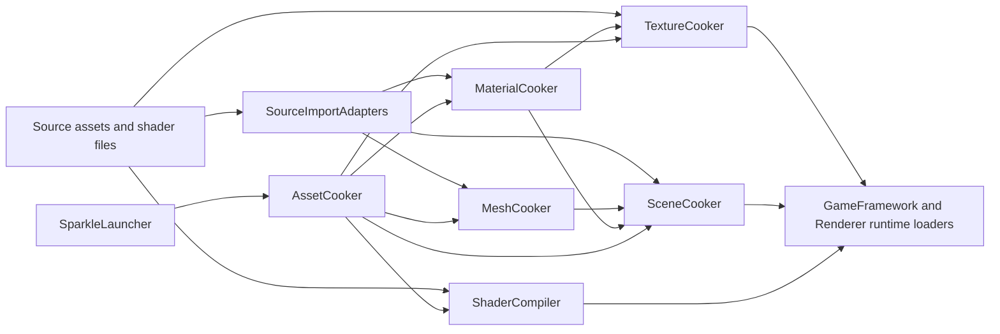

# Tooling And Content Pipeline Contract

Status: whole-repository tooling contract
Date: 2026-06-12

## Purpose

This document defines the architecture contract for Sparkle's developer tools and content pipeline. It exists so RHI/Renderer refactors do not silently break shader cooking, texture cooking, asset cooking, launcher workflows, or source import.

Reference basis:

- NVIDIA Donut reusable rendering framework and ShaderMake dependency: https://github.com/NVIDIA-RTX/Donut
- NVIDIA Falcor shader/rendering framework and tooling model: https://github.com/NVIDIAGameWorks/Falcor
- AMD Cauldron content/sample framework for DX12/Vulkan: https://github.com/GPUOpen-LibrariesAndSDKs/Cauldron
- AMD Compressonator GUI/CLI/SDK split for texture and mesh optimization tools: https://github.com/GPUOpen-Tools/compressonator
- CMake target usage requirements: https://cmake.org/cmake/help/latest/command/target_link_libraries.html
- Qt model/view programming for launcher UI separation: https://doc.qt.io/qt-6/model-view-programming.html
- glTF as an API-neutral runtime asset delivery format: https://registry.khronos.org/glTF/specs/2.0/glTF-2.0.html
- KTX texture tooling/container model: https://github.com/KhronosGroup/KTX-Software

## Ownership Summary

| Tool area | Owns | Does not own |
| --- | --- | --- |
| [SparkleLauncherCore](../../Tools/Launcher/SparkleLauncher) | Build/cook/launch/maintenance operation planning, process requests, project discovery, artifact/tool resolution. | CMake internals beyond invoking commands, cooking algorithms, renderer/RHI behavior. |
| SparkleLauncher Qt GUI | Launcher UI shell, models, widgets, visual style, action history, user prompts. | Tool business logic that belongs in `SparkleLauncherCore`, cook/import/render code. |
| [ShaderCompiler](../../Tools/Shaders/ShaderCompiler) | Shader backend selection, source preprocessing, reflection extraction, package cooking, verification, CLI inspection. | Runtime rendering, backend command encoding, renderer frame graph execution. |
| [SourceImportAdapters](../../Tools/Import/SourceImportAdapters) | glTF/FBX/source scene reading into imported DTOs with diagnostics. | Cooked runtime loading, RHI resource creation, renderer scene data mutation. |
| [TextureCooker](../../Tools/Cooking/TextureCooker) | Source image loading, texture pipeline stages, compression policy, cooked texture asset emission. | Material/scene semantics, runtime texture manager policy, renderer resource residency. |
| [MeshCooker](../../Tools/Cooking/MeshCooker) | Imported mesh to cooked mesh asset conversion. | Source importer ownership, runtime mesh component behavior, renderer GPU mesh cache. |
| [MaterialCooker](../../Tools/Cooking/MaterialCooker) | Imported material to cooked material asset conversion and texture cook request generation. | Source texture decoding, runtime material cache behavior. |
| [SceneCooker](../../Tools/Cooking/SceneCooker) | Cooked scene manifest assembly for cameras, lights, instances, material variants, skeletons, metadata, animations. | Runtime level switching, renderer frame graph setup. |
| [AssetCooker](../../Tools/Cooking/AssetCooker) | Project discovery, cook planning, dispatching focused cook tools, diagnostics, process isolation. | Owning each cook algorithm directly. |
| [AssetConverter](../../Tools/Conversion/AssetConverter) | Direct developer/debug conversion CLI over import/cook modules. | Becoming the main source of cook policy. |
| [CookCommon](../../Tools/Cooking/CookCommon) | Shared console/tool presentation helpers. | Asset policy, shader policy, launcher state. |

## Artifact Flow

Rules:

- Source import produces imported DTOs and diagnostics.
- Cookers produce cooked runtime artifacts.
- Runtime modules load cooked artifacts; they do not read source formats.
- Launcher and AssetCooker orchestrate tool execution; they do not duplicate focused tool algorithms.
- ShaderCompiler consumes renderer-owned shader registrations plus RHI shader package primitives, but does not link full renderer runtime.

## Boundary Rules

Positive guardrails:

- Keep source format handling in `SourceImportAdapters` or source-loading stages inside focused cookers.
- Keep cooked artifact schemas stable and documented before changing runtime loaders.
- Keep tool targets runnable without building the editor when practical.
- Keep failure output actionable: file path, asset id/package id, target profile, backend/format, and reason.
- Keep launcher operation history and process output as validation evidence.

Negative guardrails:

- Do not add tool-private includes to runtime engine modules.
- Do not make Launcher own cook/import/shader algorithms.
- Do not make GameFramework read source glTF/FBX/images directly.
- Do not make renderer/RHI refactors change cooked schemas without updating cookers and runtime loaders together.
- Do not hide tool failures behind generic "cook failed" messages.

## RHI/Renderer Refactor Impact Checklist

When RHI or Renderer changes, check:

| Changed contract | Tooling impact |
| --- | --- |
| Shader registration/package/reflection/layout | `ShaderCompiler`, renderer shader registrations, shader verification, package inspection, pass runtime. |
| Cooked texture format or upload contract | `TextureCooker`, `MaterialCooker`, `AssetCooker`, GameFramework cooked texture references, renderer texture manager. |
| Scene mesh/material/light/camera DTOs | `SourceImportAdapters`, `MeshCooker`, `MaterialCooker`, `SceneCooker`, GameFramework loaders, renderer scene data builders. |
| Build targets/profiles/artifact layout | `SparkleLauncherCore`, `AssetCooker` dispatch, CMake artifact contract, CI workflows. |
| Smoke validation environment variables | Launcher smoke workflows, Application validation, docs and README commands. |

## Validation Targets

Smallest meaningful validation by tool area:

| Change | Validation |
| --- | --- |
| Launcher workflow/UI model | Build `SparkleLauncher` and run or inspect the relevant operation path. |
| Shader compiler/cook | Build `ShaderCompiler`; run `list-shaders`, package cook, or inspect command matching the change. |
| Texture pipeline | Build `TextureCooker`; run targeted texture request inspect/cook when sample requests exist. |
| Import/cook DTOs | Build affected import/cook library and `AssetCooker`; run a targeted sample cook when available. |
| AssetCooker orchestration | Build `AssetCooker`; verify dispatch plan/log output. |
| GameFramework cooked schema | Build `SparkleGameFramework`, affected cookers, and runtime/editor smoke that loads the cooked asset. |

## Open Design Questions

| Question | Why it matters | Owning stage |
| --- | --- | --- |
| Should cooked asset schemas live in GameFramework, RHI, or a lower neutral runtime asset module? | Texture, material, mesh, scene, and shader packages are consumed by runtime and produced by tools. | Stage 24, Stage 27 |
| Should AssetCooker call focused tools as processes or link their libraries for all cook paths? | Process isolation improves failure diagnostics but library calls can simplify tests. | Stage 25 |
| What is the stable launcher evidence schema for build/cook/launch/smoke operations? | Final reviewer artifacts should be generated consistently. | Stage 26 |
| How should shader package validation fixtures be stored and run in CI? | Shader compiler regressions need evidence beyond a build. | Stage 27 |
