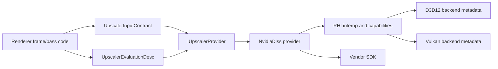

# Upscaler Provider Contract

Status: Stage 9 provider/native interop contract
Date: 2026-06-13
Last synchronized: 2026-06-13

## Purpose

This document defines how renderer-owned upscaling providers use RHI-native metadata without turning common renderer code or common RHI policy into vendor SDK code.

Reference basis:

- NVIDIA Streamline repository: https://github.com/NVIDIA-RTX/Streamline
- NVIDIA Streamline programming guide: https://github.com/NVIDIA-RTX/Streamline/blob/main/docs/ProgrammingGuide.md
- NVIDIA Streamline manual hooking guide: https://github.com/NVIDIA-RTX/Streamline/blob/main/docs/ProgrammingGuideManualHooking.md
- AMD FidelityFX SDK: https://github.com/GPUOpen-LibrariesAndSDKs/FidelityFX-SDK
- Architecture boundary guardrails: [architecture-boundary-guardrails.md](architecture-boundary-guardrails.md)
- RHI contract map: [rhi-contract-map.md](rhi-contract-map.md)
- Rendering system map: [rendering-system-map.md](rendering-system-map.md)

## Ownership

| Area | Owner | Allowed dependencies | Forbidden dependencies |
| --- | --- | --- | --- |
| Provider-neutral upscaler contracts | Renderer | `Upscaling/UpscalerProvider.h`, `Upscaling/UpscalerInputContract.h`, `RHI/Public` descriptors and interop service contracts. | Vendor SDK headers, backend-private folders, direct D3D12/Vulkan headers in common pass/frame code. |
| NVIDIA DLSS provider | Renderer provider target `SparkleRendererNvidiaDlssProvider` | Streamline SDK headers, provider-local translation, provider diagnostics, provider fallback policy. | Common RHI policy changes, general renderer pass policy, unrelated provider state. |
| RHI backend interop metadata | RHI backend folders | Backend-native device/queue/resource facts, capability records, typed public RHI interop structs. | Provider selection, DLSS/FSR/NRD policy, renderer pass names. |
| Common renderer frame/pass code | Renderer | Provider-neutral input/evaluation structs and pass products. | Streamline-specific types, FidelityFX-specific types, `Vulkan::Vulkan`, D3D12/Vulkan private headers. |

## Runtime Flow

Common frame code builds renderer-owned inputs and evaluation requests. Provider code translates those contracts to SDK calls. RHI reports native facts; it does not decide whether DLSS, FSR, NRD, or passthrough should be selected.

## Data Transfer Contracts

| Data crossing | Shape | Producer | Consumer | Rule |
| --- | --- | --- | --- | --- |
| Upscaler frame inputs | `UpscalerInputContract` | Renderer frame builders | `IUpscalerProvider::SetupFrame` | Must contain render/output extents, temporal state, camera constants, depth/motion-vector conventions, reset reason, and product handles. |
| Provider evaluation | `UpscalerEvaluationDesc` | Renderer frame graph pass | `IUpscalerProvider::Evaluate` | May include native handles only through RHI public handle/value structs and `NativeTextureViewInfo`; common pass code must not include native API headers. |
| Native device/queue interop | `RhiNativeDeviceQueueInterop` and `RhiNativeInteropRequest` | RHI interop service | Provider initialization | Request must name the consumer and reason. Providers receive facts; they do not fabricate handles. |
| Backend capability facts | `RhiExternalFeatureInteropCapabilities` | D3D12/Vulkan backend capability builders | Provider capability report | Records bridge kind, adapter identity, native handle availability, manual-hooking readiness, resource interop, and explicit state support. |
| Provider diagnostics | `UpscalerProviderCapabilities`, `UpscalerEvaluationResult` | Provider implementation | Renderer diagnostics, smoke validation, launcher evidence | Must include status, failure domain, runtime state, selected quality mode, feature matrix summary, extents, reset state, and human-readable reason. |

## Failure Domains

Provider failures must be classified with `EUpscalerProviderFailureDomain`:

| Domain | Meaning | Example |
| --- | --- | --- |
| `None` | No failure, or fallback selected intentionally and successfully. | Passthrough provider produced from scene color. |
| `Sdk` | Vendor runtime, manual hook, SDK call, binary lookup, or SDK initialization failed. | `slInit`, `slSetD3DDevice`, `slSetVulkanInfo`, or `slEvaluateFeature` failed. |
| `Driver` | Driver or adapter support is missing or rejected. | Future provider query reports unsupported driver branch. |
| `Backend` | RHI/backend bridge cannot supply required device, queue, command-list, resource, or API metadata. | Vulkan instance/device/family metadata missing. |
| `Feature` | Provider SDK is present but the requested feature is unsupported. | DLSS feature support query failed. |
| `ResourceState` | Required resource state/layout contract is wrong or unavailable. | Future validation rejects an input texture layout/state. |
| `InputContract` | Renderer did not provide required frame inputs or matching extent/convention data. | Native command list or required native resource is missing. |

## Linkage And Header Rules

`SparkleRenderer` owns provider selection and provider-neutral frame scheduling. It must not link Vulkan directly for Streamline. The provider-specific target `SparkleRendererNvidiaDlssProvider` may link `NVIDIA::Streamline` and, when required by the SDK integration path, `Vulkan::Vulkan`.

The boundary check permits these narrow native-provider edges:

- `Engine/Renderer/CMakeLists.txt`: `SparkleRendererNvidiaDlssProvider` may link `Vulkan::Vulkan` under the Streamline feature branch.
- `Engine/Renderer/Private/Upscaling/NvidiaDlss/StreamlineDlssRuntime.cpp`: Streamline Vulkan setup may include Vulkan headers and cast public RHI opaque Vulkan handles to the SDK-required Vulkan types.

Any native API use outside those provider paths is a renderer boundary violation.

## Threading Readiness

Upscaler data must remain frame-local or provider-owned:

- `UpscalerInputContract` is built as an immutable frame snapshot.
- `UpscalerEvaluationDesc` is a command-recording request for one pass and one frame.
- Provider diagnostics are copied out as value reports.
- RHI native metadata is read from capability/interop services; providers must not hold mutable backend internals.

This shape lets future renderer jobs prepare inputs, validate contracts, and submit provider evaluation work without accessing private GameFramework state or backend-private objects.

## Acceptance

- Common renderer pass/frame code depends on `UpscalerInputContract`, `UpscalerEvaluationDesc`, and `IUpscalerProvider`, not vendor SDK headers.
- `SparkleRenderer` does not link `Vulkan::Vulkan` directly.
- DLSS capability and runtime logs include backend, bridge kind, SDK/runtime state, feature support, selected mode, failure domain, and reason.
- Provider/native exceptions are counted and limited by [ArchitectureBoundaryCheck.cmake](../../CMake/ArchitectureBoundaryCheck.cmake).
- Future providers add provider targets or provider folders with the same contract instead of editing common RHI policy.
