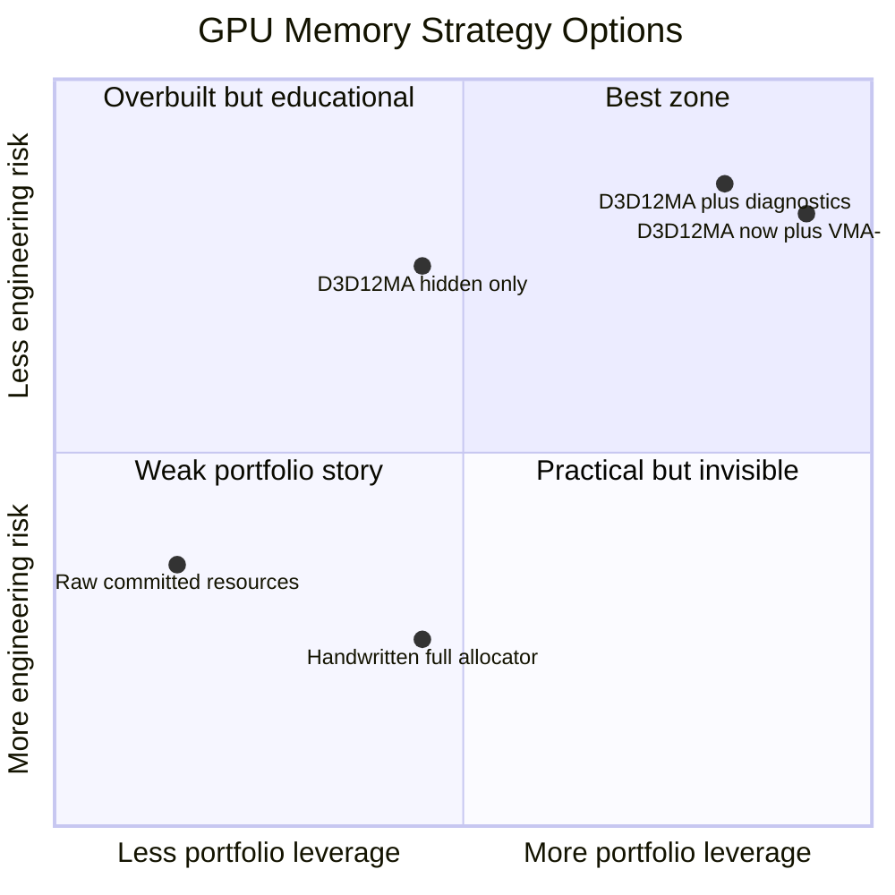
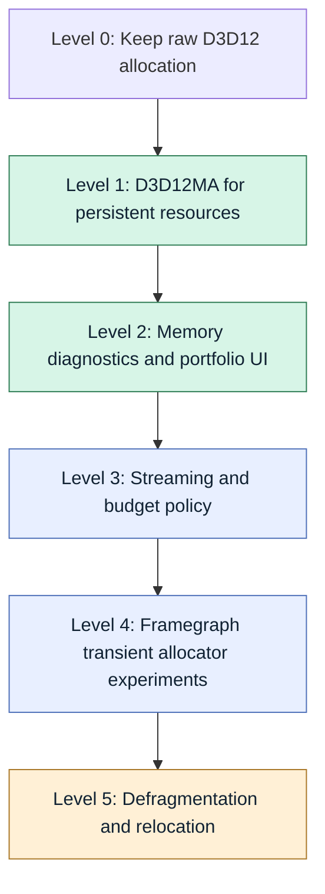
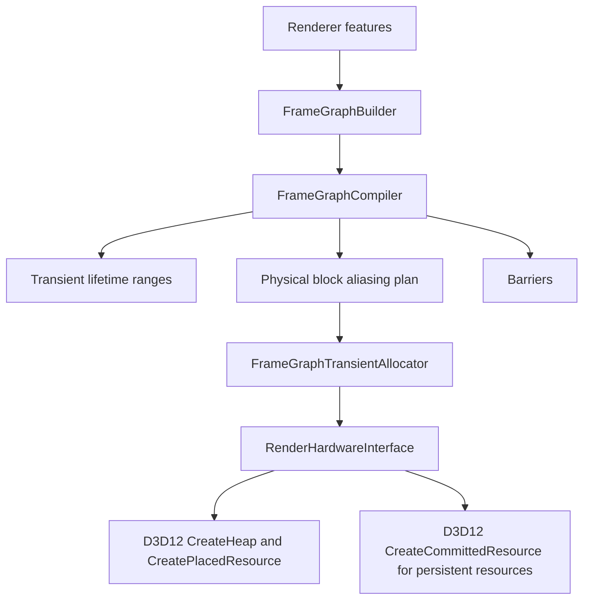
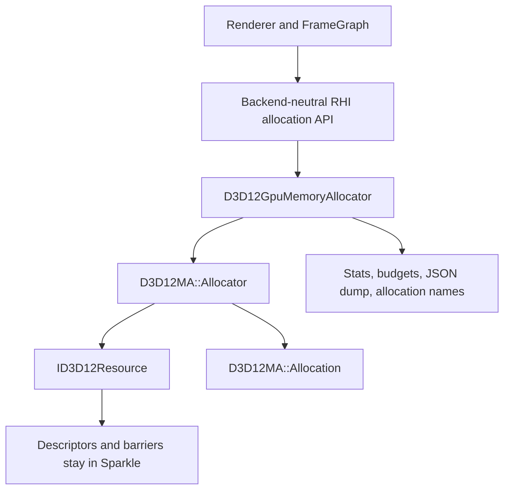
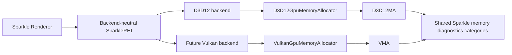
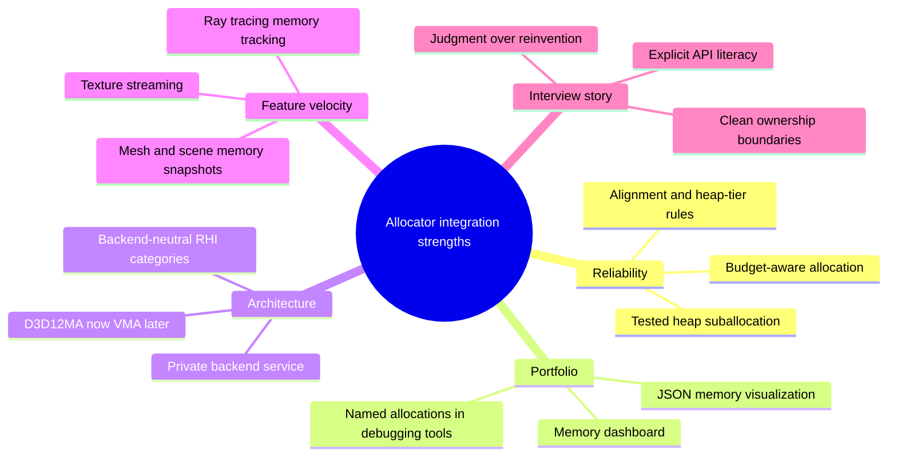
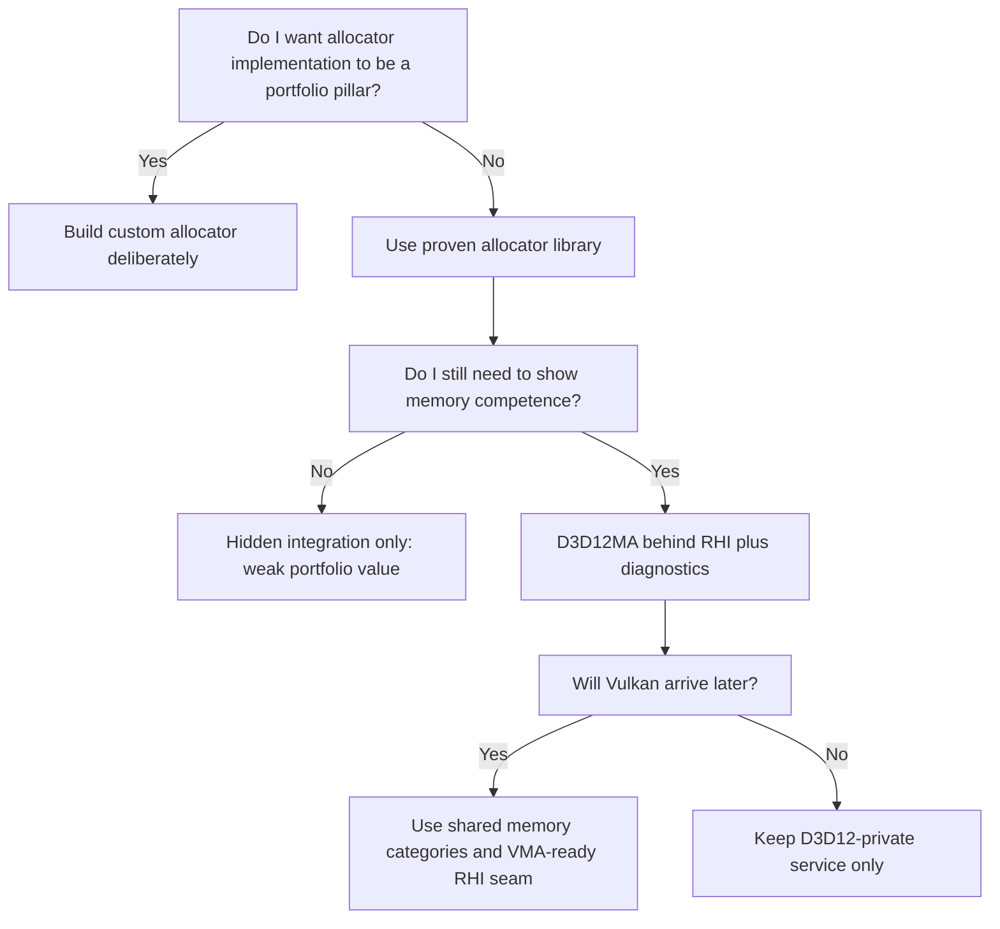
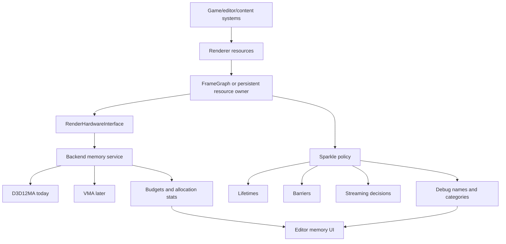
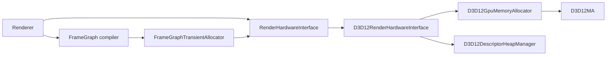
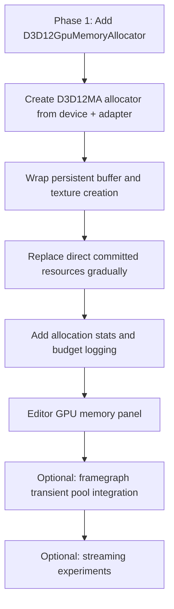

# GPU Memory Allocator Strategy For SparkleEngine

This document is about D3D12MA now and Vulkan Memory Allocator later. The goal is not to become "the allocator person." The goal is to integrate proven allocator technology cleanly, get real diagnostics and shipping-style behavior, and spend portfolio energy on rendering architecture, framegraph design, tooling, ray tracing, assets, streaming, and visual results.

## Short Recommendation

Integrate AMD/GPUOpen D3D12 Memory Allocator, but do it as a private D3D12 backend service under SparkleRHI, not as a public Renderer concept and not as a replacement for your framegraph lifetime planning. Design the RHI seam so a future Vulkan backend can use Vulkan Memory Allocator with the same high-level Sparkle concepts.

Implementation plan: [d3d12ma-vma-memory-integration-plan.md](d3d12ma-vma-memory-integration-plan.md).

This is the portfolio-friendly path:

- Use D3D12MA for tested heap allocation, placed resource creation, budget/statistics reporting, and naming. Leave defragmentation out of this scope.
- Plan the same shape for VMA when Vulkan arrives: backend-private allocator, backend-neutral RHI resource handles, shared memory diagnostics categories.
- Keep Sparkle's own framegraph compiler responsible for resource lifetimes, pass order, aliasing decisions, and barrier planning.
- Keep the small per-frame upload/constant linear allocator because it solves a different problem and is already a good explicit-API story.

The interview story should be: "I did not hand-wave GPU memory. I identified the boundary where allocator complexity becomes product risk, integrated production-tested allocators behind my RHI, and kept my engine-specific ownership in framegraph policy, diagnostics, and rendering features."

## Your Positioning

Your stated position is valid and professionally defensible:

> I do not want to spend most of this engine on writing a custom GPU allocator. I want tested allocator technology that gives real results, and I want to show I can integrate it, instrument it, and use it to ship better rendering systems.

That is a strong portfolio stance if the implementation makes the boundary obvious.

| You want to shine on | Let allocator library handle | Sparkle still owns |
| --- | --- | --- |
| Framegraph, passes, lighting, ray tracing, tools, diagnostics, asset/rendering features | Heap suballocation algorithms, block management, alignment details, memory-type selection, budget query plumbing | Resource categories, framegraph lifetime policy, barrier policy, delayed destruction, descriptor ownership, debug UI, streaming policy |

The professional version is not "I skipped memory." It is:

```text
I delegated generic allocator mechanics to proven GPUOpen libraries,
then built the engine policy and tooling around them.
```

## Options At A Glance



| Option | What it means | Pros | Cons | Portfolio read |
| --- | --- | --- | --- | --- |
| Raw committed resources | Keep using `CreateCommittedResource` for most persistent resources | Fastest short-term path, simple code | Poor memory visibility, weak budget story, does not scale well | Looks like an early sample renderer |
| Build custom allocator | Write your own heap/block/free-list allocator | Deep learning, maximum control | Large time sink, high bug risk, delays visible rendering features | Strong only if allocator itself is the portfolio target |
| D3D12MA hidden only | Integrate D3D12MA but expose no diagnostics or architecture notes | Reliable allocation quickly | Interviewer may not see your understanding | Practical, but under-sold |
| D3D12MA plus diagnostics | Integrate D3D12MA and add categories, budget UI, allocation dumps | Best near-term balance | Requires clean handle/lifetime design | Strong professional graphics-engine signal |
| D3D12MA now, VMA-ready later | Same as above, but design backend-neutral RHI categories for Vulkan | Best long-term engine story | Needs discipline to avoid D3D12 leaking upward | Strong AMD/NVIDIA and cross-API signal |

Recommended choice: D3D12MA plus diagnostics now, with the RHI shaped for VMA later. The selected scope is Levels 1-4, with defragmentation explicitly excluded.

## Scope Ladder

This is the key decision: do not integrate too little, and do not turn allocator integration into a six-month detour.



| Level | Scope | Do now? | Reason |
| --- | --- | --- | --- |
| 0 | Keep raw D3D12 allocation | No | You already know this is not where you want to spend portfolio energy |
| 1 | D3D12MA for persistent textures, buffers, ray tracing buffers | Yes | Gives immediate correctness and architecture payoff |
| 2 | Memory stats, budgets, names, JSON dump, editor panel | Yes | This is what makes the integration visible and interview-useful |
| 3 | Streaming policy using allocator budgets | Yes | Strong feature unlock; allocator reports budget pressure, Sparkle owns policy |
| 4 | Framegraph transient pools through D3D12MA | Yes | Use D3D12MA for heap/pool mechanics while keeping Sparkle lifetime/aliasing/barrier logic |
| 5 | Defragmentation and moving resources | No | Out of scope; requires relocation scheduling and handle update policy |

The selected sweet spot is Level 1 through Level 4. That fully uses D3D12MA where it reduces maintained code, while avoiding defragmentation work that would turn the engine into an allocator project.

## Current Engine State

Sparkle already has more memory architecture than a toy renderer:

- `RenderHardwareInterface` exposes backend-neutral resource and transient allocation hooks: allocation info, owned heaps, placed resources, native resource handles, descriptors, BLAS/TLAS buffers, and upload constants.
- The D3D12 backend currently creates many persistent resources directly with `CreateCommittedResource`, including vertex/index buffers, runtime textures, upload buffers, ray tracing scratch buffers, acceleration structure buffers, and instance buffers.
- The renderer framegraph already computes transient resource lifetimes, physical block reuse, and aliasing barriers before execution.
- `FrameGraphTransientAllocator` materializes the framegraph plan by asking RHI for heaps and placed resources, then creates RTV/DSV/SRV/UAV descriptors.
- `D3D12LinearAllocator` is a mapped upload-buffer allocator for per-frame constants. This should stay separate from D3D12MA unless a later upload system redesign needs it.

The gap is not "I have no memory management." The gap is that persistent GPU resource allocation is still mostly manual D3D12 committed-resource code, and memory diagnostics are not yet strong enough to explain residency, budgets, fragmentation, and allocation categories.



The best D3D12MA integration replaces `I` and `J` inside the D3D12 backend, while leaving `B`, `C`, `D`, `E`, and `F` as Sparkle-owned engine work.



## What D3D12MA Gives You

D3D12MA is a single H/CPP style C++ library for Direct3D 12 memory allocation. It is MIT licensed, GPU-vendor neutral at runtime, and published through AMD GPUOpen. Current public docs describe support for large heap suballocation, custom pools, linear pools, defragmentation, statistics, budget queries, debug names/private data, JSON dumps, a virtual allocator, and newer Agility SDK alignment behavior such as tight alignment where available.

VMA is the Vulkan sibling: a single-header MIT-licensed GPUOpen allocator for `VkBuffer`, `VkImage`, and `VkDeviceMemory`. It chooses memory types, suballocates blocks, supports custom pools, linear pools, defragmentation, statistics, memory budget extensions, debug names/user data, JSON dumps, mapping helpers, sparse binding support, and virtual allocation.

The important strategic point: D3D12MA and VMA are not random dependencies. They are an explicit-api allocator family. Using both behind SparkleRHI tells a coherent story.



| Concept | D3D12 path | Vulkan path later | Shared Sparkle concept |
| --- | --- | --- | --- |
| Allocator object | `D3D12MA::Allocator` | `VmaAllocator` | Private backend memory service |
| Resource allocation | `ID3D12Resource` + `D3D12MA::Allocation` | `VkBuffer`/`VkImage` + `VmaAllocation` | `RhiOwnedResourceHandle` or private allocation record |
| Memory pools | D3D12MA custom pools | VMA custom pools | Sparkle memory category or resource lifetime class |
| Linear/ring style pools | D3D12MA linear algorithm pools | VMA linear algorithm pools | Upload/transient experiments where useful |
| Budget/statistics | D3D12MA stats/budget | VMA stats/budget, `VK_EXT_memory_budget` when available | Editor memory panel and log snapshots |
| JSON dump | D3D12MA JSON dump | VMA JSON dump | Portfolio visualization and debug export |
| Defragmentation | D3D12MA defrag APIs | VMA defrag APIs | Future explicit relocation system |

## Strength Map



## Risk Heatmap

| Risk | Probability | Impact | Heat | Response |
| --- | --- | --- | --- | --- |
| D3D12MA leaks into public Renderer/RHI headers | Medium | High | High | Keep all allocator types private under `Engine/RHI/Private/D3D12/Memory` |
| Handle lifetime bugs from resource plus allocation ownership | Medium | High | High | Replace raw-resource pending releases with private allocation records retired by fence |
| Integration becomes too large before visible results | Medium | Medium | Medium | Stop at persistent resources plus diagnostics before touching framegraph transients |
| You cannot explain memory fundamentals in interview | Low/Medium | High | Medium | Keep a short architecture note and demo budget/heap/aliasing concepts visually |
| D3D12MA and future VMA abstractions diverge | Medium | Medium | Medium | Define shared Sparkle memory categories and diagnostics before Vulkan implementation |
| Defragmentation derails scope | Low | High | Medium | Exclude defrag from this scope until resource relocation policy exists |
| Upload path gets overcomplicated | Medium | Medium | Medium | Keep current `D3D12LinearAllocator` initially; revisit upload architecture separately |

## Decision Tree



For Sparkle, that maps to concrete improvements:

| Need | Current Sparkle state | D3D12MA impact |
| --- | --- | --- |
| Persistent texture/buffer allocation | Many direct `CreateCommittedResource` calls | Central allocator path with allocation objects, names, stats, and budget awareness |
| Framegraph transient resources | Sparkle plans lifetimes and physical blocks, then creates heaps/resources | Keep Sparkle planner; optionally let D3D12MA own heap creation or validate/replace block packing later |
| Heap tier and alignment rules | Some allocation info and heap flags handled manually | D3D12MA handles heap tier separation and resource alignment rules more robustly |
| Memory diagnostics | DRED/live objects plus some runtime texture diagnostics | Add budget, allocation category, JSON memory map, and per-feature allocation tables |
| Streaming and asset growth | Texture manager and cooked assets exist, but no strong memory-budget policy yet | Easier to add streaming budgets, eviction decisions, and memory pressure UI |
| Ray tracing growth | BLAS/TLAS buffers are direct committed resources | Easier to track large RT allocations and budget impact per scene |

## Portfolio Value For AMD/NVIDIA

Using D3D12MA or VMA will not by itself get you a job at AMD or NVIDIA. What helps is the engineering judgment around it.

Good interview signal:

- You know explicit APIs require explicit memory ownership.
- You know when to build engine-specific logic and when to use a proven library.
- You keep vendor-specific implementation private behind a backend-neutral RHI.
- You can explain committed vs placed resources, heap tiers, Vulkan memory types, alignment, aliasing, budgets, and delayed destruction.
- You can show diagnostics, not just code: memory budget UI, allocation table, JSON memory dump, named allocations in PIX/DRED-style debugging, and before/after screenshots.

Weak interview signal:

- "I integrated D3D12MA because I did not understand memory."
- "I will use VMA later, so I do not need to design the RHI memory seam now."
- "The allocator owns my framegraph decisions."
- "I exposed D3D12MA through public renderer APIs."
- "I stopped learning resource states, upload paths, aliasing, or descriptor lifetime because a library exists."

The framing matters. Say this instead:

> I wanted production-grade backend allocation while keeping engine-specific scheduling and resource lifetime logic visible. D3D12MA and future VMA own heap/device-memory suballocation and budget reporting. Sparkle owns framegraph lifetimes, aliasing barriers, resource state transitions, delayed destruction policy, categories, and renderer-facing diagnostics.

That is a strong AMD/NVIDIA portfolio answer because those teams care about technical judgment, debugging discipline, and clean ownership more than whether every allocator line is handwritten.

## Pros

| Pro | Why it matters for Sparkle | Interview angle |
| --- | --- | --- |
| Production-tested allocator | Reduces risk in heap tier, alignment, small/tight resource alignment, block management, and fragmentation behavior | Shows you use battle-tested infrastructure where appropriate |
| Better diagnostics | Budget queries, stats, allocation names, and JSON dumps are strong visual portfolio artifacts | Lets you show memory behavior instead of only talking about it |
| Faster path to content scale | Persistent textures, mesh buffers, RT buffers, and streaming assets can grow without one-off allocation code | Shows readiness for real engine workloads |
| Cleaner D3D12 backend | Consolidates `CreateCommittedResource`, `CreateHeap`, and `CreatePlacedResource` into one backend allocator service | Shows architecture discipline in RHI/private backend separation |
| Future streaming foundation | Memory budgets make texture mip streaming, scene streaming, and editor memory panels more natural | Strong graphics-engine feature story |
| AMD relevance without AMD lock-in | GPUOpen library, but works on NVIDIA/Intel DX12 GPUs too | Good cross-vendor engineering story |
| Keeps framegraph work valuable | D3D12MA does not replace pass/resource lifetime compilation | Lets you keep your own engine work visible |
| Future VMA symmetry | Same allocator-family story can apply to Vulkan | Shows cross-API design instead of one-off D3D12 patching |

## Cons

| Con | Why it matters | Mitigation |
| --- | --- | --- |
| It can hide fundamentals if presented poorly | Interviewers may probe whether you understand heaps, placed resources, budgets, and aliasing | Write a short architecture note and be ready to explain the boundary |
| Handle ownership gets more complex | `RhiOwnedResourceHandle` currently stores only a raw resource pointer; D3D12MA needs resource plus allocation lifetime | Add a private D3D12 allocation record/table instead of exposing D3D12MA publicly |
| Delayed destruction must include allocations | Current delayed release stores `ComPtr<ID3D12Resource>`; D3D12MA allocation release must retire safely after GPU fences | Replace pending release records with resource+allocation records |
| Framegraph transient allocator overlaps conceptually | Sparkle already creates heaps and placed resources for transient aliasing | Integrate persistent resources first; revisit transient heaps only after diagnostics prove value |
| Third-party maintenance surface | Adds another dependency, warning policy, update policy, and license notice | Fetch or vendor only the H/CPP pair with pinned version and third-party warning suppression |
| Defragmentation is not free | Moving GPU data requires copy scheduling, barriers, and handle/update policy | Treat defrag as future work after stable allocator stats |
| Multi-backend story needs care | Sparkle has RHI ambitions beyond D3D12 | Keep public RHI allocator vocabulary backend-neutral; mirror with VMA when Vulkan arrives |

## Integration Strength By Scope

| Scope choice | Reliability gain | Portfolio visibility | Architecture risk | Recommended? |
| --- | ---: | ---: | ---: | --- |
| Only add library, no migration | 1/5 | 1/5 | 1/5 | No |
| Persistent resources only | 4/5 | 3/5 | 3/5 | Yes, first |
| Persistent resources plus memory diagnostics | 5/5 | 5/5 | 3/5 | Yes, target scope |
| Also replace framegraph transient heap path | 4/5 | 4/5 | 4/5 | Yes, after persistent resources and diagnostics |
| Add defragmentation immediately | 3/5 | 4/5 | 5/5 | No, defer |
| Design D3D12MA and VMA common diagnostics categories | 5/5 | 5/5 | 2/5 | Yes |

## What It Will Unlock

### Easier After Allocator Integration

- Memory budget panel in the editor: committed bytes, used bytes, free ranges, allocation counts, per-category summaries.
- Texture streaming policy: load lower mips when budget is tight, promote mips when budget allows.
- Scene/level memory snapshots: show how much GPU memory a model, material set, or scene costs.
- Better ray tracing demos: BLAS/TLAS/scratch memory cost is visible and controllable.
- Better crash/debug reports: allocation names and DRED page-fault context become more useful.
- More confident persistent resource lifetime: resource plus allocation can be tracked as one owned object.
- Portfolio screenshots: allocator JSON visualizations, editor memory tables, budget graphs, and resource category breakdowns.

### Still Hard After Allocator Integration

- Resource state barriers and queue ownership.
- Descriptor heap residency and descriptor table lifetime.
- Upload scheduling and copy queue architecture.
- Framegraph lifetime compilation and aliasing decisions.
- Texture streaming policy: D3D12MA/VMA can report budgets, but they will not decide which assets matter.
- Defragmentation scheduling: the allocator can help, but the engine must schedule moves safely.
- GPU-driven rendering, bindless/material systems, meshlet pipelines, and ray tracing shader table organization.

D3D12MA and VMA remove allocator boilerplate. They do not remove graphics engineering.

## Architecture Impact

### Target Architecture

The target is two layers of ownership:

- Backend allocator libraries own generic memory mechanics.
- Sparkle owns engine policy and presentation.



### What To Own Versus Delegate

| Area | Own in Sparkle | Delegate to D3D12MA/VMA | Why |
| --- | --- | --- | --- |
| Heap block algorithms | No | Yes | Generic, high-risk, not your intended showcase |
| Memory type selection | Mostly no | Yes | Especially important for Vulkan; VMA is built for this |
| Resource debug naming | Yes | Store through allocator | Engine names make diagnostics meaningful |
| Resource categories | Yes | No | Allocator cannot know if something is scene, framegraph, RT, texture, upload |
| Framegraph lifetime ranges | Yes | No | This is renderer architecture and strong portfolio work |
| Aliasing policy | Yes | Partially | Allocator can support aliasing; Sparkle decides when lifetimes do not overlap |
| Delayed destruction | Yes | No | Must be tied to Sparkle fences/frame lifecycle |
| Budget query mechanics | No | Yes | Allocator/library or API reports data |
| Budget response policy | Yes | No | Texture streaming and eviction policy belong to engine |
| Defragmentation movement scheduling | Yes, later | Helper APIs only | Engine must schedule copies/barriers and update references |

### Integrate / Defer / Keep Custom

| System | Current Sparkle state | Recommendation | Rationale |
| --- | --- | --- | --- |
| Runtime textures | Direct committed resource in `D3D12Texture` | Integrate early | High memory impact, good diagnostics payoff |
| Static mesh vertex/index buffers | Currently upload-heap resources through RHI | Integrate, but also consider default-heap upload path | Better real-engine performance story than permanent upload heaps |
| Ray tracing scratch/AS/instance buffers | Direct committed resources | Integrate early | Large allocations; useful portfolio diagnostics |
| Framegraph transient color/depth/buffer resources | Sparkle plans lifetimes and creates placed resources on owned heaps | Defer allocator replacement | Existing custom planner is valuable; do not erase it first |
| Per-frame constants | `D3D12LinearAllocator` mapped upload buffer | Keep custom for now | Good simple per-frame upload solution, not the same problem |
| Descriptor heaps | Custom descriptor heap manager | Keep separate | D3D12MA/VMA do not replace descriptor allocation architecture |
| Texture streaming decisions | Not yet budget-driven | Build after stats | Allocator gives signal; engine decides response |
| Memory editor panel | Not yet central | Build after integration | This is the portfolio-visible payoff |

### Backend-Neutral Shape For VMA Later

Avoid designing a D3D12-only public abstraction such as `D3D12AllocationHandle`. Prefer backend-neutral concepts:

```text
RhiMemoryCategory
    Texture
    Mesh
    RayTracing
    FrameGraphTransient
    Upload
    Readback
    Other

RhiMemoryUsageSnapshot
    BudgetBytes
    UsedBytes
    AllocationCount
    BlockCount
    CategoryRows[]

RhiOwnedResourceHandle
    Opaque value into backend-owned allocation record
```

Then the backend records can differ privately:

| Public/engine concept | D3D12 private record | Vulkan private record later |
| --- | --- | --- |
| Owned texture | `ID3D12Resource`, `D3D12MA::Allocation` | `VkImage`, `VmaAllocation` |
| Owned buffer | `ID3D12Resource`, `D3D12MA::Allocation` | `VkBuffer`, `VmaAllocation` |
| Allocation name | `LPCWSTR`/wide debug name | UTF-8 allocation name/user data |
| Budget snapshot | D3D12MA budget/stat APIs | VMA budget/stat APIs |
| JSON export | D3D12MA JSON dump | VMA JSON dump |

### Recommended New Private Types

```text
Engine/RHI/Private/D3D12/Memory/
    D3D12GpuMemoryAllocator.h/.cpp
    D3D12GpuAllocation.h/.cpp        optional, if handle table grows

Engine/RHI/Private/Vulkan/Memory/    future
    VulkanGpuMemoryAllocator.h/.cpp
    VulkanGpuAllocation.h/.cpp       optional, if handle table grows
```

The public RHI should stay close to its current shape. Do not expose `D3D12MA::Allocator`, `D3D12MA::Allocation`, `VmaAllocator`, `VmaAllocation`, or backend heap details above backend-private folders.



### Handle Model Change

Today, a handle can be a thin raw pointer:

```text
RhiOwnedResourceHandle -> ID3D12Resource*
RhiOwnedHeapHandle     -> ID3D12Heap*
```

With D3D12MA, a persistent resource should conceptually become:

```text
D3D12OwnedAllocationRecord
    ID3D12Resource* or ComPtr<ID3D12Resource>
    D3D12MA::Allocation* or ComPtr-like allocation reference
    Resource category
    Debug name
    Retire fence value
```

Public handles can remain opaque, but the private D3D12 backend should own a table or record object so allocation lifetime is released correctly.

### Integration Order



Recommended first targets:

1. Runtime textures.
2. Vertex and index buffers.
3. Ray tracing scratch/result/instance buffers.
4. Other persistent default-heap resources.
5. Upload resources only if you intentionally replace the current upload strategy.
6. Framegraph transients last, because Sparkle already has a meaningful aliasing planner there.

### Milestone Chart

| Milestone | Visible output | Code scope | Stop condition |
| --- | --- | --- | --- |
| M1: Allocator boots | Log says D3D12MA initialized, allocator has device/adapter | Add dependency and `D3D12GpuMemoryAllocator` | No resource migration yet |
| M2: Persistent texture allocation | Runtime textures allocate through D3D12MA | `D3D12Texture` and release path | Texture diagnostics still work |
| M3: Mesh/RT buffers | Mesh and ray tracing resources have allocation records | RHI buffer creation paths | Handles release safely after fences |
| M4: Memory snapshot | Log/editor table shows budget, used bytes, allocation count by category | RHI diagnostics surface | Portfolio screenshot available |
| M5: JSON export | Command writes D3D12MA memory dump | Tool/debug command | Dump opens in visualizer |
| M6: VMA-ready abstraction | Public categories do not mention D3D12MA | RHI memory snapshot structs | Vulkan backend can mirror it later |

Do not start M7, framegraph transient allocator replacement, until M1-M6 are stable and useful. Defragmentation remains outside this plan.

## Feature Impact Matrix

| Feature | Easier or harder? | Why |
| --- | --- | --- |
| Editor GPU memory panel | Easier | D3D12MA/VMA stats and budget queries give data source |
| Texture streaming | Easier | Budget pressure and allocation categories become visible |
| Mesh streaming | Easier | Persistent buffer allocations become trackable |
| Ray tracing portfolio work | Easier | Large BLAS/TLAS/scratch allocations become measurable |
| Framegraph transient aliasing | Mixed | D3D12MA can help with pools, but Sparkle's lifetime planner remains the important logic |
| Async compute/multi-queue | Mostly unchanged | Allocator does not solve barriers, queue ownership, or synchronization |
| Bindless material system | Slightly easier | Memory visibility helps asset scale; descriptor architecture is still separate |
| GPU crash diagnostics | Easier | Allocation names and DRED context get more useful |
| Custom allocator interview deep dive | Harder if you hide it | You need to explain the allocator boundary clearly |
| Vulkan backend later | Neutral/mixed | Public RHI stays neutral; Vulkan would likely use VMA, not D3D12MA |

## Portfolio Artifact Checklist

| Artifact | What it proves | When to build |
| --- | --- | --- |
| Architecture diagram: Renderer -> RHI -> D3D12MA/VMA | You kept dependencies clean | Before/with integration PR |
| Memory category table in editor | You can turn allocator data into useful engine tooling | After persistent resource migration |
| Budget graph over time | You understand memory pressure, not just allocation calls | After stats API exists |
| JSON memory dump export | You can use allocator diagnostics deeply | After allocator wrapper is stable |
| PIX/DRED allocation names matching Sparkle names | Debugging discipline | As soon as resources migrate |
| Before/after allocation path screenshot | Practical communication | For portfolio write-up |
| VMA-ready public RHI category structs | Cross-API thinking | Before implementing Vulkan backend |

## Decision Scorecard

| Criterion | Hand-written allocator now | D3D12MA/VMA behind RHI | Notes |
| --- | ---: | ---: | --- |
| Production reliability | 2/5 | 5/5 | GPUOpen allocators are the safer choice for a portfolio engine with real features |
| Learning value | 5/5 | 4/5 | You still learn by integrating, instrumenting, and defending the boundary |
| Time to useful graphics features | 2/5 | 5/5 | You can spend time on rendering, streaming, diagnostics, and tools |
| Interview clarity | 3/5 | 5/5 | Strong if you document the tradeoff; weak only if you cannot explain it |
| Architecture fit | 3/5 | 4/5 | Fits well if kept private to each backend and exposed through neutral diagnostics |
| Risk of dependency complexity | 5/5 | 3/5 | Adds third-party code and ownership changes |
| AMD relevance | 3/5 | 5/5 | GPUOpen integration is a good AMD-facing signal |
| NVIDIA relevance | 3/5 | 4/5 | NVIDIA will care that you understand explicit API memory and diagnostics, not that it is AMD-published |

## Interview Talking Points

Use these as practiced answers, not memorized slogans.

### Why use D3D12MA/VMA instead of writing your own allocator?

Because the allocator is not the unique product value of this engine right now. Sparkle's unique work is the renderer architecture: framegraph setup/compile/execute split, transient lifetime planning, barrier planning, shader parameter binding, material/texture pipeline, and diagnostics. D3D12MA and VMA give tested backend allocation layers so I can build real rendering features without pretending a half-finished allocator is production-ready.

### What do you still own?

Sparkle still owns resource lifetime policy, pass dependencies, aliasing decisions, barrier insertion, descriptor ownership, upload scheduling, memory categories, and debug presentation. D3D12MA owns heap suballocation and resource allocation mechanics inside D3D12. VMA would own memory-type selection, device-memory suballocation, and image/buffer binding mechanics inside Vulkan.

### Why is this relevant to AMD?

It uses GPUOpen libraries in the intended way: private backend integration, with budget/statistics/debug output exposed through engine tools. It shows familiarity with AMD developer ecosystem without making the renderer AMD-only.

### Why is this relevant to NVIDIA?

It shows practical explicit-API engineering: memory ownership, resource lifetime, delayed destruction, GPU crash diagnostics, profiling, and cross-API RHI design. NVIDIA teams will not penalize using proven allocators if you can explain the underlying D3D12/Vulkan memory model.

### What would you show in a portfolio demo?

- A before/after diagram of committed resources vs allocator-owned records.
- An editor panel listing GPU memory by category: textures, meshes, ray tracing, framegraph transients, upload.
- A JSON memory dump visualization from D3D12MA.
- A note showing that the same public memory categories can be backed by VMA later.
- PIX/DRED allocation names matching engine resource names.
- A scene streaming demo where texture quality reacts to memory budget.

## Recommendation Details

I would integrate D3D12MA in four passes, with the fourth pass preparing the future VMA shape without implementing Vulkan prematurely:

### Pass 1: Private Backend Allocator

- Add D3D12MA as a pinned third-party dependency or vendor only `D3D12MemAlloc.h/.cpp` under an RHI-private third-party folder.
- Add `D3D12GpuMemoryAllocator` under `Engine/RHI/Private/D3D12/Memory`.
- Initialize it from the D3D12 device and adapter during D3D12 backend startup.
- Keep all D3D12MA includes out of public RHI and Renderer headers.

### Pass 2: Persistent Resources

- Replace runtime texture resource allocation first.
- Replace vertex/index buffer allocation, but consider moving static mesh buffers to default heap plus upload copy later; current upload-heap mesh buffers are simple but not ideal for real static geometry.
- Replace ray tracing scratch and acceleration structure buffers.
- Update delayed release to retire allocation records after the GPU fence completes.

### Pass 3: Diagnostics And Portfolio UI

- Add memory budget/stat logging behind an environment flag or editor panel.
- Add resource category tags: Texture, Mesh, RayTracing, FrameGraphTransient, Upload, Other.
- Add D3D12MA JSON dump export command.
- Connect allocation names to existing texture diagnostics and future framegraph diagnostics.

### Pass 4: VMA-Ready Public Shape

- Add backend-neutral memory categories and snapshot structs if they are not already introduced in Pass 3.
- Keep public names generic: `RhiMemoryUsageSnapshot`, not `D3D12MemoryStats`.
- Document how D3D12MA maps to those categories now and how VMA will map later.
- Do not implement a Vulkan backend just to prove this; keep the scope to a clean seam.

Only after that should you decide whether to touch framegraph transients. Your current framegraph transient path is good portfolio material, so do not erase it prematurely.

## Final Decision

Yes, integrating D3D12MA is a good move for SparkleEngine and for an AMD/NVIDIA-facing portfolio. The strongest version is D3D12MA now, shared Sparkle memory categories and diagnostics now, and VMA later when a Vulkan backend exists.

Do not say: "I skipped memory management."

Say: "I delegated generic heap/device-memory suballocation to mature GPUOpen allocators, then used the engine to make memory behavior visible, debuggable, and connected to framegraph/resource lifetime policy."

That is the difference between hiding complexity and showing professional judgment.
