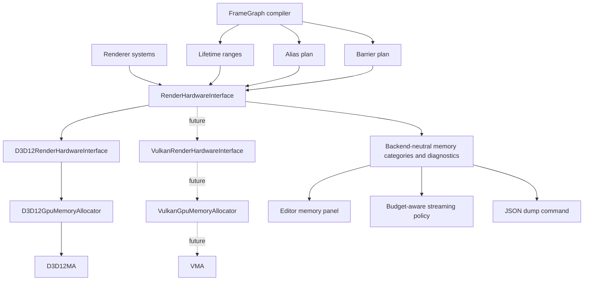
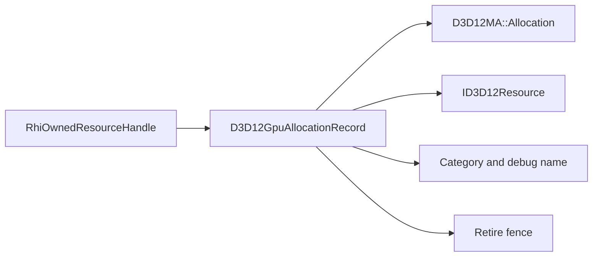
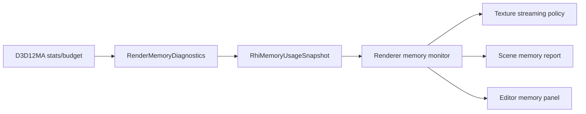
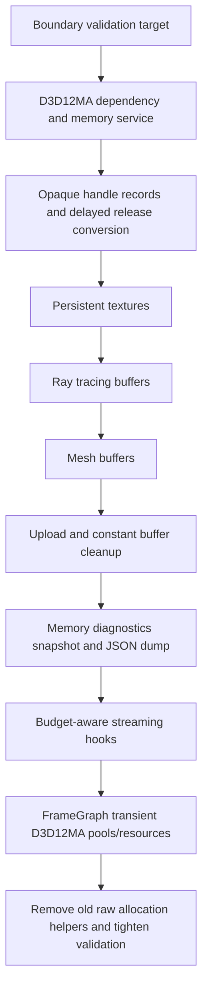

# D3D12MA And VMA-Ready Memory Integration Plan

This plan turns the allocator strategy into an implementation path for SparkleEngine.

Decision answers are locked:

| Question | Answer | Consequence |
| --- | --- | --- |
| Do I want allocator implementation to be a portfolio pillar? | No | Do not build a custom heap allocator as the main work |
| Do I still need to show memory competence? | Yes | Expose budgets, categories, allocation names, memory snapshots, validation gates, and architecture notes |
| Will Vulkan arrive later? | Yes | Keep the public RHI memory model backend-neutral from the first D3D12MA change |
| Do I want defragmentation in this scope? | No | Do not investigate or integrate defrag APIs in this pass |

The target scope is Level 1 through Level 4 from the strategy document:

| Level | Scope | Included? | Sparkle policy |
| --- | --- | --- | --- |
| 1 | D3D12MA for persistent textures, buffers, ray tracing buffers | Yes | Replace raw D3D12 committed-resource allocation paths |
| 2 | Memory diagnostics, budget snapshots, categories, JSON dumps | Yes | Make allocator behavior visible and portfolio-ready |
| 3 | Streaming and budget policy hooks | Yes | Consume memory snapshots in engine policy; allocator only supplies facts |
| 4 | Framegraph transient D3D12MA integration | Yes | Keep Sparkle lifetime/alias/barrier planning; let D3D12MA own heap/pool mechanics |
| 5 | Defragmentation and relocation | No | Explicitly out of scope until a relocation system exists |

## Guiding Principles

1. D3D12MA and future VMA are backend-private allocator engines, not public engine concepts.
2. SparkleRHI exposes neutral memory categories, handles, diagnostics, and allocation intent.
3. Renderer and FrameGraph never include `D3D12MemAlloc.h`, `D3D12MA::`, `vk_mem_alloc.h`, or `Vma*` types.
4. Remove duplicate raw D3D12 resource allocation code once a path is converted. Do not keep old direct allocation helpers beside allocator-backed helpers.
5. Keep code that expresses Sparkle policy: framegraph lifetimes, aliasing decisions, barriers, delayed destruction fences, descriptors, streaming choices, debug presentation.
6. Keep diagnostics quiet by default. Detailed memory logging and JSON export should be opt-in.

## Target Architecture



The integration is not a band-aid around `CreateCommittedResource`. The allocation flow should become:

```text
Renderer/FrameGraph request
    -> RenderHardwareInterface API with neutral desc, category, debug name
        -> D3D12RenderHardwareInterface implementation
            -> D3D12GpuMemoryAllocator
                -> D3D12MA allocation/resource/pool
                    -> opaque RHI handle back to caller
```

Future Vulkan follows the same shape:

```text
Renderer/FrameGraph request
    -> RenderHardwareInterface API with neutral desc, category, debug name
        -> VulkanRenderHardwareInterface implementation
            -> VulkanGpuMemoryAllocator
                -> VMA allocation/buffer/image
                    -> opaque RHI handle back to caller
```

## Ownership Boundaries

| Area | Sparkle owns | D3D12MA owns now | VMA owns later |
| --- | --- | --- | --- |
| Public resource handles | `RhiOwnedResourceHandle`, `RhiOwnedHeapHandle` stay opaque | Private allocation records behind handles | Private allocation records behind handles |
| Persistent resource allocation | Resource intent, category, debug name, lifetime | Heap selection, suballocation, committed/placed decision, resource creation | Memory type selection, suballocation, buffer/image allocation |
| Framegraph transient resources | Logical handles, lifetime ranges, physical block plan, barriers, descriptors | Custom pool/block mechanics and placed/aliasing resource creation where useful | Vulkan memory/pool/image/buffer mechanics where useful |
| Delayed destruction | Fence retire policy and drain timing | Allocation/resource release object | Allocation/resource release object |
| Streaming | Budget response and asset priority | Budget/stat source | Budget/stat source |
| Descriptors | Descriptor heap manager and descriptor lifetime | Not applicable | Not applicable |
| Upload scheduling | Copy timing, command lists, queue policy | Backing upload resources or pools | Backing upload resources or pools |
| Defragmentation | Out of scope | Not used | Not used |

## Public RHI Shape

Add neutral memory concepts under `Engine/RHI/Public`, not under a D3D12 folder.

Suggested files:

```text
Engine/RHI/Public/Memory/RhiMemoryTypes.h
Engine/RHI/Public/Memory/RhiMemoryDiagnostics.h
```

Suggested types:

```text
enum class RhiMemoryCategory
    Texture
    Mesh
    RayTracing
    FrameGraphTransient
    Upload
    Readback
    ConstantBuffer
    Other

enum class RhiMemoryResidencyClass
    DeviceLocal
    HostUpload
    HostReadback
    Transient

struct RhiMemoryCategoryStats
    Category
    AllocationCount
    ResourceCount
    BlockCount
    UsedBytes
    AllocatedBytes
    BudgetBytes

struct RhiMemoryUsageSnapshot
    TotalUsedBytes
    TotalAllocatedBytes
    TotalBudgetBytes
    CategoryStats[]

struct RhiResourceAllocationDesc
    ResourceDesc
    InitialState
    Category
    ResidencyClass
    DebugName
```

Add diagnostics through the existing `RenderDiagnostics` family or a sibling returned by RHI:

```text
class RenderMemoryDiagnostics
    GetLatestMemorySnapshot()
    WriteAllocatorJsonDump(path)
    SupportsBudgetQueries()
    SupportsJsonDump()
```

Rules:

- Public type names must not contain `D3D12`, `D3D12MA`, `Vulkan`, or `VMA` unless they are already in a backend-specific public contract.
- `RhiOwnedResourceHandle::Value` should remain opaque. Its value should point to a backend-owned record, not directly to `ID3D12Resource`, after migration.
- `NativeResourceHandle` can still unwrap the native resource through `GetNativeResource` for descriptor/barrier code that legitimately needs it.

## Private D3D12 Shape

Add a focused private memory service:

```text
Engine/RHI/Private/D3D12/Memory/
    D3D12GpuMemoryAllocator.h/.cpp
    D3D12GpuAllocation.h/.cpp
    D3D12GpuMemoryDiagnostics.h/.cpp
```

Private record model:

```text
D3D12GpuAllocationRecord
    ComPtr<ID3D12Resource> Resource
    D3D12MA::Allocation* Allocation
    D3D12MA::Pool* Pool optional
    RhiMemoryCategory Category
    RhiMemoryResidencyClass ResidencyClass
    std::wstring DebugName
    bool IsMapped
    void* CpuMappedAddress optional

D3D12GpuHeapRecord
    D3D12MA::Allocation* Allocation or D3D12MA::Pool*
    ID3D12Heap* NativeHeap if needed by aliasing path
    RhiMemoryCategory Category
    std::wstring DebugName

PendingD3D12AllocationRelease
    D3D12GpuAllocationRecord* Record
    uint64_t RetireFenceValue
```

The exact ownership wrapper can be `unique_ptr`, `ComPtr` plus allocation release in destructor, or a custom RAII record. The important rule is that resource and allocation retire together after the GPU fence.



## Dependency Integration

Recommended dependency policy:

| Item | Decision |
| --- | --- |
| D3D12MA source | Vendor or fetch a pinned `D3D12MemAlloc.h/.cpp` pair into an RHI-private third-party folder |
| Public includes | Never expose D3D12MA include paths publicly |
| Compile warnings | Suppress warnings only for third-party D3D12MA source, not for SparkleRHI |
| License | Keep MIT notice in a third-party license file if vendored |
| CMake | Add D3D12MA source only to `SparkleRHI` private sources |
| VMA | Do not add until Vulkan backend starts; reserve matching private folder names now |

Possible folder shape:

```text
Engine/RHI/Private/ThirdParty/D3D12MA/
    D3D12MemAlloc.h
    D3D12MemAlloc.cpp

Engine/RHI/Private/ThirdParty/VMA/      future
    vk_mem_alloc.h
```

## Conversion Map

Use this as the removal checklist. Each row is done only when the direct D3D12 allocation is deleted or moved behind `D3D12GpuMemoryAllocator`.

| Current code path | Current duplication | Target replacement | Delete/keep decision |
| --- | --- | --- | --- |
| `D3D12RenderHardwareInterface::CreateVertexBuffer` | Direct upload-heap `CreateCommittedResource` | Allocator-backed upload or default-heap buffer path, category `Mesh` | Delete direct resource creation from RHI method |
| `D3D12RenderHardwareInterface::CreateIndexBuffer` | Direct upload-heap `CreateCommittedResource` | Same as vertex buffer | Delete direct resource creation from RHI method |
| Ray tracing scratch/result/instance buffers | Direct committed resources | `D3D12GpuMemoryAllocator::CreateBuffer` with `RayTracing` category | Delete direct resource creation from RHI method |
| `D3D12Texture::CreateResource` default texture | Direct committed default resource | `D3D12GpuMemoryAllocator::CreateTexture`, category `Texture` | Delete direct resource creation from texture |
| `D3D12Texture::CreateResource` upload resource | Direct committed upload resource | Allocator-backed upload resource or shared upload service | Delete direct resource creation from texture |
| `D3D12UploadBuffer::Upload` | Direct committed upload resource | Allocator-backed upload buffer helper | Delete direct resource creation from upload helper |
| `D3D12ConstantBuffer` | Direct committed upload resource | Prefer existing per-frame allocator or allocator-backed persistent upload resource | Delete direct committed allocation if this path remains used |
| `D3D12LinearAllocator` | Direct committed backing upload buffer, custom bump allocator | Use allocator-backed backing buffer; optionally use D3D12MA virtual allocator only if it reduces code | Keep upload policy only if still needed; delete raw resource creation |
| `CreateOwnedHeap` | Direct `CreateHeap` | D3D12MA pool/allocation-owned heap path for transient blocks | Delete direct heap creation from RHI method |
| `CreatePlacedTextureResource` | Direct `CreatePlacedResource` | D3D12MA aliasing/placed resource path | Delete direct placed resource creation from RHI method |
| `CreatePlacedBufferResource` | Direct `CreatePlacedResource` | D3D12MA aliasing/placed resource path | Delete direct placed resource creation from RHI method |
| Descriptor heap manager | Descriptor allocation, not GPU memory allocation | No D3D12MA replacement | Keep |
| D3D12 device, queues, command allocators, fences | API object creation, not GPU resource memory | No D3D12MA replacement | Keep |
| Swap chain back buffers | Owned by DXGI swap chain | No D3D12MA replacement | Keep |

## Prompt-Ready Phase Plan

Use these phase briefs as future coding prompts. Each phase is scoped so it can be implemented, source-validated, marked done, and reviewed without losing the architectural through-line.

Universal prompt preamble:

```text
We are integrating D3D12MA now in SparkleEngine and keeping the RHI VMA-ready for a later Vulkan backend. Allocator implementation is not the portfolio pillar; memory competence must be shown through clean architecture, diagnostics, categories, budget visibility, and removal of duplicate raw D3D12 allocation code. Keep D3D12MA/VMA backend-private, do not expose allocator types through public RHI/Renderer APIs, do not add defragmentation, and keep diagnostics quiet by default. Prefer replacing legacy paths over compatibility shims once a phase owns a path.
```

Validation to run after every phase unless the phase prompt narrows it further:

```text
cmake -DRHI_MEMORY_BOUNDARY_SOURCE_DIR=. -P CMake/Validation/ValidateRhiMemoryBoundary.cmake
git diff --check
```

Phase completion cadence:

- Mark a phase/stage done after the selected coding changes and source-only validation are complete.
- Do not run builds between resource families or sub-stages.
- Run focused target builds only at explicit checkpoints, at the end of a larger selected coding batch, or when requested.
- If new C++ files are added under `Engine/RHI`, regenerate CMake/build files before the next compile checkpoint because the RHI CMake source list is globbed.

### Phase 0 Prompt: Boundary And Validation Gate

Status: implemented. Use this prompt only to harden or update the gate during later phases.

```text
Implement or update Phase 0 of docs/plans/d3d12ma-vma-memory-integration-plan.md: the RHI memory boundary validation gate.

Goal:
- Make allocator leakage, duplicate raw D3D12 allocation, direct allocator JSON usage, backend-specific public memory naming, and defragmentation scope drift hard to reintroduce.

Required files:
- CMake/Validation/ValidateRhiMemoryBoundary.cmake
- CMake/SparkleValidationTargets.cmake
- docs/plans/d3d12ma-vma-memory-integration-plan.md if the baseline/status changes

Rules:
- Reject D3D12MA::, D3D12MemAlloc, VmaAllocator, VmaAllocation, and vk_mem_alloc in public RHI headers and high-level engine modules.
- Reject public D3D12Memory* and VulkanMemory* type names; public memory contracts must stay backend-neutral.
- Reject BeginDefragmentation, DefragmentationPass, and DEFRAGMENTATION in Sparkle source. Defragmentation is out of scope.
- Reject direct allocator JSON/stat dump calls from Renderer/UI/high-level modules; JSON dump access must go through RenderMemoryDiagnostics.
- Enforce direct D3D12 allocation through a counted legacy baseline. Existing counts may go down as migration progresses, but new CreateCommittedResource/CreateHeap/CreatePlacedResource calls outside Engine/RHI/Private/D3D12/Memory must fail.

Important implementation detail:
- Keep direct allocation baseline entries per file/token, not broad file allowlists. Deleting old calls must pass. Adding new calls must fail.

Validation:
- Run cmake -DRHI_MEMORY_BOUNDARY_SOURCE_DIR=. -P CMake/Validation/ValidateRhiMemoryBoundary.cmake.
- Run git diff --check for the edited validation/doc files.

Done criteria:
- rhi_memory_boundary_check is included in sparkle_validation_check.
- SparkleRHI and high-level engine targets depend on it when SPARKLE_BUILD_VALIDATION_ON_BUILD is enabled.
- The script passes on the current tree while still guarding against new leakage and new raw D3D12 allocation calls.
- The phase can be marked done after coding and source validation; target builds are checkpoint work.
```

Phase 0 protects this target state:

| Guard | Expected outcome |
| --- | --- |
| Allocator public leak check | D3D12MA/VMA stay backend-private |
| Direct allocation counted baseline | Existing debt is visible and cannot grow |
| Defrag scope guard | No defrag investigation sneaks into this pass |
| Backend-neutral naming | Future VMA can share public memory diagnostics |
| JSON boundary | UI/Renderer consume memory diagnostics, not allocator APIs |

### Phase 1 Prompt: D3D12MA Dependency And Allocator Service Bootstrap

Status: implemented. D3D12MA is fetched privately for SparkleRHI at v3.1.0 (`0fa62ed3a0a69b73230a8ec1faa752d4061c8dc8`), and `D3D12GpuMemoryAllocator` owns allocator initialization/shutdown behind the D3D12 backend.

```text
Implement Phase 1 of docs/plans/d3d12ma-vma-memory-integration-plan.md: add D3D12MA privately and create the backend memory service skeleton.

Goal:
- Initialize D3D12MA once as a private D3D12 backend service without migrating resource ownership yet.
- Establish the class/folder shape that later phases will use for all D3D12 GPU memory allocation.
- Keep the public RHI VMA-ready and free of D3D12MA symbols.

Required context to inspect first:
- Engine/RHI/CMakeLists.txt
- Engine/RHI/Private/D3D12/D3D12Rhi.h/.cpp
- Engine/RHI/Private/D3D12/D3D12RenderHardwareInterface.h/.cpp
- Engine/RHI/Public/Device/RenderHardwareInterface.h
- Engine/RHI/Public/Diagnostics/RhiDiagnostics.h
- CMake/Validation/ValidateRhiMemoryBoundary.cmake

Required implementation:
- Add a pinned D3D12MA dependency under an RHI-private third-party folder or equivalent private FetchContent path.
- Add Engine/RHI/Private/D3D12/Memory/D3D12GpuMemoryAllocator.h/.cpp.
- Initialize D3D12MA from the D3D12 device and adapter after D3D12Rhi has created them.
- Inject D3D12GpuMemoryAllocator into D3D12RenderHardwareInterface without using a global singleton.
- Add minimal methods needed for later phases, but do not migrate resource creation yet unless needed to compile the service.
- Keep logs quiet: at most one opt-in startup line behind SPARKLE_RHI_MEMORY_DIAGNOSTICS=1.

Architecture constraints:
- No D3D12MA headers in Engine/RHI/Public, Engine/Renderer, Engine/Application, Engine/GameFramework, or Engine/Editor.
- Do not expose D3D12MA::Allocator or D3D12MA::Allocation in public API or Renderer-facing headers.
- Do not add VMA yet. Reserve naming and public concepts so VMA can mirror the service later.
- Do not add defragmentation APIs or TODO-driven defrag scaffolding.

Validation:
- Run cmake -DRHI_MEMORY_BOUNDARY_SOURCE_DIR=. -P CMake/Validation/ValidateRhiMemoryBoundary.cmake.
- If new Engine/RHI C++ source files were added, note that CMake regeneration is needed before the next compile checkpoint.
- Run git diff --check.

Done criteria:
- D3D12GpuMemoryAllocator owns D3D12MA initialization/shutdown privately.
- Existing renderer/RHI behavior is unchanged.
- Boundary validation passes.
- The phase can be marked done after coding and source validation; no intermediate build is required unless requested.
- The next phase can add allocation records without changing public RHI type names.
```

Phase 1 should leave the tree in this shape:

```text
D3D12Rhi/device/adapter
    -> D3D12GpuMemoryAllocator
        -> D3D12MA::Allocator

D3D12RenderHardwareInterface
    -> receives/owns/accesses D3D12GpuMemoryAllocator as a private backend service
```

### Phase 2 Prompt: Opaque Handle Records And Delayed Release Conversion

Status: implemented. D3D12 owned resource and heap handles now point to private D3D12 allocation/heap records, and delayed release retires resource records after completed GPU fences.

```text
Implement Phase 2 of docs/plans/d3d12ma-vma-memory-integration-plan.md: convert owned RHI handles from raw native pointers to backend-owned allocation records.

Goal:
- Make RhiOwnedResourceHandle and RhiOwnedHeapHandle remain public opaque handles while their D3D12 implementation points to private records, not raw ID3D12Resource*/ID3D12Heap*.
- Prepare resource lifetime so D3D12MA resource+allocation objects retire together after GPU fences.

Required context to inspect first:
- Engine/RHI/Public/Interop/RhiNativeHandles.h
- Engine/RHI/Public/Device/RenderHardwareInterface.h
- Engine/RHI/Public/Diagnostics/RhiDiagnostics.h
- Engine/RHI/Private/D3D12/D3D12RenderHardwareInterface.h/.cpp
- Engine/RHI/Private/D3D12/Diagnostics/D3D12RenderDiagnostics.cpp
- Engine/RHI/Private/D3D12/Memory/D3D12GpuMemoryAllocator.h/.cpp
- docs/plans/d3d12ma-vma-memory-integration-plan.md sections Public RHI Shape and Private D3D12 Shape

Required implementation:
- Add private D3D12 allocation/heap record types under Engine/RHI/Private/D3D12/Memory.
- Change D3D12 owned resource handles so Value points to D3D12GpuAllocationRecord.
- Change D3D12 owned heap handles so Value points to D3D12GpuHeapRecord if heap records are needed before Phase 6.
- Update GetNativeResource to unwrap record->Resource.Get().
- Update GetResourceGpuVirtualAddress to unwrap the record.
- Update RenderObjectDiagnostics::SetDebugName(RhiOwnedResourceHandle) and SetDebugName(RhiOwnedHeapHandle) to use private records.
- Replace PendingOwnedResourceRelease with a pending release that owns/retires allocation records after the completed fence reaches RetireFenceValue.
- Keep old raw resource allocation calls temporarily if needed, but wrap their outputs into the new record model so callers no longer assume raw pointers.

Architecture constraints:
- Do not change RhiOwnedResourceHandle or RhiOwnedHeapHandle public fields unless absolutely required; their Value should remain opaque.
- Do not expose record structs outside D3D12 private implementation.
- Do not introduce shared_ptr ownership cycles or global handle registries unless a simple owning record cannot work.
- Do not add compatibility helpers that allow new code to bypass D3D12GpuMemoryAllocator.

Validation:
- Run rhi_memory_boundary_check directly.
- Run any existing source validation target that touches RHI/Renderer if practical.
- Run git diff --check.

Done criteria:
- Native resource access still works through GetNativeResource.
- Delayed release retires records, not raw ID3D12Resource pointers alone.
- Renderer and FrameGraph callers do not know the handle implementation changed.
- Boundary validation passes with no D3D12MA/VMA public leakage.
- The phase can be marked done after coding and source validation; compile/smoke builds are checkpoint work.
```

Phase 2 is the architectural hinge. Later phases should not migrate broad resources until this handle model is in place.

### Phase 3 Prompt: Persistent Resource Migration To D3D12MA

Status: implemented. Persistent texture, mesh buffer, ray tracing buffer, upload helper, constant buffer, and linear upload backing resources now route through `D3D12GpuMemoryAllocator` with backend-neutral category/residency intent; remaining direct D3D12 allocation baseline covers only deferred transient/readback paths.

```text
Implement Phase 3 of docs/plans/d3d12ma-vma-memory-integration-plan.md: migrate persistent D3D12 resources to D3D12GpuMemoryAllocator/D3D12MA and remove duplicate raw allocation code as each path converts.

Goal:
- Replace persistent resource CreateCommittedResource paths with allocator-backed creation.
- Use backend-neutral memory categories and residency intent so the same public model can map to VMA later.
- Reduce the legacy direct allocation baseline in ValidateRhiMemoryBoundary.cmake as calls are removed.

Required context to inspect first:
- Engine/RHI/Private/D3D12/D3D12RenderHardwareInterface.cpp buffer and ray tracing methods
- Engine/RHI/Private/D3D12/Resources/D3D12Texture.h/.cpp
- Engine/RHI/Private/D3D12/Resources/D3D12UploadBuffer.h/.cpp
- Engine/RHI/Private/D3D12/Resources/D3D12ConstantBuffer.h
- Engine/RHI/Private/D3D12/Resources/D3D12LinearAllocator.h/.cpp
- Engine/RHI/Private/D3D12/Resources/D3D12ConstantBufferManager.cpp
- Engine/Renderer/Private/Meshes/GPUMesh.h and mesh creation call sites
- CMake/Validation/ValidateRhiMemoryBoundary.cmake legacy direct allocation counts

Migration order:
- Runtime textures first: default texture resource and upload resource.
- Ray tracing scratch/result/instance buffers second.
- Mesh vertex/index buffers third. Prefer a real default-heap GPU buffer plus upload/copy path if the current upload-heap static mesh path is being touched deeply enough.
- Standalone upload helper next.
- Constant/persistent upload resources last. Keep the per-frame upload policy only where it is still genuinely useful.

Required implementation:
- Add D3D12GpuMemoryAllocator methods for texture and buffer creation with category, residency, initial state, optimized clear value, and debug name.
- Ensure allocation names and resource object names are set together.
- Ensure mapped upload resources store CPU pointer state in the private record where useful.
- Convert one resource family at a time and delete the direct CreateCommittedResource block from that family once converted.
- Decrease the corresponding counted legacy baseline in ValidateRhiMemoryBoundary.cmake after each deleted raw call.

Architecture constraints:
- Do not leave dual paths such as maybe raw allocation, maybe D3D12MA for the same resource family.
- Do not expose D3D12MA allocation handles through RHI or Renderer.
- Do not change descriptor ownership; descriptors remain in the descriptor heap manager.
- Do not add defragmentation.
- Keep logs quiet by default.

Validation:
- Run rhi_memory_boundary_check after the selected coding batch is complete.
- Run focused runtime/editor smoke only at an explicit checkpoint or when requested.
- Run git diff --check.

Done criteria:
- Converted persistent resource families allocate through D3D12GpuMemoryAllocator.
- The validation legacy baseline is reduced for every removed direct D3D12 allocation call.
- Resource names, GPU virtual addresses, descriptors, and delayed release still work.
- No public D3D12MA/VMA leakage.
- The phase can be marked done after coding and source validation; do not build between converted families.
```

Persistent migration checklist:

| Family | Category | Residency | Expected old code removed |
| --- | --- | --- | --- |
| Runtime texture resource | Texture | DeviceLocal | Texture default `CreateCommittedResource` |
| Texture upload resource | Upload | HostUpload | Texture upload `CreateCommittedResource` |
| Static mesh vertex/index | Mesh | DeviceLocal preferred | RHI buffer upload-heap direct allocation if replaced |
| Ray tracing scratch/result | RayTracing | DeviceLocal | RHI RT direct allocations |
| Ray tracing instance buffer | RayTracing or Upload | HostUpload or DeviceLocal by policy | RHI instance direct allocation |
| Upload helper | Upload | HostUpload | `D3D12UploadBuffer` direct allocation |
| Constant/persistent upload | ConstantBuffer or Upload | HostUpload | Direct committed constant-buffer allocation where still used |

### Phase 4 Prompt: Memory Diagnostics And Portfolio Surface

Status: implemented. `RenderMemoryDiagnostics` now exposes backend-neutral memory snapshots and explicit allocator JSON dump export through `RenderDiagnostics`; the D3D12 backend populates category/residency rows, allocation names, budgets, allocation counts, and block counts from D3D12MA plus Sparkle allocation records.

```text
Implement Phase 4 of docs/plans/d3d12ma-vma-memory-integration-plan.md: add backend-neutral memory diagnostics backed by D3D12MA.

Goal:
- Show memory competence through useful diagnostics: categories, budgets, allocation counts, block counts, names, and on-demand JSON dumps.
- Keep the public diagnostics shape VMA-ready.
- Keep diagnostics silent/noise-free by default.

Required context to inspect first:
- Engine/RHI/Public/Diagnostics/RhiDiagnostics.h
- Engine/RHI/Public/Device/RenderHardwareInterface.h
- Engine/RHI/Private/D3D12/Diagnostics/D3D12RenderDiagnostics.cpp
- Engine/RHI/Private/D3D12/Memory/D3D12GpuMemoryAllocator.h/.cpp
- Existing editor diagnostics panels under Engine/Editor/Private/Panels if adding UI in this phase
- docs/plans/d3d12ma-vma-memory-integration-plan.md Public RHI Shape and VMA-Ready Contract

Required implementation:
- Add backend-neutral public memory diagnostics types, for example RhiMemoryCategory, RhiMemoryResidencyClass, RhiMemoryCategoryStats, RhiMemoryUsageSnapshot, and RenderMemoryDiagnostics.
- Wire RenderMemoryDiagnostics through RenderDiagnostics or another RHI-owned diagnostics surface without D3D12 naming.
- Populate D3D12 memory snapshots from D3D12MA stats/budget APIs and Sparkle allocation records.
- Add on-demand D3D12MA JSON dump export through RenderMemoryDiagnostics only.
- Add allocation category names and debug names to snapshots.
- Add optional editor/log presentation only if it can stay quiet by default.

Noise policy:
- No per-allocation logs by default.
- No JSON dump by default.
- No warning for normal allocation churn.
- Use SPARKLE_RHI_MEMORY_DIAGNOSTICS=1 for summaries.
- Use SPARKLE_RHI_MEMORY_JSON_DUMP=path for explicit dump export.

Architecture constraints:
- Public diagnostics types must not contain D3D12, D3D12MA, Vulkan, or VMA names.
- Renderer/UI must call RenderMemoryDiagnostics, not D3D12MA.
- Do not introduce streaming policy here beyond exposing data needed by Phase 5.
- Do not add defragmentation diagnostics or controls.

Validation:
- Run rhi_memory_boundary_check.
- Run a smoke path that queries memory diagnostics only at an explicit checkpoint or when requested.
- Run git diff --check.

Done criteria:
- A caller can get a RhiMemoryUsageSnapshot without knowing the backend.
- D3D12MA JSON dump is available on demand through RenderMemoryDiagnostics.
- Allocation categories and names are visible in diagnostics.
- No diagnostics spam appears without opt-in flags.
- The phase can be marked done after coding and source validation; target builds are separate checkpoint work.
```

Diagnostics output contract:

| Field | Meaning | Later VMA mapping |
| --- | --- | --- |
| Category | Sparkle-owned resource class | Same enum |
| ResidencyClass | DeviceLocal/HostUpload/HostReadback/Transient | Vulkan memory type intent |
| UsedBytes | Bytes actively used by allocations/resources | VMA allocation stats |
| AllocatedBytes | Heap/block bytes reserved by allocator | VMA block stats |
| BudgetBytes | API/allocator budget if available | VMA budget extension/stats |
| AllocationCount | Number of allocator allocations | VMA allocation count |
| BlockCount | Number of backing blocks/heaps | VMA block count |

### Phase 5 Prompt: Budget-Aware Streaming Hooks

Status: implemented. Renderer now polls `RenderMemoryDiagnostics` on a fixed frame cadence through `RendererMemoryMonitor`, classifies category pressure, exposes a backend-neutral memory diagnostics snapshot, provides texture streaming pressure decisions, and makes scene/model memory reports plus largest named allocations available through Renderer and the editor diagnostics provider seam.

```text
Implement Phase 5 of docs/plans/d3d12ma-vma-memory-integration-plan.md: consume memory diagnostics in renderer/asset policy hooks without making D3D12MA own streaming decisions.

Goal:
- Use allocator facts to inform Sparkle-owned streaming and memory pressure decisions.
- Add the policy seam for texture/scene memory pressure while keeping actual asset choice in Renderer/Asset systems.

Required context to inspect first:
- Engine/RHI/Public memory diagnostics types from Phase 4
- Texture manager/runtime texture diagnostics paths
- Engine/Renderer resource ownership and scene/level load paths
- Editor panels that could display memory snapshots
- docs/plans/material-default-fallback-ownership or texture pipeline notes if relevant

Required implementation:
- Add a renderer-side memory snapshot consumer that polls RHI at a controlled cadence, not every allocation.
- Add memory pressure classification per category, for example Normal, Watch, Pressure, Critical.
- Add a texture streaming policy stub that consumes category pressure and can later choose mip promotion/demotion.
- Add scene/model memory report hooks using allocation categories and debug names.
- Keep policy backend-neutral so VMA can feed the same data later.

Architecture constraints:
- D3D12MA reports budget/stat facts only; it does not decide which textures, mips, meshes, or scene assets matter.
- Do not add direct D3D12MA/VMA calls in Renderer or Editor.
- Do not add noisy logs or per-frame large dumps.
- Do not implement defragmentation or relocation.

Validation:
- Run rhi_memory_boundary_check.
- Run focused editor/runtime smoke for memory snapshot display only at an explicit checkpoint or when requested.
- Run git diff --check.

Done criteria:
- Renderer/Editor can consume RhiMemoryUsageSnapshot through a backend-neutral path.
- Texture streaming has a clear memory-pressure input seam even if detailed mip policy is still minimal.
- No allocator implementation types leak outside RHI private backend code.
- The phase can be marked done after coding and source validation; target builds are separate checkpoint work.
```

Budget policy should follow this flow:



### Phase 6 Prompt: FrameGraph Transient D3D12MA Integration

Status: implemented. FrameGraph transient heap blocks now route through `D3D12GpuMemoryAllocator::CreateTransientHeap`, transient resources are created with D3D12MA aliasing resources at FrameGraph-planned offsets, descriptor creation remains in `FrameGraphTransientAllocator`, heap releases are fence-delayed with owned resources, and memory snapshots report live transient blocks as `RhiMemoryCategory::FrameGraphTransient`.

```text
Implement Phase 6 of docs/plans/d3d12ma-vma-memory-integration-plan.md: route FrameGraph transient heap/resource mechanics through D3D12GpuMemoryAllocator while preserving Sparkle framegraph policy.

Goal:
- Use D3D12MA for transient heap/pool/resource mechanics where it reduces maintained D3D12 code.
- Keep FrameGraphCompiler as the owner of lifetimes, physical block planning, aliasing decisions, and barrier planning.
- Remove raw CreateHeap/CreatePlacedResource from normal transient resource creation once converted.

Required context to inspect first:
- Engine/Renderer/Private/FrameGraph/Resources/FrameGraphTransientAllocator.h/.cpp
- Engine/Renderer/Private/FrameGraph/Resources/FrameGraphTransientPlanning.cpp
- Engine/Renderer/Private/FrameGraph/Compiler/FrameGraphPlan.h and resource lifetime/physical allocation structs
- Engine/RHI/Public/Device/RenderHardwareInterface.h transient allocation APIs
- Engine/RHI/Private/D3D12/D3D12RenderHardwareInterface.cpp CreateOwnedHeap/CreatePlacedTextureResource/CreatePlacedBufferResource
- Engine/RHI/Private/D3D12/Memory/D3D12GpuMemoryAllocator.h/.cpp
- CMake/Validation/ValidateRhiMemoryBoundary.cmake legacy direct allocation counts

Required implementation:
- Add allocator service APIs for transient blocks/pools and placed/aliased transient resources.
- Preserve RenderHardwareInterface transient API names if they remain good backend-neutral contracts; change internals, not Renderer policy.
- Convert CreateOwnedHeap/CreatePlacedTextureResource/CreatePlacedBufferResource to call D3D12GpuMemoryAllocator.
- Keep descriptor creation in FrameGraphTransientAllocator.
- Keep framegraph lifetime, physical block, offset, and barrier planning in Renderer unless the selected D3D12MA API cannot honor exact planned offsets cleanly.
- If exact planned offsets do not map cleanly, use D3D12MA virtual allocation/pool support only to replace packing mechanics while preserving Sparkle lifetime inputs and diagnostics.
- Decrease the direct allocation baseline for CreateHeap/CreatePlacedResource when raw calls are removed.

Architecture constraints:
- Do not delete FrameGraphCompiler lifetime analysis.
- Do not let D3D12MA decide pass ordering, barriers, descriptor lifetime, or resource usage states.
- Do not expose D3D12MA/VMA types to Renderer or public RHI.
- Do not add defragmentation.
- Do not regress carried transient resource state tracking across frames.

Validation:
- Run rhi_memory_boundary_check.
- Run existing FrameGraph boundary validation.
- Run renderer/framegraph smoke only at an explicit checkpoint or when requested.
- Run git diff --check.

Done criteria:
- Normal transient resource creation no longer directly calls CreateHeap/CreatePlacedResource outside the D3D12 memory service.
- FrameGraph still owns lifetime ranges, aliasing plan, physical resource intent, barriers, descriptors, and carried runtime state.
- D3D12MA-backed transient allocations show up under RhiMemoryCategory::FrameGraphTransient.
- Boundary validation passes and the direct allocation baseline is reduced.
- The phase can be marked done after coding and source validation; target builds are separate checkpoint work.
```

FrameGraph ownership must remain split like this:

| Concern | Owner after Phase 6 |
| --- | --- |
| Pass dependencies | FrameGraph compiler |
| Resource lifetime ranges | FrameGraph compiler |
| Physical block/aliasing intent | FrameGraph compiler |
| Resource barriers and states | FrameGraph execution/plan |
| Descriptor allocation/views | FrameGraphTransientAllocator + RHI descriptor APIs |
| D3D12 heap/pool/resource mechanics | D3D12GpuMemoryAllocator + D3D12MA |
| Memory diagnostics category | RHI memory diagnostics as FrameGraphTransient |

## VMA-Ready Contract

Design every new public concept so this table can be implemented later without renaming public APIs.

| Public concept | D3D12MA implementation now | VMA implementation later |
| --- | --- | --- |
| `RhiMemoryCategory::Texture` | D3D12 texture resource allocation | `VkImage` + `VmaAllocation` |
| `RhiMemoryCategory::Mesh` | D3D12 buffer allocation | `VkBuffer` + `VmaAllocation` |
| `RhiMemoryCategory::RayTracing` | D3D12 UAV/AS buffers | Vulkan ray tracing buffers and AS storage |
| `RhiMemoryCategory::FrameGraphTransient` | D3D12MA pools/aliasing resources | VMA pools/images/buffers for transient graph resources |
| `RhiMemoryResidencyClass::DeviceLocal` | DEFAULT heap | Device-local memory type |
| `RhiMemoryResidencyClass::HostUpload` | UPLOAD heap | Host-visible upload memory type |
| `RhiMemoryResidencyClass::HostReadback` | READBACK heap | Host-visible readback memory type |
| `RenderMemoryDiagnostics::GetLatestMemorySnapshot` | D3D12MA stats/budgets | VMA stats/budgets |
| `RenderMemoryDiagnostics::WriteAllocatorJsonDump` | D3D12MA JSON dump | VMA JSON dump |

Do not add a public abstraction for defragmentation now. VMA and D3D12MA both support it, but Sparkle does not yet have the relocation policy needed to use it responsibly.

## Direct Allocation Ban List

After conversion, these calls should not appear in normal resource creation files:

```text
ID3D12Device::CreateCommittedResource
ID3D12Device::CreateHeap
ID3D12Device::CreatePlacedResource
```

Allowed locations should be explicit:

```text
Engine/RHI/Private/D3D12/Memory/D3D12GpuMemoryAllocator.cpp
Engine/RHI/Private/D3D12/Memory/D3D12GpuMemoryDiagnostics.cpp if a diagnostic scratch/readback exception is justified
```

Everything else should call the memory service.

## Non-Goals

| Non-goal | Reason |
| --- | --- |
| Custom GPU heap allocator | Not the portfolio pillar |
| D3D12MA/VMA in public headers | Breaks backend abstraction and future Vulkan shape |
| Defragmentation | Out of scope and requires relocation policy |
| Descriptor heap replacement | D3D12MA/VMA do not solve descriptor management |
| Removing framegraph compiler lifetime planning | That is Sparkle-owned architecture |
| Per-allocation logging by default | Too noisy for production-style integration |
| Vulkan backend implementation in this pass | Prepare the seam now; implement VMA when Vulkan starts |

## Done Criteria

The integration is complete for this scope when:

1. Public RHI and Renderer contain no D3D12MA/VMA symbols.
2. Persistent textures, mesh buffers, ray tracing buffers, upload helpers, and constant/persistent upload resources no longer call raw D3D12 resource allocation directly.
3. FrameGraph transient heap/resource creation goes through the D3D12 memory service while FrameGraph still owns lifetimes, aliasing, barriers, and descriptors.
4. Delayed release retires allocation records after fences, not raw resources alone.
5. Memory snapshots report budget, used bytes, allocation count, block count, and category rows.
6. JSON dump is available on demand and silent by default.
7. A source validation target prevents D3D12MA/VMA leakage and direct allocation bypasses.
8. Defragmentation APIs are not used.
9. The implementation note can explain how the same RHI memory categories map to VMA later.

## Recommended Implementation Order



This order gives a clean systems conversion: establish the boundary first, migrate handles before broad resource work, convert resource families one at a time, then remove duplicate raw D3D12 allocation code and lock the architecture with validation.
