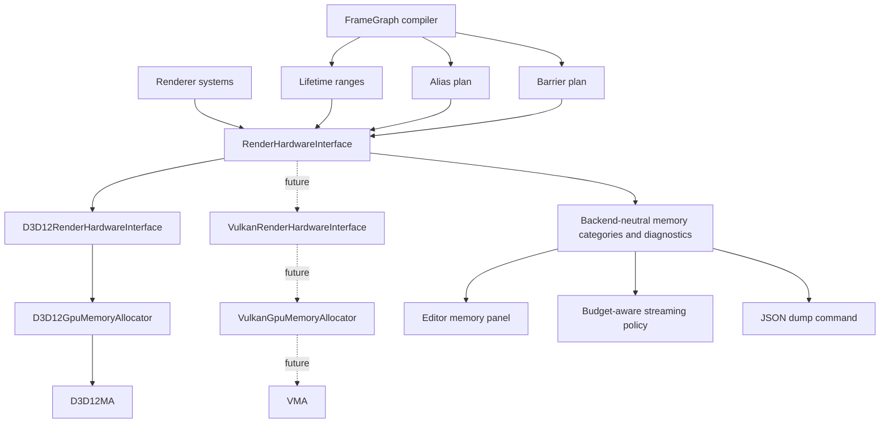
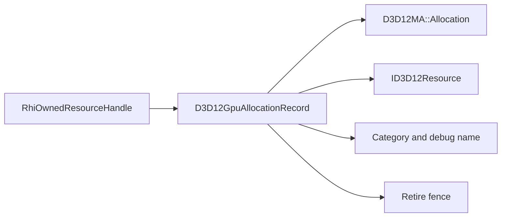
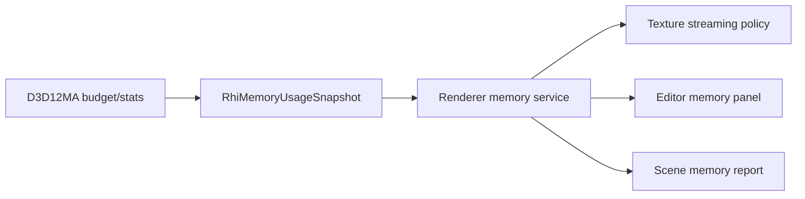
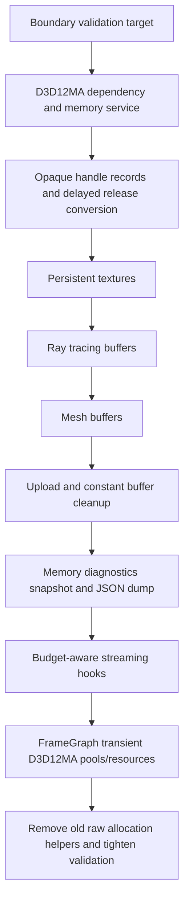

# D3D12MA And VMA-Ready Memory Integration Plan

This plan turns the allocator strategy into an implementation path for SparkleEngine.

Decision answers are locked:

| Question | Answer | Consequence |
| --- | --- | --- |
| Do I want allocator implementation to be a portfolio pillar? | No | Do not build a custom heap allocator as the main work |
| Do I still need to show memory competence? | Yes | Expose budgets, categories, allocation names, memory snapshots, validation gates, and architecture notes |
| Will Vulkan arrive later? | Yes | Keep the public RHI memory model backend-neutral from the first D3D12MA change |
| Do I want defragmentation in this scope? | No | Do not investigate or integrate defrag APIs in this pass |

The target scope is Level 1 through Level 4 from the strategy document:

| Level | Scope | Included? | Sparkle policy |
| --- | --- | --- | --- |
| 1 | D3D12MA for persistent textures, buffers, ray tracing buffers | Yes | Replace raw D3D12 committed-resource allocation paths |
| 2 | Memory diagnostics, budget snapshots, categories, JSON dumps | Yes | Make allocator behavior visible and portfolio-ready |
| 3 | Streaming and budget policy hooks | Yes | Consume memory snapshots in engine policy; allocator only supplies facts |
| 4 | Framegraph transient D3D12MA integration | Yes | Keep Sparkle lifetime/alias/barrier planning; let D3D12MA own heap/pool mechanics |
| 5 | Defragmentation and relocation | No | Explicitly out of scope until a relocation system exists |

## Guiding Principles

1. D3D12MA and future VMA are backend-private allocator engines, not public engine concepts.
2. SparkleRHI exposes neutral memory categories, handles, diagnostics, and allocation intent.
3. Renderer and FrameGraph never include `D3D12MemAlloc.h`, `D3D12MA::`, `vk_mem_alloc.h`, or `Vma*` types.
4. Remove duplicate raw D3D12 resource allocation code once a path is converted. Do not keep old direct allocation helpers beside allocator-backed helpers.
5. Keep code that expresses Sparkle policy: framegraph lifetimes, aliasing decisions, barriers, delayed destruction fences, descriptors, streaming choices, debug presentation.
6. Keep diagnostics quiet by default. Detailed memory logging and JSON export should be opt-in.

## Target Architecture



The integration is not a band-aid around `CreateCommittedResource`. The allocation flow should become:

```text
Renderer/FrameGraph request
    -> RenderHardwareInterface API with neutral desc, category, debug name
        -> D3D12RenderHardwareInterface implementation
            -> D3D12GpuMemoryAllocator
                -> D3D12MA allocation/resource/pool
                    -> opaque RHI handle back to caller
```

Future Vulkan follows the same shape:

```text
Renderer/FrameGraph request
    -> RenderHardwareInterface API with neutral desc, category, debug name
        -> VulkanRenderHardwareInterface implementation
            -> VulkanGpuMemoryAllocator
                -> VMA allocation/buffer/image
                    -> opaque RHI handle back to caller
```

## Ownership Boundaries

| Area | Sparkle owns | D3D12MA owns now | VMA owns later |
| --- | --- | --- | --- |
| Public resource handles | `RhiOwnedResourceHandle`, `RhiOwnedHeapHandle` stay opaque | Private allocation records behind handles | Private allocation records behind handles |
| Persistent resource allocation | Resource intent, category, debug name, lifetime | Heap selection, suballocation, committed/placed decision, resource creation | Memory type selection, suballocation, buffer/image allocation |
| Framegraph transient resources | Logical handles, lifetime ranges, physical block plan, barriers, descriptors | Custom pool/block mechanics and placed/aliasing resource creation where useful | Vulkan memory/pool/image/buffer mechanics where useful |
| Delayed destruction | Fence retire policy and drain timing | Allocation/resource release object | Allocation/resource release object |
| Streaming | Budget response and asset priority | Budget/stat source | Budget/stat source |
| Descriptors | Descriptor heap manager and descriptor lifetime | Not applicable | Not applicable |
| Upload scheduling | Copy timing, command lists, queue policy | Backing upload resources or pools | Backing upload resources or pools |
| Defragmentation | Out of scope | Not used | Not used |

## Public RHI Shape

Add neutral memory concepts under `Engine/RHI/Public`, not under a D3D12 folder.

Suggested files:

```text
Engine/RHI/Public/Memory/RhiMemoryTypes.h
Engine/RHI/Public/Memory/RhiMemoryDiagnostics.h
```

Suggested types:

```text
enum class RhiMemoryCategory
    Texture
    Mesh
    RayTracing
    FrameGraphTransient
    Upload
    Readback
    ConstantBuffer
    Other

enum class RhiMemoryResidencyClass
    DeviceLocal
    HostUpload
    HostReadback
    Transient

struct RhiMemoryCategoryStats
    Category
    AllocationCount
    ResourceCount
    BlockCount
    UsedBytes
    AllocatedBytes
    BudgetBytes

struct RhiMemoryUsageSnapshot
    TotalUsedBytes
    TotalAllocatedBytes
    TotalBudgetBytes
    CategoryStats[]

struct RhiResourceAllocationDesc
    ResourceDesc
    InitialState
    Category
    ResidencyClass
    DebugName
```

Add diagnostics through the existing `RenderDiagnostics` family or a sibling returned by RHI:

```text
class RenderMemoryDiagnostics
    GetLatestMemorySnapshot()
    WriteAllocatorJsonDump(path)
    SupportsBudgetQueries()
    SupportsJsonDump()
```

Rules:

- Public type names must not contain `D3D12`, `D3D12MA`, `Vulkan`, or `VMA` unless they are already in a backend-specific public contract.
- `RhiOwnedResourceHandle::Value` should remain opaque. Its value should point to a backend-owned record, not directly to `ID3D12Resource`, after migration.
- `NativeResourceHandle` can still unwrap the native resource through `GetNativeResource` for descriptor/barrier code that legitimately needs it.

## Private D3D12 Shape

Add a focused private memory service:

```text
Engine/RHI/Private/D3D12/Memory/
    D3D12GpuMemoryAllocator.h/.cpp
    D3D12GpuAllocation.h/.cpp
    D3D12GpuMemoryDiagnostics.h/.cpp
```

Private record model:

```text
D3D12GpuAllocationRecord
    ComPtr<ID3D12Resource> Resource
    D3D12MA::Allocation* Allocation
    D3D12MA::Pool* Pool optional
    RhiMemoryCategory Category
    RhiMemoryResidencyClass ResidencyClass
    std::wstring DebugName
    bool IsMapped
    void* CpuMappedAddress optional

D3D12GpuHeapRecord
    D3D12MA::Allocation* Allocation or D3D12MA::Pool*
    ID3D12Heap* NativeHeap if needed by aliasing path
    RhiMemoryCategory Category
    std::wstring DebugName

PendingD3D12AllocationRelease
    D3D12GpuAllocationRecord* Record
    uint64_t RetireFenceValue
```

The exact ownership wrapper can be `unique_ptr`, `ComPtr` plus allocation release in destructor, or a custom RAII record. The important rule is that resource and allocation retire together after the GPU fence.



## Dependency Integration

Recommended dependency policy:

| Item | Decision |
| --- | --- |
| D3D12MA source | Vendor or fetch a pinned `D3D12MemAlloc.h/.cpp` pair into an RHI-private third-party folder |
| Public includes | Never expose D3D12MA include paths publicly |
| Compile warnings | Suppress warnings only for third-party D3D12MA source, not for SparkleRHI |
| License | Keep MIT notice in a third-party license file if vendored |
| CMake | Add D3D12MA source only to `SparkleRHI` private sources |
| VMA | Do not add until Vulkan backend starts; reserve matching private folder names now |

Possible folder shape:

```text
Engine/RHI/Private/ThirdParty/D3D12MA/
    D3D12MemAlloc.h
    D3D12MemAlloc.cpp

Engine/RHI/Private/ThirdParty/VMA/      future
    vk_mem_alloc.h
```

## Conversion Map

Use this as the removal checklist. Each row is done only when the direct D3D12 allocation is deleted or moved behind `D3D12GpuMemoryAllocator`.

| Current code path | Current duplication | Target replacement | Delete/keep decision |
| --- | --- | --- | --- |
| `D3D12RenderHardwareInterface::CreateVertexBuffer` | Direct upload-heap `CreateCommittedResource` | Allocator-backed upload or default-heap buffer path, category `Mesh` | Delete direct resource creation from RHI method |
| `D3D12RenderHardwareInterface::CreateIndexBuffer` | Direct upload-heap `CreateCommittedResource` | Same as vertex buffer | Delete direct resource creation from RHI method |
| Ray tracing scratch/result/instance buffers | Direct committed resources | `D3D12GpuMemoryAllocator::CreateBuffer` with `RayTracing` category | Delete direct resource creation from RHI method |
| `D3D12Texture::CreateResource` default texture | Direct committed default resource | `D3D12GpuMemoryAllocator::CreateTexture`, category `Texture` | Delete direct resource creation from texture |
| `D3D12Texture::CreateResource` upload resource | Direct committed upload resource | Allocator-backed upload resource or shared upload service | Delete direct resource creation from texture |
| `D3D12UploadBuffer::Upload` | Direct committed upload resource | Allocator-backed upload buffer helper | Delete direct resource creation from upload helper |
| `D3D12ConstantBuffer` | Direct committed upload resource | Prefer existing per-frame allocator or allocator-backed persistent upload resource | Delete direct committed allocation if this path remains used |
| `D3D12LinearAllocator` | Direct committed backing upload buffer, custom bump allocator | Use allocator-backed backing buffer; optionally use D3D12MA virtual allocator only if it reduces code | Keep upload policy only if still needed; delete raw resource creation |
| `CreateOwnedHeap` | Direct `CreateHeap` | D3D12MA pool/allocation-owned heap path for transient blocks | Delete direct heap creation from RHI method |
| `CreatePlacedTextureResource` | Direct `CreatePlacedResource` | D3D12MA aliasing/placed resource path | Delete direct placed resource creation from RHI method |
| `CreatePlacedBufferResource` | Direct `CreatePlacedResource` | D3D12MA aliasing/placed resource path | Delete direct placed resource creation from RHI method |
| Descriptor heap manager | Descriptor allocation, not GPU memory allocation | No D3D12MA replacement | Keep |
| D3D12 device, queues, command allocators, fences | API object creation, not GPU resource memory | No D3D12MA replacement | Keep |
| Swap chain back buffers | Owned by DXGI swap chain | No D3D12MA replacement | Keep |

## Phase Plan

### Phase 0: Boundary And Validation First

Goal: make leakage and duplicate allocation hard to reintroduce.

Add a source validation script/target before broad migration:

```text
CMake/Validation/ValidateRhiMemoryBoundary.cmake
rhi_memory_boundary_check
```

Checks:

| Check | Rule |
| --- | --- |
| Public header leak | Reject `D3D12MA::`, `D3D12MemAlloc`, `VmaAllocator`, `VmaAllocation`, `vk_mem_alloc` under `Engine/RHI/Public`, `Engine/Renderer`, `Engine/GameFramework`, `Engine/Application`, and `Engine/Editor` public headers |
| Direct allocation bypass | Reject `CreateCommittedResource`, `CreateHeap`, and `CreatePlacedResource` outside approved D3D12 memory service files and explicit exception files |
| Defrag scope guard | Reject `BeginDefragmentation`, `DefragmentationPass`, and `DEFRAGMENTATION` symbols in Sparkle code for this phase |
| Backend-neutral naming | Reject public `D3D12Memory*` or `VulkanMemory*` diagnostics types |
| JSON dump boundary | JSON dump command must go through `RenderMemoryDiagnostics`, not D3D12MA directly from UI/Renderer |

Approved direct-allocation exceptions should be narrow and documented. Examples: command allocators, descriptor heaps, fences, query heaps, swap chain creation, and any debug readback path that you intentionally leave outside allocator scope.

### Phase 1: Allocator Service Bootstrap

Goal: D3D12MA initializes once as a D3D12 backend service.

Tasks:

1. Add the pinned D3D12MA dependency privately to `SparkleRHI`.
2. Add `D3D12GpuMemoryAllocator` and initialize it after `D3D12Rhi` creates device and adapter.
3. Inject the allocator into `D3D12RenderHardwareInterface`, `TextureFactory`, `D3D12Texture`, upload helpers, and any D3D12 resource factory that creates owned resources.
4. Add no-op/empty memory diagnostics plumbing so public API shape is present before data is rich.
5. Keep startup logs to one info line at most, or hide behind `SPARKLE_RHI_MEMORY_DIAGNOSTICS=1`.

Production pattern:

```text
D3D12Rhi owns native device/adapter/queue/fence.
D3D12RenderHardwareInterface owns renderer-facing services.
D3D12GpuMemoryAllocator is injected into resource creation paths.
No global singleton. No renderer-level D3D12MA access.
```

### Phase 2: Handle Model Conversion

Goal: make `RhiOwnedResourceHandle` and `RhiOwnedHeapHandle` point to backend records, not raw native objects.

Tasks:

1. Introduce `D3D12GpuAllocationRecord` and `D3D12GpuHeapRecord` private types.
2. Change `GetNativeResource(RhiOwnedResourceHandle)` to unwrap `record->Resource.Get()`.
3. Change `GetResourceGpuVirtualAddress` to unwrap the record.
4. Change `RenderObjectDiagnostics::SetDebugName(RhiOwnedResourceHandle)` implementation to update the record resource and allocation name.
5. Replace `PendingOwnedResourceRelease` with `PendingD3D12AllocationRelease` that retires the record after fence completion.
6. Add debug assertions for invalid handle kind where practical.

This is the most important architectural step. Without it, D3D12MA integration becomes a band-aid because the public handle still assumes raw D3D12 resource ownership.

### Phase 3: Persistent Resource Migration

Goal: all persistent resources that D3D12MA can own should go through the allocator service.

Migration order:

| Order | Resource family | Reason |
| --- | --- | --- |
| 1 | Runtime textures | High memory impact and easy portfolio diagnostics |
| 2 | Ray tracing scratch/result/instance buffers | Large allocations with obvious scene cost |
| 3 | Mesh vertex/index buffers | Needed for real content scale; consider default-heap buffers plus upload copy |
| 4 | Standalone upload buffers | Removes repeated upload committed-resource code |
| 5 | Constant/persistent upload buffers | Consolidates remaining direct resource creation |

Do not keep old helper code after each migration. The desired state is not:

```text
CreateVertexBuffer -> maybe D3D12MA, maybe raw CreateCommittedResource
```

The desired state is:

```text
CreateVertexBuffer -> D3D12GpuMemoryAllocator::CreateBuffer -> D3D12MA
```

### Phase 4: Diagnostics And Portfolio Surface

Goal: prove memory competence through visible, useful tooling.

Deliverables:

| Deliverable | Default behavior | Opt-in behavior |
| --- | --- | --- |
| Memory categories | Always tag allocations internally | Show by category in editor panel/log dump |
| Budget snapshot | Cheap cached query | Detailed allocator stat walk only on demand |
| JSON dump | No dump by default | Command/env var writes D3D12MA JSON dump |
| Allocation names | Always set names | Names visible in PIX/DRED/live-object reports |
| Memory warnings | Only warn when meaningful thresholds are crossed | Verbose allocation list behind diagnostics flag |

Suggested environment flags:

```text
SPARKLE_RHI_MEMORY_DIAGNOSTICS=1
SPARKLE_RHI_MEMORY_DIAGNOSTICS_FILTER=Texture|Mesh|RayTracing|FrameGraphTransient
SPARKLE_RHI_MEMORY_JSON_DUMP=path/to/dump.json
```

Noise rules:

- No per-allocation log spam by default.
- No large JSON dump unless explicitly requested.
- No warnings for normal allocation churn.
- Summary logs should include budget, used bytes, allocation count, block count, and top categories only.

### Phase 5: Budget-Aware Streaming Hooks

Goal: wire allocator facts into engine policy without making the allocator own streaming decisions.

Tasks:

1. Add `RhiMemoryUsageSnapshot` polling at a controlled cadence.
2. Expose per-category budget pressure to Renderer/Asset systems.
3. Add a texture streaming policy stub that can react to memory pressure later.
4. Add scene/model memory snapshots using allocation categories and debug names.
5. Keep policy outside D3D12MA: the allocator reports pressure, Sparkle decides which mips/assets matter.



### Phase 6: FrameGraph Transient Integration

Goal: use D3D12MA for transient heap/pool mechanics while preserving Sparkle's framegraph compiler as the owner of lifetimes, aliasing, and barriers.

Current Sparkle ownership to keep:

| Keep | Why |
| --- | --- |
| `FrameGraphCompiler` lifetime analysis | This is engine architecture, not allocator boilerplate |
| Physical block assignment decisions | This expresses aliasing policy |
| Barrier plan | Allocator does not know pass/resource state transitions |
| Descriptor creation in `FrameGraphTransientAllocator` | D3D12MA/VMA do not manage descriptors |

Allocator mechanics to replace:

| Replace | Target |
| --- | --- |
| Raw `CreateHeap` in `CreateOwnedHeap` | D3D12MA pool/allocation-backed transient block |
| Raw `CreatePlacedResource` for transient textures/buffers | D3D12MA aliasing/placed resource creation path |
| Manual D3D12 heap ownership in public-ish handle | Private transient heap/allocation record |

Recommended pattern:

1. Keep the current framegraph compile plan and physical block plan.
2. For each physical block, ask `D3D12GpuMemoryAllocator` for a transient block/pool in category `FrameGraphTransient`.
3. For each planned resource, ask the allocator to create an aliased/placed resource using the planned offset if supported cleanly by the selected D3D12MA version.
4. If exact planned offsets do not map cleanly to the D3D12MA API, use D3D12MA virtual allocation/pool support to replace Sparkle's physical offset packing while preserving Sparkle lifetime inputs.
5. Do not add defragmentation.

The goal is not to delete framegraph intelligence. The goal is to delete duplicated D3D12 heap/resource mechanics.

## VMA-Ready Contract

Design every new public concept so this table can be implemented later without renaming public APIs.

| Public concept | D3D12MA implementation now | VMA implementation later |
| --- | --- | --- |
| `RhiMemoryCategory::Texture` | D3D12 texture resource allocation | `VkImage` + `VmaAllocation` |
| `RhiMemoryCategory::Mesh` | D3D12 buffer allocation | `VkBuffer` + `VmaAllocation` |
| `RhiMemoryCategory::RayTracing` | D3D12 UAV/AS buffers | Vulkan ray tracing buffers and AS storage |
| `RhiMemoryCategory::FrameGraphTransient` | D3D12MA pools/aliasing resources | VMA pools/images/buffers for transient graph resources |
| `RhiMemoryResidencyClass::DeviceLocal` | DEFAULT heap | Device-local memory type |
| `RhiMemoryResidencyClass::HostUpload` | UPLOAD heap | Host-visible upload memory type |
| `RhiMemoryResidencyClass::HostReadback` | READBACK heap | Host-visible readback memory type |
| `RenderMemoryDiagnostics::GetLatestMemorySnapshot` | D3D12MA stats/budgets | VMA stats/budgets |
| `RenderMemoryDiagnostics::WriteAllocatorJsonDump` | D3D12MA JSON dump | VMA JSON dump |

Do not add a public abstraction for defragmentation now. VMA and D3D12MA both support it, but Sparkle does not yet have the relocation policy needed to use it responsibly.

## Direct Allocation Ban List

After conversion, these calls should not appear in normal resource creation files:

```text
ID3D12Device::CreateCommittedResource
ID3D12Device::CreateHeap
ID3D12Device::CreatePlacedResource
```

Allowed locations should be explicit:

```text
Engine/RHI/Private/D3D12/Memory/D3D12GpuMemoryAllocator.cpp
Engine/RHI/Private/D3D12/Memory/D3D12GpuMemoryDiagnostics.cpp if a diagnostic scratch/readback exception is justified
```

Everything else should call the memory service.

## Non-Goals

| Non-goal | Reason |
| --- | --- |
| Custom GPU heap allocator | Not the portfolio pillar |
| D3D12MA/VMA in public headers | Breaks backend abstraction and future Vulkan shape |
| Defragmentation | Out of scope and requires relocation policy |
| Descriptor heap replacement | D3D12MA/VMA do not solve descriptor management |
| Removing framegraph compiler lifetime planning | That is Sparkle-owned architecture |
| Per-allocation logging by default | Too noisy for production-style integration |
| Vulkan backend implementation in this pass | Prepare the seam now; implement VMA when Vulkan starts |

## Done Criteria

The integration is complete for this scope when:

1. Public RHI and Renderer contain no D3D12MA/VMA symbols.
2. Persistent textures, mesh buffers, ray tracing buffers, upload helpers, and constant/persistent upload resources no longer call raw D3D12 resource allocation directly.
3. FrameGraph transient heap/resource creation goes through the D3D12 memory service while FrameGraph still owns lifetimes, aliasing, barriers, and descriptors.
4. Delayed release retires allocation records after fences, not raw resources alone.
5. Memory snapshots report budget, used bytes, allocation count, block count, and category rows.
6. JSON dump is available on demand and silent by default.
7. A source validation target prevents D3D12MA/VMA leakage and direct allocation bypasses.
8. Defragmentation APIs are not used.
9. The implementation note can explain how the same RHI memory categories map to VMA later.

## Recommended Implementation Order



This order gives a clean systems conversion: establish the boundary first, migrate handles before broad resource work, convert resource families one at a time, then remove duplicate raw D3D12 allocation code and lock the architecture with validation.