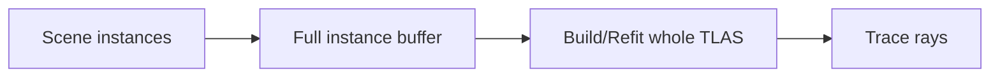
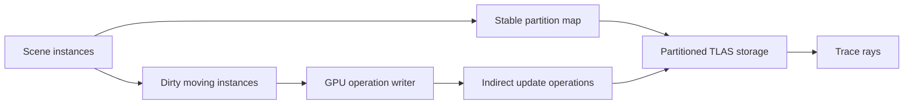
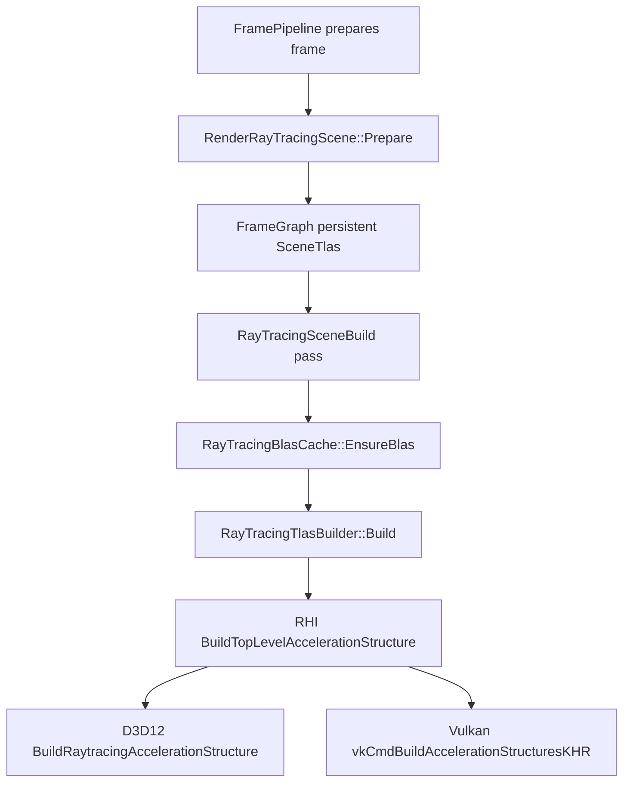
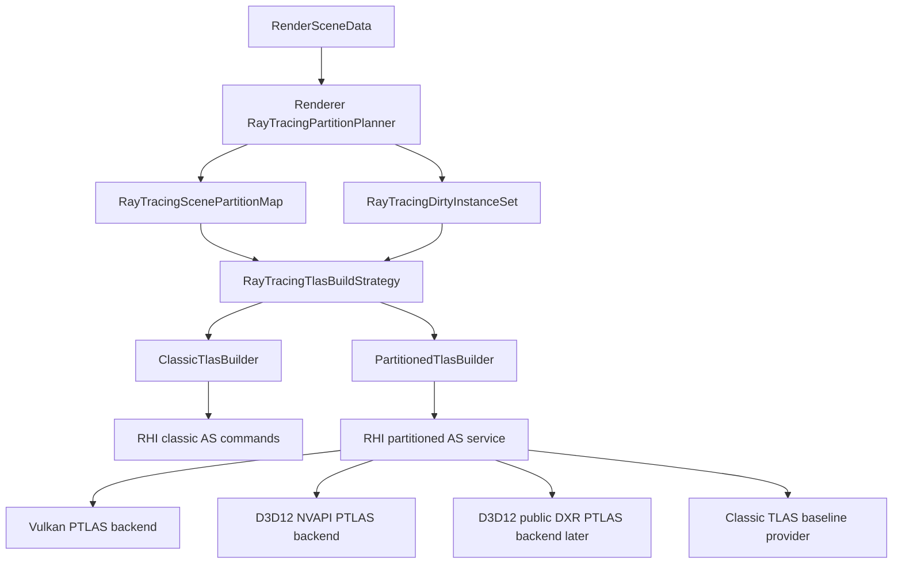
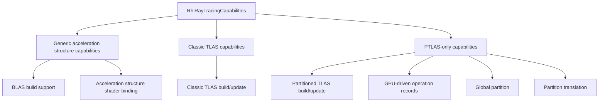
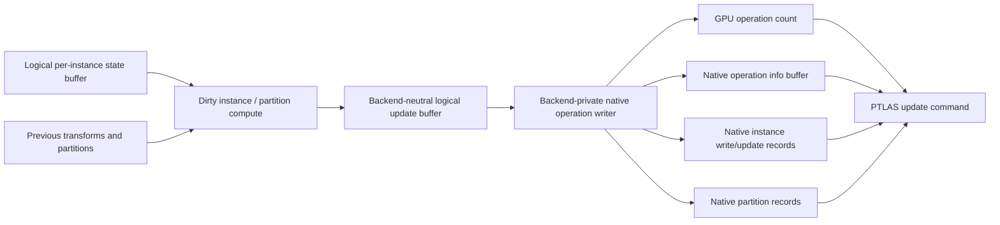
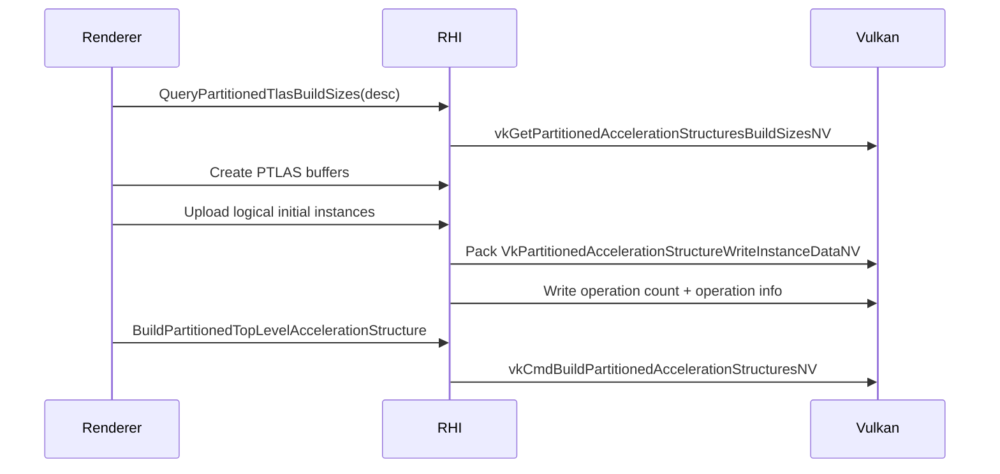
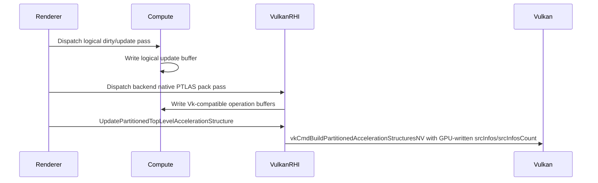
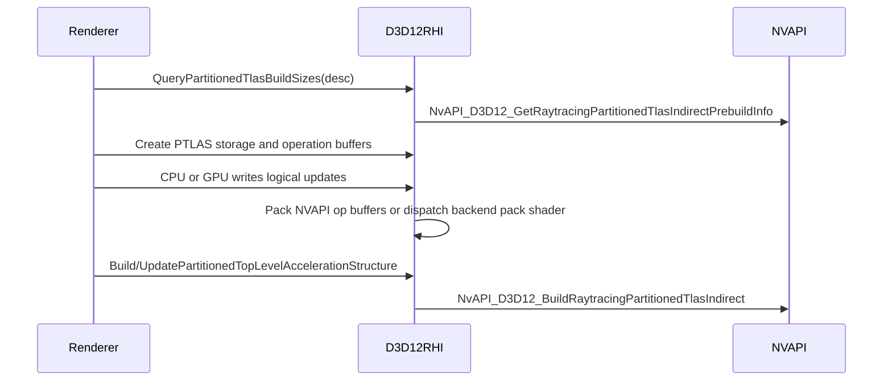
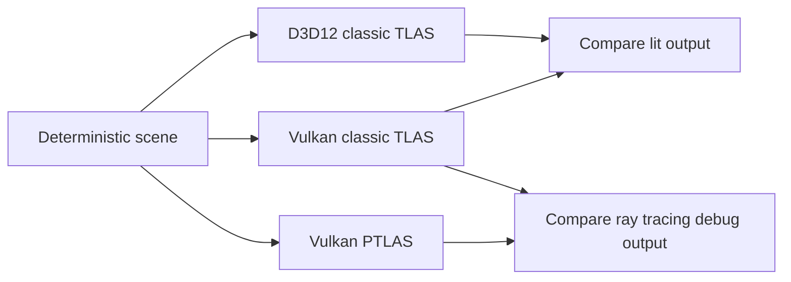

# Partitioned TLAS Implementation Plan

Status: design document, no runtime code implemented in this stage.

Primary reference implementation: [NVIDIA nvpro-samples/vk_partitioned_tlas](https://github.com/nvpro-samples/vk_partitioned_tlas)

Stage 1 evidence baseline: [Partitioned TLAS Baseline Evidence](../architecture/partitioned-tlas-baseline.md)

Primary API references:

- Vulkan SDK / Khronos extension: `VK_NV_partitioned_acceleration_structure`
- Vulkan headers available locally in `C:/VulkanSDK/1.4.350.0/Include/vulkan/vulkan_core.h`
- NVIDIA NVAPI R595 public headers:
  - `NvAPI_D3D12_GetRaytracingPartitionedTlasIndirectPrebuildInfo`
  - `NvAPI_D3D12_BuildRaytracingPartitionedTlasIndirect`
  - `NVAPI_D3D12_BUILD_RAYTRACING_PARTITIONED_TLAS_INDIRECT_DESC`
- Microsoft DXR Part 2 draft/spec reference: https://microsoft.github.io/DirectX-Specs/d3d/Raytracing2.html
  - The spec describes Partitioned TLAS and indirect RTAS operations.
  - It currently names support through `D3D12_FEATURE_OPTIONS_NNN` / `ClustersAndPTLASSupported`, so Sparkle should support NVAPI first and keep a future public-DXR backend path clean.
- NVIDIA RTX Mega Geometry reference: https://github.com/NVIDIA-RTX/RTXMG
  - RTXMG proves the DX12/Vulkan NVIDIA pattern for advanced ray tracing acceleration-structure work: DX12 through NVAPI and D3D12 Agility SDK, Vulkan through NVIDIA Vulkan extensions.
- NVIDIA RTX Mega Geometry / Vulkan samples article: https://developer.nvidia.com/blog/nvidia-rtx-mega-geometry-now-available-with-new-vulkan-samples/
  - Article anchor: PTLAS is presented as rebuilding parts of a TLAS when only part of a scene changes, not as a generic "always faster" replacement.
- NVIDIA Nsight Graphics documentation hub: https://docs.nvidia.com/nsight-graphics/index.html
  - Tooling anchor: Ray Tracing debugging should inspect acceleration-structure efficiency, build flags, world-space overlap, traversal hot spots, and performance markers.
- NVIDIA Nsight Graphics GPU Trace UI reference: https://docs.nvidia.com/nsight-graphics/UserGuide/gpu-trace-ui.html
  - Tooling anchor: GPU Trace metrics and marker trees are expected evidence for GPU performance claims.
- Current Sparkle classic TLAS path:
  - `Engine/Renderer/Private/RayTracing/RayTracingTlasBuilder.cpp`
  - `Engine/Renderer/Private/RayTracing/RayTracingBlasCache.cpp`
  - `Engine/Renderer/Private/RayTracing/RenderRayTracingScene.cpp`
  - `Engine/Renderer/Private/Frame/RayTracingScene.cpp`
  - `Engine/RHI/Public/RayTracing/RhiRayTracingDesc.h`
  - `Engine/RHI/Public/RayTracing/RhiRayTracingService.h`
  - `Engine/RHI/Public/Commands/RenderCommandList.h`
  - `Engine/RHI/Private/Vulkan/RayTracing/VulkanRayTracingServices.cpp`
  - `Engine/RHI/Private/Vulkan/Commands/VulkanRenderCommandList.cpp`
  - `Engine/RHI/Private/Vulkan/Descriptors/VulkanDescriptorAllocator.cpp`
  - `Engine/RHI/Private/D3D12/RayTracing/D3D12RayTracingServices.cpp`
  - `Engine/RHI/Private/D3D12/Commands/D3D12RenderCommandList.cpp`

## Executive Summary

Partitioned TLAS, or PTLAS, solves a very specific ray tracing scaling problem: classic TLAS update cost grows with the whole instance set even when only a small subset of instances moved. PTLAS divides the top-level acceleration structure into partitions so the renderer can update only the instances and partitions that changed. The NVIDIA sample demonstrates this with many static objects plus a smaller set of dynamic dominoes.

For Sparkle, PTLAS should not be treated as a Vulkan sample pasted into the renderer. It should become a ray tracing scene build strategy selected by renderer policy and implemented by backend-specific RHI services. The renderer should understand partitions, dirty instance sets, visual diagnostics, and quality/performance goals. The RHI should own native API details such as `VkPartitionedAccelerationStructureWriteInstanceDataNV`, indirect operation buffers, descriptor writes, D3D12 NVAPI PTLAS entry points, and future public-DXR PTLAS entry points.

The recommended delivery path is:

1. Add architecture and capability scaffolding without changing the visible output.
2. Implement a classic TLAS vs PTLAS correctness harness.
3. Implement Vulkan PTLAS first behind capability checks.
4. Implement GPU-driven PTLAS update generation as a first-class path, with CPU packing retained as a validation and fallback path.
5. Add visual debug viewmodes and GPU/CPU measurements.
6. Add D3D12 PTLAS through NVAPI, while keeping the public DXR Part 2 route as a future backend implementation when SDK/runtime symbols land.

## Problem This Solves

Classic TLAS update:



If 20 instances move in a 100000 instance scene, the classic path still presents the whole top-level instance set to the build/refit command. This is simple and robust, but it weakens the story for large dynamic scenes.

PTLAS update:



The goal is to make update cost scale with the changed region, not the entire scene, while keeping trace quality and shader binding behavior equivalent from the shader author's perspective.

GPU-driven updates are part of the target feature, not an optional polish item. The initial CPU operation packer is still valuable because it gives us deterministic correctness checks and an easier first Vulkan bring-up, but the review-ready end state should let GPU work identify dirty instances, write native PTLAS operation records, increment operation counts, and launch the PTLAS update without synchronizing per-frame update details back to the CPU.

## What The NVIDIA Sample Teaches

The sample is useful because it shows PTLAS as a productized debugging/teaching feature, not just an API call. The important takeaways are:

- It keeps BLAS creation common between classic TLAS and PTLAS.
- It separates scene partitioning from acceleration structure build mechanics.
- It uses a uniform grid partition model plus a global partition for dynamic objects that are expensive to keep spatially local.
- It exposes multiple update policies:
  - Always update the original partition.
  - Move dynamic objects to a global partition.
  - Use a distance threshold to update nearby partitions and move far dynamic objects to the global partition.
- It writes PTLAS operation records into GPU-visible buffers.
- It calls `vkCmdBuildPartitionedAccelerationStructuresNV` every animation step; the work performed depends on the indirect operation buffers.
- It provides visual explanation through partition colors, highlighted touched partitions, and visible behavior differences.

The sample's helper `src/partitioned_acceleration_structures.hpp` shows the API structure:

- Query sizes with `vkGetPartitionedAccelerationStructuresBuildSizesNV`.
- Allocate AS storage, build scratch, update scratch, operation count, operation info, instance write info, optional instance update info, and optional partition write info buffers.
- Upload or generate `VkBuildPartitionedAccelerationStructureIndirectCommandNV` records.
- Build or update with `vkCmdBuildPartitionedAccelerationStructuresNV`.
- Bind with descriptor type `VK_DESCRIPTOR_TYPE_PARTITIONED_ACCELERATION_STRUCTURE_NV` and `VkWriteDescriptorSetPartitionedAccelerationStructureNV`.

That last descriptor detail is especially important for Sparkle: a Vulkan PTLAS is not represented by `VkAccelerationStructureKHR` in the same way our current Vulkan descriptor path expects.

## Existing Implementation Patterns To Follow

These patterns are the reference behavior for the implementation stages below:

| Pattern | Reference | Sparkle interpretation |
|---|---|---|
| Capability-first provider selection | `VK_NV_partitioned_acceleration_structure`, NVAPI R595 PTLAS caps, Microsoft DXR Part 2 feature options | Query provider support before creating resources. Report active provider and capability reason instead of branching ad hoc in renderer code. |
| Persistent PTLAS storage plus indirect operations | `vk_partitioned_tlas/src/partitioned_acceleration_structures.hpp`, NVAPI `NVAPI_D3D12_BUILD_RAYTRACING_PARTITIONED_TLAS_INDIRECT_DESC` | Allocate PTLAS storage, scratch, op count, op metadata, instance records, and partition records as explicit RHI-owned resources. |
| CPU pack as bring-up/reference, GPU pack as target | `vk_partitioned_tlas/shaders/animation_update_instances.comp.glsl` | Start with deterministic CPU pack inside backend code, then add GPU-written logical records and backend-native GPU pack. Keep CPU pack permanently for validation. |
| Renderer owns partition meaning, RHI owns native records | NVIDIA sample separates animation/partition policy from Vulkan record submission | Renderer emits logical partition/update intent. RHI translates it to `Vk*NV` or `NVAPI_D3D12_*` records. |
| Visual explanation is part of the feature | `vk_partitioned_tlas/shaders/raytrace.rchit.glsl`, RTXMG debug highlighting/profiler UI | Add viewmodes, overlays, counters, and capture markers in the same implementation plan as the runtime feature. |
| Classic TLAS remains a comparison path | Existing Sparkle D3D12/Vulkan classic TLAS builders | Keep classic TLAS selectable on every backend for correctness, profiling, and provider-status explanation. |
| Provider-specific code stays private | NVRHI/NRI-style backend abstraction and RTXMG NVAPI integration | Renderer must not include Vulkan, D3D12, or NVAPI PTLAS structs. Native packing lives in backend-private folders. |

Implementation prompts should explicitly cite the relevant pattern from this table. A stage is not ready to implement if the prompt does not say which provider boundary, validation artifact, and visual diagnostic it must preserve.

## Current Sparkle State

Sparkle currently has a classic TLAS path:



Current strengths:

- BLAS and TLAS ownership is already isolated in `Engine/Renderer/Private/RayTracing`.
- The frame graph already models acceleration structure resources and build usage.
- Both Vulkan and D3D12 implement a shared classic TLAS command.
- Acceleration structures already bind through shader parameter semantics rather than ad-hoc renderer descriptors.

Current gaps:

- `RhiRayTracingCapabilities` does not describe PTLAS support, operation limits, global partition support, or required buffer layouts.
- `RhiRayTracingService` only exposes classic BLAS/TLAS sizing and simple buffer creation.
- `RenderCommandList` only exposes `BuildBottomLevelAccelerationStructure` and `BuildTopLevelAccelerationStructure`.
- `RayTracingTlasBuilder` rebuilds/uploads a full instance buffer from CPU-visible data each frame.
- Vulkan descriptor binding assumes a normal `VkAccelerationStructureKHR`; PTLAS needs a partitioned descriptor write using a device address.
- Public D3D12 headers installed locally in Windows SDK `10.0.26100.0` do not expose the documented public DXR Part 2 PTLAS symbols yet. D3D12 PTLAS can still be implemented in this checkout through NVIDIA NVAPI R595 partitioned TLAS indirect functions, with the public DXR route kept as a later backend provider.
- Diagnostics are currently mostly logs; PTLAS needs visual and capture-friendly diagnostics.

## Backend Parity Position

Parity should mean identical renderer behavior and comparable acceptance artifacts, not identical backend availability on day one.

| Capability | Vulkan | D3D12 |
|---|---|---|
| Classic TLAS | Already implemented | Already implemented |
| PTLAS API surface | Available through `VK_NV_partitioned_acceleration_structure` in local Vulkan SDK headers | Available through NVAPI R595 partitioned TLAS indirect functions; public DXR Part 2 route is documented but not exposed by local Windows SDK headers |
| First implementation target | Yes | Yes, through NVAPI after RHI contract and Vulkan bring-up clarify the shared model |
| Correctness parity target | Classic TLAS output equals PTLAS output on Vulkan | D3D12 NVAPI PTLAS output equals D3D12 classic TLAS, then matches Vulkan PTLAS within backend tolerance |
| Performance parity target | GPU timestamp comparison between classic TLAS and Vulkan PTLAS | GPU timestamp comparison between classic TLAS and NVAPI PTLAS |

Do not route D3D12 PTLAS through public SDK structs until the public DXR Part 2 headers and runtime support are present. The near-term D3D12 implementation should use an NVAPI backend path, isolated behind the same RHI PTLAS contract used by Vulkan.

## Support And Gating Policy

PTLAS is new enough that not every GPU, driver, API, or SDK will expose it at the same time. This is an architecture challenge, not a product problem. Sparkle should make the feature first-class where it is real today and provide a clean capability negotiation path everywhere else.

Support tiers:

| Tier | Requirement | Expected behavior |
|---|---|---|
| Universal ray tracing path | Backend supports Sparkle's existing classic BLAS/TLAS path | Use classic TLAS. This remains the correctness baseline and fallback everywhere. |
| NVIDIA Vulkan PTLAS | NVIDIA GPU, supporting driver, and `VK_NV_partitioned_acceleration_structure` | Enable Vulkan PTLAS and GPU-driven PTLAS updates. |
| NVIDIA D3D12 PTLAS | NVIDIA GPU, supporting driver, NVAPI R595+ PTLAS symbols, and compatible D3D12 device/command list interfaces | Enable D3D12 NVAPI PTLAS and GPU-driven PTLAS updates. |
| Future public D3D12 PTLAS | Public DXR Part 2 SDK symbols and runtime support | Add a public-DXR provider behind the same RHI contract without removing the NVAPI provider. |

Policy:

- Use NVIDIA-specific APIs when they are the only production path for PTLAS.
- Keep NVIDIA-specific code in backend-private RHI folders.
- Make hardware/API capability combinations visible as negotiated capability state, not runtime errors.
- Keep classic TLAS available even on NVIDIA hardware for debugging, parity testing, and baseline comparison.
- Do not make shader authors or renderer passes branch on Vulkan, D3D12, or NVAPI details.
- Do not block the Vulkan and D3D12 NVAPI implementation waiting for future public DXR headers.

Architecture challenge:

- The renderer needs one conceptual feature: "build and update the top-level ray tracing scene efficiently."
- Backends expose that feature through different provider surfaces: classic TLAS, Vulkan NV PTLAS, D3D12 NVAPI PTLAS, and future public DXR PTLAS.
- The RHI should select and describe the active provider. It should not force the renderer to treat NVIDIA-only availability as an error case.
- Feature UI, validation captures, and debug viewmodes should explain which provider is active and why, so the same engine build is reviewable on both NVIDIA and non-NVIDIA machines.

## Target Architecture



Layer ownership:

- Renderer owns scene meaning: which instances belong together, which moved, which partition policy is active, what the user sees in debug viewmodes.
- RHI owns native execution: API structures, native operation buffers, descriptor writes, command entry points, barriers, and capability reporting.
- Frame graph owns scheduling and resource lifetime visibility.
- Application/Editor owns toggles, overlays, capture workflows, and benchmark launch presets.

Important boundary rule:

`Engine/Renderer` must not include `vulkan_core.h`, `d3d12.h`, `VkPartitionedAccelerationStructure*`, or D3D12 PTLAS structs. Renderer emits logical PTLAS intent; backend code packs native records.

## Proposed RHI Contract

Add backend-neutral types to `Engine/RHI/Public/RayTracing/RhiRayTracingDesc.h`.

Capability model:



Generic TLAS and acceleration structure capabilities answer: "Can this backend build and bind normal ray tracing acceleration structures?"

PTLAS-specific capabilities answer: "Can this backend maintain a persistent partitioned top-level structure with indirect operation records?"

Do not mix these buckets. A backend can support ray tracing and classic TLAS while not supporting PTLAS.

Proposed concepts:

```cpp
enum class ERhiRayTracingTopLevelMode : std::uint8_t
{
    Classic,
    Partitioned
};

struct RhiAccelerationStructureCapabilities
{
    bool SupportsRayTracing = false;
    bool SupportsInlineRayQuery = false;
    bool SupportsAccelerationStructureShaderBinding = false;
    std::uint32_t MaxTraceRecursionDepth = 0;
    std::uint32_t MaxRayPayloadSizeInBytes = 0;
    std::uint32_t MaxRayAttributeSizeInBytes = 0;
    std::uint64_t AccelerationStructureByteAlignment = 0;
    std::uint64_t ScratchBufferByteAlignment = 0;
};

struct RhiClassicTlasCapabilities
{
    bool SupportsClassicTlasBuild = false;
    bool SupportsClassicTlasUpdate = false;
    bool SupportsGpuReadableInstanceBuffer = false;
    std::uint32_t InstanceDescSizeInBytes = 0;
};

enum class ERhiPartitionedTlasProvider : std::uint8_t
{
    None,
    VulkanNvPartitionedAccelerationStructure,
    D3D12NvapiPartitionedTlas,
    D3D12PublicDxrRtasOperations
};

struct RhiPartitionedTlasCapabilities
{
    bool Supported = false;
    ERhiPartitionedTlasProvider Provider = ERhiPartitionedTlasProvider::None;
    bool RequiresNvidiaDevice = false;
    bool SupportsVulkanNativePartitionedAccelerationStructure = false;
    bool SupportsD3D12NvapiPartitionedTlas = false;
    bool SupportsD3D12PublicDxrPartitionedTlas = false;
    bool SupportsCpuPackedOperations = false;
    bool SupportsGpuDrivenOperations = false;
    bool SupportsGpuOperationCount = false;
    bool SupportsGpuWrittenInstanceRecords = false;
    bool SupportsGpuWrittenPartitionRecords = false;
    bool SupportsPartitionTranslation = false;
    bool SupportsGlobalPartition = false;
    bool SupportsExplicitInstanceAabb = false;
    std::uint32_t MaxOperationsPerBuild = 0;
    std::uint32_t InstanceWriteDataSizeInBytes = 0;
    std::uint32_t InstanceUpdateDataSizeInBytes = 0;
    std::uint32_t PartitionWriteDataSizeInBytes = 0;
    std::uint32_t OperationDataSizeInBytes = 0;
    std::uint32_t OperationCountDataSizeInBytes = 0;
    const char* CapabilityStatusReason = nullptr;
};

struct RhiRayTracingCapabilities
{
    RhiAccelerationStructureCapabilities AccelerationStructures = {};
    RhiClassicTlasCapabilities ClassicTlas = {};
    RhiPartitionedTlasCapabilities PartitionedTlas = {};
};

struct RhiPartitionedTlasDesc
{
    std::uint32_t InstanceCapacity = 0;
    std::uint32_t PartitionCount = 0;
    std::uint32_t MaxInstancesPerPartition = 0;
    std::uint32_t MaxInstancesInGlobalPartition = 0;
    std::uint32_t MaxOperations = 0;
    bool AllowInstanceUpdates = true;
    bool AllowPartitionTranslation = false;
    bool AllowGpuDrivenOperations = true;
};

struct RhiPartitionedTlasBuildSizes
{
    std::uint64_t AccelerationStructureSizeInBytes = 0;
    std::uint64_t BuildScratchSizeInBytes = 0;
    std::uint64_t UpdateScratchSizeInBytes = 0;
    std::uint64_t OperationInfoSizeInBytes = 0;
    std::uint64_t OperationCountSizeInBytes = 0;
    std::uint64_t InstanceWriteInfoSizeInBytes = 0;
    std::uint64_t InstanceUpdateInfoSizeInBytes = 0;
    std::uint64_t PartitionWriteInfoSizeInBytes = 0;
};
```

`Provider` and `CapabilityStatusReason` are review-facing fields, not just UI polish. They make it obvious which top-level ray tracing provider is active and, when PTLAS is not selected, whether the reason is non-NVIDIA hardware, missing `VK_NV_partitioned_acceleration_structure`, NVAPI initialization state, or a future public DXR provider that is not compiled in yet. That turns capability variance into explicit system information rather than a hidden backend branch.

Add service operations to `RhiRayTracingService`:

- Query generic acceleration structure support and limits.
- Query classic TLAS support and limits.
- Query PTLAS support and limits.
- Query PTLAS build sizes.
- Create PTLAS storage and operation buffers.
- Upload/pack initial logical instance writes.
- Upload/pack dynamic logical updates.
- Create GPU-writable logical update buffers.
- Create GPU-writable native operation buffers.
- Create or clear GPU operation count buffers.
- Register/bind a partitioned acceleration structure descriptor.

Add command operations to `RenderCommandList`:

- `BuildPartitionedTopLevelAccelerationStructure`
- `UpdatePartitionedTopLevelAccelerationStructure`
- `ClearPartitionedTlasOperationCount` or a more general buffer clear command if not already available
- `DispatchPartitionedTlasOperationWriter` should not be a hard-coded RHI command; it should be a normal compute dispatch using renderer/RHI-owned shaders and buffers.

Avoid exposing native operation structs to renderer code. For GPU-driven updates, the renderer should write backend-neutral logical update records. Backend-private compute shaders or backend-owned packers translate those records into `VkPartitionedAccelerationStructureWriteInstanceDataNV`, `NVAPI_D3D12_BUILD_RAYTRACING_PARTITIONED_TLAS_OP` records, or future public-DXR RTAS operation records. CPU-side packing remains required as a validation reference and fallback path.

Capability classification:

| Capability | Classification | Why |
|---|---|---|
| Supports ray tracing / ray query | Generic AS | Needed before either classic TLAS or PTLAS can be useful |
| Acceleration structure storage alignment | Generic AS | Applies to BLAS, classic TLAS, and PTLAS storage |
| Scratch alignment | Generic AS | Applies to all AS build/update work |
| Classic top-level build | Classic TLAS | Builds a normal whole top-level AS from an instance buffer |
| Classic top-level update/refit | Classic TLAS | Updates a normal TLAS, still not partition-aware |
| Instance descriptor size | Classic TLAS | Native classic instance buffer layout differs by backend |
| Partition count / max instances per partition | PTLAS-only | Meaningless for classic TLAS |
| Global partition | PTLAS-only | Special PTLAS update/trace tradeoff |
| Partition translation | PTLAS-only | Moves whole partitions without rewriting every instance |
| PTLAS operation info/count buffers | PTLAS-only | Specific to indirect partitioned update commands |
| GPU-driven operation generation | PTLAS-only in this feature | Writes PTLAS operation records and operation counts |
| Native PTLAS descriptor binding | PTLAS-only | Vulkan uses a different descriptor type for partitioned AS |
| `VK_NV_partitioned_acceleration_structure` provider | PTLAS backend provider | Vulkan-specific implementation route |
| D3D12 NVAPI partitioned TLAS provider | PTLAS backend provider | D3D12 NVIDIA implementation route available through NVAPI |
| D3D12 public DXR RTAS provider | PTLAS backend provider | Future/public implementation route once SDK/runtime support lands |

## Renderer Design

Add a renderer-side partitioning layer beside the current TLAS builder:

- `RayTracingTopLevelSceneBuilder`
- `ClassicRayTracingTlasBuilder`
- `PartitionedRayTracingTlasBuilder`
- `RayTracingPartitionPlanner`
- `RayTracingPartitionMap`
- `RayTracingPartitionDebugData`
- `RayTracingAccelerationStructureMetrics`

Partition planner responsibilities:

- Assign every traceable instance a stable `instanceIndex`.
- Assign every instance to a partition.
- Track previous transform, current transform, BLAS address, material/SBT contribution, and movement state.
- Produce an initial build dataset.
- Produce a per-frame dirty set.
- Decide whether a dynamic object stays in its original partition or moves to the global partition.
- Emit debug metadata for viewmodes.

Initial partitioning should be simple and explainable:

- World-space XZ grid.
- One optional global partition.
- Configurable partitions per axis.
- Configurable max instances per partition.
- Overflow policy: either increase capacity before build or explicitly mark overflow fallback to classic TLAS.

Do not start with a BVH-based or portal/room-aware partitioner. The grid is the right first implementation because it is teachable, visually debuggable, and matches the NVIDIA sample.

## GPU-Driven PTLAS Updates

GPU-driven PTLAS updates are important because they preserve the core advantage of PTLAS: the CPU should not have to read back, count, sort, or synchronize dynamic update details every frame. The CPU should choose policy and allocate capacity. The GPU should produce per-frame native operation data from logical scene state.

Target data flow:



Renderer-owned logical GPU buffers:

- `RayTracingInstanceState`
  - stable instance index,
  - current transform,
  - previous transform,
  - current partition,
  - desired partition,
  - BLAS logical handle or backend-resolved address token,
  - material/SBT contribution,
  - movement flags.
- `RayTracingPartitionState`
  - partition index,
  - bounds or grid coordinate,
  - last modified frame,
  - static instance count,
  - dynamic instance count,
  - debug heat value.
- `RayTracingLogicalPtlasUpdate`
  - operation kind: write instance, update instance, move instance, translate partition,
  - instance index,
  - source partition,
  - destination partition,
  - transform,
  - logical BLAS reference.

Backend-owned native GPU buffers:

- PTLAS operation count buffer.
- PTLAS operation info buffer.
- PTLAS native instance write buffer.
- PTLAS native instance update buffer.
- PTLAS native partition translation/write buffer.

Important design choice:

The renderer should never write `VkPartitionedAccelerationStructureWriteInstanceDataNV` directly. For Vulkan, a backend-private packing shader may include a Vulkan-layout-compatible HLSL/GLSL header, but that shader and its layout contract belong to the Vulkan RHI package. The renderer dispatches a generic "pack logical PTLAS updates" pass through an RHI-owned pipeline or a backend-private service.

Implementation modes:

| Mode | Purpose | Expected lifetime |
|---|---|---|
| CPU pack | Bring-up, deterministic validation, selected path when GPU writer is not active | Permanent baseline/reference |
| GPU logical dirty detection + CPU native pack | Transitional mode to validate dirty tracking independently | Temporary |
| GPU logical dirty detection + GPU native pack | Review-ready target path | Permanent primary path when supported |

GPU-driven acceptance:

- The CPU does not need to know per-frame native operation counts before submitting the PTLAS update.
- Operation count and operation records are GPU-visible and written before the PTLAS update command.
- CPU pack and GPU pack produce equivalent PTLAS output for deterministic scenes.
- Debug overlays show both logical dirty counts and native operation counts.
- GPU pack work has its own timestamp/capture marker, separate from PTLAS build/update.

Synchronization requirements:

- Logical state writes must complete before native operation packing reads them.
- Native operation packing writes must complete before `BuildPartitionedTopLevelAccelerationStructure` or `UpdatePartitionedTopLevelAccelerationStructure` consumes operation buffers.
- PTLAS build/update writes must complete before ray tracing or ray query reads the top-level AS.
- These transitions should be represented through frame graph/RHI resource usage, not one-off backend barriers in renderer code.

## Vulkan Implementation Plan

Vulkan feature prerequisites:

- Add `VK_NV_partitioned_acceleration_structure` to device extension discovery.
- Query extension availability in `VulkanRayTracingFeatureQuery`.
- Enable the extension only when base ray tracing and buffer device address requirements are present.
- Load:
  - `vkGetPartitionedAccelerationStructuresBuildSizesNV`
  - `vkCmdBuildPartitionedAccelerationStructuresNV`
- Extend `VulkanRhi::BuildRayTracingCapabilities` with PTLAS capability flags.

Vulkan resource prerequisites:

- Add a way for ray tracing services to create GPU-addressable storage buffers used by PTLAS operation data.
- Add a way for renderer/frame graph passes to allocate GPU-writable logical PTLAS update buffers.
- Create acceleration structure storage as a raw buffer with `VK_BUFFER_USAGE_ACCELERATION_STRUCTURE_STORAGE_BIT_KHR`.
- Store enough metadata in `VulkanGpuAllocationRecord` to distinguish:
  - BLAS/TLAS `VkAccelerationStructureKHR`
  - PTLAS raw acceleration structure device address
  - PTLAS descriptor binding mode

Vulkan build flow:



Vulkan GPU-driven update flow:



Vulkan descriptor prerequisites:

- Extend `VulkanDescriptorAllocator::EntryKind` with `PartitionedAccelerationStructure`.
- Add `RegisterPartitionedAccelerationStructureDescriptor(RhiGpuVirtualAddress ptlasAddress)`.
- Add descriptor writing path using:
  - `VK_DESCRIPTOR_TYPE_PARTITIONED_ACCELERATION_STRUCTURE_NV`
  - `VkWriteDescriptorSetPartitionedAccelerationStructureNV`
- Ensure existing shader parameter semantic `AccelerationStructure` can bind either classic TLAS or PTLAS without shader author changes.

Vulkan barriers:

- Add explicit barriers after PTLAS build/update:
  - source stage: acceleration structure build
  - source access: acceleration structure write
  - destination stages: ray tracing, compute shader, fragment shader as needed
  - destination access: acceleration structure read

Vulkan guardrails:

- If PTLAS extension or functions are not available, report the active provider as classic TLAS with a precise capability reason.
- If any partition has duplicate `instanceIndex`, reject the PTLAS update before native packing.
- If any operation buffer exceeds allocated capacity, reject the PTLAS update and select the classic TLAS baseline for the frame with visible reason metadata.
- If descriptor binding sees a PTLAS address through the classic TLAS path, emit a validation error.
- If GPU-driven packing is requested but the backend pack pipeline is not available, select CPU pack for that provider and report the capability reason in metrics.

## D3D12 Implementation Plan

D3D12 must be treated as an NVAPI-backed parity path first, with a public DXR Part 2 path later when the SDK/runtime surface becomes available.

Current local evidence:

- `Engine/RHI/Private/D3D12/RayTracing/D3D12RayTracingServices.cpp` uses classic `GetRaytracingAccelerationStructurePrebuildInfo`.
- `Engine/RHI/Private/D3D12/Commands/D3D12RenderCommandList.cpp` uses classic `BuildRaytracingAccelerationStructure`.
- Microsoft DXR Part 2 describes PTLAS through indirect RTAS operations such as `ExecuteIndirectRTASOperations`, `D3D12_RTAS_PARTITIONED_TLAS_INPUTS_DESC`, and `D3D12_RTAS_PARTITIONED_TLAS_OPERATION`.
- The same spec currently reports support through future `D3D12_FEATURE_OPTIONS_NNN` / `ClustersAndPTLASSupported` wording.
- Local Windows SDK `10.0.26100.0` search did not find those PTLAS/RTAS operation symbols in `d3d12.h`.
- NVAPI R595 headers do expose:
  - `NvAPI_D3D12_GetRaytracingCaps`
  - `NVAPI_D3D12_RAYTRACING_CAPS_TYPE_PARTITIONED_TLAS`
  - `NVAPI_D3D12_RAYTRACING_PARTITIONED_TLAS_CAP_STANDARD`
  - `NvAPI_D3D12_GetRaytracingPartitionedTlasIndirectPrebuildInfo`
  - `NvAPI_D3D12_BuildRaytracingPartitionedTlasIndirect`
  - `NVAPI_D3D12_BUILD_RAYTRACING_PARTITIONED_TLAS_INDIRECT_INPUTS`
  - `NVAPI_D3D12_BUILD_RAYTRACING_PARTITIONED_TLAS_INDIRECT_DESC`
  - `NVAPI_D3D12_BUILD_RAYTRACING_PARTITIONED_TLAS_OP`
  - `NVAPI_D3D12_BUILD_RAYTRACING_PARTITIONED_TLAS_OP_ARG_WRITE_INSTANCE`
  - `NVAPI_D3D12_BUILD_RAYTRACING_PARTITIONED_TLAS_OP_ARG_UPDATE_INSTANCE`
  - `NVAPI_D3D12_BUILD_RAYTRACING_PARTITIONED_TLAS_OP_ARG_WRITE_PARTITION`
- The NVAPI indirect descriptor uses GPU virtual addresses for `indirectOpCount` and `indirectOps`, so it can support the same GPU-driven update model as Vulkan: compute can write the operation count and operation records, then the backend can submit the PTLAS update without CPU readback.
- RTXMG uses the same NVIDIA ecosystem pattern for advanced ray tracing acceleration structures: DX12 path through NVAPI and D3D12 Agility SDK, Vulkan path through NVIDIA Vulkan extensions.

Recommended route:

1. Add public RHI capability fields now.
2. Add an NVAPI feature probe for D3D12 PTLAS using `NvAPI_D3D12_GetRaytracingCaps` with `NVAPI_D3D12_RAYTRACING_CAPS_TYPE_PARTITIONED_TLAS`.
3. Use D3D12 classic TLAS as the correctness reference while bringing up NVAPI PTLAS.
4. Add compile-time detection for NVAPI headers and runtime initialization:
   - if NVAPI PTLAS symbols are available and runtime reports success, enable D3D12 PTLAS;
   - otherwise compile/run a provider stub that reports classic TLAS as the active provider with a precise capability reason.
5. Add compile-time detection for future public DXR headers:
   - if D3D12 PTLAS symbols exist, compile the backend implementation;
   - otherwise compile a provider stub that explains why the public DXR PTLAS provider is not active.
6. When public headers land, implement the public-DXR backend behind the same renderer/RHI contract and keep NVAPI as a vendor path where useful.

D3D12 NVAPI flow:



NVAPI-specific guardrails:

- Initialize and shutdown NVAPI in a D3D12 backend-owned subsystem, not renderer code.
  - Keep all `NVAPI_D3D12_*` types in `Engine/RHI/Private/D3D12`.
  - Add a capability reason enum:
  - NVAPI headers not present,
  - NVAPI initialization status,
  - driver does not support PTLAS,
  - D3D12 device/command list interface too old,
  - Agility SDK/runtime mismatch,
  - PTLAS prebuild query status.
- Record exact NVAPI status codes in diagnostics, but expose renderer-facing state as backend-neutral capabilities.
- Keep public DXR Part 2 and NVAPI implementations behind the same RHI entry points.

D3D12 NVAPI acceptance:

- Vulkan PTLAS and Vulkan classic TLAS render the same result.
- D3D12 NVAPI PTLAS and D3D12 classic TLAS render the same result when NVAPI support is present.
- D3D12 classic TLAS and Vulkan classic TLAS remain cross-backend references.
- Feature UI shows the active D3D12 top-level provider and the precise capability reason when NVAPI PTLAS is not selected.

## Debug And Teaching Features

The implementation should be easy to explain visually. Logs are not enough.

Sparkle already has a viewmode pipeline:

- C++ enum: `Engine/Renderer/Public/Debug/RenderViewMode.h`
- Shader constants: `Engine/Assets/Shaders/Debug/RenderViewModeConstants.hlsli`
- GBuffer instance color hook: `Engine/Assets/Shaders/Debug/InstanceView.hlsli`
- GBuffer usage: `Engine/Assets/Shaders/Passes/Deferred/GBufferPS.hlsl`
- Deferred debug composite: `Engine/Assets/Shaders/Passes/Deferred/VisualizeBuffers.hlsl`
- Existing smoke override path: `Engine/Application/Private/Validation/RhiSmokeEditorValidation.cpp`

PTLAS visualization should extend this existing viewmode stack rather than inventing a separate debug UI path.

Add viewmodes:

1. `RayTracingPartitions`
   - Color instances by partition ID.
   - Draw grid boundaries.
   - Show global partition objects in a reserved color.

2. `RayTracingPartitionUpdates`
   - Highlight partitions touched this frame.
   - Use intensity for update count.
   - Fade over time so colleagues can see motion history.

3. `RayTracingTopLevelMode`
   - Green overlay when tracing through PTLAS.
   - Blue overlay when tracing through classic TLAS.
   - Amber overlay when PTLAS requested but fallback was used.

4. `RayTracingInstanceMovement`
   - Static instances: desaturated.
   - Dirty dynamic instances: hot color.
   - Moved-to-global instances: special color.

5. `RayTracingBuildCost`
   - Small in-editor graph of CPU partition planning, CPU packing/upload, GPU TLAS/PTLAS build/update, and ray tracing pass time.

6. `RayTracingNativeOperations`
   - Visualize native operation slots written this frame.
   - Color write-instance, update-instance, write-partition, and no-op entries differently.
   - Show over-capacity or dropped operations in an error color.

7. `RayTracingGpuDrivenUpdates`
   - Show logical dirty records generated by the GPU.
   - Show whether the frame used CPU pack, GPU logical dirty + CPU native pack, or full GPU native pack.
   - Highlight mismatch frames when CPU and GPU pack validation disagree.

8. `RayTracingProviderStatus`
   - Amber: classic TLAS baseline selected because PTLAS provider requirements are not met.
   - Red: validation stop such as duplicate instance index or partition overflow.
   - Purple: CPU pack selected because GPU-driven native pack is not active.
   - Green: PTLAS active and fully GPU-driven.

Viewmode data sources:

| Viewmode | Required renderer data | Required GPU/RHI data | Suggested implementation |
|---|---|---|---|
| `RayTracingPartitions` | per-instance partition ID, grid bounds | none | GBuffer colors from a partition metadata buffer indexed by instance ID |
| `RayTracingPartitionUpdates` | partition last-modified frame, dirty partition count | optional native op count | Deferred overlay or GBuffer debug target with temporal fade |
| `RayTracingTopLevelMode` | selected top-level mode and provider state | backend capability bit | fullscreen tint/composite in `VisualizeBuffers.hlsl` |
| `RayTracingInstanceMovement` | static/dynamic/global movement class | logical dirty flag | GBuffer instance visualization |
| `RayTracingBuildCost` | timing metrics | timestamp queries | editor overlay graph, not encoded into scene color only |
| `RayTracingNativeOperations` | logical op type mapping | native operation count and capacity | storage-buffer debug visualization pass |
| `RayTracingGpuDrivenUpdates` | CPU/GPU pack mode and validation mismatch bit | GPU-written logical update count | overlay plus metrics panel |
| `RayTracingProviderStatus` | provider-selection enum | backend capability status reason | fullscreen categorical debug color plus details panel |

Do not rely only on logs for any PTLAS state. Every important PTLAS decision should have a visual or capture-visible representation:

- selected mode,
- backend capability state,
- dirty instance count,
- dirty partition count,
- operation count,
- global partition occupancy,
- provider-selection reason,
- CPU pack vs GPU pack path,
- validation mismatch.

Add inspectable debug panels:

- Total instances.
- Partition count.
- Max instances per partition.
- Dirty instance count.
- Dirty partition count.
- Global partition count.
- Operation count.
- Operation buffer capacity.
- GPU logical update count.
- GPU native operation count.
- CPU/GPU pack mismatch count.
- Selected pack path.
- PTLAS storage size.
- PTLAS scratch size.
- Classic TLAS storage size.
- Fallback reason for current frame.

Add capture markers:

- `RT: BLAS Build`
- `RT: Classic TLAS Build`
- `RT: PTLAS Logical Dirty Detection`
- `RT: PTLAS Operation Pack`
- `RT: PTLAS Native GPU Pack`
- `RT: PTLAS Build`
- `RT: PTLAS Update`
- `RT: RayQuery Shadows`

These should show up in Nsight Graphics, RenderDoc, and PIX where supported.

## Performance Measurement Plan

Measure before claiming speedups.

Test scenes:

1. Static large scene
   - Expected: PTLAS should not do meaningful update work after initial build.

2. Sparse dynamic scene
   - Many static instances, few moving instances.
   - Expected: PTLAS update time should scale with dirty instances/partitions, classic TLAS remains close to full rebuild/refit cost.

3. Dense dynamic scene
   - Many moving instances.
   - Expected: PTLAS advantage shrinks; fallback or classic may be competitive.

4. Global partition stress
   - Many objects moved into global partition.
   - Expected: update is faster, trace may get slower.

5. Camera near/far threshold scene
   - Validate the hybrid policy: nearby partitions update in place; far partitions move dynamic objects to global.

Metrics:

- CPU partition planner time.
- CPU native operation pack time.
- CPU upload bytes.
- GPU logical dirty detection time.
- GPU native operation pack time.
- GPU classic TLAS build/update timestamp.
- GPU PTLAS build/update timestamp.
- Ray tracing pass time.
- Number of rays or ray queries if available.
- Dirty instance count.
- Dirty partition count.
- Logical update count.
- Native operation count.
- Global partition occupancy.
- Fallback count and reason.

Acceptance:

- Correctness first: image output and ray traced shadow visibility must match classic TLAS for static and deterministic dynamic frames.
- In sparse dynamic scenes, PTLAS build/update GPU time must decrease with lower dirty counts.
- In dense dynamic scenes, PTLAS may be equal/slower; the system must report this honestly.
- Debug overlays must explain why a frame was fast or slow.

## Correctness Tests

Add an automated smoke path that can run both modes in the same scene:



Recommended validation artifacts:

- Screenshot: D3D12 classic lit.
- Screenshot: Vulkan classic lit.
- Screenshot: Vulkan PTLAS lit.
- Screenshot: Vulkan PTLAS partition debug.
- Screenshot: Vulkan PTLAS update heatmap.
- CSV or JSON: GPU timings and counters.
- Capture: one Nsight Graphics capture showing PTLAS build/update markers.
- Capture: one RenderDoc capture showing descriptors and buffers when possible.

Tolerance:

- For pure partition debug colors, exact visual output is expected.
- For lit/ray traced output, accept small floating point noise only if the ray tracing path is stochastic. If deterministic shadows are used, expect identical visibility.

## Implementation Stages

1. Baseline and references

   Goal: Commit this document and add a short PTLAS architecture note to the ray tracing docs once the docs tree is restored.

   Reference patterns:

   - Capability-first provider selection.
   - Classic TLAS remains a comparison path.
   - Visual explanation is part of the feature.

   Implementation prompt:

   ```text
   Freeze the PTLAS evidence baseline before runtime implementation. Record which PTLAS providers are known today, which headers expose them, which Sparkle files own the current classic TLAS path, and which visual/debug artifacts must exist at the end. Do not change runtime behavior in this stage.
   ```

   Tutor note:

   - What changes: we turn research into a stable map of APIs, files, risks, and expected artifacts.
   - Why it matters: advanced ray tracing features fail slowly when architecture assumptions live only in memory. This stage makes the assumptions reviewable.
   - Pattern to notice: NVIDIA samples are not just API snippets; they include scene policy, debug views, and profiling context. Capture that whole shape.

   Work:

   - Keep the NVIDIA sample cloned only under generated research folders, not in engine source.
   - Record API availability:
     - Vulkan extension present in local Vulkan SDK.
     - D3D12 NVAPI PTLAS symbols present in NVAPI R595+ headers.
     - Public D3D12 SDK headers do not expose public DXR PTLAS symbols in the locally checked SDK.
   - Record implementation evidence:
     - Vulkan PTLAS function and descriptor names.
     - D3D12 NVAPI function and op-record names.
     - Current Sparkle classic TLAS files.
     - Existing Sparkle viewmode files to extend.
   - Add a feature issue/ADR later if this docs set is restored.

   Acceptance:

   - Document exists.
   - No runtime code changed.
   - Clear go/no-go criteria for Vulkan and D3D12.
   - Clear distinction between NVIDIA-gated PTLAS providers and the universal classic TLAS fallback.

   Debug/visualization requirement:

   - Define the minimum screenshots/captures required by later stages before implementation starts.

2. Capability and RHI scaffolding

   Goal: Make PTLAS a first-class RHI capability without enabling it.

   Reference patterns:

   - Capability-first provider selection.
   - Provider-specific code stays private.
   - Classic TLAS remains a comparison path.

   Implementation prompt:

   ```text
   Add backend-neutral RHI capability and descriptor structures for generic acceleration structures, classic TLAS, and PTLAS. Report the selected top-level provider and capability status reason for every backend. Add inactive-provider stubs for providers that are not compiled or not supported. Do not expose Vulkan, D3D12, or NVAPI PTLAS structs outside backend-private RHI code.
   ```

   Tutor note:

   - What changes: capability detection becomes data the renderer can inspect, not a set of backend-specific if-statements.
   - Why it matters: provider selection is the core architecture challenge. A reviewer should immediately see whether the machine is running classic TLAS, Vulkan PTLAS, D3D12 NVAPI PTLAS, or future public DXR PTLAS.
   - Pattern to notice: NVRHI/NRI-style boundaries keep native API details behind a narrow contract. Sparkle should do the same for PTLAS records and descriptors.

   Work:

   - Extend `RhiRayTracingCapabilities`.
   - Split generic acceleration-structure, classic TLAS, and PTLAS-specific capability fields.
   - Add `ERhiPartitionedTlasProvider`.
   - Add PTLAS descriptors/build-size structs.
   - Add inactive-provider stubs that report capability status.
   - Extend diagnostics to report PTLAS availability.
   - Report provider-specific gating:
     - NVIDIA Vulkan extension not present,
     - non-NVIDIA device,
     - NVAPI headers not present,
     - NVAPI runtime initialization status,
     - D3D12 command list/device interface capability,
     - future public DXR PTLAS provider not compiled.
   - Add architecture boundary tests that forbid native PTLAS structs in `Engine/Renderer`.

   Positive guardrails:

   - Renderer sees only RHI structs.
   - D3D12 reports NVAPI PTLAS support only when NVAPI headers, initialization, driver, and command list requirements are met.
   - Vulkan reports supported only when extension, features, functions, and descriptor path are ready.

   Negative guardrails:

   - Do not add `#include <vulkan/...>` to renderer files.
   - Do not change shader authoring yet.
   - Do not change default rendering behavior.

   Debug/visualization requirement:

   - Add provider/capability state to a structured diagnostics object that later UI/viewmodes can consume.

3. Classic TLAS instrumentation

   Goal: Establish a performance and correctness baseline before PTLAS.

   Reference patterns:

   - Classic TLAS remains a comparison path.
   - Visual explanation is part of the feature.

   Implementation prompt:

   ```text
   Instrument the existing classic TLAS path on D3D12 and Vulkan with CPU timers, GPU timestamp scopes, structured counters, and capture markers. Preserve output. Make the metrics available to editor overlays and smoke artifacts so PTLAS has a fair baseline.
   ```

   Tutor note:

   - What changes: the current path becomes measurable instead of merely functional.
   - Why it matters: PTLAS is not always faster. Without a baseline, you cannot explain when it helps, when it does not, or whether a regression is real.
   - Pattern to notice: RTXMG exposes profiler-style data around acceleration-structure work. Sparkle should give similar visibility for BLAS, TLAS, PTLAS pack, and update phases.

   Work:

   - Add GPU timestamp scopes for BLAS, classic TLAS, direct lighting/ray query.
   - Add CPU timers for `RayTracingBlasCache`, `RayTracingTlasBuilder`, and scene data preparation.
   - Emit structured metrics object consumed by UI/debug overlay.
   - Add a deterministic validation scene or camera path.

   Acceptance:

   - D3D12 and Vulkan classic TLAS can produce timing artifacts.
   - Current ray tracing visuals remain unchanged.

   Debug/visualization requirement:

   - Add or reserve overlay slots for BLAS time, classic TLAS time, ray tracing pass time, instance count, and backend provider.

4. Partition planner

   Goal: Build renderer-side partition data without changing the acceleration structure path.

   Reference patterns:

   - Renderer owns partition meaning, RHI owns native records.
   - Visual explanation is part of the feature.

   Implementation prompt:

   ```text
   Implement renderer-owned logical partition planning for ray tracing instances while continuing to render through classic TLAS. Produce stable instance indices, partition IDs, dirty transform tracking, global-partition eligibility, and debug metadata. Do not generate native PTLAS records in renderer code.
   ```

   Tutor note:

   - What changes: Sparkle learns the scene-level meaning of partitions before touching Vulkan or D3D12 PTLAS commands.
   - Why it matters: partitioning is renderer policy. Native APIs only consume the result. This split keeps future partition strategies possible without rewriting backend code.
   - Pattern to notice: the NVIDIA sample uses a grid and a global partition policy. We can start with that because it is explainable, visual, and maps well to sparse dynamic updates.

   Work:

   - Add `RayTracingPartitionPlanner`.
   - Add stable `instanceIndex` assignment.
   - Add grid partitioning and optional global partition policy.
   - Track dirty transforms frame to frame.
   - Add partition debug metadata.

   Acceptance:

   - Classic TLAS still renders.
   - Partition debug view can show the planned partitions even before PTLAS is active.
   - Overflow and duplicate-index validation exists.

   Debug/visualization requirement:

   - `RayTracingPartitions`, `RayTracingPartitionUpdates`, and `RayTracingInstanceMovement` can display logical planner data before native PTLAS is enabled.

5. Vulkan PTLAS backend

   Goal: Implement initial Vulkan PTLAS build/update behind a feature flag.

   Reference patterns:

   - Persistent PTLAS storage plus indirect operations.
   - CPU pack as bring-up/reference, GPU pack as target.
   - Provider-specific code stays private.

   Implementation prompt:

   ```text
   Implement the Vulkan PTLAS provider using VK_NV_partitioned_acceleration_structure. Add feature/function loading, PTLAS size queries, resource allocation, CPU-packed initial writes and updates, build/update commands, barriers, and partitioned acceleration-structure descriptor binding. Feed it only backend-neutral logical PTLAS data from the renderer.
   ```

   Tutor note:

   - What changes: Vulkan gains a real PTLAS provider without changing shader authoring or renderer native dependencies.
   - Why it matters: this proves the RHI contract can represent a PTLAS that is not a normal `VkAccelerationStructureKHR` descriptor path.
   - Pattern to notice: `vk_partitioned_tlas` allocates operation count, operation info, instance write/update, partition write, scratch, and AS storage as separate resources. Do not hide those resources inside a vague buffer blob.

   Work:

   - Enable and load `VK_NV_partitioned_acceleration_structure`.
   - Implement PTLAS size queries.
   - Allocate PTLAS storage and auxiliary buffers.
   - CPU-pack initial instance write records in Vulkan RHI.
   - CPU-pack update operation records in Vulkan RHI.
   - Implement build/update command.
   - Implement partitioned acceleration structure descriptor binding.

   Acceptance:

   - Vulkan can switch between classic TLAS and PTLAS at runtime or launch time.
   - Shader-side binding remains the same conceptual `AccelerationStructure` parameter.
   - Renderer contains no Vulkan native PTLAS structs.

   Debug/visualization requirement:

   - Visualize active partitions, partition IDs, native operation count, PTLAS descriptor/provider status, and classic-vs-PTLAS selected mode.

6. D3D12 NVAPI PTLAS backend

   Goal: Implement D3D12 PTLAS through NVAPI while preserving the same RHI contract as Vulkan.

   Reference patterns:

   - Capability-first provider selection.
   - Persistent PTLAS storage plus indirect operations.
   - Provider-specific code stays private.

   Implementation prompt:

   ```text
   Implement the D3D12 NVIDIA PTLAS provider through NVAPI R595+ partitioned TLAS indirect APIs. Wire NVAPI only in the D3D12 backend, probe `NVAPI_D3D12_RAYTRACING_CAPS_TYPE_PARTITIONED_TLAS`, require `NVAPI_D3D12_RAYTRACING_PARTITIONED_TLAS_CAP_STANDARD`, query prebuild sizes, allocate PTLAS/scratch/op buffers, pack NVAPI operation records in D3D12-private code, and submit NvAPI_D3D12_BuildRaytracingPartitionedTlasIndirect through the same RHI contract used by Vulkan PTLAS.
   ```

   Tutor note:

   - What changes: D3D12 reaches feature parity through the actual NVIDIA production path available today.
   - Why it matters: public DXR PTLAS support can arrive later without changing renderer policy. NVAPI is a provider, not an architecture exception.
   - Pattern to notice: NVAPI's indirect descriptor takes GPU virtual addresses for op count and op arrays, which makes GPU-driven update parity possible with Vulkan.

   Work:

   - Add NVAPI dependency wiring behind a D3D12-only build option.
   - Initialize NVAPI in D3D12 backend services.
   - Query `NvAPI_D3D12_GetRaytracingCaps` for `NVAPI_D3D12_RAYTRACING_CAPS_TYPE_PARTITIONED_TLAS`.
   - Query `NvAPI_D3D12_GetRaytracingPartitionedTlasIndirectPrebuildInfo`.
   - Implement `NvAPI_D3D12_BuildRaytracingPartitionedTlasIndirect`.
   - Pack `NVAPI_D3D12_BUILD_RAYTRACING_PARTITIONED_TLAS_OP` buffers in D3D12-private code.
   - Treat NVAPI PTLAS as the production D3D12 PTLAS path for NVIDIA GPUs until public DXR support is available.
   - Add precise provider-selection reasons for NVAPI/header/driver/runtime capability status.
   - Add D3D12 capture markers matching Vulkan marker names.

   Acceptance:

   - D3D12 can switch between classic TLAS and NVAPI PTLAS when supported.
   - D3D12 NVAPI PTLAS output matches D3D12 classic TLAS.
   - Renderer contains no NVAPI headers or NVAPI type names.
   - The same logical PTLAS scene data feeds Vulkan and D3D12.

   Debug/visualization requirement:

   - The same `RayTracingProviderStatus`, `RayTracingNativeOperations`, and timing views work on D3D12 NVAPI PTLAS and Vulkan PTLAS.

7. GPU-driven operation writer

   Goal: Move from CPU-packed PTLAS updates to the sample's GPU-driven model without leaking native layout into renderer shaders.

   Reference patterns:

   - CPU pack as bring-up/reference, GPU pack as target.
   - Renderer owns partition meaning, RHI owns native records.
   - Persistent PTLAS storage plus indirect operations.

   Implementation prompt:

   ```text
   Add GPU-driven PTLAS update generation in two layers: renderer-visible logical dirty/update buffers and backend-private native pack shaders. The GPU should write logical dirty records, native op counts, and native op records, then the backend should submit PTLAS update commands without per-frame CPU readback. Keep CPU packing as a validation oracle and selected path when GPU pack is not active.
   ```

   Tutor note:

   - What changes: PTLAS stops being a CPU-packed demo and becomes a GPU-driven scene update path.
   - Why it matters: the feature's value is update locality without CPU synchronization. If the CPU counts and uploads everything each frame, we have only moved complexity around.
   - Pattern to notice: the Vulkan sample's compute shader increments operation counts and writes records. Sparkle should preserve that idea while keeping native layouts private to the backend.

   Work:

   - Add backend-neutral logical dirty instance/update buffers.
   - Add GPU logical dirty detection pass.
   - Add RHI-owned native packing path:
     - Vulkan pack compute writes `VkPartitionedAccelerationStructureWriteInstanceDataNV` layout.
     - Vulkan pack compute writes operation count and operation info consumed by `vkCmdBuildPartitionedAccelerationStructuresNV`.
     - D3D12 pack compute writes NVAPI partitioned TLAS operation records when NVAPI PTLAS exists.
   - Add resource barriers from logical update writes to native operation packing.
   - Add resource barriers from native operation packing to PTLAS build/update.
   - Keep CPU pack path as fallback and validation reference.

   Acceptance:

   - Renderer writes logical update intent only.
   - RHI/private code owns native PTLAS record layouts.
   - CPU and GPU operation writer paths produce equivalent PTLAS results.
   - GPU operation counts are consumed without CPU readback.
   - Metrics distinguish CPU pack, GPU dirty detection, GPU native pack, and PTLAS update time.

   Debug/visualization requirement:

   - `RayTracingGpuDrivenUpdates` shows CPU pack, GPU logical dirty plus CPU native pack, full GPU native pack, validation mismatch, logical count, native op count, and selected provider.

8. Visual debug productization

   Goal: Make PTLAS explainable during a work presentation.

   Reference patterns:

   - Visual explanation is part of the feature.
   - RTXMG debug highlighting/profiler style.
   - Existing Sparkle viewmode pipeline.

   Implementation prompt:

   ```text
   Productize PTLAS visualization through Sparkle's existing viewmode system. Add renderer data buffers, shader constants, viewmode enum entries, overlay panels, capture markers, smoke capture presets, and artifact metadata so a reviewer can see provider selection, partitioning, updates, global partition behavior, native operation pressure, GPU-driven path selection, and timing.
   ```

   Tutor note:

   - What changes: PTLAS becomes demonstrable, not invisible infrastructure.
   - Why it matters: if a colleague cannot see which partitions changed, why the global partition was used, or which provider is active, they cannot trust the feature during review.
   - Pattern to notice: NVIDIA's sample colors partitions and recently touched areas. RTXMG highlights debug surfaces and exposes profiler data. Sparkle should do the same in its own viewmode language.

   Work:

   - Add viewmodes listed above.
   - Add C++ enum entries in `RenderViewMode.h`.
   - Add matching HLSL constants in `RenderViewModeConstants.hlsli`.
   - Extend `InstanceView.hlsli` and/or a PTLAS debug visualization shader to color by partition/debug state.
   - Extend smoke validation viewmode names and capture overrides.
   - Add a compact UI panel for partition and build metrics.
   - Add capture markers.
   - Add screenshot presets for before/after comparisons.

   Acceptance:

   - A colleague can see which partitions update and why.
   - A colleague can see when dynamic objects move to the global partition.
   - A colleague can correlate visuals with timing counters.
   - Smoke validation can capture at least `RayTracingPartitions`, `RayTracingPartitionUpdates`, `RayTracingTopLevelMode`, `RayTracingNativeOperations`, `RayTracingGpuDrivenUpdates`, and `RayTracingProviderStatus`.

   Debug/visualization requirement:

   - This stage is not complete until visualizations work for classic TLAS baseline, Vulkan PTLAS, and D3D12 NVAPI PTLAS capability states.

9. Correctness parity harness

   Goal: Prove PTLAS is not changing render results.

   Reference patterns:

   - Classic TLAS remains a comparison path.
   - Capability-first provider selection.

   Implementation prompt:

   ```text
   Add deterministic smoke/launch flows that render the same scene through D3D12 classic TLAS, Vulkan classic TLAS, Vulkan PTLAS, and D3D12 NVAPI PTLAS when available. Capture lit output, ray tracing debug output, partition/debug viewmodes, provider metadata, and timing JSON/CSV. Compare images with strict thresholds and record active provider state in artifacts.
   ```

   Tutor note:

   - What changes: the feature earns trust with repeatable output comparisons instead of subjective inspection.
   - Why it matters: PTLAS changes build/update structure, not shading semantics. The rendered result should match classic TLAS unless the scene is intentionally visualizing partitions.
   - Pattern to notice: a provider architecture needs acceptance artifacts per provider. A pass on Vulkan does not prove D3D12 NVAPI, and vice versa.

   Work:

   - Add launch/smoke options:
     - D3D12 classic TLAS
     - D3D12 NVAPI PTLAS when supported
     - Vulkan classic TLAS
     - Vulkan PTLAS
   - Capture lit and ray tracing debug outputs.
   - Add deterministic camera path and deterministic dynamic object sequence.
   - Compare outputs with thresholded image diff.

   Acceptance:

   - Vulkan PTLAS matches Vulkan classic TLAS.
   - D3D12 NVAPI PTLAS matches D3D12 classic TLAS when supported.
   - Vulkan classic TLAS matches D3D12 classic TLAS within existing backend tolerances.
   - Any classic-baseline provider selection is visible in the artifact metadata.

   Debug/visualization requirement:

   - Validation captures include both final lit output and at least one PTLAS diagnostic viewmode so failures are explainable.

10. D3D12 public DXR PTLAS implementation

   Goal: Add the public DXR RTAS-operation PTLAS backend when headers, SDK, runtime, and driver support are all present.

   Reference patterns:

   - Capability-first provider selection.
   - Provider-specific code stays private.

   Implementation prompt:

   ```text
   Add a public DXR Part 2 PTLAS provider only when public D3D12 symbols and runtime support are present. Reuse the same RHI contract, logical renderer data, viewmodes, metrics, and parity harness used by Vulkan PTLAS and D3D12 NVAPI PTLAS. Keep NVAPI as an NVIDIA provider where useful.
   ```

   Tutor note:

   - What changes: Sparkle gains a future standards-track provider without redesigning the renderer.
   - Why it matters: this proves the provider model was correct. New API surfaces slot in below RHI instead of forcing pass authors or renderer code to change.
   - Pattern to notice: capability-first architecture lets vendor and public API paths coexist.

   Work:

   - Add compile-time detection for the required public D3D12 symbols.
   - Implement D3D12 size queries/build/update/descriptors behind the same RHI interface.
   - Extend parity harness to include D3D12 public DXR PTLAS beside NVAPI PTLAS.

   Acceptance:

   - Public-DXR inactive-provider path stays clean on older SDKs.
   - D3D12 public DXR PTLAS output matches D3D12 classic TLAS and D3D12 NVAPI PTLAS.
   - D3D12 public DXR PTLAS metrics are comparable to Vulkan PTLAS and NVAPI PTLAS metrics.

   Debug/visualization requirement:

   - `RayTracingProviderStatus` distinguishes D3D12 public DXR PTLAS from D3D12 NVAPI PTLAS.

11. Review-ready polish

   Goal: Make the feature reviewable by NVIDIA/AMD-style graphics reviewers.

   Reference patterns:

   - Visual explanation is part of the feature.
   - Capability-first provider selection.
   - Provider-specific code stays private.

   Implementation prompt:

   ```text
   Polish the feature into a review-ready package: docs, diagrams, run commands, captures, screenshots, metrics, negative tests, source boundaries, and known limitations. The final story should explain what PTLAS solves, how Sparkle selects providers, how Vulkan and D3D12 NVAPI map to the same contract, how GPU-driven updates work, and how to validate correctness and performance.
   ```

   Tutor note:

   - What changes: implementation knowledge becomes transferable to colleagues and reviewers.
   - Why it matters: top-tier graphics review is not only "does it run"; it is whether the design, evidence, diagnostics, and failure modes are understandable.
   - Pattern to notice: the best sample repos are teachable. They show controls, visuals, counters, and boundaries. Sparkle should feel the same.

   Work:

   - Add a short README under ray tracing docs:
     - challenge solved,
     - architecture diagram,
     - feature availability matrix,
     - how to run,
     - how to capture,
     - known limitations.
   - Add comments only around native API contracts and non-obvious synchronization.
   - Add negative tests:
     - duplicate instance index,
     - partition overflow,
     - classic-baseline provider selection,
     - descriptor kind mismatch.

   Acceptance:

   - A reviewer can understand the feature without reading every backend file first.
   - A reviewer can run one command to capture evidence.
   - Renderer/RHI separation remains mechanically enforceable.

   Debug/visualization requirement:

   - Final docs include a screenshot set or capture index for every PTLAS viewmode and provider state.

## Runtime Controls

Suggested CVars or launch settings:

- `r.RayTracing.TopLevelMode=Classic|Partitioned|Auto`
- `r.RayTracing.Ptlas.Enabled=0|1`
- `r.RayTracing.Ptlas.Provider=Auto|Classic|VulkanNv|D3D12Nvapi|D3D12PublicDxr`
- `r.RayTracing.Ptlas.PartitionsPerAxis=N`
- `r.RayTracing.Ptlas.GlobalPartition=0|1`
- `r.RayTracing.Ptlas.DynamicPolicy=UpdatePartition|MoveToGlobal|Hybrid`
- `r.RayTracing.Ptlas.HybridDistance=Meters`
- `r.RayTracing.Ptlas.UpdatePacking=Auto|CpuPack|GpuLogicalCpuNative|GpuNative`
- `r.RayTracing.Ptlas.DebugView=Off|Partitions|Updates|TopLevelMode|Movement|BuildCost|NativeOperations|GpuDrivenUpdates|ProviderStatus`
- `r.RayTracing.Ptlas.ClassicBaselineOnOverflow=0|1`
- `r.RayTracing.Ptlas.RecordProviderStatus=0|1`

Defaults:

- Default shipping/editor path should stay `Auto`.
- `Auto` means the RHI selects the best validated provider for the active backend and hardware.
- Classic TLAS remains the baseline and correctness reference.
- Provider status is always available to diagnostics, even when debug views are off.

## Demo Plan For Colleagues

Recommended presentation sequence:

1. Show the scaling challenge with a static-plus-dynamic scene.
   - Explain that classic TLAS sees the whole top-level instance set.

2. Show partition overlay.
   - Explain that partitioning is a spatial contract, not a rendering material trick.

3. Toggle a single dynamic object.
   - Show dirty instance and dirty partition heatmap.

4. Toggle global partition mode.
   - Show faster update path and explain trace performance tradeoff.

5. Show timing graph.
   - Compare classic TLAS update vs PTLAS update.

6. Show capture markers.
   - Point to `RT: Classic TLAS Build` and `RT: PTLAS Update`.

7. Show correctness comparison.
   - Same scene, same shadow/ray result, different build strategy.

The story to tell:

> PTLAS is not "faster TLAS" in every scene. It is a control system for where update work happens. It trades partition management complexity for update locality. Sparkle's architecture keeps that policy in the renderer and native execution details in the RHI.

## Final Acceptance Criteria

Correctness:

- Classic TLAS and PTLAS produce equivalent ray tracing results in deterministic scenes.
- Fallbacks are visible and never silently change quality.
- Duplicate instance indices and partition overflow are detected.

Architecture:

- Renderer contains no native Vulkan or D3D12 PTLAS structs.
- RHI exposes backend-neutral PTLAS capabilities and commands.
- Backend-specific packing/descriptors remain in backend-private folders.
- Frame graph represents PTLAS build/update as acceleration structure usage.

Debuggability:

- Partition and update behavior is visible in viewmodes.
- Build/update cost is visible in UI and capture tools.
- Every performance claim has a capture or metric artifact.

Parity:

- D3D12 classic TLAS remains the current cross-backend reference.
- Vulkan PTLAS is compared against Vulkan classic TLAS first.
- D3D12 NVAPI PTLAS is accepted when NVAPI header, driver, command list, and runtime support exists.
- D3D12 public DXR PTLAS is added only when public SDK symbols and runtime support exist.
- NVIDIA-gated PTLAS providers are treated as first-class supported paths, not experimental hacks.
- Non-NVIDIA or non-PTLAS-capable configurations report a precise provider-selection reason and continue through classic TLAS.

Maintainability:

- Classic TLAS remains available as fallback and reference.
- PTLAS code is organized by policy, resource ownership, native backend implementation, and diagnostics.
- Shader pass authors do not need to know whether the scene top-level AS is classic or partitioned.

## Final Acceptance Audit - 2026-06-15

Strict verdict:

- Overall status: **Not done / not review-final yet**.
- The implementation has strong architecture scaffolding, backend-neutral RHI contracts, backend-private native PTLAS service work, diagnostics, viewmodes, launcher-owned smoke/parity workflow plumbing, and accepted Vulkan plus D3D12 NVAPI CPU-pack active-provider paths.
- The final cross-backend PTLAS feature cannot be called portfolio-final yet because full GPU-driven PTLAS operation writing, stronger frame-graph operation-buffer modeling, negative validation, and performance article artifacts still need evidence.

Reference direction used for the audit:

- NVIDIA Falcor: framework-owned render/test workflows with reusable rendering infrastructure.
- NVIDIA Donut: reusable rendering framework plus sample-level feature demonstrations.
- AMD Cauldron: DX12/Vulkan framework structure for backend-aware rendering samples.
- Sparkle should keep following the same shape: launcher-owned smoke workflows, renderer-owned scene policy, backend-private native execution, and evidence artifacts as first-class review output.

Acceptance status table:

| Criterion | Status | Evidence / gap |
|---|---:|---|
| Classic TLAS and PTLAS produce equivalent ray tracing results in deterministic scenes. | **Done for CPU pack** | Vulkan classic/PTLAS and D3D12 classic/NVAPI PTLAS `Lit` parity captures are byte-identical. GPU-native operation writer parity is still later-stage work. |
| Fallbacks are visible and never silently change quality. | **Mostly done** | Provider/capability metadata exists. Earlier no-header D3D12 fallback artifacts proved stable classic fallback; current NVAPI-enabled artifacts prove active provider selection. |
| Duplicate instance indices and partition overflow are detected. | **Partial** | Planner metrics expose duplicate stable index count and overflow. Need validation failure/artifact proving the conditions are caught. |
| Renderer contains no native Vulkan or D3D12 PTLAS structs. | **Done** | Boundary check passes. Renderer sees logical/RHI data; native PTLAS structs remain backend-private. Existing Renderer native references are the documented Streamline/DLSS provider exception. |
| RHI exposes backend-neutral PTLAS capabilities and commands. | **Done** | `RhiPartitionedTlasDesc`, `RhiPartitionedTlasService`, and `BuildPartitionedTopLevelAccelerationStructure` exist. |
| Backend-specific packing/descriptors remain in backend-private folders. | **Mostly done** | Vulkan CPU native packing and descriptors remain backend-private. Full GPU-native packing is still a later-stage target. |
| Frame graph represents PTLAS build/update as acceleration structure usage. | **Partial** | Frame graph has generic `AccelerationStructureBuild` usage for scene TLAS. It does not yet model PTLAS operation buffers/count/native-pack/update dependencies as first-class enough for final acceptance. |
| Partition and update behavior is visible in viewmodes. | **Mostly done** | PTLAS partition/provider/update viewmodes exist and expose planner/provider state. |
| Build/update cost is visible in UI and capture tools. | **Partial** | Classic TLAS/BLAS/ray tracing timings exist, and Vulkan/D3D12 PTLAS CPU-pack/native operation metrics are emitted. GPU-native update timings are not proven yet. |
| Every performance claim has a capture or metric artifact. | **Partial** | Vulkan and D3D12 CPU-pack parity artifacts exist. Broader performance claims still require benchmark artifacts and capture markers. |
| D3D12 classic TLAS remains the current cross-backend reference. | **Done as design** | Launcher parity workflow uses D3D12 classic as the cross-backend reference. |
| Vulkan PTLAS is compared against Vulkan classic TLAS first. | **Done for CPU pack** | Launcher parity artifacts show active Vulkan PTLAS and Vulkan classic `Lit.bmp` are byte-identical. |
| D3D12 NVAPI PTLAS is accepted when NVAPI header, driver, command list, and runtime support exists. | **Done for CPU pack** | NVAPI headers/runtime/device/command-list gates are true on the validation machine, D3D12 NVAPI PTLAS becomes active, and D3D12 classic/PTLAS `Lit.bmp` captures are byte-identical. |
| D3D12 public DXR PTLAS is added only when public SDK symbols and runtime support exist. | **Done** | Current implementation keeps public DXR PTLAS as a future provider and does not fake SDK support. |
| NVIDIA-gated PTLAS providers are treated as first-class supported paths, not experimental hacks. | **Done for CPU pack** | Vulkan NV and D3D12 NVAPI PTLAS are active providers behind the same renderer strategy/RHI contract. |
| Non-NVIDIA or non-PTLAS-capable configurations report a precise provider-selection reason and continue through classic TLAS. | **Partial** | Status reasons exist, and D3D12 no-header fallback artifacts exist. Non-NVIDIA fallback still needs dedicated artifact evidence. |
| Classic TLAS remains available as fallback and reference. | **Done** | Classic TLAS remains implemented and is currently the active path. |
| PTLAS code is organized by policy, resource ownership, native backend implementation, and diagnostics. | **Mostly done** | Strategy, planner, resource ownership, backend provider, diagnostics, and launcher artifacts are separated. GPU-native operation writing still needs its own backend-private implementation. |
| Shader pass authors do not need to know whether the scene top-level AS is classic or partitioned. | **Done for current passes** | Direct lighting selects the correct descriptor or shader-device-address pass from frame data; shader authors do not touch Vulkan native PTLAS structs. |

Blocking issues before calling the feature done:

1. **GPU-driven PTLAS update path is not complete.**
   - RHI hooks, metrics, and logical update streams exist.
   - Full GPU-native pack and consume-without-readback is not proven; current accepted Vulkan and D3D12 paths use CPU-packed native operation records.

2. **Frame graph PTLAS resource modeling is under-specified.**
   - Scene TLAS build is represented generically.
   - PTLAS operation count buffers, native operation buffers, logical update buffers, native pack, and update barriers need explicit frame-graph representation or a documented equivalent contract.

3. **Negative validation is missing.**
   - Duplicate stable index and partition overflow detection need deterministic validation cases and artifact metadata.

## Reference Implementation Refinement Goals

This section raises the bar from "feature implemented" to "reference-quality implementation." The goal is to make the PTLAS work understandable, extensible, measurable, and credible to a senior graphics reviewer.

Reference repository strengths to emulate:

- NVIDIA Falcor describes itself as a real-time rendering framework for DirectX 12 and Vulkan research/prototyping, and its documented workflow centers on render passes, render graphs, and rendering through Mogwai.
  - Reference: https://github.com/NVIDIAGameWorks/Falcor
  - Reference: https://github.com/NVIDIAGameWorks/Falcor/blob/master/docs/getting-started.md
  - Sparkle takeaway: PTLAS should be a frame/render-graph-visible strategy, not hidden imperative work inside one scene class.

- NVIDIA Donut is a reusable rendering framework used by NVIDIA DevTech samples, with reusable rendering passes and a scene/component loading system.
  - Reference: https://github.com/NVIDIA-RTX/Donut
  - Reference: https://github.com/NVIDIA-RTX/Donut-Samples
  - Sparkle takeaway: the PTLAS implementation should separate reusable renderer/RHI services from demo scenes, smoke cases, and presentation workflows.

- NVIDIA RTX Mega Geometry is a DX12/Vulkan sample and learning tool for acceleration-structure-heavy rendering.
  - Reference: https://github.com/NVIDIA-RTX/RTXMG
  - Reference: https://github.com/NVIDIA-RTX/RTXMG/blob/main/docs/QuickStart.md
  - Sparkle takeaway: acceleration structure features need profiler-style metrics, visual explanation, API capability gates, and clear learning artifacts, not only API calls.

- AMD Cauldron is a framework for graphics samples and backend-aware rendering experiments.
  - Reference: https://github.com/GPUOpen-LibrariesAndSDKs/Cauldron
  - Sparkle takeaway: backend parity should be explicit in the framework layer, and provider-specific code should stay isolated behind shared contracts.

- CMU SEI ATAM evaluates architectures against quality attribute goals and exposes tradeoffs and risks.
  - Reference: https://www.sei.cmu.edu/library/architecture-tradeoff-analysis-method-collection/
  - Sparkle takeaway: each PTLAS decision should state the quality attribute it improves, the tradeoff it creates, and the evidence required to accept it.

Current Sparkle strengths:

- RHI already has backend-neutral PTLAS capability and descriptor scaffolding.
- Renderer has logical partition planning and debug metadata without native API structs.
- Backend-private Vulkan and D3D12 NVAPI PTLAS active-provider code exists.
- Vulkan and D3D12 NVAPI PTLAS CPU-pack modes can be selected as active scene top-level AS providers and validated against their classic TLAS baselines.
- Viewmodes and smoke metadata make provider state inspectable.
- Launcher smoke tests now have categorized C++ ownership instead of external scripts.
- Architecture boundary checks protect against renderer/RHI native dependency drift.

Current Sparkle weaknesses:

- Frame graph resource usage does not yet make PTLAS operation buffers and update dependencies explicit enough.
- GPU-driven PTLAS operation generation is represented by contracts and metrics, not by a proven no-readback GPU path.
- The parity harness has Vulkan and D3D12 NVAPI CPU-pack evidence, but not GPU-native operation writer evidence.
- Negative validation is not yet strong enough for duplicate indices, overflow, fallback, and descriptor/provider mismatch.
- Documentation explains intent well, but does not yet include final run commands, capture index, screenshots, and known-runtime matrix.

Quality attributes to rank during the next implementation round:

| Attribute | Target quality | Current rank | Required evidence |
|---|---|---:|---|
| Correctness | PTLAS and classic TLAS produce equivalent ray results in deterministic scenes. | 4/5 | Vulkan and D3D12 NVAPI CPU-pack parity are proven; GPU-native writer parity still needs artifacts. |
| Modifiability | Adding a new top-level AS provider does not affect shader passes or renderer frame orchestration. | 4/5 | Strategy interface with classic, Vulkan PTLAS, D3D12 NVAPI PTLAS providers. |
| Testability | Every provider/fallback path can be invoked and validated from launcher smoke workflows. | 3/5 | Launcher test category artifacts plus failure metadata. |
| Observability | Provider selection, partition updates, native operations, and timings are visible in UI and captures. | 3/5 | Viewmode screenshots, JSON metadata, CSV timings, capture markers. |
| Portability | D3D12/Vulkan behavior is comparable; NVIDIA-only paths are explicit but not architectural exceptions. | 3/5 | Capability matrix across D3D12 classic, Vulkan classic, Vulkan PTLAS, D3D12 NVAPI PTLAS. |
| Performance credibility | Claims are tied to GPU/CPU timing artifacts and capture markers. | 2/5 | Before/after timing artifacts and Nsight/PIX-friendly markers. |
| Maintainability | TLAS, BLAS, PTLAS policy, resources, native backend code, diagnostics, and tests are separately owned. | 3/5 | Folder/class map plus boundary checks and no god-file regressions. |
| Teachability | A reviewer or colleague can understand the feature without reading all backend code first. | 3/5 | Architecture note, diagrams, demo sequence, screenshot index, known limitations. |

Reference-quality completion stages:

1. **Top-Level AS Strategy Layer**

   Goal:

   - Make classic TLAS and PTLAS implementations interchangeable behind a renderer-owned strategy interface.
   - Remove the current split where PTLAS planning exists but classic TLAS is always the active execution path.

   Reference pattern:

   - Falcor-style render workflow: a feature is represented by explicit passes/graphs and runtime strategy, not by hidden backend branches.
   - Donut-style reusable pass/framework separation: scene policy should sit above backend detail.

   Implementation guidance:

   - Add a `RayTracingTopLevelAccelerationStructureStrategy` or equivalent orchestration layer.
   - Provide `ClassicTlasStrategy` and `PartitionedTlasStrategy` implementations.
   - `RenderRayTracingScene` should ask the selected strategy for prepare/build/resource/diagnostic outputs.
   - Keep BLAS cache shared.
   - Keep shader-visible output as one conceptual `SceneTlas`.

   Acceptance:

   - `RenderRayTracingScene` no longer directly assumes classic TLAS in `Prepare()`, `Build()`, `HasValidTlas()`, or resource getters.
   - Classic TLAS remains the fallback/reference strategy.
   - PTLAS can be selected by capability and CVar policy without changing shader pass code.

   Tutor note:

   - What changes: the renderer stops knowing "classic TLAS is the one real path."
   - Why it matters: strategy selection is the architectural seam that lets PTLAS be a provider instead of a feature leak.

   Status:

   - Implemented as an initial architecture seam on 2026-06-14.
   - `RenderRayTracingScene` now delegates prepare/build/resource queries through `RayTracingTopLevelAccelerationStructureStrategy`.
   - `RayTracingClassicTlasStrategy` is the fallback/reference implementation.
   - `RayTracingPartitionedTlasStrategy` exists but deliberately reports classic fallback until it owns a real PTLAS scene resource.
   - Validation run: `ShowcaseEditor` build and `architecture_boundary_check`.

2. **Frame Graph PTLAS Resource Contract**

   Goal:

   - Make PTLAS build/update dependencies reviewable in the frame graph.

   Reference pattern:

   - Falcor render graphs expose render work and resource dependencies.
   - ATAM-style quality tradeoff: explicit graph modeling improves correctness/testability at the cost of a slightly richer contract.

   Implementation guidance:

   - Represent scene top-level AS usage as `AccelerationStructureBuild`/read regardless of provider.
   - Add explicit resource declarations or a documented equivalent for logical update buffers, native op count buffers, native op record buffers, scratch, and PTLAS storage.
   - Ensure native pack writes complete before PTLAS build/update consumes them.
   - Ensure PTLAS build/update completes before ray query/trace reads.

   Acceptance:

   - Frame graph or frame execution diagnostics can show PTLAS operation-buffer dependencies.
   - Barrier warnings stay zero in classic and PTLAS modes.

   Tutor note:

   - What changes: synchronization becomes part of the feature contract.
   - Why it matters: acceleration structure bugs often look like random rendering bugs; resource ownership visibility prevents that.

   Status:

   - Implemented as a frame-graph contract seam on 2026-06-14.
   - Added reserved persistent buffer support to the frame graph so backend/strategy-owned PTLAS buffers can be bound before setup, mirroring the existing persistent `SceneTlas` lifecycle.
   - Added grouped `RayTracingSceneFrameGraphResources` containing `SceneTlas`, `PtlasLogicalUpdateRecords`, `PtlasNativeOperationData`, and `PtlasScratch`.
   - Split ray tracing scene work into explicit frame graph stages:
     - `RayTracingPtlasLogicalUpdates`
     - `RayTracingPtlasNativeOperationPack`
     - `RayTracingSceneBuild`
   - The PTLAS stages declare resources only when the active frame data exposes PTLAS operation resources, so classic TLAS remains clean and warning-free.
   - Added renderer strategy hooks for logical update generation and native operation packing; classic currently no-ops them.
   - Validation run: `ShowcaseEditor` build and `architecture_boundary_check`.
   - Remaining work: the active PTLAS strategy must allocate/bind real PTLAS logical/native/scratch resources and execute those stage hooks before this can count as full PTLAS runtime synchronization proof.

3. **Vulkan PTLAS Active Provider**

   Goal:

   - Make Vulkan PTLAS a real selected top-level AS provider.

   Reference pattern:

   - NVIDIA PTLAS sample pattern: persistent PTLAS storage plus indirect operation records and partitioned descriptor binding.
   - RTXMG pattern: acceleration structure feature comes with debug/profiling context.

   Implementation guidance:

   - Use the existing Vulkan PTLAS service to allocate PTLAS storage and operation buffers.
   - CPU pack may remain the first accepted bring-up path.
   - Bind PTLAS through the same shader-visible `AccelerationStructure` parameter path.
   - Emit provider status, native operation count, and timing artifacts.

   Acceptance:

   - Vulkan PTLAS becomes the active `SceneTlas` when supported and selected.
   - Vulkan PTLAS renders the same lit/ray query result as Vulkan classic TLAS in the launcher parity workflow.
   - Fallback to Vulkan classic TLAS is explicit when the extension/provider is unavailable.

   Tutor note:

   - What changes: PTLAS moves from planned/debug data to the actual acceleration structure used by rays.
   - Why it matters: this is the moment the implementation becomes a feature rather than architecture scaffolding.

   Implementation status - 2026-06-15:

   - Added renderer strategy preparation/build plumbing so `Prepare()` receives the current top-level scene plan before frame graph resource binding.
   - `RayTracingPartitionedTlasStrategy` now allocates Vulkan PTLAS storage, scratch, logical update resources, and CPU-packed native operation buffers through backend-neutral RHI services.
   - Vulkan PTLAS native records now follow the NVIDIA sample more closely:
     - `VkPartitionedAccelerationStructureFlagsNV` is chained into `VkPartitionedAccelerationStructureInstancesInputNV`.
     - PTLAS instance write records resolve BLAS storage buffer device addresses instead of reusing classic acceleration-structure device addresses.
   - Vulkan PTLAS now uses the shader-device-address inline ray query path through the dedicated `DirectLightingVulkanAddress` shader package and pass binding layout.
   - Classic Vulkan TLAS remains on the normal acceleration-structure descriptor path; the Vulkan RHI no longer skips descriptor writes merely because the device also supports shader-device-address traversal.
   - Vulkan NV PTLAS becomes the active conceptual `SceneTlas` when selected by CVar policy and capability.
   - Added renderer command-context forwarding for `BuildPartitionedTopLevelAccelerationStructure`.
   - Added PTLAS CPU-pack timing and `Partitioned TLAS Build` GPU timing publication.
   - Validation run: `ShowcaseEditor`, `SparkleLauncher`, launcher-owned `project.run.rhi-raytracing-parity`, and `architecture_boundary_check`.
   - Launcher parity artifacts were produced for D3D12 classic, D3D12 requested-PTLAS fallback, Vulkan classic, and active Vulkan PTLAS.
   - Vulkan classic `Lit.bmp` and Vulkan PTLAS `Lit.bmp` are byte-identical in the launcher parity artifact set:
     - SHA256 `CCA552EDE7D1347B35B563AC43931C5F2543F64710201C266021BB32307567A3`.
   - The earlier D3D12 no-header fallback run proved requested PTLAS falls back to classic TLAS without changing output:
     - SHA256 `16D505215D9C77134F8D47009B677871F4850ECE5D3D57E9ECA322F2DA635CEB`.
   - The D3D12 NVAPI stage below supersedes that fallback-only state with active D3D12 NVAPI PTLAS evidence.
   - Launcher parity logs report zero fatal graphics markers and the artifacts report zero unresolved frame-graph barrier warnings.
   - Classic fallback inside `RayTracingPartitionedTlasStrategy` is pinned to the descriptor path, so Vulkan PTLAS shader-device-address binding policy does not leak into the classic fallback strategy.
   - Stage verdict: **accepted for Vulkan PTLAS CPU-pack active provider bring-up**.
   - Remaining follow-up: GPU-driven PTLAS operation writers are still a later stage; current Vulkan acceptance is the CPU-packed active provider path.

4. **D3D12 NVAPI PTLAS Active Provider**

   Goal:

   - Make D3D12 NVAPI PTLAS use the same renderer strategy and artifact workflow as Vulkan PTLAS.

   Reference pattern:

   - Cauldron-style backend parity: the shared feature is backend-neutral, while DX12/Vulkan implementation details stay private.
   - RTXMG-style NVIDIA-gated path: NVIDIA APIs are first-class providers where they are the real production route.

   Implementation guidance:

   - Keep NVAPI headers/types entirely in D3D12-private code.
   - Require NVAPI headers, runtime initialization, NVIDIA device, capability query, and command-list compatibility.
   - Use the same logical PTLAS scene data as Vulkan.
   - Keep public DXR PTLAS as a future provider until SDK/runtime symbols exist.

   Acceptance:

   - D3D12 NVAPI PTLAS becomes active only when all gates are satisfied.
   - D3D12 NVAPI PTLAS matches D3D12 classic TLAS in launcher parity captures.
   - Non-supported systems record precise provider-selection reasons and continue with classic TLAS.

   Tutor note:

   - What changes: NVIDIA-specific D3D12 support becomes a provider, not an exception.
   - Why it matters: top-tier reviewer expectation is not "avoid vendor APIs"; it is "isolate and prove them."

   Implementation status - 2026-06-15:

   - Added opt-in official NVIDIA NVAPI SDK resolution through CMake:
     - `SPARKLE_RHI_WITH_D3D12_NVAPI=ON` enables the D3D12-private NVAPI backend integration.
     - `SPARKLE_RHI_D3D12_NVAPI_FETCH_FROM_GITHUB=ON` fetches the pinned official NVIDIA NVAPI repository revision when local SDK paths are not supplied.
     - Explicit `SPARKLE_RHI_D3D12_NVAPI_INCLUDE_DIR` and `SPARKLE_RHI_D3D12_NVAPI_LIBRARY` paths still override the fetched SDK.
   - Fixed D3D12 NVAPI PTLAS header capability detection so R595 enum values are not incorrectly tested as preprocessor macros.
   - D3D12 NVAPI PTLAS capability probing and runtime execution now share the same `D3D12NvapiRayTracingProvider` owned by `D3D12Rhi`.
   - `D3D12RayTracingServices` receives the provider by reference instead of constructing a second NVAPI wrapper, so capability status and command submission use one provider lifecycle.
   - D3D12 command-list compatibility is refreshed after command-list creation; capability reports now distinguish device support from command-list availability.
   - `RayTracingPartitionedTlasStrategy` now recognizes D3D12 NVAPI PTLAS as a valid partitioned provider only when all D3D12 gates are true:
     - NVAPI PTLAS symbols/headers.
     - NVAPI runtime initialization.
     - NVIDIA device.
     - D3D12 device interface.
     - D3D12 command-list interface.
   - D3D12 NVAPI PTLAS build sizes now align PTLAS storage and scratch sizes to D3D12 acceleration-structure alignment before they reach generic RHI validation.
   - `RayTracingPartitionedTlasStrategy` now selects descriptor-based scene TLAS shader access for D3D12 NVAPI PTLAS while preserving Vulkan shader-device-address selection for Vulkan NV PTLAS.
   - Launcher parity artifacts prove D3D12 NVAPI PTLAS is active and matches D3D12 classic TLAS:
     - `d3d12-classic/Lit.json`: `topLevelProvider=ClassicTlas`, `ptlasSupported=true`, `ptlasProvider=D3D12NvapiPartitionedTlas`.
     - `d3d12-ptlas/Lit.json`: `topLevelProvider=PartitionedTlas`, `ptlasSupported=true`, `ptlasProvider=D3D12NvapiPartitionedTlas`, `nativeOperations=1`, `logicalUpdates=103`.
     - D3D12 classic `Lit.bmp` and D3D12 NVAPI PTLAS `Lit.bmp` are byte-identical:
       - SHA256 `16D505215D9C77134F8D47009B677871F4850ECE5D3D57E9ECA322F2DA635CEB`.
   - Vulkan classic and Vulkan PTLAS parity remains byte-identical in the same launcher run:
     - SHA256 `CCA552EDE7D1347B35B563AC43931C5F2543F64710201C266021BB32307567A3`.
   - Validation run: CMake configure with `SPARKLE_RHI_WITH_D3D12_NVAPI=ON`, `SparkleRHI_D3D12`, `ShowcaseEditor`, `SparkleLauncher`, and launcher `project.run.rhi-raytracing-parity`.
   - Launcher parity exits successfully, artifacts report zero unresolved frame-graph barrier warnings, and the log sweep reports zero fatal graphics markers.
   - Stage verdict: **accepted for D3D12 NVAPI PTLAS CPU-pack active provider bring-up**.
   - Remaining follow-up: GPU-driven PTLAS operation writers are still a later stage; current D3D12 acceptance is the CPU-packed active provider path.

5. **GPU-Driven PTLAS Operation Path**

   Goal:

   - Move from CPU-packed PTLAS operations to a proven GPU-driven update path.
   - Keep CPU and GPU operation update modes selectable so Sparkle can measure, profile, compare, and explain the tradeoff.
   - Make the mode choice a durable runtime policy, not temporary article instrumentation.

   Reference pattern:

   - NVIDIA sample pattern: GPU-visible operation count and operation records drive update work.
   - ATAM quality target: performance credibility requires eliminating CPU readback/synchronization from the target path.
   - `VK_NV_partitioned_acceleration_structure`: PTLAS is managed through a host-side size query and a multi-indirect command that consumes device-memory operation data.
   - NVIDIA Nsight Graphics: acceleration structure inspection and performance markers are expected tools for proving ray tracing optimization work.

   Implementation guidance:

   - Renderer writes logical update intent only.
   - Backend-private compute/native pack writes provider-specific operation records.
   - PTLAS update consumes GPU-written counts/records without CPU readback.
   - CPU pack remains as validation oracle and fallback.
   - Add a long-term operation writer policy:
     - `CpuPack`: CPU creates native operation buffers; used for bring-up, debugging, deterministic validation, and fallback.
     - `GpuLogicalDirtyCpuNativePack`: GPU identifies logical dirty records, CPU still packs native provider records; used as a transition and profiling split.
     - `FullGpuNativePack`: GPU writes provider-native operation counts and operation records; target production update path.
   - Expose the selected writer path through renderer smoke diagnostics, editor overlay, launcher metadata, and timing CSV.
   - Collect per-frame counters for logical update count, native operation count, validation mismatch count, moved partitions, global partition use, and partition overflow.
   - Collect timings for CPU pack, GPU dirty detection, GPU native pack, PTLAS update, ray tracing pass, and total frame cost.
   - Ensure capture markers use stable names across D3D12 and Vulkan:
     - `RayTracing.BLAS.Build`
     - `RayTracing.TLAS.Classic.Build`
     - `RayTracing.PTLAS.LogicalDirty`
     - `RayTracing.PTLAS.NativePack`
     - `RayTracing.PTLAS.Update`
     - `RayTracing.TraceOrRayQuery`

   Acceptance:

   - Metrics distinguish CPU pack, GPU logical dirty detection, GPU native pack, and PTLAS update.
   - CPU and GPU pack produce equivalent PTLAS output in deterministic scenes.
   - Launcher artifacts identify selected operation writer path.
   - A single launcher workflow can run classic TLAS, PTLAS CPU pack, PTLAS GPU logical dirty plus CPU native pack, and PTLAS full GPU native pack when supported.
   - GPU native pack consumes GPU-written operation count without CPU readback in the production path.
   - Unsupported GPU paths fall back with explicit reason metadata, not silent mode switching.

   Tutor note:

   - What changes: PTLAS starts delivering its real value: update locality without CPU-managed native records each frame.
   - Why it matters: otherwise PTLAS is mostly an API demo, not an engine-quality system.
   - What to measure: CPU pack can be simpler and easier to debug, but it can bottleneck on CPU work, uploads, synchronization, and scalability with many dirty instances. GPU pack should reduce CPU involvement and make update cost track changed partitions/instances more closely, but it adds compute work, barriers, native layout complexity, and possible trace-performance tradeoffs if partitioning is poor.
   - What to be honest about: PTLAS is not automatically faster. Partition count, dirty ratio, dynamic-object policy, global partition use, ray traversal behavior, and backend provider overhead all decide whether the frame wins.

   Implementation status - 2026-06-14:

   - Added durable PTLAS operation writer policy with `r.RayTracing.Ptlas.OperationWriterPath`.
   - Supported policy values are:
     - `1` / `CpuPack`.
     - `2` / `GpuLogicalDirtyCpuNativePack`.
     - `3` / `FullGpuNativePack`.
   - Renderer diagnostics now expose requested writer path, selected writer path, and writer selection reason.
   - Smoke JSON and timing CSV artifacts now include requested writer path, selected writer path, writer reason, CPU pack time, GPU dirty time, GPU native pack time, and PTLAS update GPU time.
   - Editor ray tracing overlay now shows requested writer, selected writer, and writer reason.
   - Launcher parity workflow now captures:
     - D3D12 classic.
     - D3D12 PTLAS CPU-pack request.
     - D3D12 PTLAS GPU-logical-dirty request.
     - D3D12 PTLAS full-GPU-native request.
     - Vulkan classic.
     - Vulkan PTLAS CPU-pack request.
     - Vulkan PTLAS GPU-logical-dirty request.
     - Vulkan PTLAS full-GPU-native request.
   - Launcher artifact validation now checks that each capture reports the requested writer path in metadata.
   - Current behavior is intentionally conservative:
     - `CpuPack` remains the selected writer path.
     - `GpuLogicalDirtyCpuNativePack` falls back to `CpuPack` with `ptlas-gpu-logical-dirty-writer-not-implemented`.
     - `FullGpuNativePack` falls back to `CpuPack` with `ptlas-full-gpu-native-pack-not-implemented`.
   - Validation run: `ShowcaseEditor`, `SparkleLauncher`, `architecture_boundary_check`, and launcher `project.run.rhi-raytracing-parity`.
   - Launcher parity produced the expanded artifact set and no fatal graphics markers were found.
   - Launcher parity now exits successfully with strict same-backend comparisons and tolerant cross-backend baseline comparison.
   - Stage verdict: **partially complete / not accepted yet**. Policy, diagnostics, metadata, and workflow coverage are in place. Backend-private GPU dirty detection/native pack shaders and GPU-writer parity artifacts are still required for full acceptance.

6. **Negative Validation And Failure-Mode Artifacts**

   Goal:

   - Prove the system fails visibly and safely.

   Reference pattern:

   - ATAM exposes architectural risks and tradeoffs instead of hiding them.
   - Reference samples are strongest when they show feature availability and limitations clearly.

   Implementation guidance:

   - Add launcher smoke cases for duplicate stable index, partition overflow, classic fallback, provider unavailable, and descriptor/provider mismatch.
   - Emit JSON metadata for each failure mode.
   - Treat silent fallback as a test failure unless the fallback reason is explicitly recorded.

   Acceptance:

   - Duplicate index and overflow are captured as structured validation artifacts.
   - Provider fallback is visible in the launcher artifact directory.
   - Parity workflow distinguishes skipped unsupported PTLAS from failed supported PTLAS.

   Tutor note:

   - What changes: edge cases become part of the product, not ad hoc console observations.
   - Why it matters: senior reviewers trust systems that explain their failure modes.

7. **Reference Demo And Documentation Package**

   Goal:

   - Make the implementation teachable and reviewable.

   Reference pattern:

   - Donut/RTXMG samples are not just code; they are runnable examples with quick-start context and feature explanation.
   - Falcor-style workflows make render techniques inspectable through passes/graphs/tools.

   Implementation guidance:

   - Add final PTLAS architecture note with diagrams:
     - provider selection,
     - strategy selection,
     - frame graph resources,
     - classic vs PTLAS build,
     - CPU pack vs GPU pack,
     - launcher parity flow.
   - Add screenshot/capture index for every PTLAS viewmode.
   - Add "known unsupported configurations" matrix.
   - Add exact launcher workflow instructions.

   Acceptance:

   - A colleague can run one launcher workflow and inspect all required artifacts.
   - A reviewer can understand the design before reading backend files.
   - Every performance/correctness claim points to a capture, metric, or documented limitation.

   Tutor note:

   - What changes: the feature becomes a reference implementation artifact.
   - Why it matters: strong graphics engineering is partly implementation and partly making the implementation legible.

8. **PTLAS Benchmark Matrix And Evidence Schema**

   Goal:

   - Make every performance/correctness claim reproducible from launcher-owned artifacts.
   - Design the benchmark data around article-quality graphs before final profiling starts.

   Reference pattern:

   - `nvpro-samples/vk_partitioned_tlas` demonstrates a large mostly-static scene with a smaller dynamic set and visual partition/update explanation.
   - NVIDIA RTX Mega Geometry material frames acceleration-structure work around build/update scalability, high geometric density, and measurable profiler evidence.
   - Nsight Graphics documentation emphasizes acceleration-structure inspection, ray tracing efficiency, and performance markers.

   Implementation guidance:

   - Add a `RayTracingPtlasBenchmark` smoke category in the launcher, separate from correctness parity and single-capture smoke tests.
   - Keep the implementation in launcher C++ smoke workflow files; do not add PowerShell or batch scripts.
   - Benchmark cases should cover:
     - D3D12 classic TLAS.
     - Vulkan classic TLAS.
     - Vulkan PTLAS CPU pack.
     - Vulkan PTLAS GPU logical dirty plus CPU native pack.
     - Vulkan PTLAS full GPU native pack.
     - D3D12 NVAPI PTLAS CPU pack when supported.
     - D3D12 NVAPI PTLAS full GPU native pack when supported.
     - explicit unsupported-provider fallback.
   - Scene variables should be recorded in metadata:
     - total render instances,
     - traceable instances,
     - static instances,
     - dynamic instances,
     - dirty transform count,
     - dirty ratio,
     - partition count,
     - partitions per axis,
     - moved partition count,
     - global partition instance count,
     - native operation count,
     - selected top-level provider,
     - selected operation writer path,
     - backend API,
     - adapter name/vendor/device id,
     - driver/runtime capability reason.
   - Timing CSV/JSON should include:
     - scene prepare CPU,
     - scene build CPU,
     - BLAS CPU/GPU,
     - classic TLAS CPU/GPU,
     - PTLAS CPU pack CPU,
     - GPU dirty detection GPU,
     - GPU native pack GPU,
     - PTLAS update GPU,
     - ray tracing pass GPU,
     - final frame GPU if available.
   - Artifact folders should be stable and article-friendly:
     - `artifacts/validation/rhi-raytracing/parity/...`
     - `artifacts/validation/rhi-raytracing/ptlas-benchmark/...`
     - `artifacts/validation/rhi-raytracing/ptlas-article/...`

   Acceptance:

   - Benchmark metadata can produce graphs without scraping logs.
   - The launcher can run benchmark cases repeatedly with deterministic camera/object motion.
   - Artifacts include enough data to plot update cost against dirty ratio, partition count, and writer path.
   - Unsupported cases are represented as skipped-with-reason rows, not missing data.

   Tutor note:

   - What changes: profiling becomes a first-class workflow rather than a one-off manual session.
   - Why it matters: a strong technical article needs the reader to trust the experiment. Clean metadata and repeatable launch cases make the results defensible.

9. **Article Visual Storyboard And Capture Pack**

   Goal:

   - Make the implementation capable of producing the visuals needed for a high-quality PTLAS article and work presentation.
   - Keep the visuals useful for engine debugging after the article is written.

   Reference pattern:

   - NVIDIA samples typically explain the problem visually before showing API mechanics.
   - `vk_partitioned_tlas` uses partition colors and touched-partition highlighting to make the algorithm understandable.
   - Nsight Graphics Ray Tracing Inspector is a useful external validation companion for acceleration-structure correctness and overlap/traversal analysis.

   Implementation guidance:

   - Add a launcher article capture preset that records the same deterministic scene in:
     - lit output,
     - normal/GBuffer sanity view,
     - `RayTracingPartitions`,
     - `RayTracingPartitionUpdates`,
     - `RayTracingInstanceMovement`,
     - `RayTracingTopLevelMode`,
     - `RayTracingNativeOperations`,
     - `RayTracingGpuDrivenUpdates`,
     - `RayTracingProviderStatus`.
   - Add metadata fields that describe each screenshot's purpose so the artifact directory is self-explaining.
   - Add a markdown capture index generated or written by launcher workflow code, not by an external script.
   - Add optional external-capture notes for Nsight/PIX:
     - expected marker names,
     - frames to capture,
     - what to inspect in acceleration structures,
     - how to correlate markers with CSV rows.
   - Keep logs secondary. The primary article evidence should be screenshots, structured metadata, timing CSV/JSON, and optional profiler captures.

   Acceptance:

   - One launcher workflow produces a folder that can be used as the raw material for a PTLAS article.
   - Each screenshot has a matching metadata row.
   - Each graph can be traced back to a CSV/JSON artifact.
   - The same capture pack works when PTLAS is active and when the machine falls back to classic TLAS, with fallback reasons visible.

   Tutor note:

   - What changes: visual explanation becomes a product feature.
   - Why it matters: reviewers and colleagues usually trust what they can see, reproduce, and correlate with numbers.

10. **Performance Claim Gate And Article Acceptance Review**

   Goal:

   - Prevent unsupported performance claims from entering docs, articles, or portfolio material.
   - Rank the implementation against senior graphics/software engineering criteria before calling it portfolio-ready.

   Reference pattern:

   - ATAM-style review: every claim is tied to a quality attribute, tradeoff, risk, and evidence.
   - NVIDIA-style technical writing: explain problem, architecture, implementation, measurements, tradeoffs, tooling, and reproducibility.

   Implementation guidance:

   - Add an article-readiness checklist to this document or a dedicated architecture note.
   - For each claim, record:
     - claim text,
     - source artifact,
     - backend/provider,
     - hardware/driver,
     - scene configuration,
     - metric used,
     - comparison baseline,
     - known caveats.
   - Candidate article structure:
     - problem statement: why classic TLAS updates can be wasteful for sparse dynamic changes,
     - architecture: renderer strategy, RHI provider contract, frame graph resources,
     - implementation: CPU pack, GPU logical dirty, GPU native pack,
     - visualization: partitions, updates, global partition, provider status,
     - validation: classic-vs-PTLAS parity and fallback cases,
     - performance: update cost vs dirty ratio/partition count/writer path,
     - tradeoffs: partition granularity, global partition, trace traversal cost, backend gating,
     - tooling: launcher workflows, Nsight/PIX markers, artifact schema,
     - lessons learned: what belongs in renderer, RHI, frame graph, and tools.
   - Do not publish claims such as "PTLAS is faster" without specifying scene, dirty ratio, backend, hardware, and the metric that improved.

   Acceptance:

   - Every article graph has a source artifact.
   - Every performance claim has a baseline and caveat.
   - Every unsupported provider path is documented honestly.
   - The repo contains enough run instructions for another reviewer to regenerate the evidence.

   Tutor note:

   - What changes: the article becomes a consequence of good engineering evidence, not a marketing layer on top.
   - Why it matters: job/portfolio reviewers can tell when a feature is implemented, measured, and understood versus merely integrated.

Minimum next round to reach full cross-backend/PTLAS-system acceptance:

1. Enable D3D12 NVAPI PTLAS through the same strategy path when NVAPI capability is present, then record matching D3D12 artifacts.
2. Finish CPU/GPU operation writer policy execution for GPU logical dirty plus CPU native pack and full GPU native pack.
3. Add launcher benchmark cases for classic TLAS, PTLAS CPU pack, PTLAS GPU logical dirty plus CPU native pack, and full GPU native pack.
4. Add negative smoke cases for duplicate stable indices, partition overflow, and explicit classic fallback.
5. Promote PTLAS operation/update resources into the frame graph contract or document a reviewable equivalent synchronization/resource-lifetime contract.
6. Produce the article capture pack and performance claim gate before calling the implementation portfolio-ready.
