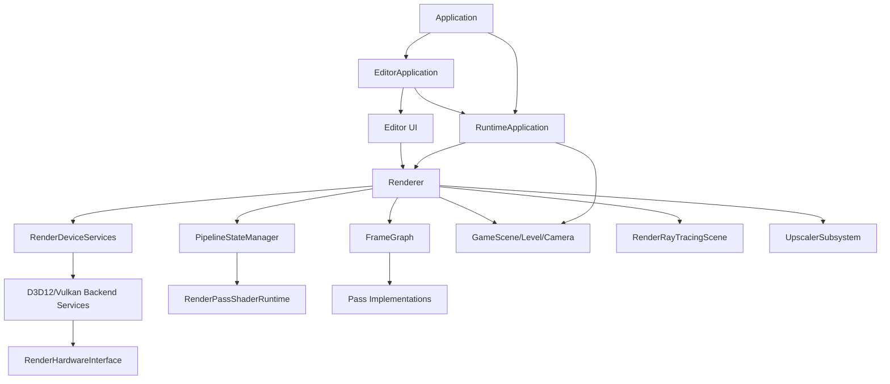
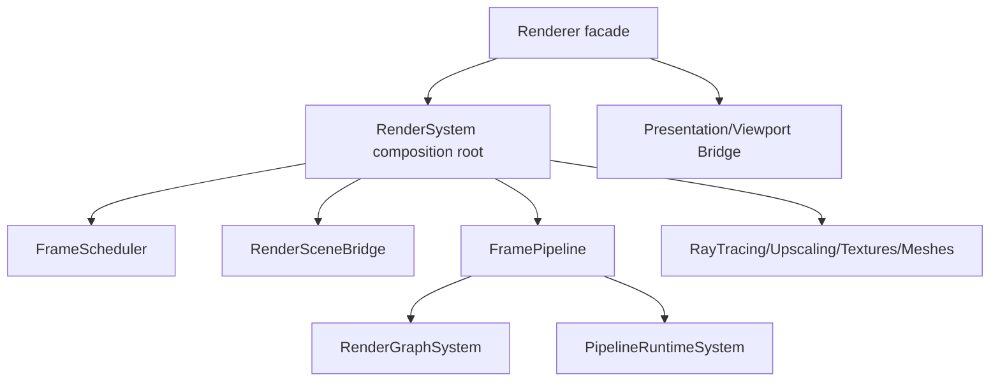
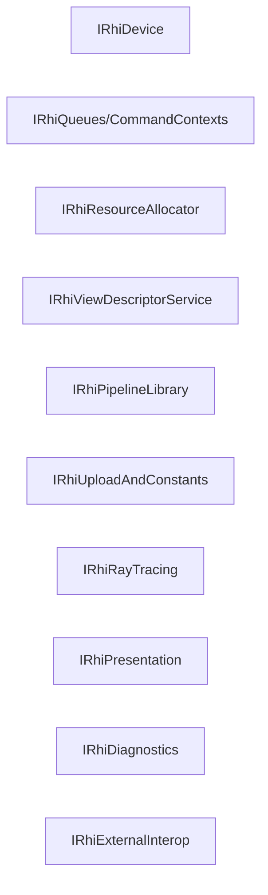
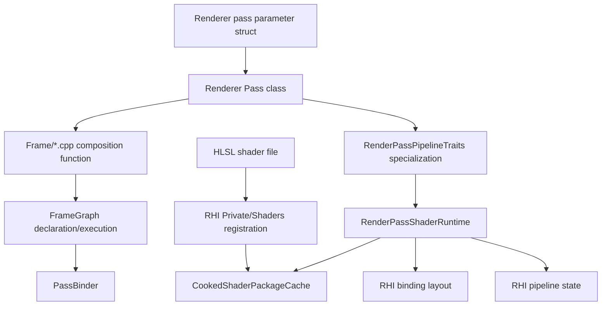
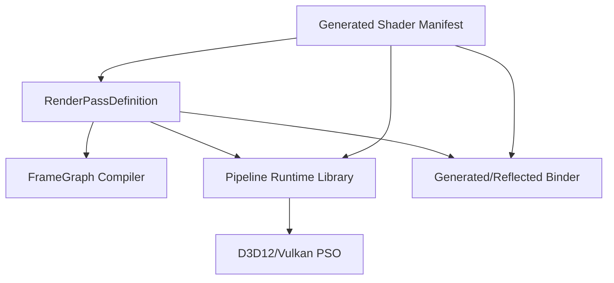
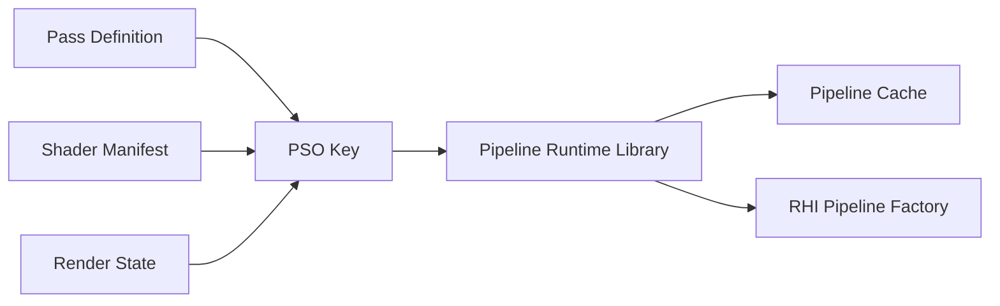
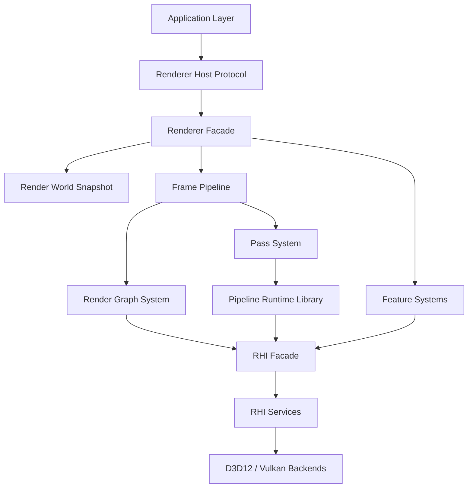

# Renderer/RHI System Hierarchy Strategy

Status: strategic architecture analysis draft  
Date: 2026-06-12  
Companion docs:

- `docs/plans/rhi-renderer-architecture-review.md`
- `docs/plans/architecture-review-acceptance-rubric.md`

## Purpose

This document studies the hierarchy and edges between Application, Renderer, RHI, D3D12, Vulkan, frame graph, ray tracing, shader runtime, and PSO handling.

The end state we want:

- Easier to reason about.
- Easier to extend.
- Easier to maintain.
- Less bug-prone.
- Recognizable to external graphics reviewers.
- Less manual technical ceremony to add a shader pass.

This is a strategic pass, not a small refactor plan.

## Evidence Inventory

Local file inventory:

| Area | Files | Lines | Notes |
| --- | ---: | ---: | --- |
| `Engine/Application` | 32 | 3,734 | Runtime/editor lifecycle, shader recook, smoke validation. |
| `Engine/Renderer` | 231 | 21,724 | Frame graph, frame orchestration, passes, pipeline runtime, ray tracing, textures, upscaling. |
| `Engine/RHI` | 196 | 32,120 | Public contracts, shader authoring/runtime cache, D3D12 backend, Vulkan backend. |

Largest hotspot files from local inspection:

| File | Lines | Architectural meaning |
| --- | ---: | --- |
| `Engine/RHI/Private/D3D12/D3D12RenderHardwareInterface.cpp` | 1,697 | Backend facade implements too many RHI responsibilities. |
| `Engine/RHI/Private/Vulkan/VulkanRenderHardwareInterface.cpp` | 1,532 | Same role on Vulkan side. |
| `Engine/RHI/Private/Vulkan/Commands/VulkanRenderCommandList.cpp` | 1,185 | Command encoding and state translation density. |
| `Engine/RHI/Private/Shaders/CookedShaderPackageCache.cpp` | 1,116 | Shader package/runtime loading complexity. |
| `Engine/RHI/Private/Vulkan/Memory/VulkanGpuMemoryAllocator.cpp` | 1,055 | Vulkan allocation/resource ownership complexity. |
| `Engine/Renderer/Private/Upscaling/NvidiaDlss/StreamlineDlssRuntime.cpp` | 765 | Vendor integration and native interop complexity. |
| `Engine/Application/Private/Validation/RhiSmokeEditorValidation.cpp` | 756 | Validation knows backend-specific details. |
| `Engine/Renderer/Private/Renderer.cpp` | 644 | Central orchestration hub with many responsibilities. |
| `Engine/Renderer/Private/Pipeline/PassBinder.cpp` | 461 | Shader parameter binding complexity. |
| `Engine/Renderer/Private/Pipeline/RenderPassShaderRuntime.h` | 377 | Runtime PSO/shader package construction complexity. |
| `Engine/Renderer/Private/Passes/ShaderPass.h` | 368 | Pass authoring abstraction complexity. |

Observed include/module edge counts from local scan:

| Edge | Count | Interpretation |
| --- | ---: | --- |
| Application -> Renderer | 2 | Expected high-level ownership. |
| Application -> RHI | 4 | Acceptable only for validation/host presentation boundaries; should be watched. |
| Renderer -> RHI | 121 | Expected, but should route through stable contracts. |
| Renderer -> GameFramework | 34 | Expected while renderer consumes scene/camera/level data; should ideally pass through render snapshots. |
| RHI -> Renderer | 1 | Architectural violation; RHI includes renderer-private pass data. |

Concrete boundary violations or exceptions:

- `Engine/RHI/Private/Shaders/DirectLightingShaders.cpp` includes `Renderer/Private/RayTracing/RayTracedShadowUniformData.h`.
- `Engine/Application/Private/Validation/RhiSmokeEditorValidation.cpp` contains direct D3D12 capture code using `ID3D12Device`, `ID3D12CommandQueue`, and `ID3D12Resource`. This may be acceptable as temporary validation code, but architecturally it should move behind RHI capture/readback services or a backend-owned validation helper.

## Current System Hierarchy

Observed runtime hierarchy:



What this means:

- `RuntimeApplication` owns the main engine loop lifecycle.
- `EditorApplication` drives a host-frame split: prepare renderer, record renderer, bind editor viewport output, render UI, submit.
- `Renderer` is the primary orchestration hub.
- `RenderDeviceServices` selects and owns backend services.
- `RenderHardwareInterface` is the backend facade exposed to renderer systems.
- `FrameGraph` owns pass declaration, compile, resource resolution, and execution.
- `PipelineStateManager` lazily creates per-pass runtime objects.

## Current Renderer Responsibilities

`Renderer.cpp` currently owns or coordinates:

- backend creation
- pipeline state manager creation
- GPU mesh cache creation
- texture manager creation
- material cache creation
- render scene data builder
- camera update
- per-view/temporal/light builders
- scene snapshot capture
- scene render state coordination
- ray tracing capability reporting
- ray tracing scene creation and TLAS binding
- DLSS/upscaler capability setup
- memory monitor and frame diagnostics
- frame graph creation/recreation
- resize handling
- frame context construction
- frame graph setup/compile/execute
- present product publishing for editor
- render product state transitions for editor UI
- GPU timing publishing

This is too much for one class if the target is external-review clarity.

Pattern currently used:

- `Renderer` is acting as a Facade plus Composition Root plus Frame Scheduler plus feature coordinator.

Risk:

- Any feature change tends to touch the central hub.
- Lifetime and ownership are hard to audit.
- Editor-host requirements leak into renderer product/state transition APIs.

Target direction:



Acceptance criteria:

- `Renderer` becomes a thin facade with a stable public API.
- Frame lifecycle is owned by a dedicated frame scheduler/pipeline object.
- Feature systems have explicit ownership and lifecycle.
- Editor presentation integration moves behind a presentation/viewport bridge, not arbitrary render product transitions.

## Current RHI Responsibilities

`RenderHardwareInterface` currently includes device, resources, descriptors, constants, ray tracing, swap chain, diagnostics, capture, native interop, and present helpers.

Pattern currently used:

- Facade.
- Service Locator.
- Adapter over backend implementations.

Risk:

- Interface bloat makes changes easy to add but hard to review.
- New feature pressure tends to add one more method to the root facade.
- Backend implementation files become massive because they implement every responsibility in one class.

Target direction:



Do not extract all of these immediately. First classify existing methods, then extract one boundary at a time.

Acceptance criteria:

- Every RHI method has a responsibility category.
- Backend `RenderHardwareInterface.cpp` files shrink because responsibilities move to backend-owned services.
- Renderer feature code can name the exact RHI service it needs.

## System Edge Review

### Application -> Renderer

Current:

- `RuntimeApplication` owns renderer lifecycle.
- `EditorApplication` reaches into renderer for host-frame split, ImGui renderer, diagnostics, viewport products, shader package generation, and render product transitions.

Strength:

- Editor reuse of runtime application is simple.
- Host-frame split exists and is useful.

Risk:

- Editor application knows too much about render product state transitions and RHI presentation.
- UI presentation logic depends on renderer internals.

Target:

- Application should call `Renderer::BeginFrame`, `Renderer::RenderViewport`, `Renderer::RenderOverlay`, `Renderer::EndFrame`, or a similar host-facing protocol.
- Editor should receive a viewport texture handle through a presentation contract, not manually transition frame graph resources.

### Renderer -> GameFramework

Current:

- Renderer directly uses `GameScene`, level/camera concepts, scene mesh components, and snapshots.
- `SceneRenderStateCoordinator` mediates some lifetime transitions.

Strength:

- Existing scene integration is straightforward.

Risk:

- Renderer may become coupled to gameplay scene internals.
- More scene types will increase renderer knowledge.

Target:

- GameFramework exports immutable render snapshots.
- Renderer consumes only render-domain DTOs: meshes, materials, cameras, lights, animations, skinning, instances.

### Renderer -> RHI

Current:

- Renderer calls RHI directly for resources, descriptors, constants, frame command lists, present, native interop, diagnostics, ray tracing.

Strength:

- No backend-private includes in normal renderer paths, excluding NVIDIA DLSS provider using SDK headers.

Risk:

- RHI facade is too broad, so renderer systems have no precise dependency declaration.

Target:

- Renderer dependencies should be more explicit: graph resources need resource/view services, pass runtime needs pipeline services, ray tracing scene needs ray tracing service, upscaler needs interop service.

### RHI -> Renderer

Current:

- One known violation: RHI shader registration includes renderer-private direct lighting shadow uniform data.

Target:

- Zero RHI-to-Renderer includes.
- Shader registration should be moved to renderer, or shader authoring should be moved to a neutral lower module.

### Application Validation -> Backend APIs

Current:

- Smoke validation has direct D3D12 code for capture.

Target:

- Validation should use RHI capture/readback services.
- Backend-specific validation can exist, but it should be owned by backend modules or a clearly marked test-only adapter.

## Current Design Patterns

| Pattern | Where It Appears | Value | Risk |
| --- | --- | --- | --- |
| Facade | `Renderer`, `RenderHardwareInterface`, `RenderDeviceServices` | Simple top-level API. | Facades are growing into service locators. |
| Factory | `RenderDeviceServices::Create`, `FrameGraphFactory`, texture factories | Centralized construction. | Factories can hide ownership and policy. |
| Builder | `FrameGraphBuilder`, `PassResourceBuilder`, `ShaderParameterStructBuilder`, frame data builders | Good for staged construction. | Too many builders can make pass authoring ceremonial. |
| Adapter | D3D12/Vulkan backends implementing RHI contracts | Good backend isolation. | Root interface is too wide, so adapters are large. |
| Command | `RenderCommandList`, `RenderCommandContext` | Good GPU command abstraction. | Command context and RHI command list split needs clearer ownership. |
| Registry/Cache | `CookedShaderPackageCache`, `PipelineStateManager`, mesh/material caches | Good for runtime reuse. | Cache invalidation and lazy creation paths need stronger contracts. |
| CRTP / static polymorphism | shader registration/pass metadata patterns | Compile-time metadata is powerful. | Harder for new pass authors; error messages/ceremony are high. |
| Strategy | upscaler providers, backend selection | Good pluggability. | Provider contracts need stronger RHI interop boundaries. |
| RAII | many `unique_ptr`, backend object ownership, scoped diagnostics | Good lifetime safety. | Some backend native resource lifetime still centralized in massive classes. |

Missing or underdeveloped patterns:

- Decision records for architectural changes.
- Layer-enforcing dependency checks.
- A stable render feature/plugin boundary.
- A PSO library/cache abstraction separate from pass traits.
- A declarative pass definition format that reduces manual pass ceremony.
- A presentation/viewport contract between renderer and editor/application.

## Shader Pass and PSO Handling: Current Flow

Adding or modifying a shader pass currently touches many concepts:



Observed pain:

- Shader package declaration is duplicated across RHI shader registration and renderer pass `DescribeShaderPackage`.
- Pass parameters are described manually in C++.
- Pass resources are declared manually.
- Pipeline traits are manually specialized in one central file.
- `RenderPassShaderRuntime` performs validation, layout creation, package loading, capability checks, and PSO construction.
- `PassBinder` knows every binding category and frame graph resolution path.
- The pass author needs to understand frame graph handles, shader parameter metadata, runtime traits, cooked package IDs, binding layout IDs, resource usages, and PSO descriptors.

This is the area most ready for a strategic redesign.

## Target Shader Pass Model

Target principle:

> A pass author should describe intent. The renderer runtime should derive binding layout, resource declarations, PSO descriptors, validation, and most binding behavior.

Possible target flow:



Proposed abstractions:

- `RenderPassDefinition`: pass name, shader package, pipeline kind, render state, resource intent, dispatch/draw behavior.
- `ShaderManifest`: generated/cooked reflection data and package metadata.
- `PipelineRuntimeLibrary`: owns lazy/eager PSO creation, reload, variants, and cache keys.
- `PassResourceBinder`: generated or reflection-driven binder, replacing most manual per-binding branching in pass code.
- `RenderGraphPassBuilder`: combines pass resource declarations and pass runtime lookup from one definition.

Desired authoring experience:

```cpp
SPARKLE_RENDER_PASS(DirectLighting)
{
    Shader("Passes/Deferred/DirectLighting.hlsl").Compute("main");
    Requires(Feature::InlineRayQuery, Feature::AccelerationStructure);

    Reads(GBuffer.BaseColor, GBuffer.Normal, GBuffer.Material, GBuffer.DeviceZ);
    Reads(Scene.Tlas);
    Writes(Lighting.DirectDiffuse, Lighting.DirectSpecular, Lighting.DirectSubsurface);

    Dispatch2D(SceneExtent, 8, 8);
}
```

This is illustrative, not an immediate API commitment.

Acceptance criteria for a redesigned pass system:

- Adding a simple compute pass requires one pass definition file and one shader file.
- Adding a simple raster pass requires one pass definition file, one or two shader files, and a render-state description.
- No central `RenderPassPipelineTraits` file must be edited for ordinary passes.
- Shader package ID and binding layout ID have one source of truth.
- PSO cache keys are explicit and inspectable.
- Shader reload invalidates only affected runtimes when possible.
- Pass validation errors mention pass name, shader file/package, binding name, expected type, actual type, backend, and suggested fix.

## PSO Runtime Concerns

Current PSO runtime model:

- `PipelineStateManager` lazily creates pass runtimes by C++ type.
- Runtime storage is keyed by `std::type_index`.
- `RenderPassPipelineTraits<TPass>` creates runtime storage for each pass.
- `RenderPassShaderRuntime` loads cooked package, builds binding layout, checks features, and creates PSO.
- Raster variants such as wireframe/two-sided are stored in runtime storage.

Strength:

- Lazy creation avoids upfront cost.
- Type safety is decent for existing passes.
- Shader reload clears all runtime storage.

Risks:

- `std::type_index` cache key is not a complete PSO key.
- Variants are hardcoded into trait logic.
- Central trait specialization does not scale with many passes.
- Shader reload invalidates everything.
- Runtime construction blends package loading, validation, binding layout, and PSO creation.
- There is no visible PSO library concept similar to what external reviewers expect.

Target PSO architecture:



Acceptance criteria:

- PSO key includes backend, shader package generation/hash, pipeline kind, render targets, depth format, raster/depth/blend state, vertex layout, feature/permutation bits.
- PSO creation and shader package loading are separate responsibilities.
- Runtime logs can print the full PSO key.
- Shader reload invalidation is based on package generation/hash, not only "clear everything."
- D3D12 and Vulkan PSO creation paths receive equivalent normalized descriptors.

## Target Hierarchy

Strategic target:



Layer responsibilities:

| Layer | Owns | Must not own |
| --- | --- | --- |
| Application | main loop, editor/runtime mode, host protocol | frame graph internals, backend API objects |
| Renderer Facade | public renderer API, lifecycle boundary | detailed pass binding, backend resource creation |
| Render World Snapshot | renderable scene DTOs | gameplay component internals |
| Frame Pipeline | per-frame sequence and feature composition | backend-specific command encoding |
| Render Graph System | pass/resource graph, barriers, transient resources | pass-specific shader logic |
| Pass System | pass definitions, draw/dispatch intent | shader package cache internals |
| Pipeline Runtime Library | shader package loading, PSO keys, PSO cache | frame graph resource ownership |
| Feature Systems | textures, meshes, ray tracing, upscaling | root renderer lifecycle |
| RHI Facade | stable GPU service access | renderer concepts |
| RHI Backends | API-specific device/resources/descriptors/PSO/commands | renderer pass policy |

## Strategic Refactor Tracks

### Track 1: Enforce Layer Direction

Goal:

- Stop architectural drift before moving systems.

Actions:

- Add forbidden include checks.
- Move renderer-specific shader registration out of RHI.
- Remove direct D3D12 capture code from application validation or wrap it behind RHI/test backend services.

Acceptance:

- `RHI -> Renderer` edge count is zero.
- Application validation does not include D3D12/Vulkan native headers except in explicitly backend-owned test helpers.

### Track 2: Write System Ownership Docs

Goal:

- Make hierarchy visible to external reviewers.

Actions:

- Add `docs/architecture/rendering-system-map.md`.
- Add `docs/architecture/rhi-contract-map.md`.
- Add `docs/architecture/pass-authoring-contract.md`.
- Add `docs/architecture/pipeline-runtime-contract.md`.

Acceptance:

- Every renderer/RHI folder has a stated owner responsibility.
- Every major runtime object has a lifecycle owner.

### Track 3: Decompose Renderer Orchestration

Goal:

- Reduce `Renderer.cpp` centrality.

Candidate extraction:

- `RendererSystemRoot`: owns subsystem construction.
- `FramePipeline`: owns begin/setup/record/submit/end frame.
- `ViewportPresentationBridge`: owns editor/runtime output products and transitions.
- `RenderFeatureRegistry`: owns ray tracing/upscaling feature service wiring.

Acceptance:

- `Renderer.cpp` becomes a facade with stable host-facing methods.
- Frame execution can be diagrammed without reading `Renderer.cpp`.

### Track 4: Build RHI Method Ownership Table

Goal:

- Prepare for safe RHI interface extraction.

Actions:

- Classify every `RenderHardwareInterface` method.
- Map callers.
- Identify first extraction seam.

Recommended first extraction seam:

- Native interop and capture/readback, because they are currently feature/validation pressure points.

Acceptance:

- No new methods are added to root RHI without category and owner.

### Track 5: Redesign Pass/PSO Runtime

Goal:

- Make pass authoring dramatically simpler and PSO handling reviewable.

Actions:

- Introduce pass definition concept in parallel with current pass system.
- Introduce explicit `PipelineRuntimeLibrary` and `PipelineKey`.
- Generate or derive binding/resource declarations from shader/pass metadata where possible.
- Keep old path while migrating one pass as a proof.

Recommended proof pass:

- `VisualizeBuffers` or `ComputeClear` first, because they are simpler than `GBuffer`.

Acceptance:

- A simple compute pass can be added without editing a central trait file.
- Runtime logs show package, binding layout, backend, and PSO key.

### Track 6: Backend Parity and Validation

Goal:

- Make D3D12/Vulkan parity a managed product quality, not a manual screenshot ritual.

Actions:

- Move capture/readback behind RHI.
- Add normal/lit/debug view captures for both backends.
- Add frame graph warning failure policy for development smoke.
- Add PSO creation/runtime diagnostics to smoke report.

Acceptance:

- Backend parity report exists per smoke run.
- DLSS/RT/frame graph/PSO state is visible in the report.

## Proposed Acceptance Gates For Strategic Changes

Any strategic renderer/RHI change must include:

- System owner statement.
- Dependency edge impact.
- Runtime lifecycle impact.
- PSO/shader package impact.
- D3D12/Vulkan parity impact.
- Diagnostics/validation plan.
- Rollback plan.

Use `docs/plans/architecture-review-acceptance-rubric.md` to score the proposal.

## Immediate Next Decision

Recommended next session:

1. Build `rhi-contract-map.md`.
2. Build `pass-authoring-contract.md`.
3. Add forbidden include checks.

Why:

- These are low-risk.
- They make future refactors measurable.
- They directly address hierarchy, PSO complexity, and external reviewability without prematurely rewriting working code.

## Non-Goals

- Do not rewrite the whole renderer in one pass.
- Do not split RHI interfaces before method ownership is mapped.
- Do not replace frame graph before its current contract is documented.
- Do not generalize PSO runtime until one proof pass validates the model.

## Summary Judgment

Sparkle already has many serious-engine ingredients: backend split, frame graph, shader metadata, ray tracing ownership, diagnostics, and vendor upscaler integration.

The main weakness is not absence of systems. It is that too many systems are connected through broad facades and manual ceremonies:

- `Renderer` is too central.
- `RenderHardwareInterface` is too broad.
- shader pass authoring requires touching too many places.
- PSO runtime lacks a clear library/key model.
- a few dependency edges violate the intended layer hierarchy.

The strategic goal should be to preserve the working engine while making ownership explicit, then extract responsibilities in thin, reviewable slices.
