# Sparkle RHI and Renderer Architecture Review

Status: strategic system-design review draft
Date: 2026-06-12
Scope: `Engine/RHI`, `Engine/Renderer`, D3D12, Vulkan, ray tracing, frame graph, DLSS/upscaling integration

Companion rubric:

- `docs/plans/architecture-review-acceptance-rubric.md`

Execution plan:

- `docs/plans/rhi-renderer-review-ready-implementation-plan.md`

Tracked architecture status:

- `docs/architecture/rendering-coverage-status.md`

Reviewer architecture docs:

- `docs/architecture/rendering-glossary.md`
- `docs/architecture/rendering-system-map.md`
- `docs/architecture/rhi-contract-map.md`
- `docs/architecture/frame-graph-contract.md`
- `docs/architecture/ray-tracing-contract.md`
- `docs/architecture/pass-authoring-contract.md`
- `docs/architecture/pipeline-runtime-contract.md`

## Goal

Make SparkleEngine easier to review as a serious renderer/RHI implementation by NVIDIA, AMD, or similar graphics engineers.

This document is not a refactor checklist yet. It is a decision aid: what exists, what is unclear, what good public repositories appear to do, how Sparkle's systems currently connect, and what acceptance criteria we should use before moving files or changing APIs.

The desired end state:

- Easier to reason about.
- Easier to extend.
- Easier to maintain.
- Less bug-prone.
- Recognizable to external graphics reviewers.
- Less manual technical ceremony to add a shader pass.

## External Reference Repositories

These are used as comparison anchors, not as templates to copy blindly.

- NVIDIA Donut: https://github.com/NVIDIA-RTX/Donut
- NVIDIA NVRHI: https://github.com/NVIDIAGameWorks/nvrhi
- NVIDIA Falcor: https://github.com/NVIDIAGameWorks/Falcor
- AMD Cauldron: https://github.com/GPUOpen-LibrariesAndSDKs/Cauldron
- AMD FidelityFX SDK: https://github.com/GPUOpen-LibrariesAndSDKs/FidelityFX-SDK

Observed source-tree patterns:

- Donut splits `app`, `core`, `engine`, and `render`, and carries `nvrhi` as the graphics abstraction layer.
- NVRHI is a focused graphics API abstraction library rather than a full renderer.
- Falcor exposes clear top-level systems such as `RenderGraph`, `RenderPasses`, `Rendering`, `Scene`, and `Core/API`.
- Cauldron visibly separates `src/common`, `src/DX12`, and `src/VK`, keeping backend code obvious from the folder tree.

## Current Sparkle Map

Current rough file count from local inventory:

- `Engine/Application`: 32 C++ files, 3,734 lines.
- `Engine/RHI`: 196 C++ files, with 44 public and 152 private/backend files.
- `Engine/Renderer`: 231 C++ files, with 27 public and 204 private files.
- `RenderHardwareInterface.h`: 154 lines, 68 virtual declarations.
- `RenderCommandList.h`: 87 lines, 40 virtual declarations.

Largest hotspot files from local inspection:

| File | Lines | Architectural meaning |
| --- | ---: | --- |
| `Engine/RHI/Private/D3D12/D3D12RenderHardwareInterface.cpp` | 1,697 | Backend facade implements too many RHI responsibilities. |
| `Engine/RHI/Private/Vulkan/VulkanRenderHardwareInterface.cpp` | 1,532 | Same role on Vulkan side. |
| `Engine/RHI/Private/Vulkan/Commands/VulkanRenderCommandList.cpp` | 1,185 | Command encoding and state translation density. |
| `Engine/RHI/Private/Shaders/CookedShaderPackageCache.cpp` | 1,116 | Shader package/runtime loading complexity. |
| `Engine/RHI/Private/Vulkan/Memory/VulkanGpuMemoryAllocator.cpp` | 1,055 | Vulkan allocation/resource ownership complexity. |
| `Engine/Renderer/Private/Upscaling/NvidiaDlss/StreamlineDlssRuntime.cpp` | 765 | Vendor integration and native interop complexity. |
| `Engine/Application/Private/Validation/RhiSmokeEditorValidation.cpp` | 756 | Validation knows backend-specific details. |
| `Engine/Renderer/Private/Renderer.cpp` | 644 | Central orchestration hub with many responsibilities. |
| `Engine/Renderer/Private/Pipeline/PassBinder.cpp` | 461 | Shader parameter binding complexity. |
| `Engine/Renderer/Private/Pipeline/RenderPassShaderRuntime.h` | 377 | Runtime PSO/shader package construction complexity. |
| `Engine/Renderer/Private/Passes/ShaderPass.h` | 368 | Pass authoring abstraction complexity. |

Observed include/module edge counts from local scan:

| Edge | Count | Interpretation |
| --- | ---: | --- |
| Application -> Renderer | 2 | Expected high-level ownership. |
| Application -> RHI | 4 | Acceptable only for validation/host presentation boundaries; should be watched. |
| Renderer -> RHI | 121 | Expected, but should route through stable contracts. |
| Renderer -> GameFramework | 34 | Expected while renderer consumes scene/camera/level data; should ideally pass through render snapshots. |
| RHI -> Renderer | 1 | Architectural violation; RHI includes renderer-private pass data. |

Concrete boundary violations or exceptions:

- `Engine/RHI/Private/Shaders/DirectLightingShaders.cpp` includes `Renderer/Private/RayTracing/RayTracedShadowUniformData.h`.
- `Engine/Application/Private/Validation/RhiSmokeEditorValidation.cpp` contains direct D3D12 capture code using `ID3D12Device`, `ID3D12CommandQueue`, and `ID3D12Resource`. This may be acceptable as temporary validation code, but architecturally it should move behind RHI capture/readback services or a backend-owned validation helper.

## Whole-Codebase Coverage Audit

This section is the "no subsystem left behind" checklist. The goal is not to refactor everything at once. The goal is to ensure every Renderer/RHI code area is evaluated against the same quality bar before we call the architecture designed as a whole.

Coverage rule:

- Every folder must have a named responsibility.
- Every folder must have an owner layer.
- Every folder must have a target contract.
- Every folder must have acceptance evidence.
- Any folder that cannot be explained in this table is architectural debt.

### Renderer Private Coverage

| Area | Files / lines | Current responsibility | Current evaluation | Target quality bar / acceptance evidence |
| --- | ---: | --- | --- | --- |
| `Renderer.cpp` root orchestration | 1 / 644 | Renderer lifecycle, subsystem construction, frame execution, presentation products, diagnostics. | Too central; currently acts as facade, composition root, frame scheduler, feature coordinator, and editor bridge. | Split responsibilities into facade, system root, frame pipeline, feature systems, and presentation bridge. Reviewer can diagram frame execution without reading the whole file. |
| `Camera` | 2 / 96 | Render camera data and view/projection behavior. | Small and readable, but camera/depth/API convention must be proven by D3D12/Vulkan parity because previous bugs showed backend convention drift. | Document handedness, clip/depth convention, jitter placement, and projection ownership. Lit/normal captures match across backends. |
| `Commands` | 2 / 311 | Renderer command context wrapper over RHI command recording. | Useful boundary, but ownership between renderer command context and RHI command list needs sharper vocabulary. | Renderer commands express render intent; RHI commands express GPU/API operations. No backend-specific behavior leaks upward. |
| `Debug` | 1 / 7 | Renderer CVars implementation. | Tiny area; mostly fine. | Debug CVars documented in renderer diagnostics/readme and stable across backend smoke runs. |
| `Denoising` | 0 / 0 | Placeholder/private folder. | Empty folder creates uncertainty. | Either remove, or add a short doc/contract explaining planned denoiser ownership and relationship to ray-traced shadows/upscalers. |
| `Diagnostics` | 8 / 971 | Frame/pass execution diagnostics, mesh diagnostics, renderer memory monitor. | Strong direction; should become more central to acceptance evidence. | Smoke report includes diagnostics summary, GPU markers, memory state, frame graph warnings, and backend capability status. |
| `Frame` | 42 / 1,176 | Per-frame builders, pass composition, targets, presentation, temporal state, ray tracing scene frame data. | Good modular split, but naming must make orchestration-only responsibility explicit. | `Frame/*` only wires frame graph passes/resources. Pass binding/execution logic stays in `Passes`/`Pipeline`. Entry points follow `Add*FramePasses` style or equivalent. |
| `FrameGraph` | 44 / 5,081 | Pass/resource declaration, compile, dependencies, external resources, ray tracing registration, transient allocation, barriers, execution, diagnostics. | Most important renderer system. Promising but must become a formally documented contract because unresolved resource warnings existed. | Frame graph contract doc covers declare/compile/plan/resolve/execute. Development smoke fails unresolved handles. Transient aliasing and barrier plans are diagnosable. |
| `Meshes` | 8 / 354 | GPU mesh resources, upload descriptors, skin influence buffers, mesh cache. | Reasonably cohesive; needs clearer boundary with scene snapshots/material cache. | Mesh cache accepts render-domain DTOs and produces RHI resources. Upload lifetime, buffer ownership, and skinning data flow are documented. |
| `Passes` | 19 / 2,200 | Concrete pass implementations and draw/dispatch helpers. | Correct ownership for pass logic, but pass authoring is too ceremonial and depends on central traits/runtime mechanics. | Ordinary pass addition requires one pass definition and shader files, no RHI edits, no central trait edits. Pass errors mention pass/shader/binding/backend. |
| `Pipeline` | 8 / 1,231 | Pass binding, runtime storage, pipeline traits, shader runtime integration. | High-leverage complexity. Needs explicit PSO key/library model and separation between package loading, binding layout, validation, and PSO creation. | `PipelineRuntimeLibrary` owns explicit PSO keys and cache invalidation. D3D12/Vulkan receive equivalent normalized descriptors. Logs print complete PSO key. |
| `RayTracing` | 20 / 997 | BLAS cache, TLAS builder, RT scene, shadow settings, diagnostics, shadow pass data. | Mostly well bounded, but names blur scene ownership, pass services, and shadow-specific data. | Ray tracing contract explains BLAS/TLAS lifetime, frame graph AS import/binding, pass services, and shadow uniform ownership. No backend-private includes. |
| `SceneData` | 20 / 1,138 | Render scene data builders, mesh/material snapshots, lifecycle coordination, light/material DTOs. | Important boundary between GameFramework and Renderer. Needs stricter DTO/snapshot identity. | Renderer consumes immutable render snapshots, not gameplay internals. Material/mesh/light data contracts are stable and documented. |
| `Temporal` | 2 / 116 | Temporal jitter patterns. | Small but central to DLSS/TAA/debug parity. | Jitter convention, reset rules, motion-vector relation, and native-resolution/DLSS behavior are documented and validated. |
| `Textures` | 5 / 585 | Cooked texture loading, defaults, texture manager. | Cohesive; needs diagnostics and lifetime ownership tied to RHI resources. | Texture manager contract covers cooked asset input, default fallback, residency/lifetime, and diagnostic output. |
| `Upscaling` | 21 / 2,028 | Upscaler abstraction, input contract, DLSS provider/runtime, passthrough provider, startup diagnostics. | Correct feature/provider separation; native interop contract is the sensitive area. | Provider owns vendor SDK details. RHI owns native handles/layouts. Capability failures are actionable. D3D12/Vulkan DLSS smoke shows active provider or deterministic fallback. |

### Renderer Public Coverage

| Area | Files / lines | Current responsibility | Current evaluation | Target quality bar / acceptance evidence |
| --- | ---: | --- | --- | --- |
| `Renderer.h` / `RendererAPI.h` | 2 public root files | Public renderer lifecycle/API. | Needs to remain narrow as internals are decomposed. | Public API reads as host protocol, not internal subsystem access. Editor/application use stable methods. |
| `Debug` | 2 / 29 | View modes and renderer CVars. | Important because debug view modes are acceptance evidence. | View modes work on both D3D12 and Vulkan. Debug mode list is documented and smoke-tested. |
| `Denoising` | 1 / 50 | Shadow denoise contract. | Public contract exists while private implementation area is empty. | Either implement/route denoising ownership or mark as future contract with exact integration point. |
| `Diagnostics` | 1 / 58 | Renderer memory diagnostics. | Good public diagnostic surface. | Memory diagnostics are emitted in smoke reports and tied to RHI memory diagnostics. |
| `FrameGraph` | 7 / 122 | Public frame graph handles/descs. | Useful, but must avoid leaking implementation. | Public types are stable handles/descs only. Compiler/execution internals stay private. |
| `Meshes` | 1 / 67 | Mesh diagnostics. | Narrow and fine. | Diagnostic schema documented and used by smoke/tools. |
| `Resources` | 2 / 65 | Public texture/default texture diagnostics. | Fine if kept diagnostic/resource-contract oriented. | Resource diagnostics expose health without leaking backend objects. |
| `SceneData` | 5 / 95 | Render-domain light/mesh/classification DTOs. | Good boundary candidate with GameFramework. | DTOs are immutable frame inputs and do not expose gameplay internals. |
| `ShaderParameters` | 4 / 1,079 | Shader parameter fields/builders/typed instances. | Large public surface; overlaps RHI shader parameter concepts and needs ownership decision. | Decide whether this belongs in Renderer, RHI, or neutral shader-authoring module. Pass-specific parameters must not force RHI dependencies upward/downward. |
| `Shaders` | 1 / 21 | Shader reload result. | Small but connected to pipeline runtime. | Reload result includes enough evidence for affected packages/runtimes and backend invalidation. |
| `Viewport` | 1 / 204 | Viewport contracts/presentation. | Important editor/application boundary. | Editor receives viewport products via presentation contract, not ad hoc frame graph transitions. |

### RHI Public Coverage

| Area | Files / lines | Current responsibility | Current evaluation | Target quality bar / acceptance evidence |
| --- | ---: | --- | --- | --- |
| `Device` | 2 / 187 | `RenderHardwareInterface`, `RenderDeviceServices`. | Root RHI facade is too broad and backend implementations are too large. | Every method categorized by owner service. New methods require category, caller, and backend parity note. |
| `Commands` | 1 / 83 | RHI command-list interface. | Central contract, should remain GPU/API level. | Command list exposes explicit resource state, draw/dispatch/copy/RT build operations with no renderer pass concepts. |
| `Resources` | 8 / 529 | RHI texture/resource descriptors, views, constants, uploads. | Core abstraction surface. Must be exact and backend-neutral. | Resource descriptors map cleanly to D3D12/Vulkan. State/layout/view/subresource rules are documented. |
| `Pipeline` | 1 / 143 | Pipeline state descriptions. | Needs to become part of explicit PSO key/runtime model. | Pipeline desc is normalized and sufficient for both D3D12 and Vulkan PSO creation. |
| `Shaders` | 9 / 1,505 | Cooked packages, reflection, bytecode, package layout, authoring primitives. | Valuable infrastructure, but renderer pass registration currently lives in RHI private code. | RHI shader public types are generic package/reflection/runtime primitives only. Renderer-specific pass declarations live above RHI. |
| `ShaderParameters` | 2 / 258 | Parameter layout and semantics. | Potential overlap with Renderer public shader parameters. | Ownership decision made: lower shared shader-authoring primitives vs renderer pass parameter authoring. No circular dependency. |
| `Bindings` | 1 / 30 | Binding set public type. | Small surface; tied to descriptor/pipeline model. | Binding sets are backend-neutral and validated against reflection/layout. |
| `Descriptors` | 1 / 36 | Descriptor handle abstractions. | Thin and likely okay. | Handle lifetime and shader-visible/CPU-only distinction documented. |
| `Formats` | 2 / 152 | Pixel/compare formats. | Core API translation surface. | Format support matrix exists for D3D12/Vulkan, including depth/stencil and sRGB rules. |
| `Interop` | 2 / 105 | Native handles/resource state for external SDKs. | Necessary but risky catch-all. | Interop structs are consumer-scoped, documented by DLSS/FSR/etc., and filled deterministically by backends. |
| `Memory` | 2 / 111 | RHI memory diagnostics/types. | Good diagnostic surface. | Backend allocation stats map to common categories and show in smoke reports. |
| `RayTracing` | 1 / 47 | Generic ray tracing descriptors. | Good narrow RHI contract. | Descs expose GPU/API concepts only: AS geometry/build/prebuild/scratch/result. No renderer shadow/pass concepts. |
| `Samplers` | 1 / 44 | Sampler descriptors. | Small and appropriate. | Sampler desc maps equivalently to both backends and has default library policy. |
| `Textures` | 1 / 57 | Cooked texture asset contract. | Possible RHI/asset boundary concern. | Keep runtime GPU upload contract here; source import/cook stays in tools. |
| `Diagnostics` | 1 / 112 | RHI diagnostic contract. | Important for external review. | Backend debug layers, markers, names, errors, and capability logs flow through this surface. |
| `Validation` | 1 / 46 | RHI validation entry points. | Useful but should grow into mechanical guardrails. | Validation covers resource descs, RT descs, binding layout compatibility, and backend feature requirements. |
| `Config` / `Core` / `CVars` / `UI` | 7 combined | Backend selection, render config, capabilities, CVars, ImGui surface. | Mostly support surfaces; UI may be too coupled if it grows. | Config/capability contracts are stable. ImGui integration stays behind RHI UI bridge, not renderer internals. |

### RHI Private Common Coverage

| Area | Files / lines | Current responsibility | Current evaluation | Target quality bar / acceptance evidence |
| --- | ---: | --- | --- | --- |
| `Bindings` | 1 / 64 | Binding set implementation. | Small but coupled to descriptor/pipeline validation. | Binding set creation validates against layout/reflection and logs actionable errors. |
| `Config` | 1 / 77 | Depth convention implementation. | Critical for D3D12/Vulkan parity because projection/depth conventions caused visual bugs. | One documented convention for clip space, depth range, reverse-Z if used, viewport Y, and culling/winding interaction. |
| `Core` | 1 / 131 | Backend selection. | Fine if kept policy-only. | Backend selection logs selected API, fallback reason, and feature limits. |
| `CVars` | 1 / 7 | RHI CVars implementation. | Tiny. | RHI CVars documented and not used as hidden architecture switches. |
| `Device` | 5 / 229 | Backend factory/services/capability log formatting. | Good composition boundary. | Backend service creation is the only D3D12/Vulkan selection point. Capability logs are consistent across APIs. |
| `Shaders` | 17 / 1,881 | Builtin/global shader registration, cooked shader package cache/utils, package layout builder, ray tracing metadata validation. | Mixed responsibility: generic shader runtime plus renderer pass declarations. | Split generic shader infrastructure from renderer shader registration. Package cache/layout builder remain backend-neutral. |
| `Validation` | 2 / 256 | RHI validation helpers. | Good foundation. | Validation becomes mandatory in development paths for resource descs, bindings, RT metadata, and unsupported feature use. |

### D3D12 Backend Coverage

| Area | Files / lines | Current responsibility | Current evaluation | Target quality bar / acceptance evidence |
| --- | ---: | --- | --- | --- |
| Root facade and type conversions | 5 root files plus `Device` | D3D12 RHI facade, device services, type conversions, external feature interop. | Large facade mirrors broad public RHI. Type conversions are appropriate backend boundary. | Facade shrinks as services own commands/resources/pipelines/interop. Type conversions remain total and tested for all public enums/descs. |
| `Commands` | 2 | D3D12 command recording. | Core backend correctness area. | Command behavior matches RHI semantics and Vulkan parity for barriers, draw/dispatch, copies, AS builds, debug markers. |
| `Descriptors` | 8 | CPU/GPU descriptor heaps, handles, allocator/manager. | Cohesive backend-specific system. | Descriptor lifetime, shader-visible heap policy, recycling, and failure diagnostics documented. |
| `Diagnostics` | 6 | Debug layer, PIX events, diagnostics. | Strong and review-positive. | Debug names/events/errors appear in captures and smoke reports. |
| `Memory` | 4 | GPU allocation/allocator. | Backend-specific complexity is well placed. | Allocation strategy, alignment, heap type mapping, budget diagnostics, and transient interaction documented. |
| `Pipeline` | 10 | Binding layout, root signature, PSO, vertex layout. | Correct backend ownership; should consume normalized descriptors/PSO keys. | Root signature/PSO creation is deterministic from common descriptors and reflection. No renderer pass policy. |
| `Resources` / `Textures` | 12 | Constant buffers, frame resources, upload buffers, D3D12 textures, texture factory. | Correct backend ownership; constants/upload should be service-owned instead of root facade-owned. | Resource lifetime, state tracking assumptions, upload path, and view creation are documented and validated. |
| `Samplers` | 2 | D3D12 sampler library. | Small and cohesive. | Default sampler set matches Vulkan behavior where possible. |
| `SwapChain` | 2 | D3D12 swap chain. | Correct backend area. | Presentation states, resize, back-buffer lifetime, and editor viewport integration are explicit. |
| `ThirdParty` | 2 | D3DX12 headers. | Acceptable as isolated third-party utility. | Third-party code remains isolated and not edited for engine policy. |
| `UI` | 2 | D3D12 ImGui backend. | Backend-specific UI integration is fine, but public renderer/editor boundary must stay clean. | ImGui path uses RHI UI bridge and does not leak D3D12 objects to application code. |

### Vulkan Backend Coverage

| Area | Files / lines | Current responsibility | Current evaluation | Target quality bar / acceptance evidence |
| --- | ---: | --- | --- | --- |
| Root facade, includes, type conversions | 5 root files plus `Device` | Vulkan RHI facade, device creation, type conversion, feature queries, external interop. | Large facade mirrors broad public RHI; device feature/extension setup is critical for DLSS/RT. | Facade shrinks behind services. Feature/extension enablement logs why each optional capability is enabled. |
| `Commands` | 4 | Vulkan command context/list recording. | High-risk correctness area due to layouts, barriers, descriptor binding, dynamic rendering, and AS builds. | Matches RHI semantics and D3D12 captures for lit/normal/debug modes. Layout transitions and queue ownership are diagnosable. |
| `Core` | 2 | Vulkan result handling. | Good small utility. | Every failed Vulkan call reports context and result string. |
| `Descriptors` | 6 | Descriptor allocation/handles/manager. | Correct backend area; likely central to DLSS/noise/resource binding bugs. | Descriptor set/layout lifetime, pool growth, update validation, and bindless/future policy documented. |
| `Diagnostics` | 8 | Debug layer/events/names/render diagnostics. | Strong review signal. | Validation layer warnings are zero in smoke or classified as known exceptions. Debug names/events present in captures. |
| `Memory` | 4 | Vulkan allocation/allocator. | Backend-specific complexity is well placed. | Memory type selection, alignment, budgets, transient compatibility, and external memory requirements documented. |
| `Pipeline` | 8 | Binding layout, pipeline layout, shader modules, PSO, vertex layout. | Correct backend ownership; most important parity point after command recording. | Consumes normalized pipeline desc/PSO key. Winding/cull/depth/viewport conventions are explicitly mapped from RHI. |
| `Resources` / `Textures` | 8 | Constant buffers, linear allocator, Vulkan texture, texture factory. | Correct backend ownership; external texture view/native metadata needs formal contract. | Image/view/layout/subresource ownership is documented. Native view info is deterministic for DLSS and future SDKs. |
| `Samplers` | 2 | Vulkan sampler library. | Small and cohesive. | Matches common sampler desc behavior and default sampler library. |
| `SwapChain` | 2 | Vulkan swap chain. | Correct backend area. | Present layout, resize, image acquisition, and back-buffer import into frame graph are documented. |
| `UI` | 2 | Vulkan ImGui backend. | Backend-specific UI integration is fine if isolated. | ImGui descriptor/image state handling does not leak into renderer/application policy. |

### Coverage Acceptance Criteria

Sparkle should not be considered architecturally reviewed until:

- Every row above has either `Accepted`, `Needs refactor`, or `Needs design decision` status in a future tracking pass.
- Every `Needs refactor` row links to a concrete refactor track or design note.
- Every public interface has an owner, caller set, and "reason to change."
- Every backend-private area has a D3D12/Vulkan parity statement or a documented one-backend-only reason.
- Every shader-visible contract has one owner and one source of truth.
- Every diagnostics/validation path has a named artifact: log, capture, smoke report, screenshot, or test output.
- Empty or placeholder folders are removed or documented.
- The final repo README points reviewers to this architecture map and the current status of each area.

High-level structure:

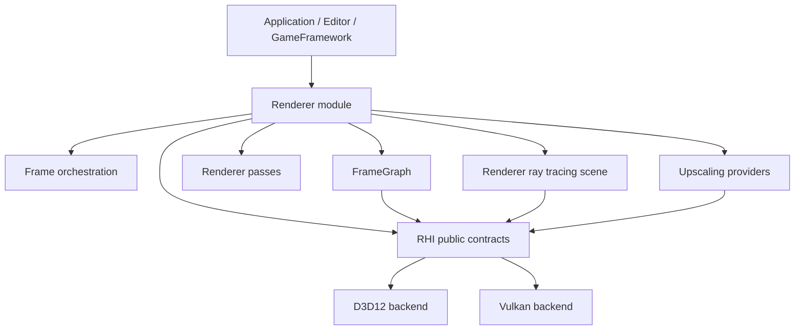

Important folders:

- `Engine/RHI/Public`: API contracts, resource handles, command lists, descriptors, pipeline descriptions, ray tracing descriptions, capabilities.
- `Engine/RHI/Private/D3D12`: D3D12 implementation grouped by `Commands`, `Descriptors`, `Device`, `Diagnostics`, `Memory`, `Pipeline`, `Resources`, `Samplers`, `SwapChain`, `Textures`, `UI`.
- `Engine/RHI/Private/Vulkan`: Vulkan implementation with a very similar grouping.
- `Engine/Renderer/Private/Frame`: per-frame orchestration and pass registration.
- `Engine/Renderer/Private/FrameGraph`: graph declaration, builder, compiler, diagnostics, execution, resources.
- `Engine/Renderer/Private/Passes`: pass implementations.
- `Engine/Renderer/Private/RayTracing`: renderer-level BLAS/TLAS scene construction and ray-traced shadow settings.
- `Engine/Renderer/Private/Upscaling`: provider abstraction, passthrough, and NVIDIA DLSS implementation.

## Current System Hierarchy

Observed runtime hierarchy:

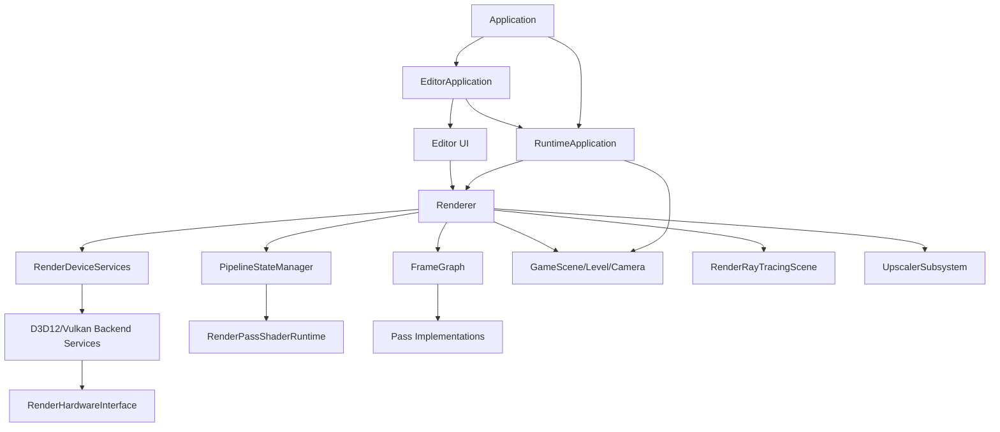

What this means:

- `RuntimeApplication` owns the main engine loop lifecycle.
- `EditorApplication` drives a host-frame split: prepare renderer, record renderer, bind editor viewport output, render UI, submit.
- `Renderer` is the primary orchestration hub.
- `RenderDeviceServices` selects and owns backend services.
- `RenderHardwareInterface` is the backend facade exposed to renderer systems.
- `FrameGraph` owns pass declaration, compile, resource resolution, and execution.
- `PipelineStateManager` lazily creates per-pass runtime objects.

## System Edge Review

### Application -> Renderer

Current:

- `RuntimeApplication` owns renderer lifecycle.
- `EditorApplication` reaches into renderer for host-frame split, ImGui renderer, diagnostics, viewport products, shader package generation, and render product transitions.

Strength:

- Editor reuse of runtime application is simple.
- Host-frame split exists and is useful.

Risk:

- Editor application knows too much about render product state transitions and RHI presentation.
- UI presentation logic depends on renderer internals.

Target:

- Application should call `Renderer::BeginFrame`, `Renderer::RenderViewport`, `Renderer::RenderOverlay`, `Renderer::EndFrame`, or a similar host-facing protocol.
- Editor should receive a viewport texture handle through a presentation contract, not manually transition frame graph resources.

### Renderer -> GameFramework

Current:

- Renderer directly uses `GameScene`, level/camera concepts, scene mesh components, and snapshots.
- `SceneRenderStateCoordinator` mediates some lifetime transitions.

Strength:

- Existing scene integration is straightforward.

Risk:

- Renderer may become coupled to gameplay scene internals.
- More scene types will increase renderer knowledge.

Target:

- GameFramework exports immutable render snapshots.
- Renderer consumes only render-domain DTOs: meshes, materials, cameras, lights, animations, skinning, instances.

### Renderer -> RHI

Current:

- Renderer calls RHI directly for resources, descriptors, constants, frame command lists, present, native interop, diagnostics, ray tracing.

Strength:

- Normal renderer paths do not include backend-private headers. The NVIDIA DLSS provider is a documented SDK integration exception.

Risk:

- RHI facade is too broad, so renderer systems have no precise dependency declaration.

Target:

- Renderer dependencies should be more explicit: graph resources need resource/view services, pass runtime needs pipeline services, ray tracing scene needs ray tracing service, upscaler needs interop service.

### RHI -> Renderer

Current:

- One known violation: RHI shader registration includes renderer-private direct lighting shadow uniform data.

Target:

- Zero RHI-to-Renderer includes.
- Shader registration should be moved to renderer, or shader authoring should be moved to a neutral lower module.

### Application Validation -> Backend APIs

Current:

- Smoke validation has direct D3D12 code for capture.

Target:

- Validation should use RHI capture/readback services.
- Backend-specific validation can exist, but it should be owned by backend modules or a clearly marked test-only adapter.

## Current Design Patterns

| Pattern | Where It Appears | Value | Risk |
| --- | --- | --- | --- |
| Facade | `Renderer`, `RenderHardwareInterface`, `RenderDeviceServices` | Simple top-level API. | Facades are growing into service locators. |
| Factory | `RenderDeviceServices::Create`, `FrameGraphFactory`, texture factories | Centralized construction. | Factories can hide ownership and policy. |
| Builder | `FrameGraphBuilder`, `PassResourceBuilder`, `ShaderParameterStructBuilder`, frame data builders | Good for staged construction. | Too many builders can make pass authoring ceremonial. |
| Adapter | D3D12/Vulkan backends implementing RHI contracts | Good backend isolation. | Root interface is too wide, so adapters are large. |
| Command | `RenderCommandList`, `RenderCommandContext` | Good GPU command abstraction. | Command context and RHI command list split needs clearer ownership. |
| Registry/Cache | `CookedShaderPackageCache`, `PipelineStateManager`, mesh/material caches | Good for runtime reuse. | Cache invalidation and lazy creation paths need stronger contracts. |
| CRTP / static polymorphism | shader registration/pass metadata patterns | Compile-time metadata is powerful. | Harder for new pass authors; error messages/ceremony are high. |
| Strategy | upscaler providers, backend selection | Good pluggability. | Provider contracts need stronger RHI interop boundaries. |
| RAII | `unique_ptr`, backend object ownership, scoped diagnostics | Good lifetime safety. | Some backend native resource lifetime still centralized in massive classes. |

Missing or underdeveloped patterns:

- Decision records for architectural changes.
- Layer-enforcing dependency checks.
- A stable render feature/plugin boundary.
- A PSO library/cache abstraction separate from pass traits.
- A declarative pass definition format that reduces manual pass ceremony.
- A presentation/viewport contract between renderer and editor/application.

## Positive Findings

1. Backend folder symmetry is strong.

   D3D12 and Vulkan both have clear backend-specific folders for commands, descriptors, memory, pipeline, resources, swap chain, and diagnostics. This is close to AMD Cauldron's visible `DX12` / `VK` separation, and it makes backend ownership easy to inspect.

2. Renderer owns render intent; RHI owns GPU primitives.

   Most renderer code talks in frame graph handles, render passes, scene data, upscaling contracts, and ray-tracing scene concepts. Most API-specific details are under RHI backend folders.

3. Frame graph is already a real architectural center.

   Sparkle has separate declaration, builder, compiler, diagnostics, execution, resource registry, state tracking, transient planning, and barrier playback. That is the right direction for reviewability.

4. Ray tracing is split at a useful conceptual boundary.

   Renderer owns `RenderRayTracingScene`, `RayTracingBlasCache`, `RayTracingTlasBuilder`, and shadow feature settings. RHI owns generic ray-tracing descriptors, prebuild info, acceleration-structure buffers, and command-list build calls.

5. Diagnostics are not an afterthought.

   D3D12 diagnostics, Vulkan debug layers/events/names, frame graph diagnostics, DLSS capability reports, ray tracing reports, and smoke validation all exist. This matters to external reviewers.

## Main Architectural Risks

### 0. Renderer Is Too Central

`Renderer.cpp` currently owns or coordinates:

- backend creation
- pipeline state manager creation
- GPU mesh cache creation
- texture manager creation
- material cache creation
- render scene data builder
- camera update
- per-view/temporal/light builders
- scene snapshot capture
- scene render state coordination
- ray tracing capability reporting
- ray tracing scene creation and TLAS binding
- DLSS/upscaler capability setup
- memory monitor and frame diagnostics
- frame graph creation/recreation
- resize handling
- frame context construction
- frame graph setup/compile/execute
- present product publishing for editor
- render product state transitions for editor UI
- GPU timing publishing

Current pattern:

- `Renderer` is acting as a Facade plus Composition Root plus Frame Scheduler plus feature coordinator.

Risk:

- Any feature change tends to touch the central hub.
- Lifetime and ownership are hard to audit.
- Editor-host requirements leak into renderer product/state transition APIs.

Target direction:

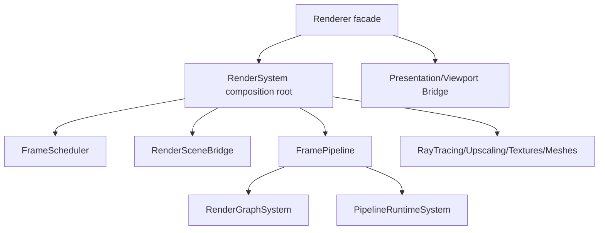

Acceptance criteria:

- `Renderer` becomes a thin facade with a stable public API.
- Frame lifecycle is owned by a dedicated frame scheduler/pipeline object.
- Feature systems have explicit ownership and lifecycle.
- Editor presentation integration moves behind a presentation/viewport bridge, not arbitrary render product transitions.

### 1. RHI Interface Is Too Broad

`RenderHardwareInterface` currently mixes several roles:

- device capability query
- command-list access
- swap chain/back buffer access
- descriptor allocation
- binding layout and pipeline creation
- texture and buffer creation
- constant-buffer suballocation
- ray-tracing allocation and prebuild queries
- transient memory aliasing
- native interop for external SDKs
- ImGui texture resolution
- screenshot/capture helper
- present pass helpers

This is practical while the engine is small, but it makes the public RHI surface hard to audit. In review, a 68-method virtual interface reads less like a minimal RHI contract and more like a service locator.

Reference contrast:

- NVRHI appears as a focused API abstraction layer with backend implementations behind that abstraction.
- Donut builds renderer/app layers on top of NVRHI instead of putting renderer conveniences directly into the backend device contract.

Proposed direction:

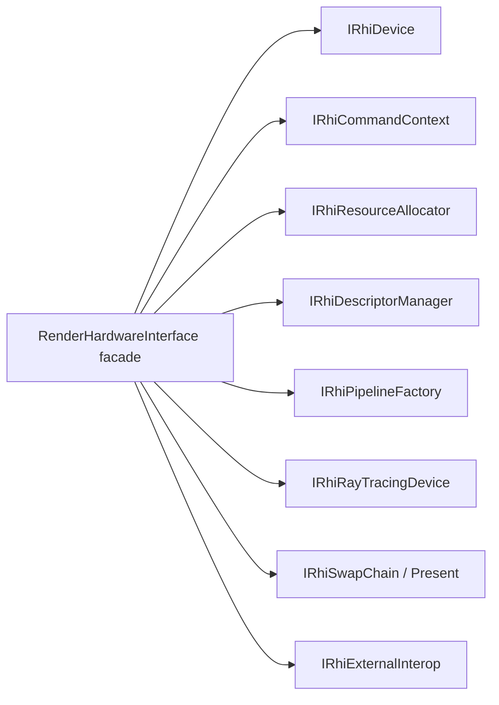

Do not split immediately. First add documentation that classifies every existing method into one of these buckets and flags which callers use it.

Acceptance criteria:

- Every public RHI method has one named owner category.
- No renderer feature requires adding a backend-specific convenience method to the root RHI facade unless it passes an explicit review note.
- New external SDK interop goes through `IRhiExternalInterop`-style capability/resource metadata, not ad hoc API-specific calls in renderer passes.

### 2. Shader Registration Lives In RHI But Reaches Into Renderer

Concrete finding:

`Engine/RHI/Private/Shaders/DirectLightingShaders.cpp` includes:

```cpp
#include "Renderer/Private/RayTracing/RayTracedShadowUniformData.h"
```

That violates the stated layer order:

```text
Core -> Platform -> RHI -> Renderer -> GameFramework -> Editor/Application
```

This is the clearest current separation-of-concerns issue. RHI should not include renderer-private pass data.

Hard acceptance criterion:

> Adding a regular renderer shader pass must not require changing `Engine/RHI`.

Renderer-specific shader declarations, pass package IDs, shader file paths, entry points, pass resources, and pass uniform structs belong above RHI. RHI should provide generic shader package, binding layout, resource, descriptor, command, and pipeline services. RHI changes are justified only for new GPU/API concepts, not for ordinary renderer features.

Reference-backed rationale:

- NVIDIA Donut layers reusable rendering passes above NVRHI; NVRHI is the graphics abstraction layer, not the place where renderer-specific passes are authored.
- NVIDIA NVRHI is a rendering hardware interface abstraction over graphics APIs, so its scope maps to backend-agnostic GPU services.
- AMD Cauldron keeps common framework/sample functionality separate from DX12/VK backend implementation trees.

Likely cause:

Shader authoring/registration is partly in RHI because shader parameter layout types and global shader registration sit there. But specific renderer passes, such as `DirectLighting`, are renderer concepts.

Proposed direction:

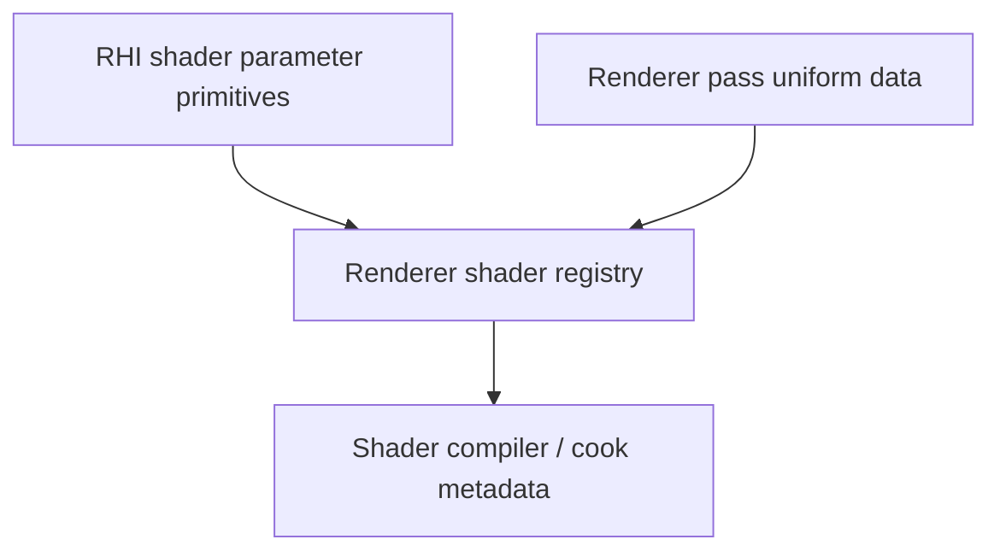

Acceptance criteria:

- `Engine/RHI` has zero includes of `Renderer/Private`.
- Renderer pass shader registration moves to Renderer or to a neutral shader-authoring module that does not depend upward.
- Shared shader parameter primitives remain in RHI or a lower shared module, but pass-specific uniform structs stay with the owning pass/module.
- Adding Bloom, SSAO, SSR, a debug visualization, a lighting variant, or a material shader requires no RHI edit.
- RHI edits for shader/pass work are allowed only when the pass needs a new GPU capability or API abstraction.

Current renderer pass declarations living in RHI:

- `Engine/RHI/Private/Shaders/GBufferShaders.cpp`
- `Engine/RHI/Private/Shaders/DirectLightingShaders.cpp`
- `Engine/RHI/Private/Shaders/IndirectLightingShaders.cpp`
- `Engine/RHI/Private/Shaders/LightingCompositeShaders.cpp`
- `Engine/RHI/Private/Shaders/SkyShaders.cpp`
- `Engine/RHI/Private/Shaders/VisualizeBuffersShaders.cpp`

Correct boundary:

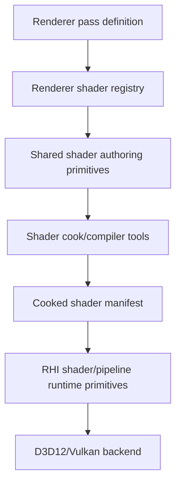

Ownership rules:

| Data / behavior | Owner | Reason |
| --- | --- | --- |
| Pass name, pass resources, shader file path, entry point, shader stages | Renderer | These are renderer feature decisions. |
| Pass uniform structs such as ray-traced shadow parameters | Renderer or lower shared render-data module | These are shader-visible renderer contracts, not RHI device contracts. |
| Shader parameter primitive types/macros/builders | Shared shader authoring module, currently RHI but should be reconsidered | These are infrastructure, not a renderer pass. |
| Cooked shader package parsing/cache | Shader runtime or RHI-adjacent infrastructure | This is backend-neutral runtime infrastructure. |
| Binding layout compilation and PSO creation | RHI/pipeline runtime | This maps renderer intent to backend objects. |
| D3D12 root signatures and Vulkan pipeline layouts | Backend | API-specific implementation. |

Proposed folder direction:

```text
Engine/Renderer/Private/Shaders/
  RendererShaderRegistry.cpp
  GBufferShaderRegistration.cpp
  DirectLightingShaderRegistration.cpp
  ...

Engine/RHI/Public/Shaders/
  ShaderPackageDefinition
  ShaderReflection
  ShaderStage
  CookedShaderPackage

Engine/RHI/Private/Shaders/
  CookedShaderPackageCache
  ShaderPackageLayoutBuilder
  Generic shader authoring infrastructure only

Engine/RHI/Private/D3D12/Pipeline/
  D3D12RootSignature
  D3D12PipelineState

Engine/RHI/Private/Vulkan/Pipeline/
  VulkanBindingLayout
  VulkanPipelineState
```

Information flow after the move:

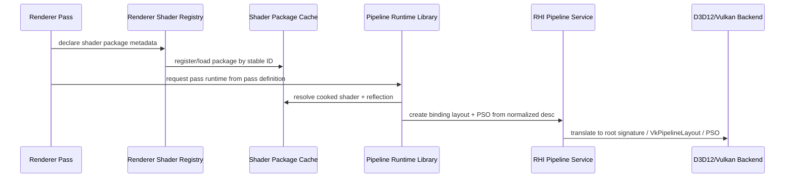

Decision test:

```text
If I am adding Bloom, SSAO, SSR, a debug view, a lighting variant, a post-process pass, or a material shader:
  I should edit Renderer/shaders/content/cook metadata only.
  I should not edit RHI.

If I am adding bindless resources, mesh shaders, work graphs, ray tracing pipeline state, multi-queue scheduling, or a new descriptor model:
  RHI changes may be justified.
```

### 3. Frame Orchestration And Pass Implementation Are Still Blurry

Current shape is promising but naming is noisy:

- `Frame/*.cpp` files such as `GBuffer.cpp`, `DirectLighting.cpp`, `LightingComposite.cpp`, `Sky.cpp`, and `Upscaling.cpp` appear to orchestrate frame graph pass registration.
- `Passes/*.cpp` files such as `GBufferPass.cpp`, `DirectLightingPass.cpp`, `LightingCompositePass.cpp`, and `SkyPass.cpp` implement pass details.

That split is good, but it is not self-documenting enough yet. A reviewer must infer whether `Frame/DirectLighting.cpp` or `Passes/DirectLightingPass.cpp` is the place to change behavior.

Proposed naming rule:

- `Frame/*` should be composition only: create frame resources, allocate pass parameters, add graph passes, wire dependencies.
- `Passes/*Pass` should own pass execution details and shader binding details.
- `Pipeline/*` should own cooked shader/pipeline runtime state.
- `FrameGraph/*` should never contain pass-specific rendering behavior.

Acceptance criteria:

- Each `Frame/*.cpp` begins with a short comment or consistent function name such as `AddDirectLightingFramePasses`.
- Pass implementation files expose small, pass-specific APIs, not frame-wide orchestration.
- A new contributor can answer "where do I add a render pass?" and "where do I edit the DirectLighting shader bindings?" from a docs map.

### 4. Shader Pass And PSO Handling

Adding or modifying a shader pass currently touches many concepts:

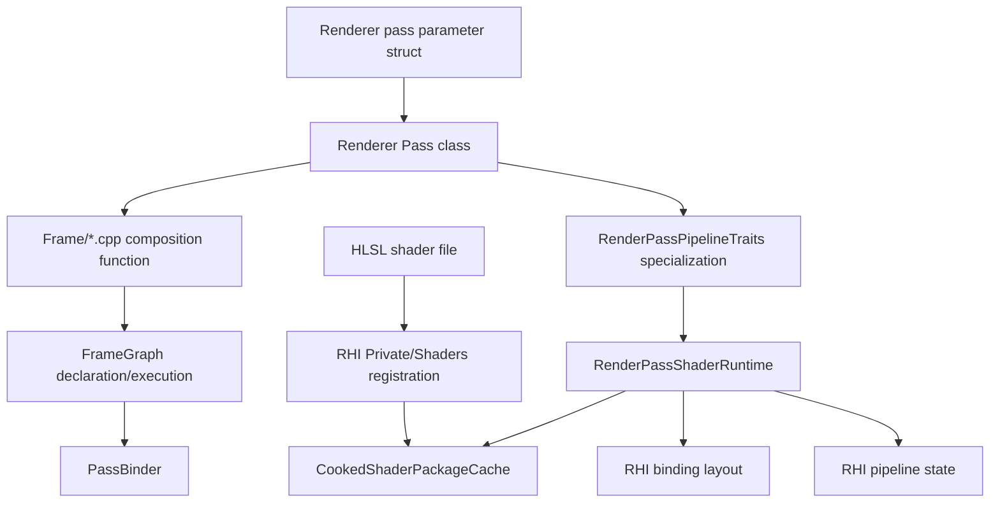

Observed pain:

- Shader package declaration is duplicated across RHI shader registration and renderer pass `DescribeShaderPackage`.
- Pass parameters are described manually in C++.
- Pass resources are declared manually.
- Pipeline traits are manually specialized in one central file.
- `RenderPassShaderRuntime` performs validation, layout creation, package loading, capability checks, and PSO construction.
- `PassBinder` knows every binding category and frame graph resolution path.
- The pass author needs to understand frame graph handles, shader parameter metadata, runtime traits, cooked package IDs, binding layout IDs, resource usages, and PSO descriptors.

Target principle:

> A pass author should describe intent. The renderer runtime should derive binding layout, resource declarations, PSO descriptors, validation, and most binding behavior.

Possible target flow:

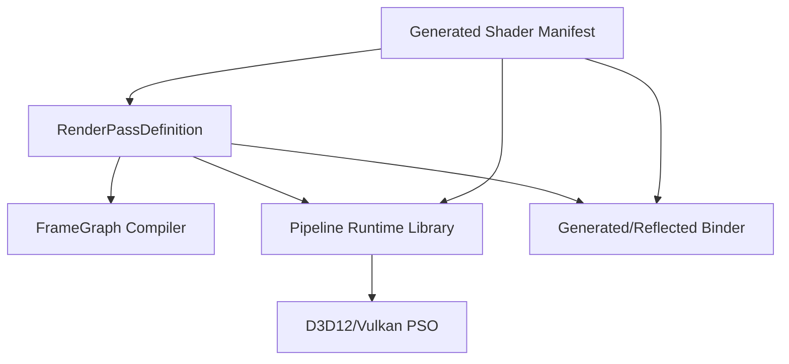

Proposed abstractions:

- `RenderPassDefinition`: pass name, shader package, pipeline kind, render state, resource intent, dispatch/draw behavior.
- `ShaderManifest`: generated/cooked reflection data and package metadata.
- `PipelineRuntimeLibrary`: owns lazy/eager PSO creation, reload, variants, and cache keys.
- `PassResourceBinder`: generated or reflection-driven binder, replacing most manual per-binding branching in pass code.
- `RenderGraphPassBuilder`: combines pass resource declarations and pass runtime lookup from one definition.

Illustrative authoring experience:

```cpp
SPARKLE_RENDER_PASS(DirectLighting)
{
    Shader("Passes/Deferred/DirectLighting.hlsl").Compute("main");
    Requires(Feature::InlineRayQuery, Feature::AccelerationStructure);

    Reads(GBuffer.BaseColor, GBuffer.Normal, GBuffer.Material, GBuffer.DeviceZ);
    Reads(Scene.Tlas);
    Writes(Lighting.DirectDiffuse, Lighting.DirectSpecular, Lighting.DirectSubsurface);

    Dispatch2D(SceneExtent, 8, 8);
}
```

This is illustrative, not an immediate API commitment.

Acceptance criteria for a redesigned pass system:

- Adding a simple compute pass requires one pass definition file and one shader file.
- Adding a simple raster pass requires one pass definition file, one or two shader files, and a render-state description.
- No central `RenderPassPipelineTraits` file must be edited for ordinary passes.
- Shader package ID and binding layout ID have one source of truth.
- PSO cache keys are explicit and inspectable.
- Shader reload invalidates only affected runtimes when possible.
- Pass validation errors mention pass name, shader file/package, binding name, expected type, actual type, backend, and suggested fix.

Current PSO runtime model:

- `PipelineStateManager` lazily creates pass runtimes by C++ type.
- Runtime storage is keyed by `std::type_index`.
- `RenderPassPipelineTraits<TPass>` creates runtime storage for each pass.
- `RenderPassShaderRuntime` loads cooked package, builds binding layout, checks features, and creates PSO.
- Raster variants such as wireframe/two-sided are stored in runtime storage.

Strengths:

- Lazy creation avoids upfront cost.
- Type safety is decent for existing passes.
- Shader reload clears all runtime storage.

Risks:

- `std::type_index` cache key is not a complete PSO key.
- Variants are hardcoded into trait logic.
- Central trait specialization does not scale with many passes.
- Shader reload invalidates everything.
- Runtime construction blends package loading, validation, binding layout, and PSO creation.
- There is no visible PSO library concept similar to what external reviewers expect.

Target PSO architecture:

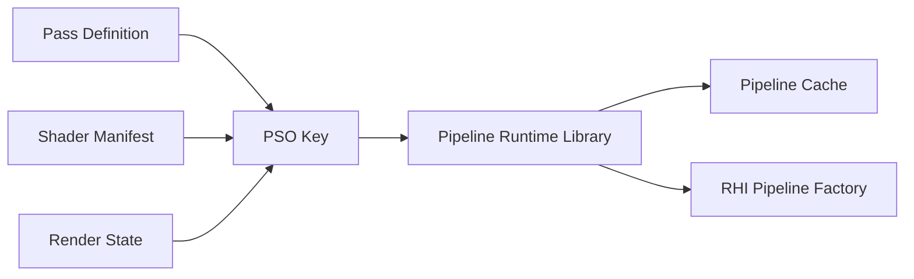

Acceptance criteria:

- PSO key includes backend, shader package generation/hash, pipeline kind, render targets, depth format, raster/depth/blend state, vertex layout, feature/permutation bits.
- PSO creation and shader package loading are separate responsibilities.
- Runtime logs can print the full PSO key.
- Shader reload invalidation is based on package generation/hash, not only "clear everything."
- D3D12 and Vulkan PSO creation paths receive equivalent normalized descriptors.

### 5. Native Interop Is Necessary But Needs A Formal Contract

Recent Vulkan DLSS work added native texture view metadata because Streamline Vulkan manual hooking needs more than raw image handles. That is directionally correct: renderer/upscaler providers should not guess Vulkan layouts or view ranges.

Risk:

`NativeTextureViewInfo` can become a catch-all if unmanaged. External SDKs often need very specific data: resource, view, state/layout, format, extent, subresource range, queue/device context. If every feature adds fields opportunistically, RHI interop becomes noisy.

Proposed direction:

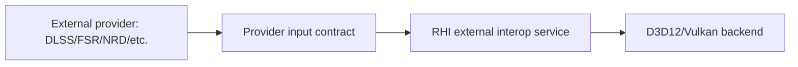

Acceptance criteria:

- Native interop structs are documented by consumer: D3D12 Streamline, Vulkan Streamline, future FSR, future NRD.
- API-specific fields are allowed only when their owning backend can fill them deterministically.
- Renderer pass code never casts `void*` native handles directly; only provider integration code may do so.
- Capability reports state why an external provider is unavailable, including missing extensions/features.

### 6. Vendor SDKs Should Stay Out Of Core RHI Policy

Sparkle currently keeps NVIDIA Streamline provider code under `Renderer/Private/Upscaling/NvidiaDlss`, which is good. The Vulkan backend now enables optional NVIDIA Vulkan interop extensions when the driver exposes them. That is acceptable as backend device creation policy, but it should be made explicit as "external feature interop requirements," not hidden as DLSS magic.

Reference contrast:

- Vendor sample frameworks often carry explicit SDK integration layers, but their backend/device setup is still visibly owned by the graphics layer.
- Cauldron/FidelityFX-style code tends to make feature/backend boundaries visible through folder structure and sample-level integration.

Acceptance criteria:

- RHI may expose backend capability and extension support.
- Renderer providers may request/check feature interop.
- Backend device creation should log which optional external-feature extensions were enabled and why.
- NVIDIA-specific code outside `NvidiaDlss` or narrowly named RHI interop bootstrap must have a short architectural justification.

### 7. Ray Tracing Is Mostly Well-Bounded, But Naming Could Be More Contractual

Current useful split:

- RHI: `RhiRayTracingDesc.h`, prebuild info, scratch/result allocation, command-list AS build.
- Renderer: BLAS cache, TLAS builder, scene diagnostics, shadow settings, frame data.

Review concern:

Names such as `RenderRayTracingScene`, `RayTracingSceneFrameData`, and `RenderRayTracingPassServices` are close enough that ownership can blur. The code probably knows what they mean; a reviewer does not yet.

Proposed direction:

- Keep `Renderer/Private/RayTracing` for scene acceleration-structure ownership.
- Keep pass-specific ray tracing data near the pass, such as shadows.
- Document the difference between:
  - acceleration-structure scene build
  - frame graph AS resource import/binding
  - pass services for reading the TLAS
  - shader-visible shadow uniform data

Acceptance criteria:

- One ray tracing architecture note explains BLAS/TLAS lifetime, ownership, and per-frame update flow.
- RHI ray tracing structs do not include renderer pass concepts.
- Renderer ray tracing code does not include D3D12/Vulkan headers.

## Target Hierarchy

Strategic target:

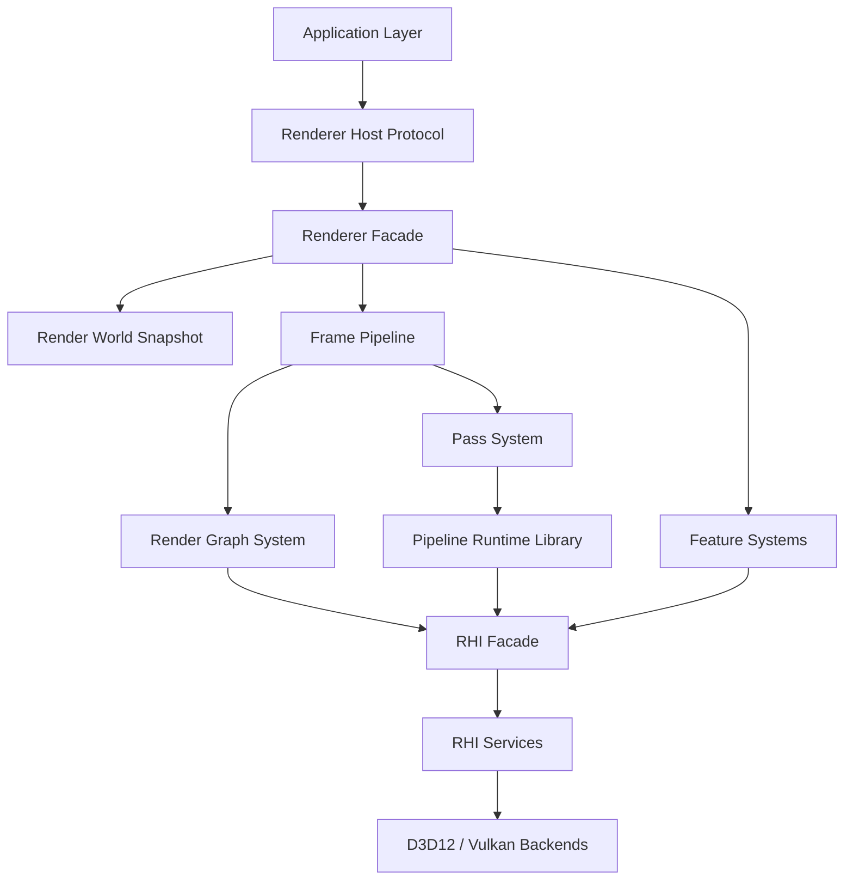

Layer responsibilities:

| Layer | Owns | Must not own |
| --- | --- | --- |
| Application | main loop, editor/runtime mode, host protocol | frame graph internals, backend API objects |
| Renderer Facade | public renderer API, lifecycle boundary | detailed pass binding, backend resource creation |
| Render World Snapshot | renderable scene DTOs | gameplay component internals |
| Frame Pipeline | per-frame sequence and feature composition | backend-specific command encoding |
| Render Graph System | pass/resource graph, barriers, transient resources | pass-specific shader logic |
| Pass System | pass definitions, draw/dispatch intent | shader package cache internals |
| Pipeline Runtime Library | shader package loading, PSO keys, PSO cache | frame graph resource ownership |
| Feature Systems | textures, meshes, ray tracing, upscaling | root renderer lifecycle |
| RHI Facade | stable GPU service access | renderer concepts |
| RHI Backends | API-specific device/resources/descriptors/PSO/commands | renderer pass policy |

## Strategic Refactor Tracks

### Track 1: Enforce Layer Direction

Goal:

- Stop architectural drift before moving systems.

Actions:

- Add forbidden include checks.
- Move renderer-specific shader registration out of RHI.
- Remove direct D3D12 capture code from application validation or wrap it behind RHI/test backend services.

Acceptance:

- `RHI -> Renderer` edge count is zero.
- Application validation does not include D3D12/Vulkan native headers except in explicitly backend-owned test helpers.

### Track 2: Write System Ownership Docs

Goal:

- Make hierarchy visible to external reviewers.

Actions:

- Add `docs/architecture/rendering-glossary.md`.
- Add `docs/architecture/rendering-system-map.md`.
- Add `docs/architecture/rhi-contract-map.md`.
- Add `docs/architecture/frame-graph-contract.md`.
- Add `docs/architecture/ray-tracing-contract.md`.
- Add `docs/architecture/pass-authoring-contract.md`.
- Add `docs/architecture/pipeline-runtime-contract.md`.

Acceptance:

- Every renderer/RHI folder has a stated owner responsibility.
- Every major runtime object has a lifecycle owner.

### Track 3: Decompose Renderer Orchestration

Goal:

- Reduce `Renderer.cpp` centrality.

Candidate extraction:

- `RendererSystemRoot`: owns subsystem construction.
- `FramePipeline`: owns begin/setup/record/submit/end frame.
- `ViewportPresentationBridge`: owns editor/runtime output products and transitions.
- `RenderFeatureRegistry`: owns ray tracing/upscaling feature service wiring.

Acceptance:

- `Renderer.cpp` becomes a facade with stable host-facing methods.
- Frame execution can be diagrammed without reading `Renderer.cpp`.

### Track 4: Build RHI Method Ownership Table

Goal:

- Prepare for safe RHI interface extraction.

Actions:

- Classify every `RenderHardwareInterface` method.
- Map callers.
- Identify first extraction seam.

Recommended first extraction seam:

- Native interop and capture/readback, because they are currently feature/validation pressure points.

Acceptance:

- No new methods are added to root RHI without category and owner.

### Track 5: Redesign Pass/PSO Runtime

Goal:

- Make pass authoring dramatically simpler and PSO handling reviewable.

Actions:

- Introduce pass definition concept in parallel with current pass system.
- Introduce explicit `PipelineRuntimeLibrary` and `PipelineKey`.
- Generate or derive binding/resource declarations from shader/pass metadata where possible.
- Keep old path while migrating one pass as a proof.

Recommended proof pass:

- `VisualizeBuffers` or `ComputeClear` first, because they are simpler than `GBuffer`.

Acceptance:

- A simple compute pass can be added without editing a central trait file.
- Runtime logs show package, binding layout, backend, and PSO key.

### Track 6: Backend Parity and Validation

Goal:

- Make D3D12/Vulkan parity a managed product quality, not a manual screenshot ritual.

Actions:

- Move capture/readback behind RHI.
- Add normal/lit/debug view captures for both backends.
- Add frame graph warning failure policy for development smoke.
- Add PSO creation/runtime diagnostics to smoke report.

Acceptance:

- Backend parity report exists per smoke run.
- DLSS/RT/frame graph/PSO state is visible in the report.

## Strategic Change Gates

Any strategic renderer/RHI change must include:

- System owner statement.
- Dependency edge impact.
- Runtime lifecycle impact.
- PSO/shader package impact.
- D3D12/Vulkan parity impact.
- Diagnostics/validation plan.
- Rollback plan.

Use `docs/plans/architecture-review-acceptance-rubric.md` to score the proposal.

## Proposed Review Process

### Phase 0: Freeze The Vocabulary

Create a short glossary:

- RHI
- backend
- device
- command context
- command list
- descriptor table
- resource view
- native interop
- frame graph
- pass declaration
- pass execution
- transient resource
- external resource
- BLAS/TLAS
- upscaler provider

Acceptance:

- Glossary is in `docs/architecture/rendering-glossary.md`.
- New names should reuse glossary terms.

### Phase 1: Boundary Audit

Run a dependency-direction audit:

- RHI must not include Renderer.
- Renderer must not include D3D12/Vulkan private headers.
- D3D12 and Vulkan backends must not include each other.
- Renderer pass code must not include vendor SDK headers except provider integration folders.

Acceptance:

- `rg "Renderer/Private" Engine/RHI` returns no architectural violations.
- `rg "D3D12|Vulkan|Vk|ID3D12" Engine/Renderer --glob '!**/NvidiaDlss/**'` has only documented exceptions.
- A small CI/script check exists for forbidden includes.

### Phase 2: RHI Contract Classification

Do not refactor first. Classify existing RHI methods into categories:

- Device/capability
- Command submission
- Resource allocation
- Descriptor/view allocation
- Pipeline/binding layout
- Constants/upload
- Ray tracing
- Presentation
- Diagnostics
- Native interop
- Test/capture helpers

Acceptance:

- A markdown table maps every `RenderHardwareInterface` method to category, primary owner, and callers.
- Categories with more than 10 methods get a proposed sub-interface.

### Phase 3: Frame Graph Contract Review

Document the frame graph pipeline:

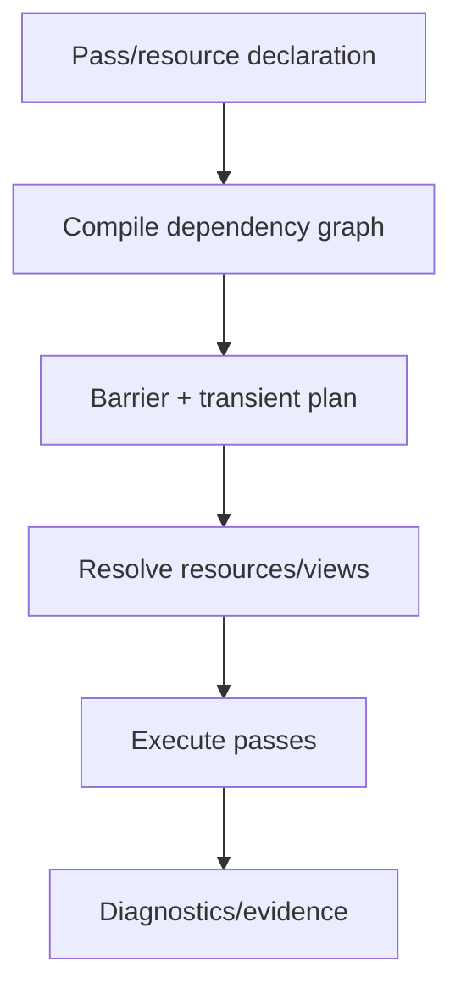

Acceptance:

- Every frame graph warning has a test or smoke path.
- Resource handle resolution failure is treated as a graph contract error, not a backend curiosity.
- Transient aliasing has a diagnostic dump that can explain physical block reuse.

### Phase 4: Backend Parity Matrix

Build a parity table for D3D12 and Vulkan:

| Feature | D3D12 | Vulkan | Acceptance |
| --- | --- | --- | --- |
| GBuffer | Works | Works | Same view/camera/winding semantics |
| Lighting | Works | Works | Matched lit captures |
| Visualize GBuffer | Works | Works | Same normal/material/depth debug modes |
| Ray tracing AS build | Works | Works | No validation warnings, stable TLAS count |
| Ray-traced shadows | Works | Works | Shadows stable during camera rotation |
| DLSS | Works | Works | Active provider, no passthrough fallback |
| Resource barriers | Works | Works | No unresolved handles |
| Transient aliasing | Works | Works | No aliasing warnings |

Acceptance:

- Smoke tests produce structured evidence for both APIs.
- Visual comparison thresholds are explicit: exact image match is unrealistic for all passes, but normal/debug buffers should be near-identical and lit output should have bounded tolerances.

## Initial Proposed Work Items

Do these in order.

1. Turn the whole-codebase coverage audit into a tracked status table.

   For every row in `Whole-Codebase Coverage Audit`, assign:

   - status: `Accepted`, `Needs refactor`, or `Needs design decision`
   - owner layer
   - primary risk
   - first validation artifact
   - linked refactor track or design note

2. Add architecture docs, no code motion.

   Create:

   - `docs/architecture/rendering-glossary.md`
   - `docs/architecture/rhi-contract-map.md`
   - `docs/architecture/frame-graph-contract.md`
   - `docs/architecture/ray-tracing-contract.md`

3. Fix the clear RHI-to-Renderer include violation.

   Move renderer pass shader registration out of RHI or move only the shared uniform struct to a lower neutral module if it is truly shared. Preferred: renderer owns `DirectLighting` shader registration.

4. Add forbidden-include checks.

   This is low-risk and prevents regression.

5. Build an RHI method ownership table.

   This should precede sub-interface extraction.

6. Rename or document frame composition entry points.

   Make the `Frame/*` versus `Passes/*` split obvious.

7. Add backend parity smoke evidence.

   Extend current smoke validation so it produces one small report per backend covering DLSS, ray tracing, frame graph warnings, and debug view modes.

## Non-Goals For The First Refactor Pass

- Do not rewrite the frame graph.
- Do not split `RenderHardwareInterface` immediately.
- Do not move D3D12/Vulkan backend folders unless a dependency audit proves confusion.
- Do not generalize vendor SDK support beyond the contracts actually needed by DLSS today.
- Do not chase performance claims without measurement.

## Open Questions

1. Should shader registration be Renderer-owned, Tool-owned, or moved to a new lower `ShaderRuntime` module?
2. Should `RenderHardwareInterface` remain as a facade while sub-interfaces are introduced behind it?
3. Should native interop be a stable public RHI feature or an internal provider bridge?
4. How strict should backend visual parity be for lit output, given vendor/compiler/numeric differences?
5. Should frame graph resource resolution failures become fatal in development builds?

## Definition Of Done For This Review Track

Sparkle is "review-ready" for the targeted modules when:

- Module dependency direction is mechanically checked.
- RHI method ownership is documented.
- D3D12 and Vulkan backend folders remain symmetric and backend-private.
- Renderer pass orchestration has a documented convention.
- Ray tracing ownership is explained from scene data to TLAS binding.
- DLSS/native interop has a documented backend contract.
- D3D12/Vulkan smoke validation passes with no unresolved frame graph resource warnings.
- Visual debug modes are validated for both APIs.
