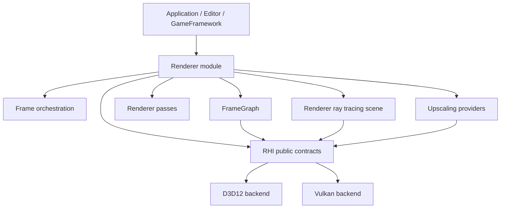
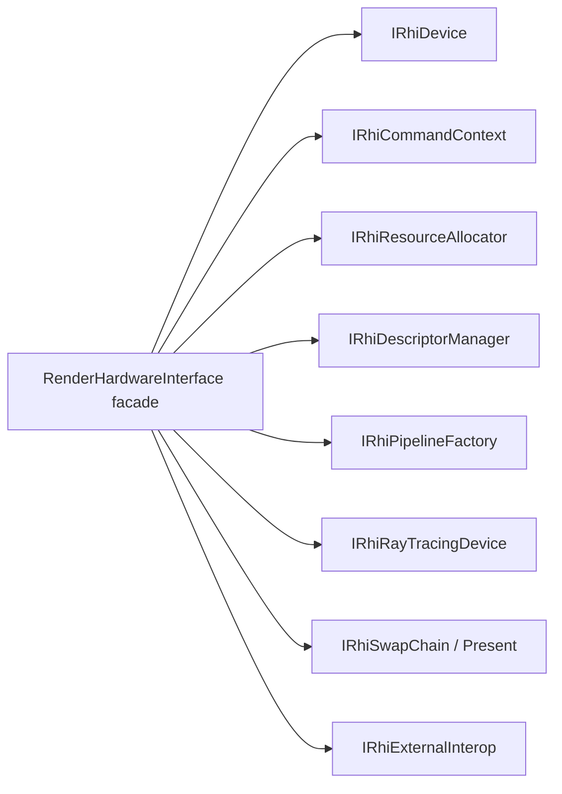
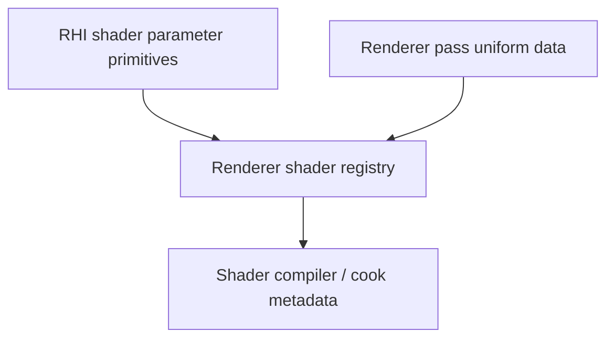
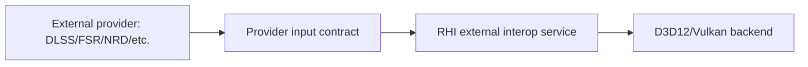
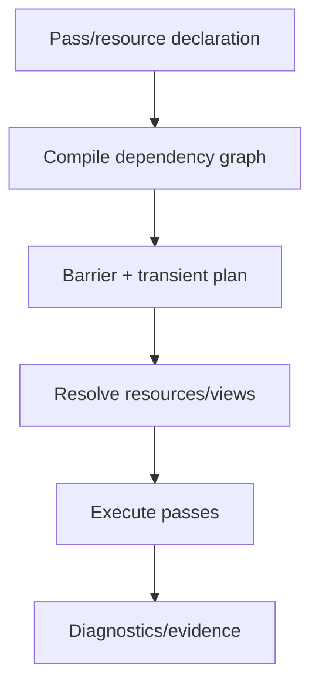

# Sparkle RHI and Renderer Architecture Review

Status: initial system-design review draft  
Date: 2026-06-12  
Scope: `Engine/RHI`, `Engine/Renderer`, D3D12, Vulkan, ray tracing, frame graph, DLSS/upscaling integration

Companion docs:

- `docs/plans/architecture-review-acceptance-rubric.md`
- `docs/plans/renderer-rhi-system-hierarchy-strategy.md`

## Goal

Make SparkleEngine easier to review as a serious renderer/RHI implementation by NVIDIA, AMD, or similar graphics engineers.

This document is not a refactor checklist yet. It is a decision aid: what exists, what is unclear, what good public repositories appear to do, and what acceptance criteria we should use before moving files or changing APIs.

## External Reference Repositories

These are used as comparison anchors, not as templates to copy blindly.

- NVIDIA Donut: https://github.com/NVIDIA-RTX/Donut
- NVIDIA NVRHI: https://github.com/NVIDIAGameWorks/nvrhi
- NVIDIA Falcor: https://github.com/NVIDIAGameWorks/Falcor
- AMD Cauldron: https://github.com/GPUOpen-LibrariesAndSDKs/Cauldron
- AMD FidelityFX SDK: https://github.com/GPUOpen-LibrariesAndSDKs/FidelityFX-SDK

Observed source-tree patterns:

- Donut splits `app`, `core`, `engine`, and `render`, and carries `nvrhi` as the graphics abstraction layer.
- NVRHI is a focused graphics API abstraction library rather than a full renderer.
- Falcor exposes clear top-level systems such as `RenderGraph`, `RenderPasses`, `Rendering`, `Scene`, and `Core/API`.
- Cauldron visibly separates `src/common`, `src/DX12`, and `src/VK`, keeping backend code obvious from the folder tree.

## Current Sparkle Map

Current rough file count from local inventory:

- `Engine/RHI`: 196 C++ files, with 44 public and 152 private/backend files.
- `Engine/Renderer`: 231 C++ files, with 27 public and 204 private files.
- `RenderHardwareInterface.h`: 154 lines, 68 virtual declarations.
- `RenderCommandList.h`: 87 lines, 40 virtual declarations.

High-level structure:



Important folders:

- `Engine/RHI/Public`: API contracts, resource handles, command lists, descriptors, pipeline descriptions, ray tracing descriptions, capabilities.
- `Engine/RHI/Private/D3D12`: D3D12 implementation grouped by `Commands`, `Descriptors`, `Device`, `Diagnostics`, `Memory`, `Pipeline`, `Resources`, `Samplers`, `SwapChain`, `Textures`, `UI`.
- `Engine/RHI/Private/Vulkan`: Vulkan implementation with a very similar grouping.
- `Engine/Renderer/Private/Frame`: per-frame orchestration and pass registration.
- `Engine/Renderer/Private/FrameGraph`: graph declaration, builder, compiler, diagnostics, execution, resources.
- `Engine/Renderer/Private/Passes`: pass implementations.
- `Engine/Renderer/Private/RayTracing`: renderer-level BLAS/TLAS scene construction and ray-traced shadow settings.
- `Engine/Renderer/Private/Upscaling`: provider abstraction, passthrough, and NVIDIA DLSS implementation.

## Positive Findings

1. Backend folder symmetry is strong.

   D3D12 and Vulkan both have clear backend-specific folders for commands, descriptors, memory, pipeline, resources, swap chain, and diagnostics. This is close to AMD Cauldron's visible `DX12` / `VK` separation, and it makes backend ownership easy to inspect.

2. Renderer owns render intent; RHI owns GPU primitives.

   Most renderer code talks in frame graph handles, render passes, scene data, upscaling contracts, and ray-tracing scene concepts. Most API-specific details are under RHI backend folders.

3. Frame graph is already a real architectural center.

   Sparkle has separate declaration, builder, compiler, diagnostics, execution, resource registry, state tracking, transient planning, and barrier playback. That is the right direction for reviewability.

4. Ray tracing is split at a useful conceptual boundary.

   Renderer owns `RenderRayTracingScene`, `RayTracingBlasCache`, `RayTracingTlasBuilder`, and shadow feature settings. RHI owns generic ray-tracing descriptors, prebuild info, acceleration-structure buffers, and command-list build calls.

5. Diagnostics are not an afterthought.

   D3D12 diagnostics, Vulkan debug layers/events/names, frame graph diagnostics, DLSS capability reports, ray tracing reports, and smoke validation all exist. This matters to external reviewers.

## Main Architectural Risks

### 1. RHI Interface Is Too Broad

`RenderHardwareInterface` currently mixes several roles:

- device capability query
- command-list access
- swap chain/back buffer access
- descriptor allocation
- binding layout and pipeline creation
- texture and buffer creation
- constant-buffer suballocation
- ray-tracing allocation and prebuild queries
- transient memory aliasing
- native interop for external SDKs
- ImGui texture resolution
- screenshot/capture helper
- present pass helpers

This is practical while the engine is small, but it makes the public RHI surface hard to audit. In review, a 68-method virtual interface reads less like a minimal RHI contract and more like a service locator.

Reference contrast:

- NVRHI appears as a focused API abstraction layer with backend implementations behind that abstraction.
- Donut builds renderer/app layers on top of NVRHI instead of putting renderer conveniences directly into the backend device contract.

Proposed direction:



Do not split immediately. First add documentation that classifies every existing method into one of these buckets and flags which callers use it.

Acceptance criteria:

- Every public RHI method has one named owner category.
- No renderer feature requires adding a backend-specific convenience method to the root RHI facade unless it passes an explicit review note.
- New external SDK interop goes through `IRhiExternalInterop`-style capability/resource metadata, not ad hoc API-specific calls in renderer passes.

### 2. Shader Registration Lives In RHI But Reaches Into Renderer

Concrete finding:

`Engine/RHI/Private/Shaders/DirectLightingShaders.cpp` includes:

```cpp
#include "Renderer/Private/RayTracing/RayTracedShadowUniformData.h"
```

That violates the stated layer order:

```text
Core -> Platform -> RHI -> Renderer -> GameFramework -> Editor/Application
```

This is the clearest current separation-of-concerns issue. RHI should not include renderer-private pass data.

Likely cause:

Shader authoring/registration is partly in RHI because shader parameter layout types and global shader registration sit there. But specific renderer passes, such as `DirectLighting`, are renderer concepts.

Proposed direction:



Acceptance criteria:

- `Engine/RHI` has zero includes of `Renderer/Private`.
- Renderer pass shader registration moves to Renderer or to a neutral shader-authoring module that does not depend upward.
- Shared shader parameter primitives remain in RHI or a lower shared module, but pass-specific uniform structs stay with the owning pass/module.

### 3. Frame Orchestration And Pass Implementation Are Still Blurry

Current shape is promising but naming is noisy:

- `Frame/*.cpp` files such as `GBuffer.cpp`, `DirectLighting.cpp`, `LightingComposite.cpp`, `Sky.cpp`, and `Upscaling.cpp` appear to orchestrate frame graph pass registration.
- `Passes/*.cpp` files such as `GBufferPass.cpp`, `DirectLightingPass.cpp`, `LightingCompositePass.cpp`, and `SkyPass.cpp` implement pass details.

That split is good, but it is not self-documenting enough yet. A reviewer must infer whether `Frame/DirectLighting.cpp` or `Passes/DirectLightingPass.cpp` is the place to change behavior.

Proposed naming rule:

- `Frame/*` should be composition only: create frame resources, allocate pass parameters, add graph passes, wire dependencies.
- `Passes/*Pass` should own pass execution details and shader binding details.
- `Pipeline/*` should own cooked shader/pipeline runtime state.
- `FrameGraph/*` should never contain pass-specific rendering behavior.

Acceptance criteria:

- Each `Frame/*.cpp` begins with a short comment or consistent function name such as `AddDirectLightingFramePasses`.
- Pass implementation files expose small, pass-specific APIs, not frame-wide orchestration.
- A new contributor can answer "where do I add a render pass?" and "where do I edit the DirectLighting shader bindings?" from a docs map.

### 4. Native Interop Is Necessary But Needs A Formal Contract

Recent Vulkan DLSS work added native texture view metadata because Streamline Vulkan manual hooking needs more than raw image handles. That is directionally correct: renderer/upscaler providers should not guess Vulkan layouts or view ranges.

Risk:

`NativeTextureViewInfo` can become a catch-all if unmanaged. External SDKs often need very specific data: resource, view, state/layout, format, extent, subresource range, queue/device context. If every feature adds fields opportunistically, RHI interop becomes noisy.

Proposed direction:



Acceptance criteria:

- Native interop structs are documented by consumer: D3D12 Streamline, Vulkan Streamline, future FSR, future NRD.
- API-specific fields are allowed only when their owning backend can fill them deterministically.
- Renderer pass code never casts `void*` native handles directly; only provider integration code may do so.
- Capability reports state why an external provider is unavailable, including missing extensions/features.

### 5. Vendor SDKs Should Stay Out Of Core RHI Policy

Sparkle currently keeps NVIDIA Streamline provider code under `Renderer/Private/Upscaling/NvidiaDlss`, which is good. The Vulkan backend now enables optional NVIDIA Vulkan interop extensions when the driver exposes them. That is acceptable as backend device creation policy, but it should be made explicit as "external feature interop requirements," not hidden as DLSS magic.

Reference contrast:

- Vendor sample frameworks often carry explicit SDK integration layers, but their backend/device setup is still visibly owned by the graphics layer.
- Cauldron/FidelityFX-style code tends to make feature/backend boundaries visible through folder structure and sample-level integration.

Acceptance criteria:

- RHI may expose backend capability and extension support.
- Renderer providers may request/check feature interop.
- Backend device creation should log which optional external-feature extensions were enabled and why.
- NVIDIA-specific code outside `NvidiaDlss` or narrowly named RHI interop bootstrap must have a short architectural justification.

### 6. Ray Tracing Is Mostly Well-Bounded, But Naming Could Be More Contractual

Current useful split:

- RHI: `RhiRayTracingDesc.h`, prebuild info, scratch/result allocation, command-list AS build.
- Renderer: BLAS cache, TLAS builder, scene diagnostics, shadow settings, frame data.

Review concern:

Names such as `RenderRayTracingScene`, `RayTracingSceneFrameData`, and `RenderRayTracingPassServices` are close enough that ownership can blur. The code probably knows what they mean; a reviewer does not yet.

Proposed direction:

- Keep `Renderer/Private/RayTracing` for scene acceleration-structure ownership.
- Keep pass-specific ray tracing data near the pass, such as shadows.
- Document the difference between:
  - acceleration-structure scene build
  - frame graph AS resource import/binding
  - pass services for reading the TLAS
  - shader-visible shadow uniform data

Acceptance criteria:

- One ray tracing architecture note explains BLAS/TLAS lifetime, ownership, and per-frame update flow.
- RHI ray tracing structs do not include renderer pass concepts.
- Renderer ray tracing code does not include D3D12/Vulkan headers.

## Proposed Review Process

### Phase 0: Freeze The Vocabulary

Create a short glossary:

- RHI
- backend
- device
- command context
- command list
- descriptor table
- resource view
- native interop
- frame graph
- pass declaration
- pass execution
- transient resource
- external resource
- BLAS/TLAS
- upscaler provider

Acceptance:

- Glossary is in `docs/architecture/rendering-glossary.md`.
- New names should reuse glossary terms.

### Phase 1: Boundary Audit

Run a dependency-direction audit:

- RHI must not include Renderer.
- Renderer must not include D3D12/Vulkan private headers.
- D3D12 and Vulkan backends must not include each other.
- Renderer pass code must not include vendor SDK headers except provider integration folders.

Acceptance:

- `rg "Renderer/Private" Engine/RHI` returns no architectural violations.
- `rg "D3D12|Vulkan|Vk|ID3D12" Engine/Renderer --glob '!**/NvidiaDlss/**'` has only documented exceptions.
- A small CI/script check exists for forbidden includes.

### Phase 2: RHI Contract Classification

Do not refactor first. Classify existing RHI methods into categories:

- Device/capability
- Command submission
- Resource allocation
- Descriptor/view allocation
- Pipeline/binding layout
- Constants/upload
- Ray tracing
- Presentation
- Diagnostics
- Native interop
- Test/capture helpers

Acceptance:

- A markdown table maps every `RenderHardwareInterface` method to category, primary owner, and callers.
- Categories with more than 10 methods get a proposed sub-interface.

### Phase 3: Frame Graph Contract Review

Document the frame graph pipeline:



Acceptance:

- Every frame graph warning has a test or smoke path.
- Resource handle resolution failure is treated as a graph contract error, not a backend curiosity.
- Transient aliasing has a diagnostic dump that can explain physical block reuse.

### Phase 4: Backend Parity Matrix

Build a parity table for D3D12 and Vulkan:

| Feature | D3D12 | Vulkan | Acceptance |
| --- | --- | --- | --- |
| GBuffer | Works | Works | Same view/camera/winding semantics |
| Lighting | Works | Works | Matched lit captures |
| Visualize GBuffer | Works | Works | Same normal/material/depth debug modes |
| Ray tracing AS build | Works | Works | No validation warnings, stable TLAS count |
| Ray-traced shadows | Works | Works | Shadows stable during camera rotation |
| DLSS | Works | Works | Active provider, no passthrough fallback |
| Resource barriers | Works | Works | No unresolved handles |
| Transient aliasing | Works | Works | No aliasing warnings |

Acceptance:

- Smoke tests produce structured evidence for both APIs.
- Visual comparison thresholds are explicit: exact image match is unrealistic for all passes, but normal/debug buffers should be near-identical and lit output should have bounded tolerances.

## Initial Proposed Work Items

Do these in order.

1. Add architecture docs, no code motion.

   Create:

   - `docs/architecture/rendering-glossary.md`
   - `docs/architecture/rhi-contract-map.md`
   - `docs/architecture/frame-graph-contract.md`
   - `docs/architecture/ray-tracing-contract.md`

2. Fix the clear RHI-to-Renderer include violation.

   Move renderer pass shader registration out of RHI or move only the shared uniform struct to a lower neutral module if it is truly shared. Preferred: renderer owns `DirectLighting` shader registration.

3. Add forbidden-include checks.

   This is low-risk and prevents regression.

4. Build an RHI method ownership table.

   This should precede sub-interface extraction.

5. Rename or document frame composition entry points.

   Make the `Frame/*` versus `Passes/*` split obvious.

6. Add backend parity smoke evidence.

   Extend current smoke validation so it produces one small report per backend covering DLSS, ray tracing, frame graph warnings, and debug view modes.

## Non-Goals For The First Refactor Pass

- Do not rewrite the frame graph.
- Do not split `RenderHardwareInterface` immediately.
- Do not move D3D12/Vulkan backend folders unless a dependency audit proves confusion.
- Do not generalize vendor SDK support beyond the contracts actually needed by DLSS today.
- Do not chase performance claims without measurement.

## Open Questions

1. Should shader registration be Renderer-owned, Tool-owned, or moved to a new lower `ShaderRuntime` module?
2. Should `RenderHardwareInterface` remain as a facade while sub-interfaces are introduced behind it?
3. Should native interop be a stable public RHI feature or an internal provider bridge?
4. How strict should backend visual parity be for lit output, given vendor/compiler/numeric differences?
5. Should frame graph resource resolution failures become fatal in development builds?

## Definition Of Done For This Review Track

Sparkle is "review-ready" for the targeted modules when:

- Module dependency direction is mechanically checked.
- RHI method ownership is documented.
- D3D12 and Vulkan backend folders remain symmetric and backend-private.
- Renderer pass orchestration has a documented convention.
- Ray tracing ownership is explained from scene data to TLAS binding.
- DLSS/native interop has a documented backend contract.
- D3D12/Vulkan smoke validation passes with no unresolved frame graph resource warnings.
- Visual debug modes are validated for both APIs.
