# Vulkan Multi-Backend Architecture Plan

This document is the implementation roadmap for making Vulkan a first-class Sparkle backend on Windows while improving the engine architecture.

The goal is not to bolt Vulkan beside D3D12. The goal is to force a cleaner, portable rendering architecture where D3D12 and Vulkan are kept at the same quality level, the public RHI stays backend-agnostic, the FrameGraph becomes the main cross-API rendering contract, and backend-specific code is isolated enough that a future Metal backend would be possible without another major renderer rewrite.

## Locked Direction

| Decision | Answer | Architectural consequence |
| --- | --- | --- |
| Backend parity | D3D12 and Vulkan must be equal quality | Every feature lands with an explicit D3D12/Vulkan parity gate |
| Platform scope | Windows only for now | Use Win32 surface creation for Vulkan, but keep OS platform seams clean |
| Portfolio story | Modern multi-backend renderer plus explicit API competence | Show device creation, memory, synchronization, FrameGraph, diagnostics, shaders, and tool validation |
| Refactor appetite | Major refactors are allowed | Prefer deleting D3D12-shaped legacy surfaces over wrapping them forever |
| Backend model | One shared abstract RHI with backend implementations | Renderer code should not choose D3D12 or Vulkan paths for ordinary rendering |
| FrameGraph | API-agnostic engine FrameGraph | Do not add a Vulkan-only FrameGraph; harden the existing FrameGraph |
| Binding model | Bindful first, bindless-ready later | Descriptor/binding APIs must not block descriptor indexing or direct heap indexing later |
| Memory | D3D12MA for D3D12, VMA for Vulkan | Shared RHI memory diagnostics and categories; backend-private allocator engines |
| Threading | Single-threaded now, multithreading-ready | Avoid global mutable backend state that blocks command recording parallelism later |
| Build cadence | No build after every phase | Code phases are source-gated; full validation happens after large milestones or at the end |

## What We Are Optimizing For

1. Equal D3D12 and Vulkan feature parity.
2. Small, durable abstractions that represent engine concepts, not D3D12 vocabulary.
3. FrameGraph as the owner of render intent: lifetimes, barriers, aliasing, pass dependencies, and views.
4. Backend implementations as translators and executors, not policy owners.
5. D3D12MA and VMA as real allocator foundations, not decorative wrappers.
6. Bindful rendering today with clear bindless growth paths.
7. Single-threaded implementation today without painting over future multithreaded command recording.
8. Validation gates that prevent accidental backend drift.

## Current Sparkle State

Sparkle already has several strong pieces for a multi-backend renderer:

| Area | Current state | Vulkan impact |
| --- | --- | --- |
| Public RHI | `RenderHardwareInterface`, `RenderCommandList`, opaque handles, neutral formats and resource descriptions exist | Good foundation, but some names and concepts still reflect D3D12 mechanics |
| Backend isolation | Most D3D12 implementation lives under `Engine/RHI/Private/D3D12` | Good placement, but the RHI module target still links D3D12 directly |
| Device bootstrap | `RenderDeviceServices` constructs D3D12 services directly | First major seam to refactor into backend selection/factory |
| Renderer dependency | Renderer links to SparkleRHI, not directly to D3D12 libraries | Good high-level boundary |
| FrameGraph | Existing compiler/playback uses neutral resource state concepts | Should become the primary cross-backend barrier and transient resource contract |
| Descriptors | Public descriptor handles and tables exist | Needs a more API-neutral binding/view model because Vulkan does not have D3D12 descriptor heaps |
| Shader packages | Cooked shader package supports DXIL and SPIR-V formats | Needs runtime selection and Vulkan pipeline layout path |
| Memory | D3D12MA integration is in progress and public memory diagnostics are backend-neutral | Mirror with VMA; remove D3D12 heap vocabulary from public transient APIs |
| Diagnostics | RHI diagnostics facade exists | Expand to backend parity, allocator budgets, live object/device reports, validation messages |

### Current Shape

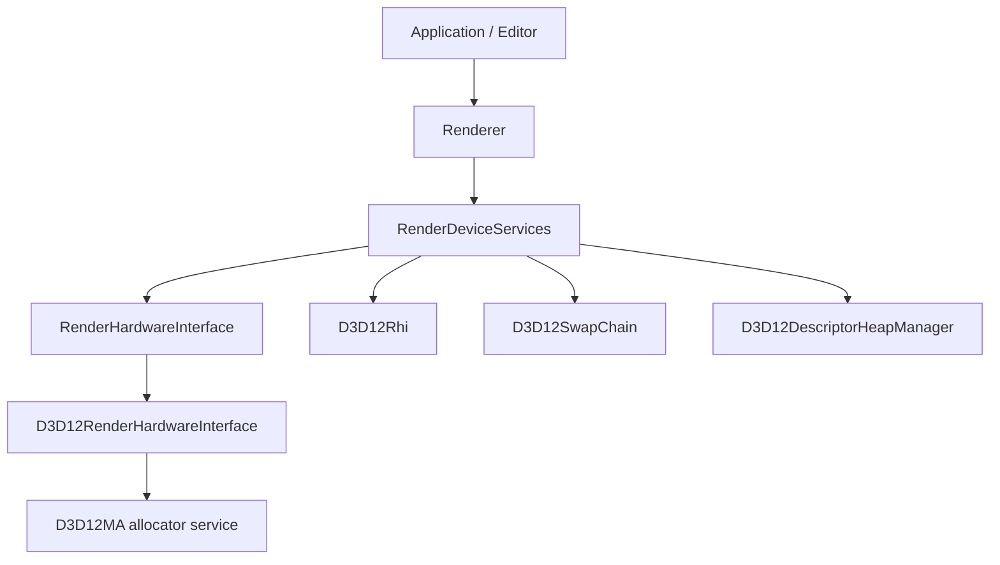

The issue is not that Sparkle has D3D12 code. It should. The issue is that the service layer and build target currently assume D3D12 as the only backend, so Vulkan would enter as a special case instead of a peer.

### Target Shape

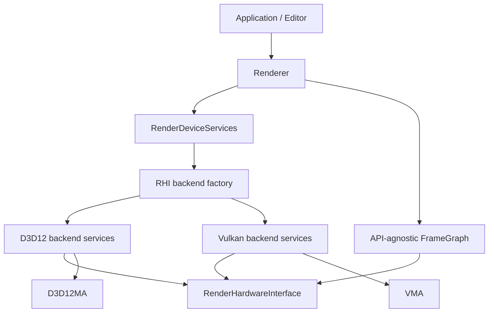

## External Architecture Study

### NVIDIA NVRHI

NVRHI is the strongest reference for Sparkle's desired shape. It exposes a common RHI over D3D11, D3D12, and Vulkan, with backend-specific implementations hidden behind shared concepts.

What to inherit:

| NVRHI pattern | Why it matters for Sparkle | Sparkle action |
| --- | --- | --- |
| Shared `IDevice` with backend implementations | Rendering code talks to one device API | Keep one `RenderHardwareInterface`, but clean D3D12-shaped names |
| Separate backend targets such as `nvrhi_d3d12` and `nvrhi_vk` | Prevents every build from linking every graphics API | Split Sparkle RHI into common and backend targets |
| Backend-native object access by explicit object type | Lets SDK integration escape the RHI intentionally | Keep native handle escape hatches, but require backend checks |
| Binding layouts and binding sets | A shared descriptor model maps to D3D12 root signatures and Vulkan descriptor sets | Move Sparkle toward binding layouts/sets as first-class RHI objects |
| Optional validation layer | Catches invalid RHI usage independent of backend | Add Sparkle RHI validation wrappers after backend parity exists |
| Deferred safe destruction | Resource lifetime stays correct across command submission | Keep backend-owned delayed release queues with shared retirement rules |
| Backend feature queries | Renderer can ask for capabilities instead of checking API names | Expand `RhiCapabilities` and parity tests |
| Bindless layout exists but is separate | Bindful path remains clean while future bindless has a target | Add bindless-ready metadata without forcing bindless now |

What not to copy blindly:

| NVRHI pattern | Risk for Sparkle | Sparkle policy |
| --- | --- | --- |
| Very broad RHI surface | Too much abstraction before Sparkle needs it | Build only the feature surface Sparkle uses, then grow by parity gates |
| Internal state tracking everywhere | Can duplicate FrameGraph ownership | Let Sparkle FrameGraph own high-level state; backend tracks only what it must |
| Public D3D12/Vulkan headers for backend extensions | Useful for SDKs, but easy to leak | Keep backend extension headers private until a real integration requires them |

### NVIDIA Donut

Donut uses NVRHI for rendering and keeps device/window/swapchain setup in `DeviceManager` descendants. This is directly relevant to Sparkle because Sparkle already has `RenderDeviceServices`.

What to inherit:

| Donut pattern | Why it matters for Sparkle | Sparkle action |
| --- | --- | --- |
| `DeviceManager::Create(api)` factory | Backend selection is centralized | Convert `RenderDeviceServices::Create` into backend-aware creation |
| D3D12 and Vulkan device managers both return the same RHI device | Renderer stays backend-agnostic | `RenderDeviceServices` should return the same `RenderHardwareInterface` contract |
| Swapchain back buffers wrapped as RHI textures | FrameGraph can render to present targets uniformly | Make Sparkle present resources first-class RHI resources for both APIs |
| Shader format selected by API | DXIL for D3D12, SPIR-V for Vulkan | Enforce `GetRequiredShaderBinaryFormat()` through shader loading and pipeline creation |
| Command-line API selection | Easy parity testing | Add `--renderer=d3d12` / `--renderer=vulkan` or equivalent config |
| Backend-specific SDK integrations kept in app layer | DLSS/Streamline/Vulkan native needs do not pollute ordinary rendering | Keep future SDK integrations behind explicit backend extension seams |

What not to copy blindly:

| Donut pattern | Risk for Sparkle | Sparkle policy |
| --- | --- | --- |
| Device manager headers include many backend-native types behind compile flags | Can leak backend concepts upward | Prefer private backend service classes and smaller public creation settings |
| Rendering framework without engine-specific FrameGraph ownership | Sparkle already has a FrameGraph | Use Donut for device/backend structure, not as a reason to bypass FrameGraph |

### AMD FidelityFX SDK And Cauldron

The current FidelityFX SDK is important because it shows modern AMD integration expectations, allocator callbacks, and SDK resource wrapping. The current SDK notes that Vulkan samples are not supported in the newest package, so it is not the best live multi-backend renderer model today. Older Cauldron has both D3D12 and Vulkan implementations, but more backend duplication than we want.

What to inherit:

| AMD pattern | Why it matters for Sparkle | Sparkle action |
| --- | --- | --- |
| Backend allocation callbacks | SDKs may need engine allocator ownership | Keep allocator services able to expose controlled allocation callbacks later |
| API-agnostic resource views with backend internals | D3D12 descriptors and Vulkan descriptor sets are different objects | Make Sparkle view/binding handles engine concepts, not D3D12 heap handles |
| Resource view allocator critical sections | Descriptor/view allocation can happen off the render thread later | Design allocators with thread safety boundaries now, even if single-threaded |
| VMA in Vulkan paths | VMA is the expected Vulkan allocator foundation | Use VMA from Vulkan backend phase one, not as a later optional cleanup |
| Explicit command queue and upload contexts | Upload/copy work should be separable from render policy | Create neutral upload staging APIs before Vulkan asset parity |

What to avoid:

| AMD/Cauldron pattern | Risk for Sparkle | Sparkle policy |
| --- | --- | --- |
| Parallel D3D12 and Vulkan render pass classes | Doubles renderer maintenance cost | Keep renderer passes backend-agnostic through RHI and FrameGraph |
| Public `GetImpl()` style access everywhere | Makes backend escape hatches normal | Keep native access rare and explicit |
| Static descriptor/view pools as the only model | Blocks bindless and dynamic workloads | Use allocators that can grow or page internally |

## Architecture Principles

### Backend Boundary Rule

Backend-specific types are allowed only below backend folders or explicit native interop seams.

```text
Allowed:
Engine/RHI/Private/D3D12/**       -> ID3D12*, DXGI_*, D3D12MA::*
Engine/RHI/Private/Vulkan/**      -> Vk*, Vma*
Engine/RHI/Public/Interop/**      -> opaque native handles only

Not allowed:
Engine/Renderer/Public/**         -> D3D12, Vulkan, VMA, D3D12MA
Engine/Renderer/Private/**        -> direct ID3D12* or Vk* except temporary migration files
Engine/RHI/Public/**              -> D3D12MA::, Vma*, ID3D12*, Vk* concrete types
```

### Backend Parity Rule

Every backend-facing feature receives one of these statuses:

| Status | Meaning |
| --- | --- |
| `Parity` | Implemented and validated on D3D12 and Vulkan |
| `D3D12OnlyTemporary` | Existing feature not yet ported; tracked with phase owner |
| `VulkanOnlyBootstrap` | Vulkan bring-up helper that must be removed or generalized |
| `UnsupportedByDesign` | Explicitly outside current engine scope |

No silent backend gaps.

### FrameGraph Rule

The FrameGraph owns render intent. Backends execute compiled intent.

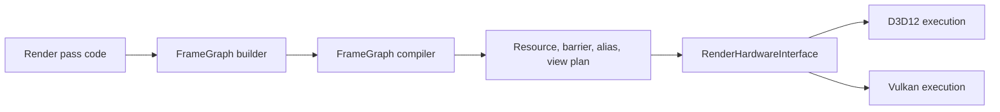

Backends may translate barriers and create native views. They should not decide pass order, lifetime ranges, aliasing policy, or renderer resource ownership.

### Binding Rule

Bindful first means the first Vulkan backend must support ordinary descriptor sets and pipeline layouts. Bindless-ready means the public model must already have room for descriptor tables, descriptor indices, and layout metadata.

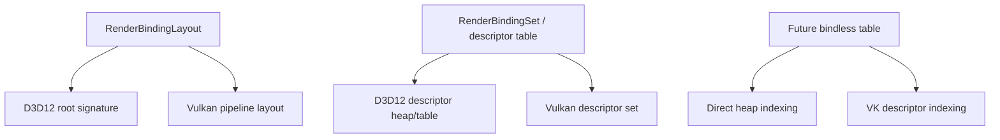

### Memory Rule

Allocator engines are backend-private. Memory facts are public.

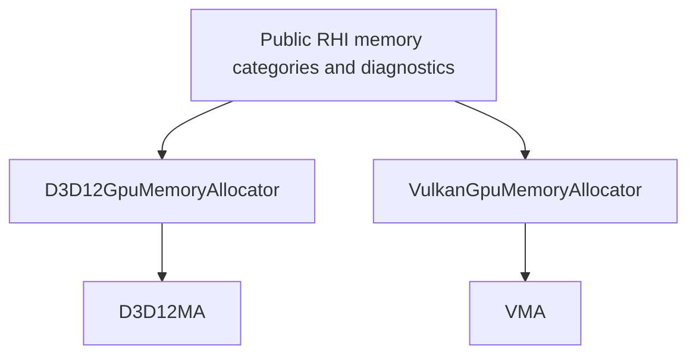

Public memory names should say `MemoryBlock`, `Allocation`, `Resource`, `Residency`, `Budget`, not `Heap` or `PlacedResource` unless the concept is truly API-specific and private.

## Proposed Folder Shape

```text
Engine/RHI/
  Public/
    Core/
    Device/
    Commands/
    Resources/
    Descriptors/
    Bindings/
    Pipeline/
    Memory/
    Diagnostics/
    Interop/
  Private/
    Common/
      Device/
      Validation/
      ShaderLoading/
      Memory/
    D3D12/
      Device/
      Commands/
      Descriptors/
      Bindings/
      Memory/
      Pipeline/
      SwapChain/
      Diagnostics/
    Vulkan/
      Device/
      Commands/
      Descriptors/
      Bindings/
      Memory/
      Pipeline/
      SwapChain/
      Diagnostics/
```

The goal is not folder ceremony. The goal is that D3D12 and Vulkan implementations are visibly peers.

## Build Target Shape

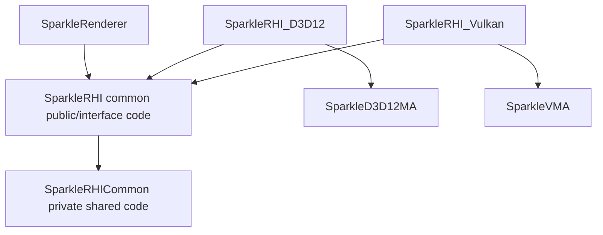

Recommended options:

```text
SPARKLE_RHI_WITH_D3D12=ON
SPARKLE_RHI_WITH_VULKAN=ON
SPARKLE_RHI_DEFAULT_BACKEND=D3D12
```

Validation should fail if Renderer links directly to `d3d12`, `dxgi`, `vulkan`, `D3D12MA`, or `VMA`.

## Public RHI Concepts To Normalize

### Must Stay Backend-Neutral

| Concept | Public name direction | D3D12 implementation | Vulkan implementation |
| --- | --- | --- | --- |
| Device | `RenderHardwareInterface` | `D3D12RenderHardwareInterface` | `VulkanRenderHardwareInterface` |
| Command list | `RenderCommandList` | `ID3D12GraphicsCommandList*` inside | `VkCommandBuffer` inside |
| Resource | `NativeResourceHandle`, `RhiOwnedResourceHandle` | `ID3D12Resource*` record | `VkBuffer` or `VkImage` record |
| Memory block | `RhiOwnedMemoryBlockHandle` | D3D12MA allocation/heap record | VMA allocation/pool record |
| Aliasing resource | `CreateAliasingTexture/Buffer` or unified neutral equivalent | `CreateAliasingResource` | image/buffer on VMA allocation at offset if supported by chosen strategy |
| View | `RhiResourceViewHandle` or existing descriptor abstractions evolved | D3D12 CPU/GPU descriptors | VkImageView/VkBufferView plus descriptor set writes |
| Binding layout | `RenderBindingLayout` | Root signature and descriptor ranges | Descriptor set layouts and pipeline layout |
| Pipeline | `RenderPipelineState` | PSO + root signature | VkPipeline + VkPipelineLayout |
| Shader binary | `CookedShaderBinaryFormat` | DXIL | SPIR-V |
| Diagnostics | `RenderDiagnostics` | D3D12 debug/D3D12MA stats | Vulkan validation/VMA stats |

### Names To Remove From Public RHI Over Time

These names are survivable for D3D12, but they make future Vulkan less natural:

| Current public concept | Issue | Target direction |
| --- | --- | --- |
| `RhiOwnedHeapHandle` | D3D12 heap vocabulary | `RhiOwnedMemoryBlockHandle` or `RhiTransientMemoryBlockHandle` |
| `CreateOwnedHeap` | D3D12 heap vocabulary | `CreateTransientMemoryBlock` |
| `ReleaseOwnedHeap` | D3D12 heap vocabulary | `ReleaseTransientMemoryBlock` |
| `CreatePlacedTextureResource` | D3D12 placed resource vocabulary | `CreateAliasingTextureResource` or `MaterializeTransientTexture` |
| `CreatePlacedBufferResource` | D3D12 placed resource vocabulary | `CreateAliasingBufferResource` or `MaterializeTransientBuffer` |
| `SetShaderVisibleDescriptorHeaps` | D3D12 descriptor heap vocabulary | `BindGlobalDescriptorState` or hide behind command-list setup |
| `GetShaderResourceHeapHandle` | D3D12 descriptor heap vocabulary | backend extension only, or descriptor table handle query |

The migration should be done intentionally as part of Vulkan-readiness, not as a cosmetic rename. The goal is to remove conceptual friction for Vulkan and Metal-style backends.

## Implementation Roadmap

This roadmap uses phases that can be coded without running full builds after each prompt. Use source gates and focused validation while coding. Full build/runtime validation happens at milestone boundaries.

### Phase 0: Architecture Inventory And Parity Baseline

Goal: create a factual inventory of D3D12-only assumptions before moving code.

Tasks:

1. Add a `docs/plans/vulkan-parity-inventory.md` or section tracking every RHI and Renderer feature.
2. Classify each feature as `Core`, `BackendSpecific`, `TemporaryD3D12`, or `Future`.
3. Search for D3D12/DXGI/D3D12MA references outside backend-private folders.
4. Record all public RHI names that carry D3D12 vocabulary.
5. Define initial parity acceptance criteria.

Done criteria:

1. Every public RHI method has a Vulkan disposition.
2. Every Renderer D3D12 dependency is either removed or tracked.
3. Validation scripts know the forbidden-token boundaries.

### Phase 1: Backend Selection And Device Services Factory

Goal: make backend selection real before Vulkan exists.

Tasks:

1. Add `RhiBackendSelection` or expand existing `ERhiBackendApi` configuration.
2. Refactor `RenderDeviceServices::Create` to accept backend selection.
3. Move current D3D12 service construction into `D3D12RenderDeviceServices` or a private factory function.
4. Keep Renderer call sites unchanged.
5. Add command-line/config support for `D3D12` now and `Vulkan` later.

Visual target:

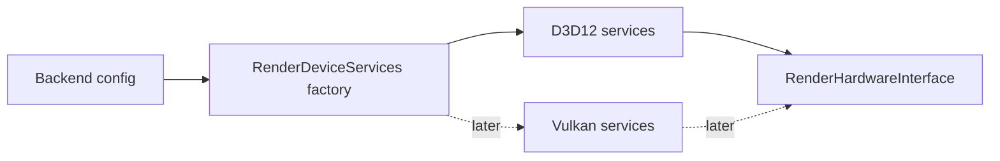

Done criteria:

1. Existing D3D12 behavior is preserved through the factory.
2. Adding a Vulkan backend no longer requires editing Renderer ownership.
3. Unsupported backend selection fails clearly.

### Phase 2: CMake Backend Target Split

Goal: stop `SparkleRHI` from being a D3D12-only library in disguise.

Tasks:

1. Split common RHI public/common code from D3D12 private sources.
2. Create a D3D12 backend target that owns D3D12 system libraries, ImGui DX12 backend, and D3D12MA.
3. Add a placeholder Vulkan backend target behind `SPARKLE_RHI_WITH_VULKAN`.
4. Ensure Renderer links only common RHI and selected backend composition target.
5. Update source groups and validation gates.

Done criteria:

1. D3D12 system libraries are not linked directly by Renderer.
2. Vulkan can be added without mixing D3D12 and Vulkan source files in one undifferentiated private glob.
3. Build options make backend selection explicit.

### Phase 3: Public RHI Vocabulary Cleanup

Goal: remove D3D12 heap/placed-resource vocabulary from public API before Vulkan copies it.

Tasks:

1. Rename public transient memory handles from heap wording to memory block wording.
2. Rename placed-resource creation to aliasing/materialization wording.
3. Hide D3D12 descriptor heap setup behind a neutral command-list/backend setup call.
4. Update FrameGraph transient allocator call sites.
5. Update diagnostics debug-name overloads to use neutral memory block terms.

Preferred public language:

```text
RhiOwnedMemoryBlockHandle
CreateTransientMemoryBlock
ReleaseTransientMemoryBlock
CreateAliasingTextureResource
CreateAliasingBufferResource
```

Done criteria:

1. Public RHI no longer says `Heap` for transient memory ownership.
2. Public RHI no longer says `PlacedResource`.
3. D3D12 implementation still uses heaps internally where appropriate.

### Phase 4: Backend-Neutral Resource And View Model

Goal: make views and descriptors map cleanly to both D3D12 and Vulkan.

Tasks:

1. Define `RhiResourceViewDesc` for texture SRV/UAV/RTV/DSV, buffer SRV/UAV, and AS SRV intent.
2. Introduce `RhiResourceViewHandle` if existing descriptor handles cannot represent Vulkan cleanly.
3. Move view creation toward `CreateResourceView(desc)` style while preserving current D3D12 descriptor allocation internally.
4. Make FrameGraph request logical views, not D3D12-shaped descriptors.
5. Keep descriptor table handles for bindful material tables and future bindless expansion.

Visual target:

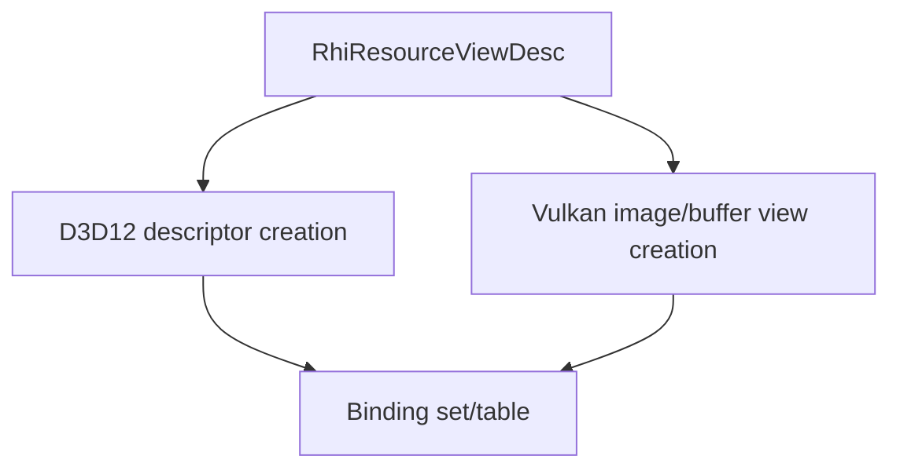

Done criteria:

1. FrameGraph no longer directly reasons about CPU descriptor handles as its long-term view identity.
2. D3D12 descriptor handles become one backend implementation of a view.
3. Vulkan can represent image views and descriptor writes without abusing D3D12 handle types.

### Phase 5: Binding Layout And Binding Set Hardening

Goal: turn shader reflection into backend-neutral binding layouts.

Tasks:

1. Audit `RenderBindingLayout` and `RenderBindingLayoutCompileDesc` for D3D12-only assumptions.
2. Ensure shader reflection uses set/space, binding/register, visibility, resource type, count, and push constants.
3. D3D12 backend compiles root signatures from the neutral layout.
4. Vulkan backend will compile descriptor set layouts and pipeline layouts from the same neutral layout.
5. Add future bindless metadata fields without enabling bindless behavior yet.

Bindful now, bindless later:

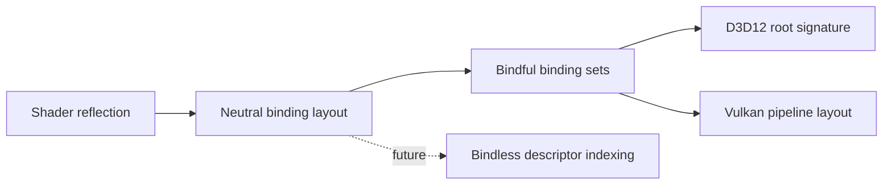

Done criteria:

1. No renderer pass needs to know whether bindings become D3D12 root parameters or Vulkan descriptor sets.
2. Push constants/root constants have a single RHI description.
3. Bindless future path is documented and not blocked by current layout model.

### Phase 6: Shader Package And Runtime Binary Selection

Goal: make DXIL/SPIR-V a first-class runtime choice.

Tasks:

1. Ensure cooked shader packages can contain DXIL and SPIR-V variants for the same logical shader.
2. Make `GetRequiredShaderBinaryFormat()` drive runtime selection everywhere.
3. Add validation for missing backend shader variants.
4. Prepare Vulkan pipeline shader module creation from SPIR-V.
5. Keep one source shader authoring path where possible.

Done criteria:

1. D3D12 loads only DXIL.
2. Vulkan loads only SPIR-V.
3. Missing shader variant errors name the shader, pass, and backend.

### Phase 7: Vulkan Dependency And Loader Foundation

Goal: add Vulkan SDK/loader integration without touching Renderer behavior.

Tasks:

1. Add CMake discovery for Vulkan SDK.
2. Add VMA dependency and backend-private wrapper target.
3. Create `Engine/RHI/Private/Vulkan` folder structure.
4. Add Vulkan result/error utilities and debug-name helpers.
5. Add validation script boundary rules for `Vk`, `Vma`, and Vulkan headers.

Done criteria:

1. Vulkan headers and VMA are private to Vulkan backend code.
2. The project can configure with Vulkan enabled or disabled.
3. No public headers include Vulkan or VMA concrete types.

### Phase 8: Vulkan Device, Adapter, Queue, And Diagnostics Bootstrap

Goal: create a Vulkan backend service that can initialize and report itself.

Tasks:

1. Create Vulkan instance on Windows with debug utils in development configs.
2. Enumerate physical devices and select an adapter.
3. Create logical device with graphics queue first.
4. Enable Vulkan 1.3 baseline where available: synchronization2 and dynamic rendering should be preferred.
5. Add Vulkan diagnostics provider for validation messages, device info, enabled extensions, and object names.
6. Return a `VulkanRenderHardwareInterface` from backend factory.

Done criteria:

1. Backend selection can choose Vulkan and initialize the device.
2. Diagnostics identify API, adapter, driver, validation status, and enabled extensions.
3. No rendering yet is acceptable in this phase.

### Phase 9: Vulkan Swapchain And Present Resource Wrapping

Goal: make Vulkan present resources look like normal RHI resources.

Tasks:

1. Create Win32 Vulkan surface and swapchain.
2. Wrap swapchain images into RHI resource records.
3. Create image views for back buffers through the same view model as other textures.
4. Implement acquire/present flow with semaphores/fences hidden inside backend services.
5. Match D3D12 present format and viewport/scissor behavior.

Visual target:

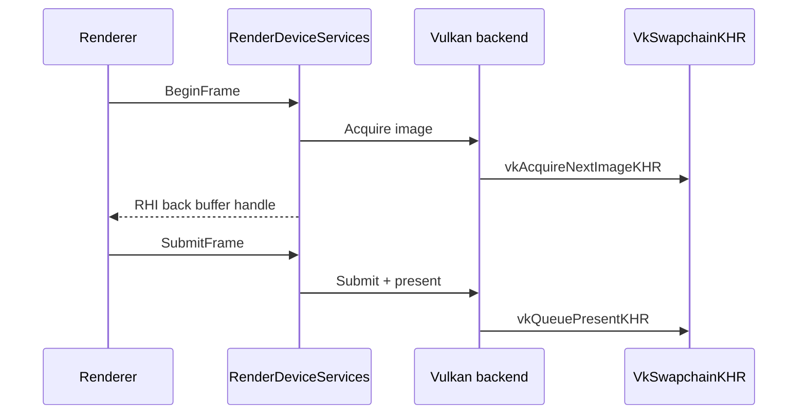

Done criteria:

1. Vulkan backend exposes current back buffer through the same RHI API as D3D12.
2. Resize and teardown are backend-private.
3. Present synchronization is not visible to Renderer.

### Phase 10: Vulkan Command List And Submission

Goal: implement command recording enough for clear/present and FrameGraph playback later.

Tasks:

1. Implement Vulkan command pool and command buffer lifecycle.
2. Map `RenderCommandList` commands to Vulkan commands.
3. Implement debug markers and object naming.
4. Implement frame fence retirement compatible with D3D12 delayed destruction semantics.
5. Keep command allocator/pool ownership multithreading-ready by avoiding global command-buffer reuse assumptions.

Done criteria:

1. Vulkan can begin/end a frame command buffer.
2. Command buffers are safely reset after GPU completion.
3. The design can later allocate per-thread command pools.

### Phase 11: Vulkan Memory With VMA

Goal: make VMA a core Vulkan foundation matching D3D12MA.

Tasks:

1. Add `VulkanGpuMemoryAllocator` behind Vulkan backend-private code.
2. Create buffers and images through VMA.
3. Track memory category, residency class, debug name, and live allocation records.
4. Implement budget/stat snapshots through VMA.
5. Implement JSON/stat dump equivalent where possible.
6. Mirror delayed destruction behavior from D3D12.

Done criteria:

1. No normal Vulkan resource creation bypasses VMA.
2. Public memory diagnostics show D3D12MA and VMA through the same structures.
3. Allocation categories match between backends.

### Phase 12: Resource Creation And Upload Path Parity

Goal: get textures, buffers, constant uploads, and staging working on both backends.

Tasks:

1. Implement Vulkan texture creation from `RhiTextureResourceDesc`.
2. Implement Vulkan buffer creation from `RhiBufferResourceDesc`.
3. Implement upload buffers/staging with VMA host-visible allocations.
4. Replace D3D12-shaped upload assumptions with neutral copy/upload APIs.
5. Validate mesh/index/texture path parity.

Done criteria:

1. Static mesh buffers can be created on D3D12 and Vulkan through the same Renderer path.
2. Texture upload and layout transitions are driven by RHI/FrameGraph policy.
3. Upload scheduling does not expose D3D12 resource states or Vulkan layouts to Renderer.

### Phase 13: Barrier And Resource State Translation

Goal: make Sparkle's neutral `ResourceState` model execute correctly on Vulkan.

Tasks:

1. Audit every `ResourceState` used by FrameGraph.
2. Create D3D12 and Vulkan translation tables side by side.
3. Implement Vulkan image layout, access mask, and pipeline stage mapping.
4. Prefer Vulkan synchronization2 if available.
5. Add validation for unsupported or ambiguous state combinations.

Visual target:

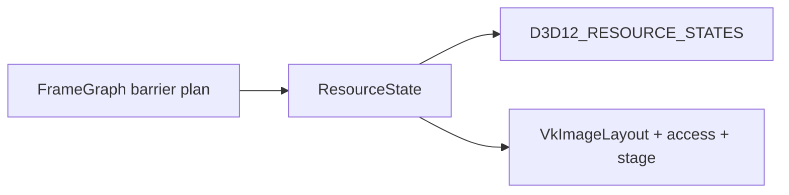

Done criteria:

1. FrameGraph remains the only high-level barrier planner.
2. D3D12 and Vulkan barrier translators are small, explicit, and testable.
3. Vulkan layout transitions are not guessed at individual pass sites.

### Phase 14: Pipeline State And Render Pass Execution

Goal: create graphics/compute pipelines and execute core FrameGraph passes on Vulkan.

Tasks:

1. Implement Vulkan shader module creation from SPIR-V.
2. Implement Vulkan graphics pipeline creation from neutral PSO desc.
3. Implement Vulkan compute pipeline creation.
4. Use dynamic rendering for FrameGraph attachment execution if Vulkan 1.3 baseline is accepted.
5. Map viewport, scissor, blend, raster, depth, primitive topology, and formats.

Done criteria:

1. A simple FrameGraph pass can clear and draw on both backends.
2. PSO cache keys include backend-relevant state without leaking backend types publicly.
3. Pipeline errors report missing state clearly.

### Phase 15: Descriptor Sets, Binding Sets, And Material Tables

Goal: run bindful material/FrameGraph bindings on Vulkan.

Tasks:

1. Implement Vulkan descriptor set layout creation from `RenderBindingLayout`.
2. Implement descriptor pool/page allocator.
3. Implement binding set creation and descriptor writes.
4. Map existing material descriptor table behavior to Vulkan descriptor sets or table emulation.
5. Keep room for descriptor indexing later.

Done criteria:

1. Existing material path does not fork by backend.
2. Vulkan binding sets retain referenced resources until command completion.
3. Descriptor allocation is thread-safe or has a documented future per-thread/page design.

### Phase 16: ImGui And Editor Presentation

Goal: make the editor run on both backends without leaking backend UI code into Renderer.

Tasks:

1. Move ImGui backend implementation behind backend-private RHI UI hooks.
2. Keep Editor using `InitializeImGuiBackend`, `BeginImGuiFrame`, `RenderImGuiDrawData`, and shutdown through RHI only.
3. Add Vulkan ImGui backend wiring privately.
4. Ensure present overlay pass abstraction maps to D3D12 and Vulkan.

Done criteria:

1. Editor UI compiles without including Vulkan or D3D12 backend headers.
2. Backend-specific ImGui code lives only in backend private code.
3. D3D12 and Vulkan editor presentation have matching behavior.

### Phase 17: FrameGraph Transient Resource Parity

Goal: make transient aliasing/materialization backend-neutral and allocator-backed.

Tasks:

1. Move FrameGraph transient block/resource materialization to neutral RHI memory block APIs.
2. D3D12 implementation uses D3D12MA for memory block/resource mechanics.
3. Vulkan implementation uses VMA for transient images/buffers and aliasing strategy selected during design.
4. Keep FrameGraph lifetime and alias policy in Renderer.
5. Add diagnostics category `FrameGraphTransient` for both backends.

Done criteria:

1. Renderer owns logical aliasing policy.
2. Backends own allocator mechanics.
3. D3D12 and Vulkan report transient memory consistently.

### Phase 18: Ray Tracing Parity Planning

Goal: decide how much current D3D12 ray tracing feature surface must be Vulkan-parity before calling Vulkan first-class.

Tasks:

1. Inventory current ray tracing APIs and Showcase usage.
2. Map D3D12 acceleration structure concepts to Vulkan KHR acceleration structures.
3. Decide milestone split: raster parity first, ray tracing parity later, or full parity before merge.
4. Keep public acceleration structure APIs backend-neutral.
5. Use VMA for AS backing buffers.

Done criteria:

1. No D3D12 ray tracing API leaks into Renderer pass code.
2. Vulkan unsupported ray tracing path is explicit until implemented.
3. Portfolio narrative explains the staged parity decision honestly.

### Phase 19: Diagnostics, Validation Layer, And Parity Gates

Goal: make architecture quality visible and enforceable.

Tasks:

1. Add backend parity validation script.
2. Add forbidden-token validation for public and Renderer layers.
3. Add memory diagnostics parity checks.
4. Add shader package variant validation.
5. Add runtime backend selection smoke tests.
6. Add optional RHI validation wrapper after both backends exist.

Validation examples:

```text
No ID3D12/Vk/Vma/D3D12MA in Renderer/Public
No ID3D12/Vk/Vma/D3D12MA in RHI/Public except opaque interop handles
No direct CreateCommittedResource outside D3D12 memory service exceptions
No vkCreateBuffer/vkCreateImage outside Vulkan memory service exceptions
Every RenderHardwareInterface method implemented by D3D12 and Vulkan
Every cooked shader used by Showcase has DXIL and SPIR-V variants
```

Done criteria:

1. A validation command can prove architectural boundaries from source.
2. Runtime logs clearly show selected backend and feature support.
3. Missing parity is tracked, not accidental.

### Phase 20: Legacy Deletion And Architecture Tightening

Goal: remove scaffolding, compatibility leftovers, and wrappers that did not earn their keep.

Tasks:

1. Delete temporary D3D12-only Renderer paths.
2. Delete migration wrappers that simply forward without enforcing policy.
3. Collapse names that exist only because Vulkan was added incrementally.
4. Update docs to describe implemented architecture, not planned architecture.
5. Final source and runtime validation on both backends.

Done criteria:

1. The final architecture is smaller than the transition architecture.
2. Every remaining abstraction has a clear owner and reason to exist.
3. D3D12 and Vulkan are both first-class, selectable, and documented.

## Suggested Milestones

| Milestone | Phases | Meaning | Build policy |
| --- | --- | --- | --- |
| M1: Backend-ready architecture | 0-6 | D3D12 still runs through backend-neutral structure; Vulkan can be added cleanly | Focused source gates, then one D3D12 build |
| M2: Vulkan boots | 7-10 | Vulkan device/swapchain/command list exists | Focused Vulkan target build and startup smoke |
| M3: Vulkan resources | 11-13 | VMA resources, uploads, barriers | Focused backend build and simple runtime smoke |
| M4: FrameGraph draw | 14-17 | Core FrameGraph render path works on both | D3D12 and Vulkan runtime validation |
| M5: Parity cleanup | 18-20 | Missing features tracked or implemented, legacy removed | Full selected validation at end |

## Validation Strategy

The user preference is coding-first, no full build after every phase. The plan follows that.

During coding phases:

```text
Run source boundary gates.
Run format/diff checks.
Run focused builds only at milestone edges or when signatures change heavily.
Avoid full solution builds until the end of a milestone or explicit user request.
```

End-of-milestone validation:

```text
cmake -P CMake/Validation/ValidateRhiBackendBoundaries.cmake
cmake -P CMake/Validation/ValidateFrameGraphBoundary.cmake
cmake -P CMake/Validation/ValidateShaderPackageParity.cmake
git diff --check
focused D3D12 target build
focused Vulkan target build when Vulkan target exists
runtime backend smoke: D3D12
runtime backend smoke: Vulkan when render path exists
```

## Portfolio Value

This plan should let the final Sparkle architecture demonstrate:

1. Explicit API knowledge in both D3D12 and Vulkan.
2. Memory competence through D3D12MA/VMA, budgets, categories, and diagnostics.
3. Synchronization competence through FrameGraph-owned state and backend barrier translators.
4. Renderer architecture competence through backend parity and clean module boundaries.
5. Shader pipeline competence through DXIL/SPIR-V package parity.
6. Practical engineering judgment by deleting D3D12-shaped legacy instead of wrapping it forever.
7. Future readiness for bindless, multithreaded command recording, and a possible Metal backend without promising those as current features.

## Key Risks

| Risk | Why it matters | Mitigation |
| --- | --- | --- |
| Public RHI remains D3D12-shaped | Vulkan backend becomes awkward and leaky | Do vocabulary cleanup before Vulkan implementation grows |
| Descriptor abstraction is too close to D3D12 heaps | Vulkan descriptors become fake D3D12 descriptors | Introduce logical views and binding sets |
| FrameGraph gives too much work to backends | D3D12/Vulkan behavior diverges | Keep pass order, lifetimes, and barrier intent in FrameGraph |
| Shader package parity lags | Vulkan backend boots but cannot render real passes | Add shader variant validation early |
| VMA arrives after manual Vulkan allocation | Memory path is rewritten twice | Use VMA from first Vulkan resource phase |
| Temporary backend forks stay forever | Maintenance cost doubles | Add Phase 20 deletion and validation gates |
| Multithreading readiness is ignored | Later command recording refactor becomes painful | Use per-frame/per-queue ownership and avoid hidden global command state |

## What Success Looks Like

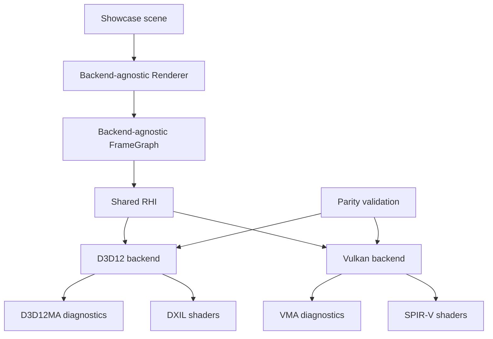

The final result should feel boring in the best way: Renderer code asks for resources, views, bindings, passes, barriers, and diagnostics through one RHI contract. D3D12 and Vulkan do the hard native work privately. The codebase becomes easier to reason about because supporting two explicit APIs forced Sparkle to name its real engine concepts.
