# Vulkan Multi-Backend Architecture Plan

This document is the implementation roadmap for making Vulkan a first-class Sparkle backend on Windows while improving the engine architecture.

The goal is not to bolt Vulkan beside D3D12. The goal is to force a cleaner, portable rendering architecture where D3D12 and Vulkan are kept at the same quality level, the public RHI stays backend-agnostic, the FrameGraph becomes the main cross-API rendering contract, and backend-specific code is isolated enough that a future Metal backend would be possible without another major renderer rewrite.

## Locked Direction

| Decision | Answer | Architectural consequence |
| --- | --- | --- |
| Backend parity | D3D12 and Vulkan must be equal quality | Every feature lands with an explicit D3D12/Vulkan parity gate |
| Platform scope | Windows only for now | Use Win32 surface creation for Vulkan, but keep OS platform seams clean |
| Portfolio story | Modern multi-backend renderer plus explicit API competence | Show device creation, memory, synchronization, FrameGraph, diagnostics, shaders, and tool validation |
| Refactor appetite | Major refactors are allowed | Prefer deleting D3D12-shaped legacy surfaces over wrapping them forever |
| Backend model | One shared abstract RHI with backend implementations | Renderer code should not choose D3D12 or Vulkan paths for ordinary rendering |
| FrameGraph | API-agnostic engine FrameGraph | Do not add a Vulkan-only FrameGraph; harden the existing FrameGraph |
| Binding model | Bindful first, bindless-ready later | Descriptor/binding APIs must not block descriptor indexing or direct heap indexing later |
| Memory | D3D12MA for D3D12, VMA for Vulkan | Shared RHI memory diagnostics and categories; backend-private allocator engines |
| Threading | Single-threaded now, multithreading-ready | Avoid global mutable backend state that blocks command recording parallelism later |
| Build cadence | No build after every prompt | Code phases are source-gated; build/runtime validation happens only at milestone checkpoints or by explicit request |

## What We Are Optimizing For

1. Equal D3D12 and Vulkan feature parity.
2. Small, durable abstractions that represent engine concepts, not D3D12 vocabulary.
3. FrameGraph as the owner of render intent: lifetimes, barriers, aliasing, pass dependencies, and views.
4. Backend implementations as translators and executors, not policy owners.
5. D3D12MA and VMA as real allocator foundations, not decorative wrappers.
6. Bindful rendering today with clear bindless growth paths.
7. Single-threaded implementation today without painting over future multithreaded command recording.
8. Validation gates that prevent accidental backend drift.

## Current Sparkle State

Sparkle already has several strong pieces for a multi-backend renderer:

| Area | Current state | Vulkan impact |
| --- | --- | --- |
| Public RHI | `RenderHardwareInterface`, `RenderCommandList`, opaque handles, neutral formats and resource descriptions exist | Good foundation, but some names and concepts still reflect D3D12 mechanics |
| Backend isolation | Most D3D12 implementation lives under `Engine/RHI/Private/D3D12` | Good placement, but the RHI module target still links D3D12 directly |
| Device bootstrap | `RenderDeviceServices` constructs D3D12 services directly | First major seam to refactor into backend selection/factory |
| Renderer dependency | Renderer links to SparkleRHI, not directly to D3D12 libraries | Good high-level boundary |
| FrameGraph | Existing compiler/playback uses neutral resource state concepts | Should become the primary cross-backend barrier and transient resource contract |
| Descriptors | Public descriptor handles and tables exist | Needs a more API-neutral binding/view model because Vulkan does not have D3D12 descriptor heaps |
| Shader packages | Cooked shader package supports DXIL and SPIR-V formats | Needs runtime selection and Vulkan pipeline layout path |
| Memory | D3D12MA integration is in progress and public memory diagnostics are backend-neutral | Mirror with VMA; remove D3D12 heap vocabulary from public transient APIs |
| Diagnostics | RHI diagnostics facade exists | Expand to backend parity, allocator budgets, live object/device reports, validation messages |

### Current Shape

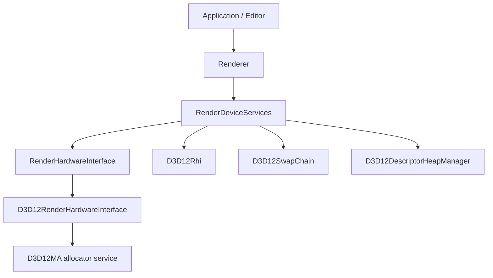

The issue is not that Sparkle has D3D12 code. It should. The issue is that the service layer and build target currently assume D3D12 as the only backend, so Vulkan would enter as a special case instead of a peer.

### Target Shape

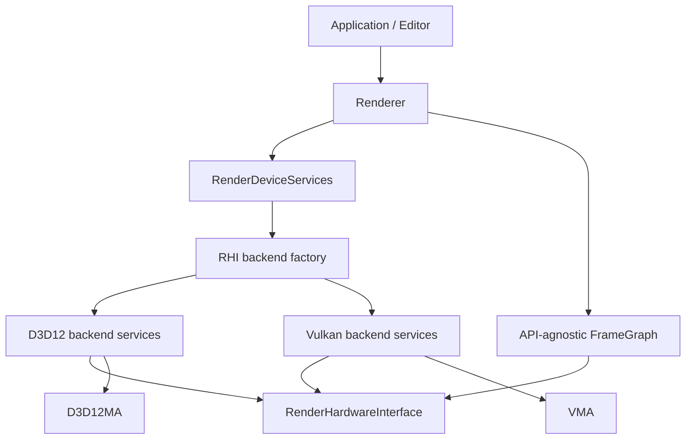

## External Architecture Study

### NVIDIA NVRHI

NVRHI is the strongest reference for Sparkle's desired shape. It exposes a common RHI over D3D11, D3D12, and Vulkan, with backend-specific implementations hidden behind shared concepts.

What to inherit:

| NVRHI pattern | Why it matters for Sparkle | Sparkle action |
| --- | --- | --- |
| Shared `IDevice` with backend implementations | Rendering code talks to one device API | Keep one `RenderHardwareInterface`, but clean D3D12-shaped names |
| Separate backend targets such as `nvrhi_d3d12` and `nvrhi_vk` | Prevents every build from linking every graphics API | Split Sparkle RHI into common and backend targets |
| Backend-native object access by explicit object type | Lets SDK integration escape the RHI intentionally | Keep native handle escape hatches, but require backend checks |
| Binding layouts and binding sets | A shared descriptor model maps to D3D12 root signatures and Vulkan descriptor sets | Move Sparkle toward binding layouts/sets as first-class RHI objects |
| Optional validation layer | Catches invalid RHI usage independent of backend | Add Sparkle RHI validation wrappers after backend parity exists |
| Deferred safe destruction | Resource lifetime stays correct across command submission | Keep backend-owned delayed release queues with shared retirement rules |
| Backend feature queries | Renderer can ask for capabilities instead of checking API names | Expand `RhiCapabilities` and parity tests |
| Bindless layout exists but is separate | Bindful path remains clean while future bindless has a target | Add bindless-ready metadata without forcing bindless now |

What not to copy blindly:

| NVRHI pattern | Risk for Sparkle | Sparkle policy |
| --- | --- | --- |
| Very broad RHI surface | Too much abstraction before Sparkle needs it | Build only the feature surface Sparkle uses, then grow by parity gates |
| Internal state tracking everywhere | Can duplicate FrameGraph ownership | Let Sparkle FrameGraph own high-level state; backend tracks only what it must |
| Public D3D12/Vulkan headers for backend extensions | Useful for SDKs, but easy to leak | Keep backend extension headers private until a real integration requires them |

### NVIDIA Donut

Donut uses NVRHI for rendering and keeps device/window/swapchain setup in `DeviceManager` descendants. This is directly relevant to Sparkle because Sparkle already has `RenderDeviceServices`.

What to inherit:

| Donut pattern | Why it matters for Sparkle | Sparkle action |
| --- | --- | --- |
| `DeviceManager::Create(api)` factory | Backend selection is centralized | Convert `RenderDeviceServices::Create` into backend-aware creation |
| D3D12 and Vulkan device managers both return the same RHI device | Renderer stays backend-agnostic | `RenderDeviceServices` should return the same `RenderHardwareInterface` contract |
| Swapchain back buffers wrapped as RHI textures | FrameGraph can render to present targets uniformly | Make Sparkle present resources first-class RHI resources for both APIs |
| Shader format selected by API | DXIL for D3D12, SPIR-V for Vulkan | Enforce `GetRequiredShaderBinaryFormat()` through shader loading and pipeline creation |
| Command-line API selection | Easy parity testing | Add `--renderer=d3d12` / `--renderer=vulkan` or equivalent config |
| Backend-specific SDK integrations kept in app layer | DLSS/Streamline/Vulkan native needs do not pollute ordinary rendering | Keep future SDK integrations behind explicit backend extension seams |

What not to copy blindly:

| Donut pattern | Risk for Sparkle | Sparkle policy |
| --- | --- | --- |
| Device manager headers include many backend-native types behind compile flags | Can leak backend concepts upward | Prefer private backend service classes and smaller public creation settings |
| Rendering framework without engine-specific FrameGraph ownership | Sparkle already has a FrameGraph | Use Donut for device/backend structure, not as a reason to bypass FrameGraph |

### AMD FidelityFX SDK And Cauldron

The current FidelityFX SDK is important because it shows modern AMD integration expectations, allocator callbacks, and SDK resource wrapping. The current SDK notes that Vulkan samples are not supported in the newest package, so it is not the best live multi-backend renderer model today. Older Cauldron has both D3D12 and Vulkan implementations, but more backend duplication than we want.

What to inherit:

| AMD pattern | Why it matters for Sparkle | Sparkle action |
| --- | --- | --- |
| Backend allocation callbacks | SDKs may need engine allocator ownership | Keep allocator services able to expose controlled allocation callbacks later |
| API-agnostic resource views with backend internals | D3D12 descriptors and Vulkan descriptor sets are different objects | Make Sparkle view/binding handles engine concepts, not D3D12 heap handles |
| Resource view allocator critical sections | Descriptor/view allocation can happen off the render thread later | Design allocators with thread safety boundaries now, even if single-threaded |
| VMA in Vulkan paths | VMA is the expected Vulkan allocator foundation | Use VMA from Vulkan backend phase one, not as a later optional cleanup |
| Explicit command queue and upload contexts | Upload/copy work should be separable from render policy | Create neutral upload staging APIs before Vulkan asset parity |

What to avoid:

| AMD/Cauldron pattern | Risk for Sparkle | Sparkle policy |
| --- | --- | --- |
| Parallel D3D12 and Vulkan render pass classes | Doubles renderer maintenance cost | Keep renderer passes backend-agnostic through RHI and FrameGraph |
| Public `GetImpl()` style access everywhere | Makes backend escape hatches normal | Keep native access rare and explicit |
| Static descriptor/view pools as the only model | Blocks bindless and dynamic workloads | Use allocators that can grow or page internally |

## Architecture Principles

### Backend Boundary Rule

Backend-specific types are allowed only below backend folders or explicit native interop seams.

```text
Allowed:
Engine/RHI/Private/D3D12/**       -> ID3D12*, DXGI_*, D3D12MA::*
Engine/RHI/Private/Vulkan/**      -> Vk*, Vma*
Engine/RHI/Public/Interop/**      -> opaque native handles only

Not allowed:
Engine/Renderer/Public/**         -> D3D12, Vulkan, VMA, D3D12MA
Engine/Renderer/Private/**        -> direct ID3D12* or Vk* except temporary migration files
Engine/RHI/Public/**              -> D3D12MA::, Vma*, ID3D12*, Vk* concrete types
```

### Backend Parity Rule

Every backend-facing feature receives one of these statuses:

| Status | Meaning |
| --- | --- |
| `Parity` | Implemented and validated on D3D12 and Vulkan |
| `D3D12OnlyTemporary` | Existing feature not yet ported; tracked with phase owner |
| `VulkanOnlyBootstrap` | Vulkan bring-up helper that must be removed or generalized |
| `UnsupportedByDesign` | Explicitly outside current engine scope |

No silent backend gaps.

### FrameGraph Rule

The FrameGraph owns render intent. Backends execute compiled intent.

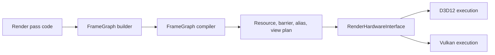

Backends may translate barriers and create native views. They should not decide pass order, lifetime ranges, aliasing policy, or renderer resource ownership.

### Binding Rule

Bindful first means the first Vulkan backend must support ordinary descriptor sets and pipeline layouts. Bindless-ready means the public model must already have room for descriptor tables, descriptor indices, and layout metadata.

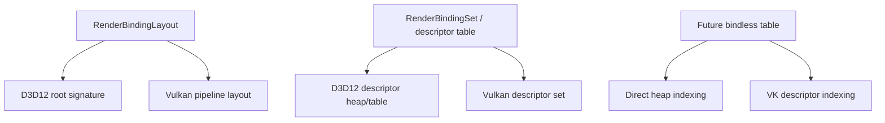

### Memory Rule

Allocator engines are backend-private. Memory facts are public.

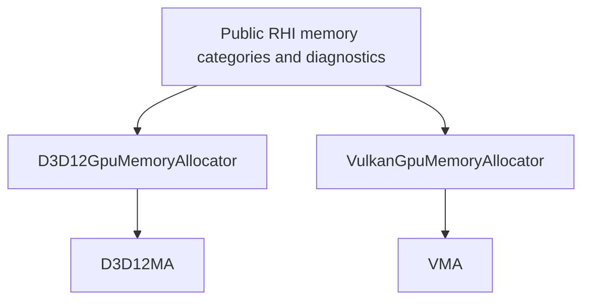

Public memory names should say `MemoryBlock`, `Allocation`, `Resource`, `Residency`, `Budget`, not `Heap` or `PlacedResource` unless the concept is truly API-specific and private.

## Proposed Folder Shape

```text
Engine/RHI/
  Public/
    Core/
    Device/
    Commands/
    Resources/
    Descriptors/
    Bindings/
    Pipeline/
    Memory/
    Diagnostics/
    Interop/
  Private/
    Common/
      Device/
      Validation/
      ShaderLoading/
      Memory/
    D3D12/
      Device/
      Commands/
      Descriptors/
      Bindings/
      Memory/
      Pipeline/
      SwapChain/
      Diagnostics/
    Vulkan/
      Device/
      Commands/
      Descriptors/
      Bindings/
      Memory/
      Pipeline/
      SwapChain/
      Diagnostics/
```

The goal is not folder ceremony. The goal is that D3D12 and Vulkan implementations are visibly peers.

## Build Target Shape

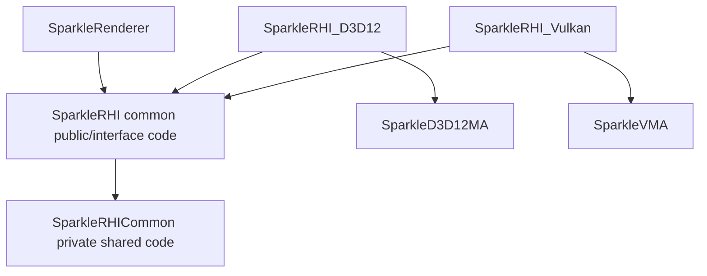

Recommended options:

```text
SPARKLE_RHI_WITH_D3D12=ON
SPARKLE_RHI_WITH_VULKAN=ON
SPARKLE_RHI_DEFAULT_BACKEND=D3D12
```

Validation should fail if Renderer links directly to `d3d12`, `dxgi`, `vulkan`, `D3D12MA`, or `VMA`.

## Public RHI Concepts To Normalize

### Must Stay Backend-Neutral

| Concept | Public name direction | D3D12 implementation | Vulkan implementation |
| --- | --- | --- | --- |
| Device | `RenderHardwareInterface` | `D3D12RenderHardwareInterface` | `VulkanRenderHardwareInterface` |
| Command list | `RenderCommandList` | `ID3D12GraphicsCommandList*` inside | `VkCommandBuffer` inside |
| Resource | `NativeResourceHandle`, `RhiOwnedResourceHandle` | `ID3D12Resource*` record | `VkBuffer` or `VkImage` record |
| Memory block | `RhiOwnedMemoryBlockHandle` | D3D12MA allocation/heap record | VMA allocation/pool record |
| Aliasing resource | `CreateAliasingTexture/Buffer` or unified neutral equivalent | `CreateAliasingResource` | image/buffer on VMA allocation at offset if supported by chosen strategy |
| View | `RhiResourceViewHandle` or existing descriptor abstractions evolved | D3D12 CPU/GPU descriptors | VkImageView/VkBufferView plus descriptor set writes |
| Binding layout | `RenderBindingLayout` | Root signature and descriptor ranges | Descriptor set layouts and pipeline layout |
| Pipeline | `RenderPipelineState` | PSO + root signature | VkPipeline + VkPipelineLayout |
| Shader binary | `CookedShaderBinaryFormat` | DXIL | SPIR-V |
| Diagnostics | `RenderDiagnostics` | D3D12 debug/D3D12MA stats | Vulkan validation/VMA stats |

### Names To Remove From Public RHI Over Time

These names are survivable for D3D12, but they make future Vulkan less natural:

| Current public concept | Issue | Target direction |
| --- | --- | --- |
| `RhiOwnedHeapHandle` | D3D12 heap vocabulary | `RhiOwnedMemoryBlockHandle` or `RhiTransientMemoryBlockHandle` |
| `CreateOwnedHeap` | D3D12 heap vocabulary | `CreateTransientMemoryBlock` |
| `ReleaseOwnedHeap` | D3D12 heap vocabulary | `ReleaseTransientMemoryBlock` |
| `CreatePlacedTextureResource` | D3D12 placed resource vocabulary | `CreateAliasingTextureResource` or `MaterializeTransientTexture` |
| `CreatePlacedBufferResource` | D3D12 placed resource vocabulary | `CreateAliasingBufferResource` or `MaterializeTransientBuffer` |
| `SetShaderVisibleDescriptorHeaps` | D3D12 descriptor heap vocabulary | `BindGlobalDescriptorState` or hide behind command-list setup |
| `GetShaderResourceHeapHandle` | D3D12 descriptor heap vocabulary | backend extension only, or descriptor table handle query |

The migration should be done intentionally as part of Vulkan-readiness, not as a cosmetic rename. The goal is to remove conceptual friction for Vulkan and Metal-style backends.

## Implementation Roadmap

This roadmap uses phases that can be coded without building after each prompt. Use source gates and focused validation while coding. Build/runtime validation happens at milestone boundaries or by explicit user request.

The phases are intentionally numerous. This is not the shortest route to a Vulkan backend; it is the route that makes each concept visible while coding. Each phase should produce one concrete artifact that can be inspected in the repo: a boundary script, a neutral RHI type, a backend service, a Vulkan object owner, a translation table, a diagnostic snapshot, or a deleted legacy path.

Use this cadence for implementation prompts:

```text
Study the current code for the narrow phase.
Name the concept being learned.
Make the smallest architectural change that teaches that concept.
Add or update a source validation gate when the concept affects boundaries.
Mark the phase coding done.
Do not build the project until the milestone checkpoint unless explicitly requested.
```

Each phase should answer three questions before moving on:

1. What engine concept did this teach?
2. What legacy assumption did this remove or isolate?
3. How will D3D12 and Vulkan prove parity for this concept later?

### Phase 0: Architecture Inventory And Parity Baseline

Goal: create a factual inventory of D3D12-only assumptions before moving code.

Tasks:

1. Add a `docs/plans/vulkan-parity-inventory.md` or section tracking every RHI and Renderer feature.
2. Classify each feature as `Core`, `BackendSpecific`, `TemporaryD3D12`, or `Future`.
3. Search for D3D12/DXGI/D3D12MA references outside backend-private folders.
4. Record all public RHI names that carry D3D12 vocabulary.
5. Define initial parity acceptance criteria.

Done criteria:

1. Every public RHI method has a Vulkan disposition.
2. Every Renderer D3D12 dependency is either removed or tracked.
3. Validation scripts know the forbidden-token boundaries.

### Phase 1: Backend Selection And Device Services Factory

Goal: make backend selection real before Vulkan exists.

Tasks:

1. Add `RhiBackendSelection` or expand existing `ERhiBackendApi` configuration.
2. Refactor `RenderDeviceServices::Create` to accept backend selection.
3. Move current D3D12 service construction into `D3D12RenderDeviceServices` or a private factory function.
4. Keep Renderer call sites unchanged.
5. Add command-line/config support for `D3D12` now and `Vulkan` later.

Visual target:

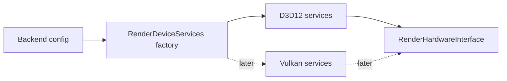

Done criteria:

1. Existing D3D12 behavior is preserved through the factory.
2. Adding a Vulkan backend no longer requires editing Renderer ownership.
3. Unsupported backend selection fails clearly.

### Phase 2: CMake Backend Target Split

Goal: stop `SparkleRHI` from being a D3D12-only library in disguise.

Tasks:

1. Split common RHI public/common code from D3D12 private sources.
2. Create a D3D12 backend target that owns D3D12 system libraries, ImGui DX12 backend, and D3D12MA.
3. Add a placeholder Vulkan backend target behind `SPARKLE_RHI_WITH_VULKAN`.
4. Ensure Renderer links only common RHI and selected backend composition target.
5. Update source groups and validation gates.

Done criteria:

1. D3D12 system libraries are not linked directly by Renderer.
2. Vulkan can be added without mixing D3D12 and Vulkan source files in one undifferentiated private glob.
3. Build options make backend selection explicit.

### Phase 3: Public RHI Vocabulary Cleanup

Goal: remove D3D12 heap/placed-resource vocabulary from public API before Vulkan copies it.

Tasks:

1. Rename public transient memory handles from heap wording to memory block wording.
2. Rename placed-resource creation to aliasing/materialization wording.
3. Hide D3D12 descriptor heap setup behind a neutral command-list/backend setup call.
4. Update FrameGraph transient allocator call sites.
5. Update diagnostics debug-name overloads to use neutral memory block terms.

Preferred public language:

```text
RhiOwnedMemoryBlockHandle
CreateTransientMemoryBlock
ReleaseTransientMemoryBlock
CreateAliasingTextureResource
CreateAliasingBufferResource
```

Done criteria:

1. Public RHI no longer says `Heap` for transient memory ownership.
2. Public RHI no longer says `PlacedResource`.
3. D3D12 implementation still uses heaps internally where appropriate.

### Phase 4: Backend-Neutral Resource And View Model

Goal: make views and descriptors map cleanly to both D3D12 and Vulkan.

Tasks:

1. Define `RhiResourceViewDesc` for texture SRV/UAV/RTV/DSV, buffer SRV/UAV, and AS SRV intent.
2. Introduce `RhiResourceViewHandle` if existing descriptor handles cannot represent Vulkan cleanly.
3. Move view creation toward `CreateResourceView(desc)` style while preserving current D3D12 descriptor allocation internally.
4. Make FrameGraph request logical views, not D3D12-shaped descriptors.
5. Keep descriptor table handles for bindful material tables and future bindless expansion.

Visual target:

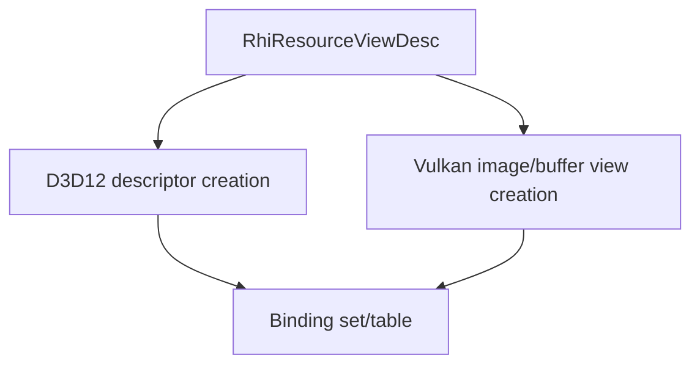

Done criteria:

1. FrameGraph no longer directly reasons about CPU descriptor handles as its long-term view identity.
2. D3D12 descriptor handles become one backend implementation of a view.
3. Vulkan can represent image views and descriptor writes without abusing D3D12 handle types.

### Phase 5: Binding Layout And Binding Set Hardening

Goal: turn shader reflection into backend-neutral binding layouts.

Tasks:

1. Audit `RenderBindingLayout` and `RenderBindingLayoutCompileDesc` for D3D12-only assumptions.
2. Ensure shader reflection uses set/space, binding/register, visibility, resource type, count, and push constants.
3. D3D12 backend compiles root signatures from the neutral layout.
4. Vulkan backend will compile descriptor set layouts and pipeline layouts from the same neutral layout.
5. Add future bindless metadata fields without enabling bindless behavior yet.

Bindful now, bindless later:

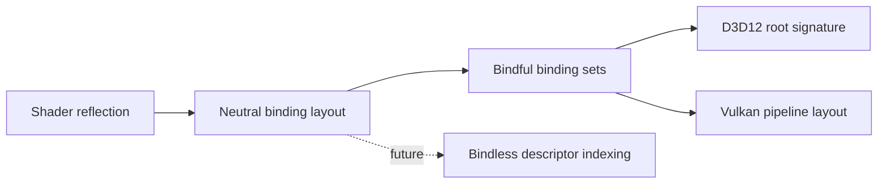

Done criteria:

1. No renderer pass needs to know whether bindings become D3D12 root parameters or Vulkan descriptor sets.
2. Push constants/root constants have a single RHI description.
3. Bindless future path is documented and not blocked by current layout model.

### Phase 6: Shader Package And Runtime Binary Selection

Goal: make DXIL/SPIR-V a first-class runtime choice.

Tasks:

1. Ensure cooked shader packages can contain DXIL and SPIR-V variants for the same logical shader.
2. Make `GetRequiredShaderBinaryFormat()` drive runtime selection everywhere.
3. Add validation for missing backend shader variants.
4. Prepare Vulkan pipeline shader module creation from SPIR-V.
5. Keep one source shader authoring path where possible.

Done criteria:

1. D3D12 loads only DXIL.
2. Vulkan loads only SPIR-V.
3. Missing shader variant errors name the shader, pass, and backend.

### Phase 7: Vulkan Dependency And Loader Foundation

Goal: add Vulkan SDK/loader integration without touching Renderer behavior.

Tasks:

1. Add CMake discovery for Vulkan SDK.
2. Add VMA dependency and backend-private wrapper target.
3. Create `Engine/RHI/Private/Vulkan` folder structure.
4. Add Vulkan result/error utilities and debug-name helpers.
5. Add validation script boundary rules for `Vk`, `Vma`, and Vulkan headers.

Done criteria:

1. Vulkan headers and VMA are private to Vulkan backend code.
2. The project can configure with Vulkan enabled or disabled.
3. No public headers include Vulkan or VMA concrete types.

### Phase 8: Vulkan Device, Adapter, Queue, And Diagnostics Bootstrap

Goal: create a Vulkan backend service that can initialize and report itself.

Tasks:

1. Create Vulkan instance on Windows with debug utils in development configs.
2. Enumerate physical devices and select an adapter.
3. Create logical device with graphics queue first.
4. Enable Vulkan 1.3 baseline where available: synchronization2 and dynamic rendering should be preferred.
5. Add Vulkan diagnostics provider for validation messages, device info, enabled extensions, and object names.
6. Return a `VulkanRenderHardwareInterface` from backend factory.

Done criteria:

1. Backend selection can choose Vulkan and initialize the device.
2. Diagnostics identify API, adapter, driver, validation status, and enabled extensions.
3. No rendering yet is acceptable in this phase.

### Phase 9: Vulkan Swapchain And Present Resource Wrapping

Goal: make Vulkan present resources look like normal RHI resources.

Tasks:

1. Create Win32 Vulkan surface and swapchain.
2. Wrap swapchain images into RHI resource records.
3. Create image views for back buffers through the same view model as other textures.
4. Implement acquire/present flow with semaphores/fences hidden inside backend services.
5. Match D3D12 present format and viewport/scissor behavior.

Visual target:

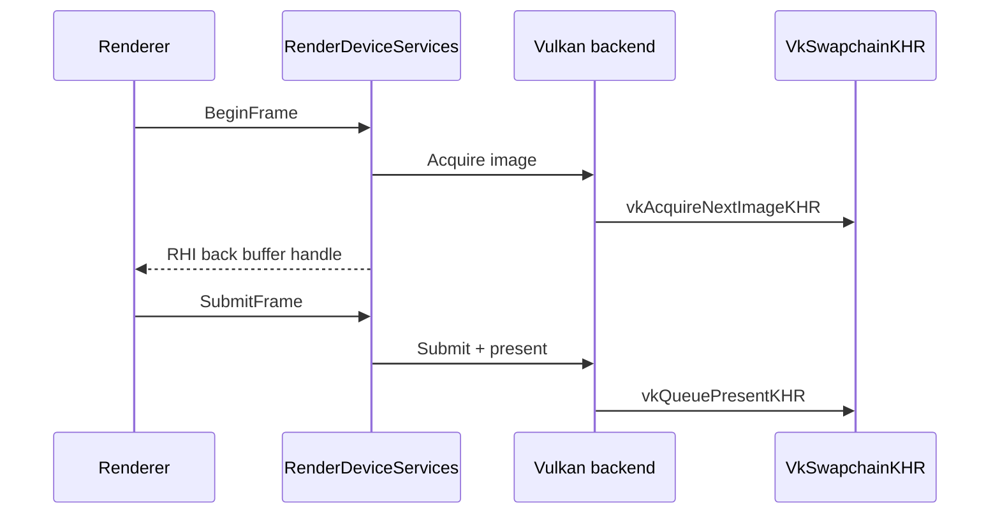

Done criteria:

1. Vulkan backend exposes current back buffer through the same RHI API as D3D12.
2. Resize and teardown are backend-private.
3. Present synchronization is not visible to Renderer.

### Phase 10: Vulkan Command List And Submission

Goal: implement command recording enough for clear/present and FrameGraph playback later.

Tasks:

1. Implement Vulkan command pool and command buffer lifecycle.
2. Map `RenderCommandList` commands to Vulkan commands.
3. Implement debug markers and object naming.
4. Implement frame fence retirement compatible with D3D12 delayed destruction semantics.
5. Keep command allocator/pool ownership multithreading-ready by avoiding global command-buffer reuse assumptions.

Done criteria:

1. Vulkan can begin/end a frame command buffer.
2. Command buffers are safely reset after GPU completion.
3. The design can later allocate per-thread command pools.

### Phase 11: Vulkan Memory With VMA

Goal: make VMA a core Vulkan foundation matching D3D12MA.

Tasks:

1. Add `VulkanGpuMemoryAllocator` behind Vulkan backend-private code.
2. Create buffers and images through VMA.
3. Track memory category, residency class, debug name, and live allocation records.
4. Implement budget/stat snapshots through VMA.
5. Implement JSON/stat dump equivalent where possible.
6. Mirror delayed destruction behavior from D3D12.

Done criteria:

1. No normal Vulkan resource creation bypasses VMA.
2. Public memory diagnostics show D3D12MA and VMA through the same structures.
3. Allocation categories match between backends.

### Phase 12: Resource Creation And Upload Path Parity

Goal: get textures, buffers, constant uploads, and staging working on both backends.

Tasks:

1. Implement Vulkan texture creation from `RhiTextureResourceDesc`.
2. Implement Vulkan buffer creation from `RhiBufferResourceDesc`.
3. Implement upload buffers/staging with VMA host-visible allocations.
4. Replace D3D12-shaped upload assumptions with neutral copy/upload APIs.
5. Validate mesh/index/texture path parity.

Done criteria:

1. Static mesh buffers can be created on D3D12 and Vulkan through the same Renderer path.
2. Texture upload and layout transitions are driven by RHI/FrameGraph policy.
3. Upload scheduling does not expose D3D12 resource states or Vulkan layouts to Renderer.

### Phase 13: Barrier And Resource State Translation

Goal: make Sparkle's neutral `ResourceState` model execute correctly on Vulkan.

Tasks:

1. Audit every `ResourceState` used by FrameGraph.
2. Create D3D12 and Vulkan translation tables side by side.
3. Implement Vulkan image layout, access mask, and pipeline stage mapping.
4. Prefer Vulkan synchronization2 if available.
5. Add validation for unsupported or ambiguous state combinations.

Visual target:

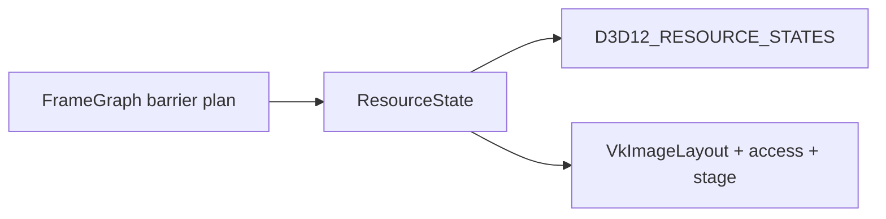

Done criteria:

1. FrameGraph remains the only high-level barrier planner.
2. D3D12 and Vulkan barrier translators are small, explicit, and testable.
3. Vulkan layout transitions are not guessed at individual pass sites.

Phase notebook:

```text
Phase: 13 - Barrier And Resource State Translation
Learning goal: ResourceState is Sparkle's synchronization intent; D3D12 consumes it as resource states, Vulkan consumes it as synchronization2 stage/access/layout triples.
Files studied: ResourceState.h, D3D12TypeConversions.cpp, VulkanTypeConversions.cpp, VulkanRenderCommandList.cpp, FrameGraphBarrierPlayback.cpp, FrameGraphCompiler.cpp.
Files changed: VulkanTypeConversions.*, VulkanRenderCommandList.*, VulkanRenderHardwareInterface.*, D3D12RenderHardwareInterface.*, ValidateRhiBackendBoundaries.cmake.
Backend-neutral concept introduced: centralized ResourceState translation plus buffer/image support validation.
D3D12 behavior preserved: D3D12TypeConversions::ToResourceStates remains the explicit D3D12 mapping table.
Vulkan behavior enabled: FrameGraph barrier playback reaches vkCmdPipelineBarrier2 through RenderCommandList::TransitionResource and UnorderedAccessBarrier.
Validation run: FrameGraph boundary, RHI backend boundary, RHI memory boundary, ShaderCompiler boundary, shader package parity, git diff --check, Vulkan trailing-whitespace scan.
Open risks: texture-from-path upload still needs the Phase 12 texture loader/copy scheduling follow-up; no full build was run by prompt policy.
```

ResourceState inventory:

| State | FrameGraph/RHI use | Vulkan support rule |
| --- | --- | --- |
| `Common` | default initial/final state and fallback tracked state | buffer and image |
| `RenderTarget` | color attachment writes | image only |
| `DepthWrite` | depth attachment writes | image only |
| `DepthRead` | depth read/pass sampling intent | image only |
| `ShaderResource` | sampled/SRV read intent | buffer and image |
| `UnorderedAccess` | UAV/storage read-write intent and UAV barriers | buffer and image |
| `RayTracingAccelerationStructure` | acceleration structure resources | buffer only |
| `CopySource` | copy/read transfer source | buffer and image |
| `CopyDest` | copy/write transfer destination | buffer and image |
| `Present` | imported back buffer initial/final state | image only |

### Phase 14: Pipeline State And Render Pass Execution

Goal: create graphics/compute pipelines and execute core FrameGraph passes on Vulkan.

Tasks:

1. Implement Vulkan shader module creation from SPIR-V.
2. Implement Vulkan graphics pipeline creation from neutral PSO desc.
3. Implement Vulkan compute pipeline creation.
4. Use dynamic rendering for FrameGraph attachment execution if Vulkan 1.3 baseline is accepted.
5. Map viewport, scissor, blend, raster, depth, primitive topology, and formats.

Done criteria:

1. A simple FrameGraph pass can clear and draw on both backends.
2. PSO cache keys include backend-relevant state without leaking backend types publicly.
3. Pipeline errors report missing state clearly.

Phase notebook:

```text
Phase: 14 - Pipeline State And Render Pass Execution
Learning goal: Sparkle's neutral PSO descriptions now feed D3D12 bytecode and Vulkan SPIR-V/native pipeline state without widening the public RHI surface.
Files studied: RhiPipelineStateDesc.h, CookedShaderPackageCache.h, D3D12PipelineState.*, D3D12BindingLayout.*, VulkanRenderHardwareInterface.cpp, VulkanRenderCommandList.cpp, RenderPassShaderRuntime.h, ShaderPass.cpp, GBufferPass.cpp.
Files changed: VulkanShaderModule.*, VulkanBindingLayout.*, VulkanPipelineState.*, VulkanTypeConversions.*, VulkanRenderHardwareInterface.cpp, VulkanRenderCommandList.*, VulkanCommandContext.cpp, ValidateRhiBackendBoundaries.cmake.
Backend-neutral concept introduced: pipeline creation remains driven by RenderBindingLayout, GraphicsPipelineStateDesc, ComputePipelineStateDesc, and cooked shader package records.
D3D12 behavior preserved: existing D3D12 PSO/root-signature creation remains the reference backend and public PSO factories are unchanged.
Vulkan behavior enabled: SPIR-V shader modules, descriptor-set-layout-backed pipeline layouts, dynamic-rendering graphics pipelines, compute pipelines, pipeline binding, draw, indexed draw, dispatch, and attachment clear execution.
Validation run: source gates only per prompt policy; no full build.
Open risks: descriptor allocation/writes moved into Phase 15; texture asset loading on Vulkan remains a later resource-loader slice.
```

### Phase 15: Descriptor Sets, Binding Sets, And Material Tables

Goal: run bindful material/FrameGraph bindings on Vulkan.

Tasks:

1. Implement Vulkan descriptor set layout creation from `RenderBindingLayout`.
2. Implement descriptor pool/page allocator.
3. Implement binding set creation and descriptor writes.
4. Map existing material descriptor table behavior to Vulkan descriptor sets or table emulation.
5. Keep room for descriptor indexing later.

Done criteria:

1. Existing material path does not fork by backend.
2. Vulkan binding sets retain referenced resources until command completion.
3. Descriptor allocation is thread-safe or has a documented future per-thread/page design.

Phase notebook:

```text
Phase: 15 - Descriptor Sets, Binding Sets, And Material Tables
Learning goal: Sparkle's existing bindful material table and FrameGraph binding path now maps to Vulkan descriptor sets without adding renderer-side backend branches.
Files studied: RhiDescriptorHandles.h, RenderHardwareInterface.h, PassBinder.cpp, MaterialCacheManager.cpp, RhiResourceView.h, D3D12RenderHardwareInterface.cpp, D3D12RenderCommandList.cpp, VulkanBindingLayout.*, VulkanRenderHardwareInterface.*, VulkanRenderCommandList.*.
Files changed: VulkanDescriptorAllocator.*, VulkanRenderHardwareInterface.*, VulkanRenderCommandList.*, VulkanRenderDeviceServices.cpp, VulkanPipelineState.h, ValidateRhiBackendBoundaries.cmake.
Backend-neutral concept introduced: RHI descriptor tables remain logical handles; Vulkan decodes those handles into backend-private descriptor payloads and writes native descriptor sets at bind time.
D3D12 behavior preserved: existing descriptor heap/table allocation and renderer PassBinder/material-table code remain unchanged.
Vulkan behavior enabled: per-frame descriptor pool pages, descriptor set allocation, table/handle/buffer/sampler descriptor writes, vkCmdBindDescriptorSets, vkCmdPushConstants, resource-view descriptor handles, and shared sampler tables.
Validation run: source gates only per prompt policy; no full build.
Open risks: Vulkan texture-from-path loading is still deferred, so material table infrastructure exists before source texture asset import reaches backend parity.
```

### Phase 16: ImGui And Editor Presentation

Goal: make the editor run on both backends without leaking backend UI code into Renderer.

Tasks:

1. Move ImGui backend implementation behind backend-private RHI UI hooks.
2. Keep Editor using `InitializeImGuiBackend`, `BeginImGuiFrame`, `RenderImGuiDrawData`, and shutdown through RHI only.
3. Add Vulkan ImGui backend wiring privately.
4. Ensure present overlay pass abstraction maps to D3D12 and Vulkan.

Done criteria:

1. Editor UI compiles without including Vulkan or D3D12 backend headers.
2. Backend-specific ImGui code lives only in backend private code.
3. D3D12 and Vulkan editor presentation have matching behavior.

### Phase 17: FrameGraph Transient Resource Parity

Goal: make transient aliasing/materialization backend-neutral and allocator-backed.

Tasks:

1. Move FrameGraph transient block/resource materialization to neutral RHI memory block APIs.
2. D3D12 implementation uses D3D12MA for memory block/resource mechanics.
3. Vulkan implementation uses VMA for transient images/buffers and aliasing strategy selected during design.
4. Keep FrameGraph lifetime and alias policy in Renderer.
5. Add diagnostics category `FrameGraphTransient` for both backends.

Done criteria:

1. Renderer owns logical aliasing policy.
2. Backends own allocator mechanics.
3. D3D12 and Vulkan report transient memory consistently.

### Phase 18: Ray Tracing Parity Planning

Goal: decide how much current D3D12 ray tracing feature surface must be Vulkan-parity before calling Vulkan first-class.

Tasks:

1. Inventory current ray tracing APIs and Showcase usage.
2. Map D3D12 acceleration structure concepts to Vulkan KHR acceleration structures.
3. Decide milestone split: raster parity first, ray tracing parity later, or full parity before merge.
4. Keep public acceleration structure APIs backend-neutral.
5. Use VMA for AS backing buffers.

Done criteria:

1. No D3D12 ray tracing API leaks into Renderer pass code.
2. Vulkan unsupported ray tracing path is explicit until implemented.
3. Portfolio narrative explains the staged parity decision honestly.

### Phase 19: Diagnostics, Validation Layer, And Parity Gates

Goal: make architecture quality visible and enforceable.

Tasks:

1. Add backend parity validation script.
2. Add forbidden-token validation for public and Renderer layers.
3. Add memory diagnostics parity checks.
4. Add shader package variant validation.
5. Add runtime backend selection smoke tests.
6. Add optional RHI validation wrapper after both backends exist.

Validation examples:

```text
No ID3D12/Vk/Vma/D3D12MA in Renderer/Public
No ID3D12/Vk/Vma/D3D12MA in RHI/Public except opaque interop handles
No direct CreateCommittedResource outside D3D12 memory service exceptions
No vkCreateBuffer/vkCreateImage outside Vulkan memory service exceptions
Every RenderHardwareInterface method implemented by D3D12 and Vulkan
Every cooked shader used by Showcase has DXIL and SPIR-V variants
```

Done criteria:

1. A validation command can prove architectural boundaries from source.
2. Runtime logs clearly show selected backend and feature support.
3. Missing parity is tracked, not accidental.

### Phase 20: Legacy Deletion And Architecture Tightening

Goal: remove scaffolding, compatibility leftovers, and wrappers that did not earn their keep.

Tasks:

1. Delete temporary D3D12-only Renderer paths.
2. Delete migration wrappers that simply forward without enforcing policy.
3. Collapse names that exist only because Vulkan was added incrementally.
4. Update docs to describe implemented architecture, not planned architecture.
5. Final source and runtime validation on both backends.

Done criteria:

1. The final architecture is smaller than the transition architecture.
2. Every remaining abstraction has a clear owner and reason to exist.
3. D3D12 and Vulkan are both first-class, selectable, and documented.

## Learning-Oriented Prompt Map

The roadmap above is architectural. The table below is the implementation learning path. Each row is small enough to become one prompt or one short prompt series. The point is to learn Vulkan and multi-backend architecture by repeatedly touching a narrow piece of the engine, seeing how D3D12 expresses it, then designing the Vulkan peer.

| Prompt | Phase | Coding slice | What you learn by doing | Artifact |
| --- | --- | --- | --- | --- |
| 0.1 | Inventory | Public RHI method audit | How to read an RHI as a contract, not as a set of C++ functions | Parity inventory table |
| 0.2 | Inventory | Renderer dependency sweep | How backend leakage creeps into higher layers | Forbidden-token list |
| 0.3 | Inventory | D3D12 vocabulary map | Which names describe engine concepts and which describe D3D12 mechanics | Rename candidate table |
| 0.4 | Inventory | Parity status vocabulary | How professional engines track backend feature gaps | `Parity`, `TemporaryD3D12`, `UnsupportedByDesign` statuses |
| 1.1 | Backend factory | Add backend selection config | How runtime backend selection should enter the engine | Backend selection type/config |
| 1.2 | Backend factory | Extract D3D12 service construction | How to separate bootstrap ownership from rendering API | D3D12 service factory |
| 1.3 | Backend factory | Preserve Renderer call sites | How a good abstraction keeps call sites stable | Renderer unchanged through refactor |
| 1.4 | Backend factory | Unsupported backend diagnostics | How to fail clearly before Vulkan exists | Clear error path |
| 2.1 | Build split | Identify common vs D3D12 RHI sources | How build systems enforce architecture | Source classification list |
| 2.2 | Build split | Create common/backend target shape | How backend libraries become peers | CMake target split |
| 2.3 | Build split | Move D3D12MA under D3D12 backend | How third-party allocator privacy is enforced | Backend-private D3D12MA link |
| 2.4 | Build split | Add Vulkan target placeholder | How to prepare a backend without implementing it yet | Empty Vulkan backend target |
| 3.1 | Vocabulary | Rename transient heap handle | How public names constrain future APIs | Memory block handle |
| 3.2 | Vocabulary | Rename placed resource APIs | How aliasing/materialization differs from D3D12 placed resources | Neutral transient materialization API |
| 3.3 | Vocabulary | Hide descriptor heap setup | Why Vulkan should not inherit D3D12 descriptor heap language | Neutral global binding setup |
| 3.4 | Vocabulary | Update diagnostics/debug names | How tooling follows public architecture | Neutral debug-name overloads |
| 4.1 | Resource views | Define view desc model | How RTV/SRV/UAV/DSV map to Vulkan image views and descriptors | `RhiResourceViewDesc` |
| 4.2 | Resource views | Add logical view handle | Why a view is not always a descriptor pointer | `RhiResourceViewHandle` or documented alternative |
| 4.3 | Resource views | Move FrameGraph to logical views | How FrameGraph stays API-agnostic | FrameGraph view requests |
| 4.4 | Resource views | Keep D3D12 descriptor implementation private | How to keep native mechanics without leaking them | D3D12 view implementation |
| 5.1 | Bindings | Audit reflection fields | How shader reflection becomes binding layout data | Reflection audit notes |
| 5.2 | Bindings | Normalize layout desc | How register/space maps to descriptor set/binding | Backend-neutral binding layout |
| 5.3 | Bindings | Preserve D3D12 root signature path | How to refactor without losing current backend behavior | D3D12 root layout compiler |
| 5.4 | Bindings | Add bindless-ready metadata | How to prepare for descriptor indexing without building bindless now | Future bindless fields/docs |
| 6.1 | Shaders | Audit cooked shader package use | How runtime selects API-specific binaries | Shader load path inventory |
| 6.2 | Shaders | Enforce required binary format | Why D3D12 wants DXIL and Vulkan wants SPIR-V | Runtime format gate |
| 6.3 | Shaders | Add missing variant diagnostics | How shader failures become actionable | Backend-specific error messages |
| 6.4 | Shaders | Prepare SPIR-V module data path | What Vulkan pipeline creation needs from shader packages | SPIR-V-ready loader surface |
| 7.1 | Vulkan dependency | Add Vulkan SDK discovery | How native SDK dependencies enter CMake cleanly | Vulkan CMake option/find package |
| 7.2 | Vulkan dependency | Add VMA backend-private dependency | Why VMA should be present before resource creation | `SparkleVMA` target or equivalent |
| 7.3 | Vulkan dependency | Create Vulkan folder skeleton | How file layout communicates backend ownership | `Engine/RHI/Private/Vulkan/**` |
| 7.4 | Vulkan dependency | Add Vulkan boundary validation | How source gates prevent future leaks | Vulkan forbidden-token script rules |
| 8.1 | Vulkan device | Create instance and debug utils | How Vulkan starts before a device exists | Instance owner |
| 8.2 | Vulkan device | Enumerate physical devices | How adapters map between DXGI and Vulkan | Adapter selection code |
| 8.3 | Vulkan device | Pick queue families | Why queues are explicit API concepts | Queue family record |
| 8.4 | Vulkan device | Create logical device | How feature and extension chains shape Vulkan capability | Device owner |
| 8.5 | Vulkan diagnostics | Report adapter and validation state | How diagnostics become portfolio evidence | Vulkan diagnostics provider |
| 9.1 | Swapchain | Create Win32 surface | How Windows platform seams feed Vulkan | Surface owner |
| 9.2 | Swapchain | Select format/present mode | How presentation differs from D3D12 DXGI | Swapchain config code |
| 9.3 | Swapchain | Wrap images as RHI resources | How native resources enter a shared RHI | Back buffer records |
| 9.4 | Swapchain | Implement acquire/present | Why semaphores and fences matter | Present flow hidden behind services |
| 10.1 | Commands | Create command pools/buffers | How Vulkan command allocation differs from D3D12 allocators | Per-frame command owner |
| 10.2 | Commands | Implement begin/end/reset | How command buffer lifecycle follows GPU completion | Command lifecycle code |
| 10.3 | Commands | Add debug labels | How GPU tooling sees your frame | Marker implementation |
| 10.4 | Commands | Submit with fence retirement | How delayed destruction becomes backend-neutral | Submission/fence path |
| 11.1 | VMA memory | Create VMA allocator | How physical/logical device data feeds VMA | `VulkanGpuMemoryAllocator` |
| 11.2 | VMA memory | Allocate buffers | How usage, memory type, and residency meet | VMA buffer allocation path |
| 11.3 | VMA memory | Allocate images | How Vulkan image allocation differs from D3D12 resources | VMA image allocation path |
| 11.4 | VMA memory | Track categories and names | How memory diagnostics stay backend-neutral | Live allocation records |
| 11.5 | VMA memory | Expose budget snapshots | How VMA and D3D12MA become comparable | Shared memory snapshot output |
| 12.1 | Resources | Implement buffer creation parity | How mesh/index/constant buffers map to Vulkan | Vulkan buffer factory |
| 12.2 | Resources | Implement texture creation parity | How formats, usages, mips, and initial layout map | Vulkan texture factory |
| 12.3 | Resources | Implement upload staging | Why host-visible memory is a policy, not a hack | Upload staging path |
| 12.4 | Resources | Neutralize upload API | How D3D12 and Vulkan copies share one renderer call | Backend-neutral upload interface |
| 13.1 | Barriers | List all Sparkle resource states | How the engine names synchronization intent | State inventory |
| 13.2 | Barriers | Write D3D12 translation table | How current behavior is made explicit | D3D12 state map |
| 13.3 | Barriers | Write Vulkan layout/access/stage table | How Vulkan synchronization2 thinks | Vulkan barrier map |
| 13.4 | Barriers | Route FrameGraph barriers to Vulkan | How the FrameGraph becomes the synchronization authority | Vulkan barrier playback |
| 14.1 | Pipelines | Create shader modules | How SPIR-V becomes executable shader state | VkShaderModule owner |
| 14.2 | Pipelines | Translate raster/depth/blend state | How neutral PSO state maps to Vulkan structs | Graphics state translator |
| 14.3 | Pipelines | Create graphics pipeline | How render target formats and layouts affect pipelines | Vulkan graphics PSO |
| 14.4 | Pipelines | Create compute pipeline | How compute is simpler but still layout-bound | Vulkan compute PSO |
| 14.5 | Pipelines | Execute first FrameGraph draw/clear | How the pieces meet in a real frame | Minimal Vulkan FrameGraph pass |
| 15.1 | Descriptors | Create descriptor set layouts | How binding layout becomes Vulkan layout | VkDescriptorSetLayout owner |
| 15.2 | Descriptors | Build descriptor pool/page allocator | How descriptor lifetime is managed | Vulkan descriptor allocator |
| 15.3 | Descriptors | Write texture/buffer descriptors | How resource views become shader-visible | Descriptor write code |
| 15.4 | Descriptors | Map material tables | How Sparkle material binding survives both APIs | Backend-neutral material table path |
| 16.1 | Editor UI | Move ImGui backend code private | How tooling integrations stay out of Renderer | Backend-private ImGui owners |
| 16.2 | Editor UI | Add Vulkan ImGui init/render/shutdown | How third-party UI maps to Vulkan | Vulkan ImGui backend path |
| 16.3 | Editor UI | Keep overlay pass neutral | How present overlays avoid backend forks | Shared editor RHI calls |
| 17.1 | Transients | Define transient memory block contract | How aliasing starts from engine intent | Neutral transient API |
| 17.2 | Transients | Keep FrameGraph alias planning in Renderer | Why allocator libraries should not own pass lifetimes | FrameGraph plan ownership |
| 17.3 | Transients | Implement D3D12MA transient block path | How D3D12MA backs aliasing mechanics | D3D12 transient implementation |
| 17.4 | Transients | Implement VMA transient resource strategy | How Vulkan aliasing/resource lifetime differs | Vulkan transient implementation |
| 17.5 | Transients | Add transient memory diagnostics parity | How to compare both backends under load | `FrameGraphTransient` stats |
| 18.1 | Ray tracing | Inventory current DXR path | How ray tracing resources differ from raster resources | Ray tracing parity inventory |
| 18.2 | Ray tracing | Map BLAS/TLAS API concepts | How Vulkan KHR AS maps to D3D12 AS | Cross-backend AS mapping |
| 18.3 | Ray tracing | Decide staged support boundary | How to be honest about feature parity | Ray tracing milestone decision |
| 18.4 | Ray tracing | Keep public API neutral | How future Vulkan RT avoids D3D12 naming | Neutral RT API cleanup |
| 19.1 | Validation | Add backend boundary gate | How architecture becomes enforceable | `ValidateRhiBackendBoundaries.cmake` |
| 19.2 | Validation | Add shader parity gate | How missing DXIL/SPIR-V variants are caught | Shader package parity script |
| 19.3 | Validation | Add memory parity checks | How D3D12MA/VMA diagnostics stay comparable | Memory diagnostics gate |
| 19.4 | Validation | Add runtime smoke command docs | How to test both backends consistently | D3D12/Vulkan smoke instructions |
| 20.1 | Cleanup | Delete temporary migration code | How to avoid carrying scaffolding forever | Removed temporary files/wrappers |
| 20.2 | Cleanup | Collapse low-value abstractions | How to judge whether a wrapper earns its keep | Smaller backend/RHI diff |
| 20.3 | Cleanup | Update architecture docs | How documentation matches implemented reality | Final architecture docs |
| 20.4 | Cleanup | Final parity review | How to present the work professionally | Parity checklist and caveats |

## Phase Notebook Template

For each prompt, keep a short note in the implementation commit message or phase tracker:

```text
Phase:
Learning goal:
Files studied:
Files changed:
Backend-neutral concept introduced:
D3D12 behavior preserved:
Vulkan behavior enabled or planned:
Validation run:
Open risks:
```

This keeps the work educational. It also creates interview-ready material because every phase can be explained as a deliberate architecture lesson, not just a pile of code.

## Execution Prompt Contract

Every implementation prompt in this plan should preserve these rules unless the user explicitly changes direction:

1. Read the current repo state before editing. Do not assume previous edits still exist.
2. Keep D3D12 and Vulkan as peer backends under one shared RHI contract.
3. Prefer deleting or renaming D3D12-shaped public concepts over adding compatibility wrappers.
4. Keep Vulkan, VMA, D3D12, and D3D12MA concrete types out of public RHI and Renderer surfaces except explicit opaque interop handles.
5. Keep FrameGraph policy in Renderer: pass order, lifetimes, aliasing intent, resource states, and logical view requests.
6. Keep backend code responsible for native translation: device creation, allocation mechanics, barriers, descriptors, command submission, and diagnostics.
7. Use D3D12MA for D3D12 allocations and VMA for Vulkan allocations from the first real backend resource phase.
8. Keep bindful rendering working first, but do not block descriptor indexing, bindless tables, or direct heap indexing later.
9. Keep the current single-threaded execution path simple, but avoid global ownership that would block future per-thread command pools or descriptor pages.
10. Do not build the project after each prompt. Prompt-level validation should use source gates, text checks, docs checks, and targeted script checks only. Build and runtime validation are reserved for milestone checkpoints or an explicit user request.

Prompt validation is intentionally not the same as build validation. If a phase changes signatures, CMake structure, or runtime behavior enough that a build will be needed, record that as a milestone validation item instead of running it at the end of the prompt.

Each prompt should end with:

```text
Phase status:
What was learned:
Architectural result:
Validation run:
Deferred risks:
```

## Copy-Ready Phase Prompts

These prompts are intentionally detailed. They are written so a future implementation session can start from the document, execute a bounded phase, and keep the final architecture aligned with this plan.

### Phase 0 Execution Prompt

```text
Implement Phase 0: Architecture Inventory And Parity Baseline.

Goal: build a factual parity inventory before code movement. Study the current RHI, Renderer, FrameGraph, shader, memory, diagnostics, and CMake structure. Do not make runtime architecture changes in this phase unless a small validation/doc helper is necessary.

Learning goal: understand Sparkle's current RHI as a contract and identify which parts are engine concepts versus D3D12 assumptions.

Required work:
1. Create or expand a parity inventory section/file that lists every public RenderHardwareInterface method and its D3D12/Vulkan disposition.
2. Sweep Renderer and RHI public/private boundaries for D3D12, DXGI, D3D12MA, Vk, Vulkan, VMA, heap, placed resource, descriptor heap, and native handle assumptions.
3. Classify each finding as Core, BackendSpecific, TemporaryD3D12, Future, or UnsupportedByDesign.
4. List the public names that should be neutralized before Vulkan is implemented.
5. Propose source validation gates needed to prevent regression.

Constraints:
1. Do not run a full build.
2. Do not refactor implementation code yet.
3. Do not mark a feature unsupported silently. Every gap must have a reason.
4. Do not build the project after this prompt; mark build-sensitive findings for the next milestone checkpoint.

Deliverables:
1. Parity inventory with feature status.
2. Boundary risk list.
3. Public vocabulary cleanup list.
4. Phase notebook entry.

Validation:
1. Run text/source checks relevant to the inventory.
2. Run trailing whitespace check on edited docs.
3. Record any build-sensitive findings for milestone validation instead of building now.
```

### Phase 1 Execution Prompt

```text
Implement Phase 1: Backend Selection And Device Services Factory.

Goal: make D3D12 pass through an explicit backend factory so Vulkan can become a peer without changing Renderer ownership.

Learning goal: separate backend bootstrap from renderer-facing RHI usage.

Required work:
1. Add or extend backend selection config using the existing ERhiBackendApi direction.
2. Refactor RenderDeviceServices::Create so it accepts backend selection and dispatches to a backend-specific creation path.
3. Move current D3D12 service construction into a D3D12-private factory or service builder.
4. Preserve existing Renderer and Editor call sites as much as possible.
5. Add a clear unsupported-backend error path for Vulkan until Phase 8 provides a real implementation.

Constraints:
1. Do not introduce a fake Vulkan renderer.
2. Do not leak D3D12 service types into public Renderer APIs.
3. Do not keep old direct construction beside the factory unless it is private and temporary.

Deliverables:
1. Backend-aware RenderDeviceServices creation.
2. D3D12 backend service creation isolated behind the factory.
3. Backend selection diagnostics.
4. Phase notebook entry.

Validation:
1. Run source boundary checks.
2. Do not build after this prompt; record broad signature changes for the M1 milestone build.
```

### Phase 2 Execution Prompt

```text
Implement Phase 2: CMake Backend Target Split.

Goal: make build targets express backend ownership. SparkleRHI should no longer be a single undifferentiated target that privately means D3D12.

Learning goal: use the build system to enforce architecture instead of relying on convention.

Required work:
1. Classify current RHI sources into common code and D3D12 backend code.
2. Split CMake targets so D3D12 system libraries, ImGui DX12 backend, and D3D12MA belong to the D3D12 backend target.
3. Add a Vulkan backend option and placeholder target structure without implementing runtime Vulkan yet.
4. Keep Renderer linking against the shared RHI contract and selected backend composition target, not raw graphics APIs.
5. Update validation rules to detect accidental backend library leakage.

Constraints:
1. Do not mix D3D12 and Vulkan source globs in a shared private backend bucket.
2. Do not expose D3D12MA include directories publicly outside the D3D12 backend need.
3. Do not require Vulkan SDK to build D3D12-only configurations.

Deliverables:
1. Common/backend CMake split.
2. D3D12 backend target owning D3D12 dependencies.
3. Vulkan option and placeholder target.
4. Phase notebook entry.

Validation:
1. Run CMake/source validation scripts that do not require a full build.
2. Do not build after this prompt; record CMake graph risks for the M1 milestone build.
```

### Phase 3 Execution Prompt

```text
Implement Phase 3: Public RHI Vocabulary Cleanup.

Goal: remove D3D12 heap and placed-resource vocabulary from public RHI before Vulkan has to imitate it.

Learning goal: understand how public names shape backend architecture.

Required work:
1. Rename public transient heap handles and methods to neutral memory block terminology.
2. Rename placed-resource creation methods to aliasing or transient materialization terminology.
3. Hide descriptor heap setup behind a neutral backend/global binding setup method or keep it as a D3D12-private operation.
4. Update FrameGraph transient allocation call sites to use neutral names.
5. Update diagnostics debug-name APIs to match the new neutral handle vocabulary.

Constraints:
1. Prefer direct renames over compatibility shims.
2. Keep D3D12 implementation free to use ID3D12Heap internally.
3. Do not introduce Vulkan-specific names in public APIs.

Deliverables:
1. Neutral public transient memory API.
2. Updated D3D12 private implementation names.
3. Updated FrameGraph call sites.
4. Phase notebook entry explaining removed D3D12 vocabulary.

Validation:
1. Search public RHI and Renderer for leftover public heap/placed-resource terms.
2. Run source boundary gates and whitespace checks.
```

### Phase 4 Execution Prompt

```text
Implement Phase 4: Backend-Neutral Resource And View Model.

Goal: make resource views an engine concept that can map to D3D12 descriptors or Vulkan image/buffer views and descriptor writes.

Learning goal: separate resource identity, view identity, and descriptor binding.

Required work:
1. Define a neutral RHI resource view description for texture SRV/UAV/RTV/DSV, buffer SRV/UAV, and acceleration structure SRV intent.
2. Decide whether existing descriptor handles can safely represent logical views or whether a new RhiResourceViewHandle is needed.
3. Move FrameGraph code toward requesting logical views instead of D3D12-shaped CPU descriptor handles.
4. Keep D3D12 descriptor allocation and descriptor handle math private to D3D12 code.
5. Document how the same view desc will map to VkImageView, VkBufferView, and descriptor set writes later.

Constraints:
1. Do not break material binding or FrameGraph execution without documenting the transition.
2. Do not make Vulkan emulate D3D12 descriptor pointer semantics.
3. Avoid broad renderer rewrites outside view ownership.

Deliverables:
1. Resource view desc/handle model.
2. D3D12 implementation of the view model.
3. FrameGraph view ownership update.
4. Phase notebook entry.

Validation:
1. Search for direct descriptor-handle assumptions in FrameGraph after the change.
2. Run source gates.
```

### Phase 5 Execution Prompt

```text
Implement Phase 5: Binding Layout And Binding Set Hardening.

Goal: make shader reflection and binding layouts compile to D3D12 root signatures now and Vulkan descriptor set layouts later.

Learning goal: understand binding spaces, registers, descriptor sets, push constants, and root constants as one neutral contract.

Required work:
1. Audit current RenderBindingLayout and RenderBindingLayoutCompileDesc fields.
2. Normalize binding layout data around set/space, binding/register, resource type, count, visibility, and push constant/root constant ranges.
3. Keep the D3D12 root signature compiler as one backend implementation of the neutral layout.
4. Add Vulkan-ready layout data needed for descriptor set layouts and pipeline layouts.
5. Add bindless-ready metadata without enabling bindless rendering yet.

Constraints:
1. Do not force bindless into this phase.
2. Do not let Renderer passes decide D3D12 root parameters or Vulkan descriptor sets.
3. Keep shader reflection source of truth centralized.

Deliverables:
1. Neutral binding layout contract.
2. D3D12 root signature path preserved.
3. Vulkan pipeline-layout requirements documented in code/docs.
4. Phase notebook entry.

Validation:
1. Run shader layout/source gates.
2. Search Renderer passes for backend-specific binding decisions.
```

### Phase 6 Execution Prompt

```text
Implement Phase 6: Shader Package And Runtime Binary Selection.

Goal: make DXIL and SPIR-V runtime selection explicit and validated.

Learning goal: understand how one logical shader becomes backend-specific executable code.

Required work:
1. Audit cooked shader package loading and current DXIL assumptions.
2. Ensure the runtime uses GetRequiredShaderBinaryFormat for all shader lookup and pipeline creation paths.
3. Add diagnostics for missing backend shader variants that name shader, pass, backend, and expected format.
4. Prepare the SPIR-V binary path needed for Vulkan shader module creation.
5. Add or update validation that required Showcase/runtime shaders have the expected backend variants.

Constraints:
1. D3D12 must not accidentally load SPIR-V.
2. Vulkan must not be designed to load DXIL.
3. Do not fork shader source authoring unless the existing shader toolchain requires it and the plan records why.

Deliverables:
1. Backend-driven shader binary selection.
2. Missing-variant diagnostics.
3. SPIR-V-ready runtime shader data path.
4. Phase notebook entry.

Validation:
1. Run shader package/source validation.
2. Do not build or rebuild shaders after this prompt; record shader rebuild needs for milestone validation.
```

### Phase 7 Execution Prompt

```text
Implement Phase 7: Vulkan Dependency And Loader Foundation.

Goal: add Vulkan SDK and VMA dependency structure privately, without adding real rendering behavior yet.

Learning goal: understand Vulkan as a backend dependency and keep native dependencies out of public engine layers.

Required work:
1. Add CMake discovery/options for Vulkan SDK on Windows.
2. Add VMA as a backend-private dependency or target.
3. Create the Vulkan backend folder skeleton under Engine/RHI/Private/Vulkan.
4. Add Vulkan result helpers, object-name helper declarations, and debug utility scaffolding if useful.
5. Add validation rules that forbid Vk and Vma types outside approved Vulkan backend paths and opaque interop boundaries.

Constraints:
1. Vulkan disabled builds must still configure.
2. Public RHI headers must not include Vulkan or VMA headers.
3. Do not create manual Vulkan allocations that will be replaced by VMA later.

Deliverables:
1. Vulkan/VMA build integration.
2. Vulkan private folder skeleton.
3. Boundary validation updates.
4. Phase notebook entry.

Validation:
1. Run source validation and CMake configure validation if available.
2. Do not build after this prompt; record configure/build risks for the M2 milestone checkpoint.
```

### Phase 8 Execution Prompt

```text
Implement Phase 8: Vulkan Device, Adapter, Queue, And Diagnostics Bootstrap.

Goal: create a real Vulkan backend service that initializes instance, physical device, logical device, graphics queue, and diagnostics.

Learning goal: understand Vulkan's explicit device creation chain and how it differs from D3D12/DXGI bootstrap.

Required work:
1. Implement Vulkan instance creation on Windows with debug utils in development configs.
2. Enumerate physical devices and select an adapter using clear policy.
3. Query queue families and create a logical device with graphics queue support.
4. Prefer Vulkan 1.3 features needed by the plan, especially synchronization2 and dynamic rendering where available.
5. Implement Vulkan diagnostics reporting for API, adapter, driver, validation state, and enabled extensions.
6. Wire backend factory selection so Vulkan can create services up to device initialization.

Constraints:
1. No rendering is required yet.
2. Do not expose VkInstance, VkDevice, or VkQueue through public Renderer APIs.
3. Keep feature enablement explicit and logged.

Deliverables:
1. Vulkan instance/device/queue owner.
2. Vulkan diagnostics provider.
3. Backend factory Vulkan path.
4. Phase notebook entry.

Validation:
1. Run source boundary gates.
2. Do not build after this prompt; record Vulkan startup risks for the M2 milestone checkpoint.
```

### Phase 9 Execution Prompt

```text
Implement Phase 9: Vulkan Swapchain And Present Resource Wrapping.

Goal: make Vulkan present images look like normal RHI back buffer resources.

Learning goal: understand Vulkan surfaces, swapchains, image acquisition, presentation, and how native images enter a shared RHI.

Required work:
1. Create a Win32 Vulkan surface from Sparkle's window/platform seam.
2. Select swapchain format, color space, present mode, extent, and image count.
3. Create the swapchain and wrap swapchain images as RHI resource records.
4. Create logical views for back buffers through the resource view model.
5. Implement acquire and present flow with backend-private semaphores/fences.
6. Match D3D12 viewport, scissor, format, resize, and teardown behavior.

Constraints:
1. Renderer should not know whether present is DXGI or VkSwapchainKHR.
2. Present synchronization must stay backend-private.
3. Do not bypass the RHI resource/view model for swapchain images.

Deliverables:
1. Vulkan swapchain owner.
2. RHI-wrapped back buffer resources.
3. Acquire/present lifecycle.
4. Phase notebook entry.

Validation:
1. Run source gates.
2. Do not run runtime smoke after this prompt; record present-flow risks for the M2 milestone checkpoint.
```

### Phase 10 Execution Prompt

```text
Implement Phase 10: Vulkan Command List And Submission.

Goal: implement command buffer lifecycle and submission enough to support clear/present and later FrameGraph playback.

Learning goal: compare D3D12 command allocators/lists with Vulkan command pools/buffers and fence retirement.

Required work:
1. Add Vulkan command pool and command buffer owners scoped by frame and queue.
2. Implement begin, end, reset, and submit behavior through the RenderCommandList contract.
3. Add debug marker support using Vulkan debug utils where available.
4. Connect submission fences to backend delayed destruction retirement.
5. Keep the ownership model ready for future per-thread command pools.

Constraints:
1. Keep command buffer access private to Vulkan backend code.
2. Do not add global command state that would block future multithreading.
3. Do not duplicate FrameGraph policy in command list code.

Deliverables:
1. Vulkan command list implementation.
2. Queue submission path.
3. Fence retirement hook.
4. Phase notebook entry.

Validation:
1. Run source gates.
2. Do not build after this prompt; this phase contributes to the M2 milestone build checklist.
```

### Phase 11 Execution Prompt

```text
Implement Phase 11: Vulkan Memory With VMA.

Goal: make VMA the required Vulkan allocation foundation and expose memory facts through the existing backend-neutral diagnostics model.

Learning goal: understand Vulkan memory requirements, VMA allocation, residency, budget snapshots, and delayed destruction.

Required work:
1. Implement VulkanGpuMemoryAllocator as a Vulkan-private service.
2. Create VMA allocator from instance, physical device, logical device, and Vulkan function access.
3. Add buffer and image allocation helpers through VMA.
4. Track allocation records with category, residency class, debug name, size, and native handles.
5. Implement VMA budget/stat snapshots mapped to RhiMemoryUsageSnapshot.
6. Implement delayed destruction behavior equivalent to D3D12MA path.

Constraints:
1. No normal Vulkan buffer/image creation outside the memory allocator.
2. No Vma types in public headers or Renderer.
3. Do not add defragmentation in this phase.

Deliverables:
1. VMA allocator service.
2. VMA-backed buffer/image allocation records.
3. Memory diagnostics parity path.
4. Phase notebook entry.

Validation:
1. Add/search validation for vkCreateBuffer, vkCreateImage, vkAllocateMemory, and Vma leakage.
2. Run source gates.
```

### Phase 12 Execution Prompt

```text
Implement Phase 12: Resource Creation And Upload Path Parity.

Goal: create Vulkan buffers, textures, and uploads through the same RHI resource intent used by D3D12.

Learning goal: understand how usages, formats, initial states, staging memory, and copy scheduling map between APIs.

Required work:
1. Implement Vulkan buffer creation from RhiBufferResourceDesc using VMA.
2. Implement Vulkan texture/image creation from RhiTextureResourceDesc using VMA.
3. Implement host-visible staging/upload allocations and copy helpers.
4. Neutralize D3D12-shaped upload assumptions in Renderer-facing APIs.
5. Preserve D3D12 behavior while making buffer/texture creation backend-neutral.

Constraints:
1. Renderer should not issue VkBuffer, VkImage, ID3D12Resource, or D3D12 upload-specific calls.
2. Upload policy should be explicit and reusable by future copy queue work.
3. Do not add bindless or ray tracing resource behavior here unless it is required for existing resource parity.

Deliverables:
1. Vulkan buffer resource factory.
2. Vulkan texture resource factory.
3. Backend-neutral upload/staging path.
4. Phase notebook entry.

Validation:
1. Run allocation boundary gates.
2. Run source checks for native resource leakage.
```

### Phase 13 Execution Prompt

```text
Implement Phase 13: Barrier And Resource State Translation.

Goal: make Sparkle's resource state model translate cleanly to D3D12 states and Vulkan synchronization2 barriers.

Learning goal: understand pipeline stages, access masks, image layouts, and why FrameGraph should own synchronization intent.

Required work:
1. Inventory all ResourceState values used by FrameGraph and RHI.
2. Make the current D3D12 translation explicit and testable.
3. Implement Vulkan translation to image layouts, access masks, and pipeline stages.
4. Route FrameGraph barrier playback through Vulkan barrier emission.
5. Add warnings or validation for unsupported state combinations.

Constraints:
1. Do not let individual render passes manually guess Vulkan layouts.
2. Do not move pass ordering or lifetime policy into Vulkan backend code.
3. Prefer synchronization2 for new Vulkan work.

Deliverables:
1. Resource state mapping tables.
2. Vulkan barrier translator.
3. FrameGraph Vulkan barrier playback.
4. Phase notebook entry.

Validation:
1. Run FrameGraph boundary validation.
2. Run source checks for direct layout/state decisions outside the translator.
```

### Phase 14 Execution Prompt

```text
Implement Phase 14: Pipeline State And Render Pass Execution.

Goal: create Vulkan shader modules and graphics/compute pipelines from Sparkle's neutral pipeline descriptions, then execute a minimal FrameGraph pass.

Learning goal: understand how SPIR-V, pipeline layouts, dynamic rendering, attachments, and PSO state combine in Vulkan.

Required work:
1. Implement Vulkan shader module creation from SPIR-V package data.
2. Translate neutral raster, blend, depth/stencil, topology, viewport/scissor, format, and attachment state into Vulkan pipeline state.
3. Create Vulkan graphics pipeline objects and cache keys.
4. Create Vulkan compute pipeline objects.
5. Use dynamic rendering for FrameGraph attachment execution if the selected Vulkan baseline supports it.
6. Execute the first minimal FrameGraph clear/draw path on Vulkan.

Constraints:
1. Do not fork renderer passes by backend.
2. Do not make shader modules or VkPipeline public objects.
3. Keep pipeline errors detailed and tied to shader/pass/backend.

Deliverables:
1. Vulkan shader module owner.
2. Vulkan graphics and compute PSO implementations.
3. Minimal Vulkan FrameGraph render execution.
4. Phase notebook entry.

Validation:
1. Run shader and FrameGraph source gates.
2. Runtime validation waits for M4 unless explicitly requested.
```

### Phase 15 Execution Prompt

```text
Implement Phase 15: Descriptor Sets, Binding Sets, And Material Tables.

Goal: make bindful material and FrameGraph resource bindings work on Vulkan without backend forks in renderer passes.

Learning goal: understand how D3D12 descriptor tables and Vulkan descriptor sets can implement one binding contract.

Required work:
1. Implement Vulkan descriptor set layout creation from RenderBindingLayout.
2. Build descriptor pool/page allocation for Vulkan binding sets.
3. Implement descriptor writes for texture views, buffer views, samplers, UAVs, constant buffers, and future AS descriptors where needed.
4. Map existing material descriptor table behavior onto the neutral binding model.
5. Retain bound resources until command completion.
6. Document bindless expansion path for descriptor indexing.

Constraints:
1. Do not add material code branches for D3D12 versus Vulkan.
2. Do not expose VkDescriptorSet or D3D12 descriptor heap details to Renderer.
3. Keep descriptor allocator design compatible with future per-thread pages.

Deliverables:
1. Vulkan descriptor set layout implementation.
2. Vulkan descriptor allocator.
3. Vulkan binding set/material table path.
4. Phase notebook entry.

Validation:
1. Run descriptor/binding boundary checks.
2. Search Renderer for backend-specific descriptor logic.
```

### Phase 16 Execution Prompt

```text
Implement Phase 16: ImGui And Editor Presentation.

Goal: make editor UI rendering work on both backends while keeping backend-specific ImGui code private.

Learning goal: understand how third-party render integrations should be isolated behind backend services.

Required work:
1. Move or keep ImGui backend implementation behind RHI backend-private hooks.
2. Add Vulkan ImGui initialization, frame begin, draw rendering, and shutdown paths privately.
3. Keep Editor using only neutral RHI methods for UI lifecycle.
4. Ensure present overlay pass behavior maps to D3D12 and Vulkan.
5. Preserve D3D12 editor behavior.

Constraints:
1. Editor and Renderer must not include D3D12 or Vulkan ImGui backend headers directly.
2. Do not duplicate editor UI logic by backend.
3. Do not add Vulkan UI code before command, descriptor, and pipeline prerequisites exist.

Deliverables:
1. Backend-private ImGui implementations.
2. Neutral editor UI calls preserved.
3. Vulkan editor presentation path.
4. Phase notebook entry.

Validation:
1. Run public/private include boundary checks.
2. Runtime UI validation waits for M4 unless explicitly requested.
```

### Phase 17 Execution Prompt

```text
Implement Phase 17: FrameGraph Transient Resource Parity.

Goal: make transient memory and aliasing backend-neutral while D3D12MA and VMA own native allocation mechanics.

Learning goal: understand the split between FrameGraph aliasing policy and allocator implementation.

Required work:
1. Define the final neutral transient memory block/materialization contract.
2. Keep lifetime ranges, physical block planning, alias decisions, and barrier intent in Renderer/FrameGraph.
3. Implement D3D12 transient memory through D3D12MA using the neutral contract.
4. Implement Vulkan transient resources through VMA using the selected aliasing/materialization strategy.
5. Add transient memory diagnostics under the shared FrameGraphTransient category for both backends.

Constraints:
1. Do not let D3D12MA or VMA decide FrameGraph alias policy.
2. Do not expose native heap or VMA allocation objects to FrameGraph.
3. Avoid speculative pool abstractions unless they remove real duplication.

Deliverables:
1. Neutral transient memory block API.
2. D3D12MA transient implementation.
3. VMA transient implementation.
4. Shared transient diagnostics.
5. Phase notebook entry.

Validation:
1. Run FrameGraph and memory boundary gates.
2. Search for native allocator leakage into Renderer.
```

### Phase 18 Execution Prompt

```text
Implement Phase 18: Ray Tracing Parity Planning.

Goal: decide and document how current D3D12 ray tracing support will reach Vulkan parity without contaminating public APIs with DXR vocabulary.

Learning goal: understand cross-backend acceleration structure concepts and how to stage complex parity honestly.

Required work:
1. Inventory current ray tracing APIs, buffers, acceleration structure build paths, and Showcase usage.
2. Map BLAS/TLAS, scratch buffers, instance buffers, build flags, compaction, and shader binding concepts to Vulkan KHR equivalents.
3. Decide whether raster parity can land before ray tracing parity or whether ray tracing is required for first-class backend status.
4. Clean public API names that are unnecessarily D3D12-shaped.
5. Document the VMA backing strategy for Vulkan acceleration structure buffers.

Constraints:
1. Do not silently drop D3D12 ray tracing features from parity tracking.
2. Do not implement large Vulkan ray tracing code until the staged boundary is accepted.
3. Keep ray tracing unsupported states explicit if deferred.

Deliverables:
1. Ray tracing parity inventory.
2. Cross-backend acceleration structure concept map.
3. Staged implementation decision.
4. Phase notebook entry.

Validation:
1. Run source searches for DXR/D3D12 naming in public surfaces.
2. Update parity inventory.
```

### Phase 19 Execution Prompt

```text
Implement Phase 19: Diagnostics, Validation Layer, And Parity Gates.

Goal: make multi-backend quality enforceable from source and visible at runtime.

Learning goal: understand how professional rendering architecture is protected by validation, not memory.

Required work:
1. Add or update backend boundary validation scripts for public RHI, Renderer, D3D12 backend, Vulkan backend, D3D12MA, and VMA.
2. Add shader package parity validation for required DXIL and SPIR-V variants.
3. Add memory diagnostics parity checks for D3D12MA and VMA categories, budgets, and live allocation records.
4. Add runtime smoke command docs for D3D12 and Vulkan backend selection.
5. Consider a lightweight RHI validation wrapper after both backends exist.
6. Ensure validation reports are clear enough to use in portfolio discussion.

Constraints:
1. Do not make validation require full builds unless it is a milestone command.
2. Do not make validation backend-biased.
3. Do not hide known unsupported features.

Deliverables:
1. Backend boundary gate.
2. Shader parity gate.
3. Memory diagnostics parity gate.
4. Runtime smoke documentation.
5. Phase notebook entry.

Validation:
1. Run all new source gates.
2. Record any known false positives and fix them before final milestone validation.
```

### Phase 20 Execution Prompt

```text
Implement Phase 20: Legacy Deletion And Architecture Tightening.

Goal: remove temporary migration code, low-value wrappers, and stale documentation so the final architecture is smaller and easier to explain.

Learning goal: practice the hardest part of architecture work: deleting code that no longer earns its maintenance cost.

Required work:
1. Search for temporary compatibility shims, D3D12-only renderer paths, placeholder Vulkan bootstrap code, and wrappers that only forward without policy.
2. Delete or collapse low-value abstractions while preserving the shared RHI contract and backend parity.
3. Update architecture docs to describe implemented state, not future intention.
4. Produce a final parity checklist for D3D12 and Vulkan.
5. Record honest caveats for unsupported or deferred features.

Constraints:
1. Do not keep legacy code just because it made migration easier.
2. Do not delete a backend-specific implementation detail that still owns real native complexity.
3. Do not claim parity for features that are deferred.

Deliverables:
1. Removed migration leftovers.
2. Smaller final RHI/backend shape.
3. Updated docs.
4. Final parity checklist.
5. Phase notebook entry.

Validation:
1. Run all source gates.
2. Add focused D3D12 and Vulkan builds to the M5 milestone validation checklist.
3. Add final runtime smoke for both backends to the M5 milestone validation checklist when available.
```

## Suggested Milestones

| Milestone | Phases | Meaning | Build policy |
| --- | --- | --- | --- |
| M1: Backend-ready architecture | 0-6 | D3D12 still runs through backend-neutral structure; Vulkan can be added cleanly | Focused source gates, then one D3D12 build |
| M2: Vulkan boots | 7-10 | Vulkan device/swapchain/command list exists | Focused Vulkan target build and startup smoke |
| M3: Vulkan resources | 11-13 | VMA resources, uploads, barriers | Focused backend build and simple runtime smoke |
| M4: FrameGraph draw | 14-17 | Core FrameGraph render path works on both | D3D12 and Vulkan runtime validation |
| M5: Parity cleanup | 18-20 | Missing features tracked or implemented, legacy removed | Full selected validation at end |

## Validation Strategy

The user preference is coding-first, with no project build after every prompt. The plan follows that.

During coding phases:

```text
Run source boundary gates.
Run format/diff checks.
Do not build during ordinary prompt-level validation, even when signatures change heavily; record those risks for the milestone checkpoint.
Avoid project builds until the end of a milestone or explicit user request.
```

End-of-milestone validation:

```text
cmake -P CMake/Validation/ValidateRhiBackendBoundaries.cmake
cmake -P CMake/Validation/ValidateFrameGraphBoundary.cmake
cmake -P CMake/Validation/ValidateShaderPackageParity.cmake
git diff --check
focused D3D12 target build
focused Vulkan target build when Vulkan target exists
runtime backend smoke: D3D12
runtime backend smoke: Vulkan when render path exists
```

## Portfolio Value

This plan should let the final Sparkle architecture demonstrate:

1. Explicit API knowledge in both D3D12 and Vulkan.
2. Memory competence through D3D12MA/VMA, budgets, categories, and diagnostics.
3. Synchronization competence through FrameGraph-owned state and backend barrier translators.
4. Renderer architecture competence through backend parity and clean module boundaries.
5. Shader pipeline competence through DXIL/SPIR-V package parity.
6. Practical engineering judgment by deleting D3D12-shaped legacy instead of wrapping it forever.
7. Future readiness for bindless, multithreaded command recording, and a possible Metal backend without promising those as current features.

## Key Risks

| Risk | Why it matters | Mitigation |
| --- | --- | --- |
| Public RHI remains D3D12-shaped | Vulkan backend becomes awkward and leaky | Do vocabulary cleanup before Vulkan implementation grows |
| Descriptor abstraction is too close to D3D12 heaps | Vulkan descriptors become fake D3D12 descriptors | Introduce logical views and binding sets |
| FrameGraph gives too much work to backends | D3D12/Vulkan behavior diverges | Keep pass order, lifetimes, and barrier intent in FrameGraph |
| Shader package parity lags | Vulkan backend boots but cannot render real passes | Add shader variant validation early |
| VMA arrives after manual Vulkan allocation | Memory path is rewritten twice | Use VMA from first Vulkan resource phase |
| Temporary backend forks stay forever | Maintenance cost doubles | Add Phase 20 deletion and validation gates |
| Multithreading readiness is ignored | Later command recording refactor becomes painful | Use per-frame/per-queue ownership and avoid hidden global command state |

## What Success Looks Like

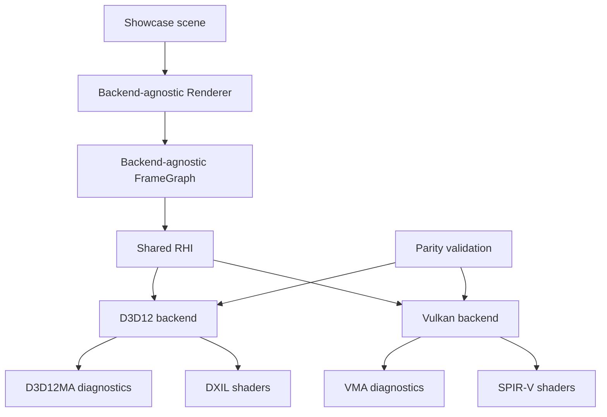

The final result should feel boring in the best way: Renderer code asks for resources, views, bindings, passes, barriers, and diagnostics through one RHI contract. D3D12 and Vulkan do the hard native work privately. The codebase becomes easier to reason about because supporting two explicit APIs forced Sparkle to name its real engine concepts.
